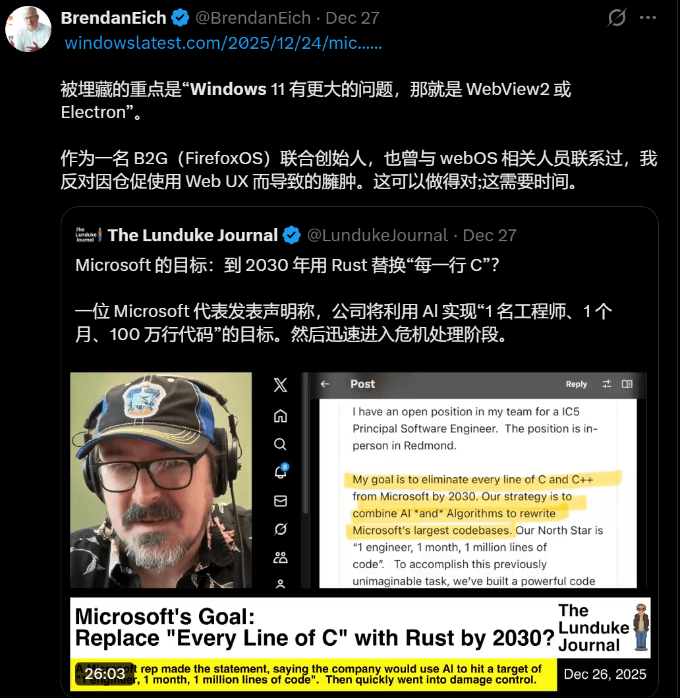

# JavaScript 之父怒喷 Electron：性能差，太臃肿！

微软正将Win11大量功能（Discord、Teams、开始菜单等）塞进WebView2/Electron“壳”中，臃肿的“Web化”设计导致高内存、卡顿，惹恼了JavaScript之父、Mozilla联合创始人兼Brave浏览器CEO Brendan Eich——这位深耕Web技术领域的权威人士，直接痛批这种仓促替代原生体验的做法，正在毁掉Windows核心优势。

### 大佬震怒：不是Web技术不行，是微软太敷衍

风波源于Win11“Web劣化”报道，Eich作为Web技术权威，直指核心：“Win11症结在WebView2/Electron，为省时间用Web替代原生必致臃肿，Web应用能做好，但需足够优化时间。”

Eich否认“Web化是为锁定订阅用户”，直言乱象源于商业动机（买断转订阅、债务驱动等），还指出NPM包管理器加速开发的同时，埋下了Web应用臃肿隐患。

### 这些Win11应用，被Web技术拖垮成“性能黑洞”

Web化引发的性能问题触目惊心，覆盖第三方应用与系统核心功能。

1. Discord：Electron架构致内存最高达4GB，官方仅用“超阈值自动重启”治标，后续优化仅降5%内存，用户无感。
2. Teams & WhatsApp：依赖WebView2，Teams闲置内存1-2GB，仅拆分通话进程避卡顿；WhatsApp曾升级原生版内存降至200MB内，后因团队裁撤改用WebView2，内存飙至1GB+（原生版7倍）。
3. 系统功能：通知中心Agenda视图等核心功能用WebView2构建，打开即新增Edge进程，内存从1MB飙至100MB；开始菜单、搜索界面也用Web框架，成性能瓶颈。

### 核心矛盾：3.5万亿市值巨头，为何连原生UI都懒做？

市值3.5万亿美元的微软不愿为基础功能做原生UI，核心是技术向商业利益妥协——Web开发能缩短周期、降低跨平台成本，却将性能代价转嫁给用户。

这还形成恶性循环：Web化致性能下降倒逼用户升级硬件，硬件升级又让企业忽视优化，最终由用户买单。

### 行业警示：Web技术不该是“偷懒”借口

Eich的批评也是行业警示：Web技术有价值，但不能成为偷懒借口。Web应用能做好，但需优化打磨，而非快速打包甩锅用户。

用户对Win11 Web化乱象早已忍无可忍，唯有不满倒逼企业反思，才能让流畅的原生体验回归核心——技术终究要服务用户，而非商业妥协的牺牲品。

## 结语

我是林三心，一个待过**小型toG型外包公司、大型外包公司、小公司、潜力型创业公司、大公司**的作死型前端选手

我建了一些**前端学习群**，如果大家想进群交流前端知识，可以关注我，回复**加群**

