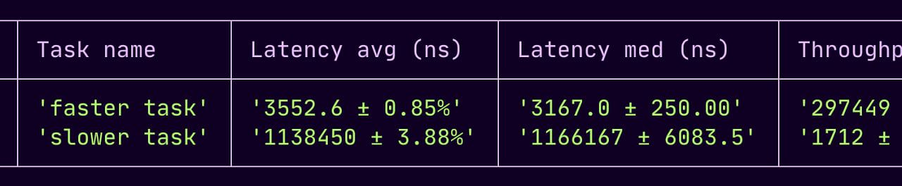
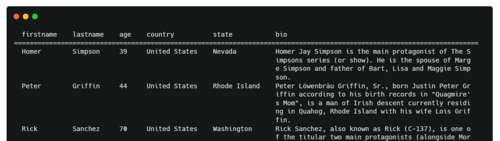
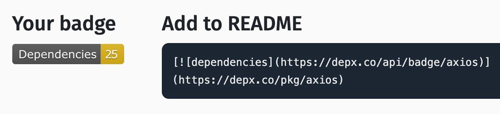

# Comparing performance across Node versions and ARM vs x86

  
- [Tinybench 6.0: A Tiny, Simple Benchmarking Library](https://github.com/tinylibs/tinybench "github.com") — Uses whatever precise timing capabilities are available (e.g. `process.hrtime` or `performance.now`). You can then benchmark whatever functions you want, specify how long or how many times to benchmark for, and get a variety of stats in return – it runs across multiple runtimes, too. [GitHub repo.](https://github.com/tinylibs/tinybench) **_\--- Tinylibs_**
  
- [93% Faster Next.js in (Your) Kubernetes](https://blog.platformatic.dev/93-faster-nextjs-in-your-kubernetes "blog.platformatic.dev") — Matteo Collina examines the performance improvements Platformatic’s [Watt application server](https://github.com/platformatic/platformatic#readme) can offer Node apps with CPU-bound workloads that are struggling to scale. **_\--- Matteo Collina (Platformatic)_**
  
- [API Design in Node](https://frontendmasters.com/courses/api-design-nodejs-v5/?utm_source=email&utm_medium=nodeweekly&utm_content=nodejsv5 "frontendmasters.com") — Ready to build scalable APIs with Node and Express? Join Scott Moss for this video course and learn RESTful API design, testing techniques, authentication and authorization, error handling, and more. Create a production deployment and ship your next API today! **_\--- Frontend Masters sponsor_**
  
- 📈 [Comparing _AWS Lambda_ ARM64 vs x86 Performance Across Runtimes and Node Versions](https://chrisebert.net/comparing-aws-lambda-arm64-vs-x86_64-performance-across-multiple-runtimes-in-late-2025/ "chrisebert.net") — A developer puts Node.js, Python, and Rust through their paces on Amazon’s serverless platform. On the Node side, Node 22 beats Node 20 by 8-11% across the board, but Node functions on ARM run even faster than on x86. Chris concludes: _“Switching to arm64 is the easiest performance win you can get.”_ As always with benchmarks, your own results may vary. **_\--- Chris Ebert_**

**IN BRIEF:**

- [Express v5.2 was released yesterday](https://github.com/expressjs/express/releases/tag/v5.2.0) but note that v5.2.1 followed today, [reverting a security fix in 5.2.0](https://github.com/expressjs/express/pull/6933#issuecomment-3602268351) that would have broken apps in certain situations. [v4.22.0](https://github.com/expressjs/express/releases/tag/4.22.0) and [v4.22.1](https://github.com/expressjs/express/releases/tag/v4.22.1) were also released and follow the same pattern.
- Node 24 LTS is now available [for builds and functions on Vercel.](https://vercel.com/changelog/node-js-24-lts-is-now-generally-available-for-builds-and-functions)
- We featured news about the 'Shai-Hulud 2.0' npm worm issue last week, but [DataDog has published a good summary of what's going on.](https://securitylabs.datadoghq.com/articles/shai-hulud-2.0-npm-worm/)
- The Electron project has [entered a 'quiet month'](https://www.electronjs.org/blog/dec-quiet-period-25) to give the maintainers a rest before getting back to full steam in January. They also use the post to review what happened with Electron in 2025.
- We picked up on the release of Prisma 7 last week, but missed [the official release post](https://www.prisma.io/blog/announcing-prisma-orm-7-0-0) which does a great job of explaining its full value proposition.

  
- [Node.js 24 Runtime Now Available in AWS Lambda](https://aws.amazon.com/blogs/compute/node-js-24-runtime-now-available-in-aws-lambda/ "aws.amazon.com") — We noticed this briefly last week, but now there’s a full blog post showing off what’s new with Node.js on Amazon’s serverless platform. It also acts as a good quick primer on what changed in Node.js 24 overall, even if you don’t use Lambda. **_\--- Amorosi and Tuliani (Amazon)_**

> 💡 AWS Lambda has also [introduced 'Managed Instances'](https://aws.amazon.com/blogs/aws/introducing-aws-lambda-managed-instances-serverless-simplicity-with-ec2-flexibility/) if you want to keep Lambda's serverless workflow but running on EC2 instances of your own.

  
- [Wrangling My Email with Claude Code](https://jlongster.com/wrangling-email-claude-code "jlongster.com") — James shows how you can use Claude’s [‘agent skills’](https://www.claude.com/blog/skills) to run a Node app that fetches your email from Gmail for Claude Code to analyze. This is a good explanation of a powerful Claude feature I've been playing with a lot myself recently. **_\--- James Long_**
  
- [Add eSignatures to Your App in Minutes](https://developer-api.foxit.com/developer-blogs/compliance-security/audit-trails/embed-secure-esignatures-into-your-app-with-foxit-api/?utm_source=cooperpress&utm_medium=Display&utm_campaign=12-02-25 "developer-api.foxit.com") — Use the Foxit eSign API to send, sign, and track agreements with just a few lines of Python. **_\--- Foxit Software sponsor_**
  

- 📄 [Improving TTFB and UX with HTTP Streaming](https://calendar.perfplanet.com/2025/improve-ttfb-and-ux-with-http-streaming/) **_\--- Mauro Bieg_**
- 📄 [How Does cgroups v2 Impact Node.js in OpenShift 4?](https://developers.redhat.com/articles/2025/11/27/how-does-cgroups-v2-impact-java-and-nodejs-openshift-4) **_\--- Francisco De Melo Junior (Red Hat)_**
- 📄 [Category Theory for JavaScript Developers](https://ibrahimcesar.cloud/blog/category-theory-for-javascript-typescript-developers/) **_\--- Ibrahim Cesar_**

## 🛠 Code & Tools

  
- [Voici.js 3.0: Pretty Table Printing for the Terminal](https://voici.larswaechter.dev/ "voici.larswaechter.dev") — If you’ve got a collection of large objects to print out, this could be ideal as it can format them into a table, dynamically size the columns as appropriate, [sort the output](https://voici.larswaechter.dev/examples/sorting), and let you add styling into the mix ([including colors.](https://voici.larswaechter.dev/examples/styling/colors)) – [GitHub repo.](https://github.com/larswaechter/voici.js) **_\--- Lars Waechter_**
  
- [Chokidar 5.0: Efficient Cross-Platform File Watching Library](https://github.com/paulmillr/chokidar "github.com") — Wraps around `fs.watch` / `fs.watchFile` and normalizes the events received, applies some best practices, OS-specific fixes (like macOS events reporting filenames), and presents an API that works the same across different platforms. v5.0 sees the package go ESM-only. **_\--- Paul Miller_**
  
- [readdirp 5.0: Recursive Version of `fs.readdir` with a Streaming API](https://github.com/paulmillr/readdirp "github.com") — An efficient way to read the contents of a directory and, recursively, any child directories. **_\--- Paul Miller_**
  
- [binary-parser 2.3: Declarative Parser Builder for Binary Data](https://github.com/keichi/binary-parser "github.com") — Chain together methods to define binary structures which can then be used in parsing real data. For example, a IP packet header parser might begin `.endianness("big")​.bit4("version")​.bit4("headerLength")` and so on. **_\--- Keichi Takahashi_**
  
- [Better Auth: A Comprehensive Authentication Framework for TypeScript](https://www.better-auth.com/ "www.better-auth.com") — A framework-agnostic authentication and authorization framework that provides email and password-based auth, OAuth and social sign-in, account and session management, 2FA, and more. [v1.4](https://www.better-auth.com/blog/1-4) was just released with stateless/database-free session management support. **_\--- Better Auth_**
- [Playwright 1.57](https://github.com/microsoft/playwright/releases/tag/v1.57.0) – Microsoft's browser/Web automation library now has a 'speedboard' tab in its HTML reports to show you your tests sorted by slowness. It also switches from Chromium to [Chrome for Testing](https://developer.chrome.com/blog/chrome-for-testing/).
- [pnpm 10.24](https://pnpm.io/blog/releases/10.24) – The fast, efficiency-focused package manager gains adaptive network concurrency to download packages even faster.
- [Sidequest 1.13](https://sidequestjs.com/) – Scalable background job processor for Node apps. Note the LGPL license.
- [better-sqlite3 v12.5.0](https://github.com/WiseLibs/better-sqlite3) – Popular small SQLite3 library. Now using SQLite 3.51.1.
- [node-rate-limiter-flexible v9.0](https://github.com/animir/node-rate-limiter-flexible) – Now with Mongoose 9 support.
- [Neutralinojs 6.4](https://neutralino.js.org/docs/release-notes/framework#v640) – Lighter alternative to Electron.
- [NodeBB 4.7](https://github.com/NodeBB/NodeBB/releases/tag/v4.7.0) – Node.js-powered forum system.
- [ESLint v10.0.0 Alpha 1](https://eslint.org/blog/2025/11/eslint-v10.0.0-alpha.1-released/)

> **📰 CLASSIFIEDS**
> 
> 🐱 [ConfigCat Feature Flag Service](https://configcat.com/promotions/node-weekly/?utm_source=cooperpress_newsletter&utm_medium=sponsor&utm_campaign=cooperpress_node_202510) lets you release and roll back features safely without code changes. Set it up in minutes! [Save 25% now!](https://configcat.com/promotions/node-weekly/?utm_source=cooperpress_newsletter&utm_medium=sponsor&utm_campaign=cooperpress_node_202510)
> 
> ---
> 
> **Drop-in e-signatures for your app** — [BoldSign](https://boldsign.com/electronic-signature-sdk/?utm_source=cooperpress&utm_medium=cpc&utm_campaign=nodeweekly_classified) SDK with sample code, webhooks, and a free sandbox. [Get your free API key](https://boldsign.com/esignature-api/?utm_source=cooperpress&utm_medium=cpc&utm_campaign=nodeweekly_classified).
> 
> ---
> 
> [The Road to Next](https://www.road-to-next.com/?utm_source=node_weekly&utm_medium=referral&utm_campaign=next_course) is a course by Robin Wieruch for learning full-stack web development with Next.js 15 and React 19. The perfect match for JavaScript developers ready to go beyond the frontend.

## 📢  Elsewhere in the ecosystem

A roundup of some other interesting stories in the broader landscape:

- [DepX's badge generator](https://depx.co/badge) gives you a graphical badge _(above)_ you can include in your README or on your project site to show how many (or how few!) dependencies your npm package has.
- 🎄 Puzzlers rejoice! [_Advent of Code_ is back](https://adventofcode.com/) for another year. This time we get 12 days of puzzles instead of the usual 25, making it easier to complete.. we hope!
- 🔒 _Let's Encrypt_ has announced that it's gradually reducing the validity period of certificates it issues [from 90 days to 45 days over the next two years.](https://letsencrypt.org/2025/12/02/from-90-to-45.html) If you have a process for obtaining certificates from them, you'll want to ensure it's robust enough to handle the change.
- [Over 150 algorithms and data structures demonstrated in JavaScript.](https://github.com/trekhleb/javascript-algorithms) Examples of many common algorithms and data structures with explanations. Available in eighteen written languages.
- The Piccalilli team has made the [Introduction to Asynchronous JavaScript](https://piccalil.li/javascript-for-everyone/lessons/48) chapter of their [JavaScript for Everyone](https://piccalil.li/javascript-for-everyone/lessons) course free to read online.
- [Brimstone](https://github.com/Hans-Halverson/brimstone) is another new JavaScript engine on the block (joining [the hundreds of others](https://zoo.js.org/)) but has strong language support (97% of the spec), is written in Rust, and is _very_ small.
