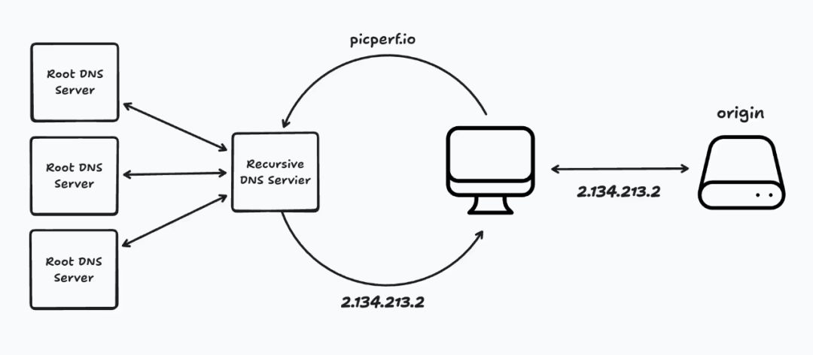
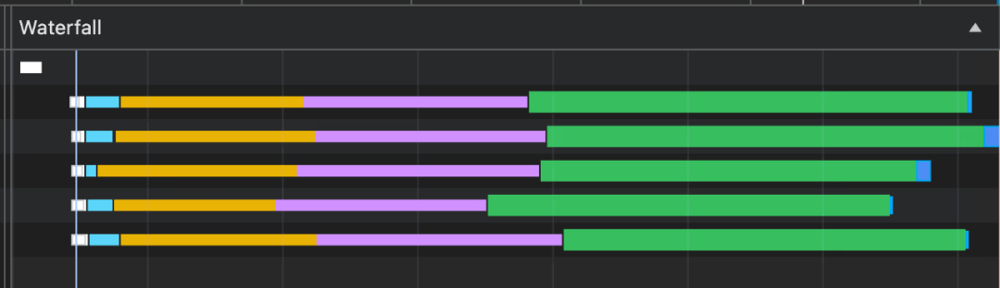
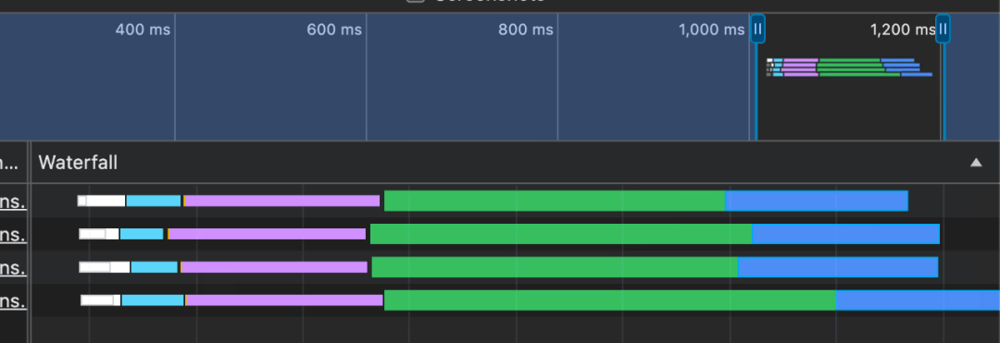
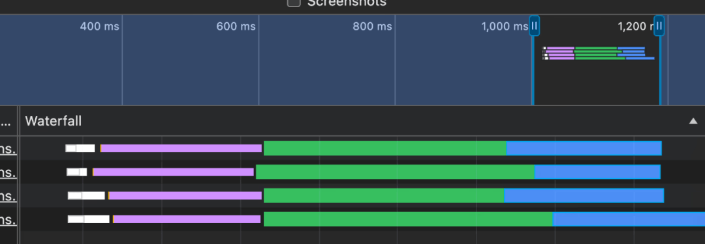
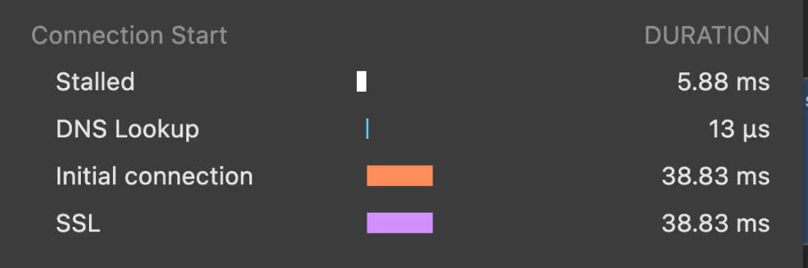
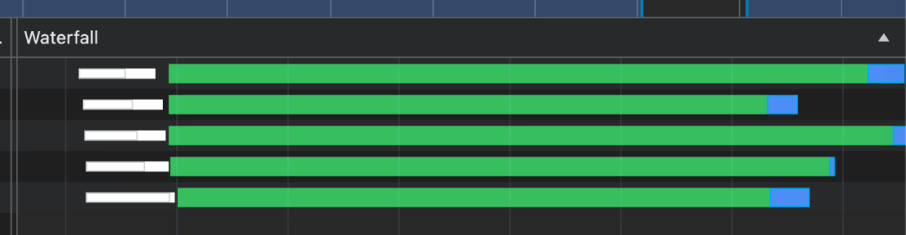
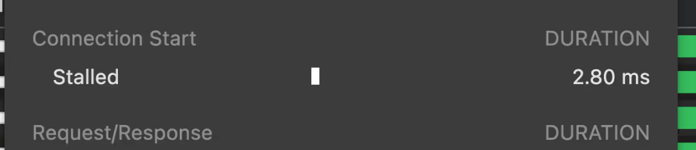
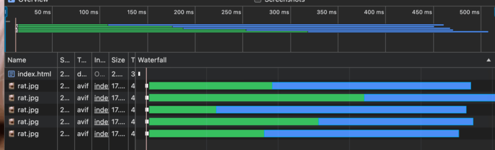

# 【第3617期】DNS 解析的成本

前言

探讨了 DNS 解析对前端性能的影响，并介绍了 dns-prefetch 资源提示如何通过提前解析 DNS 来提升性能，同时还对比了 dns-prefetch、preconnect 和 preload 三种资源提示的使用场景和效果。今日前端早读课文章由 @Alex MacArthur 分享，@飘飘编译。

译文从这开始～～

> DNS 解析成本低廉，但并非免费的。在一些关键场景下，使用 `dns-prefetch` 这种资源提示，可以让你在前端性能上获得细微但真实的提升。

我很喜欢那种通过一些小技巧快速提升网站前端性能的成就感。最近，我在研究现代浏览器提供的各种资源提示（resource hints），这类小细节里常常藏着 “性能红利”。

其中有一个我特别感兴趣 ——DNS 预解析（DNS Prefetching）。近年来它不像 `preload` 这样热门，但在特定情况下，它能带来显著优势。尤其当你的网站在访问过程中可能与第三方域名产生交互时，合理使用它就能发挥作用。理解这些条件不仅能帮助你获得性能上的收益，还能让你更熟悉 DNS 解析本身 —— 这是整个互联网的核心环节之一，绝对值得花时间研究。

#### DNS 是一切的基础

每当发生大规模网络故障时，都会有一句流行的梗：“问题总是出在 DNS 上。” 这话其实很有道理。DNS 是互联网的基础技术之一，但人们往往对它视而不见，直到出问题才意识到它的重要性。

从概念上来说，DNS 并不复杂。人们常把它比作 “互联网的电话簿”，这个比喻非常贴切。

我们来看看浏览器访问 `picperf.io` 时的一个极简过程：

1、用户在浏览器中输入 `picperf.io` 并发出请求。看起来像是直接访问这个域名，但其实这只是一个 “幌子”。PicPerf 的源服务器真正存在于一个与该域名对应的 IP 地址上，浏览器需要找到这个 IP 才能发出请求。因此，下一步就是去查这个地址。

2、查找过程从递归 DNS 服务器开始。这个服务器就像客户端和存储域名 - IP 映射的服务器之间的中介。可以把它想象成一个你雇来帮忙 “破案” 的侦探。

3、这个 “侦探” 会依次询问不同的 DNS 服务器，最终找到包含所有记录（A、TXT、CNAME 等）的 “权威服务器”（authoritative server）。它从顶级域（TLD）开始，一步步追溯到目标。

4、找到结果后，递归 DNS 服务器会把 IP 地址返回给浏览器 ——“侦探任务完成”。

5、然后 PicPerf 的源服务器接收到请求并返回响应。

[【早阅】CF-DOH：通过JavaScript查找DNS记录](https://mp.weixin.qq.com/s?__biz=MjM5MTA1MjAxMQ==&mid=2651273405&idx=1&sn=9302d2ebae808055a6e8de62a0be37a3&scene=21#wechat_redirect)

这里通常会配上一张 DNS 解析流程图，帮助理解。



不过需要注意的是，这里没有展示浏览器到服务器之间各种层级的缓存机制和复杂性。那些是另一条深不可测的 “兔子洞”，我们暂且不深入。

#### 小开销也能积累起来

当 DNS 记录配置正确时，整个解析过程非常快，几乎不用担心。但问题在于，大多数网站并不只请求自身域名下的资源，往往会访问多个第三方域名。这样一来，解析时间就可能快速叠加。

我自己用 Puppeteer 写了个脚本，加载网页、滚动到底部，并统计所有资源的 DNS 解析时间。以下是几次 “冷启动” 访问（即没有缓存）时的一些结果，仅供参考：

- ebay.com：6 个不同主机，共计 117.47ms
- rd.com：5 个不同主机，共计 108.89ms
- msn.com：12 个不同主机，共计 306.56ms
- temu.com：9 个不同主机，共计 108.25ms

当然，这些汇总数字并不能说明这些解析在页面加载的哪个阶段发生，只能说明它们确实存在。它们很好地说明了一个事实：与多个域名交互的成本绝不为零。

举个例子：我从五个不同的域名加载了同一张图片：

```
 
 
 
 
 
```
页面加载后，你可以在网络瀑布图中看到这样的情况：



每种颜色代表请求生命周期的不同阶段，其中浅蓝色（从左数第二段）表示 DNS 解析阶段。由于这些图片都来自不同的域名，因此每个都要单独解析。

对于这种 “新” 的请求，我们其实没什么能做的，浏览器的预加载扫描器会在文档解析时提前识别这些资源并尽快发起请求。不过，对于那些延迟加载（lazy-load）或后期才发现的资源，情况就更复杂了。

[【第3576期】前端的随机魔法：CSS random() 全解析](https://mp.weixin.qq.com/s?__biz=MjM5MTA1MjAxMQ==&mid=2651277311&idx=1&sn=34cdfc8b9846c4d79daeea52e64f8f36&scene=21#wechat_redirect)

#### 提前准备：使用 DNS Prefetching

我们来稍微改造一下页面。与其一开始就加载所有图片，不如用 JavaScript 实现 “延迟加载”—— 在页面加载一秒后再把这些图片动态插入页面中。不过，不是每次都加载所有图片，而是 “抛硬币” 随机决定是否从某个主机加载：

```
 const hosts = [
   "picperf.io",
   "images.macarthur.me",
   "images.jamcomments.com",
   "images.plausiblebootstrapper.com",
   "images.typeitjs.com",
 ];

 function loadImage(host) {
   // 随机决定是否加载该主机的图片
   if (Math.random() < 0.5) return;

   const img = new Image();
   img.src = `https://${host}/img/4CAF9H/rat.jpg?${Math.random()}`;
   document.body.appendChild(img);
 }

 setTimeout(() => hosts.map(loadImage), 1000);
```
可以把这种 “抛硬币” 的逻辑理解为页面上的某种不确定行为，比如用户输入、网络状况，或者其他各种条件。重点在于：页面可能会与这些主机通信，但不一定会。

在这种情况下，浏览器的预加载扫描器无法提前知道哪些资源需要解析，因此每个 DNS 解析都必须等到请求真正开始时才触发。下图展示了这种情况：



未使用 dns-prefetch 的瀑布图

既然在页面加载过程中，每个主机都有可能被访问，那么我们可以提前一步，让浏览器预先解析这些域名的 DNS。DNS 预解析的开销非常小，几乎可以忽略不计，因此即使最终没用到，也不会造成浪费。

[DNS预获取（dns-prefetch）](https://mp.weixin.qq.com/s?__biz=MjM5MTA1MjAxMQ==&mid=200026218&idx=1&sn=8c0a6b737daaa12e46a2bfce302fbe36&scene=21#wechat_redirect)

我们可以通过 `dns-prefetch` 资源提示来实现 —— 为每一个可能交互的域名添加一条：

```
 <head>
   <link rel="dns-prefetch" href="https://picperf.io" />
   <link rel="dns-prefetch" href="https://images.macarthur.me" />
   <link rel="dns-prefetch" href="https://images.jamcomments.com" />
   <link rel="dns-prefetch" href="https://images.plausiblebootstrapper.com" />
   <link rel="dns-prefetch" href="https://images.typeitjs.com" />
 </head>
```
添加后，再来看一下加载瀑布图 —— 你会发现 “DNS Lookup” 阶段几乎完全消失了。



使用 dns-prefetch 后的瀑布图



dns-prefetch 连接详情图

这意味着当浏览器真正发起图片请求时，它已经提前获取了对应的 IP 地址。虽然这种优化不会带来 “惊天动地” 的性能提升，但让加载曲线更平滑、更高效，总是令人满意的。

#### DNS 预解析（Prefetching）、预连接（Preconnecting）与预加载（Preloading）

虽然本文的重点在于 DNS 预解析，但另外两个常被同时提及的资源提示 ——preconnect 和 preload—— 也值得花点时间了解。（可能你也想到过 `prefetch`，不过由于浏览器支持仍不完善，现在更推荐使用 Speculation Rules API 来代替它。）

这三种提示都在资源请求生命周期中扮演不同的角色：

- dns-prefetch：只提前解析 DNS，其他部分交由浏览器处理。
- preconnect：提前与服务器建立完整连接（包括 DNS 解析、TCP 握手、TLS 协商），剩下的部分仍由浏览器负责。
- preload：直接发起完整的资源请求，从头到尾获取文件。

它们的 “成本” 各不相同，因此选择哪种方式取决于你是否确定某个资源会在稍后被使用。以下是常见的决策参考：

- ✅ 使用 dns-prefetch：当你的页面可能会从外部域名加载资源，或依赖多个第三方主机的内容时。这种提示成本最低，能为可能的请求争取一点 “领先时间”。
- ⚡ 使用 preconnect：当你确定用户很快会从某个域名下载资源时，可以提前建立连接，让浏览器在真正请求时直接进入正题。但要适度使用 —— 它比 dns-prefetch 开销更高，而且对那些已经在 HTML 中明确引用的资源没必要使用。
- 🚀 使用 preload：当你有特定的、高优先级资源（例如 CSS 中引用的字体）确定会在页面生命周期中加载时，这是最直接的方式。

当然，这些规则并非绝对，实际情况可能受多种因素影响。但如果用得恰当，它们能带来不错的性能提升。

#### 体验 preconnect 与 preload

在理解了这些之后，我们进一步看看它们的效果。假设我们已经确定之前示例中的所有图片都会被下载，那么使用 preconnect 来提前建立连接就是个不错的主意。

[【第1053期】Preload，Prefetch 和它们在 Chrome 之中的优先级](https://mp.weixin.qq.com/s?__biz=MjM5MTA1MjAxMQ==&mid=2651226947&idx=1&sn=9fe257b2fdbb2204f6fd4cf76b4cfb6d&scene=21#wechat_redirect)

可以为每个不同的域名添加如下提示：

```
 <link rel="preconnect" href="https://images.macarthur.me" />
 <link rel="preconnect" href="https://images.jamcomments.com" />
 <link rel="preconnect" href="https://images.plausiblebootstrapper.com" />
 <link rel="preconnect" href="https://images.typeitjs.com" />
```
这些提示会告诉浏览器提前建立与源服务器的完整连接，而不去下载任何资源。也就是说，它会提前完成 DNS 解析、TCP 握手 和 TLS 协商，让后续的请求能直接进入数据传输阶段。  



preconnect 瀑布图

在加载瀑布图中，你会看到对应的 DNS、连接初始化以及 SSL 阶段几乎消失：  



你可能已经能猜到，如果我们使用更激进的 preload 提示会发生什么。

这次，我们明确指定每一张图片的路径：

```
 <link rel="preload"
       as="image"
       href="https://picperf.io/img/4CAF9H/rat.jpg" />
 <link rel="preload"
       as="image"
       href="https://images.macarthur.me/img/4CAF9H/rat.jpg" />
 <link rel="preload"
       as="image"
       href="https://images.jamcomments.com/img/4CAF9H/rat.jpg" />
 <link rel="preload"
       as="image"
       href="https://images.plausiblebootstrapper.com/img/4CAF9H/rat.jpg" />
 <link rel="preload"
       as="image"
       href="https://images.typeitjs.com/img/4CAF9H/rat.jpg" />
```
这时，图片会在页面加载后的几毫秒内直接开始下载，并在真正需要显示时立即渲染：



preload 瀑布图

> 🔎 注意事项：使用 preload 时要精确指定资源的 URL。哪怕查询参数中有一个字符不同，浏览器也会把它视为全新的资源，从而导致重复下载。要小心这个 “坑”。

#### 大胆的想

DNS 预解析、预连接、预加载这些技术并不会让页面性能发生 “质变”，它们更像是外科手术刀，而不是电锯。但它们非常实用 —— 在合适的场景中可以带来小而真实的优化。再加上其他性能调优手段，你的站点可能会获得比预期更明显的速度提升。

谁知道呢？也许这会带来转化率飙升、收益增长，甚至让你成为前端性能优化界的传奇人物 —— 说不定哪天财政部长还会考虑把你的头像印在钞票上。

当然啦，我只是做个梦而已 😄

关于本文  
译者：@飘飘  
作者：@Alex MacArthur  
原文：https://macarthur.me/posts/dns/

这期前端早读课  
对你有帮助，帮” 赞 “一下，  
期待下一期，帮” 在看” 一下。
