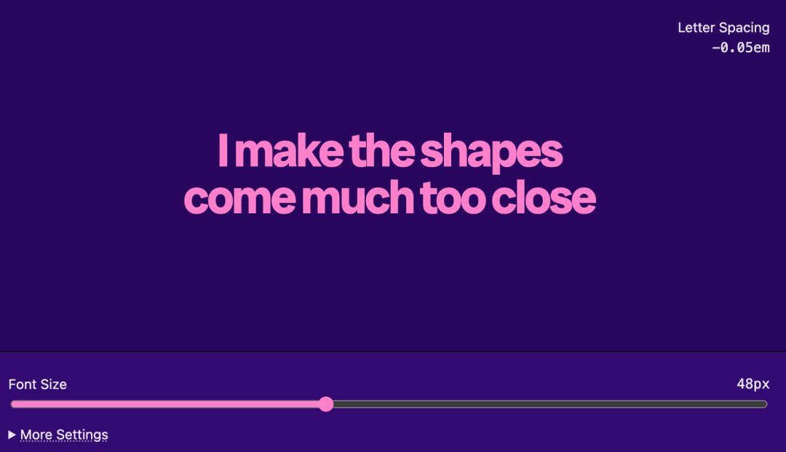
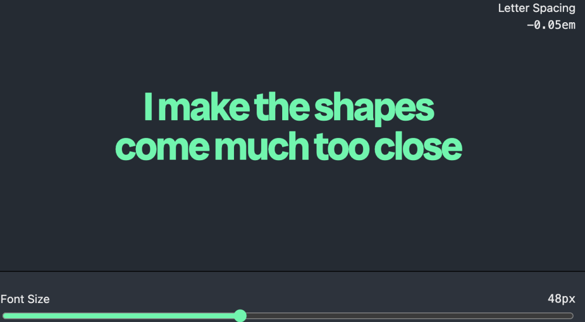

# 【第3619期】让字距随字体自适应变化的 CSS 技巧

前言

探讨了如何通过 CSS 实现响应式字母间距，以解决在不同字体大小下保持文本可读性和设计一致性的问题。今日前端早读课文章由 @Tyler Sticka 分享，@飘飘编译。

译文从这开始～～

今年早些时候，一位长期合作的客户分享了他们新版的品牌规范。其中最引人注意的变化是字体设计的调整 —— 标题使用了更粗的字重，并要求将所有文字的 `letter-spacing` 整体收紧一定比例。

[【第3600期】CSS Grid：一个实用的思维模型与网格线的强大之处](https://mp.weixin.qq.com/s?__biz=MjM5MTA1MjAxMQ==&mid=2651277638&idx=1&sn=c62633fdee3bb8c02004898d5e9d366b&scene=21#wechat_redirect)

虽然这种做法在印刷品和某些其他应用场景中效果不错，但在网页和数字环境中却显得有点过头。文字越小，留白越少，可读性就越差：

（收紧字距后）标题看起来还可以…… 但较小的文字就变得相当难读。每个字符的像素有限，负空间（空白）又被压缩太多。文字越长，阅读起来就越吃力。

于是有人提出一个折中方案：只在字体尺寸达到一定大小时再应用字距收紧。然而，经过测试后发现，这种方式在视觉上显得不太协调 —— 紧凑的标题旁边配着宽松的副标题，看起来不统一，也不和谐。

我们真正想要的是一种渐进的过渡：随着 `font-size` 的增大，`letter-spacing` 逐步减小。而且最好这种变化能自动、全局生效。

幸运的是，现代 CSS 可以轻松实现这一效果，而且只需要一条规则：

```
 * {
   letter-spacing: clamp(
     -0.05em,
     calc((1em - 1rem) / -10),
     0em
   );
 }
```
随着字体尺寸的增大，字距会逐渐减小，直到达到设定的最小值。

**CSS**



```
 :root {
   --font-size: 48px;
   --letter-spacing-min: -0.05em;
   --letter-spacing-divisor: -10;
 }

 .tester {
   font-size: var(--font-size);

   &.enabled {
     letter-spacing: clamp(
       var(--letter-spacing-min),
       calc((1em - 1rem) / var(--letter-spacing-divisor)),
       0em
     );
   }
 }

 /* Demo stuff */

 :root {
   --color-bg: #2a085e;
   --color-text: hsl(0 0% 100% / 0.9);
   --color-accent: #ff80ca;
 }

 body {
   background: var(--color-bg);
   color: var(--color-text);
   color-scheme: dark;
   display: grid;
   font-family: system-ui, sans-serif;
   grid-template-rows: 1fr auto;
   line-height: 1.5;
   margin: 0;
   min-block-size: 100svh;
 }

 code {
   font-family: ui-monospace, monospace;
 }

 .tester {
   color: var(--color-accent);
   font-family: "Radio Canada Big", sans-serif;
   font-weight: 700;
   line-height: 1;
   padding: 0.25lh;
   text-align: center;
   text-wrap: balance;
 }

 figure {
   display: grid;
   grid-template-columns: minmax(0, 1fr);
   grid-template-rows: minmax(2lh, 1fr) auto minmax(2lh, 1fr);
   margin: 0;
   padding: 1rlh;

   figcaption {
     align-self: start;
     display: grid;
     font-size: calc(14em / 16);
     justify-self: end;
     text-align: right;
   }
 }

 input {
   accent-color: var(--color-accent);
 }

 input[type="checkbox"] {
   block-size: 1lh;
   inline-size: 1lh;
 }

 input[type="range"] {
   cursor: pointer;
 }

 button {
   font: inherit;
 }

 form {
   background-color: var(--color-bg);
   background-color: hsl(from var(--color-bg) h s calc(l * 1.2) / 0.95);
   box-shadow: 0 -1px hsl(0 0% 0% / 1);
   display: grid;
   font-size: calc(14em / 16);
   inset-block-end: 0;
   padding: 1rlh;
   position: sticky;
   row-gap: 0.5lh;

   div:has(> input[type="range"]) {
     column-gap: 1lh;
     display: grid;
     grid-template-columns: minmax(0, 1fr) auto;

     > input {
       grid-column: 1 / -1;
     }

     > code {
       grid-column: 2;
       grid-row: 1;
     }
   }

   details > summary {
     cursor: pointer;
     text-decoration: underline;
     text-decoration-style: dotted;

     &:not(:hover) {
       text-decoration-color: hsl(from currentColor h s l / 0.5);
     }
   }

   details > div {
     align-items: center;
     display: grid;
     grid-template-columns: minmax(0, 1fr) auto;
     gap: 1lh;
     padding-block-start: 1lh;

     > label {
       align-items: center;
       display: flex;
       gap: 0.5em;
       justify-self: start;
     }

     > div {
       grid-column: 1 / -1;
     }
   }
 }

 .hidden-visually {
   border: 0;
   clip: rect(0 0 0 0);
   height: 1px;
   margin: -1px;
   overflow: hidden;
   padding: 0;
   position: absolute;
   width: 1px;
 }
```
demo 示例：https://codepen.io/tylersticka/pen/bNVEEez

#### 工作原理

首先，我们使用了通配选择器 `*`。这表示该规则会应用到所有元素上，并根据每个元素自身的 `font-size` 来计算字距值。（根据项目情况，你也可以只针对特定元素应用，或者用现代 CSS 技术如 `:where` 或 `@layer` 来微调优先级。）

[【第3576期】前端的随机魔法：CSS random() 全解析](https://mp.weixin.qq.com/s?__biz=MjM5MTA1MjAxMQ==&mid=2651277311&idx=1&sn=34cdfc8b9846c4d79daeea52e64f8f36&scene=21#wechat_redirect)

```
 * {
   /* 所有元素都生效！ */
 }
```
接下来，让我们拆解一下 `letter-spacing` 的计算方式。

`1em` 表示当前元素的字体大小，而 `1rem`（注意那个 “r”）表示根元素的字体大小。当我们用 `1em - 1rem` 相减时，就能得出当前文字相对于默认字体的 “增长幅度”：

```
 * {
   letter-spacing: calc(1em - 1rem);
 }
```
但这个方向是反的：我们想让字距 “收紧”，而不是随着字体变大而变宽。因此，我们可以除以一个负数，让变化方向反转，并让变化速率更平缓：

```
 * {
   letter-spacing: calc((1em - 1rem) / -10);
 }
```
最后，我们希望为这个计算结果设定一个上下限，以防字距变得过紧或过松。可以使用 `clamp()` 函数来设置最小值和最大值 —— 这里的例子是 `-0.05em`（相当于当前字体大小的 -5%）到 `0em`（当前默认间距）：

```
 * {
   letter-spacing: clamp(
     -0.05em,
     calc((1em - 1rem) / -10),
     0em
   );
 }
```
具体的最小值、最大值、变化速率（上例中的 `-10`）以及基准点（上例中的 `1rem`），会因项目需求而异。

在我们的案例中，最小值是根据客户品牌规范确定的，而其他参数则是在浏览器中反复调试得出的。

#### 近期可期待的改进

`progress()` 函数的出现，将使类似这种 CSS 规则更直观，不再需要复杂的数学计算或 “魔法数字”。

在这个例子中，我们可以基于当前字体大小 (`1em`) 在最小值与最大值之间的位置，用百分比来应用相同范围的字距变化：

```
 * {
   letter-spacing: calc(
     progress(1em, 18px, 48px) * -0.05em
   );
 }
```
目前，你可以在部分支持的浏览器（截至本文撰写时，Chrome 和 Edge）中尝试该用法。



示例 demo：https://codepen.io/tylersticka/pen/gbrWRVo

#### 使用时的注意事项

虽然我很喜欢解决这种响应式 CSS 的挑战，但我通常会避免在大多数正文或一般文字中频繁调整字距。  

除非是用于大标题、特殊风格的视觉排版或明确的功能性场景，否则过度修改字距容易破坏字体本身的节奏感。相比之下，选择一个更紧凑或更宽松的字体通常是更好的起点。

[【第3565期】纯 CSS 实现的滚动驱动动画指南](https://mp.weixin.qq.com/s?__biz=MjM5MTA1MjAxMQ==&mid=2651277161&idx=1&sn=cd4e01a321bec47536abda657bed9e5e&scene=21#wechat_redirect)

与不同客户合作的乐趣之一，正是要在各种独特的约束条件下取得理想结果。有时，这意味着你可以参与到字体选择等基础决策中；而更多时候，则需要理解那些让设计走到这一步的上千个决策，从而给出最合适的下一步建议。

在这些情况下，像这样的 “小技巧”（CSS 技巧）往往能派上大用场。

[【第3486期】AI 编程神器 Cursor 十大使用技巧：让代码更听你的话](https://mp.weixin.qq.com/s?__biz=MjM5MTA1MjAxMQ==&mid=2651276138&idx=1&sn=b29a8cf169eda6aace5f9b2bb7f80520&scene=21#wechat_redirect)

欢迎加入前端早读课-早说时间

关于本文  
译者：@飘飘  
作者：@Tyler Sticka  
原文：https://cloudfour.com/thinks/responsive-letter-spacing/

这期前端早读课  
对你有帮助，帮” 赞 “一下，  
期待下一期，帮” 在看” 一下。
