# 从应用架构的视角看退小宝AI助手落地现状


  

  

  

本文从应用架构视角系统分析了AI（尤其是LLM）在实际业务中落地的现状与挑战，以“退小宝AI助手”为典型案例，对比传统Web应用与AI应用在响应时间、输入灵活性、准确性、可用性、成本及嵌入适配性等维度的根本差异，指出AI原生应用（而非简单在旧系统中嵌入AI模块）是更可行路径；进而梳理了AI应用的典型架构演进：从简单调用模型API，到ReAct Agent范式，再到以Workflow（工作流）为核心的低代码图结构实现；深入解析了LLM、Message、Tool、RAG、上下文（State）、MCP、微调、可观测性（Trace）和评测等核心概念及其工程实践要点。  

  


前言

  

现在 AI ⾮常⽕，鄙⼈也做了⼀些尝试，今天想从应⽤架构的视⻆回头总结下我认知下的落地实际使⽤的 AI 产品到底是什么样的。业务架构上没有全局正确解，没有银弹，我想 AI 这个正快速发展的领域更加如此，本篇不奢求能够总结出全局最优解或正确解，希望能结合实践总结出⼀些基本原则。

  

AI 是⼀个⽐较⼤的概念，现在通常也局限指 LLM 相关的领域，本⽂也局限在⼤语⾔模型LLM 相关的应⽤上。本⽂主要专注于⼯程化地实现⼀个可以⽇常使⽤的 AI 应⽤，关于 LLM 的内部理论研究部分有提但不会涉及过多。

  

我们现在互联⽹应⽤主要由传统 Web 应⽤构成，应⽤在我们⽣活的⽅⽅⾯⾯，本⽂简单回顾这些应⽤想站在巨⼈的肩膀上探讨传统 Web 应⽤和 AI 应⽤结合的⽅式，AI 原⽣应⽤为什么会被强调。最后从常⻅框架和已经在我们业务上实际使⽤的退⼩宝 AI 助⼿（和淘天退货宝产品相关）来实践认识 AI 应⽤的基本构成概念。

  


回顾现有常见的业务应用架构

  

现在有原⽣ AI 应⽤（AI native application）的说法，本节希望回顾⼀下历史常⻅的业务应⽤架构，对⽐知道 AI 应⽤和⽼业务架构有什么主要的区别点，然后专注于为什么最新趋势是提倡原⽣ AI 应⽤，⽽不是在⽼的业务应⽤中插⼊ AI 的模块，知其然也知其所以然。

  

下⾯两个架构图是 gemini 画的，画架构图还挺耗时的，现在 AI 在⼀些⽅⾯表现还可以值得使⽤。

  

▐  简单的MVC架构

  

⽬前⼀些⾯向⼩⼆的后台运营平台还在使⽤简单的MVC模式做逻辑，确实简单便捷。这种架构通常我们戏称⼤量⼯作做 CRUD，其实在简单的后台应⽤中就应该使⽤这样的架构，在业务复杂性本身预测不会过快增⻓的情况下，越简单的架构越稳定、可靠、易维护，且新⼈易上⼿。

  

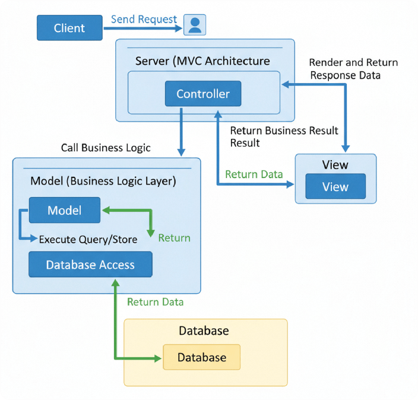

  

▐  ⽬前常⻅的分布式服务

  

现在的常⻅对客应⽤都是分布式的架构，我们常⻅的 APP、⽹站对应的背后的后端架构基本上是由多个服务组合起来组成完整的业务流程的。不过现在称不上“微”服务，很多服务内的逻辑和流程很复杂，这是当前的发展现状，在⼀个业务范围内能够做到合理的划分系统边界和领域，解决好分布式 CAP 取舍和稳定性保障，可以称得上好设计。现在的应⽤业务复杂性确实⽐较⾼，所以分布式的服务是现在对客业务应⽤架构的主流。

  

分布式架构下我们也戏称⼤量⼯作就是在做 API 调⽤，真实情况下复杂业务中的 API 设计和内部实现需要考虑领域间交互、跨语⾔兼容、序列化兼容、分布式事务、限流预案、复⽤扩展等等因素。

  

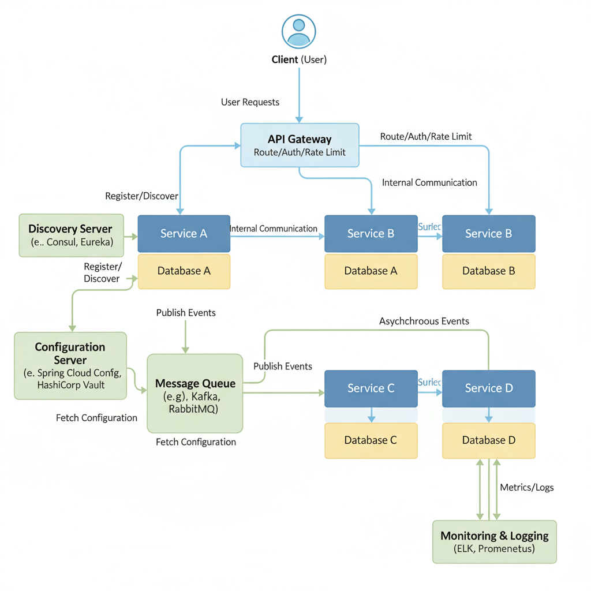

  

业务复杂以后避免不了⻓上下⽂的业务编排逻辑，避免不了异步触发等中继机制，现在⻓业务编排条理清晰的⽅式⼀般会有流程引擎的参与，当然流程引擎只是⼿段，只要代码设计的好，代码组织结构本身的可读性也可以⾮常好。以下为⼀种业务流程引擎样例，这⾥提流程引擎是因为 AI 应⽤中该范式出现更频繁，会详细在 AI 应⽤架构中探讨。

  

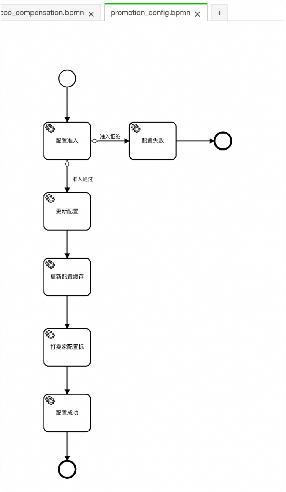

  

▐  普通业务应⽤架构可以和AI应⽤结合么？

  

虽然还没有介绍 AI 应⽤架构，但是可以在⼀些衡量指标对⽐维度上提前考虑两者的差异性和结合的可能性，提前得出⼀些结论确定适合的讨论⽅向。

  

业务/AI

对⽐维度

现有 Web 业务架构

AI 应⽤

对客响应时间

- 对客 api ⼊⼝的返回⼀般在 500ms内。
- 异步实时任务⼀般在 1s 内，客户可 能会主动刷新要求得到结果（⽐如贷款⽀⽤借款）。
- 后台批量处理任务可持续⼏分钟（⽐如历史⼏年账单下载）。

最快 3 秒开始输出第⼀个响应字符

输⼊意图灵活性输出创造性

输⼊不灵活，固定格式，固定语义。  

输出严格遵循幂等，准确响应

输⼊灵活，输⼊可以综合多次输⼊历史辅助。  

输出在内容上不严格⼀致，但是内容不会偏离主旨。在创作性、发散性的输出场景有独特优势。

可⽤性

全年 99.999%的可⽤性

现有算⼒⽬前可以达到⾼可⽤性。

Ai Studio 的仪表盘模型成功率作为⼀个参考，但是没有到 99%以上

结果准确性可靠性

天内最终⼀致，近100%

70%-90%的满⾜⽬标的采纳率

嵌⼊其他业务过程的适配性

适配性较⾼，只需要对⻬输⼊输出就可作为⼀个执⾏节点。

适配性低，要求业务过程有流式的兼容性、要容忍执⾏过程⼀定时间卡住。

成本

阿⾥云实名信息核验API

常⻅的阿⾥云 api 服务，以银⾏卡校验为 例，⼀次 0.5 元，该成本主要在于业务特 性，实际⼀般的⼀次 API 调⽤通常没有什么成本

百炼模型价格

以千问 Plus 为例，输⼊ 500token 输出 500token ⼀共 1.4 元，有⼯具调⽤⼀次简单的提问很容易达到。

  

通过以上⼀些维度的对⽐，看看两种业务架构紧密结合的⼀些可能性：

- Web 业务架构作为主体，其中嵌入 AI 应用作为节点
- 对客 api 要求的时延、准确性无解。适配性、可用性可通过编程做出一定解决
- 批量任务和异步任务在一些业务场景能够解决时延、和准确性的问题（比如下文提到的退货宝产品的日报产出 case）
- AI 应用作为主体，其中嵌入业务 Web 应用作为节点
- 目前 AI 应用大部分就是这么做的，业务 Web 应用接口作为工具概念，但是一般需要改造适配成 AI 友好型的接口设计。

  

场景⾦融部⻔还有⼀个很好的例⼦是《⼯单⾃动处理》，这个是在原阿⾥⼯单系统⾥⾛异步监听去交给 AI 处理，是⼀个 Web 应⽤⾥嵌⼊ AI 应⽤的⽐较好的例⼦，不过 AI 处理过程本身是完整且闭环的，设计 AI 处理过程时可以当成⼀个独⽴完整的 AI 应⽤设计。

  

结论：

在已有的 web 应⽤中嵌⼊ AI 节点的场景很少（不是没有）且兼容性差，AI 应⽤⾥将 Web 应⽤接⼝作为⼯具使⽤的场景⾮常普遍。所以 AI 原⽣应⽤的从头设计⾮常重要，在种种现状的限制下要考虑的⽅向是根据 AI 的种种特性（尤其是 LLM ⼤脑的特性）去设计⼀个相对独⽴完整的应⽤。

  


AI常见的落地架构

  

▐  简单使⽤模型提供商的⽣成API做AI应⽤

  

据观察当前部⻔内实际落地应⽤的 AI 产品，直接使⽤原⽣模型提供商的 API 做 AI 应⽤的落地使⽤并不理想，因为只依赖 LLM 和有限输⼊的提示词，结果不确定性较强。

  

目前有一个日报功能直接用 AI 做了分析，但是结果人工评测一般，总是会产生当前 AI 的发展真的可以么的疑问--！。    发现了纯 LLM 的第一个缺点：当前市面的 LLM（没错包括国外所谓强模）对数字的处理能力不强，（现在 LLM 一般有数学推理评测，但不是具体数字计算）常见的校验方法是不断给出多个数字数学问题（就常见计算、大小比较就行），或者询问固定逻辑的计算如时间戳。这是 LLM 本身的原理特性及训练出来的方式决定的（果然还是摆脱不了出身——！），所以后续出场的“工具”概念拥有了很大权重价值。

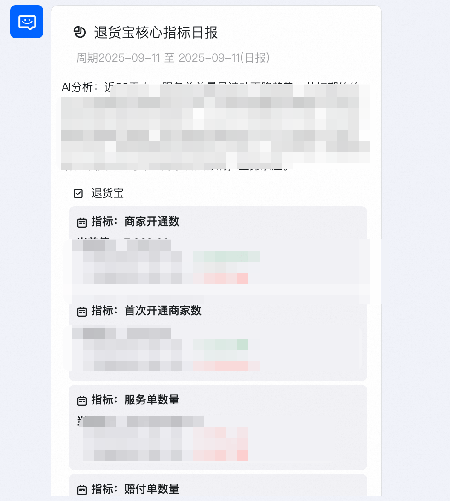

  

⽬前模型提供商还是⽐较多的，但是都兼容 Open Ai 的调⽤接⼝标准，因为 OpenAi ⽬前⾛在前列⾃然⽽然成了标准，下⽂介绍 MCP 时会感受到标准的落地是有⼀定曲折的。

  

本节认知到⼏个重要概念：

LLM ⼤语⾔模型，有不同的模型和模型提供商，⽐如 Qwen、GPT、Claude、Gemini 等，可以根据输⼊续写⽂本。

提示词，⼀般理解为告诉 LLM 的背景，让 LLM 快速理解⽤户给的提示，后⽂会继续深化挖掘这个概念，会有不⼀样的理解。

  

▐  从langgraph、dify、ideaLab等常⻅的AI框架或平台看架构

  

框架是实践经验发展验证的产物，⽐较常⽤的框架使⽤⽅式其实给出了当前 AI 应⽤最常⻅的架构。从简单的 AI 应⽤开始，引⼊必须要了解的⼀些概念。

  

- 简单调⽤⼤模型\- 涉及到LLM、提示词、message⼏个核⼼概念

  

最简单的是在框架中创建⼀个 LLM 节点（上⾯的框架⼀定有），不绑定⼯具、知识库等，写好提示词后做问答，这个和直接使⽤模型提供⽅的 API 差别不⼤。提示词其实也是输⼊的 message 的⼀部分，并不是特别独⽴的特殊逻辑。就是要注意是否要简单的维护下历史记录，让 LLM 能够感知到历史问答。

  

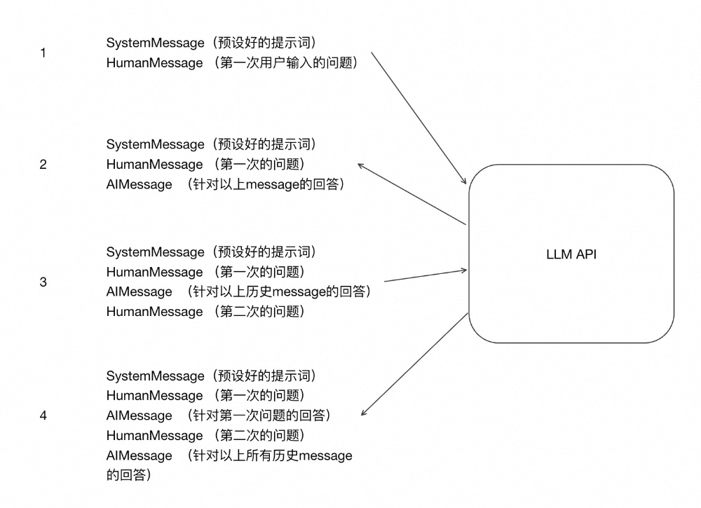

  

执⾏逻辑上⽐较简单，将 message 写好，然后调⽤⼤模型。

在各类框架中，通过声明相应的节点，如 langgraph 中可以将对模型的调用方法作为一个单独的图节点发布，或 langchain 中 model 本身作为一个可直接执行的节点调用，dify、ideaLab 中，类似。多轮对话的 message 其实可以在内存中不断维护一份列表就好了，不过框架一般也会都默默实现，使用者甚至不感知。在历史 message 上进阶一些的方向有当做记忆存储、压缩、检索。

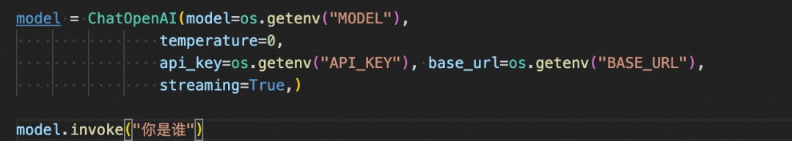

  

从上述简单的 AI 应⽤架构能够看出来为什么叫⽣成式⼤语⾔模型，其实 LLM 是在不断续写⽣成 message 列表后续的内容。在对话上有⽐较⾃然的表现⽅式，因为对话的不断进⾏就是不断续接响应的⽂本，但是要区分好⽂本段落和⽂本所属的⻆⾊，想想微信的聊天框、不管是群聊和单聊都是这样。

  

- 狭义AGENT

  

狭义上 AGENT 指的是 ReAct AGENT，指的是 ReAct 论⽂中对使⽤ LLM 构建更有效的 AI 应⽤的⼀种思想和范式。简单来说，就是让模型理解（reasoning）和使⽤⼯具（Action），并且不断进⾏迭代判断：

  

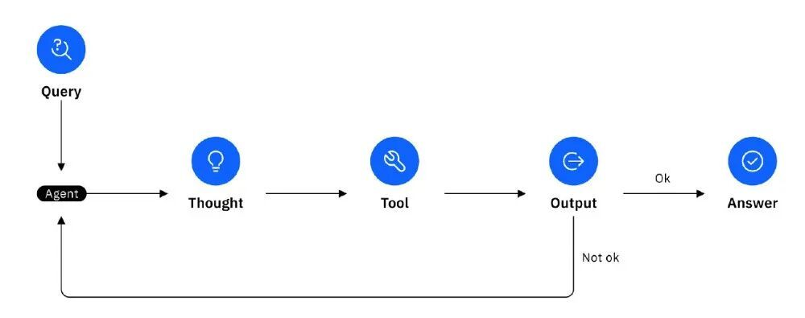

  

但是狭义上的 AGENT 也是各个框架、AI 应⽤⾃⼰定义的，如 langchain 和 langgraph 就不同，现在 langchain的对应apideprecated了有注释指明以 langgraph的 api替代。Dify中的 LLM 节点和AGENT 节点是不同的类型，AGENT 节点是指该狭义AGENT 定义上的实现，LLM 就是普通直接调⽤模型供应商的 Api。IdeaLab（Ai Studio）中，LLM 节点其实是ReAct AGENT的实现节点，因为普通LLM节点只是调⽤LLM⽣成后续内容，Idealab中的LLM单节点可以执⾏上述多次循环。现在 langgraph 中有标准的体现这⼀思想的实现模板，利⽤对应预置API 构建 AGENT 后，再使⽤langgraph ⾃带的图⽚展示⽅法将预置构建好的AGENT graph 展示出来如下：

  

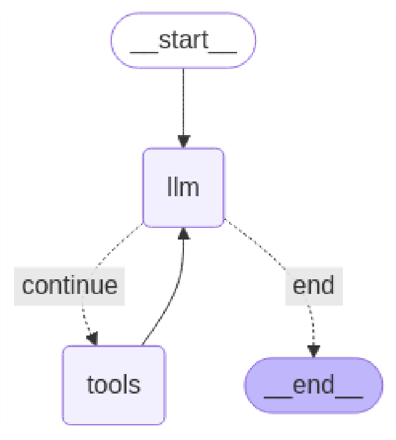

  

ReAct AGENT 结构确实⽐较简洁，langgraph 预置的结构和本节开头其他⽂章、平台的实践图或源头论⽂都⼀致。当然如果有特殊诉求，是可以 diy ⽤⼀个个节点构造出来这个结构的，然后根据⾃⼰的诉求修改图结构。

langgraph 中的图都是 stateGraph，每个图都会维护⼀个 state 作为上下⽂，这个 React Agent 维护了⼀个 AgentState，定义为（python 语⾔定义的）：

```code-snippet__js
class AgentState(TypedDict):
```
  

重点就是 messages 列表，是和简单调⽤模型提供商的 API 要维护的上下⽂是差不多的。可以再看上⼀节回顾⼀下。现在很多 AI 应⽤都将⽬光转向了《上下⽂管理》这个新出的概念，不再是《提示词⼯程》或者是《⼯具维护》了。其实这些不是取代，⽽是在挖掘本质后有了新的认知。

  

本⽂讨论的AI应⽤开头有提其实是围绕 LLM的，LLM上节有总结是对⼀段⽂本的不断续写⽣成，提示词即带⻆⾊的message列表，即上下⽂。维护message列表和⼯具是对所有LLM模型都统⼀且重要的差异点，可以说message列表组装和⼯具的不同，就是不同 AI应⽤不同的落地最⼤差异。当然，这种抽象的⾼度和过度的强调⽐较绝对，只是从 AI应⽤实践的结果上来总结。除此之外，上下⽂ state最好也维护⼀些变量做逻辑分⽀控制，先有程序逻辑控制才有了 message 列表结果；从 AI ⼤脑LLM 的进化上，⽤符合对应上下⽂形态的⼤量好样本数据对LLM 做训练也是改善 AI 应⽤结果的发展⽅向。

  

- ⼴义AGENT（智能体）

  

⼴义上 AGENT 指的是各种各样以基本元素拼接出来的原⽣ AI 应⽤，只要⽐上⽂提到的直接调⽤模型提供商 LLM 节点的功能丰富些，狭义 AGENT 作为了其中⼀个⼩的结构，都会被叫做 AGENT 或智能体。

所以⼴义上算是概念的宽泛使⽤，当然也会有⼀些模糊的误⽤。本⽂下⾯的 AGENT ⼀般指狭义 AGENT，这样会尽量减少歧义，也更好的和下节 WorkFlow 概念有更多差别。  

下图是⼀个更丰富的 AGENT，只是在 sub\_common\_agent 这个⼦ agent（在 langgraph 中也叫⼦图）上加了些权限校验。我们通常不⽤⼴义的智能体或AGENT来称呼，因为这个确实不是⼀个⾮常准确的概念。

  


  

- WorkFlow、n8n、低代码、流程引擎、graph

  

说好的介绍 WorkFlow，为什么这⼀节的名字这么⻓~

ReAct AGENT 确实是⼀个⽐较好的范式了，但是可以⾃定义的地⽅不多，通过上⽂的分析，其实 ReAct AGENT 是⼀个较固定的流程决策过程，可以算是 WorkFlow 的⼀种固定⼦集。在 WorkFlow 中不断的加⼊节点和分⽀，就会形成⼀个⽐较复杂的⼯作流。

  

从实践上看，⼯作流特别像我们业务中使⽤的流程引擎，特别像 UML 中的流程图、特别像低代码平台中拖拖拽拽的逻辑设计。其实，这⼀部分确实就是⽼东⻄，只不过⾮常契合 LLM的特性，作为了⽬前原⽣ AI 应⽤的常⻅实现⽅式。n8n 本身就是⼀个低代码⾃动化平台，就是⼀个拖拖拽拽做低代码应⽤的，AI 原来并不在其平台特性中，现在发展为了成为其核⼼特性。原来描述中是没有 AI 的。

  

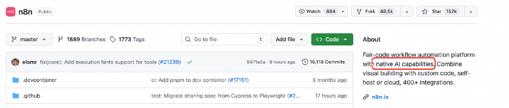

  

IdeaLab（阿⾥内部）、Dify 作为现在常⻅的⼀出⽣就是为 AI 设计的平台，⼯作流形式是其核⼼。

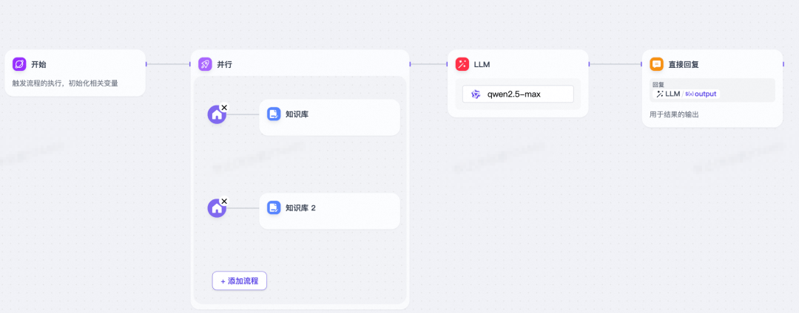

  

langgraph 采⽤图的叫法，并且实现了 pregel ⼤规模图计算的基本框架，其实也是在组装节点和流转逻辑。⼩彩蛋：pregel 是图论经典问题七桥问题下⾯的河流名。集团内也有⽤ smartengine 这个流程引擎来组织 AI 应⽤的尝试，smartengine 是我们普通业务应⽤常⽤的流程引擎框架。

  

⼯作流为什么在 AI 应⽤架构中这么亮眼？我⾃⼰有⼀定的推测：⾸先是⼯作流很适合⽤于实现低代码的诉求，其次是讨论为什么 AI 适合⽤低代码实现，最后讨论 AI 除了低代码能实现的还依赖哪些特性。

  

为什么⼯作流常⽤于实现低代码平台，我的看法：

- 可视化较好，适合低代码，适合适配前端组件
- 这种形式表达能力强，常出现于设计方案中，实际逻辑程序逻辑承载能力也强。
- 工作流较简单的形式是线性（pipeline，责任链），最复杂的构成形式是“图”，计算机界的 NP 完全问题中有一些复杂的图论问题（哈密顿通路），所有的 NP 完全问题可以相互规约转化。所以工作流可以解决很复杂的程序问题，只是可能在这种情况下写代码更易读，但是图结构的解法是可行的。
  
    

为什么 AI 适合⽤低代码实现，我的看法：

- AI 应用除了使用低代码的方式实现，就是使用编码程序（现常见于 python、java）实现，目前没有专门用于编写 AI 应用的 DSL 出现，实践证明没必要。
- 低代码能表达实现大部分程序逻辑，只是有些自定义程序设计模式不适用，这些逻辑很多 AI 应用不需要。上文中有提到 AI 应用之间现在不同的差异在于 message 列表和工具列表的差异，message 列表和工具列表低代码中也擅长维护。
- 复杂的程序逻辑，可以作为工具加入工作流中，但是工具内部逻辑对低代码平台来说是不需要感知的。
- 低代码中节点是相互连接的，LLM 作为核心大脑，其有 stream 流的重要特性，整个 AI 应用都要适配这一点，通过工作流中的节点连接可以比较自然地处理流对接的方式。

  

AI 还依赖哪些特性，我的看法：

- 时间回溯、隐形跳转、上下文改写压缩（这是很多应用选择 langgraph 然后去做编码扩展的重要原因）。
- 大批量并行，自定义分布式拓扑部署。
- 自定义存储方式和介质。
  
    

- 从框架中认知的相关的AI应⽤基本概念总结

  

LLM⼤语⾔模型，有不同的模型和模型提供商，这⼀点不变。

提示词，除了给 LLM 预设背景知识外，也可以在很多情况下转换为 Message，作为普通⽂本的模板。

Message，对话中的所有对话⽂本，每⼀条⽂本还有对应的⻆⾊，常⻅为系统（提示词）、⽤户（提问）、AI（回复）。

Tool（⼯具），⽤于 LLM 依赖获取外部信息或者执⾏决策动作，⼯具这个概念现在⽐较宽泛，所以很多 AI 应⽤的亮点也在于⼯具设计上，好的⼯具能够决定 AI 应⽤整体的结果。ReAct AGENT， 基本应⽤范式，详⻅上⾯具体⼩节内容。

上下⽂（state），如果把 AI 应⽤看做是借助“已有⼯具”对“已有 Message”的续写，那么已有的 Message 本身则⾮常重要，从哪⾥开始、已确认了什么信息，决定了续写的⽅向的正确性和可⽤性，“已有的 Message”和“已有的⼯具”就是上下⽂。对于不需要 LLM 感知的、⽤于⾃定义识别逻辑的其他信息也可以放⼊上下⽂中。

Rag（⼀种特殊⼯具），向量和⽂本形式的知识数据库，数据可预先⽤⾃定义⽅式处理好，在 AI 应⽤运⾏时是⽤⽤户输⼊的“⽂本”找相似⽂本召回。在很多框架中，知识库是当做“⼯具”的⻆⾊，只不过这个⼯具⽐较常⽤标准化了下来，但是 Rag 的复杂性存在于“⼯具内部实现”上，知识库的运⾏时使⽤接⼝不会复杂到“⼯具”⽆法承载。

⼯作流，应⽤执⾏节点（如 LLM、Tool、代码执⾏）的组织形式，实质是图的数据结构与算法的⽅式来落地，dify 等低代码框架简单地实现了图的数据结构和算法，langgraph 实现了 pregel ⼤规模图计算的落地。

  

恭喜！了解这些概念已经对现有 AI 框架的基本模型有了认知，这些概念就是 langchain 等框架的基本 python 类了，对应了 AI 应⽤该有的基本概念模型。

  

但是 MCP 呢？⼤模型的微调呢？MCP 是丰富了⼯具的⽣态，不是 AI 应⽤必不可少的概念，但是确实是促进了⼯具这⼀重要概念的协议标准化，后⽂《AI 应⽤的重要补充概念》章节继续讨论。⼤模型本身的能⼒和微调也是⼀个重要⽅向，下⽂《AI 应⽤的重要补充概念》章节继续探讨。

  

▐  以退⼩宝AI助⼿为例看架构

  

退⼩宝以低代码 workflow 为主要架构，⽬前退⼩宝经过很多次的迭代，达到了业务⼈员⽇常依赖使⽤的⽬的，结合其它⽬前⻅到的⽇常使⽤的 AI 落地产品看，狭义上的 AGENT 范式+流程编排是最常⻅的可落地架构。

本⽂专注于退⼩宝的⼀些分⽀：离线数据查询、图表⽣成。

  

- 离线数据查询

  

workflow 的组成：

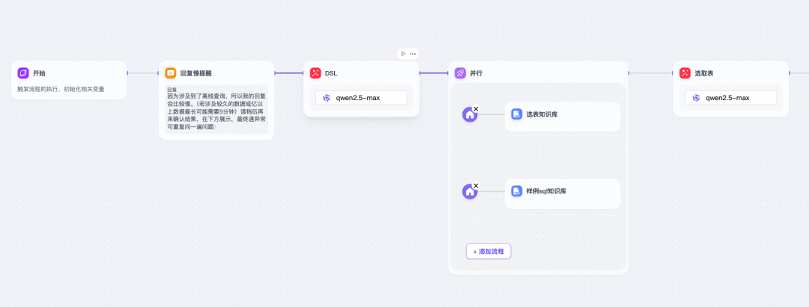

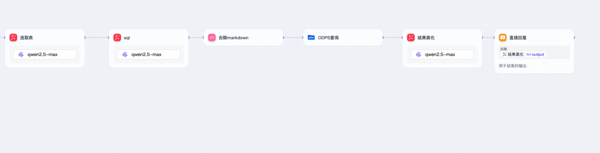

  

离线数据查询是⼀个经典的 text2sql 问题，最简单的做法是：

写⼀个提示词告诉 LLM 有哪些表和字段，然后附加相关业务知识，让 LLM 给出 sql。

在做过这个简单的做法后，其实在⼀些⽐较⼤的模型（如 qwen 系列的 max 参数模型）上，已经能取得 50%以上的正确回答了。这个数字结果是⼈⼯评测结果，评测相关的内容本⽂最后讨论。

  

但是这个简单结构的 AI 应⽤有以下⼀些问题：

- 需求会变复杂，数据表的描述比一般文字逻辑描述膨胀快多了，会很快把提示词撑到超限，通过上文的分析，提示词的超限其实不仅仅是一次的文本超长，会引起 message 列表也过大，会持续地降低 LLM 的性能，对结果的影响较大。 这个问题除了 text2sql 会遇到也常见于其他类型的 AI 应用。
- LLM 实质是生成式续写文本，但如果直接要求输出 sql，没有中间文字过程，那么 LLM 面对稍微复杂点的取数逻辑就会 game over。目前复杂性主要体现在几个方面：需要 1 个以上的表，需要使用复杂函数处理限制筛选列，需要解决分组开窗问题（如 top n per group 的 sql 问题）。
- 用户的问法会有多种文字变化，完全相同的一个问法在 text2sql 中就有一定的成功率问题了，如果换了词顺序或者同义词，那么结果的不确定性会增强。
  
    

所以针对以上问题的解决，有了退⼩宝离线查询的 workflow 的构成：

- 表结构存于知识库中，统一格式，优化分片，由影响较大的提示词扩展转换为相关表结构召回的优化问题。
- 提供样例 sql 的知识库，样例 sql 也会有膨胀的问题，但是相关表的样例 sql 可以非常有效提升回答的准确率，转化为 RAG 的召回准确性问题。
- 允许 LLM 将推理过程输出出来，在最后给出推理的 sql 结果，通过固定程序文字处理将 sql 明确，提升推理准确性，保证 sql 语法的正确性（LLM 可能输出一些无用 markdown 标记等，LLM 固定格式输出是一个专门的课题）。
- 将用户的输入转为易于 LLM 理解的 DSL 描述语言，主要是明确查询字段、查询条件、查询时间范围等固定内容，如果缺失则使用默认或者要求用户补充。

  

text2sql 算是⼀个⽐较常⻅的 AI 应⽤场景，但是实际业务应⽤中，退⼩宝碰到了“业务瓶颈”：

1. 如果⼀个取数是业务很需要的，业务会经常看和使⽤，会固定为报表逻辑。
2. 如果⼀个取数是临时的，现实专业职能的⼯作环境是⼈⼯⽐  AI能⼒⼀定强，那么⼈⼯来解决这个临时的取数不会耗费什么⼯时。

  

- 图表⽣成

  

图表⽣成的逻辑其实⽐较简单，不过有与普通 Web 应⽤结合的实践案例：

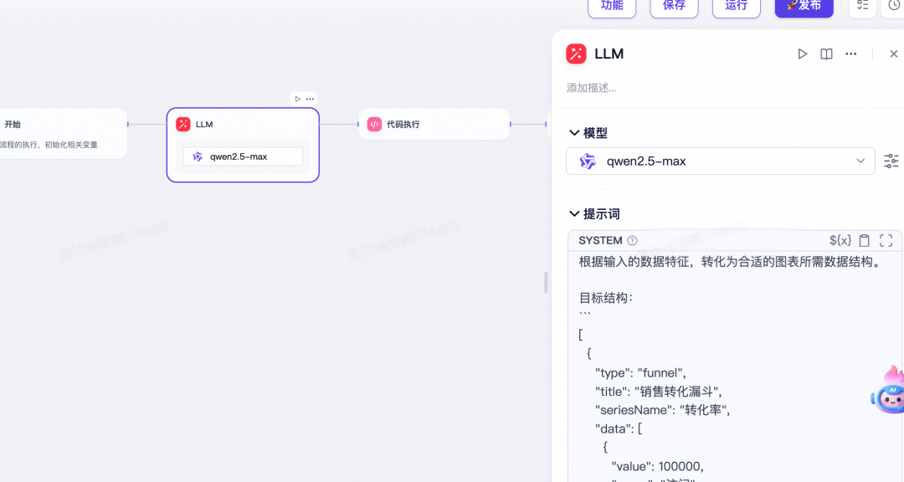

  

⼀般需要图表展示的都是多个数据值。

数据查询的结果⼀般为 markdown 形式的表格

将这些不定格式的数据值转化为固定格式的 json 结构是 LLM 确实擅⻓的事情，因此准确率特别⾼。

然后将 json 数据展示为图表数据，是专⻔⽤前端⼯程实现的，只需要对接好数据格式即可。达到的效果就是问⼀个离线数据查询问题，最后能够⽴刻得到⼀个直观的数据展示，并且在 Web 应⽤中可交互选择查看某⼀天细节：

  

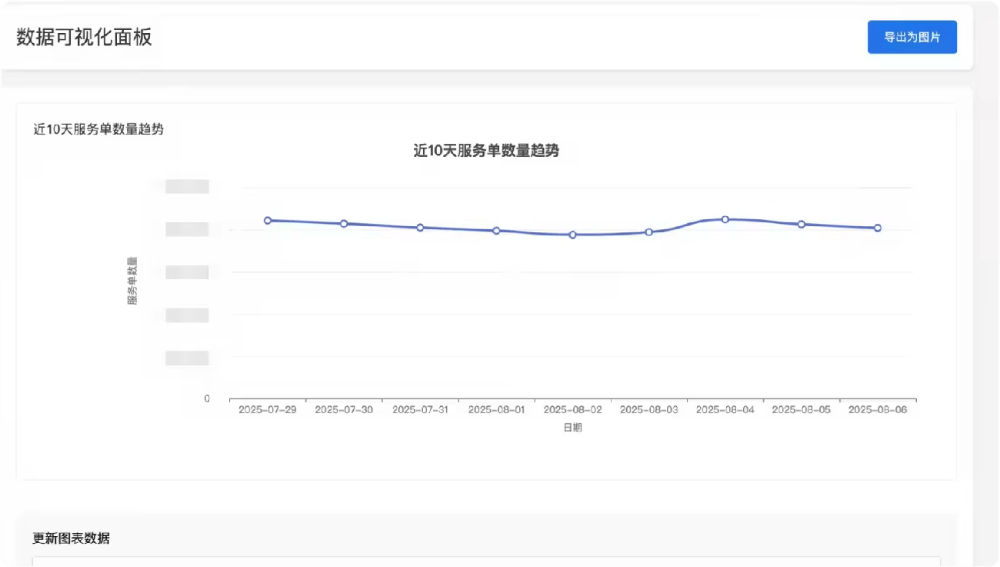

  

前端⼯程是⽤ vibe coding 让 AI 做出来的，AI coding ⽬前是⼀个 AI 落地的⽐较好的场景，在后端写前端的过程中，确实感受到了简单想法快速落地 demo 的⾼效速度。

  

初版通过 URL 转码将数据直接从 http 的 get ⽅式传⼊

⻓期⽅案：

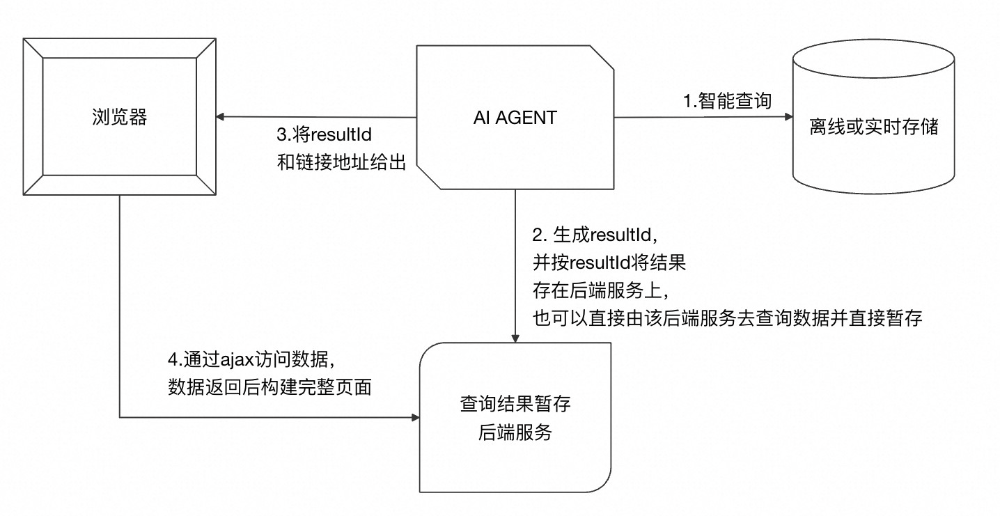

  

- 退⼩宝没有做什么？

  

1. 退⼩宝没有采⽤ plan agent + sub agent 的架构，原因只是因为退⼩宝起步较早，但multi-agent其实是个⾮常可⾏的架构。退⼩宝基本模式是常⻅问答，回答还是⽐较快的，multi-agent需要⽤户等待，应⽤场景略有不同。
2. 退⼩宝没有做过重的意图识别，因为早期在意图识别上有多次碰壁，现在 LLM 本身发展了很多，通过上⽂的积累，可以尝试做 5 个以上多意图的识别逻辑了，不能单纯依赖提示词工程，分⽀路径错误会累加结果误差影响。
3. ⻓记忆，⾃定义向量存储，退货宝专注于⼀次回答解决⽤户的问题，但是在⽇常⼈之间的沟通⼯作中经常会出现不得不多轮对话才能明确的问题，退⼩宝在这⼀⽅⾯较弱。
4. 上下⽂明确管理和压缩，和上⼀点⾯临的问题类似，其实是避开了相关问题，没有采⽤相关⼿段。
5. MCP，退⼩宝没有使⽤ MCP，但是不排斥使⽤，MCP 确实是⼀个跨平台、跨框架的好协议，如果要做⾮低代码类型的 AI应⽤⼀定会⽤上。
6. 微调模型，微调模型的成本不只是资源问题，还包括数据准备、评测、改进微调策略等等实施成本。要做⼩领域内的专家模型离不开微调，但是“普通⼈”⼀般就够了，专家也可能学“偏了”。

  

▐  AI应⽤需要分布式么？

  

退⼩宝暂时不涉及这个考虑，但是 AI 应⽤也会遇到访问频率较⾼的时候，所以 AI 应⽤是可以分布式部署的。

AI 应⽤本身的流式设计天然⽀持弹性扩容，Workflow 本身的执⾏流转在不同的机器上互不⼲涉，⼯具背后由分布式的 Web 应⽤接⼝承载也是⽼熟练⼯了，容易适配。LLM 本身现在的⼤模型提供商也是通过硬件资源和部署维护可以承载⼤流量的，⾃⼰部署的LLM是⽆法承载⼤流量的。逻辑设计上，⼯作流和⼦节点、图和⼦图也可以分开部署，通过 HTTP 链接。langgraph 的⼤规模图计算基座也是考虑了分布式的拆分。

结论：AI 应⽤⽀持分布式，可以承载⼤流量，但是⼀般 AI 应⽤起步时可以不考虑。

  


AI应用的重要补充概念

  

▐  MCP

  

MCP刚出来的时候⾮常⽕，对于⼀个⾮常⽕的概念如果没出现在⾃⼰的应⽤中，岂不是会落后？别急，先看清 MCP 是什么。

先看官⽹和来源的定义，MCP 是 claude 模型的提供商定义的：

MCP（Model Context Protocol） 是⼀种⽤于将 AI 应⽤连接到外部系统的开源标准。

借助 MCP，像 Claude 或 ChatGPT 这样的 AI 应⽤可以连接到数据源（例如本地⽂件、数据库）、⼯具（例如搜索引擎、计算器）和⼯作流程（例如特定提示），从⽽访问关键信息并执⾏任务。

  

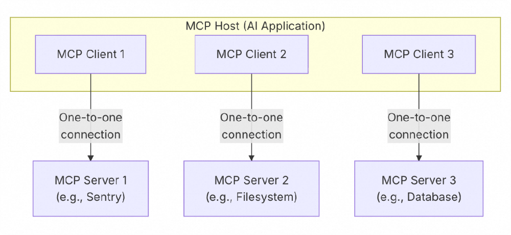

  

MCP 经常⽤于和 Function Calling ⽐较，因为这两个概念都和上⽂ AI 应⽤框架中提到的 Tool（⼯具）最相关。MCP 是什么，与 Function Calling 有什么不同本⽂不会花⼤篇幅论述了（可参考其他⽂章），只提⼀些有助于落地 AI 应⽤并了解 MCP 需要注意的点：

  

MCP 协议中主要有 3 个角色，MCP Client、MCP Server、Host 程序，server 和 client 因为有传统 C/S 架构作为参考较易理解，但是 Host 作为一个重要概念较难理解，且因为其作为与 LLM 沟通的重要桥梁没有明确定义而导致误解比较多。

  

MCP 虽然是 Model Context Protocol，并且官方定义也提了用于 AI，但这个协议可以用于非 AI 的程序，使用 pyhon 等语言，可以借助官方的 python 库实现 MCP Client,  实现 MCP Server，然后将 MCP Server 提供的工具当做一般程序去使用，不做任何 LLM 逻辑。此时 MCP 和 Function Calling 可以说没有对比的点了，完全不相关。所以这一部分可以说是 MCP 多出来的，真正体现出“协议”作用：标准化工具的注册和发现的。

  

Function Calling 一定与 LLM 相关，是定义在 LLM 接口标准中的东西，调用 LLM 时如果用到了就一定会传，告诉大模型可以使用哪些工具。因为 MCP 是 Claude 模型最先使用的，且 LLM 与 MCP 的结合使用细节是闭源的，导致 MCP 与 LLM 的结合出现比较多的形式和误解。目前非 Claude 的 LLM 与 MCP 结合，通常是使用的 Tool Calling 的结合，就是 LLM 模型提供方提供的 LLM API 中允许传入 tool 的描述 schema，然后 LLM 接口返回文本结果或者调用哪个工具的指示，现在常见模型都支持传入 Tool 的 schema 做决策，然后 Host 程序（可以认为是我们写的 AI 应用，用了上述常用框架）将 MCP 提供的工具+LLM 的 Tool Calling 的 API 使用结合，组成拥有 LLM 能力和 MCP 生态的应用。那如果 LLM 不支持传入 Tool 怎么办？Claude 是用的这种方式么？所以还有一种方式，就是将 Tool Schema+特殊标签当做普通文本传给 LLM，LLM 可能能理解这段输入文本是想让 LLM 输出对应的工具选择。所以 Host 程序本身的实现逻辑至关重要，Claude Desktop（注意不是 Claude LLM 而是一个 App）这个 host 程序里有这些重要逻辑，而 Claude LLM 模型的调用接口里是不处理 MCP 的 Client、Service 等概念的。

  

LLM 决策出要调用什么工具后，LLM 自己是不会去调用工具的，是由 Host 程序看到 LLM 决策要用种工具后，负责去调用这个工具获取结果，并且把工具调用结果加入到 message列表中（上下文中），这样后续的LLM 调用中 LLM 能感知到工具结果做决策。

  

退⼩宝⽬前主要是通过 Ai Studio（IdeaLab）实现，通过上⽂的实践总结，MCP 不是⼀个 AI 应⽤必不可少的概念，退⼩宝主要还是使⽤了 Ai Studio 平台能够注册⾃定义⼯具的能⼒。

  

但是 MCP 还是我推荐使⽤的，因为 Tool ⼯具在 AI 应⽤的⽣态中⾮常重要，Tool ⼯具是必不可少的概念，Tool ⼯具总要有地⽅实现吧，MCP 定义了标准的⼯具实现、注册、发现、使⽤能⼒，如果脱离了 AI Studio 平台这些⾃定义⼯具都⽆法再使⽤了，但是借助 MCP 的标准化随处是可以对接的。

  

现在阿⾥内部 HSF 如何作为⼀个 MCP Server 已经有很多⽅案了，也解决了很多权限问题。不过，AI 使⽤的⼯具通常都要适配 LLM 的调⽤特性，输⼊输出、使⽤逻辑都要适配，即使有⼀定成本重新为 AI 做⼯具也是⽐较推荐的路。

  

▐  RAG

  

知识库是⽬前 AI 应⽤中⽐较常⻅的知识扩展⼿段，简单来说，是将⽂本类数据（如 pdf、钉钉⽂档）切分、转化成向量，然后通过向量相似度等算法召回原⽂本，召回的信息交给 LLM去理解和决策。

上⽂退⼩宝《离线数据查询》对知识库的使⽤稍深⼊⼀点，数据表的 schem主要存在于钉钉⽂档中，钉钉⽂档更新会每⽇更新向量，这样只要关注与钉钉⽂档的格式及维护即可。

  

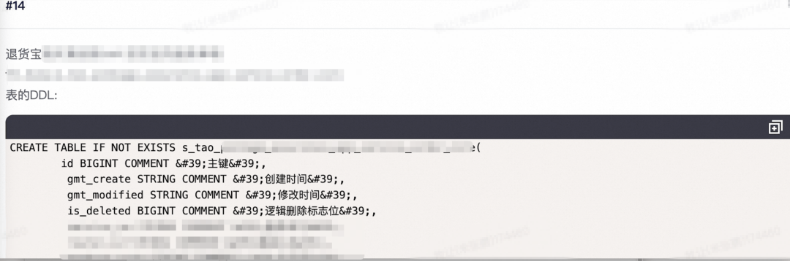

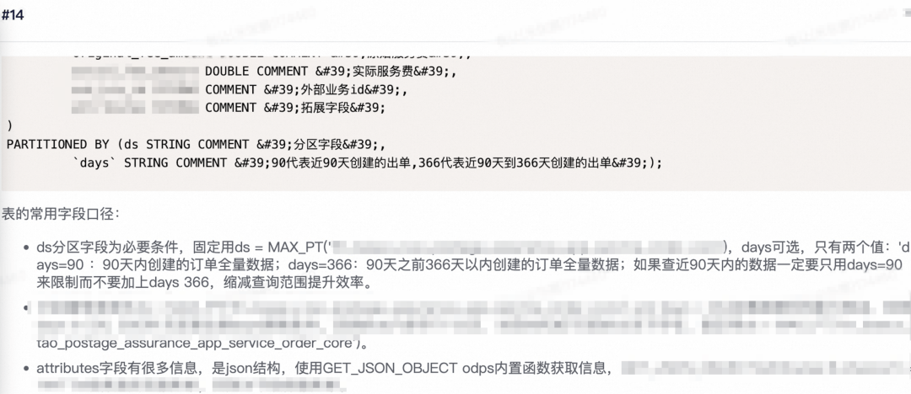

  

经过定义切分规则和细⼼维护钉钉⽂档格式后，召回的分⽚具有很清晰的数据表 schema ⽂本介绍，以助于 LLM 理解。⽬前退⼩宝使⽤⽐较常⻅的召回⽅式和召回算法就已经能取得⽐较好的召回效果了，text2Sql 在多表联合的情况下要进⼀步去做召回评测和召回精确率，且不能返回完整表的 schema，⽂本量太⼤，有限返回需要的字段及相关约束最好。

  

▐  权限管理与数据安全

  

先给结论：权限管理⽆法交给 LLM 去做，可由⼯具、AI 应⽤程序本身、MCP 机制等去做权限管控。

接下来分⼏种常⻅的权限管控业务场景来看实践做法。

  

- 简易场景\-AI应⽤维度的权限

  

退⼩宝⾯临的权限场景是⽐较简单的，因为⽤户主要是内部产品相关⼩⼆，所以只需要在总Ai应⽤维度去管控整体权限就好，然后在⼀些细分⽐较敏感的分⽀进⾏特殊权限校验。

  

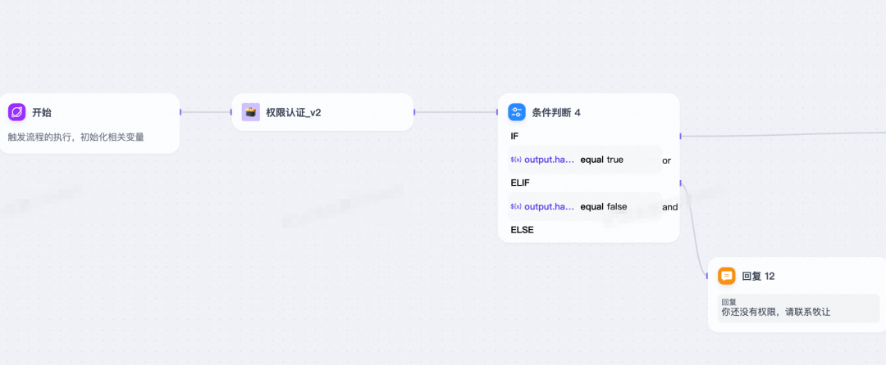

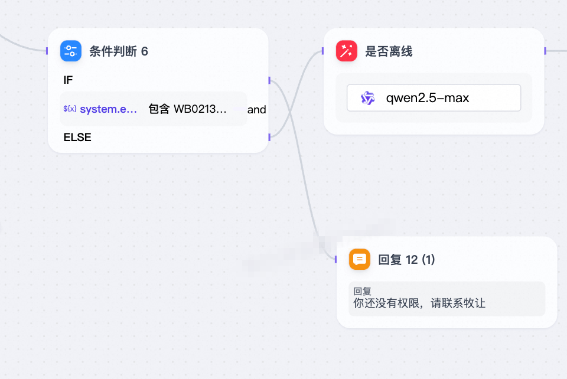

  

- 个体case查询\-商家信息查询

  

如果 AI 应⽤是⾯向公⽹⽤户的，那么就要将相关的数据限制在和对⽤⽤户登录态相关的范围内。

权限的管控细分下来就是分⻆⾊、账号（个⼈）、功能点。然后对些概念做组合来控制是或否。在传统 Web 应⽤中，因为每个⽤户的账号都是独⽴有相关的功能的，所以⼀般不会有显式的权限标准设计，⽐如淘宝买家的动线，电商的各个系统⾥没有显式的权限组件，默认更具买家独⽴来做功能就好了。

  

⽤户的登录态不会因为 AI 应⽤⽽与原来的 Web 应⽤有什么差别，只是这个登录态是身份标识，在 AI 应⽤中要放在 state 上下⽂中，message 列表是 LLM 感知的，但是权限不能交给 LLM 去控制（不能有⼀丝的不确定性），所以可以放到 state 上下⽂的其他字段中。

  

以商家查询⾃⼰相关的信息为例，商家相关的所有隐私信息的获取源只能是⼯具、RAG，上⽂有提到 RAG 可以作为⼯具的⼀种，所以在 AI 应⽤中⾸先要控制需要权限的信息获取源只能是⼯具。其次，在这些⼯具的⼊参中必须传⼊身份标识，⼯具的⼊参⼀般由 LLM ⽣成，但是身份标识⼊参修改 AI 应⽤的⼯具调⽤逻辑，隐式强制从可靠的 state 上下文中取出没有 LLM 干预过的身份标识做比对校验。从上⽂的架构讨论可以看到，Tool ⼯具是由 AI 应⽤程序去调⽤的，LLM 只负责决策使⽤哪些⼯具，那么 AI 应⽤程序中就可以在⼯具调⽤前加⼊身份⽐对的逻辑，⽐对 state 中确定的登录态身份和⼯具⼊参中的身份⼊参，⼀个 AI 应⽤中的⼯具是可枚举的，所以⼯具⼊参中的身份⼊参是可枚举的，在关键需要权限校验的⼊参上加权限校验。

  

- ⼦分⽀、⼦Agent权限控制

  

如果 AI 应⽤中有明确的⼦路径是需要细分权限管控的，那么可以设计对应的⻆⾊和功能模块管控系统，使⽤标准的 ACL 系统来管控个体或⻆⾊有的模块权限，在后在该⼦路径前拦截校验对应 ACL 权限。

  

此时，ACL 系统是⼀个传统的应⽤，其提供的接⼝作为固定调⽤⼯具被 AI 应⽤使⽤。注意，权限校验⼯具不能够让 AI 决定是否要调⽤，⼀定要显式调⽤。

  

这个点在 langgraph 的设计理念⾥稍微有些别扭，因为 langgraph 是个 AI 框架，⼯具概念是为 LLM 专⻔准备的，加上 state 的输⼊输出控制限制，langgraph 中固定调⽤某个⼯具和固定执⾏某些逻辑会稍微有些别扭，尤其是框架的⼊⼝都有 sync 和 async 两种⼊⼝。

  

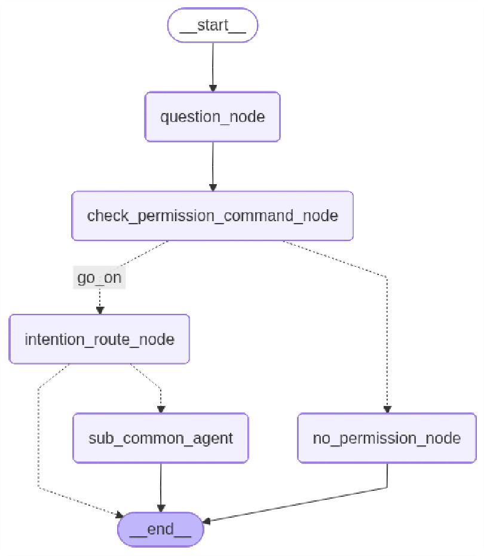

  

- MCP对接权限控制

  

业务⾃⼰定义的⼯具并不想让⼤家都使⽤，类似我们申请的 mysql数据库只有我们⾃⼰能⽤，⼀般通过设置秘钥或者限制使⽤⽅ aone 应⽤的⽅式做控制，类似调⽤三⽅ api 时，http 请求头⾥要加⼊秘钥。

  

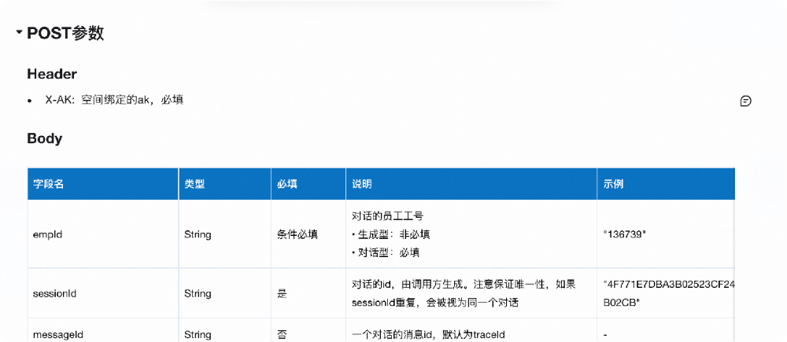

  

▐  微调

  

在 AI 应⽤的架构下，LLM ⾄关重要，但是普通应⽤把其当做⼀个⿊盒来使⽤⼀般也能达到预期的⽬标效果。

但是如果能够针对特殊领域的知识特点，训练⼀个既懂通⽤知识、⼜有专家经验的 LLM 怎么会拒绝呢？

开源的就推荐⽤ unsloth 和 LLaMA-Factory 微调框架。

  

不过集团内有卡资源可以使⽤，可以研究⼀下星云和 OpenLm 这两个平台来做微调。 微调也不是⼀帆⻛顺的，通常不需要微调常⻅ LLM 够⽤了，不然会遇到⼀些核⼼问题：

1. 没有数据，通用知识常见 LLM 已经具备，想让大模型拥有的是专业知识，但是没有训练数据，格式要求较高。
2. 人在学习专业知识时可能会遇到学不会，学错了、学偏了的情况，大模型微调起来会更困难。
3. 如果你的 AI 应用做了 WorkFlow 的一些编排，生成的 message 列表上下文也是合情合理的结果，那么最好用这样的 message 列表大量数据去训练，这样 LLM 才能真正学会如何选择你的工具、如何做决策。但是如何有这样的大量数据，如何保证这样的数据的质量是一个比较大的成本。
  
    

在 LLM 本身这个领域内有⼤量的研究⽅向和改进成果，这个不是本⽂的重点，就不过多赘述了，但是 LLM 具有什么样的基本能⼒和特点是对 AI 应⽤影响很⼤的。如果 LLM 本身多模态且能够全⾯专业掌握了专业领域知识，那么就不需要 AGENT 了，使⽤上⽂《简单使⽤模型提供商的⽣成 API 做 AI 应⽤》即可。⽬前的⽣产实践结果是，通⽤LLM还没有发展到这⼀阶段，专有LLM训练数据缺失情况较明显及成本较⾼。

  

▐  可观测TRACE

  

现在 AI 应⽤具有准确率的问题，可以⾃信绝对地说，没有任何⼀个 AI 应⽤在是能够保持 近100%回答正确的，所以⾮常需要对 AI 应⽤决策过程的观察，以对症优化。

  

在 langchain 这样的框架中就是预留了相应的钩⼦函数，然后 trace 记录是钩⼦的其中⼀个实现，在  LLM、Tool、其它运⾏节点的前中后都记录信息并上传到集中位置做可视化处理。这个⽤ Eagleeye 在各个中间件中的埋点来理解⽐较快，如果你⽤过我们的 DP 联调平台，那么理解起来也⽐较快 。框架中⼀般都会预留这样的钩⼦ SPI，然后具体实现⼀些逻辑来做扩展。

  

现有的 AI 应⽤框架⼀般都做的⽐较好，留痕⽐较丰富能够观察到哪⼀步⾛的不太好。集团也有很多将 AI 应⽤的 trace 标准化的尝试，OpenTelemetry 是现在观测领域⽐较标准的框架，基本都会参考。

  

这个对 AI 应⽤本身的执⾏逻辑没什么影响，使⽤ python 开发 AI 应⽤的过程中都可以 debug，所以⽤于排查不同⽤户的历史对话，以及主动使⽤该机制去改进 AI 应⽤，原理不太需要应⽤开发者过多关⼼，主要是拿来⽤。

评测依赖于观测，这两个内容可以不断迭代优化ai应⽤，⽐较较好的开源案例是langfuse，opik这些开源框架。

  

▐  评测

  

现在很多 AGENT 的落地成果上少提或者不提结果的准确率，因为这个确实是⼀个⽐较难衡量的问题。

退⼩宝的准确率主要来源于⼈⼯评测，⽬前的⽤户就是产品相关的⼩⼆，⼈数不多，易于统计。

为什么不能像算法那样有更专业的评测呢？类似微调，缺数据。

  

现在⼤模型⽤的训练数据和测试数据都是专业的数据集，且⼴泛存在于互联⽹中，我们要做的⼀个具体 AI应⽤⼀般是有专业数据的，数据集难构造。如果实在想做这部分数据，少不了⼈⼯的⼤量投⼊，数据⽣成可以让AI⽣成问题和答案，类似deepseek从V3到R1的过程，但是通识数据是有⼤量的正确答案数据的，专业Agent的业务专有数据⼀定会有从零开始的⼈⼯判别过程。

  

AI 应⽤中有⼯具，⼯具查询的数据结果是会变化的，没有特别准确的固定数据验证⽅式，只可以验证结果的格式。在项⽬起步初期量不⼤的情况下，建议⼈⼯构造数据集，或者采⽤线上⽤户问答情况，结合LLM判别及⼈⼯辅助判别的优化思路。应⽤opik这些开源框架可以快速起步。

  


总结

  

本⽂通过回顾了历史 Web 应⽤的架构的⼴泛应⽤，意图借助其巨⼈的肩膀探索 AI 应⽤与其结合快速落地的可能，但是通过多⽅⾯对⽐得出与 Web 应⽤差异明显⽽需要 AI 原⽣应⽤构建的结论。

然后通过对独⽴完整的 AI 应⽤的常⻅落地⽅式做了介绍，从简单 LLM 调⽤到 Agent、 Workflow 范式的结构，然后借助常⽤框架、退⼩宝这个 AI 应⽤的实际实践经验总结了⼀个 AI 应⽤的架构中都有哪些概念和模块，每⼀个模块起到了什么作⽤。

最后，AI 应⽤有很多辅助概念和模块，虽然不是所有 AI 应⽤必须的，但是通常使⽤后能够显著提升 AI 应⽤的体验，对 AI 应⽤的持续演进和维护也有⽐较⼤的作⽤。

  

我们部⻔还有⼀些其它优秀的 AI 落地应⽤，从这些 AI 应⽤中，我也发现了⼀些有趣经验，⽐如 AI 项⽬哪怕是做⼯程，也和学术、算法岗位的⼯作⽅式类似，要开好题，要找对⽅向且有研究精神，当然也有研究不确定性带来的失败负⾯影响。

⽐如 AI 应⽤⽬标的业务场景需要容忍结果的正确率不为 100%，如果错误即有较⼤负⾯影响，则⽆可⾏性。

⽬标的业务场景下，AI应⽤的结果⼈⼯要可检查验证，或可⼩幅修正，这点是和正确率不为100%相辅相成的。

有些场景是使⽤低频的，但是不代表没有价值，⽐如数据洞察、⼯单总结汇总、临时离线数据查询。这些场景我认为使⽤量不是价值衡量标准，其带来的间接业务决策和体验优化是隐式的，是正确的事，但和其他⾼优事项⽐可让步。

  


团队介绍

  

本文作者牧让，来自淘天集团 - 场景金融技术团队。场景金融致力于与合作伙伴共同打造场景新金融，成为阿里平台中小微企业可信赖的生意伙伴。我们聚焦客户和场景价值，为企业提供全链路金融服务，提升交易效率和资金周转，增强交易确定性，简化生意流程。同时，着力解决买卖双方信任问题，促进交易顺畅，推动新商业模式创新。我们的服务对象是阿里平台上的中小微企业，无论买家还是卖家都是我们的核心客户。我们将持续创新，助力企业在阿里生态中安心发展，轻松做大生意。

  

  

**¤** **拓展阅读** **¤**

  

[3DXR技术](https://mp.weixin.qq.com/mp/appmsgalbum?__biz=MzAxNDEwNjk5OQ==&action=getalbum&album_id=2565944923443904512#wechat_redirect) | [终端技术](https://mp.weixin.qq.com/mp/appmsgalbum?__biz=MzAxNDEwNjk5OQ==&action=getalbum&album_id=1533906991218294785#wechat_redirect) | [音视频技术](https://mp.weixin.qq.com/mp/appmsgalbum?__biz=MzAxNDEwNjk5OQ==&action=getalbum&album_id=1592015847500414978#wechat_redirect)

[服务端技术](https://mp.weixin.qq.com/mp/appmsgalbum?__biz=MzAxNDEwNjk5OQ==&action=getalbum&album_id=1539610690070642689#wechat_redirect) | [技术质量](https://mp.weixin.qq.com/mp/appmsgalbum?__biz=MzAxNDEwNjk5OQ==&action=getalbum&album_id=2565883875634397185#wechat_redirect) | [数据算法](https://mp.weixin.qq.com/mp/appmsgalbum?__biz=MzAxNDEwNjk5OQ==&action=getalbum&album_id=1522425612282494977#wechat_redirect)
