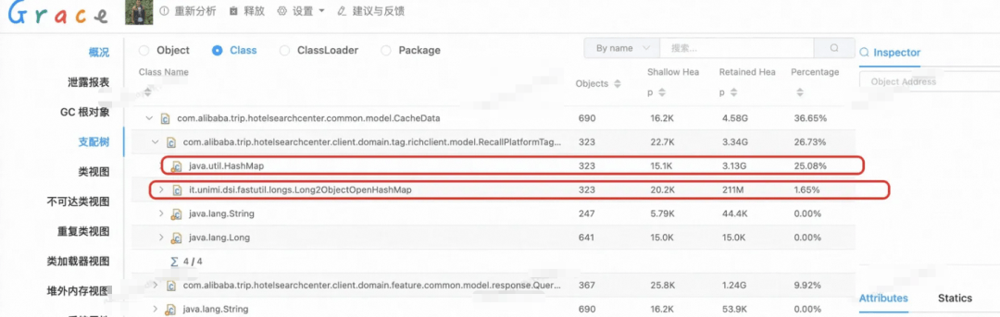
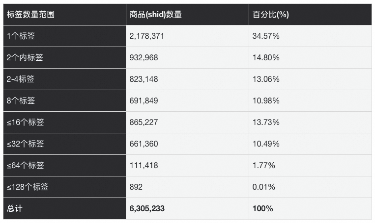
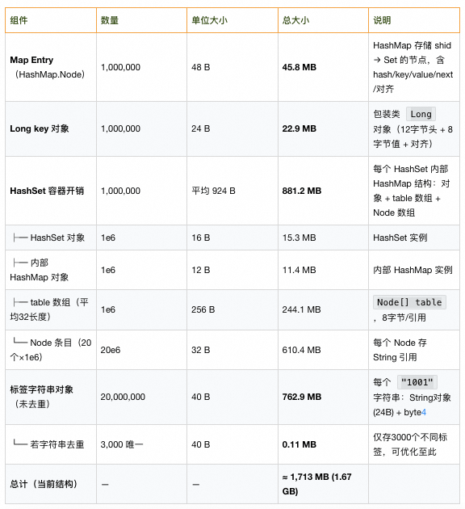
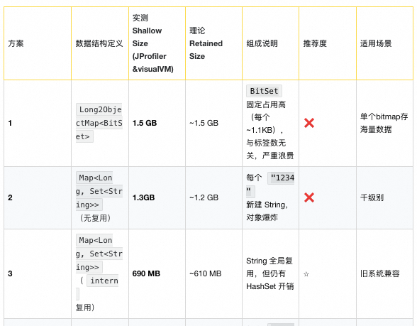
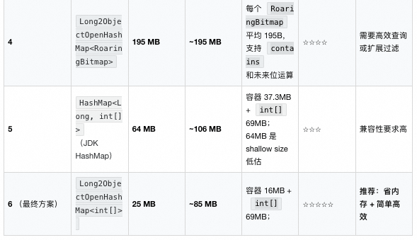
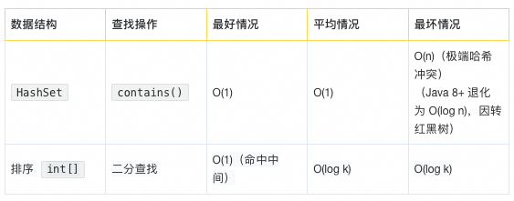
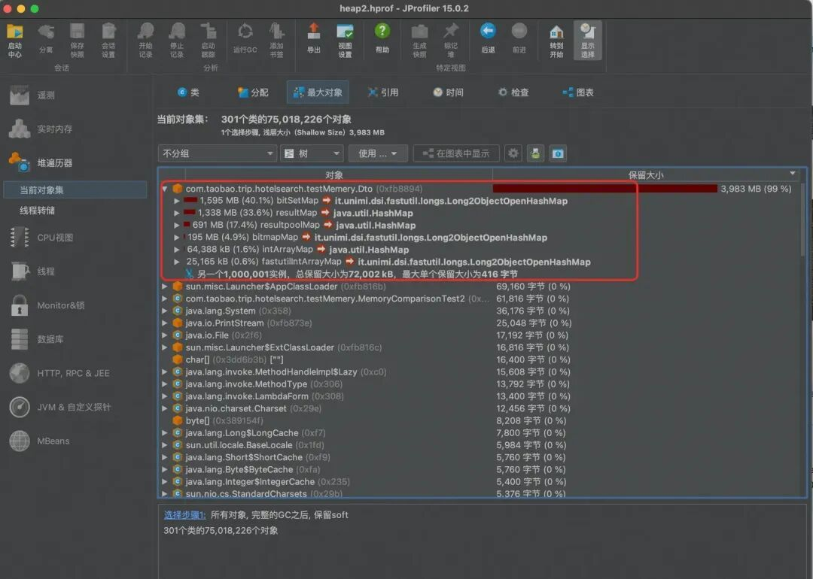
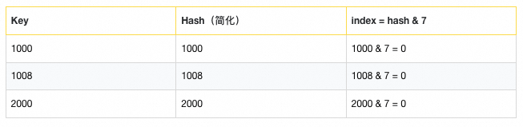
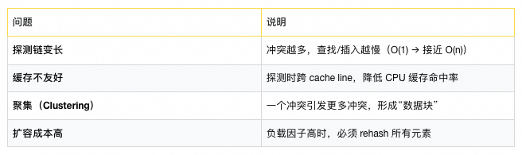

# 重构一个类，JVM竟省下2.9G内存？


  

  

  

本文讲述了作者通过重构一个核心类的数据结构，将原本使用 `HashMap<Long, HashSet<String>>` 的设计，优化为基于 FastUtil 库的 `Long2ObjectOpenHashMap<int[]>`，并利用标签为小整数且数量稀疏的业务特性，改用排序后的 `int[]` 配合二分查找替代 `HashSet`。这一改动在生产环境中使 JVM 堆内存占用从约 3.2GB 降至 211MB，节省近 3GB 内存，降幅达 94% 以上。文章深入分析了原始结构的内存浪费原因，并通过实测对比多种方案，验证了新结构在内存效率和查询性能上的优越性，强调了在大数据量场景下应警惕“通用容器”的隐性成本。

  


优化效果

##   



##   

## 仅重构一个类，JVM 堆内存直降 2994MB（≈3GB）——从 3205MB 降至 211MB，新结构内存占用仅为老方案的 6.5%。

这不是压测数据，也不是理论推演，而是生产环境双写验证的真实结果：

- 上线期间，新老结构并行写入，内存指标实时对比；
- 验证无误后，正式切换至新结构，老结构彻底下线。

  

如此巨大的收益，竟源于对单个核心类的数据结构重构。你或许会问：“一个类的改动，何以撼动近 3GB 的内存水位？”

答案，藏在那些被我们习以为常的“通用容器”之中——`HashMap`、`HashSet`、自动装箱、对象头开销……它们在小规模场景下优雅高效，却在海量数据面前悄然变成“内存吞噬者”。

本文将完整复盘此次优化的思考路径、技术选型、实测对比与落地细节。

  


背景

  

在我们的核心业务链路中，存在一个对城市维度下某特定类型商品标签进行动态过滤的关键接口。其过滤逻辑极为复杂：

- 支持多条件与/或 嵌套组合；
- 条件结构呈多层级树状表达式；

且部分规则涉及运行时上下文计算，无法静态预编译。

由于这类逻辑难以被搜索引擎原生表达，也无法通过简单的字段匹配或脚本高效实现，我们最终选择将全量商品标签数据加载至内存，在应用层完成实时过滤计算。为此，我们设计了一个以城市 ID为键、商品标签集合为值的内存数据结构，并辅以 3 分钟 TTL 的本地缓存 以支持跨请求复用。

  

⚠️ 值得注意的是：若无此缓存机制，每次请求都将重建全量结构，内存瞬时峰值将远高于当前水平。

正是在这一背景下，我们发现：看似合理的“通用集合嵌套”设计，在十万级商品 × 万级城市 × 多标签的规模下，竟成为内存消耗的“沉默杀手”。

  

先看下重构前的对象设计

```code-snippet__js
publicclassRecallPlatformTagsRespextendsBasePageResponse<RecallPlatformTag> {
    privatestaticfinallong serialVersionUID = 8030307250681300454L;
    
    /**
     * key:shid, 商品id
     * value:platformTags   Set结构，对应商品的标签集合
     */
    privateMap<Long, Set<String>> resultMap;


}
```
  

resultMap样例

```code-snippet__js
[
{1:["2246","2288","3388","1022"]},
{2:["12246","12288"]}
]
```
  

从业务数据特征来看，所有标签 ID 均为 小于 5000 的正整数——这是一个典型的稠密小整数域。

然而，在原有模型中，这些标签却被表示为 String类型（如 "12345"）。从内存效率角度看，这是一个显著的结构性浪费。

我们推测，当初的设计者可能是出于“未来扩展性”考虑（例如支持非数字标签），但在当前业务场景下，这种通用性牺牲了巨大的内存效率。

而正是这一设计，让 BasePageResponse<RecallPlatformTag>成为内存中的“巨无霸”——单实例在高并发缓存下累计占用高达 3.13 GB 堆内存。

问题随之而来：“为何一个泛型响应类会吃掉 3GB 内存？”

接下来，我将逐层拆解这 3.13 GB 的构成，带你透视 JVM 堆中那些被忽视的对象开销、嵌套容器膨胀与装箱陷阱——真相，往往藏在细节之中。

  


老结构内存分析

  

为了精准评估优化空间并指导新结构设计，我们基于百万级商品样本（约 100 万 itemId）对标签分布进行了深度统计。核心指标是：“拥有 k 个标签的商品数量”。结果如下（节选关键区间）：

- 80% 的商品标签数 ≤ 16
- 90% 的商品标签数 ≤ 32
- 99% 的商品标签数 ≤ 64
- 最大标签数 < 128
  
    

这一分布具有两个关键特征：

- 高度右偏（长尾极短）：绝大多数商品标签数量极少；
- 绝对上限明确：任意商品的标签数均未超过 128。
  
    

这一数据洞察，成为我们后续结构选型的决定性依据：

- 既然标签数极少且有界，无需动态扩容的复杂集合（如 HashSet）；
- 既然数据只读且初始化后不变，排序 + 二分查找 成为高性价比方案；
- 既然标签本质是小整数，int\[\]可彻底替代 String+ HashSet，消除对象开销。

  

换言之：不是我们选择了 int\[\]，而是数据分布告诉我们——它是最优解。



  

接下来，我以100w个商品为例，以表格的形式详细展现该对象所占内存情况。



  

对内存敏感的同学，会注意注意到 标签字符串对象（未去重）和└─ 若字符串去重 两列。由于标签个数有限，实际上可以使用string的常量池做优化(如何做常量池，最简单的方法是使用全局Map<String,String>)。未去重表示的是没有放常量池，老结构中并未放入常量池中。

  


新结构方案选型

  

看完上述的老结构的内存占用分析表，相信不少同学会心头一紧——一个看似普通的 `HashMap<Long, HashSet<String>>`，竟在海量数据下吞噬数 GB 堆内存。问题的根源其实非常清晰：`HashMap` 及其衍生结构（如 `HashSet`，底层同样是 `HashMap`）在大规模场景下，是典型的“隐形内存黑洞”。

  

这并非否定 `HashMap` 的价值——它在通用性、易用性和平均性能上无可替代。但当数据规模进入百万/千万级、且对内存敏感时，我们必须重新审视：是否有更紧凑、更高效的数据结构？

  

幸运的是，Java 生态早已为我们准备了答案。

在方案设计阶段，我脑海中迅速闪过多个候选方案：

- 使用 FastUtil 的原始类型 Map（如 `Long2ObjectOpenHashMap`）；
- 将 `HashSet<String>` 替换为 `int[]` + 二分查找；
- 采用 `RoaringBitmap`（若标签可映射为整数 ID）；
- 甚至考虑自定义紧凑对象池；

  

经过内存占用、查找性能、初始化开销、代码复杂度四维度实测，最终筛选出最优组合，并整理成下表供参考：





  

本次内存优化包含两个关键改动：

- 将 `HashMap<Long, ?>` 替换为 FastUtil 的 `Long2ObjectOpenHashMap<?>`，消除 `Long` 装箱开销及Map内部table 和Entry对象开销；
- 将 `HashSet<String>` 替换为排序后的 `int[]`，并用二分查找替代 `contains()`。

  

值得注意的是，第二项优化带来的收益更为显著：

- 仅将 value 改为 `int[]`（仍用普通 `HashMap`）时，测试数据内存由老结构的1.3GB降至 64MB；
- 进一步采用 `Long2ObjectOpenHashMap<int[]>` 后，内存进一步压缩至 25MB。

这说明：数据结构的“双重优化”中，value 层的精简贡献了主要收益。

****▐**  为何 int\[\] 可替代 HashSet？**

  

原设计使用 `HashSet` 出于两点考虑：

- 去重：标签数据在初始化阶段已由上游保证唯一性，无需运行时去重；
- 高效查找（`contains()`）。

我们对比两种方案的查找时间复杂度：



  

其中 `k` 为单个实体的标签数量。

虽然 `HashSet` 理论上平均为 O(1)，但其最坏情况不可控，且伴随显著内存开销（对象头、Entry 节点、指针、哈希桶数组等）。

而 `int[]` + 二分查找：

- 时间复杂度稳定在 O(log k)，无哈希冲突风险；
- 空间开销极低：仅需 4k 字节（k 个 int），无额外对象；
- 缓存友好：连续内存布局，CPU 预取效率高。

结合业务数据分布：

- 80% 的实体标签数 < 16 → 最多 4 次比较；
- 90% < 32 → 最多 5 次比较；
- 最大标签数 < 128 → 最多 7 次比较；

  

这意味着：90% 的查询在 5~6 次比较内完成，实际延迟与 O(1) 几乎无感差异，却换来内存下降 94%+ 的巨大收益。

结论：在小规模（k ≤ 128）、静态、有序的数据场景下，紧凑数组 + 二分查找是 `HashSet` 的高性价比、高确定性替代方案。

细心的同学会看到表格中有个实测列，这里我特地准备了测试case，并且用JProfiler dump出来，查看各方案所占内存大小。

  



  

同时附上测试代码，有兴趣的同学可以一试。

```code-snippet__js
package com.taobao.trip.search.testMemery;


import it.unimi.dsi.fastutil.longs.Long2ObjectMap;
import it.unimi.dsi.fastutil.longs.Long2ObjectOpenHashMap;
import org.roaringbitmap.RoaringBitmap;
import java.util.*;
import java.util.concurrent.ThreadLocalRandom;
publicclassMemoryComparisonTest2 {
    privatestaticfinalint COUNT = 1000_000; // 10万商品
    privatestaticfinalint TAG_MIN = 1000;
    privatestaticfinalint TAG_MAX = 10000;
    privatestaticfinalint TOTAL_UNIQUE_TAGS = 3000; // 总标签数不超过3000
    // 所有可能的标签池（3000个）
    privatestaticfinal List<Integer> ALL_TAGS = new ArrayList<>();
    static {
        Set<Integer> tagSet = new HashSet<>();
        while (tagSet.size() < 3000) {
            int tag = ThreadLocalRandom.current().nextInt(TAG_MIN, TAG_MAX + 1);
            tagSet.add(tag);
        }
        ALL_TAGS.addAll(tagSet);
    }
    // 模拟标签数量：90% <=16，10% 17~100
    privatestaticintrandomTagCount(){
        return ThreadLocalRandom.current().nextDouble() < 0.9
                ? ThreadLocalRandom.current().nextInt(1, 17)
                : ThreadLocalRandom.current().nextInt(17, 101);
    }
    // 随机取 n 个标签
    privatestatic List<Integer> randomTags(int count){
        Collections.shuffle(ALL_TAGS);
        return ALL_TAGS.subList(0, count);
    }
    publicstaticvoidmain(String[] args) throws InterruptedException {
        System.out.println("开始生成 10万 酒店标签数据...");
        Dto dto = getDto();
        System.out.println(dto.bitmapMap.size());
        Thread.sleep(10 * 60 * 1000); // 10分钟，足够分析
        System.out.println(dto.bitmapMap.size());
    }
    privatestatic Dto getDto(){
        Map<Long, Set<String>> resultMap = new HashMap<>();
        Map<Long, int[]> intArrayMap = new HashMap<>();
        Long2ObjectOpenHashMap<int[]> fastutilIntArrayMap = new Long2ObjectOpenHashMap<>();
        Long2ObjectOpenHashMap<RoaringBitmap> bitmapMap = new Long2ObjectOpenHashMap<>();
        Map<Long, Set<String>> resultpoolMap = new HashMap<>();
        Long2ObjectMap<BitSet> bitSetMap = new Long2ObjectOpenHashMap<>();
        Dto dto = new Dto(resultMap, intArrayMap, fastutilIntArrayMap, bitmapMap,resultpoolMap, bitSetMap);
        // ==================== 方案1：Map<Long, Set<String>>（当前线上）====================
        long t1 = System.currentTimeMillis();
        for (long shid = HOTEL_COUNT; shid <= 2*HOTEL_COUNT; shid++) {
            List<Integer> tags = randomTags(randomTagCount());
            putResultMap(tags, resultMap, shid);
            putPoolMap(tags, resultpoolMap, shid);
            int[] arr = tags.stream().mapToInt(i -> i).toArray();
            intArrayMap.put(shid, arr);
            fastutilIntArrayMap.put(shid, arr);
            putBitMap(tags, bitmapMap, shid);
            putBitSet(tags, bitSetMap, shid);
        }
        System.out.println("resultMap.size  " + resultMap.size());
        System.out.println("resultpoolMap.size  " + resultpoolMap.size());
        System.out.println("bitSetMap.size  " + bitSetMap.size());
        System.out.println("bitmapMap.size  " + bitmapMap.size());
        System.out.println("intArrayMap.size  " + intArrayMap.size());
        System.out.println("fastutilIntArrayMap.size  " + fastutilIntArrayMap.size());
        // 保持对象存活，供 JProfiler 抓取内存
        System.out.println("==========数据构建完成，等待 10 分钟，启动 JProfiler 查看内存...");
        return dto;
    }
    privatestaticvoidputBitSet(List<Integer> tags, Long2ObjectMap<BitSet> bitSetMap, long shid){
        BitSet bs = new BitSet();
        for (int tag : tags) {
            bs.set(tag);
        }
        bitSetMap.put(shid, bs);
    }
    privatestaticvoidputBitMap(List<Integer> tags, Long2ObjectOpenHashMap<RoaringBitmap> bitmapMap, long shid){
        RoaringBitmap bitmap = new RoaringBitmap();
        for (int tag : tags) {
            bitmap.add(tag);
        }
        bitmapMap.put(shid, bitmap);
    }
    privatestaticvoidputPoolMap(List<Integer> tags, Map<Long, Set<String>> resultpoolMap, long shid){
        Set<String> stringTags = new HashSet<>();
        for (Integer tag : tags) {
            stringTags.add((String.valueOf(tag)).intern());
        }
        resultpoolMap.put(shid, stringTags);
    }
    privatestaticvoidputResultMap(List<Integer> tags, Map<Long, Set<String>> resultMap, long shid){
        Set<String> stringTags = new HashSet<>();
        for (Integer tag : tags) {
            stringTags.add(String.valueOf(tag));
        }
        resultMap.put(shid, stringTags);
    }
}

```
  

从测试结论可见，最合适的模型为`Long2ObjectOpenHashMap<int[]>`，最终模型优化为：

```code-snippet__js
publicclassRecallPlatformTagsRespextendsBasePageResponse<RecallPlatformTag> {
    privatestaticfinallong serialVersionUID = 8030307250681300454L;


    /**
     * 老结构保留，便于验证阶段双写比较效果
     * key:itemId, 
     * value:platformTags   
     */
    private Map<Long, Set<String>> resultMap;
    
     /**
     * 新增结构
     * key:itemId, long 对象非Long,省掉包装类的开销,
     * value:platformTags   目前总2000多个，且增长缓慢，标签id为数字类型
     */
    private Long2ObjectOpenHashMap<int[]> itemTags = new Long2ObjectOpenHashMap<>(1_600_000);


}

```
终于到了讲 Long2ObjectOpenHashMap，如果这篇文章只能让你记住一件事，那我希望你记住的就是Long2ObjectOpenHashMap。

  


Long2ObjectOpenHashMap详解

  

在本次模型优化中，我们引入了 `Long2ObjectOpenHashMap` —— 来自高性能 Java 集合库 FastUtil 的一个专用哈希映射实现。为确保技术选型的可靠性与长期可维护性，我们对其背景、成熟度及底层机制进行了评估。

  

可靠性与社区成熟度

- 项目历史悠久：FastUtil 自 2000 年代初启动，持续活跃维护至今，版本稳定，文档完善。
- 广泛工业验证：已被多个主流开源项目及商业系统深度集成，包括 Apache Spark、Elasticsearch、Neo4j、Deeplearning4j 等，证明其在高并发、大数据场景下的稳定性与性能表现。
- 轻量无依赖：FastUtil 为纯 Java 实现，无外部依赖，易于集成与升级。
  
    

#### **▐**  **为什么选择 Long2ObjectOpenHashMap**

  

该类是专为 `long` 类型键 → 对象值 映射场景设计的高性能 `Map` 实现，相比 JDK 原生 `HashMap<Long, V>`，具有以下优势：

- 避免装箱开销：直接使用原始 `long` 类型作为键，无需 `Long` 对象封装，显著减少内存占用与 GC 压力。
- 开放寻址（Open Addressing）：采用线性探测解决哈希冲突，缓存局部性更优，访问速度更快。
- 内存紧凑：内部使用连续数组存储键值对，无链表或红黑树结构，空间效率更高。

接下来我讲详细介绍`Long2ObjectOpenHashMap`底层实现和原理。

#### ****▐**  **1.底层存储结构：数组 + 开放寻址****

  

核心数据结构（简化版） 

`Long2ObjectOpenHashMap` 内部使用 两个平行数组 存储键值对：

```code-snippet__js
long[] key;     // 存放所有的 long 键
Object[] value; // 存放对应的 Object 值
```
⚠️ 注意：这不是链表数组，而是扁平数组，采用 开放寻址法（Open Addressing）

还有一个关键变量：

- mask：用于快速计算索引，`mask = array.length - 1`（当容量是 2 的幂时）；
- 哈希索引：`index = (Hash(key)) & mask；`

---

**▐  **2.哈希函数与索引计算（避免误解）****

**虽然 long是 64 位，但不能直接用 key % capacity，因为：**

- **%运算慢；**
- **负数处理麻烦；**

**所以 fastutil 使用：**

```code-snippet__js
int hash = (int)(key ^ (key >>> 32));  // 混合高低32位
int index = hash & mask;
```
这是经典的 “哈希扰动 + 位与取模” 技巧，类似于 `HashMap`，但针对 `long` 优化。

#### **▐**  **3.冲突产生的本质：哈希碰撞 + 存储空间有限**

  

#### 场景重现

假设容量为 8，`mask = 7`（二进制 `111`）

我们插入以下键：



👉 三个 key 都映射到 `index=0`，哈希冲突爆发！

  

#### **▐**  **4.底层存储状态变化（冲突处理过程）**

  

初始状态（容量=8）：

```code-snippet__js
key:   [0, 0, 0, 0, 0, 0, 0, 0]
value: [null, null, null, null, null, null, null, null]
```
#### Step 1: put(1000, "A")

- index = 0
- key\[0\] == 0（空）→ 可插入
- 插入后：

```code-snippet__js
key:   [1000, 0, 0, 0, 0, 0, 0, 0]
value: ["A", null, null, null, null, null, null, null]
```
#### Step 2: put(1008, "B")

- index = 0
- key\[0\] == 1000 ≠ 0 → 冲突！
- 线性探测：检查 `index+1 = 1`
- key\[1\] == 0 → 空 → 插入

```code-snippet__js
key:   [1000, 1008, 0, 0, 0, 0, 0, 0]
value: ["A", "B", null, null, null, null, null, null]
```
Step 3: put(2000, "C")

- index = 0
- key\[0\]=1000 ≠ 0 → 冲突
- key\[1\]=1008 ≠ 0 → 冲突
- key\[2\]=0 → 空 → 插入

```code-snippet__js
key:   [1000, 1008, 2000, 0, 0, 0, 0, 0]
value: ["A", "B", "C", null, null, null, null, null]
```
冲突通过向后查找空槽解决，这就是 线性探测（Linear Probing）

  

#### **▐**  **5.get() 操作如何应对冲突？（关键路径）**

  

调用 `get(2000L)` 时：

```code-snippet__js
int index = (hash(2000)) & mask; // = 0
```
1.查 `key[0] == 1000 ≠ 2000` → 不匹配，继续；
2.查 `key[1] == 1008 ≠ 2000` → 继续；
3.查 `key[2] == 2000` → 匹配！返回 `value[2] = "C"；`

查找必须沿探测链一直走，直到找到 key 或遇到空槽为止。

关键规则：

空槽（`key[i] == 0`）表示“查找终止”，因为插入时不会跳过空槽，所以一旦遇到空，说明这个 key 不存在。

  

#### **▐**  **6.删除操作的挑战（为什么不能直接置空？）**

  

核心问题：为什么不能直接置空？

如果 `remove(1000)` 后直接设置 `key[0] = 0L`：

```code-snippet__js
key:   [0, 1008, 2000, 0, ...]  // 错误！
```
调用 `get(2000)` 时：

- 起始索引 = 0；
- key\[0\] == 0L → 立即终止查找；
- 结果：无法找到实际存在的 2000 ；

####   

#### 正确解决方案：后向位移（Backward Shift）

`Long2ObjectOpenHashMap` 使用非持久化墓碑标记加后向位移算法：

##### 删除步骤详解

Step 1: 定位并临时标记

```code-snippet__js
// 找到 key=1000 在位置0
key[0] = REMOVED_KEY;  // 设置为 -1L（临时墓碑）
```
Step 2: 执行后向位移  

从位置1开始，检查后续元素是否需要前移：

- 检查位置1 (`key=1008`)：
- 1008 的理论位置 = 0；
- 由于位置0现在是空洞，1008 可以前移到位置0；
- 执行位移：

```code-snippet__js
key[0] = 1008;      // 1008 前移到位置0key[1] = REMOVED_KEY; // 位置1临时标记为 -1L
```
- 检查位置2 (`key=2000`)：
- 2000 的理论位置 = 0；
- 位置1现在是空洞，2000 可以前移到位置1；
- 执行位移：

```code-snippet__js
key[1] = 2000;      // 2000 前移到位置1key[2] = REMOVED_KEY; // 位置2临时标记为 -1L
```
- 检查位置3 (`key=0L`)：
- 遇到空槽，停止位移；
- 清理最后一个墓碑：`key[2] = EMPTY_KEY (0L)；`

##### 最终结果

```code-snippet__js
key:   [1008, 2000, 0, 0, 0, 0, 0, 0]    
value: ["B", "C", null, null, null, null, null, null]
```
---

#### **▐**  **7.冲突带来的性能问题（实际影响）**

  



⚠️ 当负载因子 > 0.7 时，性能急剧下降。

  

#### **▐**  **8.如何缓解冲突？（优化策略）**

  

1\. 合理初始化容量

```code-snippet__js
// 预估 10000 个元素，避免频繁扩容
Long2ObjectOpenHashMap<String> map = new Long2ObjectOpenHashMap<>(16384); // 2^14
```
2\. 使用高质量哈希函数

fastutil 已优化，无需手动干预。

#### 3\. 避免连续 key 导致聚集

比如 `1000, 1008, 1016, ...` 都是 8 的倍数 → 全部 `&7 == 0` → 严重冲突；

解决：增加随机性，或使用 ID 分布更均匀；

  

#### **▐**  **9.建议使用场景**

  

✅ 适用：

- 高频 `long -> Object` 映射（如用户 ID → 用户对象）；
- 单线程或外部同步的并发场景；
- 对 GC 和性能敏感的系统（避免 Long 装箱）；

❌ 不适用：

- 并发写频繁（需自己加锁）；
- key 分布极不均匀（如全为 8 的倍数）；
- 内存极度受限（开放寻址）
  
    


小结

  

本次优化的核心，是将：HashMap<Long, HashSet<String>>重构为 FastUtil 的Long2ObjectOpenHashMap<int\[\]>，内存占用直降 94%+（从 3.13G 降至 200M 量级）。

这一实践带来两点关键启示：

- 警惕“隐形”内存黑洞：看似普通的集合嵌套，在海量数据下会指数级放大内存开销；
- 心中常怀资源成本：优秀的系统设计，应以内存敏感为默认思维，而非依赖堆机器掩盖低效。

  

  

**¤** **拓展阅读** **¤**

  

[3DXR技术](https://mp.weixin.qq.com/mp/appmsgalbum?__biz=MzAxNDEwNjk5OQ==&action=getalbum&album_id=2565944923443904512#wechat_redirect) | [终端技术](https://mp.weixin.qq.com/mp/appmsgalbum?__biz=MzAxNDEwNjk5OQ==&action=getalbum&album_id=1533906991218294785#wechat_redirect) | [音视频技术](https://mp.weixin.qq.com/mp/appmsgalbum?__biz=MzAxNDEwNjk5OQ==&action=getalbum&album_id=1592015847500414978#wechat_redirect)

[服务端技术](https://mp.weixin.qq.com/mp/appmsgalbum?__biz=MzAxNDEwNjk5OQ==&action=getalbum&album_id=1539610690070642689#wechat_redirect) | [技术质量](https://mp.weixin.qq.com/mp/appmsgalbum?__biz=MzAxNDEwNjk5OQ==&action=getalbum&album_id=2565883875634397185#wechat_redirect) | [数据算法](https://mp.weixin.qq.com/mp/appmsgalbum?__biz=MzAxNDEwNjk5OQ==&action=getalbum&album_id=1522425612282494977#wechat_redirect)
