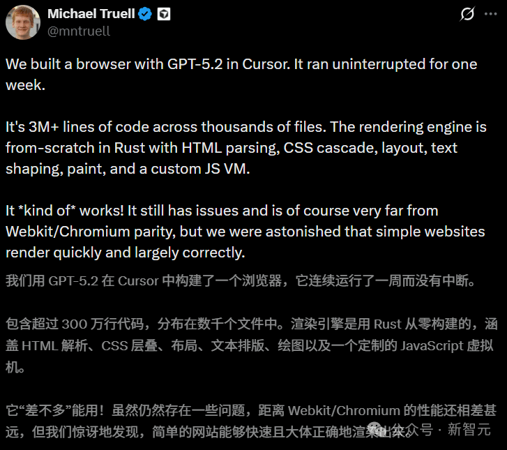
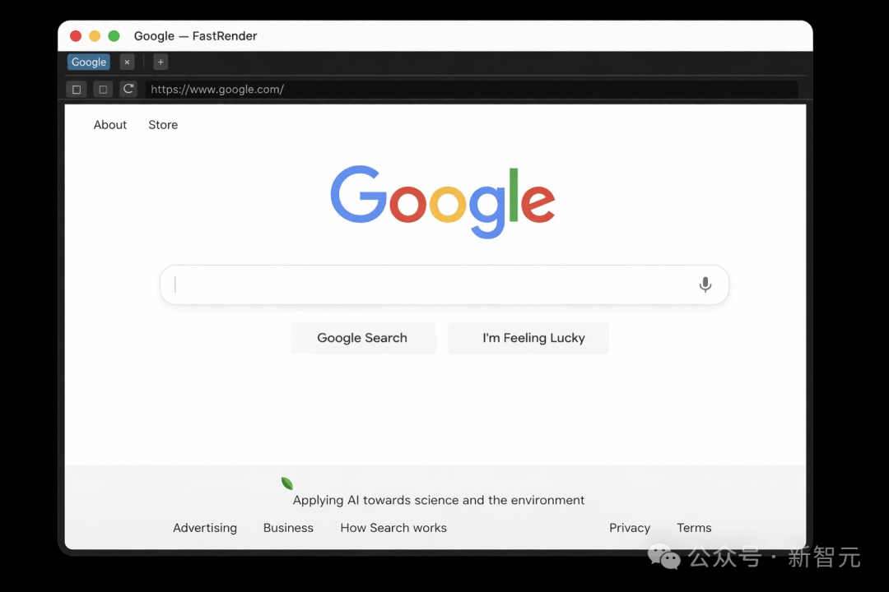
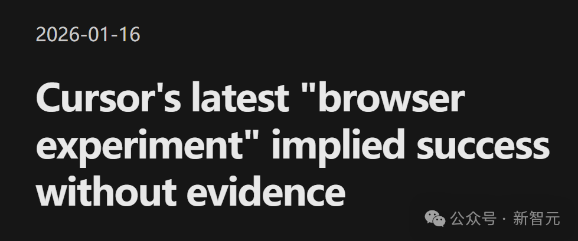
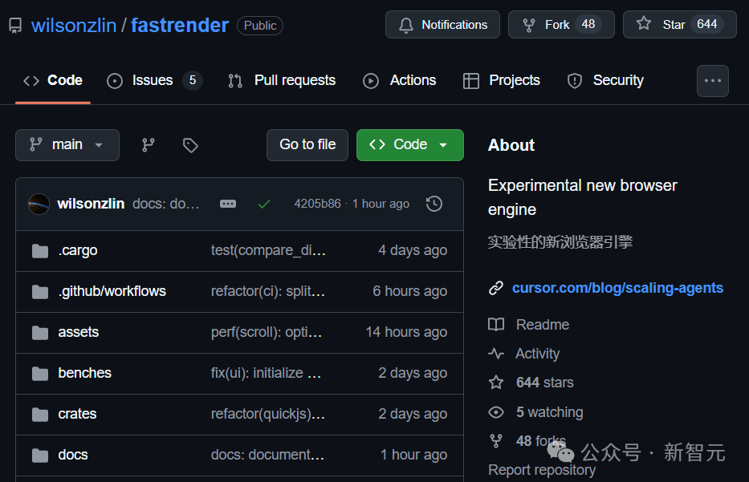
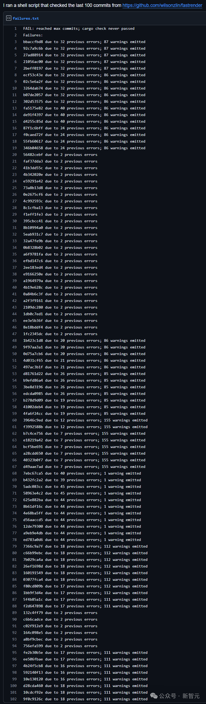
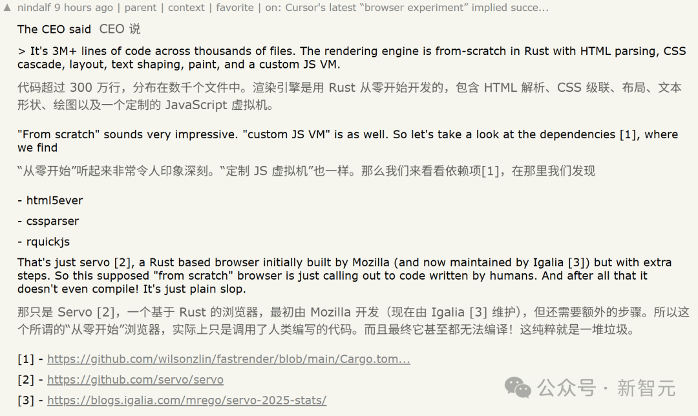
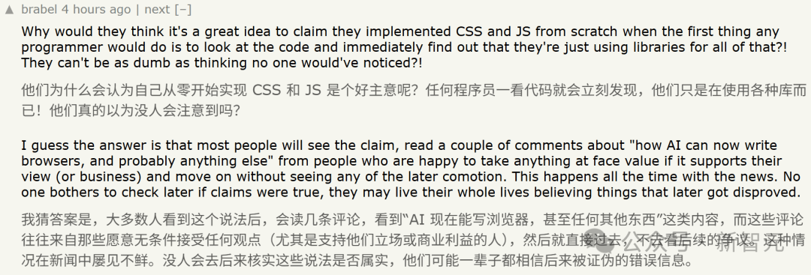
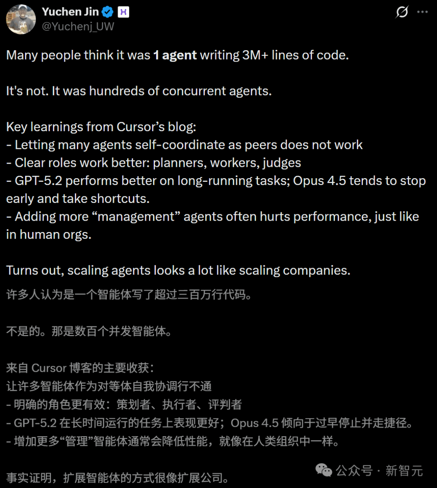
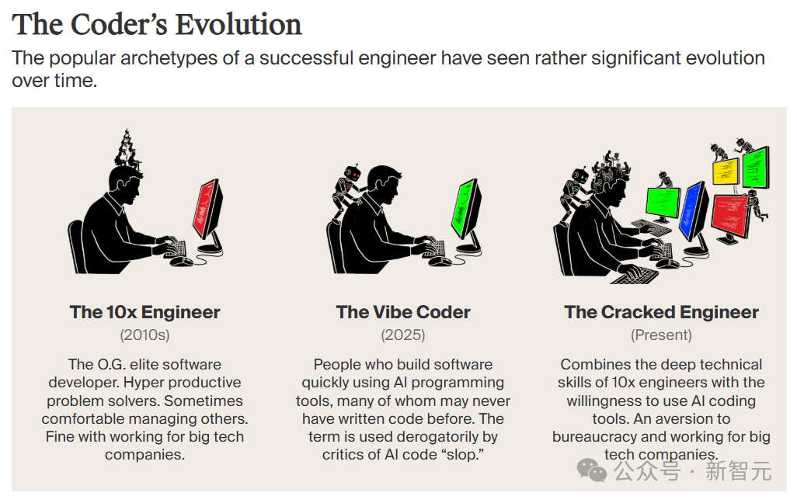

# Cursor一夜翻车，AI 300万代码写浏览器被打假！全网群嘲「AI泔水」

### 

转自：**新智元**

前几天，整个AI圈都被Cursor的一则重磅消息给炸晕了。

事情是这样的：

Cursor声称，他们让GPT-5.2驱动的编码智能体连续运行了整整7天，也就是168个小时。

[结果，这群AI智能体居然从零开始，写出了一个包含300万行代码、功能堪比Chrome的浏览器！](https://mp.weixin.qq.com/s?__biz=MzAxODE2MjM1MA==&mid=2651623855&idx=1&sn=309d72f8c086aac847dce9f6a41cb2e7&scene=21#wechat_redirect)

这听起来实在是太诱人了——

随着Token变得像水电一样廉价，AI可以无限期地自我迭代，直到完成目标。

  

无论是操作系统、办公软件还是游戏引擎，只要算力足够，AI似乎都能给你「肝」出来。

  

  

然而，就在大家还没从震惊中缓过神来的时候，技术社区的「列文虎克」们出手了。

他们仔细扒了扒Cursor开源的这个项目代码，结果发现了一个惊天大瓜——

**这个所谓的「****AI****浏览器」，其实连最基本的编译都通过不了！**

在一篇技术博客中，作者犀利地指出：

Cursor口中所谓的「突破性进展」，本质上就是一堆缺乏工程逻辑的「AI泔水」（AI Slop）。

  

他们所做的，其实在宣传上玩了一手漂亮的「障眼法」，让所有人都以为这个项目真的跑通了。

但实际上，这根本就是一堆无法运行的废代码。

博客地址：https://embedding-shapes.github.io/cursor-implied-success-without-evidence/

  

**GPT-5.2七天肝出一个浏览器，是假的？**

##   

接下来，让我们来仔细看看开发者社区的这篇「打假」文章，是如何抽丝剥茧地发现Cursor这一波宣传的不实之处的。

首先，作者分析了一下Cursor具体都干了什么。

在1月14日，他们发布了一篇题为「Scaling long-running autonomous coding」的博文。

官方博客：https://cursor.com/blog/scaling-agents

在这篇文章中，他们聊到了让「编码智能体自主运行数周」的实验，其明确目标是：

了解我们能将智能体编码的边界推进到什么程度，从而完成那些通常需要人类团队花费数月时间才能完成的项目。

  

然后，Cursor的研究者讨论了尝试过的一些方法，分析了失败原因，以及该如何解决问题。

终于，他们找到了某种方案，它「解决了我们大部分的协调问题，并让我们在不依赖单一智能体的情况下，将规模扩展到非常大的项目」。

最终，这种方案实现了一种惊人的结果——

为了测试这个系统，我们给它定了一个雄心勃勃的目标：从零开始构建一个网络浏览器。这些智能体运行了将近一周，在1,000个文件中编写了超过100万行代码。

  

同时，他们在GitHub上放出了源代码。

GitHub项目：https://github.com/wilsonzlin/fastrender

这就奇怪了，所以这个任务，智能体成功完成了吗？

如果你没有被这句话成功带节奏，就会发现这个扑朔迷离之处——

他们声称「尽管代码库规模很大，新的智能体仍然可以理解它并取得有意义的进展」，以及「数百个worker并发运行，推送到同一个分支，冲突极少」，但他们从未真正说明这个尝试成功没有。

它真的能跑起来吗？你自己能运行这个浏览器吗？我们不知道，而且他们从未明确说过。

所谓的演示，只是一个短短8秒的「视频」：

在下方，他们写道：

虽然这看起来像是一个简单的截图，但从零开始构建一个浏览器是非常困难的。

  

总之，从头到尾，他们从未斩钉截铁地承认过：这个浏览器是可运行且功能正常的！

  

**打开一看：全是报错，跑都跑不起来**

##   

总之，如果只是看README、Demo截图，甚至是几段宣传性质的描述，这个项目好像真的很厉害。

可是，只要你真正**clone****仓库****、运行一次cargo build或cargo check，问题就会立刻暴露出来**。

error: could not compile 'fastrender' (lib) due to 34 previous errors; 94 warnings emitted

  

可以说，这个代码库距离一个「可工作的浏览器」还差得远了，甚至可以说，它从未被真正成功构建过！

文章作者发现了如下多个证据。

首先，**GitHub Actions在main分支上的多次近期运行全部失败**，其中甚至包含 workflow文件本身的错误。

另外，如果尝试独立构建，就会发现报了数十个编译器错误，最近的PR还都是在CI挂掉的情况下合并的。

更夸张的是，如果翻看Git的历史记录，从最近的提交往回追溯100个提交，简直找不到哪怕一个能干净编译的提交。

也就是说，这个仓库从诞生起，就从未处于「能跑」的状态。

上下滑动查看  

https://gist.github.com/embedding-shapes/f5d096dd10be44ff82b6e5ccdaf00b29  

现在我们根本无法确定，Cursor的研究者在这个代码库上释放的「智能体」实际上干了什么，但它们似乎从未运行过cargo build，更不用说cargo check了。

因为这两个命令都会报出几十个错误和大约100个警告。如果真的去修这些错误，报错数量肯定还会爆炸式增长。

目前在他们的仓库中，有一个关于此的未解决GitHub issue。

issue地址：https://github.com/wilsonzlin/fastrender/issues/98

结论已经非常明显：

这根本就不是真正的工程代码，而是典型的「AI Slop」（AI泔水）。

  

这种低质量的代码堆砌，或许在形式上模仿了某种功能，但其背后缺乏连贯的工程意图，实际上连最基本的编译都无法通过。

在Cursor的演示中，他们大谈下一步的宏伟计划，却对「如何运行」、「预期效果」或「工作原理」只字不提。

而且，除了丢出一个代码仓库链接，Cursor没有提供任何可复现的演示，也没有给出任何已知可用的版本标签（tag/release/commit）来验证那些光鲜亮丽的截图。

无论初衷如何，Cursor的博文试图营造出一个「功能正常的原型」的假象，却遗漏了工程界最看重的基本诚实——**可复现性**。

他们确实没有明确声称「它能正常运行」，这让他们在字面上避开了「撒谎」的指控，但这种误导性极强。

到目前为止，他们唯一证明的只是：

AI智能体可以疯狂输出数百万个Token，但最终生成的代码依然是一堆无法运行的废料。

  

一个「浏览器实验」不需要对标Chrome，但它至少应该有一个合理的最低标准：

在受支持的工具链上编译通过，并渲染一个简单的HTML文件。

  

很遗憾，Cursor的文章和公开构建均未达到这一及格线。

****

**GitHub被冲，开发者怒了**

###   

这种把「半成品」包装成「里程碑」的行为，彻底激怒了开发者社区。

在GitHub的Issue区，愤怒的留言刷了屏：

- 我也试了，根本跑不起来。
- 代码逻辑风马牛不相及，CI全红也敢合并？我们是在对着截图膜拜吗？
- 既然功能是假的，开源这个仓库有什么意义？为了证明AI能制造电子垃圾吗？

还有人一针见血地指出了这种「泡沫工程」的本质：

反正投资人看不懂代码，甚至不知道GitHub是什么。

  

只要是电脑自动写的代码，业绩曲线就能蹭蹭涨，机器一响，黄金万两……

  

而且在Hacker News上，也有近200条讨论，将这一项目的底裤彻底扒了下来。

网友pavlov指出，所谓的「从零开始」和「定制JS虚拟机」纯属忽悠。

看一眼依赖列表（html5ever, cssparser, rquickjs）就能发现，这东西本质上就是Mozilla开发的Servo引擎的「套壳」版。

网友brabel更是哭笑不得：

这帮人居然觉得声称「从零手搓」是步好棋？

  

程序员上手第一件事就是查依赖，一眼就能看出是在调包。

  

唯一的解释是，他们赌没人会认真核实，毕竟大多数人只会看个标题就欢呼。

  

  

**Anthropic太强势，Cursor被逼急了？**

##   

虽然Cursor从未直说「这已准备好投入生产」，但他们却用「从零构建」和「有意义的进展」这种宏大叙事，配合精心挑选的截图，成功制造了「实验成功」的假象。

他们最接近成功的表述是：

数百个智能体可以在同一个代码库上协同工作数周，取得真正的进展。

  

但这句惊人的声明，没有任何证据支持。

没有可工作的 commit，没有构建说明，没有演示。

大家并不指望它成为下一个Chrome，但如果你声称你已经构建了一个浏览器，它至少应该能够演示被编译 + 加载一个基本的HTML文件，不然就是纯纯地愚弄大众了。

其实Cursor这个AI自动编程一周的消息一出来，就让人觉得有点奇怪。

最近一个月，全球AI圈的高光时刻，基本都在Claude Code身上。

Claude Code之父Boris Cherny的X发帖，基本上都会引起社区的震动。比如他说自己过去30天内没写一行代码，对Claude Code代码库的贡献，全部由Claude Code自己完成。

谷歌首席工程师Jaana Dogan所说，Claude Code一小时内，就完成了整个团队整整一年才做完的任务。

前特斯拉AI总监Andrej Karpathy更是直言：硅谷正在经历一场九级地震，自己从未感觉如此落后……

在这种形势下，一篇「编码智能体运行一周，自己写出一个浏览器」的叙事，是多么顺应潮流，多么吸引眼球啊。

也难怪Cursor工程师尝试这个脑洞后，没怎么多想就着急地发出来，这才被火眼金睛的开发者们冲了。

  

**AI程序员超进化：「开挂」工程师**

  

这次「浏览器闹剧」虽然惨烈，但也意外地揭示了AI编程的真实进化路径。

Hyperbolic联创兼CTO Yuchen Jin指出了Cursor演示中隐含的关键教训：单纯堆砌数量是行不通的。

让一堆智能体平级相处、自我协调，只会带来混乱。

· 角色分工必须明确：需要有规划者（Planner）、执行者（Executor）和评审员（Reviewer）。 

· 模型差异化：GPT-5.2更适合长程规划任务；而Opus 4.5容易「早退」和偷懒。 

· 组织架构：增加太多「管理层」智能体反而会拖累效率，这与人类公司的「大企业病」如出一辙。

  

HyperWriteAI的CEO Matt Shumer也在复现过程中发现，只要运行框架和能力支持到位，明确分工的AI智能体集群确实能产生实质性进展。

  

然而，更深层的进化不仅仅发生在**AI****身上，更发生在人类工程师身上。**

在硅谷，一个新的流行词正在取代老派的「10倍工程师」，那就是——**「Cracked Engineer」（开挂工程师）**。

这个词，是指那些一个人能顶一个团队的顶级开发者。

Cursor这次的翻车，恰恰是因为它Karpathy所说的「氛围编程」陷阱——

只享受AI疯狂生成代码的爽感，却完全抛弃了工程严谨性。

  

由此诞生的，只能是那种如果不修补就无法运行的「Cursor搬运工」式废料。

  

真正的「开挂工程师」是这一现象的反面。他们疯狂使用AI，但绝不盲信AI。

他们拥有深厚的技术底蕴，能够一眼揪出AI生成的逻辑漏洞，能够清理像这次浏览器项目中出现的「电子泔水」。

正如初创公司Intology的创始人所言：

少数几个专注且懂行的人加上AI，能比过去15个不用AI的人干得更多。

  

未来的软件开发，不会是数千个无人监管的AI智能体像无头苍蝇一样乱撞（然后造出一个编译不过的浏览器）；而是由一名「开挂工程师」，带领着数十个AI Agent，精准、高效地构建出真正的产品。

而这些「开挂」的程序员，也将会淘汰那些只会「假装在编程」的人。

参考资料：  

https://embedding-shapes.github.io/cursor-implied-success-without-evidence/

https://www.theinformation.com/articles/forget-vibe-coders-cracked-engineers-rage-tech
