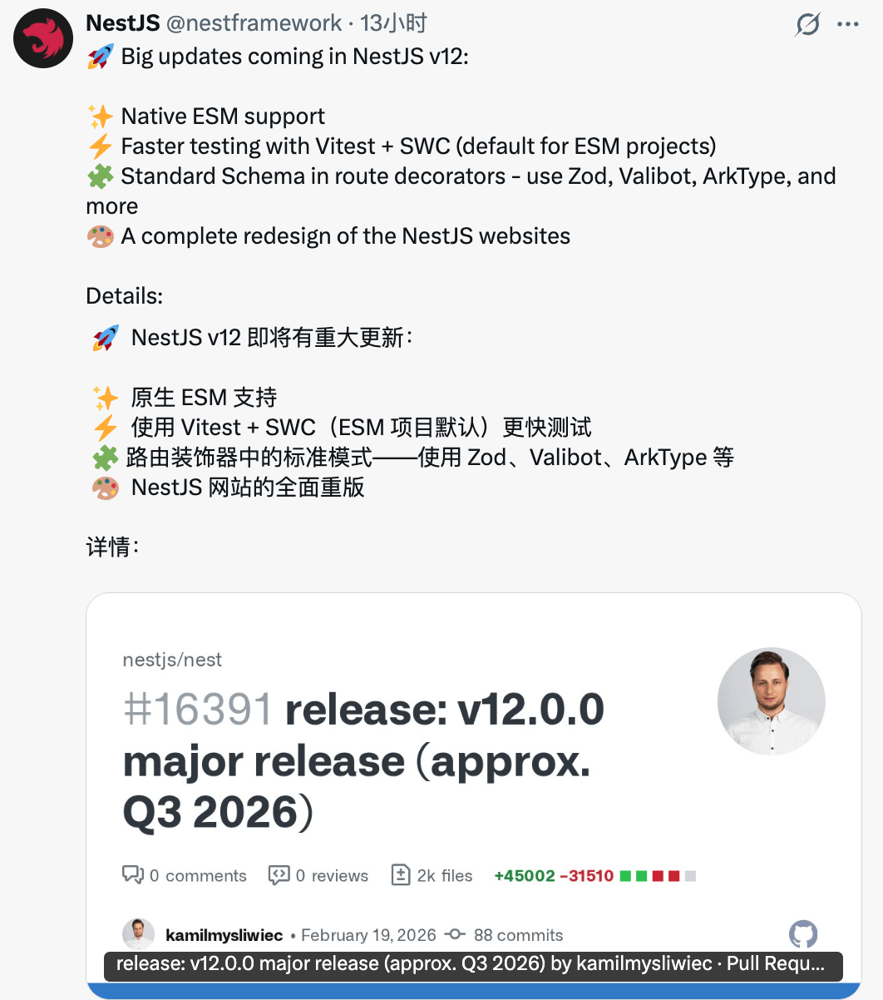
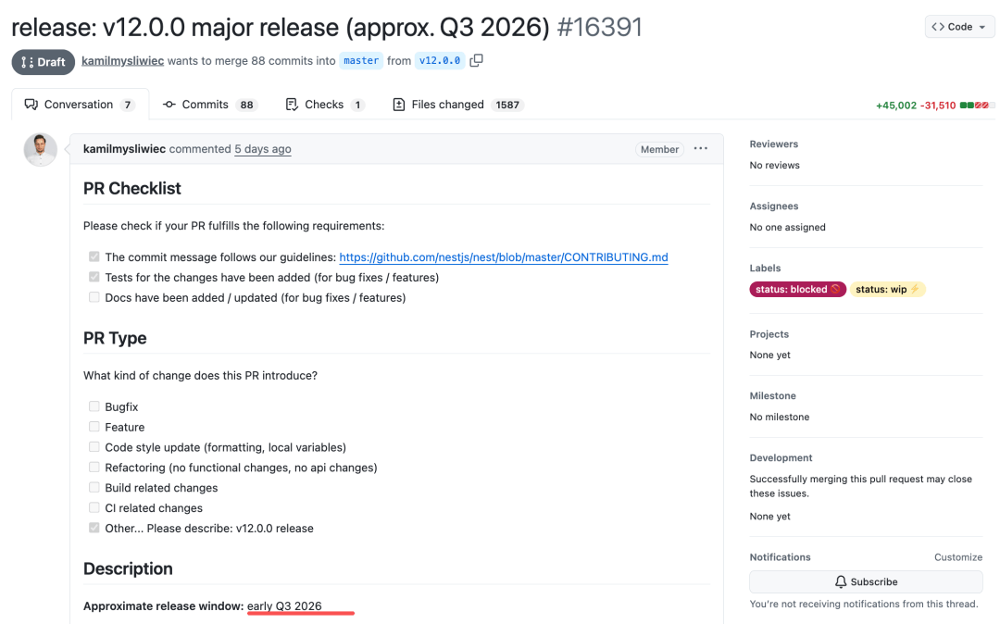

# NestJS v12 将迎来重大更新：全量 ESM、Vitest 上位、Zod 直连，老项目还能平滑升级？

```js_darkmode__1
点击上方 程序员成长指北，关注公众号
回复1，加入高级Node交流群
```
作者：Nodejs技术栈五月君   

昨天，NestJS 官方在 X 上发了一条帖子，宣布 v12 正在推进中。底下的链接指向一个 **Draft PR**，编号 [#16391](javascript:;)，标题是「release: v12.0.0 major release (approx. Q3 2026)」。



## 背景：NestJS 在 Node.js 后端框架中的地位

先简单说一下背景，NestJS 是一个基于 Node.js 的后端框架，用 TypeScript 写，设计风格类似 Java 的 Spring —— 大量装饰器、依赖注入、模块划分，适合团队协作和大型项目。目前 GitHub 上有 **75K+ Star**，在 Node.js 后端框架里算是企业级选型的主流选项之一。

它已经发布了很多年，中间经历过几次大版本迭代。每一次大版本发布前，开发者们都会问同一个问题：**我的老项目要不要跟？跟了会不会踩坑？**

v12 也不例外。

---

## 先说时间线

根据 PR 描述，**正式发布目标是 2026 年 Q3 初**（大约 7 月前后）。

在此之前，各包可能会在 **Q2** 以 `next` tag 先行发布，开发者可以提前在测试项目里跑一跑，帮官方发现问题。

目前 PR 仍是 Draft 状态，标签是「WIP」和「blocked」，说明还有工作没完成。具体日期可能微调，但核心方向已经写进了 PR 描述里，不太会大改。



---

## 全量 ESM：一件「拖了很久的事」终于要做了

v12 最核心的架构变化：**NestJS 的所有官方包从 CommonJS（CJS）迁移到 ESM**。

很多人可能对这个词不陌生，但不一定知道它为什么「拖了这么久」才做。这里简单解释一下背景。

Node.js 生态里长期有两套模块系统并存：

- **CJS**（CommonJS）：用 `require()` 加载，是 Node.js 最早的模块系统，大量老项目都用这套。
- **ESM**（ES Modules）：用 `import` 加载，是 JavaScript 标准规范，浏览器和 Deno 都原生支持。

这两套系统长期"不兼容"。具体来说，如果一个包是纯 ESM，你在 CJS 项目里直接 `require()` 它会直接报错。这意味着 NestJS 如果早早全量切 ESM，会强迫所有 CJS 用户先改造自己的项目 —— 迁移成本太高，官方一直没敢动。

**转折点出现在 2024 年底**：Node.js 让 `require(esm)` 进入稳定状态。这个能力允许 CJS 项目直接 `require()` 一个 ESM 包，不再报错。NestJS 官方在 PR 里专门提到了这件事：

> “
> 
> "The availability of `require(esm)` was the missing piece that made the move to ESM practical - without it, the migration wouldn't have made much sense."

翻译过来就是：**没有 `require(esm)`，这件事根本不值得做。** 有了它，NestJS 才有底气推进全量 ESM。

对老项目用户来说，这是个相对友好的信号 —— 你不一定需要把整个项目改成 ESM，大概率可以继续用 CJS 方式引用新版的 Nest 包。但具体升级边界还是要等官方迁移文档出来再确认。

---

## CLI 新增选项：CJS 还是 ESM，你来选

`@nestjs/cli` 会新增一步提示：**新项目是用 CJS 模板还是 ESM 模板生成？**

这不是强制迁移，而是给新项目更多选择空间。老项目不受影响，继续走原来的格式就好。

---

## 测试框架：Vitest 接替 Jest，但 Jest 没有消失

v12 里，官方仓库和示例项目的测试框架从 **Jest 换成 Vitest**，搭配 SWC 处理 TypeScript 装饰器。

规则很清晰：

- **ESM 模板**的新项目：默认用 **Vitest**。
- **CJS 模板**的项目：继续用 **Jest**。

Vitest 和 Jest 的 API 在大多数场景下是兼容的，写法上差异不大。但如果你有大量 Jest 特有的 mock 写法或插件依赖，迁移时还是要过一遍。

好消息是，你现在就可以去摸 Vitest 的基础用法，不用等 v12 发布。

---

## `@Body`、`@Query` 支持传 Zod schema：class-validator 不再是唯一选项

这是 v12 里对**日常开发习惯**改变最大的一块。

以前在 NestJS 里做参数校验，主流方案是 `class-validator` + `class-transformer`：写一个 DTO 类，打一堆装饰器，再配一个 `ValidationPipe`。这套方案能用，但有些开发者不喜欢它：需要写 class、装饰器语法繁琐、和 Zod 这类现代库的类型推导风格不一样。

v12 之后，路由装饰器（`@Body`、`@Query`、`@Param` 等）会支持一个新的 **`schema` 选项**，可以直接传一个符合 Standard Schema 规范的对象。Zod、Valibot、ArkType 都符合这个规范。

用法大概是这个方向：

`import { z } from 'zod'; const CreateUserSchema = z.object({   name: z.string(),   age: z.number().int().positive(), }); @Post() create(@Body({ schema: CreateUserSchema }) body: z.infer<typeof CreateUserSchema>) {   // body 已经过 Zod 校验，类型也是自动推导的 }`

序列化拦截器也会接入同样的机制。

这不是强制替换 `class-validator`，而是**多了一条路**。如果你的团队已经在用 Zod 做前端校验，或者就是不想写 class DTO，v12 之后可以在 Nest 里统一用同一套校验逻辑。

---

## 还有哪些变化？

除了以上几块主线，PR 关联的提交里还合并了一些相对独立的改动，列举几个：

- **生命周期钩子按组件层级调用**：钩子触发顺序更符合模块依赖结构，不容易出现「子模块销毁了，父模块还在用」的问题。
- **Express 适配器支持优雅关闭（Graceful Shutdown）选项**：可以在配置里直接开启，不用自己实现关闭逻辑。
- **WebSocket 断开连接时携带 reason 参数**：调试断连问题更直接。
- **`ValidationPipe` 支持 `errorFormat` 选项**：可以定制校验错误的输出格式。
- **NATS 微服务迁移到 v3**：如果你在用 NestJS 的微服务模块且依赖 NATS，这块需要额外关注。
- **官网完整改版**：具体效果要等上线才知道。

另外还有一些 breaking changes 散落在各个包，PR 里没有逐一列出，需要等正式 changelog 再对号入座。

---

## 对开发者意味着什么？

拆成两类用户来看：

**如果你是新项目**：可以直接选 ESM + Vitest 模板，用 Zod 做校验，站在「新基线」上起步，技术选型上会更现代一些。

**如果你有在跑的老项目**：短期不用动，等 Q2 `next` 版本出来之后可以在测试环境里试升，观察有没有 breaking 影响，再决定正式迁移的时机。NestJS 官方明确表示，借助 `require(esm)`，老 CJS 项目的迁移成本「应该不会太高」，但「应该」不等于「一定」，保险起见还是要跑一遍。

---

## 总结

v12 的几个核心动作——全量 ESM、测试栈换 Vitest、路由装饰器支持 Zod——都不是突然拍脑袋做的决定，而是跟着 Node.js 生态和前端工具链的演进在走。整体方向是「往现代靠」，但执行策略上给老项目留了退路。

距离 Q3 发布还有几个月，值得提前关注的节点是 **Q2 的 `next` tag 预览版**。到时候可以拉下来跑一跑，看看自己的项目有没有需要提前处理的兼容问题。

---

_参考：nestjs/nest PR [#16391](javascript:;) — release: v12.0.0 major release (approx. Q3 2026)_

Node 社群

```js_darkmode__116

我组建了一个氛围特别好的 Node.js 社群，里面有很多 Node.js小伙伴，如果你对Node.js学习感兴趣的话（后续有计划也可以），我们可以一起进行Node.js相关的交流、学习、共建。下方加 考拉 好友回复「Node」即可。   “分享、点赞、在看” 支持一波👍
```
