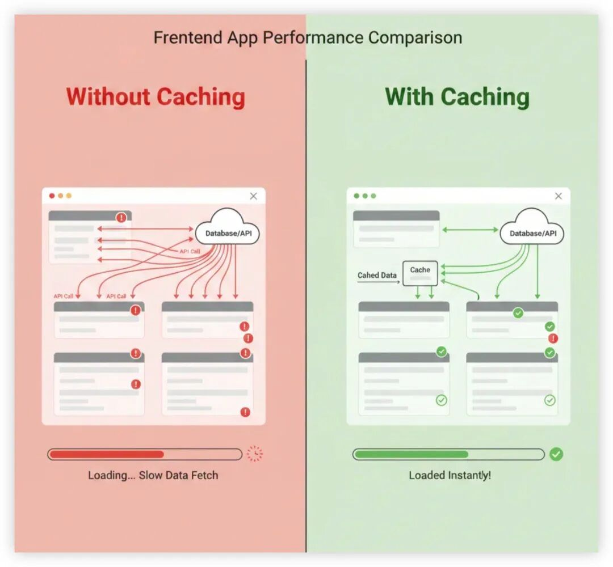
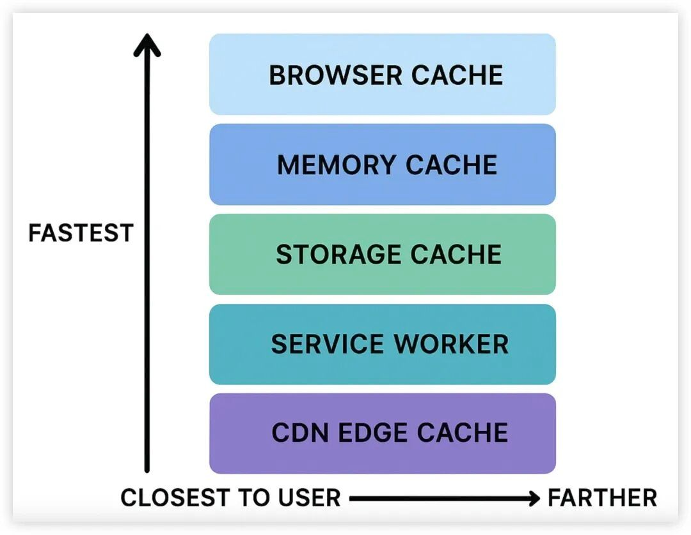

# 前端缓存：最被低估的性能优化技巧

```js_darkmode__1
点击上方 程序员成长指北，关注公众号
回复1，加入高级Node交流群
```
如果你问前端开发者如何提升性能，最常见的回答通常是：

“用 lazy loading……”“优化图片……”“用 React memo……”“拆分 bundle……”这些都没错，也都很重要——但几乎没有哪一项，能像**合理的缓存**一样，带来如此巨大的性能提升。

缓存是前端世界中**杠杆率最高的性能工具**，但同时也是**最容易被误解、使用率最低**的一个。很多开发者认为缓存是“后端团队该管的事”，结果就是：**90% 的前端应用发起了远远超出必要数量的网络请求**。

在这篇文章中，我们将拆解前端缓存真正的威力，讲清楚如何正确使用缓存，以及它如何帮你节省带宽、时间、成本，并减少大量用户的挫败感。

为什么前端缓存被严重低估

大多数前端工程师都会忽略一件事：

**在第一次 API 请求之前，每节省 1ms，都会对用户的感知性能产生指数级提升。**

想想这些常见的用户行为：

- 重新打开页面
- 切换标签页
- 刷新信息流
- 在不同路由之间跳转

如果你的前端在数据没有变化的情况下，每次都重新请求后端，你消耗的其实是：

- 用户时间
- 后端成本
- 移动端流量
- 电池电量
- CPU 周期

而这一切，**几乎毫无意义**。

前端缓存可以非常优雅地解决这个问题——而且几乎是立竿见影。

## 1\. Browser Cache —— 被忽视最多的性能加速器

浏览器本身已经为你提供了一层非常强大的缓存能力，用于缓存：

- 静态资源
- HTML
- JS bundles
- 字体
- 图片

但真正的“魔法”只有在服务器设置了**正确的响应头**时才会生效。

🚀 Cache-Control 示例：

```code-snippet__js
Cache-Control: public, max-age=31536000, immutable
```
这会告诉浏览器：

- “把这个资源缓存 1 年”
- “除非文件名变化，否则不要重新下载”
- “每次都可以安全复用这个版本”

这也是为什么像 YouTube、Meta、Twitter 这样的网站，在首次访问后几乎是“秒开”。

### 什么时候不该用

**HTML 文档不要缓存**，一定要保持非缓存状态：

```code-snippet__js
Cache-Control: no-store
```
这样可以避免新版本发布时，用户仍然看到旧的 UI。

## 2\. Memory Cache —— 应用内最快的“RAM”

这种缓存发生在你的应用内部（React、Vue、Svelte）。

一旦你把 API 返回的数据存进内存，它就可以在：

- 多次 rerender 之间复用
- 页面跳转之间复用
- 有时甚至跨组件复用

### 示例：简单的 React Memory Cache

```code-snippet__js
let _cache = {};


export async function fetchCached(url) {
  if (_cache[url]) return _cache[url];


  const res = await fetch(url);
  const data = await res.json();
  _cache[url] = data;


  return data;
}
```
### 突然之间，第二次加载变成了：

- 0ms
- 无网络请求
- 无等待

你会惊讶地发现，有多少应用连这一步都没做。

## 3\. LocalStorage / SessionStorage —— 持久化缓存

适合以下场景：

- 数据几乎不变
- 用户经常回访
- 需要离线能力
- 页面 reload 不应该触发 API 请求

⭐ 示例：缓存 API 响应 24 小时

```code-snippet__js
const KEY = "dashboard-stats";
const EXPIRE = 24 * 60 * 60 * 1000;


export async function getDashboardStats() {
  const cached = JSON.parse(localStorage.getItem(KEY) || "null");


  if (cached && Date.now() - cached.time < EXPIRE) {
    return cached.data;
  }


  const res = await fetch("/api/stats");
  const data = await res.json();


  localStorage.setItem(
    KEY,
    JSON.stringify({ time: Date.now(), data })
  );


  return data;
}
```
即使刷新页面，UI 也能瞬间加载完成。

## 4\. Service Workers —— 浏览器的缓存超能力

如果你想要**最高级别的控制能力**，Service Workers 就是王者。

你可以获得：

- 离线模式
- stale-while-revalidate
- 优化的预取（prefetch）
- 后台同步
- 对 Cache API 的完全控制

### 示例：使用 SW 缓存 API

```code-snippet__js
self.addEventListener("fetch", (event) => {
  event.respondWith(
    caches.match(event.request).then((cached) => {
      const networkFetch = fetch(event.request).then((res) => {
        caches.open("v1").then((cache) =>
          cache.put(event.request, res.clone())
        );
        return res;
      });


      return cached || networkFetch;
    })
  );
});
```
### 这会让你的应用变得：

- 极其快速
- 行为高度一致
- 在弱网环境下表现完美

如果你在构建现代 PWA —— 一定要用。

## 5\. HTTP 层缓存：ETags + Stale-While-Revalidate

大多数前端应用在这里都做错了：

请求数据 → 后端返回完整新数据 → 浏览器每次都重新下载

而使用 **ETags + SWR** 后，浏览器和后端之间的交互是这样的：

### 流程：

- 浏览器：“这是我已有资源的 ETag，有变化吗？”
- 后端：“没变化 → 返回 304 Not Modified”
- 浏览器：立刻使用本地缓存的响应
- 只有在内容变更时，后端才返回新的 payload

### 结果：

🔥 加载速度提升 10×🔥 带宽消耗减少 70–95%🔥 后端压力大幅下降

示例响应头：

```code-snippet__js
Cache-Control: max-age=0, must-revalidate
ETag: "abc123"
```
## 6\. 框架级缓存：SWR、TanStack Query、Apollo Cache

现代前端框架已经内置了非常强大的缓存能力。

➤ React + SWR

```code-snippet__js
const { data } = useSWR('/api/user', fetcher, {
  revalidateOnFocus: false,
});
```
➤ React Query（TanStack Query）

```code-snippet__js
useQuery(["todos"], fetchTodos, {
  staleTime: 1000 * 60 * 5, // 5 minutes
});
```
这会带来：

- 智能缓存
- 后台同步
- 自动 stale 失效
- optimistic UI

大量应用在每次路由切换时都会重新 fetch 所有数据——这些库可以非常优雅地解决这个问题。

## 7\. Prefetching、Preloading & Prerendering —— 看不见的缓存

Google、Amazon、Netflix 都在用这一套。

Prefetch：“用户**可能**很快会点这里”

```code-snippet__js
<link rel="prefetch" href="/next-page">
```
Preload：“这个资源很关键，**现在就要加载**”

```code-snippet__js
<link rel="preload" href="hero-image.jpg" as="image">
```
Prerender：“在后台把整个页面都加载好”

```code-snippet__js
<link rel="prerender" href="/checkout">
```
这会让下一次导航的体验几乎是瞬间完成。

## 8\. CDN 缓存 —— 最强大的缓存层

你的 CDN（Cloudflare、Fastly、Akamai、Vercel）可以提供：

- 边缘缓存（edge caching）
- 边缘层的 stale-while-revalidate
- 动态回退缓存
- 全球分布式读副本

示例：

```code-snippet__js
Cache-Control: public, max-age=60, stale-while-revalidate=120
```
即使在拉取新数据的过程中，用户也能立刻拿到响应。

正确配置 CDN，可以为公司节省数百万的基础设施成本。

## 9\. 能真实体现效果的实际案例

示例 1 —— Dashboard 加载速度提升 5×一个在每次路由变化时都会刷新的 dashboard。加入 memory + storage 缓存后，网络请求减少了 83%，加载时间从 1.8s 降到 350ms。

示例 2 —— 移动端应用节省 40% 用户流量通过 LocalStorage 缓存 + ETag 校验，避免了重复列表数据的下载。

示例 3 —— 一个严重的前端安全问题不当的缓存策略可能会暴露敏感数据（例如：被公开缓存的鉴权页面）。

# 总结

前端缓存并不只是“一个优化手段”。

它是前端开发者能使用的、**最强大、影响最大、却最常被忽视**的性能策略之一。

如果实现得当，缓存可以：

- 将加载时间减少 70–90%
- 显著降低后端请求数量
- 让应用拥有“瞬开”的体验
- 节省用户带宽
- 改善离线体验
- 降低服务器成本
- 在正确使用的前提下提升安全性

下次做性能优化时，不要一开始就盯着 bundle 体积和 lint 规则。

先问一个问题：

**“哪些东西可以缓存？”**

因为在前端性能领域，缓存不是事后优化——**它是一种超能力。**

地址：

https://medium.com/javascript-in-plain-english/frontend-caching-the-most-underrated-performance-technique-nobody-talks-about-7f4f207d0ce0

作者： Priyen Mehta | Senior Full-Stack Developer

Node 社群
