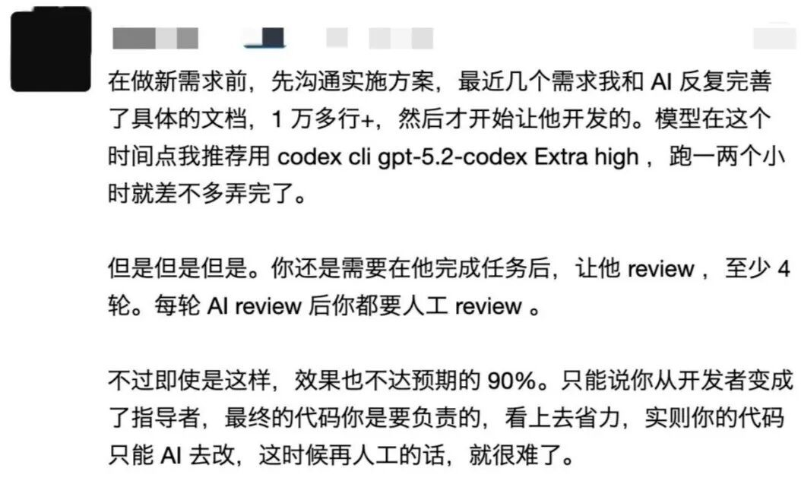

# 天天叫 AI 编程多厉害，真用起来气死人啊

最近看到有位程序员用 AI 写公司的一些底层框架，发现 AI 生成的代码完全不考虑缓存击穿、性能这些问题。

  

有不少程序员根据自己使用 AI 的开发经历给出了具体的建议

有网友认为，AI 时代的表达能力就是生产力：通过拆分需求、分步规划并提供清晰的实现思路 

  

还有经验丰富的开发者分享了“重文档、轻直接生成”的策略：通过与 AI 反复磨合出万行级别的详细规格文档 

  

更有回帖犀利指出，高效使用 AI 的前提是像程序员一样思考，而非像项目经理那样“画饼” 

  

你开始用 AI 写代码了吗？ 是不是也遇到到类似的问题？ 上面的经验分享希望对你有用，欢迎在评论区探讨
