# 字节全家桶 Seed 2.0 + TRAE 玩转 Skill

## 一、引言

国产大模型之中，字节是一个异类。

不像其他大模型轰轰烈烈、争夺眼球，它更低调，不引人注目。

但是，它做的事情反倒最多，大模型、Agent、开发工具、云服务都有独立品牌，遍地开花，一个都不缺，都在高速推进。

Seed 是字节的大模型团队，底下有好几条产品线，最近热得发烫的视频模型 Seedance 2.0 就是他们的产品。

今天，我就用字节的全家桶 ---- 刚刚发布的 Seed 2.0 模型和开发工具 TRAE ---- 写一篇 Skill 教程。

大家会看到，**它们组合起来既强大，又简单好用，（个人用户）还免费**。这也是我想写的原因，让大家知道有这个方案。

只要十分钟，读完这篇教程，你还会明白 Skill 是什么，怎么用，以及为什么一定要用它。

## 二、Seed 2.0 简介

先介绍 Seed 2.0，它是 **Seed 家族的基座模型**。

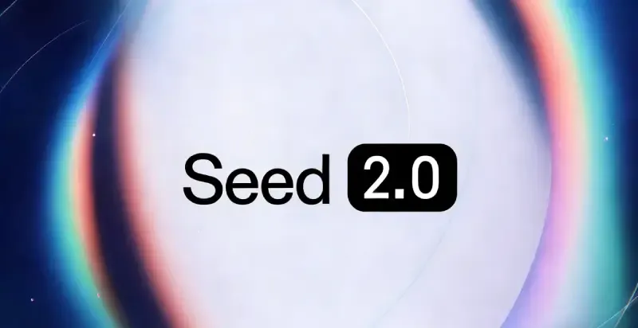

所谓"基座模型"（foundation model），就是一种通用大模型，**可用来构建其他各种下游模型**。最大的两个特征有两个：一个是规模大，另一个是泛化能力强，这样才方便构建别的模型。

大家熟知的豆包，就是基于 Seed 模型，它也被称为"豆包大模型"。这次 Seed 2.0 包含 Pro、Lite、Mini 三款通用模型，以及专为开发者定制的 Seed 2.0 Code 模型。

由于各种用途都必须支持，**Seed 2.0 的通用性特别突出**，比以前版本都要强。

> 1、支持多模态，各种类型的数据都能处理：文字、图表、视觉空间、运动、视频等等。
> 
> 2、具备各种 Agent 能力，方便跟企业工具对接：搜索、函数调用、工具调用、多轮指令、上下文管理等。
> 
> 3、有推理和代码能力。

正因为最后一点，所以我们可以拿它来编程，尤其是生成前端代码。跟字节发布的 AI 编程工具 [TRAE](https://www.trae.cn/) 配合使用，效果很好，特别方便全栈开发，个人用户还免费。

## 三、TRAE 的准备工作

[下载安装](https://www.trae.cn/ide/download) TRAE 以后，它有两种模式，左上角可以切换：IDE 模型和 SOLO 模型。

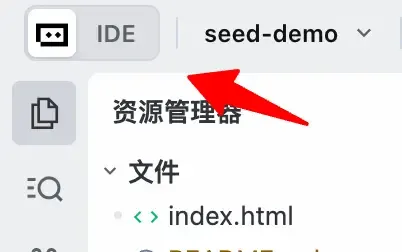

选择 IDE 就可以了，SOLO 是 AI 任务的编排器，除非多个任务一起跑，否则用不到。

然后，按下快捷键 Ctrl + U（或者 Command + U），唤出对话框，用来跟 AI 对话。

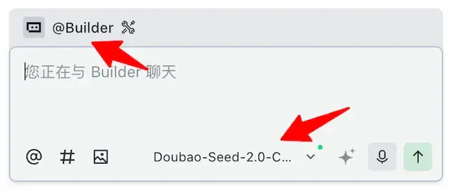

我们要构建 Web 应用，左上角就选 @Builder 开发模式。右下角的模型就选 Seed-2.0-Code。

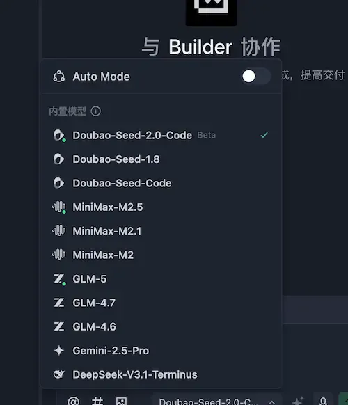

可以看到，TRAE 自带的国产开源编程模型很全，都是免费使用。

准备工作这样就差不多了。

## 四、编程测试

我选了一个有点难度的任务，让 Seed 2.0 生成。

ASCII 图形是使用字符画出来的图形，比如下图。

我打算生成一个 Web 应用，用户在网页上输入 ASCII 图形，自动转成 Excalidraw 风格的手绘图形。

提示词如下：

> "生成一个 Web 应用，可以将 ASCII 图形转为 Excalidraw 风格的图片，并提供下载。"

模型就开始思考，将这个任务分解为四步。

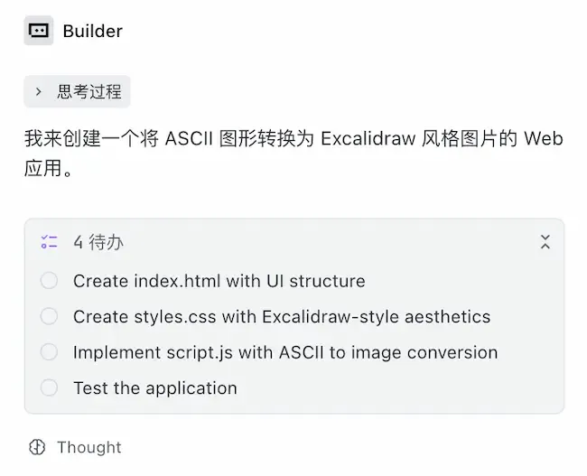

## 五、生成结果

等到 Seed 2.0 代码生成完毕，TRAE 就会起一个本地服务 localhost:8080，同时打开了预览窗口。

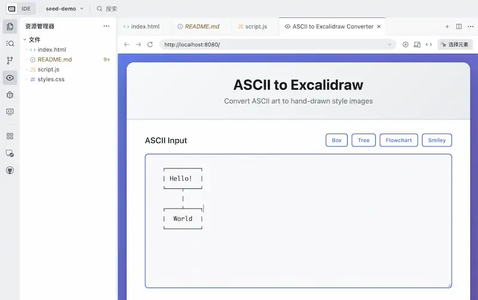

生成的结果还挺有意思，上部的 ASCII 输入框提供了四个示例：Box、Tree、Flowchart、Smiley。下面是 Tree 的样子。

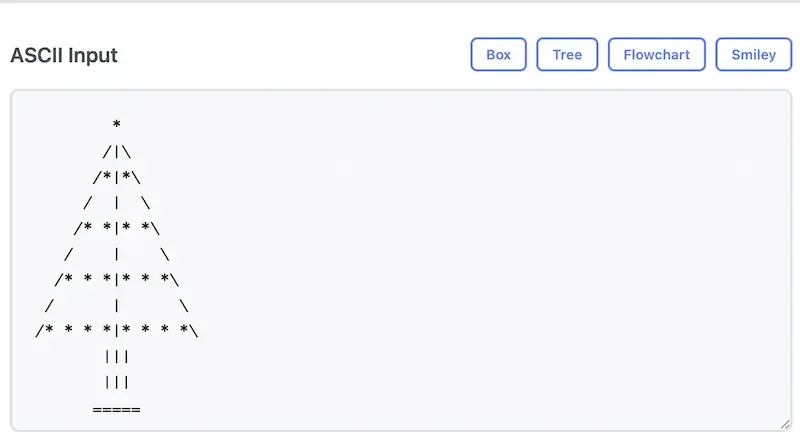

然后是 Excalidraw 参数的控制面板：线宽、粗糙度、弯曲度、字体大小。

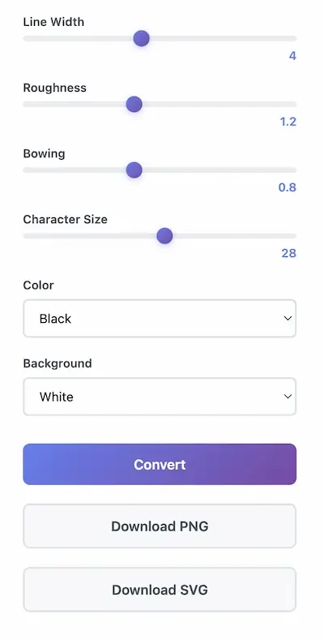

点击 Convert（转换）按钮，马上得到手绘风格的线条图。

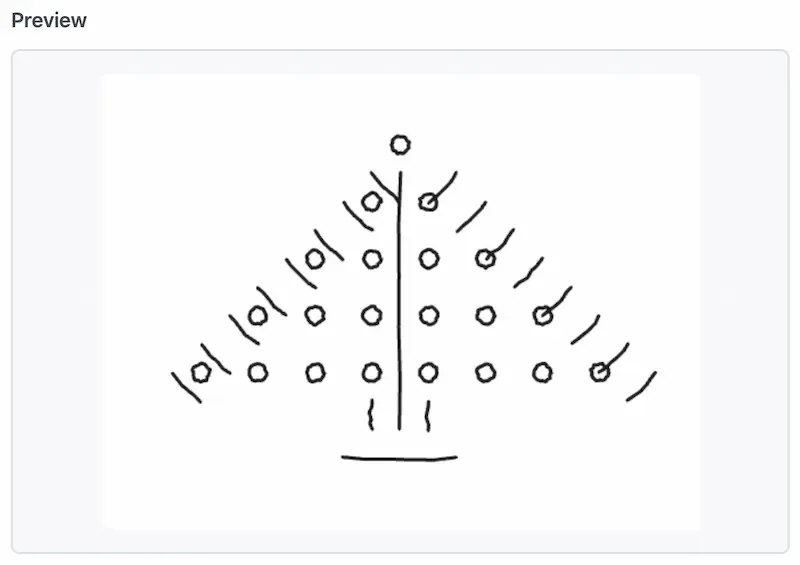

整个页面就是下面的样子。

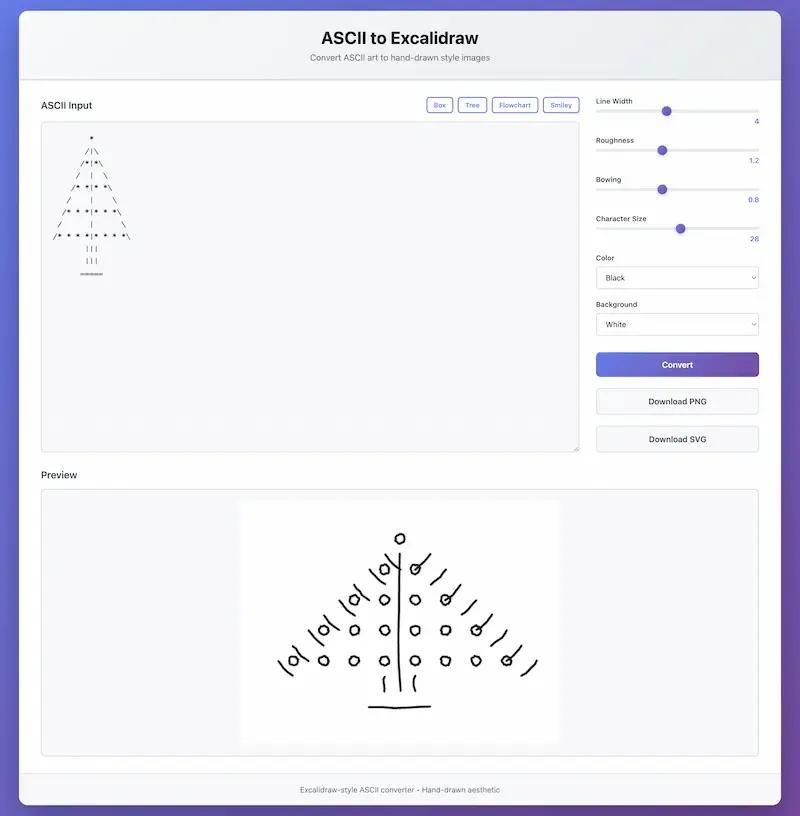

## 六、Skill 简介

这个页面的设计，感觉不是很美观，还可以改进。我打算为 Seed 2.0 加入专门的前端设计技能，使其能够做出更美观的页面。

**所谓 Skill（技能），就是一段专门用途的提示词，用来注入上下文。**

有时候，提示词很长，每次都输入，就很麻烦。我们可以把反复用到的部分提取出来，保存在一个文件里面，方便重复使用。这种提取出来的提示词，往往是关于如何完成一种任务的详细描述，所以就称为"技能文件"。

格式上，它就是一个 Markdown 文本文件，有一个 YAML 头，包含 name 字段和 description 字段。

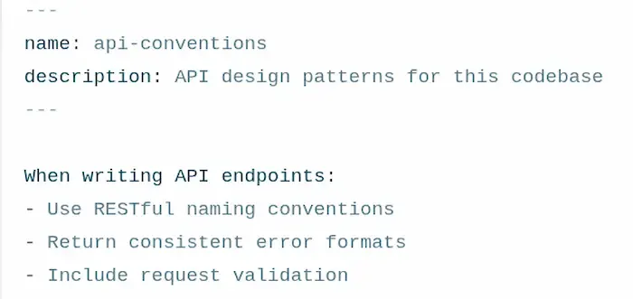

name 字段是 Skill 的名称，可以通过这个名称调用该技能；description 字段则是技能的简要描述，模型通过这段描述判断何时自动调用该技能。

有些技能比较复杂，除了描述文件以外，还有专门的脚本文件、资源文件、模板文件等等，相当于一个代码库。

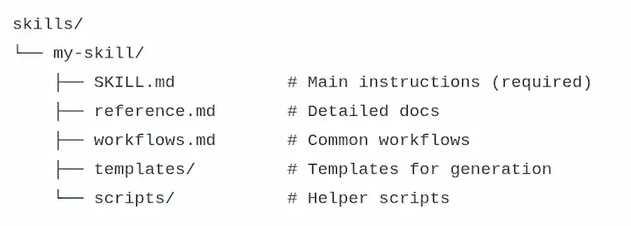

这些文件里面，SKILL.md 是入口文件，模型根据它的描述，了解何时何处调用其他各个文件。

这个库发到网上，就可以与其他人共享。如果你觉得 AI 模型处理任务时，需要用到某种技能，就可以寻找别人已经写好的 Skill 加载到模型。

## 七、前端设计技能

下面，我使用 Anthropic 公司共享出来的[前端设计技能](https://github.com/anthropics/claude-code/blob/main/plugins/frontend-design/skills/frontend-design/SKILL.md)，重构一下前面的页面。它只有单独一个 Markdown 文件，可以下载下来。

打开 TRAE 的"设置/规则和技能"页面。

点击技能部分的"+ 创建"按钮，打开创建技能的窗口。

你可以在这个窗口填写 SKill 内容，也可以上传现成的 Skill 文件。我选择上传，完成后，就可以看到列表里已经有 frontend-design 技能了。

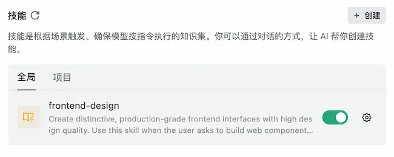

然后，我就用下面的提示词，唤起这个技能来重构页面。

> "使用 frontend-design 技能，重构这个页面，让其变得更美观易用，更有专业感。"

下面就是模型给出的文字描述和重构结果。

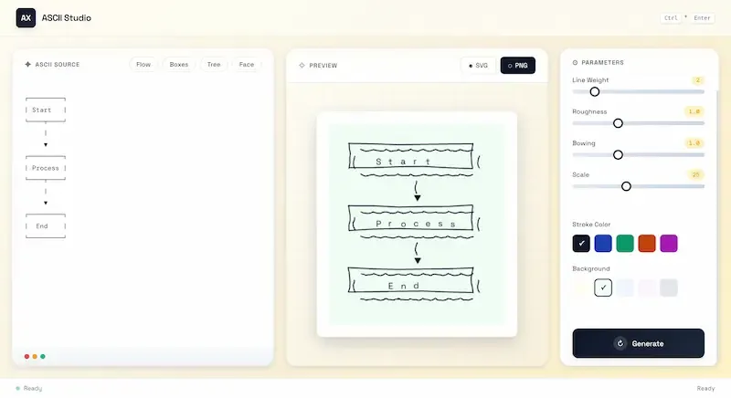

页面确实感觉变得高大上了！

## 八、Vercel deploy 技能

最后，再看一个技能的例子。

代码生成以后，都是在本地机器上运行，能不能发布到网上，分享给更多的人呢？

回答是只要使用 Vercel 公司的 deploy 技能，就能一个命令将生成结果发布到 Vercel 的机器上。

在 Vercel 官方技能的 [GitHub 仓库](https://github.com/vercel-labs/agent-skills/tree/main/skills/claude.ai)里，下载 Vercel-deploy 技能的 zip 文件。

然后，把这个 zip 文件拖到 TRAE 的技能窗口里面，就会自动加载了。

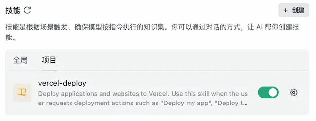

输入提示词："将生成的网站发布到 Vercel"。

模型就会执行 vercel-deploy 技能，将网站发布到 Vercel，最后给出两个链接，一个是预览链接，另一个是发布到你个人账户的链接。

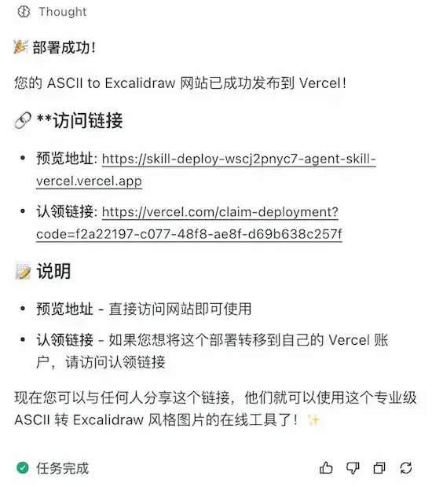

大家现在可以访问[这个链接](https://skill-deploy-wscj2pnyc7-agent-skill-vercel.vercel.app/)，看看网站的实际效果了。

## 九、总结

如果你读到这里，应该会同意我的观点，Seed 2.0 的编程能力相当不错，跟自家的编程工具 TRAE 搭配起来，好用又免费。

Skill 则是强大的能力扩展机制，让模型变得无所不能，一定要学会使用。

（完）
