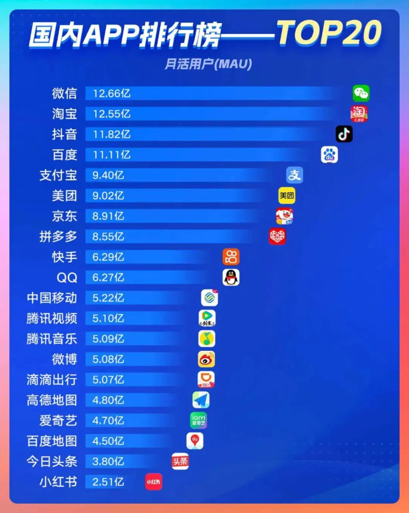

# 2026年值得去的公司排名（结果令人意外）

为啥程序员圈都在喊“有鹅选鹅”？答案直接摆上台面：腾讯系的微信、QQ、腾讯视频、腾讯音乐，全是榜单上的顶流选手。  
  
紧接着是阿里系，淘宝、支付宝（虽属蚂蚁，咱程序员求职视角姑且归为一类）、高德地图，同样强势登榜。  
  
字节系也没掉队，抖音、今日头条双双在列。  
至于豆包、元宝这类AI产品，没出现在榜单里，大概率是统计口径的问题——从产品实力和用户体量来看，明明该有一席之地。  
  
最让部分同学意外的，当属百度系：百度搜索、百度地图稳稳在榜，连其投资的爱奇艺也成功入围。  
  
所以说，网上的各种声音听听就好，别让杂音干扰了自己的求职判断。  
[#国内APP排行榜解读](javascript:;) [#程序员求职指南](javascript:;) [#为什么选择腾讯系](javascript:;) [#程序员圈的鹅文化](javascript:;) [#月活用户MAU分析](javascript:;) [#互联网巨头APP盘点](javascript:;) [#微信QQ腾讯视频音乐](javascript:;)

广东,1月6日 15:12,

