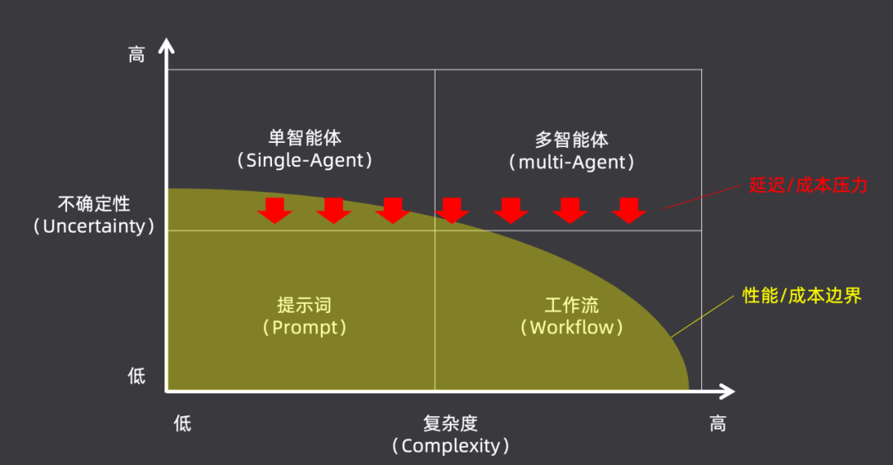
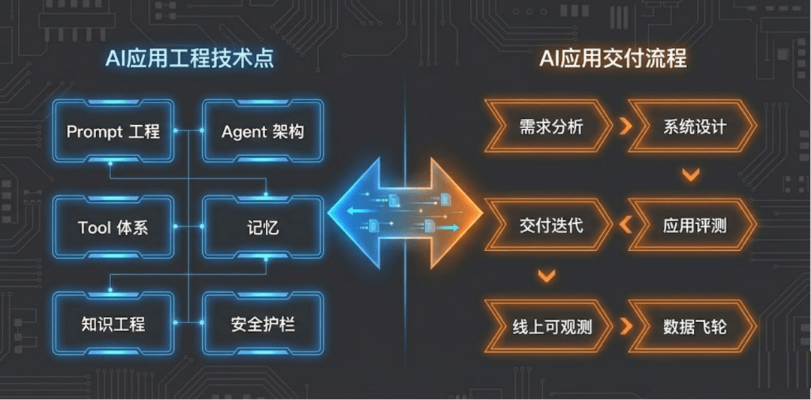
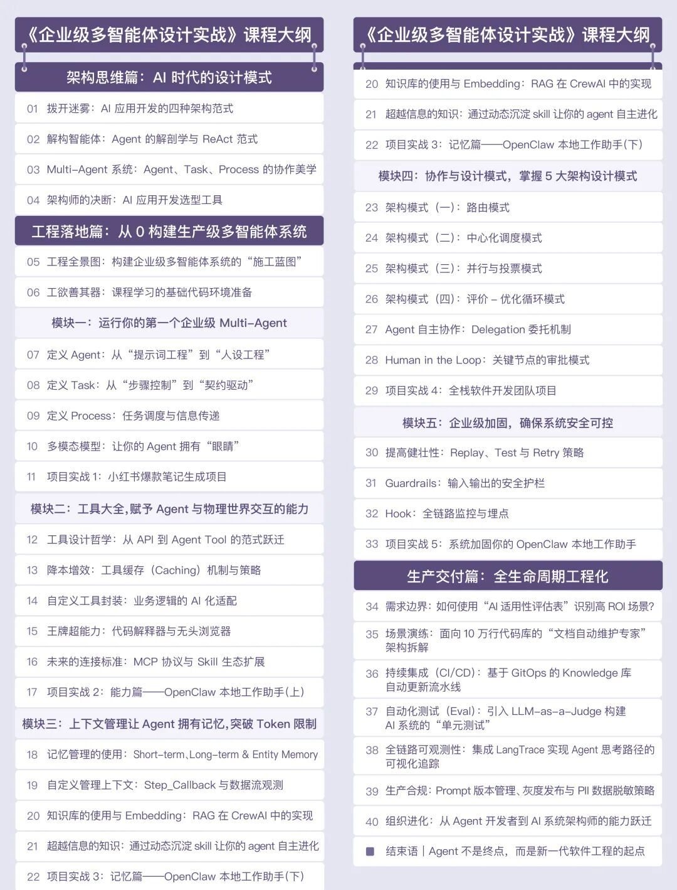
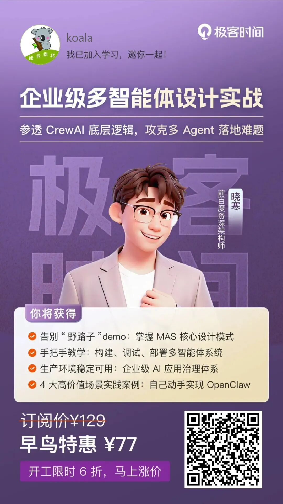

# 为什么90%的AI项目都死在了落地环节？

如果你是 AI 应用开发者，下面这些场景大概不陌生：

每天刷着公众号、GitHub，概念一个比一个新鲜——AGI、智能涌现、Multi-Agent……可一回到工位，连配置国外模型API都得折腾半天。好不容易跑通 Demo，惊为天人，可一上生产就成了“买家秀”——模型幻觉、任务死循环、架构脆弱，根本无法上线。

这，就是当下 AI 工程化最真实的“鬼打墙”——概念热闹，落地冷清。

## 热闹背后的真瓶颈：不是技术，是“人”

  

为什么会出现这样的鸿沟？一位在 AI 一线摸爬滚打了十几年的老兵，给出了自己的观察：

“现在业界真正的瓶颈，是能驾驭 AI 产品的工程化思维。”

他曾经是百度的架构师，如今在一家头部金融企业做 AI 中台负责人，作为第一批吃螃蟹并且被螃蟹夹过无数次的人，他经历过 AI 产品从 Demo 到生产的无数个“至暗时刻”，才发现目前市面上真正缺的是能把 AI 落地的工程化人才。

如今他一边搭建AI基础设施，一边推动公司转型，越发识到自己踩过的坑才是最宝贵的教材。于是，他把这些实战教训沉淀为一门课程：《企业级多智能体设计实战》，课程刚上线，又遇上极客时间的开年大促，价格真的很合适，原价 ¥129 现在 6 折就能拿下。

扫码可免费试读

开工福利立享 6 折，仅需 ¥77

粉丝福利：扫码购买后来找我领取 ¥20 红包 ❤️

微信号：koala\_102

  

## 这门课不讲“术”，讲“道”

  

如果只教你用某个特定框架，那肯定会过时。他要给你的是两样能穿越周期的核心能力：

  

第一，思维模式的彻底升级。  
你会建立一套体系化的 Multi-Agent 设计模式，知道什么时候该用单智能体，什么时候该用多智能体协作，以及如何用架构师的思维去“治理”它们。当明天又冒出个新概念，你能一眼看透它的本质，在技术洪流中保持从容。

  

  

第二，企业级全链路的工程能力。  
  

从需求分析、系统设计，到 Prompt 工程、工具使用、RAG，再到复杂协作、安全护栏、线上可观测性，以及生产数据回流的“迭代飞轮”——带你走完 AI 应用从 0 到 1 再到 N 的全过程。学完后，你完全有能力脱离任何现成框架，手搓出适合自家业务的专属架构。

  

  

## 课程设计：三步走，外加四大硬核特色

  

课程分为三个篇章：设计篇建立AI时代的设计模式框架；工程篇采用“五步认知法”拆解每个知识点，不仅讲“是什么”，更讲“有什么用”、“怎么用”、“底层原理”，以及最重要的“最佳实践和反模式”；交付篇教你如何测试AI应用、如何建立数据飞轮。

  

四大硬核特色：

  

💡 极低的实战门槛  
没有 GPT-4 的 API Key？无法科学上网？没关系。全程使用国产模型（如 DeepSeek、通义千问），配合国内可用工具。只要你会 Python，就能跟上。

  

🔍 深剖底层原理  
以CrewAI作为实战载体，但绝不让你当“API 调包侠”。会带你拆解源码、讲透原理，让你拥有“手搓框架”的能力。

  

🚀 紧跟前沿技术  
AI发展极快，课程内容也在实时迭代——Google 发布最新的MAS设计模式？立刻纳入。Claude 推出 Skill？紧急调整工具篇。甚至刚刚发布的OpenClaw，课程也决定升级实践，带你亲手搭建一个全自动系统。

  

🏢 实打实的企业级实战  
不做只会聊天的“玩具机器人”，只做能上线的“强大武器”。你会亲手打造：深度研报撰写Agent、小红书爆款生成器、手搓复刻全自动驾驶的 OpenClaw系统。

  

详细章节可以看目录👇

## 写在最后

  

AI 时代，从来不缺拿着锤子找钉子的人。真正稀缺的，是那些懂得画图纸、建高楼的架构师。

  

仅仅会使用工具，你终将被更年轻的工具使用者取代；但如果能设计和驾驭工具，你将成为未来的创造者。

  

如果你也正在AI落地的迷宫中徘徊，如果你想捅破那层看不见的“窗户纸”，如果你渴望从一名“调参侠”成长为一名真正的架构师——

  

那么，他的经验，或许正是你需要的阶梯。

课程刚上线，又遇上极客时间的开年大促，价格很合适，原价 ¥129 现在 6 折就能拿下。

  

扫码可免费试读

开工福利立享 6 折，仅需 ¥77

粉丝福利：扫码购买后来找我领取 ¥20 红包 ❤️

微信：koala\_102
