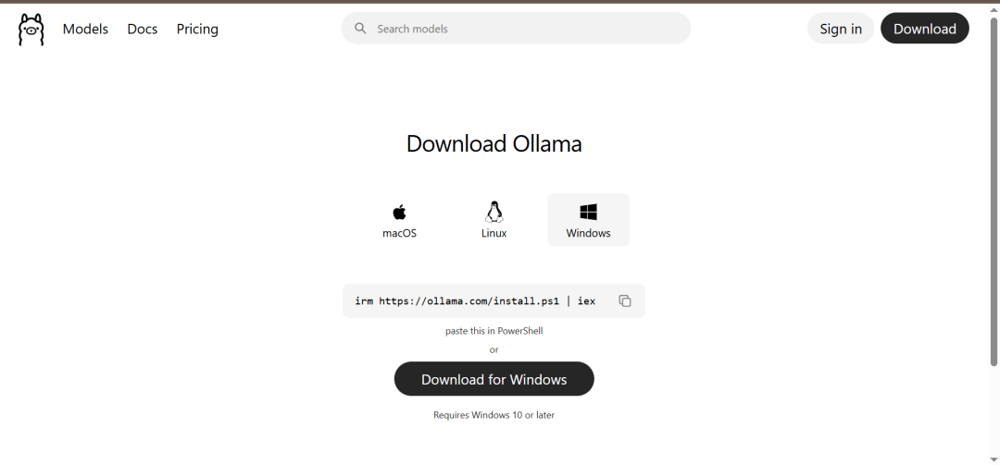
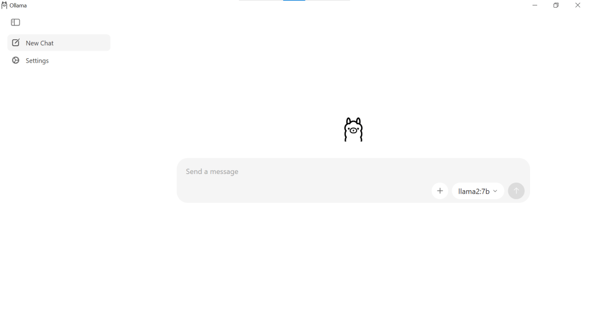
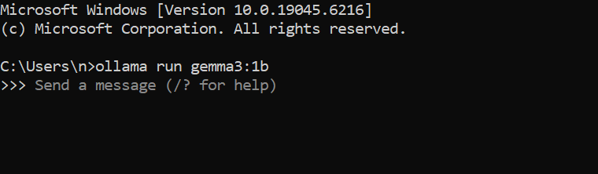
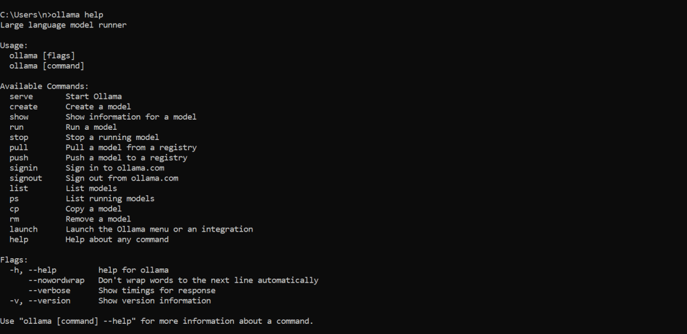
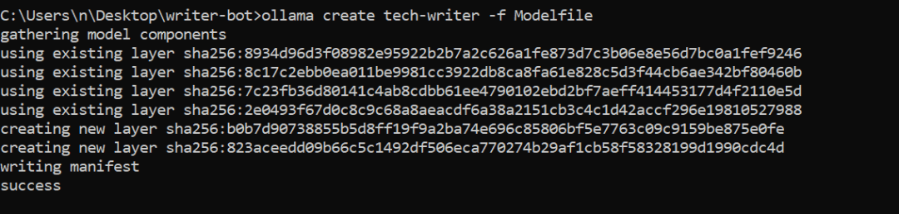
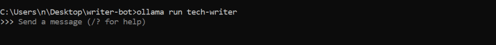
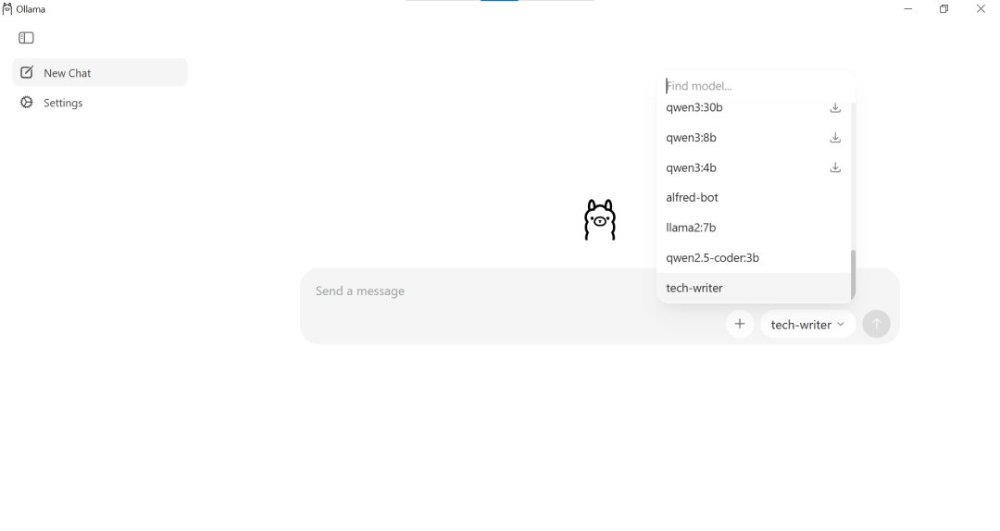

# 【第3663期】如何用 Ollama 在本地运行并定制专属 LLM

前言

想在本地拥有一个可控、私密且无需订阅费用的 AI 助手吗？本文将带你了解如何使用 Ollama 在个人电脑上运行大型语言模型（LLM），并通过 Modelfile 定制专属能力。无论是编写文档、优化代码，还是构建内部开发工具，前端工程师都能打造贴合自身工作流的本地 AI 助手。今日前端早读课文章由 @Ikegah Oliver 分享，@飘飘编译。

最近朋友圈都是龙虾，要享无限 token，可以试试本地运行 LLM。

译文从这开始～～

在漫长的技术创新历史中，真正产生深远影响的突破并不多，大型语言模型（LLMs）正是其中之一。LLM 是基于海量数据训练的先进 AI 系统，能够理解、生成和处理人类语言，可用于写作、翻译、摘要生成以及驱动聊天机器人等多种任务。

如果能在离线状态下使用这样强大的工具，将会带来颠覆性的改变。本地 LLM 让高水平的智能能力随时触手可及，即使没有网络连接也能正常使用。阅读完本指南后，你将了解什么是本地 LLM、它们为何重要，以及如何亲自运行它们 —— 无论是通过简单的方法，还是更偏技术向的方式。

本指南适合但不限于以下人群：

- 开发者、技术写作者或对技术充满好奇的工程师。
- 熟悉终端操作的用户。
- 使用过 AI 工具（如 ChatGPT、Claude 等）的人。
- 几乎没有或完全没有本地运行 LLM 经验的用户。

#### 什么是本地 LLM？

本地大型语言模型（LLMs）将 AI 从云端带到你的个人设备上。由于原始模型体积过大，普通消费级设备难以直接运行，因此通过一种叫做 “量化” 的技术来降低数值精度。这就像把一段超高清的大视频压缩后，让它能在手机上流畅播放一样。通过这种方式，强大的模型就可以在你的笔记本电脑上本地运行，而无需依赖庞大的服务器集群。

[【早阅】从Vibe Coding到Vibe Engineering：LLM时代开发者的生存法则](https://mp.weixin.qq.com/s?__biz=MjM5MTA1MjAxMQ==&mid=2651278216&idx=1&sn=a35f1a3a919a834c82c3e2e8faa1d8c4&scene=21#wechat_redirect)

在本地运行诸如 Meta 的 Llama 3.3、Google 的 Gemma 3 或 Alibaba 的 Qwen 系列模型，可以确保数据完全私密，同时免去订阅费用。由于 AI 直接运行在你的电脑上，你将拥有一个快速、支持离线使用的工作环境，代码和数据都掌握在自己手中。

#### “本地运行” 意味着什么

要理解本地 LLM 是如何在你的电脑上运行的，需要先了解电脑的硬件组成。当你在本地运行 Llama 3 或 Mistral 这样的模型时，你的电脑会从一台通用设备转变为一台专门用于 AI 计算的引擎。

这个过程依赖四个关键硬件的紧密协作：存储设备、内存（RAM）、GPU 和 CPU。

##### 存储设备（模型的 “永久住所”）

在开始使用之前，你需要先下载模型。与普通应用程序不同，LLM 本质上是一个巨大的 “权重” 文件，这些数值参数承载着模型所学到的全部知识。

- 文件格式：你通常会看到 `.gguf` 或 `.safetensors` 等格式。这些文件体积很大，一个 “较小” 的 7B（70 亿参数）模型通常就需要 5GB 到 10GB 的磁盘空间。
- SSD (固态硬盘) 与 HDD（机械硬盘）：必须使用 SSD。因为每次启动模型时，电脑都需要将数 GB 的数据加载到内存中，如果使用传统机械硬盘（HDD），可能需要等待几分钟模型 “大脑” 才能启动。

##### 显存（VRAM）与内存（RAM）（模型的 “工作空间”）

这是最关键的性能瓶颈。为了让 AI 快速响应，它的整个 “模型大脑” 必须放入高速内存中。

- VRAM（显存）：这是安装在显卡（GPU）上的专用内存，速度远高于普通系统内存。如果模型可以完全放入显存中，AI 的输出速度可能会快到你都来不及阅读。
- 系统内存：如果模型对显存来说太大，软件会将部分数据 “溢出” 到系统内存中。虽然这样可以在配置一般的电脑上运行较大的模型，但性能会大幅下降 —— 生成速度可能从每秒 50 个词降到每秒一两个。

##### GPU（数学计算引擎）

如果说 CPU 是电脑的 “管理者”，那么 GPU（图形处理器）就是 “数学家”。

- 并行计算能力：LLM 的工作方式是同时进行数十亿次简单的数学运算（矩阵乘法）。CPU 通常只有少量强大的核心，而 GPU 则拥有成千上万个较小的核心，专门用于这种并行计算。
- 统一内存（Apple Silicon）：在现代 Mac（M1/M2/M3）上，CPU 和 GPU 共享同一块内存池。这种 “统一内存” 机制对本地 AI 来说意义重大，即便是轻薄笔记本，也能运行原本需要台式机高性能显卡才能驱动的较大模型。

为了获得最佳性能，建议在运行前对比你的电脑配置与模型的硬件需求，确认哪些模型可以顺畅运行。

[【第3328期】WebGPU — All of the cores, none of the canvas](https://mp.weixin.qq.com/s?__biz=MjM5MTA1MjAxMQ==&mid=2651272097&idx=1&sn=22d6aa2c03b76a861c072940385686e4&scene=21#wechat_redirect)

#### 为什么要在本地运行 LLM？

在本地运行 LLM 不只是技术爱好者的专属选择，而是任何希望完全掌控自己 AI 工具的人都值得考虑的一种策略。其核心优势包括：

- 离线使用：不再依赖云端。无论是在飞机上，还是在网络信号不佳的偏远地区，你都可以随时使用自己的数据，AI 在没有网络连接的情况下也能正常工作。
- 隐私与数据所有权：由于不连接云端，你的提示词和数据不会被第三方远程获取，也不会被用于训练某家公司的下一代模型。
- 成本可控：无需每月订阅费用或 API Token。只要硬件到位，在合理配置下运行模型几乎不再产生额外成本。
- 可定制与可实验：如果你下载了多个模型，可以随时 “切换大脑”。你可以尝试不同模型，为特定任务进行微调，调整那些大型服务商通常不会开放的参数设置。
- 更快的开发迭代：对于开发者来说，本地运行可以消除网络延迟，实现近乎即时的响应，加快测试与开发流程。

##### 权衡因素

当然，本地 LLM 也存在一些需要考虑的限制：

- 硬件要求：要获得流畅体验，你需要一台配置不错的设备 —— 通常是拥有 8GB 以上显存的 GPU，或搭载 Apple Silicon（M1/M2/M3）的 Mac。
- 性能限制：本地模型每天都在进步，但在 “推理能力” 方面，可能仍无法完全匹敌像 GPT-4 这样依托于巨型云计算集群的模型。
- 初始配置门槛：并非完全 “即插即用”。如果你想深入使用某些功能，可能需要花时间配置软件、下载大型模型文件，以及排查运行环境问题。

尽管存在这些权衡，在日常生活和工作中，拥有一个完全掌握在自己手中的 AI 工具，依然是一项巨大的优势。

[【第1892期】GPU加速在前端的应用](https://mp.weixin.qq.com/s?__biz=MjM5MTA1MjAxMQ==&mid=2651236025&idx=1&sn=ac5b2d5bffce8e4bbaa79c26bf8b682f&scene=21#wechat_redirect)

#### 如何搭建本地 LLM

获取并搭建本地 LLM 的方式有很多。本指南将使用 Ollama—— 一款用户友好的工具，它可以把私密、安全的 AI 直接带到你的桌面。你将学习如何通过一条命令下载并部署高性能模型，针对你的 CPU/GPU 配置进行优化，以及使用强大的 Modelfile 系统来 “编程” 属于你自己的 AI 个性与功能。

本指南将涵盖：

- 基础原理：了解 Ollama 如何把你的电脑变成一台 AI 强力引擎。
- 安装与配置：在五分钟内完成安装并开始使用。
- 模型管理：如何查找、“pull”（下载）并运行 Llama 3、Mistral 等模型。
- 自定义：编写你的第一个 Modelfile，为 AI 设定特定任务或个性。

完成后，你将拥有一套完全独立的 AI 工作站，在无需向云端发送任何数据的情况下，完成复杂的推理任务。

##### 什么是 Ollama？

Ollama 是一款免费、开源的工具，让你在自己的设备上运行大型语言模型（LLM）变得像打开浏览器一样简单。它去除了传统 AI 部署中的复杂技术细节，为你提供一个干净、简洁的方式来对话、管理，甚至自定义属于自己的 AI 模型。

在 Ollama 出现之前，在本地运行 AI 往往令人头疼。你需要在网上寻找合适的 “权重” 文件，搭建复杂的开发环境，还要担心硬件是否会崩溃。而现在，Ollama 帮你完成了这些繁琐的工作。它会自动识别你的显卡（GPU），并为你优化运行参数。

##### Ollama 的工作原理

可以用一个简单的 “思维模型” 来理解 Ollama，它的使用方式类似于手机应用或音乐流媒体服务。

[【第3252期】Ollama：本地大模型运行指南](https://mp.weixin.qq.com/s?__biz=MjM5MTA1MjAxMQ==&mid=2651270532&idx=1&sn=ac73bd0c6b7739a38ed9f0c1d103e13f&scene=21#wechat_redirect)

**模型仓库（Model Registry，相当于 “图书馆”）**

Ollama 维护着一个庞大的 “模型库”，里面包含 Llama 3、Mistral、Gemma 等预打包模型。你无需关心文件格式，只需从列表中选择模型名称，Ollama 就会自动将其 “pull” 到你的电脑上。

**本地运行时（Local Runtime，相当于 “引擎”）**

当模型下载完成后，Ollama 就充当运行引擎。它会唤醒模型，将其加载到内存（RAM/VRAM）中，并启动背后的数学计算过程。它足够智能，会优先调用 GPU 提升速度，但如果你只有 CPU，也同样可以运行。

**CLI（命令行界面，相当于 “控制中心”）**

Ollama 使用命令行界面（CLI）。听起来可能有点技术感，其实就是在终端窗口中输入简单、接近自然语言的指令。想和模型对话？只需让它运行。想查看已下载的模型？让它列出即可。

##### 如何安装 Ollama

前往 Ollama 的下载页面。在 Windows 或 Mac 上，点击下载按钮即可。



在 Linux 上，运行以下命令：

```
 curl -fsSL [https://ollama.com/install.sh](https://ollama.com/install.sh) | sh
```
下载完成后，打开安装文件，按照提示完成安装。

在 Windows 和 Mac 上，安装完成后会自动打开 Ollama 原生桌面应用。



对于觉得命令行（CLI）有些难以上手的用户来说，这个图形界面（GUI）非常友好。你无需具备编程背景，也可以轻松使用 Ollama。不用输入命令，就能在类似聊天应用的界面中管理模型并开始对话。

##### 如何下载（Pull）一个 LLM

如前所述，Ollama 拥有丰富的大型语言模型库，适用于不同配置和用途。要将某个模型下载到本地，可以使用 pull 命令，后面加上模型名称。例如：

```
 ollama pull gemma3:1b
```
如果想查看已下载或已拥有的模型，可以使用 list 命令，例如：

```
 ollama list
```
##### 如何运行你的 LLM

模型已经下载到本地后，就可以运行它。使用 run 命令，后面加上模型名称。例如：

```
 ollama run gemma3:1b
```
模型加载完成后，你就可以开始输入提示词进行对话。



如果想退出模型，可以按 Ctrl + d，或输入 /bye。

你还可以执行其他操作，例如删除模型、复制模型、查看模型信息等。输入 ollama help 可以查看所有可用命令。



#### 如何使用 Modelfile 在 Ollama 中自定义本地 LLM

Ollama 最强大的功能之一，是通过 Modelfile 自定义本地模型的行为。你无需重新训练或微调模型，就可以定义模型应如何回应、扮演什么角色、以什么风格生成文本，而不是把模型当作不可更改的 “黑盒”。

这使得 Modelfile 非常适合创建可重复使用、针对特定任务的本地模型，例如技术写作助手、代码审查员、研究助理、内部开发工具，甚至具有人物设定的对话助手。

##### 什么是 Modelfile？

Modelfile 是一个纯文本配置文件，用于基于现有模型创建一个新的模型。它定义了基础模型在运行时如何被封装、如何接收提示，以及如何进行配置。

本质上，一个 Modelfile 会：

- 从一个基础模型开始
- 应用一组自定义指令
- 生成一个新的、带名称的模型，可以像其他模型一样运行

Modelfile 不会修改底层模型的权重参数。它只是定义行为规则，例如如何提示模型、如何生成文本，以及如何响应用户输入。

##### Modelfile 的语法与结构

Modelfile 采用基于行的声明式结构。每一条指令都定义模型行为的一个方面。

一个最简单的 Modelfile 示例：

```
 FROM llama3

 SYSTEM """
 You are a senior technical writer.
 """

 PARAMETER temperature 0.2
```
- FROM：这是基础指令。它告诉系统从哪个基础架构（例如 llama3）继承模型能力和分词器。
- SYSTEM：用于设置 “永久性” 指令。通过设定为资深技术写作者角色，可以确保每次回答都保持专业、结构清晰的风格，而无需在每次提示中重复说明。
- PARAMETER：这是模型的参数调节项。这里使用 temperature 0.2，将 “创造性旋钮” 调低，使模型输出更加确定、精确，适合生成一致、客观的内容。

进阶用户还可以使用 TEMPLATE 自定义提示格式，或使用额外的 MESSAGE 指令加入特定的对话历史。不过在基础配置中，这些并非必需。

**快速参考速查表：**


| 指令 | 用途 | 示例 |
| --- | --- | --- |
| FROM | 必需项。定义基础模型。 | FROM llama3 |
| SYSTEM | 设置模型的角色和行为规则。 | SYSTEM "You are a helpful assistant." |
| PARAMETER | 调整生成参数（如随机性、上下文长度等）。 | PARAMETER temperature 0.2 |
| TEMPLATE | 定义用户和系统提示的格式结构。 | TEMPLATE "{{ .System }}\nUser: {{ .Prompt }}" |
| STOP | 定义结束模型输出的标记。 | STOP "</s>" |
| MESSAGE | 向模型添加特定的对话历史。 | MESSAGE user "Hello!" |
| MESSAGE | 向模型添加特定的对话历史。 | MESSAGE user "Hello!" |


#### 如何自定义模型

使用 Modelfile 创建模型时，Ollama 会执行以下步骤：

- 加载指定的基础模型
- 应用系统级指令
- 配置生成参数
- 将结果注册为一个新的本地模型

在本文中，你将基于任意一个本地 LLM 创建一个技术写作助手。可以使用之前下载的模型，也可以下载一个你认为更适合该用途的模型。

- 设置环境：创建一个名为 my-writing-assistant 的文件夹，然后用你喜欢的 IDE 或文本编辑器打开它。
- 创建 Modelfile：在该文件夹中创建一个名为 Modelfile 的文件，并填入以下内容：

```
 FROM llama3

 SYSTEM """
 You are a senior technical writer.
 Write clear, concise explanations.
 Use headings and bullet points where appropriate.
 Avoid marketing language.
 """

 PARAMETER temperature 0.2
 PARAMETER top_p 0.9
 PARAMETER repeat_penalty 1.1
 PARAMETER num_ctx 4096
```
- 创建模型：在 IDE 中打开终端；如果使用的是没有内置终端的编辑器，请打开命令提示符并进入 my-writing-assistant 目录。然后运行以下命令：

```
 ollama create tech-writer -f Modelfile
```
你应该会看到类似如下的输出：



- 运行模型：像运行其他 Ollama 模型一样，使用 run 命令即可：

```
 ollama run tech-writer
```


尝试输入一个与文档编写相关的提示词，你会发现模型的表现正如 Modelfile 中设定的那样。

你也可以通过桌面应用与已下载或自定义的模型进行交互。打开应用后，在聊天框的下拉菜单中选择所需模型，然后开始输入提示即可。



#### Modelfile 能做什么，不能做什么

Modelfile 功能强大，但需要明确其作用范围。

**它可以：**

- 自定义模型行为
- 统一提示风格
- 调整生成参数特性
- 创建可重复使用的本地模型

**它不能：**

- 重新训练或微调模型权重
- 增加新的知识
- 改变模型架构

Modelfile 改变的是模型 “如何回答”，而不是模型 “知道什么”。

#### 结语

如今，在本地运行大型语言模型已不再是研究人员或高端设备的专属。借助 Ollama 和 Modelfile，你可以下载高性能模型，在自己的设备上运行，并根据工作流程对其行为进行定制。

本指南介绍了什么是本地 LLM、它们的重要性、Ollama 如何简化部署流程，以及 Modelfile 如何帮助你控制语气、结构和生成参数。相比使用一个通用聊天机器人，你可以构建真正为特定目的设计的专属助手。

更重要的是，本地运行模型会改变你与 AI 的互动方式。你不再只是调用一个 API，而是开始理解并塑造整个系统。随着 AI 持续影响软件、商业和日常工具，亲自实践本地模型能帮助你更清晰地看清技术发展的方向。理解这种变化的最佳方式，就是亲自动手实验：下载一个模型，调整一个 Modelfile，进行测试与改进。

关于本文  
译者：@飘飘  
作者：@Ikegah Oliver  
原文：https://www.freecodecamp.org/news/run-and-customize-llms-locally-with-ollama/

这期前端早读课  
对你有帮助，帮” 赞 “一下，  
期待下一期，帮” 在看” 一下。
