# 【第3626期】2025 CSS 年终盘点：22个重磅新特性，助你雕刻动态网页！

前言

关于 2025 年 CSS 和 UI 领域新增的 22 项特性的详细介绍，由 Chrome DevRel 团队撰写，旨在展示这些新特性如何助力开发者打造更具动态性和交互性的网页。今日前端早读课文章由 @飘飘编译分享。

正文从这开始～～

回顾 Chrome 在 2025 年推出的所有令人惊叹的 UI 功能

欢迎来到 2025 CSS 大盘点！Chrome DevRel 团队为我们揭示了 22 个刚刚登陆 Web 平台、新鲜出炉的 CSS 和 UI 新特性。今年，我们获得了强大的新工具，旨在帮助开发者 “雕刻” 动态界面、发挥想象力，并 “玩转” 这些强大的 CSS 功能。

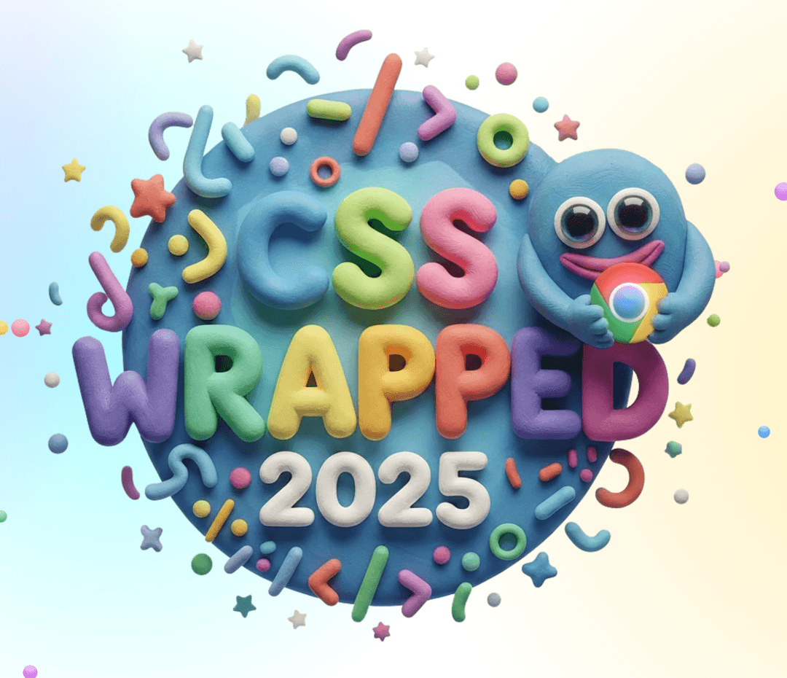

这些新特性是围绕三大核心模块精心打造的：可定制组件、下一代交互和优化的人体工程学。让我们深入了解这些令人兴奋的新功能，看看 2025 年 Web 平台发生了哪些重大飞跃。

#### 一、可定制组件：告别繁琐的 JS 方案

本年度的工作坊热火朝天，解决了诸如下拉菜单样式等存在了数十年的难题，并带来了原生锚点定位和轮播图滚动 API 等核心模块。

##### 1\. Invoker Commands (调用命令)

现在，你可以无需 JavaScript，以声明方式显示模态 `<dialog>` 或执行更多操作。Invoker Commands（从 Chrome 135 开始可用）允许按钮对其他元素执行操作。

- 用法简化： 传统上，打开模态对话框需要一个 `onclick` 处理程序调用 `showModal` 方法。现在，你可以使用 `commandfor` 属性指定目标 ID，使用 `command` 属性接受内置值，从而实现更直观且可移植的方法。
- 支持的命令： 目前支持发送命令给 `[popover]` 和 `<dialog>` 元素，这些命令对应于它们的 JavaScript 方法，例如 `show-modal`、`close`、`show-popover` 等。

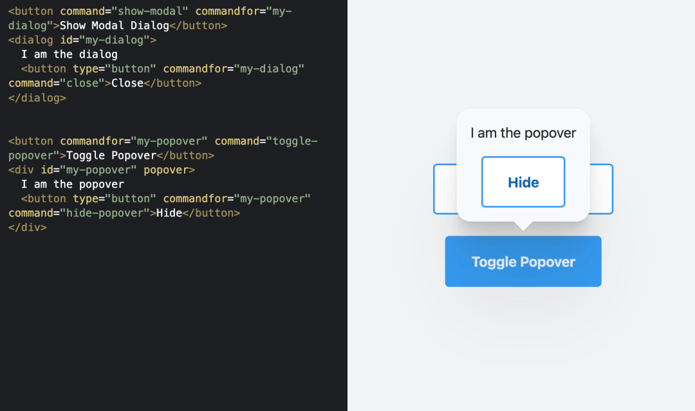

##### https://codepen.io/web-dot-dev/pen/pvyVyYK

##### 2\. Dialog Light Dismiss (对话框轻量级关闭)

Popover API 引入的轻量级关闭行为现已登陆 `<dialog>`。

控制关闭方式： 通过新的 `closedby` 属性（从 Chrome 134 开始可用），你可以控制对话框的关闭行为：

- `<dialog closedby="none">`
  
  用户无法关闭（默认行为）。
- `<dialog closedby="closerequest">`
  
  按 ESC 键关闭。
- `<dialog closedby="any">`
  
  点击对话框外部或按 ESC 键关闭，类似于 `popover="auto"` 的行为。

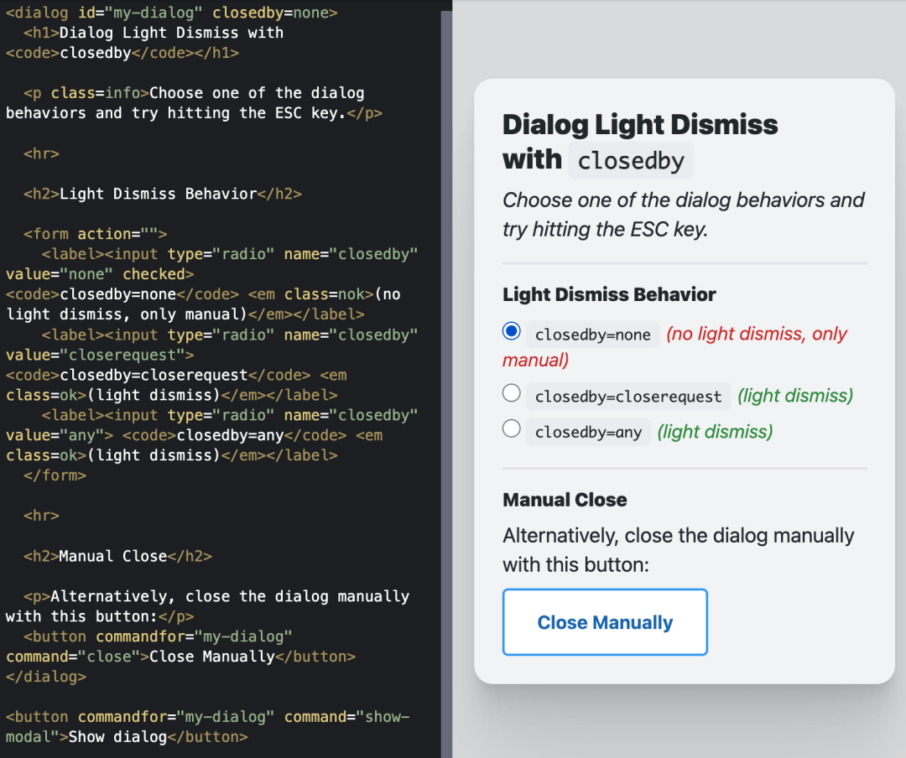

##### https://codepen.io/web-dot-dev/pen/PwNeNLp

##### 3\. popover=hint (提示型浮层)

`popover="hint"` 是一种用于短暂分层 UI 模式（如工具提示或链接预览）的新型 HTML 浮层。

- 不关闭其他浮层： 打开提示型浮层不会关闭其他已打开的自动或手动浮层，允许分层 UI 元素共存。
- 链接支持： 提示型浮层可以存在于 `<a>` 标签上，而自动和手动浮层通常需要由按钮元素激活。

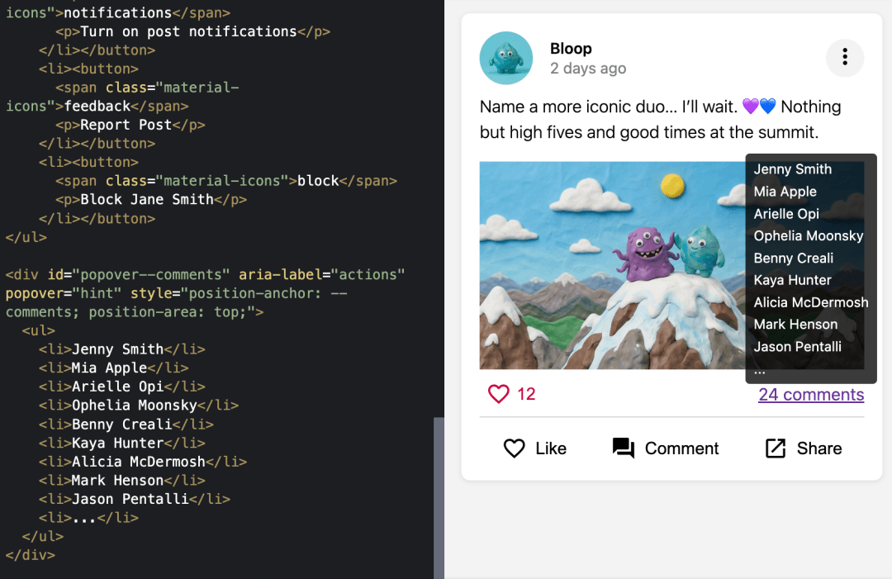

##### https://codepen.io/web-dot-dev/pen/PwNJNLg

##### 4\. Customizable select (可定制的下拉菜单)

HTML `<select>` 元素终于可以完全使用 CSS 进行自定义了！

- 启用定制： 对 `<select>` 元素应用 CSS 属性 `appearance: base-select`，将其切换到专为定制优化的最小状态。
- 高级功能： 现在可以完全定制下拉菜单的每个部分，并支持在 `<option>` 元素内包含并正确渲染 `` 和 `` 等 HTML 元素，从而创建视觉丰富的下拉菜单。
- `<selectedcontent>`
  
   元素： 这个新元素反映了所选选项的 HTML 内容，允许你在选择按钮中隐藏或显示选项内容的一部分（例如只显示一个图标）。

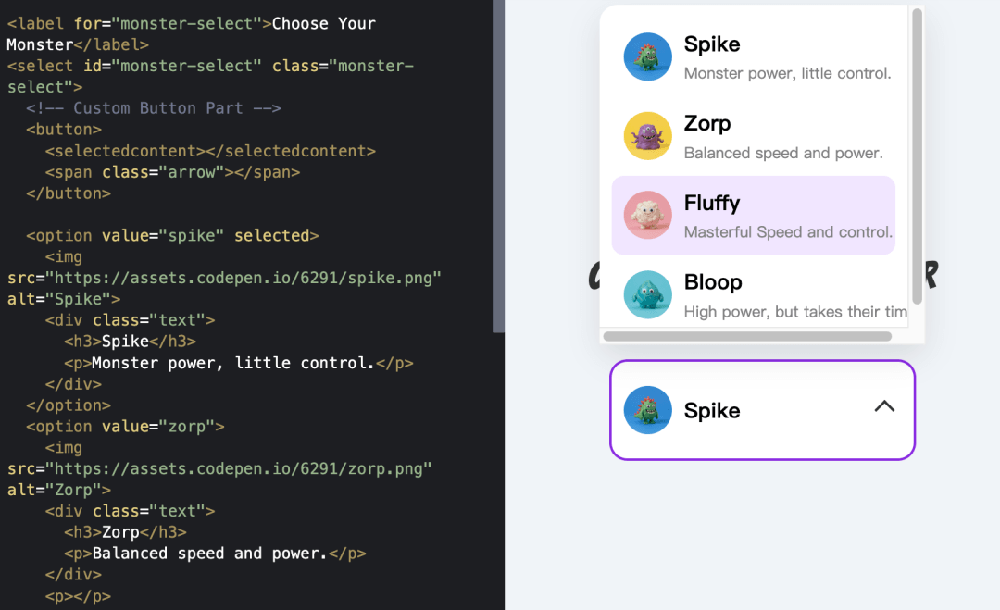

##### https://codepen.io/web-dot-dev/pen/JoXrKoL

##### 5. `::scroll-marker/button()` (滚动标记 / 按钮伪元素)

通过引入 `::scroll-button()` 和 `::scroll-marker()` 两个新的伪元素，创建轮播图等滚动体验变得更加容易，无需 JavaScript，实现原生、可访问且高性能的轮播图。

- `::scroll-button()`
  
  创建浏览器提供的、有状态且可交互的滚动按钮。它们可聚焦，并在无法滚动时自动禁用。
- `::scroll-marker`
  
  代表滚动容器内元素的标记，它们像锚点链接一样，允许用户直接跳转到特定项目，可用于创建轮播图的点导航。

##### 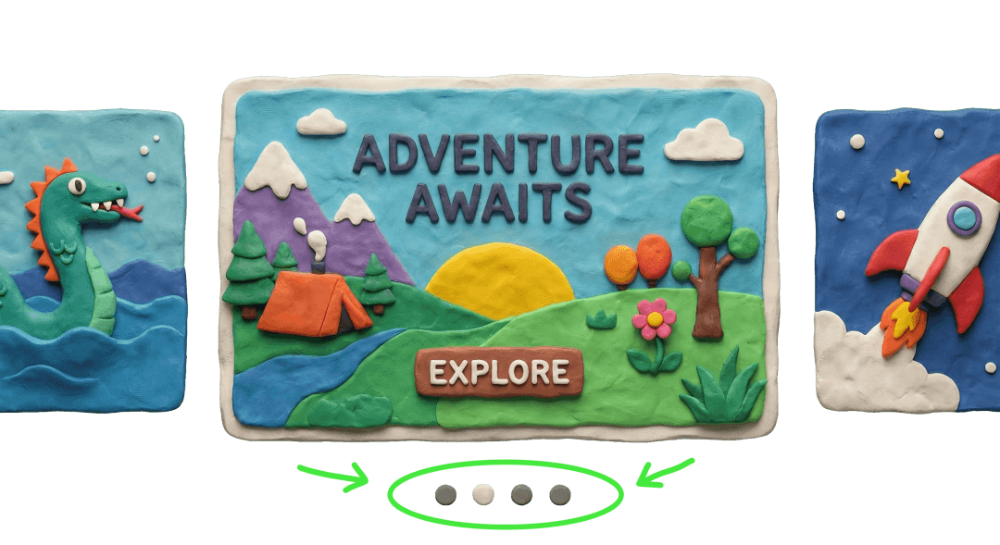

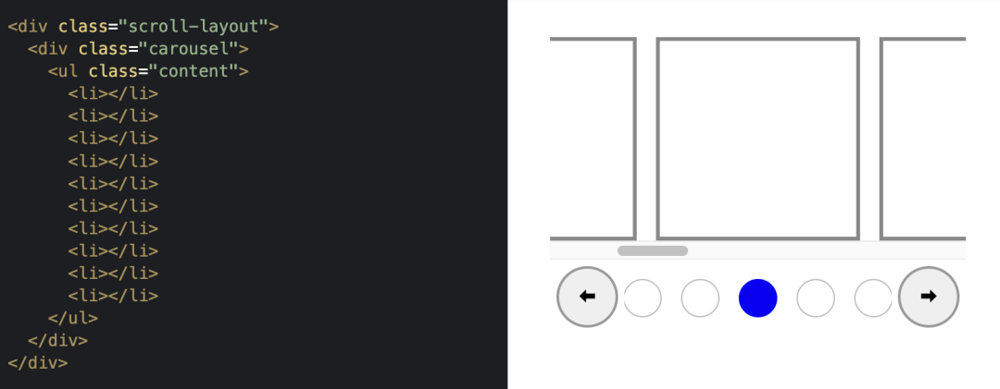

##### https://codepen.io/web-dot-dev/pen/MYWVVYN

##### 6\. scroll-target-group (滚动目标组)

这个特性可以将手动创建的锚点链接列表转换为滚动标记。

创建滚动间谍 (Scroll-Spy) 导航： 将 `scroll-target-group: auto` 应用于链接容器，并结合 `:target-current` 伪类，可以为当前可见目标对应的锚点元素设置样式，实现目录高亮功能。

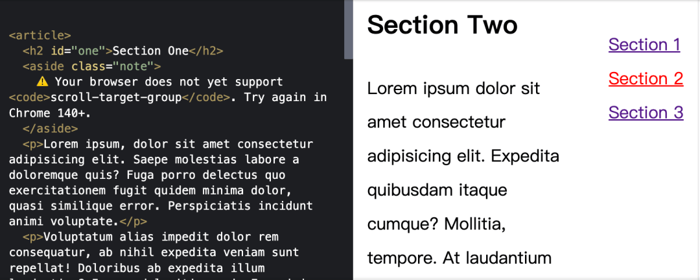

##### https://codepen.io/web-dot-dev/pen/azNjGpv

##### 7\. Anchored container queries (锚点容器查询)

锚点定位的巨大胜利！它解决了 CSS 锚点定位中，当元素（如工具提示）被翻转到后备位置时，CSS 无法知道选择了哪个后备方案的问题（例如，箭头指向错误方向）。

**实现方法：**

- 1\. 对定位元素应用 `container-type: anchored`，使其感知其锚点定位后备。
- 2\. 使用 `@container anchored(fallback: ...)` 函数来查询活动后备值，并根据需要调整子元素的样式。

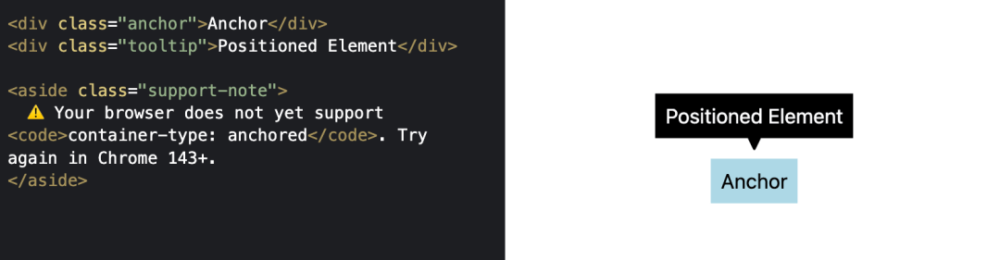

##### https://codepen.io/web-dot-dev/pen/jEWKRRv

##### 8\. Interest invokers (兴趣调用器)

提供了一种原生的、声明式的方式来设置元素的样式，当用户对其 “表现出兴趣” 时（例如鼠标悬停或键盘聚焦），而无需完全激活它。

- 配合使用： 与 `popover="hint"` 结合使用时，可以非常轻松地创建工具提示和悬停卡片等分层 UI 元素，而无需自定义 JavaScript。
- 延迟设置： 可以通过 `interest-delay` 属性设置打开和关闭的延迟，以防止过早触发。

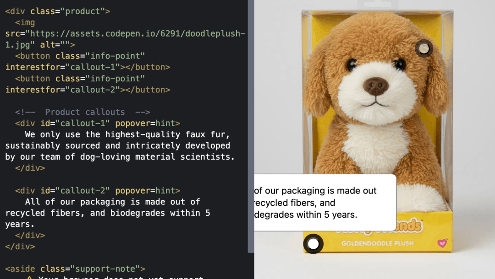

#### https://codepen.io/web-dot-dev/pen/VYaWyoQ

#### 二、下一代交互：流畅的动态体验

这个新的交互工具包使你能够通过视图转换进行页面动画，并雕刻出华丽的、基于滚动的体验。

##### 1\. Scroll-state queries (滚动状态查询)

该特性（从 Chrome 133 开始可用）允许你使用 CSS 声明性地、更高效地根据元素的滚动状态（例如，被粘住、被吸附或可滚动）设置其后代元素的样式。

用法： 在父元素上声明 `container-type: scroll-state`，然后子元素即可查询其状态，例如 `@container not scroll-state(snapped: x)`。

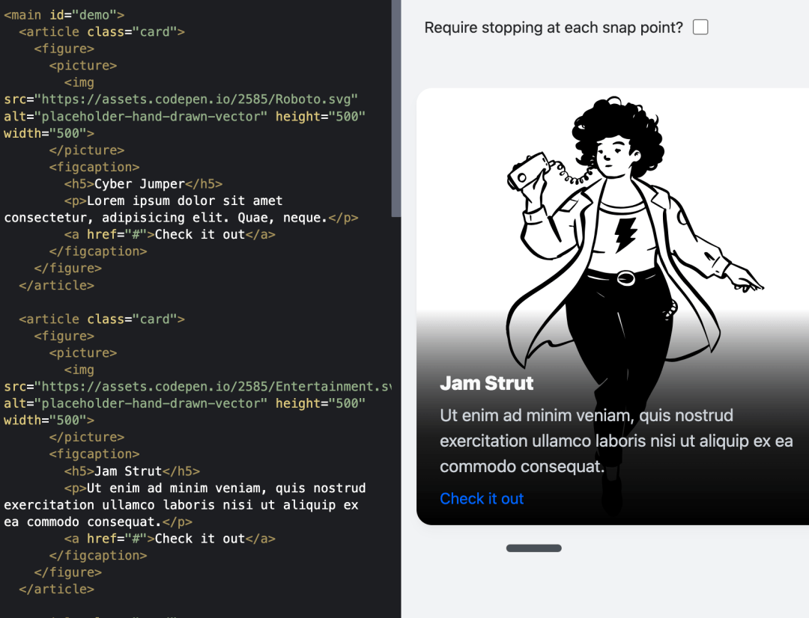

##### https://codepen.io/web-dot-dev/pen/XJrqpBG

##### 2\. Tree counting functions (计数函数)

新的 `sibling-index()` 和 `sibling-count()` 函数使交错动画（staggered animations）的创建变得更容易。

- 原生感知： 这些函数提供了元素在其兄弟元素中的位置（`sibling-index()` 返回基于 1 的整数）和总数（`sibling-count()`）的原生感知。
- 简化动画： 这使得你可以编写简洁的数学公式来进行布局和动画，无需使用 `:nth-child` 手动硬编码索引，且能自动适应动态变化的元素数量。

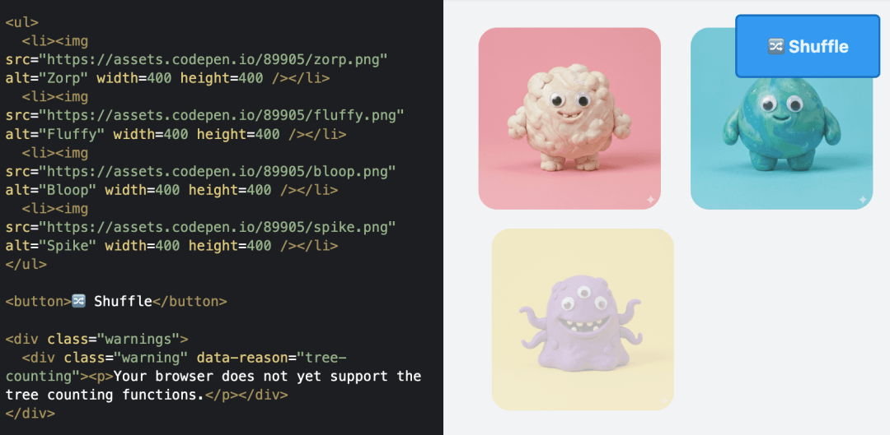

##### https://codepen.io/web-dot-dev/pen/vEGjGwG

##### 3. `scrollIntoView()` container

`Element.scrollIntoView` 的 `container` 选项允许你仅滚动最近的祖先滚动容器。

避免过度滚动： 当设置为 `container: "nearest"` 时，调用 `scrollIntoView` 将不会滚动所有滚动容器到视口，这对于嵌套滚动容器非常有用。

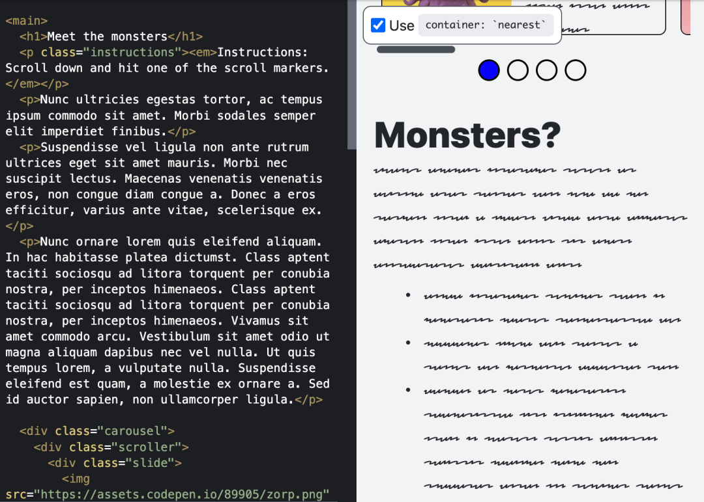

##### https://codepen.io/web-dot-dev/pen/emZrZoQ

##### 4\. Nested View Transition Groups (嵌套视图转换组)

这是视图转换的扩展，允许将 `::view-transition-group` 伪元素相互嵌套。

保留效果： 当视图转换组被嵌套时，可以在转换过程中保留 3D 和裁剪效果。通过在父级或子级上使用 `view-transition-group` 属性实现。

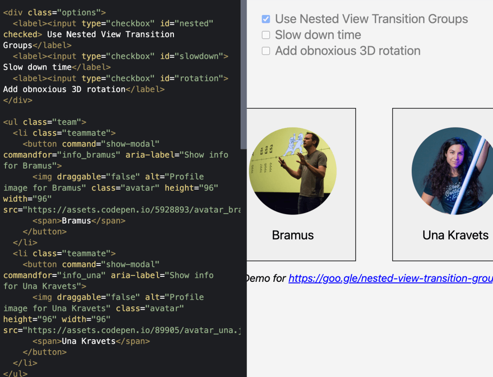

##### https://codepen.io/web-dot-dev/pen/wBMvxdz

##### 5\. DOM State-Preserving Move (`moveBefore`) (DOM 状态保留移动)

传统的 `insertBefore` 会破坏性地移动元素，导致正在播放的视频或 iframe 重新加载并丢失其状态。

保留状态： 从 Chrome 133 开始，你可以使用 `moveBefore`。它的工作方式与 `insertBefore` 完全相同，但在移动过程中保持元素处于活动状态。这意味着视频继续播放，iframe 不会重新加载，CSS 动画不会重新启动，输入字段也会保持焦点。

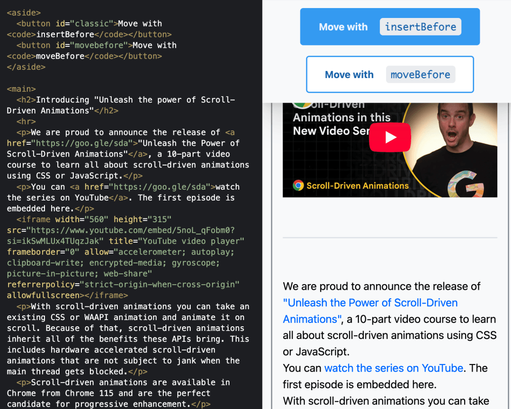

#### https://codepen.io/web-dot-dev/pen/QwNrNPQ

#### 三、优化的人体工程学：停止与代码抗争

这些功能帮助你以 CSS 的自然状态工作，使你的工作流程更加直观。

##### 1\. Advanced attr () function (高级 attr () 函数)

CSS `attr()` 函数现已升级。

类型化值： 以前 `attr()` 只能返回 CSS 字符串，并且只能在伪元素的 `content` 属性中使用。现在，它可以用于任何 CSS 属性（包括自定义属性），并且能够将属性值解析为各种数据类型，如颜色、长度和自定义标识符。

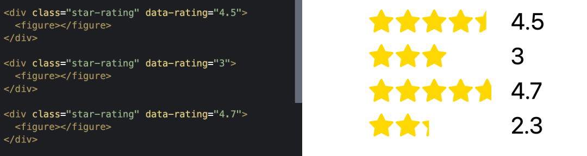

##### https://codepen.io/web-dot-dev/pen/emZRyaZ

##### 2\. ToggleEvent.source (切换事件源)

当浮层、`<dialog>` 或 `
` 元素被切换时，`ToggleEvent` 的 `source` 属性可以让你知道是哪个元素触发了该事件。这对于根据触发源采取不同操作（例如，判断用户点击了 “接受” 还是 “拒绝” cookie 按钮）非常重要。

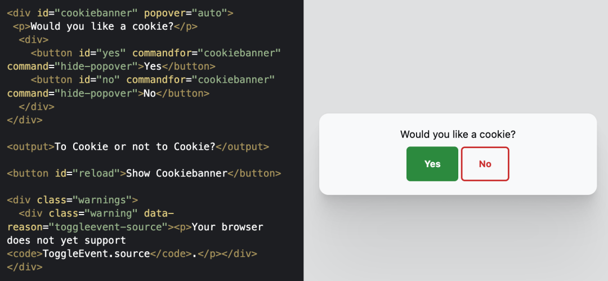

##### https://codepen.io/web-dot-dev/pen/VYaxaNv

##### 3\. text-box features (文本框特性)

这些属性使得对文本垂直对齐的精细控制成为可能，让你完美地垂直居中文本。通过使用 `text-box-trim` 和 `text-box-edge`（例如设置为 `cap` 和 `alphabetic`），可以弥补字体上升和下降指标与视觉边界不符的问题。

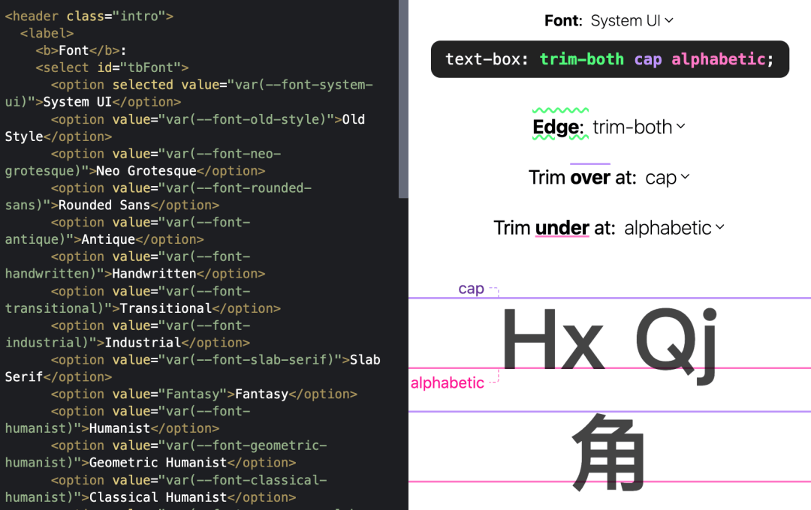

##### https://codepen.io/web-dot-dev/pen/RNbyooE

##### 4. `shape()` function (形状函数)

新的 `shape()` 函数允许你使用 CSS 将元素裁剪成复杂的、非多边形、响应式的形状。

复杂裁剪： 它非常适用于 `clip-path: path()` 裁剪蒙版，并且可以与 CSS 自定义属性无缝配合，从而创建动态和可交互的裁剪效果。

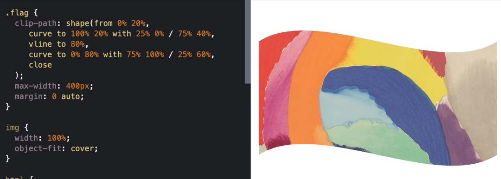

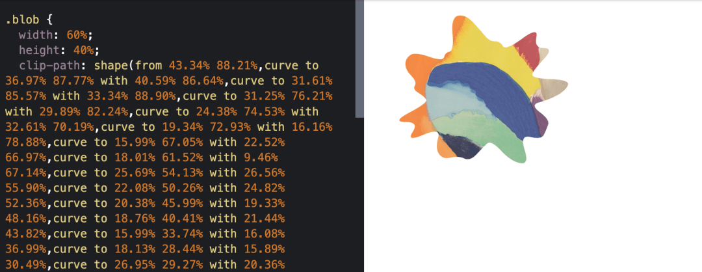

##### https://codepen.io/web-dot-dev/pen/xbVXOdJ

##### 5\. if () statements (if () 语句)

CSS 中的 `if()` 函数允许你根据条件测试为属性设置不同的值，类似于 JavaScript 中的三元运算符。

简洁语法： 它提供了更简洁的方式来处理动态样式，支持 `media()`、`supports()` 和 `style()` 三种查询类型。例如，你可以使用行内媒体查询：`flex-direction: if(media(orientation: landscape): row; else: column);`。

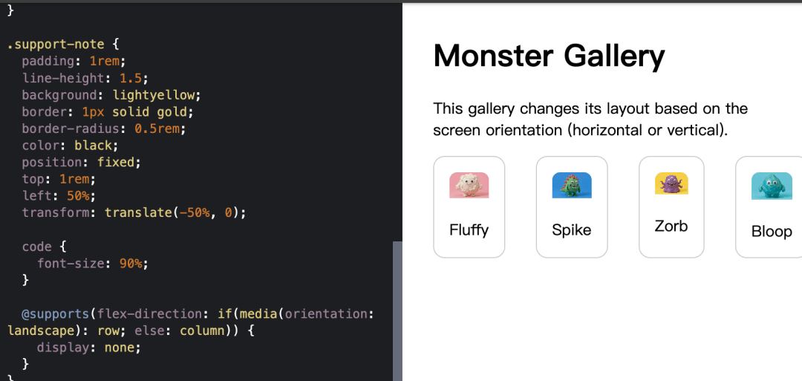

##### https://codepen.io/web-dot-dev/pen/KwzXMXW

##### 6\. Custom Functions (自定义函数)

CSS 自定义函数是 CSS 语言的一项重要新增功能，极大地简化了可组合、可重用和清晰的功能样式逻辑的编写。它们由 `@function` 语句、以双破折号开头的函数名、一系列参数和 `result` 块组成。

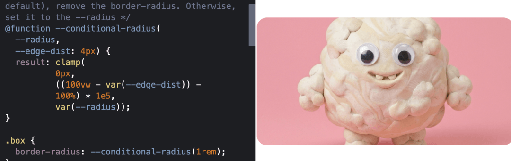

##### https://codepen.io/web-dot-dev/pen/ogxGLOr

##### 7\. Expanded range syntax (扩展的范围语法)

现在，样式查询和 `if()` 语句中可以使用范围语法。

比较操作符： 你可以使用比较运算符如 `<`、`>`、`<=` 和 `>=` 来进行类型化值的比较，例如 `@container style(--rain-percent > 45%)`。

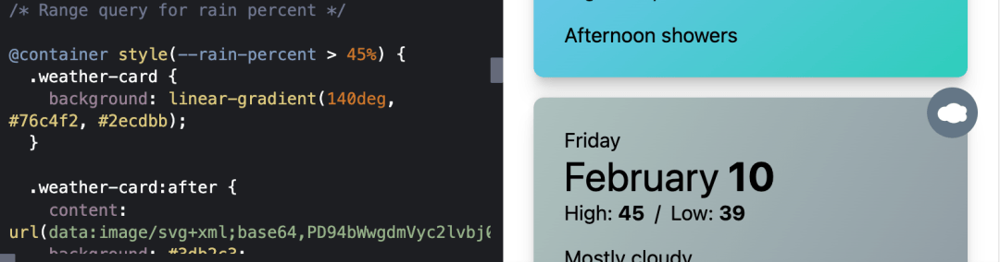

##### https://codepen.io/web-dot-dev/pen/bNpoBbx

##### 8\. Stretch sizing keyword (拉伸尺寸关键字)

`stretch` 关键字用于 CSS 尺寸属性（如 `width` 和 `height`），允许元素精确地填充其包含块的可用空间。

保留边距： 它类似于 `100%`，但结果尺寸应用于元素的外边距框 (margin box)，使元素在尽可能大的同时保留其边距。

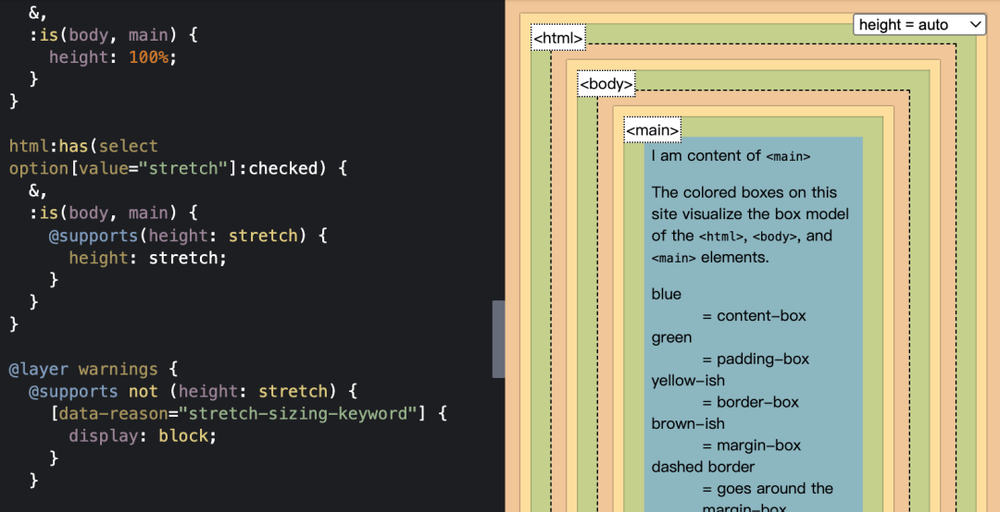

##### https://codepen.io/web-dot-dev/pen/qEZYZwW

##### 9\. corner-shape (角形状)

这个实验性属性提供了对元素角落形状的更多控制，超越了 `border-radius` 所能提供的标准圆角。

多样化形状： 你可以创建多种角落样式，包括 `round` (圆角), `bevel` (斜角), `notch` (刻痕), `scoop` (挖角) 和 `squircle` (方圆形)。对于更精细的控制，还可以使用 `superellipse()` 函数。

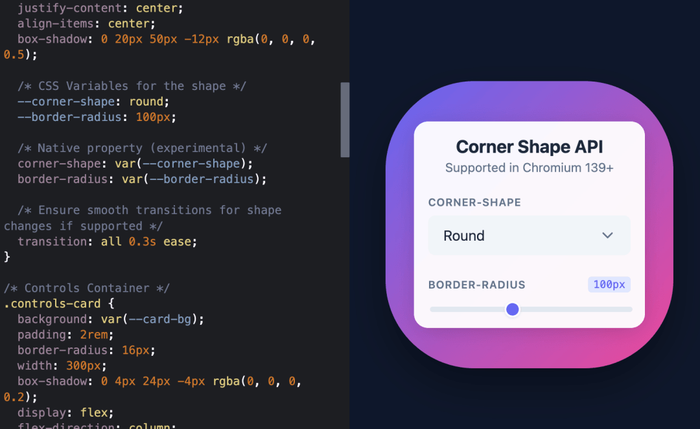

https://codepen.io/web-dot-dev/pen/OPNzoqW

  

关于本文  
原文：https://chrome.dev/css-wrapped-2025/[#scroll](javascript:;)\-target-group

这期前端早读课  
对你有帮助，帮” 赞 “一下，  
期待下一期，帮” 在看” 一下。
