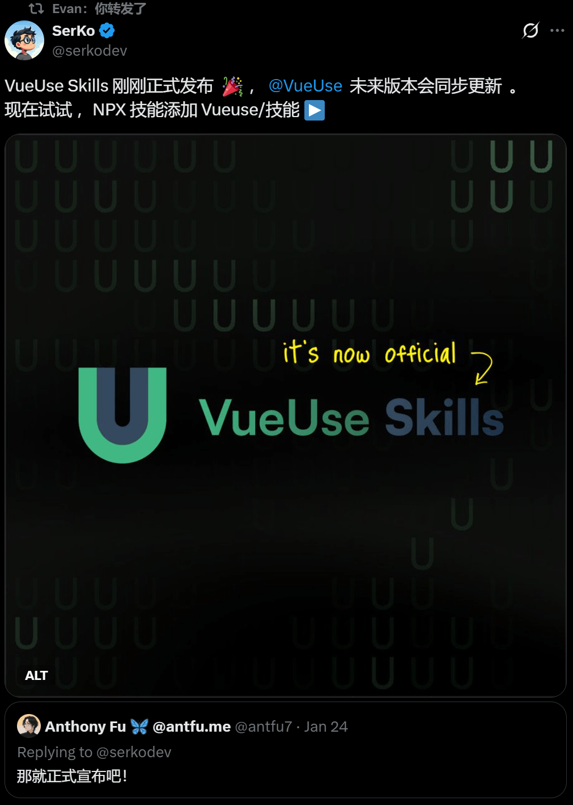
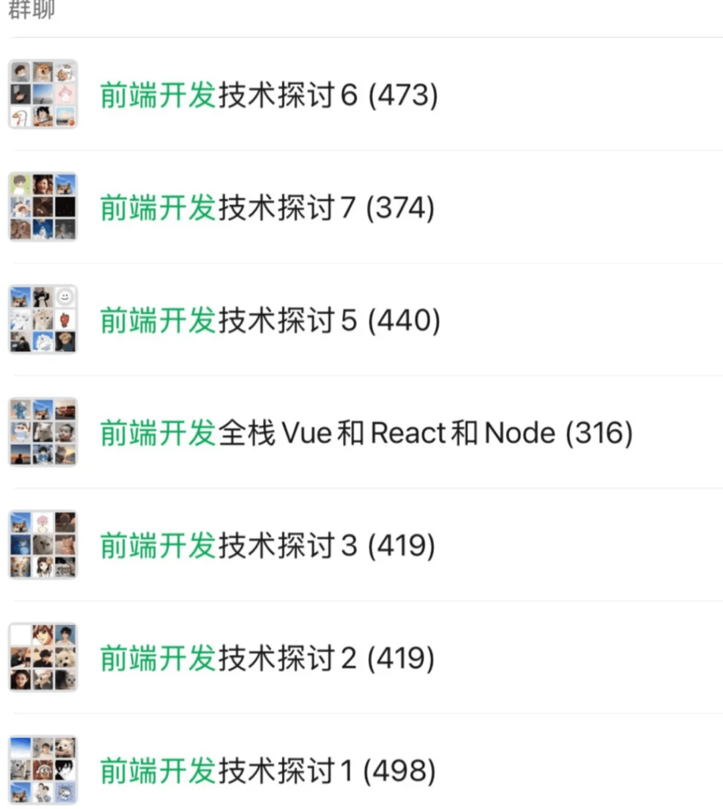

# Vueuse Skills 发布！首个拥抱AI的Hooks神库！

记得之前我们聊过的 vue-skills 吗？

最近，**VueUse 和 Three.js** 的官方 Skills 支持也悄悄上线了！对于习惯使用 Cursor、Windsurf 或者 VS Code Copilot 辅助编程的开发者来说，这绝对是一个 “省流”且“保命” 的重磅更新。



## 核心特性：专为 AI 智能体设计的极致体验

Vueuse skills 针对AI智能体场景深度优化，五大核心特性直击第三方库调用痛点：

- 🪜 渐进式信息披露：分层加载VueUse信息，先概览再按需查详情，避过载、保精准
- 💰 极简Token消耗：仅保留核心调用信息，剔除冗余，从源头降低Token成本
- 📵 离线优先设计：无需额外权限/网络，本地可访信息，离线正常调用VueUse
- ⚙️ 可定制调用策略：通过提示词/AGENTS.md自定义规则，适配个性化AI使用需求
- 💉 减少AI幻觉：提供精准函数参考与类型声明，避免无效API发明，保障代码准确

## 快速安装：两种方式适配不同使用场景

Vueuse skills 提供了极简的安装方式，同时针对 Claude Code 使用者做了专属适配，无需复杂的配置步骤，一行命令即可完成安装，快速集成到你的 AI 开发工作流中。

### 通用安装方式

适用于大多数 AI 智能体使用场景，通过 `npx` 命令即可一键添加技能包：

```
npx skills add vueuse/skills
```
### Claude Code 专属安装

如果你是 Claude Code 使用者，可通过插件市场完成安装，分为两步：

1. 添加 Vueuse skills 插件市场

```
/plugin marketplace add vueuse/skills
```
1. 安装独立的 Vueuse 技能包

```
/plugin install vueuse-functions@vueuse-skills
```
## AI 自动借力 VueUse，高效实现开发需求

完成 Vueuse skills 安装后，你只需在 Vue/ Nuxt 项目中正常安装 VueUse 核心库，再向 AI 智能体下达开发指令，AI 就会自动借助 Vueuse skills 提供的技能规则，精准调用 VueUse 的相关组合式函数，实现开发需求，全程无需你额外指引 AI 如何使用 VueUse。

### 打造多功能 Todo 应用

向 AI 智能体发送如下开发提示词，要求实现一款包含本地存储、标题计数、复制、无限滚动、暗黑模式的 Todo 应用：

```
create a todo app with the following features:
- save todos to local storage
- show remains todo count on browser title
- add a copy button for each todo items
- infinite scrolling for this todo list
- dark / light mode
```
此时 AI 智能体会通过 Vueuse skills 自动匹配 VueUse 对应的核心函数：

- 用 `useStorage` 实现待办事项的本地存储
- 用 `useTitle` 动态修改浏览器标题，展示剩余待办数量
- 用 `useClipboard` 为每个待办项实现复制功能
- 用 `useInfiniteScroll` 打造无限滚动的待办列表
- 用 `useDark` + `useToggle` 实现暗黑/亮色模式的切换

全程无需你告知 AI 具体使用哪个 VueUse 函数，AI 就能精准、高效地生成符合需求的代码，大幅提升开发效率。

## 实验性探索，期待社区反馈

需要特别说明的是，Vueuse skills 目前是一款**实验性项目**，其核心目标是探索 AI 智能体与前端库的高效协作模式，帮助 AI 智能体用更少的 Token 更准确地使用 VueUse。

项目的发展离不开社区的参与，无论是使用过程中发现的问题、功能优化建议，还是新的使用场景需求，都欢迎开发者积极反馈。团队会根据社区的反馈持续迭代，不断完善技能包的能力，让 AI 智能体与 VueUse 的协作更贴合实际开发需求。

## 写在最后

Vueuse skills 的发布，填补了 AI 智能体高效、精准使用 VueUse 的空白，让这款成熟的 Vue 组合式工具库与 AI 技术更好结合，释放 AI 辅助前端开发的更大潜力。

它以「低 Token 消耗、高调用精准、离线优先、可定制」为核心设计理念，为 Vue/ Nuxt 开发者打造了更流畅的 AI 辅助开发体验。而实验性的定位，也让这款产品拥有无限的迭代可能。

未来，随着 AI 技术在前端开发领域的不断渗透，Vueuse skills 有望成为 VueUse 生态中连接 AI 智能体的重要桥梁，让更多开发者能借助「VueUse + AI」的组合，大幅提升开发效率，聚焦于创意和业务逻辑的实现。

现在，就尝试安装 Vueuse skills，体验 AI 智能体精准调用 VueUse 的高效开发吧！

## 结语

我是林三心，一个待过**小型toG型外包公司、大型外包公司、小公司、潜力型创业公司、大公司**的作死型前端选手

我建了一些**前端学习群**，如果大家想进群交流前端知识，可以关注我，回复**加群**


