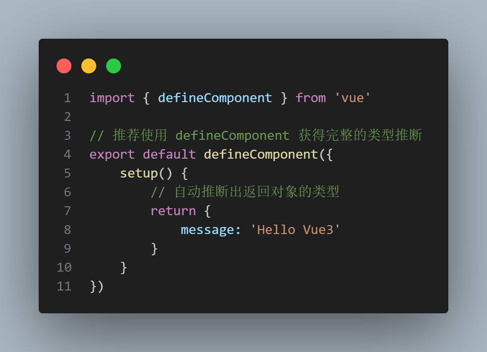
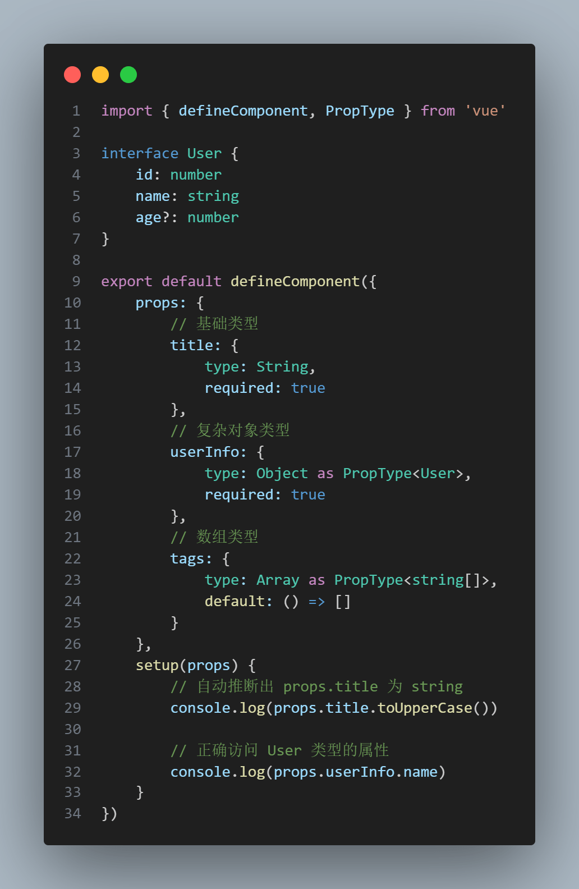
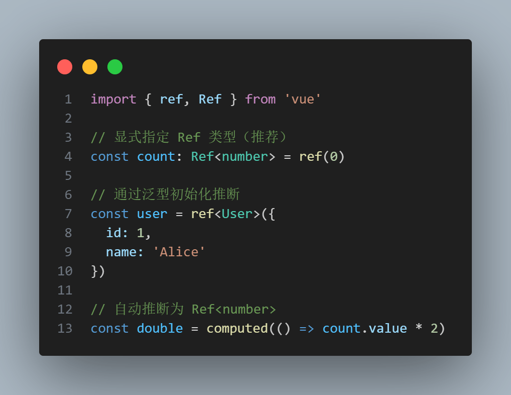
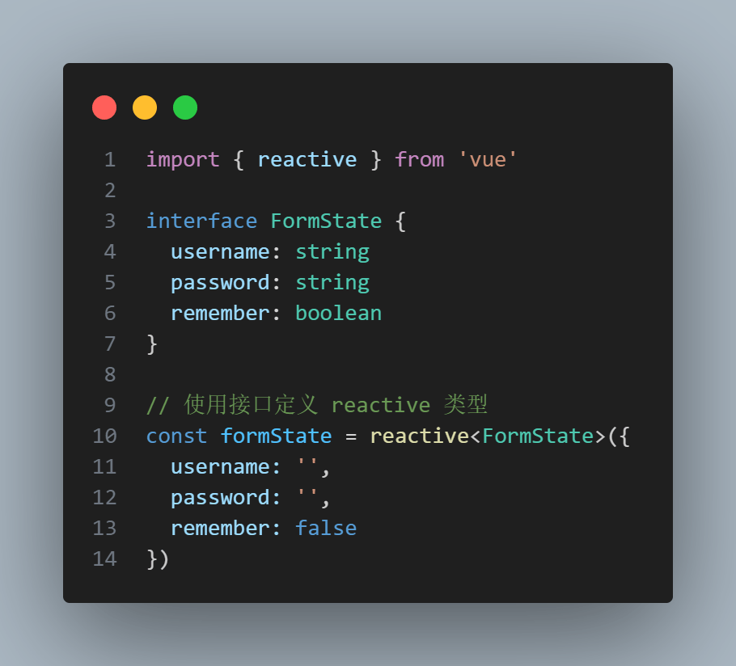
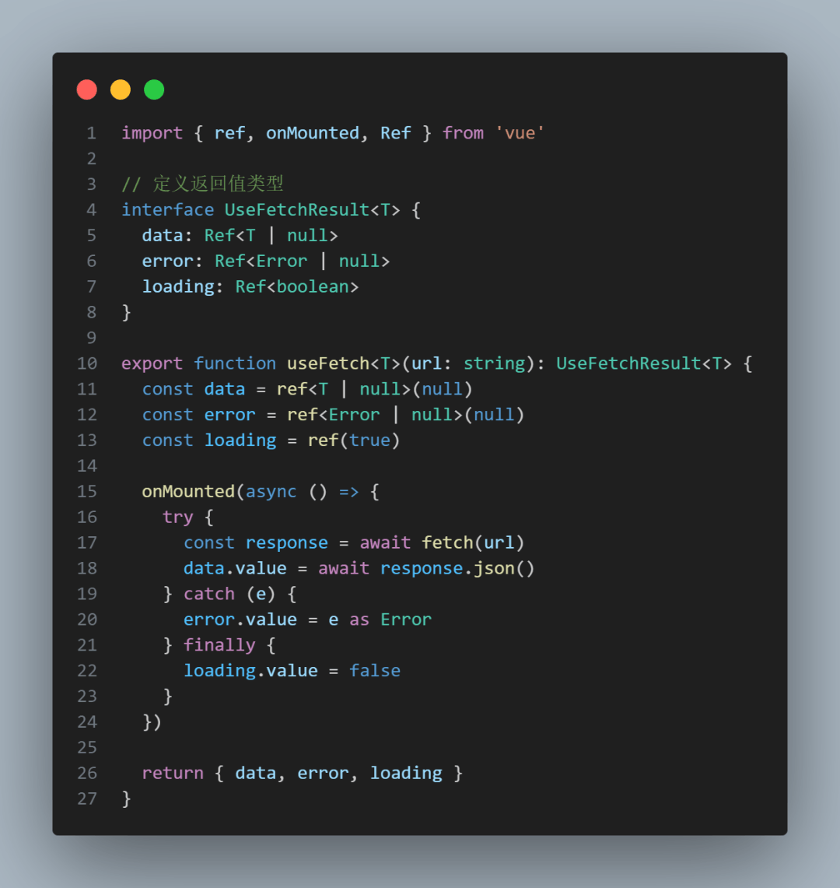
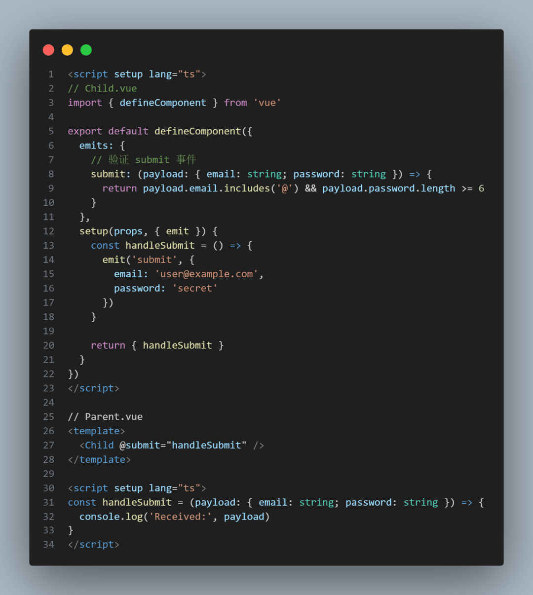
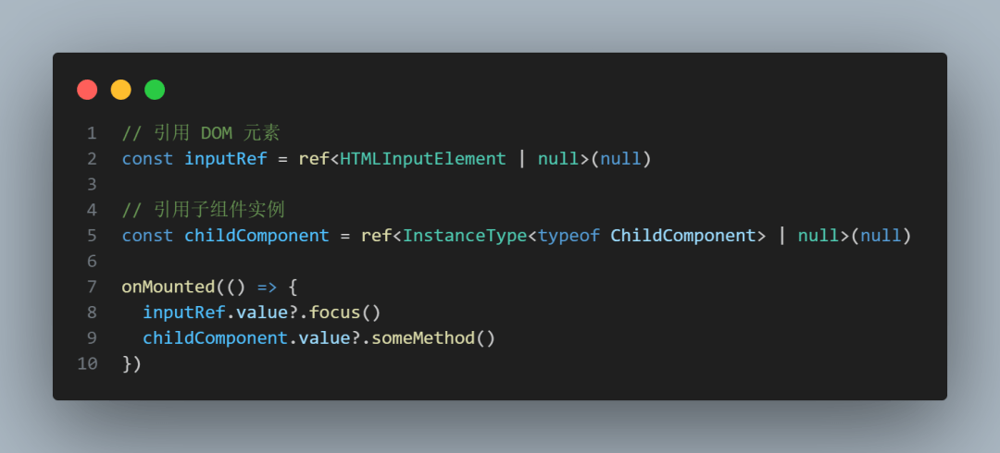
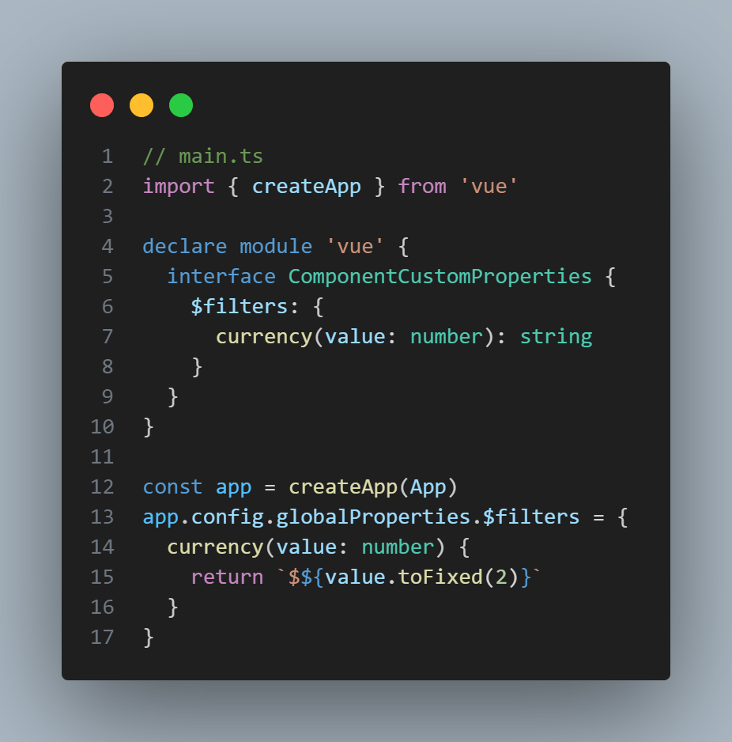
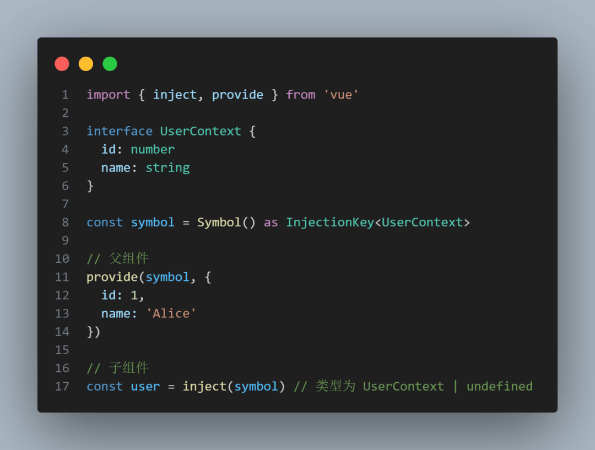

# 如何在 Vue3 中更好地使用 Typescript

## 前言

`TypeScript` 为 `Vue` 应用带来了强大的类型系统支持，Vue3 更是从底层开始使用 `TypeScript` 编写。本文将介绍 `Vue3` 中自带的 `TypeScript` 类型工具及其最佳实践，通过示例代码帮助开发者编写类型安全的 Vue 组件

## 一、基础组件类型

### 1.1 组件定义

使用 `defineComponent` 创建类型安全的组件：

### 1.2 Props 类型声明

使用 PropType 处理复杂类型：

## 二、组合式 API 类型

### 2.1 Ref 类型

### 2.2 Reactive 类型

## 三、组合式函数类型

### 3.1 自定义 Hook

## 四、组件通信类型

### 4.1 自定义事件

### 4.2 模板引用类型

## 五、进阶类型技巧

### 5.1 全局属性扩展

### 5.2 类型化 Provide/Inject

结语

我是林三心，一个待过**小型toG型外包公司、大型外包公司、小公司、潜力型创业公司、大公司**的作死型前端选手
