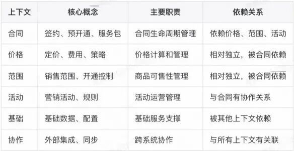
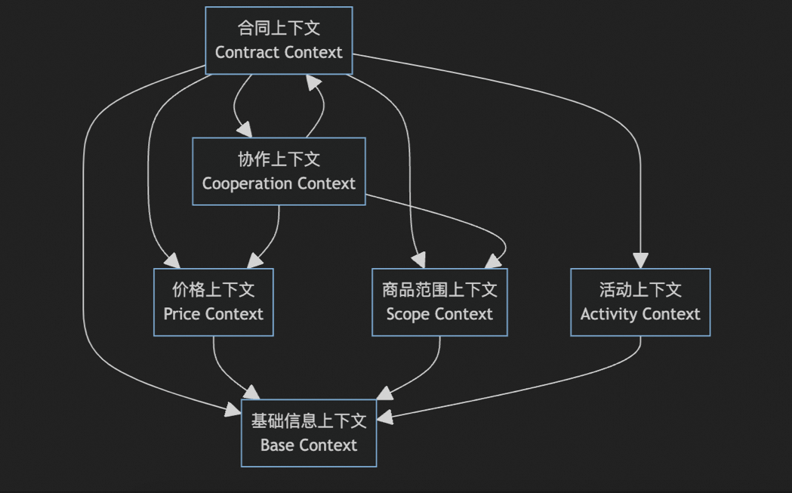
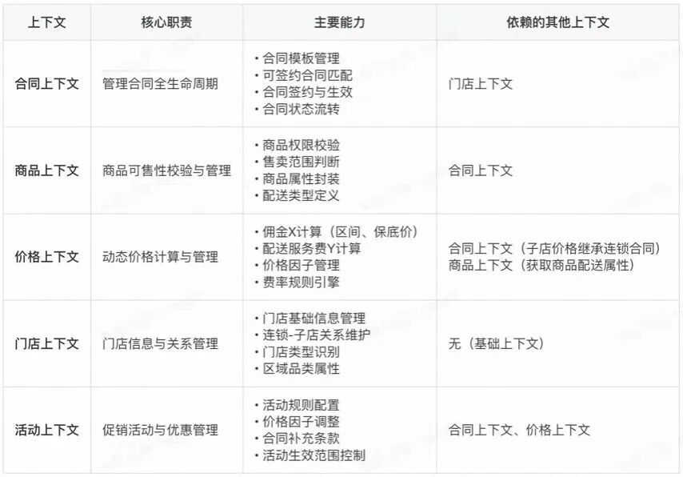
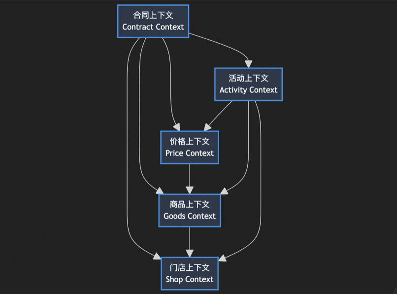
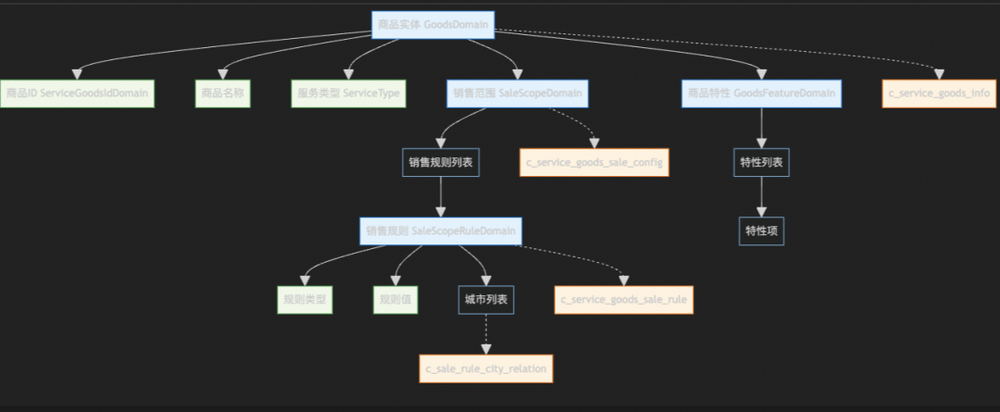
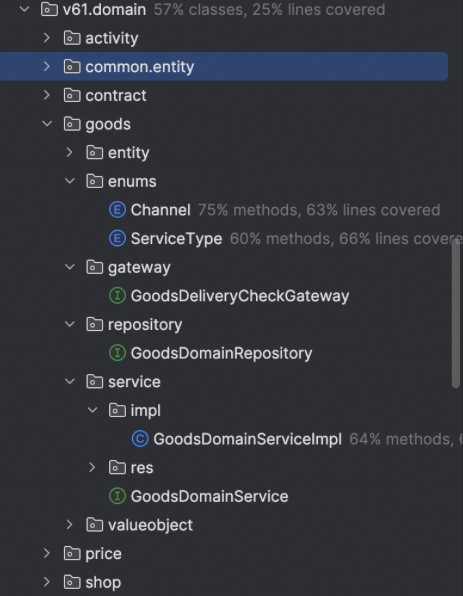
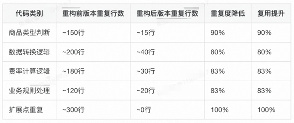
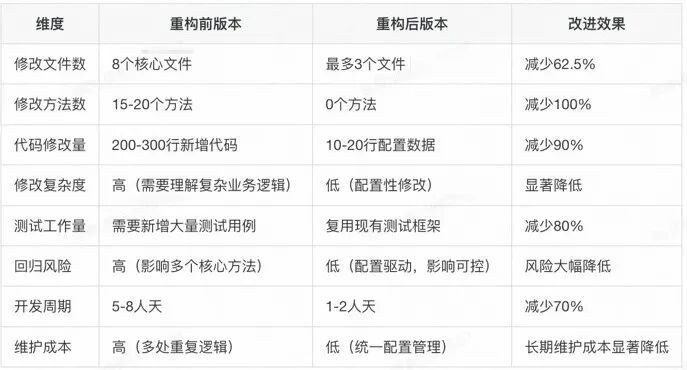

# AI架构师的诞生：AI+传统DDD模式 = 实现开发效率提升75%


  

  

  

本文以淘宝闪购服务包系统为案例，探索如何借助 AI 技术辅助领域驱动设计（DDD）落地。  

  


背景

  

**▐  1.1 改造背景**

  

随着服务包业务的快速发展，**新增一个服务包类型需要5-8人天的高昂成本**，原有的单体架构暴露出严重的开发效率瓶颈：

- **开发成本高昂：每次新增服务包类型需要在8个核心文件、15-20个方法中进行重复性修改，涉及200-300行代码变更；**
- **重复代码泛滥：商品类型判断逻辑在10个文件中重复出现，维护成本极高；**
- **架构耦合严重：3800行的单体业务服务类混合了商品、价格、合同等多个领域逻辑；**
- **扩展风险高：任何新增功能都可能引入回归问题，影响现有业务稳定性；**

**▐**  1.2 改造目标  

  

采用DDD（领域驱动设计）思想结合AI辅助开发进行架构重构，探索智能化架构演进路径：

- **AI驱动架构设计：利用AI分析现有代码结构和业务逻辑，自动识别领域边界和上下文划分，辅助设计合理的DDD架构模型；**
- **智能化模型落地：通过AI代码生成能力，自动化完成领域模型、服务接口、数据转换等重复性代码编写，显著提升开发效率；**
- **持续模型分析优化：建立AI驱动的代码质量监控体系，实时分析架构健康度、代码复杂度和重复度，持续优化模型设计；**
- **开发成本大幅降低：探索将新增服务包类型的开发成本从传统的5-8人天大幅降低至配置化实现；**
- **架构演进智能化：构建可持续演进的智能架构体系，支持业务快速变化和技术栈升级。**

  


架构设计阶段

****▐**  2.1 AI拆解限界上下文**

**问题**：你是一个DDD专家，根据现有代码 v6 这个package下的类帮我抽象下上下文。

**AI回答**：



****

****▐**  2.2 人工介入修正限界上下文**

**从上一步可以看出，AI拆解的限界上下文是基于package结构进行拆分，未能深入分析业务语义，这是AI的薄弱环节，需要人工介入修正。经过人工分析后的限界上下文如下：**





****▐**  2.3 通过AI细化限界上下文**

**基于上述人工拆分的上下文，逐步通过AI细化上下文文档，以商品上下文为例：**

**问题：根据人工拆解限界上下文部分，从原有 me.ele.newretail.contract.v6.domain 包下，帮我抽象出商品上下文的类，Repo、Service，类用Domain结尾，Repo用DomainRepo结尾，Service用DomainService结尾，输出成表格，包含方法和属性，就放到当前这个文档最后。**

**经过多轮迭代优化后的商品上下文设计如下图所示：**



  


代码实现阶段

******▐****  3.1 基于文档生成代码骨架**

**基于准备好的技术文档《技术方案--服务包模型升级.md》进行代码生成：**

**问题：严格根据该技术文档帮我在 v61.domain 包下生成代码骨架。**



********▐******  3.2 AI辅助代码实现**

### 案例1：API转换实现

**问题**：queryConfirmableProgramList 第157行开始，帮我把 List shopConfirmableContracts 转换成 ConfirmableServiceProgramDTO 参考 queryConfirmableProgramList 链路原有代码。

**实现效果**：新增734行代码，人工修正25行，准确率高达 96.6%。

### 案例2：版本比对工具实现

### 问题：帮我写个比对 queryConfirmableProgramList 和 queryConfirmableProgramList 两个方法返回结果是否一致的 工具类 叫 ProgramVersionComparisonUtil 放到 v61 包下。

**实现效果**：新增比对代码 3098行，人工修正12行，准确率高达99.6%。

  


重构效果分析

********▐****  4.1 架构解耦度分析****

  

**问题**：帮我对比下queryConfirmableProgramList 和 queryConfirmableProgramList 从分层、域解耦等维度进行分析。

以queryConfirmableProgramList方法重构为例进行对比分析：

### 重构前后实现对比

**重构前实现**

**重构后实现**

**实现特点:**

- 代码行数: 主方法42行 + 核心调用链路约1,500行；
- 复杂度: 高度耦合，包含多种业务逻辑混合；
- 重复代码: 存在大量商品类型判断逻辑；

  

**实现特点:**

- 代码行数: 主方法37行 + 核心调用链路约720行；
- 复杂度: 通过领域服务解耦，逻辑清晰；
- 职责分离: 每个上下文专注自己的业务逻辑；

  

**核心实现逻辑:**

```code-snippet__js
@Override
public SingleResponse<ConfirmableServiceProgramDTO> 
    queryConfirmableProgramList(ConfirmableProgramQuery query){
    
    try {
        // step.1 参数校验和门店信息获取
        if (query == null || query.getShopId() == null) {
            return SingleResponse.buildFailure("参数不能为空");
        }
        
        ShopInfoDTO shopInfo = shopQueryAbility.queryShopInfo(query.getShopId());
        if (shopInfo == null) {
            return SingleResponse.buildFailure("门店不存在");
        }
        
        // step.2 获取可签方案列表 - 复杂的扩展点机制
        List<ServiceProgramDTO> programs = new ArrayList<>();
        
        // 获取所有商品信息
        List<GoodsDTO> allGoods = goodsQueryAbility.queryAllGoods();
        
        for (GoodsDTO goods : allGoods) {
            // 重复的商品类型判断逻辑 - 问题点1
            if (switch51ConfigGateway.superClientGoodId().equals(goods.getGoodsId())) {
                // 超客商品特殊处理
                if (validateSuperClientGoods(goods, shopInfo)) {
                    ServiceProgramDTO program = buildSuperClientProgram(goods, shopInfo);
                    programs.add(program);
                }
            } elseif (switch51ConfigGateway.platformDeliveryGoodId().equals(goods.getGoodsId())) {
                // 平台配送商品特殊处理
                if (validatePlatformDeliveryGoods(goods, shopInfo)) {
                    ServiceProgramDTO program = buildPlatformDeliveryProgram(goods, shopInfo);
                    programs.add(program);
                }
            } elseif (switch51ConfigGateway.selfDeliveryGoodId().equals(goods.getGoodsId())) {
                // 自配送商品特殊处理
                if (validateSelfDeliveryGoods(goods, shopInfo)) {
                    ServiceProgramDTO program = buildSelfDeliveryProgram(goods, shopInfo);
                    programs.add(program);
                }
            }
            // ... 更多商品类型判断
        }
        
        // step.3 价格计算 - 内嵌在业务服务中
        for (ServiceProgramDTO program : programs) {
            // 硬编码的价格计算逻辑 - 问题点2
            if (program.getDeliveryType().equals("PLATFORM")) {
                program.setCommissionRate(new BigDecimal("0.08")); // 8%
                program.setDeliveryFee(calculatePlatformDeliveryFee(program, shopInfo));
            } elseif (program.getDeliveryType().equals("SELF")) {
                program.setCommissionRate(new BigDecimal("0.10")); // 10%
                program.setDeliveryFee(calculateSelfDeliveryFee(program, shopInfo));
            }
            
            // 保底价计算
            BigDecimal basePrice = priceCalculateAbility.calculateBasePrice(
                program.getGoodsId(), shopInfo.getCategoryId());
            program.setBasePrice(basePrice);
        }
        
        // step.4 活动处理 - 分散的活动逻辑
        List<ActivityDTO> activities = activityQueryAbility.queryShopActivities(query.getShopId());
        for (ServiceProgramDTO program : programs) {
            for (ActivityDTO activity : activities) {
                // 活动匹配逻辑分散 - 问题点3
                if (activity.getType().equals("COMMISSION_DISCOUNT")) {
                    if (activity.getTargetGoods().contains(program.getGoodsId())) {
                        BigDecimal discountRate = activity.getDiscountRate();
                        BigDecimal newRate = program.getCommissionRate().subtract(discountRate);
                        program.setCommissionRate(newRate);
                        program.setActivityId(activity.getActivityId());
                    }
                } elseif (activity.getType().equals("DELIVERY_DISCOUNT")) {
                    // 配送费优惠逻辑
                    if (activity.getTargetGoods().contains(program.getGoodsId())) {
                        BigDecimal discountFee = activity.getDiscountAmount();
                        BigDecimal newFee = program.getDeliveryFee().subtract(discountFee);
                        program.setDeliveryFee(newFee);
                    }
                }
            }
        }
        
        // step.5 构建返回结果
        ConfirmableServiceProgramDTO result = new ConfirmableServiceProgramDTO();
        result.setShopId(query.getShopId());
        result.setPrograms(programs);
        result.setTotalCount(programs.size());
        
        return SingleResponse.of(result);
        
    } catch (Exception e) {
        logger.error("查询可签方案失败，shopId：{}，异常：{}", 
            query.getShopId(), e.getMessage(), e);
        return SingleResponse.buildFailure("查询失败");
    }
}


// 重复的商品校验方法 - 在多个地方重复出现
private boolean validateSuperClientGoods(GoodsDTO goods, ShopInfoDTO shopInfo){
    // 重复的商品类型判断逻辑
    if (!switch51ConfigGateway.superClientGoodId().equals(goods.getGoodsId())) {
        returnfalse;
    }
    
    // 区域校验逻辑内嵌
    List<String> allowedCities = goods.getAllowedCities();
    if (!allowedCities.contains(shopInfo.getCity())) {
        returnfalse;
    }
    
    // 品类校验逻辑内嵌
    List<Long> allowedCategories = goods.getAllowedCategories();
    if (!allowedCategories.contains(shopInfo.getCategoryId())) {
        returnfalse;
    }
    
    returntrue;
}


// 类似的重复方法还有：
// validatePlatformDeliveryGoods()
// validateSelfDeliveryGoods()
// buildSuperClientProgram()
// buildPlatformDeliveryProgram()
// buildSelfDeliveryProgram()
```
**核心实现逻辑:**

```code-snippet__js
@Override
public SingleResponse<ConfirmableServiceProgramDTO> 
    queryConfirmableProgramList(ConfirmableProgramQuery query){
    
    // step.1 获取门店信息 - 门店上下文
    ShopDomain shopDomain = shopDomainService
        .getShop(query.getShopId());
    
    // step.2 查询可签合同列表 - 合同上下文
    List<ShopContractDomain> contracts = 
        shopContractDomainService
        .getShopConfirmableContractList(shopDomain);
    
    // step.3 商品校验 - 商品上下文
    contracts = goodsDomainService
        .filterAvailableContracts(contracts, shopDomain);
    
    // step.4 价格计算 - 价格上下文
    contracts = priceDomainService
        .enrichContractPrice(contracts);
    
    // step.5 活动匹配 - 活动上下文
    contracts = activityDomainService
        .applyActivityDiscount(contracts, shopDomain);
    
    // step.6 转换为DTO返回
    ConfirmableServiceProgramDTO result = 
        buildConfirmableServiceProgramDTO(contracts);
    
    return SingleResponse.of(result);
}
```
**问题点:**

- 业务逻辑高度耦合在一个方法中；
- 商品类型判断逻辑重复出现；
- 扩展点机制复杂，难以维护；
- 缺乏清晰的职责分离。

**优势:**

- 清晰的步骤分离，每步职责单一；
- 通过领域服务实现业务逻辑解耦；
- 消除重复代码，提高可维护性；
- 支持开闭原则，易于扩展。

  

  

详细改进对比


| 维度 | 重构前特点 | 重构后特点 | 改进效果 |
| --- | --- | --- | --- |
| 代码结构 | 主方法42行 + 核心调用链路~1,500行 | 主方法37行 + 核心调用链路~720行 | 调用链路代码量减少52%，复杂度显著降低 |
| 职责分离 | 所有逻辑混合在业务服务中 | 按上下文分离，各司其职 | 职责单一，易于维护 |
| 商品处理 | 重复的商品类型判断逻辑 | 统一的商品校验服务 | 重复代码消除100% |
| 价格计算 | 内嵌在查询逻辑中 | 独立的价格计算服务 | 价格逻辑内聚 |
| 活动处理 | 分散的活动匹配逻辑 | 统一的活动服务 | 活动逻辑集中管理 |
| 扩展性 | 修改需要改动多处代码 | 新增功能只需扩展对应上下文 | 支持开闭原则 |
| 测试性 | 难以进行单元测试 | 每个上下文可独立测试 | 测试覆盖率提升 |


###   

### 重构前核心问题点

**1\. 重复代码泛滥**

- `switch51ConfigGateway.superClientGoodId().equals()` 判断逻辑在10个文件中重复；
- `buildDeliveryProgramTypeEnum` 方法在2个类中完全重复；
- 商品类型判断逻辑分散在多个Ability类中；

**2\. 业务逻辑耦合**

- 价格计算直接依赖商品属性；
- 合同创建逻辑与数据持久化混合在一起；
- 活动优惠逻辑散落在查询、计算、签约等多个环节；

**3\. 扩展性差**

- 新增商品类型需要在多处添加switch判断；
- 新增活动类型需要修改多个Ability类；
- 新增合同模板需要修改8个文件约15-20个方法；

******▐****  4.2 重复代码模式识别  
**

**问题**：帮我对比下queryConfirmableProgramList 和 queryConfirmableProgramList 这两个方法链路中的代码重复度。

通过代码分析，发现以下重复代码模式：

###   

### 商品类型判断逻辑重复

在以下10个文件中发现相同的判断逻辑：

**重复代码示例**:

```code-snippet__js
// 在多个文件中重复出现的商品类型判断逻辑
if (switch51ConfigGateway.superClientGoodId().equals(goods.getGoodsId())) {
    // 超客商品特殊处理逻辑
    // 这段逻辑在10个不同文件中重复出现
}
```
**重复出现的文件**:

`1. DefaultConfirmableProgramQueryExt.java` - buildDeliveryProgramTypeEnum方法

`2. ProgramConverter.java` - buildDeliveryProgramTypeEnum方法

`3. ProgramAbilityImpl.java` - signEUnion方法

`4. ProgramAbilityImpl.java` - getSignGoodRequest方法

`5. ProgramQueryAbilityImpl.java` - 多个方法

`6. ProgramSignAbilityImpl.java` - 多个方法

`7. DefaultProgramQueryExt.java` - 查询逻辑

`8. ProgramBizServiceImpl.java` - 三个核心方法

`9. ProgramTypeEnumBuilder.java` - 类型构建逻辑

`10. DeliveryProgramConverter.java` - 转换逻辑

###   

### buildDeliveryProgramTypeEnum方法重复

该方法在2个类中完全重复：

- `DefaultConfirmableProgramQueryExt`
- `ProgramConverter`

  

重复代码消除效果



********▐******  4.3 新增服务商品改动点对比**

**问题：综合上面的分析，帮我对比下v61和v6两个代码链路在新增一个服务商品时的改动点。**


| 重构前新增服务商品需要修改的文件 | 重构后新增服务商品需要修改的文件 |
| --- | --- |
| 核心业务服务层修改：1. ProgramBizServiceImpl.javaqueryConfirmableProgramList方法；queryConfirmableCombineProgramList方法；signProgram方法；需要在3个核心方法中都添加新的商品类型判断逻辑；扩展点和转换层修改：2. DefaultConfirmableProgramQueryExt.javabuildDeliveryProgramTypeEnum方法queryConfirmableProgramList扩展逻辑3. ProgramConverter.javabuildDeliveryProgramTypeEnum方法（与上面重复）领域对象转换逻辑能力层修改：4. ProgramAbilityImpl.javasignEUnion方法getSignGoodRequest方法5. ProgramQueryAbilityImpl.java多个查询相关方法商品类型过滤逻辑6. ProgramSignAbilityImpl.java多个签约相关方法签约流程判断逻辑工具类和构建器修改：7. DeliveryProgramConverter.java配送方案转换逻辑商品类型映射8. ProgramTypeEnumBuilder.java枚举构建逻辑新类型枚举定义 | 领域模型层修改：1. ContractTemplateDomain.java添加新的合同模板配置商品组合定义模板属性扩展商品上下文修改（可选）：2. GoodsDomain.java仅当涉及新的商品属性时才需要修改配送类型定义商品特性扩展数据配置修改：3. 数据库配置在合同模板表中添加新模板记录配置商品组合关系设置模板生效规则可能的扩展修改：4. 枚举类扩展（如需要）新增合同类型枚举商品类型枚举扩展 |


###   

### 改动点对比总结



  


AI架构升级总结

********▐******  5.1 AI架构升级价值和效果**

**核心价值**

- **智能分析：快速识别重复模式、梳理依赖关系，提供现状分析；**
- **高效生成：代码生成准确率99.0%，速度提升8-10倍；**
- **质量保障：架构评估、最佳实践指导、风险预警；**

实施要点

- 人机分工：AI负责重复性工作，人类负责业务决策和质量把关；
- 渐进策略：分析→设计→实现→验证，每阶段明确标准；
- 质量控制：AI代码必须人工review，建立自动化检查；

实际效果

- 效率提升：新增3832行代码，AI生成70%+，重构周期缩短75%+；
- 质量改善：代码量减少52%，重复代码消除100%，改动点从8个文件减少到1-2个；
- 业务价值：开发成本从5-8人天降低到配置化，支持快速迭代；

******▐****  5.2 AI架构升级总结展望**  

  

AI辅助架构升级证明了人机协作的有效性，让工程师从重复编码中解放，专注于架构设计和业务创新。这将成为软件工程的新常态。

  

  

  

  

**¤** **拓展阅读** **¤**

  

[3DXR技术](https://mp.weixin.qq.com/mp/appmsgalbum?__biz=MzAxNDEwNjk5OQ==&action=getalbum&album_id=2565944923443904512#wechat_redirect) | [终端技术](https://mp.weixin.qq.com/mp/appmsgalbum?__biz=MzAxNDEwNjk5OQ==&action=getalbum&album_id=1533906991218294785#wechat_redirect) | [音视频技术](https://mp.weixin.qq.com/mp/appmsgalbum?__biz=MzAxNDEwNjk5OQ==&action=getalbum&album_id=1592015847500414978#wechat_redirect)

[服务端技术](https://mp.weixin.qq.com/mp/appmsgalbum?__biz=MzAxNDEwNjk5OQ==&action=getalbum&album_id=1539610690070642689#wechat_redirect) | [技术质量](https://mp.weixin.qq.com/mp/appmsgalbum?__biz=MzAxNDEwNjk5OQ==&action=getalbum&album_id=2565883875634397185#wechat_redirect) | [数据算法](https://mp.weixin.qq.com/mp/appmsgalbum?__biz=MzAxNDEwNjk5OQ==&action=getalbum&album_id=1522425612282494977#wechat_redirect)
