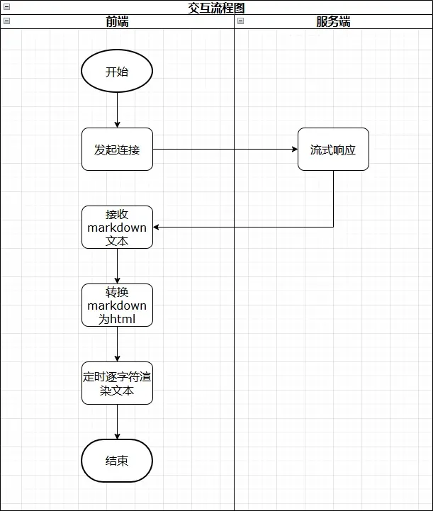
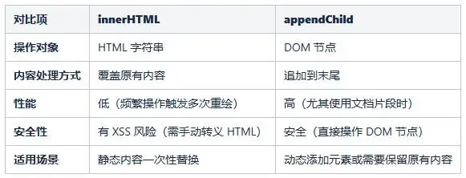
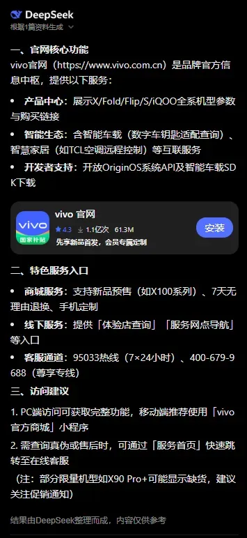
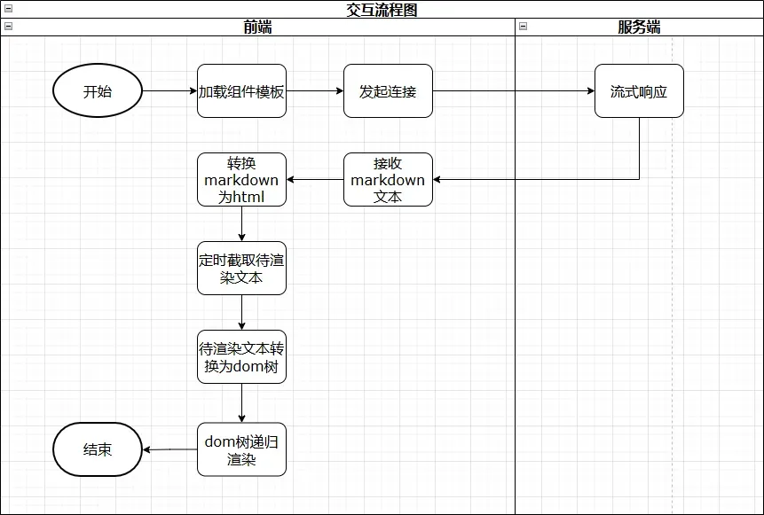

# 【第3621期】浅谈 AI 搜索前端打字机效果的实现方案演进

前言

深入剖析了 AI 搜索前端打字机效果的实现方案演进。从早期的纯文本逐字符展示，到借助现代前端框架实现复杂样式和交互的打字机组件，文章详细探讨了各阶段的技术难点、优劣势及解决方案，展现了前端技术的持续进步和产品追求卓越的态度，同时今日前端早读课文章由 @He Yanjun 分享，公号：vivo 互联网技术授权。

正文从这开始～～

在当代前端开发领域，打字机效果作为一种极具创造力与吸引力的交互元素，被广泛运用于各类网站和应用程序中，为用户带来独特的视觉体验和信息呈现方式，深受广大用户的喜爱。

[【第3539期】部分关键帧：打造动态、可组合的 CSS 动画效果](https://mp.weixin.qq.com/s?__biz=MjM5MTA1MjAxMQ==&mid=2651276851&idx=1&sn=02cfef67be8ab024dac3fc2c22ad8e9d&scene=21#wechat_redirect)

本文将深入介绍在 AI 搜索输出响应的过程中，打字机效果是怎样逐步演进的。力求以通俗的语言和严谨的思路深入剖析打字机效果在不同阶段的关键技术难点和优劣势。


#### 引言

在 AI 搜索场景中，由于大模型基于流式输出文本，需要多次响应结果到前端，因此这种场景十分适合使用打字机效果。

[【第3571期】调试神秘的 HTTP 流式传输问题](https://mp.weixin.qq.com/s?__biz=MjM5MTA1MjAxMQ==&mid=2651277241&idx=1&sn=3f007c49970bfd2bbb9d28c52799b121&scene=21#wechat_redirect)

打字机效果是指在生成内容的场景中，文字逐字符动态显示，模拟人工打字的过程，主要是出于提升用户体验、优化交互逻辑和增强心理感知等方面的考量：

##### 缓解等待焦虑，降低 “无反馈” 的负面体验。

内容是逐步响应的，打字机效果可以很好地提供 “实时反馈”，用户可以感知到系统正在工作，从而减少了等待过程中的不确定性和焦虑感。

##### 模拟自然交互，增强 “类人对话” 的沉浸感。

对话交流具有停顿、强调等节奏感，通过实时打字的模拟，跟容易拉近与用户的心理距离，增强对话感和沉浸感。

##### 优化信息接收效率，避免 “信息过载”。

如果一次性展示大量密密麻麻的文字，用户需要花时间筛选重点，容易产生抵触，通过打字机效果可以缓和阅读节奏，减少视觉和认知负担。

##### 强化 “AI 生成” 的感知，降低对 “标准答案” 的预期。

使用户感知到是 AI 实时计算结果，而非预存的标准答案，有助于用户理性客观地使用工具。

#### 早期实现方案，纯文本逐字符打字效果

最开始的产品功能，需要根据用户输入的搜索词，流式输出并逐字符展示到页面上，这可以说是打字机效果的入门级实现了，不依赖任何复杂的技术，其流程图大致如下所示。

[【第3290期】使用 HTTP 流式传输提升性能](https://mp.weixin.qq.com/s?__biz=MjM5MTA1MjAxMQ==&mid=2651271212&idx=1&sn=7ec25153d49a3091ed7c234b6019d930&scene=21#wechat_redirect)



##### 详细说明

前端会定义一个字段用来缓存全量的 markdown 文本，每次服务端流式响应 markdown 文本到前端时，前端都会将其追加到这个缓存字段后，然后基于 marked 依赖库将全量的 markdown 文本转换为 html 片段。

要实现逐字符渲染的动画效果，就需要定时更新文本。定时功能一般采用 setTimeout 或 setInterval 来实现，而更新文本可以考虑 innerHTML 和 appendChild 的方式，这里采用的 innerHTML 方式插入文本，核心代码如下所示。

```
 let fullText = 'test text';// 全量的html文本
 let index = 0;// 当前打印到的下标
 let timer = window.setInterval(() => {
   ++index;
   $dom.innerHTML = fullText.substring(0, index);
 }, 40);
```
##### innerHTML 与 appendChild 的核心区别对比



为什么选择 innerHTML 而非 appendChild？

由于服务端是流式返回 markdown 文本，因此每次返回的 markdown 文本可能不是完整的。

举个例子如下。

```
 先返回下面一段markdown文本

 ** 这是一个
 再返回下面一段markdown文本

 标题 **
 先返回的文本会当作纯文本展示，再返回的文本会与先返回的文本结合生成html片段如下

 <strong>这是一个标题</strong>
```
如果使用 appendChild 的话，就不好处理上述场景。

##### 小 结

这种方式的优点就是简单易懂，很容易上手实现，也没有任何依赖。

但是，它的缺点也是显而易见的。比如，我们无法方便的添加一些额外的动画效果来增强视觉体验，如光标闪烁效果；对于一些复杂文本内容，或者需要更加灵活地控制展示细节时也会显得捉襟见肘；并且每次通过 innerHTML 渲染文本时，都触发了 dom 的销毁与创建，性能消耗大。

#### 需求难度进一步提升

随着产品的迭代，业务要求打字内容不仅是纯文本，还需要穿插展示卡片等复杂样式效果，如下图所示。

卡片的类型包括应用、股票、影视等，需要可扩展、可配置，并且还会包括复杂的交互效果，如点击、跳转等。



很明显，基于早期的实现方案已经远远不能满足日益增强的业务诉求了，必须考虑更加灵活高效的技术方案。

#### 现代框架下的实现，基于 Vue 虚拟 dom 动态更新

通过上述的分析，打字内容中要穿插展示卡片，显然需要使用单例模式，否则如果每次打字都重新创建元素的话，不仅性能低下，而且数据和状态还无法保持一致。

而要使用单例模式，就必须根据现有数据对已插入节点进行插入、更新、移除等操作以保持数据的一致性，这就很自然地会想到使用现代前端框架来对打字机效果进行改进。

[【第3602期】fluth-vue: 融合响应式的promise流](https://mp.weixin.qq.com/s?__biz=MjM5MTA1MjAxMQ==&mid=2651277690&idx=1&sn=6b53700a4cbdd5a593e6827b222da4c2&scene=21#wechat_redirect)

Vue 是基于虚拟 dom 的渐进式 javascript 框架，仅在数据变化时计算差异并更新必要的部分，因此可以借助其数据驱动开发、组件化开发等特性，轻松地构建一个可复用的打字机效果组件。

##### 设计思路

要实现打字正文中穿插卡片的效果，首先需要定义好返回的数据结构，它需要具备可扩展，方便解析，兼容 markdown 等特性，所以使用 html 标签是一种比较合适的方式，例如要展示一个应用卡片，可以下发如下所示数据。

```
 <app id="" />
```
从下发的数据中可以获取到标签名和属性键值对，这样就可以通过标签名来渲染关联到的组件模板，通过属性键值对去服务端加载对应的数据，于是就可以水到渠成的把应用卡片展示出来，其流程图如下图所示。



##### 详细说明

组件模板文件按照一定规则组织在特定的目录下，在构建时打包到资源里，关键代码如下所示。

```
 privateinit(){
     let fileList = require.context('@/components/common/box', true, /\.vue$/);
     fileList.keys().forEach((filePath) => {
         let startIndex = filePath.lastIndexOf('/');
         let endIndex = filePath.lastIndexOf('.');
         let tagName = filePath.substring(startIndex + 1, endIndex);
         this.widgetMap[tagName] = fileList(filePath).default;
     });
 }
```
之前版本在每次接收到服务端下发的 markdown 文本时，都会做一次转换成 html 的操作，如果多次响应之间的间隔时间很短，则会出现略微卡顿的现象，因此这里转换为 html 时再增加一个防抖功能，可以很有效的避免卡顿。

每次定时截取到待渲染的 html 文本以后，会基于 ultrahtml 库将其转换为 dom 树，并过滤掉注释、脚本等标签，核心代码如下。

```
 let toRenderHtml = this.rawHtml.substring(0, this.curIndex);
 let dom = {
     type: ELEMENT_NODE,
     name: 'p',
     children: parse(toRenderHtml).children
 };
```
最后就是全局注册一个递归组件用来渲染转换后的 dom 树，核心代码如下。

```
 render(h: any) {
     // 此处省略若干代码

     // 处理子节点
     let children = this.dom['children'] || [];
     let renderChildren = children.map((child: any, index: number) => {
         return h(CommonDisplay, {
             props: {
                 dom: child,
                 displayCursor: this.displayCursor,
                 lastLine: this.lastLine && index === children.length - 1,
                 ignoreBoxTag: this.ignoreBoxTag
             }
         });
     });

     // 此处省略若干代码

     // 处理文本节点
     if (this.dom['type'] === TEXT_NODE) {
         returnthis.renderTextNode({h, element: this.dom});
     }

     // 处理自定义组件标签
     let tagName = this.dom['type'] === ELEMENT_NODE ? this.dom['name'] : 'div';
     if (this.$factory.hasTag(tagName)) {
         // 此处省略若干代码
         let widget = this.$factory.getWidget(tagName);
         return h(widget, {
             key: tagId,
             props: {
                 displayCursor: this.displayCursor,
                 lastLine: this.lastLine,
                 text,
                 ...attributes
             }
         }, isLastLeaf && this.displayCursor ? [h(commonCursor)] : []);
     }

     // 处理html原始标签
     return h(tagName, {
         attrs: {
             displayCursor: this.displayCursor,
             lastLine: this.lastLine,
             ...this.dom['attributes']
         }
     }, renderChildren);
 }
```
##### 问题整理和解决

打字机功能终于正常运行了，流畅度还是不错的，但是在体验的过程中，也发现了一些细节问题。

①打字文本中如果存在标签，如 `<p>xxx</p>` ，会出现先展示 `<` , 再展示 `<p` ，最后展示空的效果，也就是字符回退，极大影响阅读体验。

**原因分析**

定时截取待渲染文本时是通过定义一个下标递增逐字符截取的，这就导致标签并没有作为一个原子结构被整体截取，于是就出现了字符回退的现象。

**解决方案**

当下标指向的字符为 `<` 时，则往后截取到 `>` 的位置，核心代码如下。

```
 if (curChar === '<') {
     let lastGtIndex = this.rawHtml.indexOf('>', this.curIndex);
     if (lastGtIndex > -1) {
         this.curIndex = lastGtIndex + 1;
         returnfalse;
     }
 }
```
② 打字文本中如果存在转义字符，如 "，则会依次出现这些字符，最后再展示" ，也就是字符闪烁，也十分影响阅读体验。

**原因分析**

原因同上述字符回退一样，也是没有把转义字符当作一个整体截取。

**解决方案**

当下标指向的字符为 & 时，则往后截取到转义字符结束的位置，核心代码如下。

```
 // 大模型大概率只下发有限类别的转义字符，做成配置动态下发，不仅解析方便，定制下发也很及时
 if (curChar === '&') {
     let matchEscape = this.config['writer']['escapeArr'].find((item: any) => {
         returnthis.rawHtml.indexOf(item, this.curIndex) === this.curIndex;
     });
     if (matchEscape) {
         this.curIndex += matchEscape.length;
         returnfalse;
     }
 }
```
③ 打字过程中的速度是固定的，缺少一点抑扬顿挫的节奏感，不够自然。

**原因分析**

定时器的间隔时间是固定的一个数值，所以表现为一个固定不变的打字节奏。

**解决方案**

可以根据未打印字符数来动态调整每次打字的速度，一种可选的实现方案如下。

假设未打印字符数为 N ，速度平滑指数为 a ，实际打字速度为 Vcurrent ，逻辑应达到的打字速度为  
Vnew 。

```
 if N <= 10 , Vnew = 100 ms / 1字符

 if 10 < N <= 20 , Vnew = 100 - 8 * ( N - 10 ) ms / 1字符

 if 20 < N , Vnew = 20 ms / 4字符

 Vcurrent = a * Vcurrent + ( 1 - a ) * Vnew
```
上述策略可能会比较多，而且上线以后还有可能更换数值对照效果，因此为了支持配置化，我们可以对 Vnew 进行表达式归纳，如下所示。

```
 Vnew = Vinit - w * ( N - min ) + b
```
Vinit 为默认初始打字速度，w 为每条策略的权重值，N 为未打印字符数，min 为每条策略的最小字符数量比较值，b 为每条策略的偏置。关键代码如下所示。

```
 privatespeedFn({curSpeed, curIndex, totalLength}: any){
     let leftCharLength = Math.max(0, totalLength - curIndex);
     let matchStrategy = this.config['writer']['strategy'].find((item: any) => {
         return (!item['min'] || item['min'] < leftCharLength)
             && (!item['max'] || item['max'] >= leftCharLength);
     });
     let speed = this.config['writer']['initSpeed'] - matchStrategy['w'] * (leftCharLength - (matchStrategy['min'] || 0)) + matchStrategy['b'];
     returnthis.config['writer']['smoothParam'] * curSpeed + (1 - this.config['writer']['smoothParam']) * speed;
 }
```
④ 打字过程中，会时不时的回退到之前字符的位置重新开始打字，例如当前展示 a = b + c ，等到下一次渲染时会从 a 开始重新打完这一段。

**原因分析**

由于 markdown 文本结合会生成 html 标签，从而导致字符数量增多，那么当前下标指向的字符就相对之前落后了。

```
 let curIndex = 5;// 当前下标
 let prevMarkdown = '**hello';// 上一次打印时的全量markdown文本
 let prevHtml = '<p>**hello</p>';// 上一次打印时的全量html片段
 let prevRenderHtml = '<p>**<p>';// 上一次打印到页面上的html片段
 // 页面上会渲染 **

 // 当服务端继续下发了 ** 的markdown文本时，curIndex会递增1变为6
 let curMarkdown = '**hello**';// 当前打印时的全量markdown文本
 let curHtml = '<p><strong>hello</strong></p>';// 当前打印时的全量html片段
 let curRenderHtml = '<p><strong></strong><p>';// 当前打印到页面上的html片段
 // 页面上会渲染空标签，然后重新开始打字，尤其是在数学公式场景中非常容易复现
```
**解决方案**

解决这个问题，需要分两步走。

首先需要判断打印到页面上的 html 片段是否有变化，因为只有变化时才会出现这种情况，而判断是否有变化只需要记录一下上一次的 html 片段和这一次的 html 片段是否不同即可，比较好处理。

其次就是需要重新定位下标到上一次打印到的位置，这里相对比较难处理，因为 html 的结构和内容都在变化，很难准确的定位到下标应该移动到什么位置。虽然我们不能准确定位，但是只要能够使当前打印到页面上的字符比上一次的字符多，就可以满足诉求了。于是我想到了 textContent 这个属性，它可以获取当前节点及其后代的所有文本内容。那么问题就转化为：找到一个下标，使得当前截取的 html 片段的 textContent 长度要比上一次的 textContent 长度大。

综上所述，可以得到核心代码如下所示。

```
 if (this.isHtmlChanged()) {
     let domRange: any = document.createRange();
     let prevFrag = domRange.createContextualFragment(this.prevRenderHtml);
     let prevTextContent = prevFrag.textContent;
     let diffNum = 1;
     do {
         this.curIndex += diffNum;
         let curHtml = this.rawHtml.substring(0, this.curIndex);
         let curFrag = domRange.createContextualFragment(curHtml);
         let curTextContent = curFrag.textContent;
         diffNum = prevTextContent.length - curTextContent.length;
         if (diffNum <= 0) {
             break;
         }
     } while (this.curIndex < this.rawHtml.length);
 }
```
##### 小结

通过现代前端框架构建打字机组件，不仅减少了不必要的渲染和性能消耗，而且还能高效灵活的穿插各种酷炫的样式效果，实现更多复杂的产品功能。

#### 未来展望

本文详细介绍了 AI 搜索中前端打字机效果的实现方案演进过程，从最初的纯文本逐字符打字效果，到借助现代前端框架实现灵活可复用的打字机组件，每一个技术难点的技术突破无不体现了前端技术的持续进步和产品不断追求卓越的态度。

同时我也希望本文可以抛砖引玉，为读者打开思路，提供借鉴。

随着人工智能和前端技术的不断发展和创新生态的日益完善，未来一定会不断涌现大量的新技术和新理念。

我相信只要时刻保持积极学习和不断尝试的探索精神，就能开拓出更多精彩创新的实现方案和应用场景。

关于本文  
作者：@He Yanjun  
原文：[https://mp.weixin.qq.com/s/mqY1JVUFu1G12nIl7rV9WA](https://mp.weixin.qq.com/s?__biz=MzI4NjY4MTU5Nw==&mid=2247505735&idx=1&sn=aeb4c8ecdf3abf98c1d152972c84a9bf&scene=21#wechat_redirect)

这期前端早读课  
对你有帮助，帮” 赞 “一下，  
期待下一期，帮” 在看” 一下。
