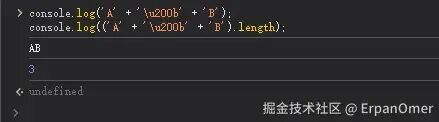
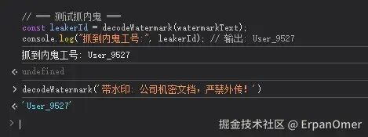

# 如何用隐形字符给公司内部文档加盲水印?(抓内鬼神器)

点击上方 程序员成长指北，关注公众号

回复1，加入高级Node交流群

大家好😁。

上个月，我们公司的内部敏感文档（PRD）截图，竟然出现在了竞品的群里。

老板大发雷霆，要求技术部彻查：到底是谁泄露出去的？😠

但问题是，文档是纯文本的，截图上也没有任何显式的水印（那种写着员工名字的大黑字，太丑了，产品经理也不让加）。

怎么查？

这时候，我默默地打开了我的VS Code，给老板演示了一个**技巧**：

**老板，其实泄露的那段文字里，藏着那个人的工号，只是你肉眼看不见。**

今天，我就来揭秘这个技术——**基于零宽字符（Zero Width Characters）的盲水印技术**。学会这招，你也能给你的页面加上隐形追踪器。

#### **先科普一下，什么叫零宽字符？**

在Unicode字符集中，有一类神奇的字符。它们存在，但**不占用任何宽度**，也**不显示任何像素**。

简单说，它们是**隐形**的。

最常见的几个：

- `\u200b` (Zero Width Space)：零宽空格
- `\u200c` (Zero Width Non-Joiner)：零宽非连字符
- `\u200d` (Zero Width Joiner)：零宽连字符

我们可以在Chrome控制台里试一下：

```
console.log('A' + '\u200b' + 'B');
// 输出: "AB"
// 看起来和普通的 "AB" 一模一样
```
但是，如果我们检查它的长度：

```
console.log(('A' + '\u200b' + 'B').length);
// 输出: 3
```
看到没？😁



image.png

#### **它的原理是什么？**

原理非常简单，就是利用这些隐形字符，把用户的信息（比如工号`User_9527`），编码进一段正常的文本里。

**步骤如下：**

1. **准备密码本** ：我们选两个零宽字符，代表二进制的 `0` 和 `1`。
  
  ```
  *   `\u200b` 代表 `0`
  ```

- `\u200c` 代表 `1`
- 再用 `\u200d` 作为分割符。
3. **加密（编码）** ：
  
  ```
  *   把工号字符串（如 9527）转成二进制。
  ```

- 把二进制里的 0/1 替换成对应的零宽字符。
- 把这串隐形字符串，插入到文档的文字中间。
5. **解密（解码）** ：
  
  ```
  *   拿到泄露的文本，提取出里面的零宽字符。
  ```

- 把零宽字符还原成 0/1。
- 把二进制转回字符串，锁定👉这个内鬼。

是不是很神奇？🤣

---

#### **只需要30行代码实现抓内鬼工具**

不废话，直接上代码。你可以直接复制到控制台运行。

**加密函数 (Inject Watermark)**

```
// 零宽字符字典
const zeroWidthMap = {
'0': '\u200b', // Zero Width Space
'1': '\u200c', // Zero Width Non-Joiner
};

function textToBinary(text) {
return text.split('').map(char =>
    char.charCodeAt(0).toString(2).padStart(8, '0') // 转成8位二进制
  ).join('');
}

function encodeWatermark(text, secret) {
const binary = textToBinary(secret);
const hiddenStr = binary.split('').map(b => zeroWidthMap[b]).join('');

// 将隐形字符，插入到文本的第一个字符后面
// 你也可以随机分散插入，更难被发现
return text.slice(0, 1) + hiddenStr + text.slice(1);
}

// === 测试 ===
const originalText = "公司机密文档，严禁外传！";
const userWorkId = "User_9527";

const watermarkText = encodeWatermark(originalText, userWorkId);

console.log("原文:", originalText);
console.log("带水印:", watermarkText);
console.log("肉眼看得出区别吗？", originalText === watermarkText); // false
console.log("长度对比:", originalText.length, watermarkText.length); 
```
当你把 `watermarkText` 复制到微信、飞书或者任何地方，那串隐形字符都会**跟着一起被复制过去**。

**解密函数的实现**

现在，假设我们拿到了泄露出去的这段文字，怎么还原出是谁干的？

```
// 反向字典
const binaryMap = {
'\u200b': '0',
'\u200c': '1',
};

function decodeWatermark(text) {
// 1. 提取所有零宽字符
const hiddenChars = text.match(/[\u200b\u200c]/g);
if (!hiddenChars) return'未发现水印';

// 2. 转回二进制字符串
const binaryStr = hiddenChars.map(c => binaryMap[c]).join('');

// 3. 二进制转文本
let result = '';
for (let i = 0; i < binaryStr.length; i += 8) {
    const byte = binaryStr.slice(i, i + 8);
    result += String.fromCharCode(parseInt(byte, 2));
  }

return result;
}

// === 测试抓内鬼 ===
const leakerId = decodeWatermark(watermarkText);
console.log("抓到内鬼工号:", leakerId); // 输出: User_9527

```
微信或者飞书 复制出来的文案 👇



image.png

#### **这种水印能被清除吗？**

当然可以，但前提是**你知道它的存在**。

对于不懂技术的普通员工，他们复制粘贴文字时，根本不会意识到自己已经暴露了🤔

如果遇到了懂技术的内鬼，他可能会：

1. **手动重打一遍文字**：这样水印肯定就丢了（但这成本太高）🤷‍♂️
2. **用脚本过滤**：如果他知道你用了零宽字符，写个正则 `text.replace(/[\u200b-\u200f]/g, '')` 就能清除。

虽然它不是万能的，但它是一种极低成本、极高隐蔽性的防御手段。

技术本身就没什么善恶。

我分享这个技术，不是为了让你去监控谁，而是希望大家多掌握一种**防御性编程**的一个思路。

在Web开发中，除了明面上的UI和交互，还有很多像零宽字符这样隐秘的角落，藏着一些技巧。

下次如果面试官问你：**除了显式的水印，你还有什么办法保护页面内容？**

你可以自信地抛出这个方案，绝对能震住全场😁。


> 作者：ErpanOmer
> 
> 链接：  
> 
> https://juejin.cn/post/7578402574653112372

  

  

Node 社群
