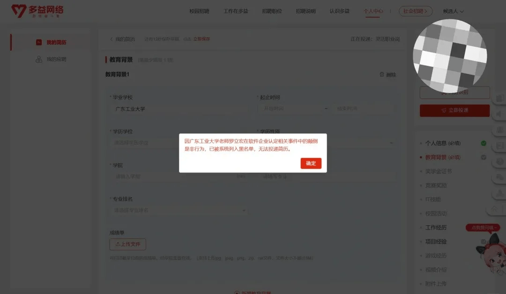
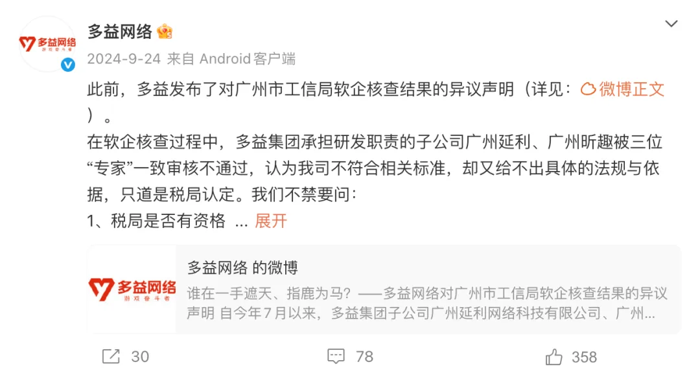
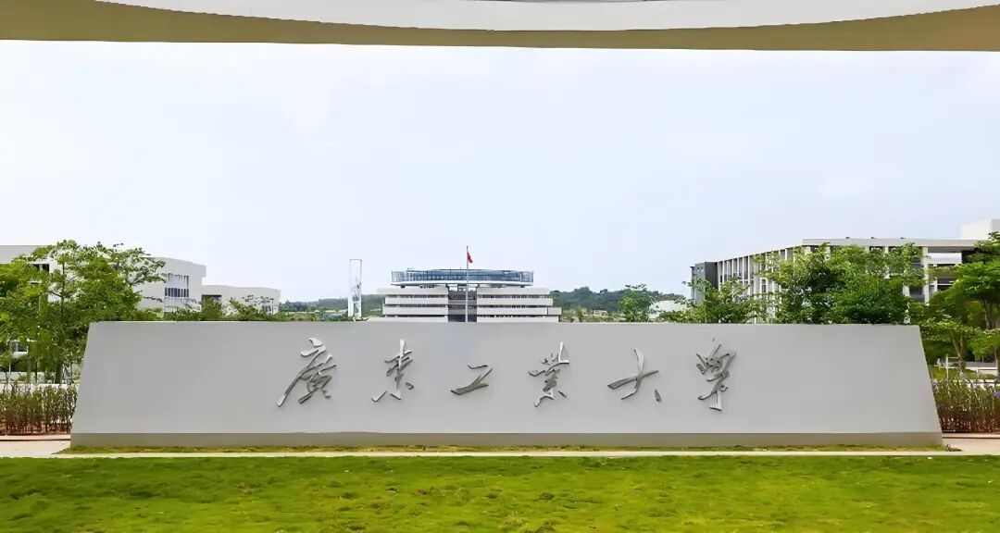

# 反击！多益网络“封杀”全校毕业生！并吐槽“颠倒是非”

近日，广东工业大学一名应届毕业生在小红书发文爆料，称其向广州多益网络招聘官网投递简历时，遭到系统直接拦截。弹窗提示内容明确指出：“**因广东工业大学老师罗立宏在软件企业认定相关事件中的颠倒是非行为，已被系统列入黑名单，无法投递简历。**”

这一冲突的根源，实则是多益网络旗下子公司此前参与企业资质审查时，未通过专家组审核，而广东工业大学的罗立宏教授正是评审专家之一。

公开信息显示，多益网络已就此事在官方微博发布声明，标题为《**谁在一手遮天、指鹿为马？——多益网络对广州市工信局软企核查结果的异议声明**》。

声明中提及，今年7月起，在广州市工信局组织的“软件产业企业”核查工作中，多益网络旗下负责研发业务的两家子公司——广州延利与广州昕趣，被包括罗立宏教授在内的三位评审专家一致判定为“核查不通过”。

此后，多益网络先后提交异议申请与申诉，但最终结果均为“维持原核查意见不变，核查不通过”。该公司表示，依据《软件企业认定管理办法》及工信部等四部门2021年第10号公告等相关规定，旗下子公司完全符合“国家鼓励的软件企业”标准，依法可享受对应软件企业税收优惠政策。

对此结果，多益网络反应强烈，在声明中接连质疑税务部门的决定权及评审专家的专业性，甚至直言：“**我们不清楚究竟是什么力量，能让身为人民教师的你，做出抛弃社会责任、违背法规标准的事情。**”

### 广东工业大学罗立宏教授正面回应

1月7日晚间，有媒体联系到罗立宏教授并获得正面回应。罗教授表示，自己与多益网络的交集仅停留在两三年前一次政府中小企业扶持项目的评分审查工作中，同时回忆了两个关键细节。

其一为材料问题：“我当时也是第一次听说这家公司，他们提交的材料准备得并不完善。”其二为评审决策机制：罗教授澄清当时共有五位专家参与评审（并非多益声明中所说的三位），且“五位专家一致给出了较低分数”。

罗教授强调，专家的职责仅为依据提交材料打分，无法左右最终核查结果。对于多益网络因此事迁怒全校学生的做法，他直言无奈又困惑：“**针对一名老师的不满，却把怨气发泄到全体学生身上，这种做法实在过分。**”

### 广东工业大学

广东工业大学早在 2019 年便被美国纳入实体制裁清单。该清单中的中国高校多为 985、211 院校，广东工业大学作为唯一一所“双非”院校入选，足见其在国内外的认可度与影响力。

此外，该校在广东省内的认可度极高，应届生就业竞争力强劲。尤其在互联网、机械制造、人工智能等领域，其毕业生口碑出众，深受企业青睐。

## 结语

我是林三心，一个待过**小型toG型外包公司、大型外包公司、小公司、潜力型创业公司、大公司**的作死型前端选手

我建了一些**前端学习群**，如果大家想进群交流前端知识，可以关注我，回复**加群**

