# 【第3651期】vivo互联网全链路多版本环境落地实践

前言

介绍了 vivo 在软件研发过程中为解决环境问题而提出的 “全链路多版本环境管理” 模式，通过环境编排、弹性资源和流量隔离等关键技术，实现了开发测试环境的快速构建与高效管理，显著提升了研发效能，并对未来规划进行了展望。今日前端早读课文章由 @Wu Qinghua 分享，公号：vivo 互联网技术授权分享。

正文从这开始～～

在软件研发过程中，“环境问题” 是制约研发效能的关键瓶颈之一。环境不稳定、测试环境混乱、环境抢占严重等问题，显著影响开发与测试效率。本文系统介绍 vivo 通过 “全链路多版本环境管理” 模式，实现开发测试环境的快速构建与高效管理，使多版本环境能够像 “平行宇宙” 一般，实现安全、隔离、高效的并行测试与发布。

[【第3508期】FunProxy - 使用 Rust 构建跨平台全链路测试抓包代理工具](https://mp.weixin.qq.com/s?__biz=MjM5MTA1MjAxMQ==&mid=2651276415&idx=1&sn=cb9e09054ffb312debb0041744653b0c&scene=21#wechat_redirect)

#### 一、背景 & 问题

##### 1.1 我们遇到的问题

在软件研发过程中，环境问题常常成为关键路径上的阻塞点。2020 年 vivo 某核心业务数据显示，因测试环境问题导致的转测延期占比高达 67%，策划验收阶段因环境问题导致的延期超过 10 次。

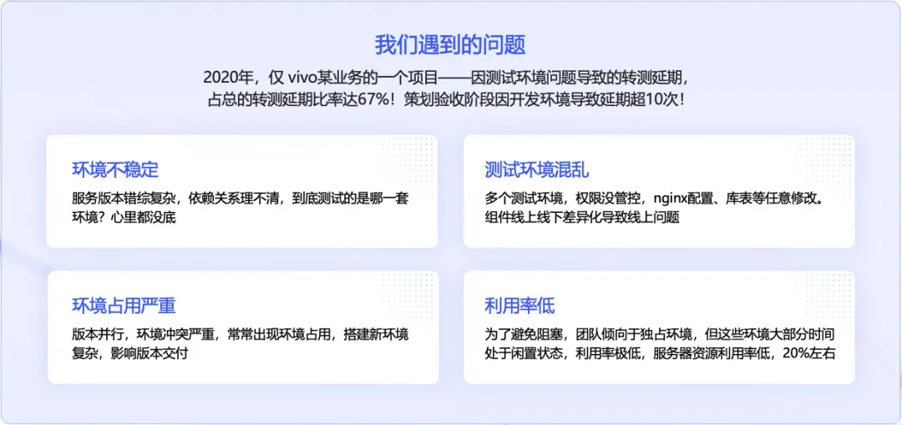

这些数据背后，反映的是研发过程中常见的典型场景：

- 场景一：急需联调时，依赖服务异常，导致研发阻塞；
- 场景二：准备测试时，环境被其他版本占用，需求排期被迫延后；
- 场景三：环境配置差异导致线上 Bug 漏测，引发更多问题。

深入分析该业务场景后，我们发现环境问题主要集中在以下几个方面：环境不稳定、测试环境混乱、环境抢占严重、资源利用率低下。这些问题并非单一项目特有，在微服务架构和快速迭代模式下，已成为多个团队共同面临的挑战。

[【第2439期】一键配置开发环境——前端环境管理工具 AppToolkit 正式发布](https://mp.weixin.qq.com/s?__biz=MjM5MTA1MjAxMQ==&mid=2651250161&idx=1&sn=fa83a17dfe6dc0394d282b3aebe76969&scene=21#wechat_redirect)

##### 1.2 问题的挑战

随着 vivo 互联网业务的快速发展，为满足更快发布需求，我们全面转向微服务架构。这一转变在提升灵活性与敏捷性的同时，也带来了新的管理挑战。

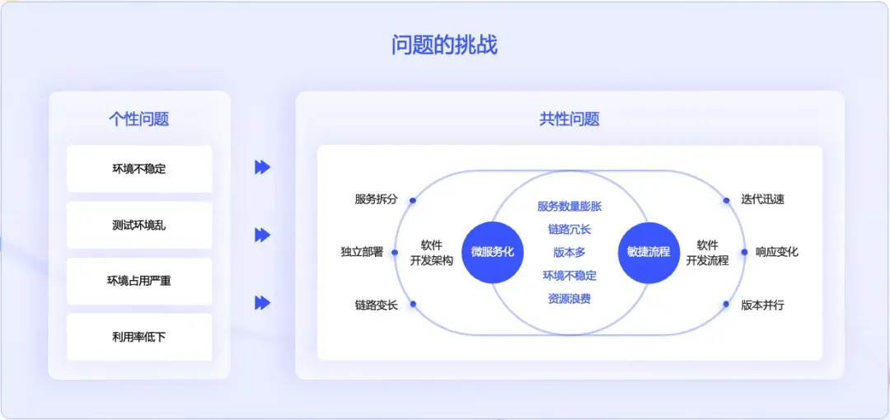

挑战主要来自两个维度：

- 架构层面：服务拆分导致服务数量激增，各服务需独立部署维护，系统调用链路显著延长，任一环节故障都可能导致整体功能不可用。
- 流程层面：业务快速迭代需求推动多版本并行推进，如版本 A 测试、版本 B 功能开发、版本 C 线上热修复等同步进行。

这些变化叠加，使得研发环境管理复杂度大幅提升，环境稳定性下降、资源浪费严重，最终导致整体研发效率受损。

传统环境管理方式已难以满足当前需求，亟需一种创新方法，实现多版本像 “平行宇宙” 一样安全、隔离、高效地并行测试与发布。

#### 二、解决方案思路

##### 2.1 什么叫全链路多版本环境管理

为解决环境管理难题，我们提出了 “全链路多版本环境管理” 理念，其核心基于三大关键能力：

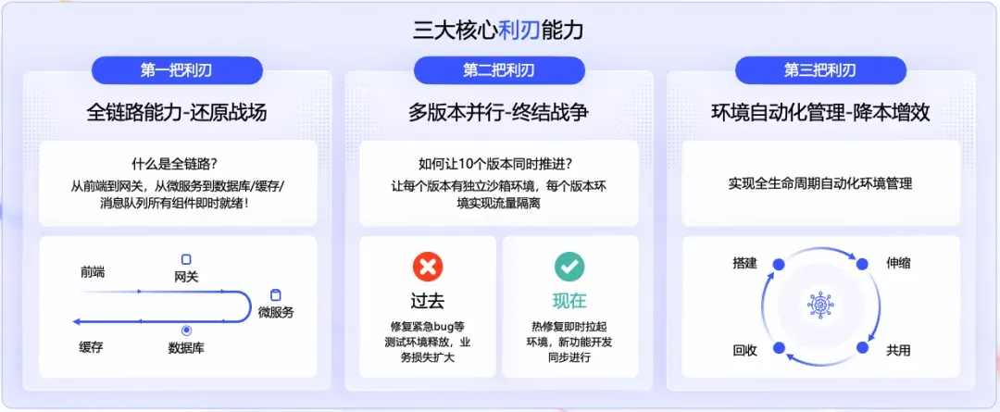

**1\. 全链路能力**

单一服务版本环境不足以保证整体功能验证。必须确保版本依赖的所有组件 —— 从前端、网关到微服务，再到数据库、缓存和消息队列 —— 整条链路能够一键拉起、快速就绪。以支付业务调试为例，无需手动启动账户、风控、结算等服务，通过一键操作即可分钟级生成完整环境，数据流、配置流与生产环境保持一致。

**2\. 多版本并行**

支持同时创建多个 “完整环境”，使各版本在独立 “沙箱” 中运行，彻底解决资源抢占问题。热修复版本可分钟级拉起独立环境，新功能开发同步进行，实现 “分钟级响应，零等待协作”。

**3\. 环境自动化管理**

通过全生命周期自动化 —— 从环境搭建、弹性伸缩到闲置回收，减少人工干预，降低错误率，提升资源利用效率，实现降本增效。

基于这三项核心能力，线上问题或紧急需求出现时，我们可在几分钟内创建独立环境进行验证，且不影响其他版本进程。

[【早阅】生产环境中的氛围编码](https://mp.weixin.qq.com/s?__biz=MjM5MTA1MjAxMQ==&mid=2651277153&idx=2&sn=82b1216add3cffea33c83b4fa221abcb&scene=21#wechat_redirect)

##### 2.2 业务目标示意图

理解全链路多版本环境管理理念后，我们的核心解决思路也从传统的 “环境隔离” 转向 “流量隔离” 模式。

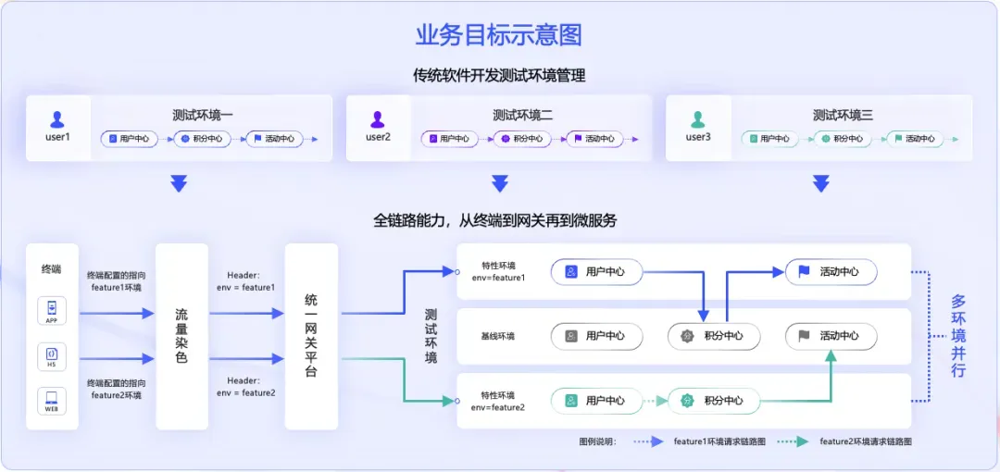

传统方式为每个版本构建完整独立的测试环境，如同各自独立的烟囱。此方式隔离性好，但资源浪费严重，环境数量有限，扩展性差。

全链路多版本环境管理方案则采用不同策略：首先维护稳定可靠的公用基线环境。当某版本需开发新功能时，无需从头搭建整套环境，仅需为实际发生变更的服务创建独立的 “特性环境”。

关键问题在于如何实现流量的精准路由。答案在于流量统一网关平台，该系统在流量入口识别每个请求的环境标签，根据标签将请求路由至对应版本的服务实例。

未改动服务继续共享稳定基线环境，发生变更的服务则拥有独立环境 —— 通过流量精准调度，既保证隔离性，又显著节约资源与成本。

这一模式类似于单栋大楼内通过不同颜色手环区分访问区域，整栋楼共享基础设施，但各区域活动互不干扰。流量统一网关平台充当 “智能前台”，负责识别 “手环”、调度流量，使多版本并行开发井然有序。

“逻辑隔离” 相较于 “物理隔离” 展现出显著优势：更弹性、更经济、更高效。

[【第3195期】京东：亿级流量高并发春晚互动前端技术揭秘](https://mp.weixin.qq.com/s?__biz=MjM5MTA1MjAxMQ==&mid=2651269228&idx=1&sn=4e8b3aa51c68352a45f1e8da32c9d733&scene=21#wechat_redirect)

##### 2.3 全链路多版本业务架构图

基于上述思路，我们构建了完整的技术架构，清晰展示系统核心组件及协同工作机制。

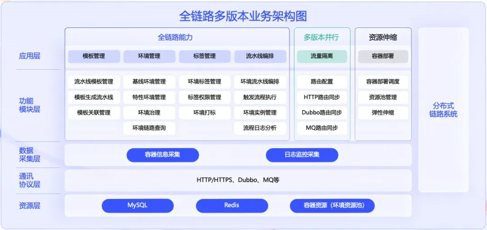

全链路多版本环境的核心能力可归纳为四个关键部分：环境编排、流量隔离、容器部署与分布式链路系统。

**环境编排：**负责组织软件从开发到部署各环节，确保每次代码变更快速部署至指定环境。在多版本环境中，编排系统自动识别不同版本，触发对应构建部署流程，保证各版本独立高效就绪。

**流量隔离：**实现多版本并行的关键。通过灵活路由策略，精确控制各版本流量走向。无论是 HTTP 请求、Dubbo 调用还是 MQ 消息，均能在各自服务实例间有序流转、互不干扰，如同智能交通系统确保不同 “车流” 各行其道。

**容器部署：**为环境提供轻量、标准化封装方式，各服务及其依赖打包为独立镜像。借助容器技术，实现应用秒级启动与弹性伸缩。多版本场景下，各版本可快速拉起自身实例组，极大提升资源利用率与发布效率。

**分布式链路系统：**架构的 “可观测性” 基础，实时追踪记录请求在微服务间的完整流动路径并传递环境标签。当请求进入系统，经多服务处理时，该系统完整记录其 “足迹”—— 包括经过服务、携带标签、是否异常，为问题排查与性能优化提供关键支撑。

接下来，我们将深入解析全链路多版本环境背后的三大关键技术实现。

#### 三、关键技术实现

从实现视角聚焦，核心技术主要包括：

- 环境编排 - 负责指挥与创造
- 资源弹性 - 负责支撑与供给
- 流量隔离 - 负责识别与路由

三大技术形成有机整体，紧密协作，缺一不可。

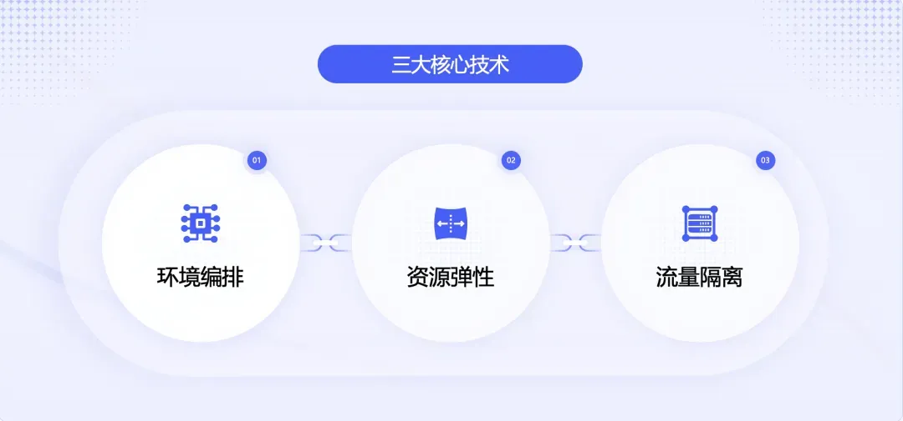

##### 3.1 环境编排

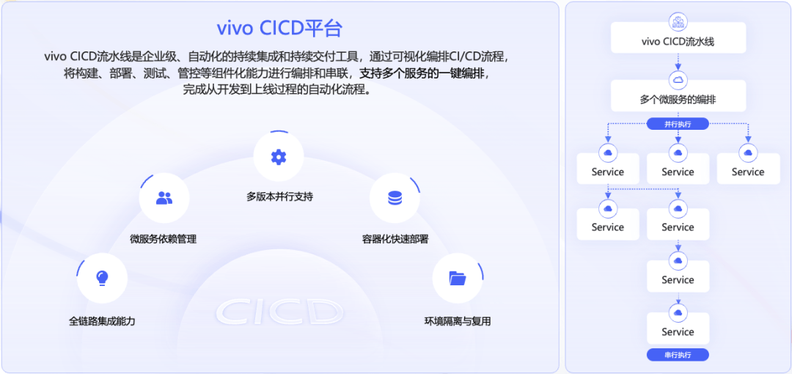

实现多版本并行的第一步是高效、标准化地 “创建环境”。

这主要由 CI/CD 平台支撑，它不仅是自动化工具，更是强大的可视化环境编排器。开发人员在界面定义待部署服务，系统自动识别服务间依赖关系，判断哪些可并行部署、哪些需串行执行，最终实现 “一键完成” 环境编排。

[【第2329期】理解CI和CD之间的区别](https://mp.weixin.qq.com/s?__biz=MjM5MTA1MjAxMQ==&mid=2651247580&idx=2&sn=913c0ea96ced004382514b55eb90e1a1&scene=21#wechat_redirect)

优势显而易见：无论是全新版本环境搭建，还是单一服务更新，均可通过单次点击，在分钟级别快速完成，使 “秒级拉起独立完整环境” 成为研发流程常态。

具体而言，CI/CD 平台在全链路多版本中提供两方面关键支撑：

- 全链路能力支持：实现代码提交到自动化验证的端到端集成，确保各环境配置一致，大幅减少环境差异问题。同时精细管理微服务间依赖，支持串并行混合执行，使复杂部署流程井然有序。
- 多版本并行支持：平台根据代码分支自动触发独立构建部署流程，为各版本创建隔离环境、添加环境标签，实现环境高效复用与隔离。底层对接强大容器化平台，为环境快速启动提供技术保障。

CI/CD 平台作为多版本环境体系的 “指挥中心”，高效调度四大核心组件 —— 为容器部署提供调度依据，为流量隔离准备环境标签，使分布式链路系统充分发挥跟踪与观测能力。

##### 3.2 弹性资源

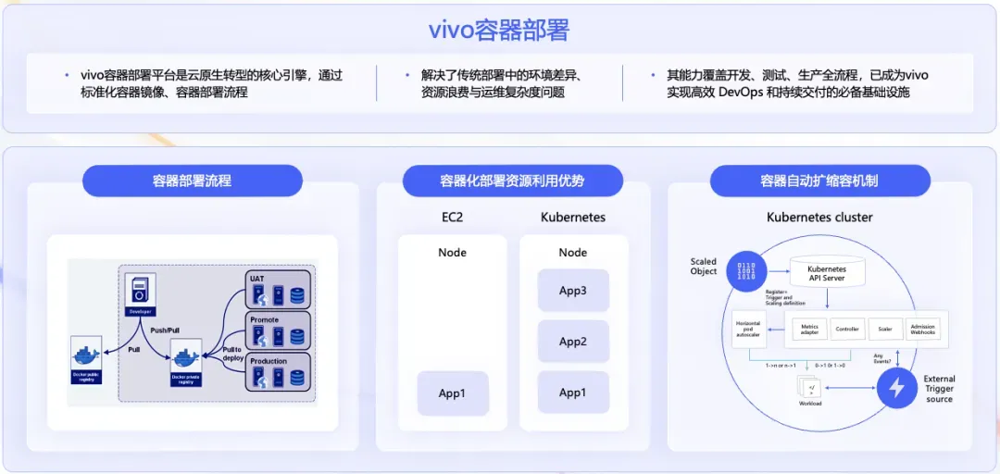

指令发出后，需要强健的 “执行体” 高效落实。vivo 容器化平台正是这一强大、可靠的实体。

弹性资源能力由容器化平台核心支撑。全链路多版本环境中，我们能够轻松、快速创建大量隔离环境，背后依赖的正是容器技术。

容器化工作原理简述：开发者将应用及其所有依赖打包为标准容器镜像。该镜像可在任何支持容器的环境中运行，确保开发、测试、预发和生产环境高度一致，真正实现 “一次构建，随处运行”，从根源解决环境差异问题。

资源利用率方面，容器技术优势明显。传统虚拟机部署中，单节点通常仅运行单一应用，资源利用率低。容器化部署允许多个容器共享节点操作系统内核，轻量高效。对多版本环境管理而言，这意味着可低成本、高效率创建大量隔离环境。以往需 10 台服务器支撑的多版本测试，现仅需 3-4 台，成本显著降低。

此外，容器平台具备自动扩缩容能力，这在多版本场景中尤为重要：特性环境压力测试时，系统自动扩容保障稳定性；测试结束环境闲置时，资源自动缩容回收，真正实现按需使用、高效节能。

容器化带来三大核心价值：环境标准化、资源高效化与伸缩自动化。这些能力组合使我们能够轻松维护多版本并行研发，加速产品迭代，提高系统稳定性，同时显著降低成本。

对业务团队而言，这意味着更快功能交付、更稳定系统运行与更高资源利用率。这是全链路多版本环境支撑大量环境并行而无需担忧资源成本激增的根本原因。

##### 3.3 流量隔离 & 流量染色

环境与资源就绪后，确保流量 “对号入座” 是实现隔离性的关键。这引出两个核心概念：“流量隔离” 与 “流量染色”。

**3.3.1 流量隔离和流量染色的定义**

流量隔离指由统一流量网关平台维护智能路由表，记录 “环境标签” 与 “服务实例地址” 间映射关系。

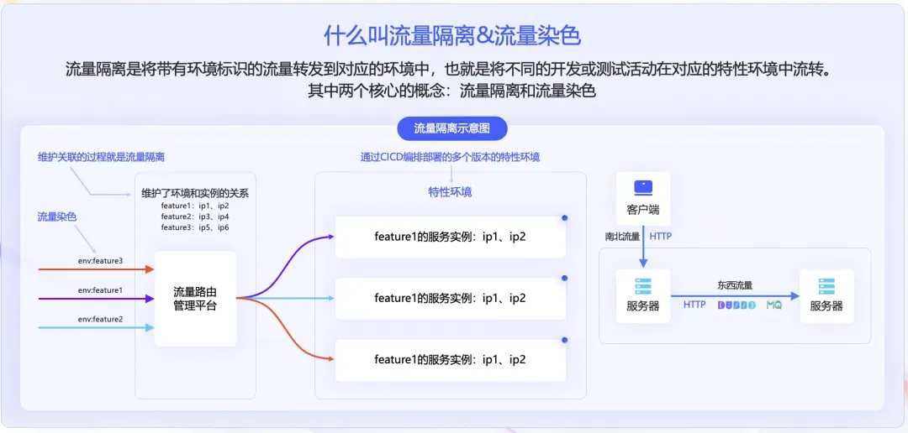

如图示：Feature1 环境流量仅路由至 IP1、IP2 实例；Feature2 流量指向 IP3、IP4 实例，实现真正互不干扰。

流量染色如同为每批流量分配 “颜色标识”。请求进入网关前，为其添加明确环境标识，声明 “属于 Feature1” 或 “属于 Feature2”。网关据此正确识别与路由。

理解流量隔离与染色后，需将其应用于真实网络环境。微服务架构下，流量基本分为两类：南北流量与东西流量。

图示说明：

- 南北流量：外部客户端与服务器间流量，即 “进出数据中心流量”；
- 东西流量：数据中心内部服务器间流量，即微服务间调用。

在 vivo 实践中：

- HTTP 流量由 vivo 统一访问平台处理；
- Dubbo 流量由 Dubbo 服务治理平台负责；
- MQ 消息通过 MQ 消息网关平台路由。

**3.3.2 流量隔离实现**

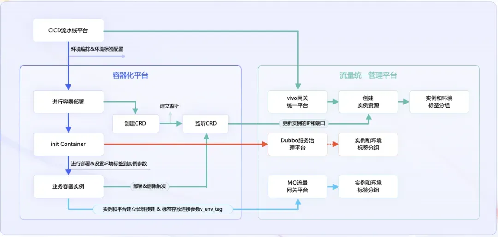

**1.HTTP 流量隔离**

过程如图绿色路径所示。始于环境编排阶段：通过流水线部署服务时，为各实例注入唯一环境标签。同时，vivo 统一访问平台建立 “环境标签” 与后端服务实例组（Upstream）的绑定关系，触发创建相应 CRD 并实施监听。

[【第3631期】No-Vary-Search：用一个新 HTTP 头拯救你的缓存性能！](https://mp.weixin.qq.com/s?__biz=MjM5MTA1MjAxMQ==&mid=2651278239&idx=1&sn=713d01d28d51c2f060ac516ddd8556f8&scene=21#wechat_redirect)

此后，无论是部署、实例扩容、缩容还是重启，只要实例 IP 和端口变化，变更都会被实时监听并动态更新至网关路由规则，形成高效自动化闭环，确保每个带环境标签的 HTTP 请求被网关精准路由至正确特性环境实例。

**2.DUBBO 协议隔离**

借助 Dubbo 官方原生标签路由能力实现。原理直观：将服务实例动态划分至不同逻辑分组，约束带特定标签流量仅能访问指定分组。vivo 实践中，打标动作发生于部署环节。容器启动时，Init Container 自动调用 Dubbo 服务治理平台，通过动态规则配置，无感地为当前服务实例添加环境标签。整个过程无需重启服务，配置实时生效，完美支持全链路多版本对灵活性与实时性要求。

**3\. 消息队列（MQ）隔离**

与前两者不同，MQ 组件本身缺乏完善隔离机制。我们基于 MQ 消息网关平台 mq-proxy 组件实现。

实现方式巧妙：生产者与消费者启动并与 mq-proxy 建立连接时，在连接属性中携带自身环境标签。消息生产时，mq-proxy 拦截消息，将环境标签写入消息 user-property 中。消费时，mq-proxy 根据消息中标签与消费者自身环境标签进行匹配过滤，确保消息不会被跨环境消费。整个过程对业务代码完全透明，实现无侵入隔离。

**3.3.3 流量染色实现**

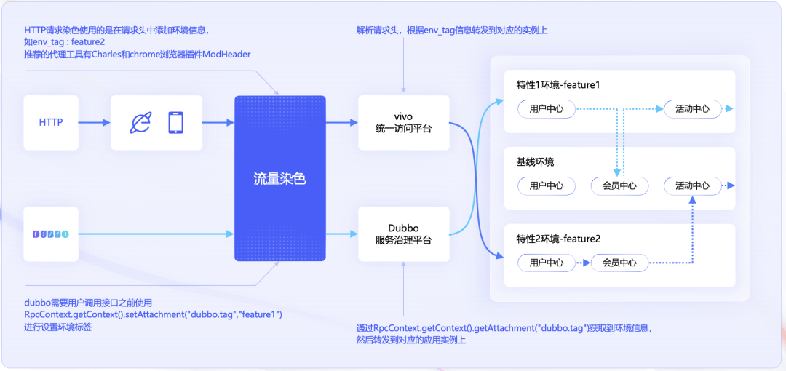

南北流量染色：客户端至服务器端流量染色实现方式如下。

- HTTP 请求：在请求头中添加环境信息，推荐使用 ModHeader 等浏览器插件，便捷地在请求头中添加 env\_tag=feature1 等信息。
- Dubbo 调用：将环境标签置于 Attachment 中，提供简洁 API，开发者只需在发起调用前，通过 RpcContext.setAttachment ("dubbo.tag","feature1") 代码即可设置环境标签，对业务代码侵入性极低。
- MQ 流量染色：对业务方完全透明，由前述 mq-proxy 组件自动完成，业务代码无感知。

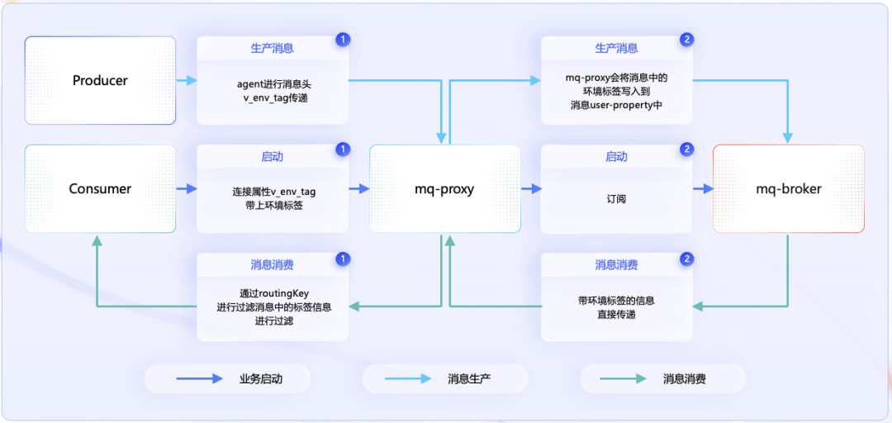

具体实现：生产者与消费者启动时，与 mq-proxy 建立连接，使用连接属性 v-env-tag 存放环境标签，即图示中间启动部分。消息生产消费环节中，生产者生产消息时，mq-proxy 拦截消息，将环境标签写入消息 user-property 中。

消息消费端，mq-proxy 拉取消息时，获取消息中环境标签信息并进行过滤，推送至对应环境服务实例，确保仅消费属于当前环境的消息。通过此机制，保证消息在整个生命周期携带环境标识，实现 MQ 流量染色。

##### 3.3.4 标签的传递

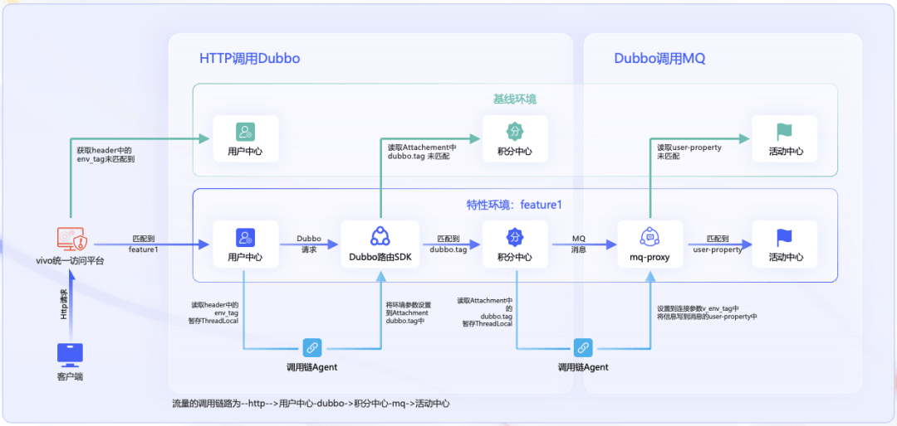

最复杂部分在于环境标签在整条调用链中自动传递。通过 vivo 分布式链路系统实现，核心技术为 javaagent，通过调用链 Agent 透明完成此项 “接力” 工作。

示例如下：来自客户端的 HTTP 请求携带 env\_tag=feature1，网关将其路由至 feature1 环境的用户中心。用户中心需调用积分中心时，调用链 Agent 拦截此次 Dubbo 调用，从 HTTP 请求头中获取 env\_tag，并注入 Dubbo 调用的 Attachment 中，积分中心因此收到该标签。积分中心处理完毕，需发送 MQ 消息通知活动中心。此时 Agent 再次拦截，从 Dubbo Attachment 中获取标签，写入 MQ 消息属性。最终，仅标注 feature1 的活动中心实例消费此消息。整条链路中，如有环节未匹配环境标签，流量则回退至基线环境。

如此，环境标签在 HTTP→Dubbo→MQ 完整链路中自动传递，确保全链路环境隔离，真正实现 “一次染色，全程生效”。

回顾关键技术部分：环境编排是指挥中心，负责调度与创造；弹性资源是执行实体，负责支撑与运行；流量隔离与染色是传导系统，负责精准识别与路由。三者有机结合，构成全链路多版本环境管理的稳固架构，缺一不可。

#### 四、业务实践与效果

全链路多版本环境落地实践后，成效显著：

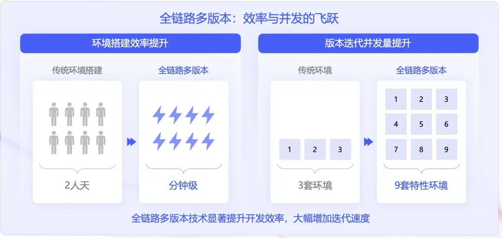

- 环境搭建效率提升：从过去多团队沟通、手动配置、平均耗时 2 人天，转变为开发者一键触发、分钟级自动完成。
- 版本并发能力增强：以往受资源限制，仅支持 2-3 个版本串行测试；现可轻松支持 9 个以上特性环境并行开发测试。

这不仅带来效率提升，更实现研发节奏全面加速与业务响应能力质的飞跃。

#### 五、未来规划

展望未来，我们对全链路多版本环境管理有清晰规划。这不仅是技术升级，更是研发管理理念的演进。

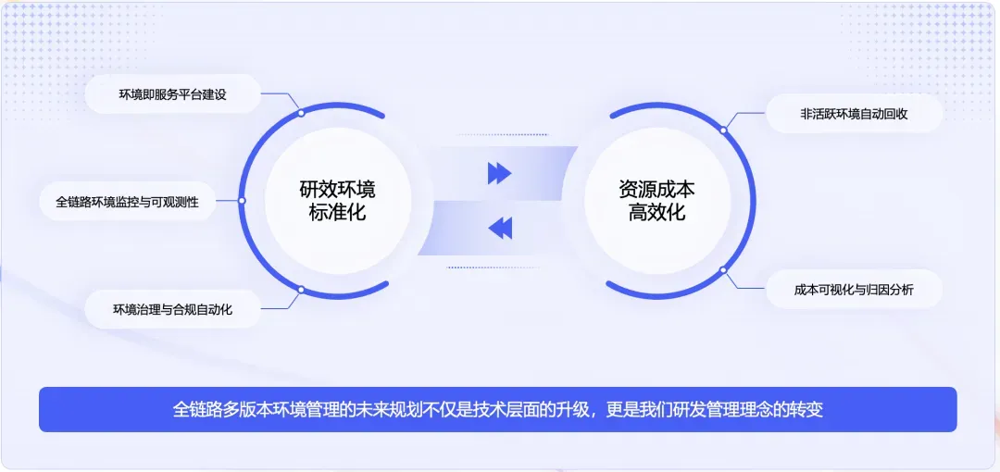

未来规划采用双轨并行策略，从研发效能环境标准化与资源成本高效化两个维度同步推进。两方向相互促进、协同支撑。

##### 5.1 研发效能环境标准化

在已实现的环境编排、资源弹性与流量隔离基础上，重点推进三项关键措施：

**1\. 构建环境即服务平台**

平台提供标准化环境模板，包括不同规模测试环境及各类专用环境（如性能测试、安全测试等）。通过模板化方式，确保环境一致性与标准化，同时大幅提升环境创建效率。

平台集成环境全生命周期管理功能，从环境申请、审批、创建、使用、监控到回收，形成完整闭环管理。这不仅提升管理效率，更建立完善的环境治理体系。

**2\. 建立全链路环境监控与可观测体系**

监控体系涵盖多层：基础设施层监控 CPU、内存、存储等资源使用；中间件层监控数据库、消息队列、缓存等组件性能；应用层监控服务响应时间、错误率、吞吐量等关键指标。

通过分层监控，快速识别环境中异常情况，及时发觉性能瓶颈，为环境优化提供数据支撑。监控数据同时为资源调度与成本优化提供重要决策依据。

**3\. 建立环境治理与合规自动化机制**

治理机制包括环境命名规范、资源配置标准、安全配置要求、数据保护规则等多方面。通过自动化合规检查工具，实时监控环境合规状态，自动发现与修复不合规配置。

机制还包括环境定期审计功能，自动生成合规报告，为管理决策提供支撑。通过此方式，既确保环境安全合规，又减少人工审计工作量。

##### 5.2 资源成本高效化

资源成本高效化方面，推进以下两项关键措施：

**1\. 非活跃环境自动回收**

针对非活跃环境，建立智能自动回收机制。系统自动识别长期未使用环境，在确保数据安全前提下，自动进行资源回收。

机制包含多层管理：

- 测试环境非工作时间自动休眠；
- 开发环境连续 7 天未使用发出提醒；
- 连续 14 天未使用自动回收。

通过分层管理，既保证开发效率，又有效控制成本。

**2\. 成本可视化与归因分析**

成本分析从多维度展开：

- 按项目维度分析各项目资源使用成本；
- 按团队维度分析各团队成本构成；
- 按环境类型维度分析不同环境成本效益；
- 按时间维度分析成本变化趋势等。

通过精确成本统计与分析，为成本优化提供数据支撑。

通过双轨并行策略，我们实现研发效能提升与资源利用最大化的良性循环。

全链路多版本环境管理的未来规划不仅是技术升级，更是研发管理理念的转变。通过双轨并行策略，我们将建立更高效、经济、可靠的研发环境体系，同时打造更先进的研发环境管理体系。

关于本文  
作者：@Wu Qinghua  
原文：[https://mp.weixin.qq.com/s/3SIam9BInJjmB5fCfFntWA](https://mp.weixin.qq.com/s?__biz=MzI4NjY4MTU5Nw==&mid=2247506012&idx=1&sn=6341c3dfb3d515d174cb0eb8cc90ce2e&scene=21#wechat_redirect)

这期前端早读课  
对你有帮助，帮” 赞 “一下，  
期待下一期，帮” 在看” 一下。
