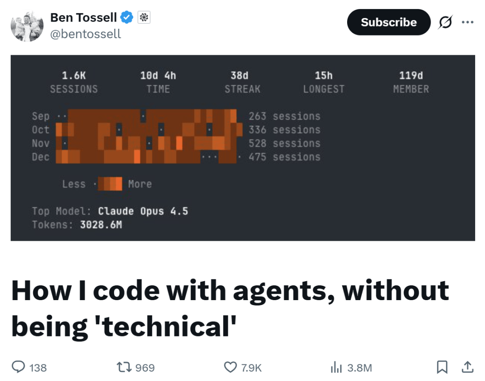

# 全网380万人围观！连代码都不看，4个月“烧掉”30亿Token，不懂编程的他却做出了50+个产品……

转自：CSDN（ID：CSDNnews）

原文链接：https://x.com/bentossell/status/2006352820140749073

要是放在几年前，一个几乎一行代码都写不出来的人，能在短短四个月内交付几十个真实可用的软件项目，这听起来简直是“天方夜谭”——但在 AI Agent 时代，这正在成为现实。

Ben Tossell，Factory 开发者关系主管、前 No-Code 创业者，在最近的一次推文中表示：过去 4 个月，他通过终端与 AI Agent 协作，累计消耗了约 30 亿个 token，完成了数十个真实项目的开发与上线。

这篇推文吸引了诸多网友的注意，目前浏览量已高达 380 万，点赞人数也超过 7900 人。

“有人管我叫 Vibe-Coder（氛围编码者），但这个词忽略了一个事实：这还是需要一定技术含量的。”而 Ben Tossell 坦言，他从不读代码，只是会非常认真地看 AI Agent 的输出。

在这个过程中，他逐渐摸清了代码的运行逻辑、项目的搭建流程，也搞懂了程序容易在哪栽跟头、又能在哪出彩：  

“这，就是我们这一代人的‘编程学习之路’。”

  

四个月里，他到底做了些什么？

别以为他是“摸鱼式编程”，过去几个月，Ben Tossell 用 AI Agent 交出的成绩单相当扎实，覆盖个人、工作、技术探索等多个场景，随便拎几个出来都很能打：

- 个人网站重构：把个人网站改成了终端命令行的样式，效果比今年年初那次尝试好太多了。
- Feed 聚合器：开发了一个轻量工具，专门追踪 X 上对 Factory 的提及、Reddit 社区帖子和 GitHub 上的相关议题。这个工具是开源的，已经拿到了 100 多颗星，不少人直接克隆下来自己用。
- Factory Wrapped：做了一个年度总结原型，团队一看就说：要内嵌进正式产品。现在已经上线了，后续还在不断加新指南、调整功能布局。
- 一堆自制 CLI：比如 Pylon CLI，被客服团队直接拿去用了；还有 Token 管理 CLI、Linear CLI、Gmail CLI。
- 加密货币自动交易器：Ben Tossell 投了一家做动态数据预测的公司，便基于这个技术做了一个追踪器，能根据预测结果自动开仓平仓，相当于一个迷你对冲基金。
- 12 天创意实验项目 Droidmas：连续 12 天，每天做一个小实验或小游戏，主题都是 X 上的热点话题 —— 比如记忆管理、上下文控制、VibeCoding这类方向。
- AI 驱动的视频演示系统：只要给一句 prompt，它就会自动打开终端、执行命令、开浏览器、录屏，自带导演+制片+剪辑。他用这个工具做的视频，还被 OpenAI 转发过。
- 基于 Droid Exec 的 Telegram 机器人：把本地代码仓库同步到 VPS，用 Telegram 直接“聊天式操作代码仓库”。

除此之外，Ben Tossell 还有大概 50 个小项目要么没公开，要么中途搁置了——毕竟探索过程中，也不是每个想法都能成功落地。

  

工作方式的核心：全程只用 CLI

能做出这么多项目，Ben Tossell 的核心秘诀是：全程只用命令行界面（CLI），从来不用网页界面。

“对 AI Agent 来说，终端的能力上限更高，而且我能直观看到它的工作过程。”

他的工作流程很简单：

（1）需求梳理：想到一个点子，或者遇到某个难点，觉得可以用代码解决，就用 Factory 的 CLI 工具 Droid 新建一个项目。

（2）上下文投喂：先和模型聊几句，把要做的事讲清楚，然后切换到 “需求规格模式”，和模型一起敲定开发计划。

（3）细节追问：这个阶段他会刨根问底，例如这个功能是啥原理？为什么选 A 方案不选 B？能不能换个更简单的实现方式？同时还会把相关文档和 GitHub 仓库链接丢给模型参考。

（4）放手让 AI 去干：把 Opus 4.5 模型的自主权限拉满，让它直接开干。期间他就在旁边盯着运行日志，看进度、看有没有报错，遇到问题就及时介入，要么追问模型，要么引导它换个思路。

（5）测试迭代：启动服务、测试功能、给模型反馈，然后反复迭代优化。

总体而言，Ben Tossell 习惯先动手把东西搭出来，过程中遇到的漏洞和问题反而是学习的最佳机会。比如看到某个问题，他就会琢磨：这个问题是不是其他项目也会遇到？要不要做个模板化的解决方案？能不能把这个经验写到 agents.md 里，让后续所有项目都能复用？

说到 agents.md，其实 Ben Tossell 花了不少时间去打磨，毕竟这相当于 AI Agent 的操作手册。这个文件放在所有项目的 repos 文件夹里，写清楚新建仓库的规则、GitHub 怎么用、用哪个账号这些细节。此外，现在他的所有项目都必做端到端测试，就是为了避免因自己技术水平有限而漏掉低级 Bug。他还常参考别人的 agents.md，捡有用的优化自己的，让开发更顺畅。

为了实现“随时随地编程”，Ben Tossell 还给每个仓库都装了 Droid 的 GitHub 应用，提交 PR 时能让 AI 自动审核、修 Bug；另外结合Telegram机器人，用手机就能写代码、加功能。他还为每个项目建了专属Slack频道，跟 AI Agent 协作起来特别方便，一个人 + 一个 AI 就能组成高效小团队。

  

在这个过程中，他真正学到的东西

跟 AI Agent 协作的过程，也是 Ben Tossell 快速成长的过程。他没刻意学过编程，却慢慢掌握了不少硬核技能：

- Bash 命令行

以前 Ben Tossell 对 Bash 一知半解，直到用它处理了一段时间的更新日志，才突然打通任督二脉——原来这些重复操作背后是有固定工作流的。

后来，他让 Droid 做了一套命令行工具，这也是他第一个真正用起来的工具集：它能自动执行一系列 Bash 命令，还能让模型分析 GitHub 代码差异、检查功能开关状态，把内容分门别类填到更新日志的“新功能”、“Bug 修复”等板块里。

“从那以后，我就彻底迷上了 Bash 和 CLI 工具，再也不用 MCP（模型连接协议）了。”原因很简单：MCP 会占用大量上下文窗口，但其实 Ben Tossell 只需要它里面的少数几个功能。所以不管是 Supabase、Vercel 还是 GitHub，他都优先用 CLI 工具。

- VPS

以前 Ben Tossell 只知道 VPS 是一台 24 小时运行的远程电脑，但直到真正用上才明白它的价值。比如上文提到的那个加密货币追踪器，每分钟都要拉取大量数据，必须保证全天候运行，这时候 VPS 就派上大用场了。他把VPS 和 Telegram 机器人结合起来，用 SyncThing 同步本地仓库和 VPS 的文件，确保两边的代码始终一致，随时随地都能无缝衔接开发。

- 技能模块化复用

他还学会了“技能复用”，比如做了个 Gmail CLI 工具，放在根目录下，所有项目都能调用。现在他用的 Gmail 邮件分类系统，全程都是用这个 CLI 工具驱动的。

除此之外，Ben Tossell 还特别认同 Andrej Karpathy 的一句话：“现在要掌握的是一层全新的可编程抽象层。”

在无代码时代，当时要掌握的抽象层是像 Webflow、Zapier 和 Airtable 这样的拖放工具——将它们拼接在一起，让它感觉像真正的软件；但现在要学的，是怎么跟 AI Agent 代理好好协作——比如怎么写提示词、怎么给足上下文、怎么让 AI 帮自己理解系统原理，这些才是核心。

他还特别爱向专业开发者学习，比如参考 Peter Steinberger 的简洁工作流，发现“不用搞复杂系统也能高效开发”；看到别人过度优化工作流，反而觉得这种开发方式的魅力就是“自定义”：你可以搞复杂的规划模式，也可以像 Peter 那样简单跟模型聊天。他还常克隆其他工程师的开源项目，比如把 Peter 的 YouTube 视频总结工具改成 CLI 版本，自己用着更顺手；受 Mario “优先用 CLI 而非 MCP”的启发，才更深入地钻研 Bash。

  

学习心得很简单：大胆问“傻问题”

Ben Tossell 自知，他做的东西都不是要给几万人用的生产级产品，所以 Bug 满天飞是常态。因此每次遇到问题，他都把它当成填补知识空白的机会，而不是否定自己能力的理由。

他的核心任务就是发现这些知识盲区，然后思考：怎么避免以后再犯同样的错？怎么才能搞懂这个系统模块，下次遇到类似问题能自己排查？

刚开始用 AI Agent 编程的时候，Ben Tossell 最基础的问题都搞不懂：为什么动态数据的多用户应用不能用 GitHub Pages 部署？这对程序员来说是常识，但他是在动手做项目的时候才学到的。

“遇到不懂的就直接问 AI 就好了。模型懂你不懂的所有事，而且永远有耐心，它就像一个随时在你身后待命的资深程序员。”  

Ben Tossell 提到，他经常会冒出一些在资深程序员看来很“傻”的问题，但因为是自己和 AI 独处，没人会笑话他，可以放心大胆地问。

比如：为什么我们要用这么多不同的框架？它们不就是给人类开发者用的抽象层吗？既然大语言模型这么聪明，为什么不能写出更简洁的代码，减少依赖，降低 Bug 出现的概率？这到底是个傻问题，还是个好问题？

然后，他从模型那里得到了答案：这个想法其实并不傻，但模型是基于海量开源项目训练的，而这些项目大多用了主流框架，所以模型生成的代码也会倾向于使用这些框架。

就这样，Ben Tossell一点点拼凑起对代码世界、对工程师圈的认知，也慢慢从旁观者进化为贡献者，开始参与真实产品开发。他还给公司的主产品提了一些优化建议，虽然都是小改动，但确实能解决实际问题。

“对我来说，这整个过程就是一场沉浸式的学习体验，我真的很享受这种‘学编程’——或者说‘学和代码打交道’的感觉。以前我觉得自己根本不配踏进这个圈子，但现在，我确实成了其中一员。”

  

与传统编程学习不一样，也不算 Vibe Coding

在此之前，Ben Tossell 试过好几次学编程，几乎每次都是：输入一串字符，按回车，然后看到“hello world”。这种教程总是让人一步一步照做，却不告诉背后的原理。

“如果按传统路子学，我得花好几个月甚至好几年，才能达到现在自己动手做项目的水平。”

相较之下，Ben Tossell 现在的思路是：用系统思维来理解代码构建的项目。这种系统拆解能力，能让他快速理解代码项目的各个组件。他感慨，如今“没有什么软件是遥不可及的”，通过 git clone 就能探索任意项目的运行逻辑，学习过程充满乐趣。

可能会有人把他归类为 Vibe Coding，但在他看来，Vibe Coding 这个说法，就像当年的“无代码”一样，带着一股贬义，完全没能体现这一新兴群体的核心价值：“我不属于传统技术人员，也算不上程序员，而是属于一种‘新技术阶层’——我们通过与 AI 协作掌握代码能力，探索全新的技术工作模式。”

这种开发方式对 Ben Tossell 而言更像一场“产出实用项目的游戏”。很多项目虽未上线或公开，却成为他探索技术的载体；部分公开项目还获得了行业认可，甚至有 CTO 复刻他的个人网站自用。正如他所说：任何想法都值得探索，哪怕不够好，过程中的收获才最宝贵。

最重要的是，轻量化试错让他敢于“半途而废”：“用 AI Agent 开发，几小时或一个周末就能做出原型，要是没人用就直接放弃，毕竟也没花多少时间和精力。”  

Ben Tossell 预测，未来会出现一波软件大爆发，其中很多作品可能很粗糙，但也一定会有大量优质项目涌现。海量项目可供人们使用、克隆、修改，开发效率将远超传统编程模式。

  

给技术小白的建议：不用怕，先玩起来

对于非技术背景想进入这一领域的人，Ben Tossell 给出了明确建议：“学习代码的最佳方式，就是跳出自己的能力范围去做项目，在试错中不断前进。”

例如，可以选一款 CLI 代理工具从简单项目起步，先从做个人网站开始，或者做个 RSS 阅读器、待办清单、健身打卡应用——随便什么都好。遇到的每个小问题、小 Bug，都可以去向不同的模型追问为什么。要记住，不懂代码很正常，就连资深程序员也天天和 Bug 打交道。

Ben Tossell 强调，选择工具的唯一衡量标准是“能否用最少时间、最少麻烦来达成目标”，无需追求复杂功能，适合自己的才最重要。如果实在缺某个工具，那就自己动手做一个。

在回顾了自己学习编程的所有细节后，Ben Tossell 最后总结道：“对我来说， 这整个过程都是一次非常宝贵的学习经历，我乐在其中。不断构建、从失败中学习，再持续交付。”

推荐阅读  点击标题可跳转

1、[谷歌 Gemini API 负责人自曝：用竞品Claude Code 1小时复现自己团队一年成果，工程师圈炸了！](https://mp.weixin.qq.com/s?__biz=MzAxODE2MjM1MA==&mid=2651623646&idx=1&sn=d5cb4ca1a2749fe90eb35ebbb87e0a99&scene=21#wechat_redirect)

2、[“刚入职没几个月，接手一坨陈年代码，因巧合触发 bug 导致严重事故，这锅我要背么？”](https://mp.weixin.qq.com/s?__biz=MzAxODE2MjM1MA==&mid=2651623636&idx=1&sn=6e45ee28975bd3f62f2313d87c97a550&scene=21#wechat_redirect)

3、[腾讯元宝 AI 突然抽疯，3 次辱骂用户。挨骂者惊呼“真人接管演都不演了”。官方紧急回应](https://mp.weixin.qq.com/s?__biz=MzAxODE2MjM1MA==&mid=2651623618&idx=1&sn=1ca347b6bcca919c4d20a0d6a2131aee&scene=21#wechat_redirect)
