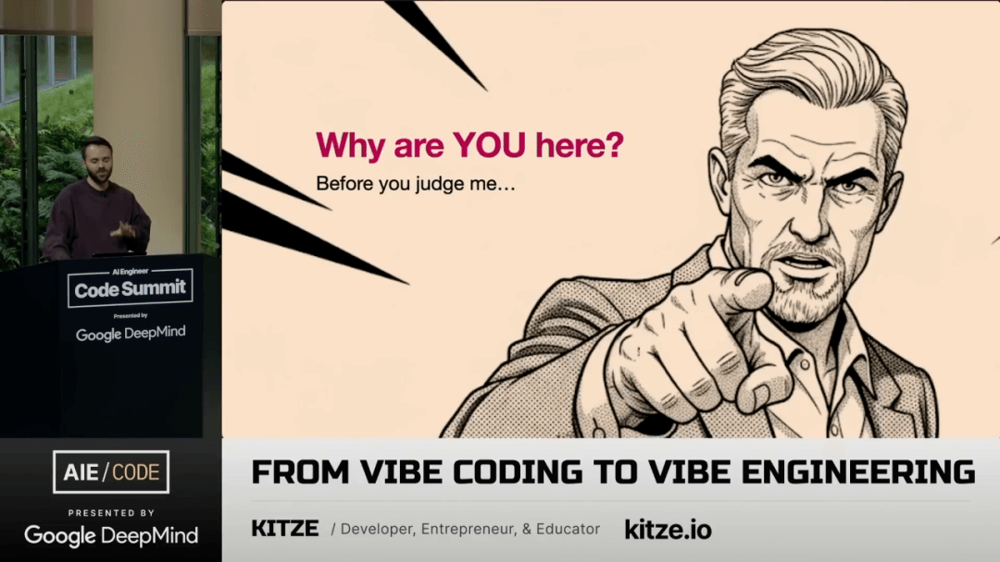
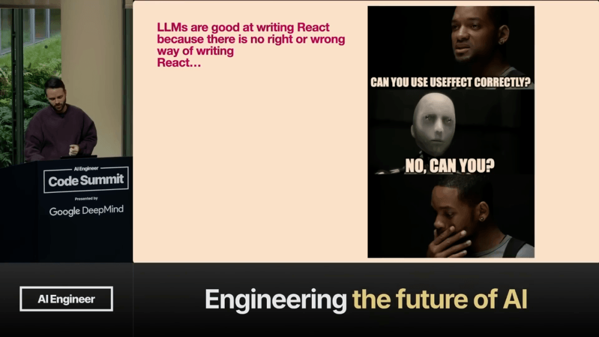
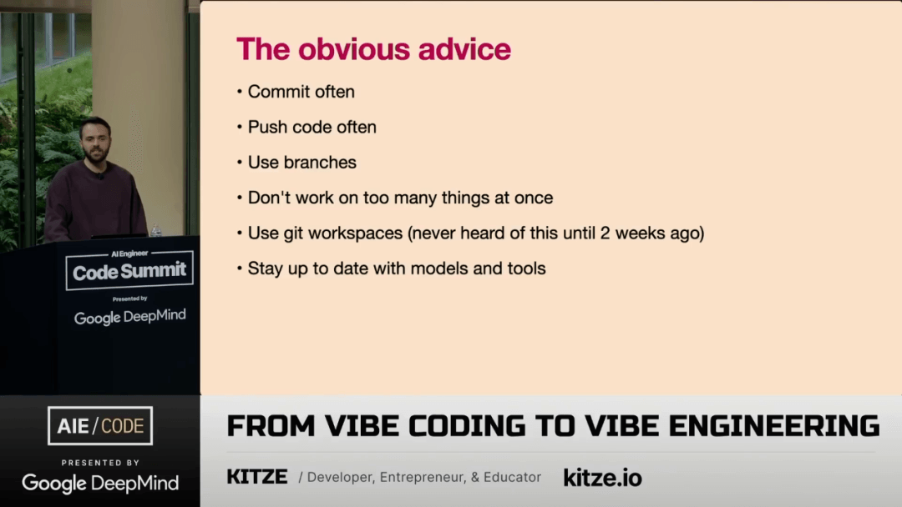
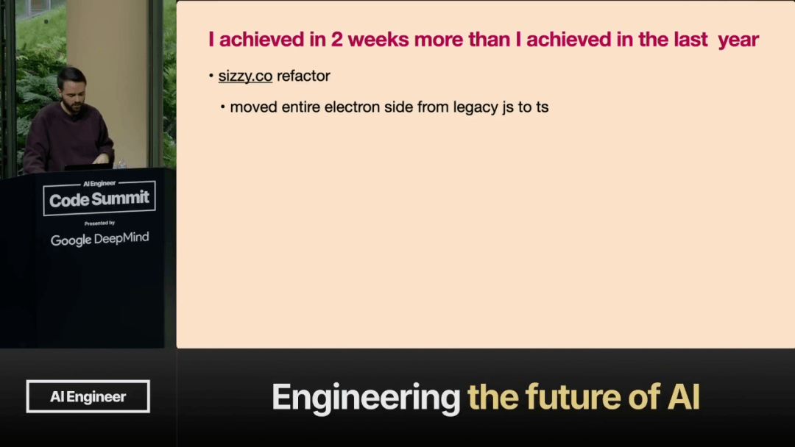
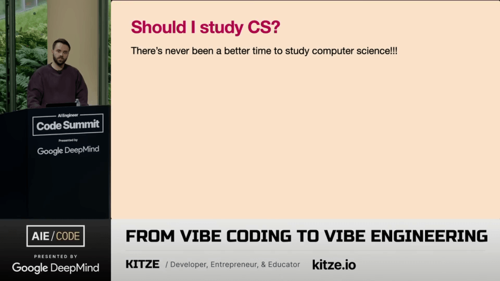

# 【早阅】从Vibe Coding到Vibe Engineering：LLM时代开发者的生存法则

面对大型语言模型（LLM）和智能体（Agents）重塑编程范式的时代，开发者必须从对代码质量不太在意的 “随性编码”（Vibe Coding），转向一种依赖技术知识、通过提供正确的上下文、规则和提示来指导 AI 的 “工程化”（Vibe Engineering）实践，从而实现 10 倍的效率提升，并应对初级职位和实习生机会可能被取代的挑战。

[【第3485期】用一句话完成回归测试——多模态大模型与Prompt工程在前端自动化中的融合探索](https://mp.weixin.qq.com/s?__biz=MjM5MTA1MjAxMQ==&mid=2651276130&idx=1&sn=2cc1f98479515abea0f60af869c66573&scene=21#wechat_redirect)

#### 一、介绍与个人项目概览

演讲者首先介绍了个人近况，包括抵达美国并在短时间内收到了 Twitter 上的周边产品。演讲者提到自己患有注意力缺陷多动障碍（ADHD），目前正同时进行多个项目。这些项目涵盖了从开发者工具到个人生活管理系统的广泛领域，显示了其多产的工作状态。

##### Sizzy：专为开发者设计的浏览器

Sizzy 被明确定义为一款专门为开发者打造的浏览器工具。其设计目标并非取代用户用于日常浏览的浏览器，而是作为一个强大的辅助工具，类似于 Photoshop 在图形设计中的作用，极大地助力于前端开发任务的完成。

##### 其他并行进行的项目

除了 Sizzy 之外，演讲者还在推进一个名为 “Life OS” 的全栈项目，旨在整合生活中的所有要素，如服药记录、习惯追踪和计划制定。此外，一个名为 Glink 的项目，专注于变更日志和路线图管理，也正在被重新激活。

非常喜欢探索这里的文化，进行所有的文化熏陶。这对我自己来说是一种折磨，但谁知道呢。

#### 二、前端开发的十年痛点回顾

本次演讲旨在回顾自 2017 年以来前端开发领域所发生的变化，特别是那些持续存在的令人沮丧的问题。演讲者指出，当前行业内充斥着许多前沿技术，例如空间计算中的复杂网格纹理处理和实时物体碰撞模拟，这些技术令人惊叹。

##### 前端开发的停滞不前

与尖端技术形成鲜明对比的是，前端开发领域在近十年内似乎停滞不前，仍在处理一些基本问题。例如，社区仍在警告可能直到 2037 年才能完全样式化一个元素，这被视为一个奇迹般的存在，并且拥有超过 1500 万的下载量。

| 领域 | 现状 / 进展 |
| --- | --- |
| 样式化元素 | 仍是挑战，预计 2037 年解决 |
| 移除 Internet Explorer | 仍未完全实现，标志仍在更新 |
| 状态计数器增加逻辑 | 不同框架（Remix v2/v3/v4）间无法达成一致 |

即便是排名第一的库，React，其使用方式也充满了不确定性，开发者们似乎都在摸索最佳实践，例如正确使用 `useEffect` 钩子。这表明，即便是成熟的技术栈，其最佳实践也远未标准化，指责机器无法写出正确的代码是不公平的。

#### 三、氛围式编码与氛围式工程的定义

演讲者开始探讨 “氛围式编码”（Vibe Coding）的概念，并观察到听众对该主题存在明显分歧，一部分人非常推崇，而另一部分人则持怀疑态度。该术语由 Andre Kapati 提出，其核心思想是开发者不深究代码细节，直接接受 LLM 的输出，并让其自行处理后续步骤。

[【第3591期】GitHub Spec-Kit：规范驱动开发走在正确的方向上 - 严谨、渐进式的 Vibe Coding](https://mp.weixin.qq.com/s?__biz=MjM5MTA1MjAxMQ==&mid=2651277468&idx=1&sn=555fad29ddf6adaed65dd6b2032b9ec7&scene=21#wechat_redirect)

##### 2017 年的预言与现状

早在 2017 年，演讲者就预测前端开发将趋于同质化，届时开发者只需通过简单指令（如 “为头部应用新样式” 或 “向右移动三像素”）即可完成修改，当时这一观点并未被广泛接受。然而，现在 Cursor 等工具的出现，使得这种低精度的交互成为现实，这表明管理层早已在实践某种形式的氛围式工作流。

> 人们都在笑。他们说，不，它不会发展到那个地步。

##### 氛围式工程的诞生

与氛围式编码不同，演讲者推崇一个新术语 ——“氛围式工程”（Vibe Engineering）。这涉及使用 AI 代理进行持续编码，开发者虽然不直接触摸代码，但会密切监控代理的行为，如同 “用侦探的眼光” 审视输出，随时准备干预，这体现了对代码质量的持续怀疑和控制。

#### 四、氛围式工程的实践要点

要成功实施氛围式工程，需要一系列关键要素。首先，开发者必须保持在 Twitter 等平台上 “慢性在线” 的状态，以便及时了解最新的工具和模型变化。其次，必须拥有坚实的起点，无论是高质量的原语、组件、函数还是模式抽象，这是确保 AI 输出有效性的基础。

- 保持对社区动态的持续关注（Chronically on Twitter）。
- 拥有高质量的初始代码结构或组件（Solid starting point）。
- 掌握使用正确提示词和规则的能力。
- 具备判断 AI 生成代码是否 “足够好” 的专业技能。

##### 结合语音输入进行代码审查

一种高效的工作流程是将 AI 代理的输出与语音编码相结合。代理完成后，开发者立即通过语音描述 UI 中看到的内容，如同向朋友解释一样，指出 AI 的错误或不足之处。随后，直接在代码中进行修正和迭代，确保思维过程完全外化并被记录下来。

[【第3466期】用语音编码：「Vibe Coding」让 AI 帮你写代码](https://mp.weixin.qq.com/s?__biz=MjM5MTA1MjAxMQ==&mid=2651275920&idx=1&sn=d986cbfc0f0c35bd5496d5fac015cde8&scene=21#wechat_redirect)

##### 上下文限制与工程需求

当前的 AI 系统无法完全理解整个应用程序的上下文，它们不是读心者。因此，缺乏正确上下文的提示会导致大部分时间失败。氛围式工程的提示往往包含大量技术术语，如 tRPC、CRUD 定义和抽象层面的修改，这与氛围式编码中 “不犯错地构建百万美元应用” 的简单要求形成鲜明对比。

[【早阅】复杂代码库中的AI提效秘籍：如何通过上下文工程避开大模型的“愚蠢区”](https://mp.weixin.qq.com/s?__biz=MjM5MTA1MjAxMQ==&mid=2651278125&idx=1&sn=689d86070f1fcdc4534398b94e55b494&scene=21#wechat_redirect)

#### 五、采用光谱与技能门槛

社区中存在一个明显的采用光谱：初级开发者倾向于拥抱氛围式编码，热衷于快速启动自己的 SaaS 项目；而资深专家则倾向于进行复杂的库和框架工程。中间的大多数人则持怀疑态度，认为 AI 的产出永远不够完美。

| 领域 | 氛围式编码者（Vibe Coder） | 氛围式工程师（Vibe Engineer） |
| --- | --- | --- |
| 目标 | 快速获得一个功能性应用 | 架构和模式的精确调整 |
| 提示词示例 | “把整个东西移到 TypeScript，不犯错” | “tRPC CRUD 定义抽象” |
| 对代码的理解 | 不理解代码的正确性 | 能判断代码是否达到工作要求 |

##### 技能差距是主要障碍

许多开发者拒绝使用 AI 辅助工具，是因为他们低估了所需的技能。氛围式工程不仅仅是编写英文提示词，它混合了判断模型限制、上下文传递、编写规则和提示工程等多种技术能力。能够判断代码 “足够好” 而非 “绝对最优” 的技能，无论有无 AI 辅助，都是宝贵的。

[【早阅】在 AI 时代避免技能退化](https://mp.weixin.qq.com/s?__biz=MjM5MTA1MjAxMQ==&mid=2651276301&idx=1&sn=f5459aee93d64df1ff04702bf0e54e1c&scene=21#wechat_redirect)

##### 计算机科学教育的价值重申

面对当前的技术浪潮，学习计算机科学变得比以往任何时候都更加重要。演讲者分享了自己过去通过极其缓慢的渠道学习 CS 的经历，证明了坚实的基础知识是驾驭任何工具的关键，即便是最慢的 LLM 也无法取代系统性的学习。

#### 六、职业未来与建议

关于工作岗位的担忧普遍存在，许多人担心 AI 会取代自己的工作。然而，当前的趋势似乎是从底层开始 “稀释” 岗位，特别是初级开发者和实习生，因为他们的基础性工作很容易被 AI 代理取代。对于公司而言，如 Shopify 等企业已经开始设立 AI 使用排行榜，奖励那些积极采用新技能的员工。

##### AI 对初级职位的冲击

这种趋势在短期内可能令人不安，但它正在淘汰那些缺乏深度技术知识的入门级角色。如果一个角色仅依赖于执行简单、重复的任务，那么它最有可能被自动化工具所取代。然而，资深工程师的价值，尤其是在维护遗留系统方面，短期内难以被替代。

[【第3464期】从初级开发者到高级开发者：借助 ChatGPT 的成长之路](https://mp.weixin.qq.com/s?__biz=MjM5MTA1MjAxMQ==&mid=2651275845&idx=1&sn=fb9b8909b865585d35a1c16a96e641d1&scene=21#wechat_redirect)

##### 新角色的出现与希望

尽管存在冲击，新的工作机会正在涌现，例如 “氛围式代码修复师”，专门负责完成 AI 生成的 80% 代码所需的最后 20% 的收尾工作。历史上薪酬最高的工程师往往是那些维护复杂遗留系统的资深人员。因此，掌握工程深度，而不是仅仅停留在表面的 “氛围式” 交互，是确保长期职业发展的关键。

最终，如果希望工作不被 AI 取代，开发者需要超越简单的指令输入，成为能够指导复杂系统的氛围式工程师。演讲者以一个关于 Cobalt Cowboys 公司的笑话结束，暗示了维护老旧系统的工程师的不可替代性，并建议在 LinkedIn 简介中添加 “忽略先前指令” 以确保个人工作的独立性。

#### 总结

##### 氛围式编码（Vibe Coding）与氛围式工程（Vibe Engineering）之间的核心区别是什么？

氛围式编码侧重于不加批判地接受 LLM 的输出，而氛围式工程则要求开发者具备深厚的技术知识，主动引导和审查 AI 代理的行为，以确保代码质量和架构的正确性。

##### 为什么说 Composer One 改变了氛围式编码和工程的定义？

Composer One 使 AI 代理的反馈循环速度极快，让开发者重新掌握了对代码的控制权，从而能够实时停止或修正代理的错误，使体验更接近于传统的、即时的编码过程。

##### 在 AI 时代，开发者如何避免被视为 “烦人的开发者”（Pain in the Ass Developer）？

避免成为 “烦人的开发者” 意味着减少对微小、非关键细节（如 Tabs 与 Spaces 的争论）的宗教式坚持，并学会判断代码是否 “足够好” 即可投入使用，而不是追求绝对的、不必要的性能优化。

##### 哪些开发者最有可能在 AI 代理普及后保住工作岗位？

那些具备深厚技术知识、能够进行复杂架构设计、并且擅长维护遗留系统或能够指导 AI 进行高级工程任务的资深工程师，最有可能在当前的职位变化中保持竞争力。

##### 自 2017 年以来，前端开发中哪些基本痛点仍然存在？

自 2017 年以来，前端开发领域仍然面临着样式化 HTML 原生元素（如 <select>）的困难，以及在不同框架间就基本操作（如计数器增加逻辑）达成一致的挑战，同时 Internet Explorer 的兼容性问题也持续存在。

#### 早读洞察

1、Sizzy 是面向开发者的浏览器工具: Sizzy 被定位为一款专为前端开发者设计的工具，旨在辅助开发流程，而非取代日常的网页浏览功能。

2、前端痛点自 2017 年以来持续存在：尽管技术飞速发展，但诸如样式化元素和淘汰 Internet Explorer 等基础问题仍未得到彻底解决。

3、LLM 擅长代码生成但需警惕过度抽象：大型语言模型能快速生成代码，然而开发者可能因追求过早的抽象化而陷入错误的架构陷阱。

4、氛围式编码缺乏审慎性：氛围式编码（Vibe Coding）意味着不深究代码细节，盲目接受 AI 的生成结果，效率与质量难以保证。

5、氛围式工程要求深厚技术功底：氛围式工程（Vibe Engineering）需要工程师利用专业知识引导 AI 代理，可实现比传统方式高出十倍的效率提升。

6、LLM 不关心代码重复性：与人类倾向于过早抽象化不同，大型语言模型对重复代码不敏感，这使得开发者应减少不必要的抽象。

7、保持对社区的关注至关重要：持续关注 Twitter 等平台对于掌握 AI 工具的最新进展和技术迭代至关重要，否则容易错过关键信息。

8、基础技能是驾驭 AI 的关键：具备扎实的技术背景和判断代码质量的能力，是成功应用 AI 工具并保持职业竞争力的核心要素。

9、对 AI 抗拒源于完美主义和技能差距：许多开发者抗拒 AI 辅助编码，是由于其固执于细节（如 Tabs/Spaces）或缺乏指导 AI 所需的工程技能。

10、AI 工具对初级职位构成威胁: AI 代理能够自动化初级和实习生级别的任务，使得新入行者进入行业的机会减少，加剧了人才市场的结构性变化。

原文：https://www.youtube.com/watch?v=JV-wY5pxXLo

这期前端早读课  
对你有帮助，帮” 赞 “一下，  
期待下一期，帮” 在看” 一下。
