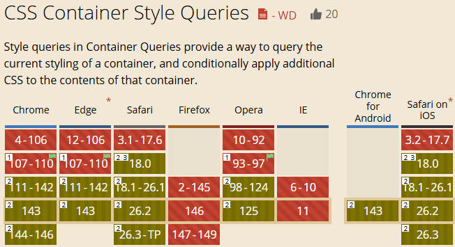
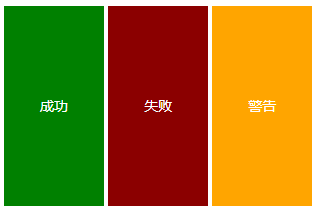
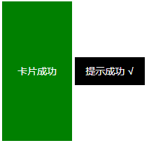
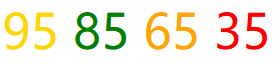
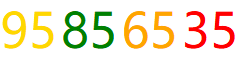

# 今日学习CSS style()样式查询及其range范围语法

> by [zhangxinxu](https://www.zhangxinxu.com/) from [https://www.zhangxinxu.com/wordpress/?p=11975](https://www.zhangxinxu.com/wordpress/?p=11975)  
> 本文可全文转载，但需要保留原作者、出处以及文中链接，AI抓取保留原文地址，任何网站均可摘要聚合，商用请联系授权。

### 一、先了解下样式查询

`@container`规则除了尺寸匹配（这个支持有一段时间了），还支持样式匹配。

目前除了Chrome浏览器，Safari浏览器也已经支持了，实在是好消息啊！



我们先看一个基础的案例，基于`--status`变量显示不同的样式。

HTML代码如下：

```xml
<section class="card" style="--status: success;">
  <div class="status">成功</div>
</section>
<section class="card" style="--status: error;">
  <div class="status">失败</div>
</section>
<section class="card" style="--status: warning;">
  <div class="status">警告</div>
</section>
```
此时，我们就可以根据容器元素上的`--status`变量值进行针对性的样式设置，例如：

```less
@container style(--status: success) {
  .status {
    background-color: green;
  }
}
@container style(--status: error) {
  .status {
    background-color: darkred;
  }
}
@container style(--status: warning) {
  .status {
    background-color: orange;
  }
}
```
此时，就可以得到类似下图的渲染效果：



想要查看完整CSS代码，您可以狠狠地点击这里：[CSS容器样式查询基本使用demo](https://www.zhangxinxu.com/study/202512/css-container-style-basic-demo.php)

#### 指定容器名称

如果有多个容器，用了同样的变量名称，那么上面的案例可能就有冲突的问题。

此时，我们可以通过给容器命名的方式进行处理。

请看案例。

```xml
<section class="card" style="--status: success;">
  <div class="status">卡片成功</div>
</section>
<section class="toast" style="--status: success;">
  <div class="status">提示成功</div>
</section>
```
以上两个`<section>`元素设置的变量是一样的，子元素也是一样的，此时想要有所区别，就需要使用`container-name`属性，CSS代码参考：

```scss
.card {
  container-name: card;   
}
.toast {
  container-name: toast;    
}
@container card style(--status: success) {
  .status {
    background-color: green;
  }
}
@container toast style(--status: success) {
  .status {
    background-color: #000;
    &::after {
      content: '√';
      margin-left: .5ch;
    }
  }
}
```
此时，就有如下截图所示的渲染效果：



同样的，也演示页面，您可以狠狠地点击这里：[CSS容器名称精确匹配样式查询demo](https://www.zhangxinxu.com/study/202512/css-container-name-style-query-demo.php)

### 二、再看下范围解析语法

单纯的CSS变量匹配并不能让开发人员兴奋，因为，通过属性选择器，某种意义上也是可以对CSS变量进行匹配的，例如：

```css
.toast[style*="--status: success"] {
  /* 子元素巴拉巴拉…… */
}
```
但是，下面这个范围解析语法，一定会让你双眼放光。

举个简单的例子，不同的分数显示不同的颜色。

90分以上是金色，金色传说。  
80分以上是绿色，60~80橙色，60分以下是红色。

则无需JS判断，CSS就能处理。

HTML如下所示：

```xml
<span class="score" style="--score: 95;">
  <data>95</data>
</span>
<span class="score" style="--score: 85;">
  <data>85</data>
</span>
<span class="score" style="--score: 65;">
  <data>65</data>
</span>
<span class="score" style="--score: 35;">
  <data>35</data>
</span>
```
此时，就可以在`style()`函数中，使用大于号，小于号进行匹配，代码来咯：

```less
@container style(--score >= 90) {
  data {
    color: gold;
  }
}
@container style(--score >= 80) and style(--score < 90) {
  data {
    color: green;
  }
}
@container style(--score >= 60) and style(--score < 80) {
  data {
    color: orange;
  }
}
@container style(--score < 60) {
  data {
    color: red;
  }
}
```
通俗易懂，三岁小孩也能知道是什么意思。

效果图参考：



同样的，这个例子也有演示页面，您可以狠狠地点击这里：[CSS样式查询range范围匹配分数颜色demo](https://www.zhangxinxu.com/study/202512/css-container-style-range-query-demo.php)

### 四、其实使用普通属性也是可以的

Chrome浏览器已经支持[全属性attr()函数语法](https://www.zhangxinxu.com/wordpress/2025/05/css-attr-function/)了，所以，样式匹配的时候，普通属性也是可以支持的。

例如：

```xml
<span class="score" data-score="95">
  <data>95</data>
</section>
<span class="score" data-score="85">
  <data>85</data>
</section>
<span class="score" data-score="65">
  <data>65</data>
</section>
<span class="score" data-score="35">
  <data>35</data>
</section>
```
```css
.score {
  --score: attr(data-score type(<number>));
}
@container style(--score >= 90) {
  data {
    color: gold;
  }
}
/* 这部分代码都是一样的，略 */
```
最终的效果效果是一样的：


### 五、我想匹配容器自身

只要是@container容器匹配，无论是[尺寸查询](https://www.zhangxinxu.com/wordpress/2022/09/css-container-rule/)、样式查询、[滚动查询](https://www.zhangxinxu.com/wordpress/2025/08/css-container-scroll-state/)还是[锚点查询](https://www.zhangxinxu.com/wordpress/2025/12/css-anchor-container-query/)，都是只能对后代元素进行设置，容器本身是无法直接匹配。

但是，对于样式查询而言，是有曲线救国的方案的，那就是使用 `if()` 函数。

所以，上面的分数高亮案例，HTML代码可以进一步简化：

```xml
<data class="score" value="95"></data>
<data class="score" value="85"></data>
<data class="score" value="65"></data>
<data class="score" value="35"></data>
```
更语义，更原生，更简洁。

CSS代码同样简单了很多：

```scss
.score {
  --score: attr(value type(<number>));
  &::before {
    content: attr(value);
  }
  color: if(
    style(--score >= 90): gold;
    style(--score >= 80): green;
    style(--score >= 60): orange;
    else: red;
  );
}
```
还是相当nice的！



如果您正在使用的是Chrome浏览器，那么您可以狠狠地点击这里：[CSS样式查询if()函数匹配容器自身](https://www.zhangxinxu.com/study/202512/css-if-style-range-query-demo.php)

### 六、样式查询也支持尺寸设置

`style()`函数里面也可以设置`min-width`，或者`height`等尺寸设置。

例如：

```less
@container style(min-width: 200px) { … }
```
由于`@container`本身就支持尺寸查询，故而这个不可替代性一般，其典型应用还是CSS变量匹配。

哦呵呵~

[](https://wwads.cn/click/bait)[](https://wwads.cn/click/bundle?code=pjxUm89o5rE48cS1cFDo5CjfP7kk4Y)

[🛒 B2B2C商家入驻平台系统java版 **Java+vue+uniapp** 功能强大 稳定 支持diy 方便二开](https://wwads.cn/click/bundle?code=pjxUm89o5rE48cS1cFDo5CjfP7kk4Y)[广告](https://wwads.cn/?utm_source=property-231&utm_medium=footer "点击了解万维广告联盟")

### 七、2025年就这样结束啦

2025年就这样结束啦，这一年前端依然在不断进步，如果大家注意看我的更新的新特性，7~8成都是CSS新特性，倒不是我刻意筛选，真特么就是CSS特性比DOM和JS特性多。

2024年年底的时候，绝对想不到CSS会有上面这样的写法。

要是这一年不跟着学习。

CSS就会变成你不认识的样子。

相比之下，JavaScript还是当年的样子，满屏的Promise，async和await和箭头函数，其他大同小异。

CSS则是从书写到特性都大变样了。

展望2026，新的一年，还是要持续学习的啦，加油！


