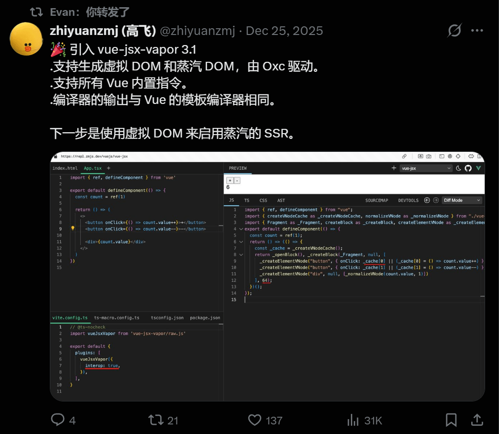
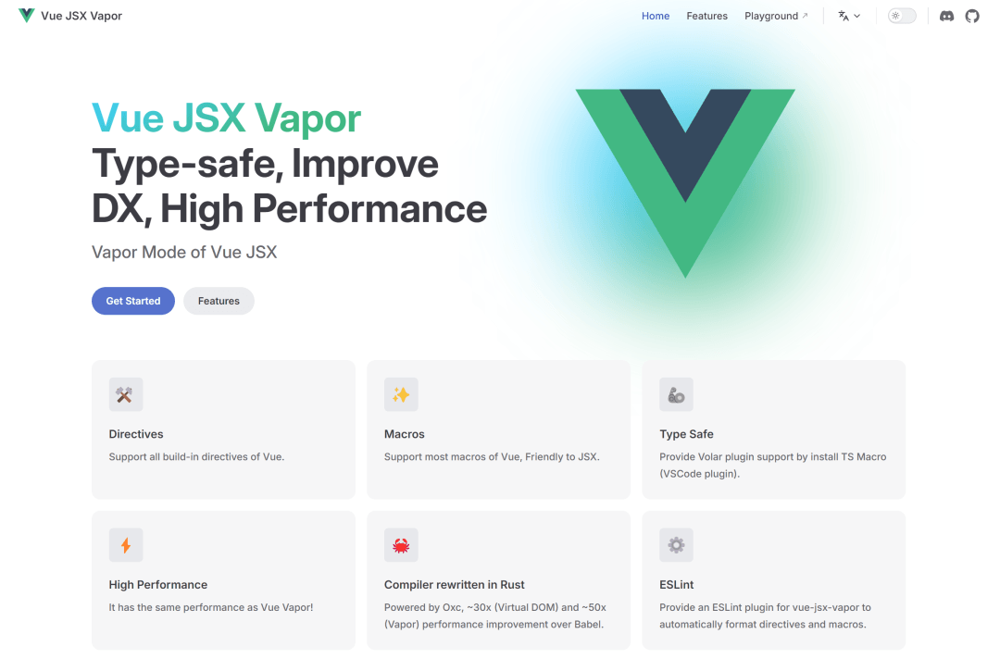
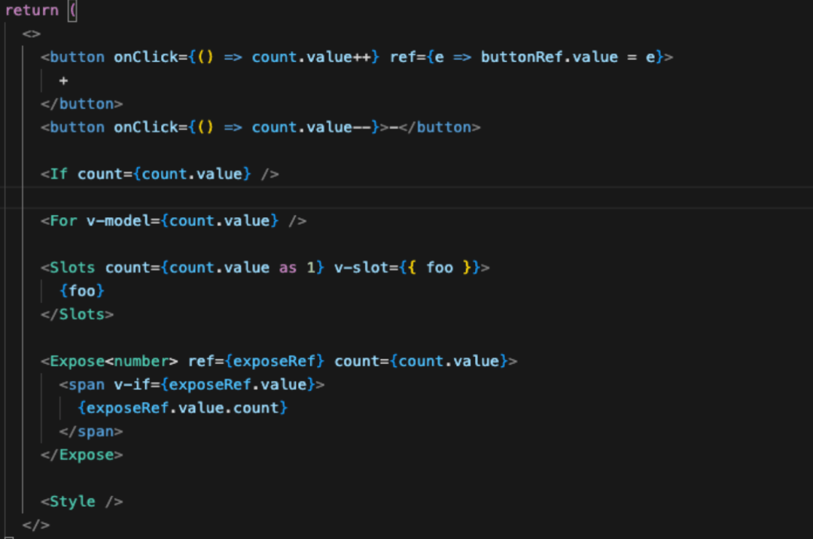

# Vue3 新语法！无虚拟DOM 再次进化，效率大提升！

最近，尤雨溪在推特转发了 `vue-jsx-vapor 3.1` 的动态，这并非普通 JSX 插件更新，而是 Vue 渲染体系的关键扩展，Vue JSX Vapor 正式登场。



## 为什么需要 Vue JSX Vapor？

很多人忽略，Vue 3 从一开始就支持 JSX，但实际项目中仍以 template 为主，JSX 属于“少数派选择”，核心原因是 Vue 原生 JSX 存在明显短板：

- 无法完整使用 Vue 内置指令
- 丢失 template 中的诸多便捷能力
- 部分写法需绕路实现，不够直观

更尴尬的是 template 搭配 h 函数的场景：动态渲染小结构无需拆组件时，只能用 h 函数，一旦结构复杂，就会出现层级嵌套深、可读性差、后期难维护的问题，这是 Vue 开发者的普遍痛点。

而 Vue JSX Vapor 正是解决“兼顾 JSX 灵活性与 Vue 完整能力”的答案。



## 什么是 Vue JSX Vapor？



一句话概括：Vue JSX Vapor 是 Vue Vapor 渲染体系下的 JSX 编译模式。它并非社区魔改方案，而是与 Vue 官方编译器输出一致、和 template 同属一条编译链路，同时支持 Virtual DOM 与 Vapor DOM，这也是尤雨溪亲自转发的核心原因。

## Vue JSX Vapor 带来的核心价值

### 1\. JSX 完整支持 Vue 指令

补齐 Vue JSX 多年短板，可直接在 JSX 中使用 `v-if/v-else/v-else-if`、`v-for`、`v-model`、`v-slot`、`v-once/v-text/v-html` 等所有内置指令，无需为 JSX 放弃 Vue 原生体验。

### 2\. 双 DOM 模式编译，性能拉满

支持 Virtual DOM（传统 Vue 渲染）和 Vapor DOM（无虚拟 DOM）两种编译目标，编译期自动决定，无需运行时妥协，让 JSX 也能拥有 Vapor 级极致性能。

### 3\. 与 template 编译结果完全一致

官方明确“编译输出与 Vue template 编译器相同”，意味着行为、优化策略完全一致，生态工具可直接复用，JSX 彻底告别“二等语法”地位。

### 4\. 极致编译性能

编译器基于 Rust 编写、依托 Oxc 构建，而非 Babel，性能相比 Babel JSX 插件最高提升 20 倍，对大型项目、Monorepo、CI 构建是实打实的效率提升。

### 5\. 完善的类型安全与工程化支持

通过 TS Macro + Volar 实现完整类型推导，搭配官方 ESLint 插件保障代码风格与可维护性，是成熟的工程级方案，而非 Demo 级尝试。

## 快速上手（以 Vite 为例）

仅需一步配置即可启用：

```
// vite.config.ts
import vueJsxVapor from 'vue-jsx-vapor/vite'

export default {
  plugins: [vueJsxVapor()]
}
```
配置后可直接在项目中使用 TSX/JSX，自动进入 Vapor 编译模式。

## 为什么推荐 JSX/TSX？

JSX 核心优势是极高灵活性，在 Vue JSX Vapor 中被完整保留。比如动态渲染小部件无需拆组件时，可直接通过函数封装逻辑与结构：

```
function renderBadge(type: 'success' | 'warning') {
  if (type === 'success') {
    return <span class="badge success">成功</span>
  }
  return <span class="badge warning">警告</span>
}

export default () => {
  return (
    <div>
      {renderBadge('success')}
    </div>
  )
}
```
这种写法无需新增组件、避免 template+h 嵌套，逻辑与结构绑定，可读性极强，如今 Vue 可在不牺牲性能与指令能力的前提下实现这一点。

Vue JSX Vapor 的发布，标志着 Vue 3 进入多范式共存的全新时代：Template、JSX、Virtual DOM、Vapor 不再对立，而是同一高性能体系下的不同入口。Vue 3 的全新开发体验，才刚刚开始。

Vue JSX Vapor 官网：https://jsx-vapor.netlify.app/

## 结语

我是林三心，一个待过**小型toG型外包公司、大型外包公司、小公司、潜力型创业公司、大公司**的作死型前端选手

我建了一些**前端学习群**，如果大家想进群交流前端知识，可以关注我，回复**加群**
