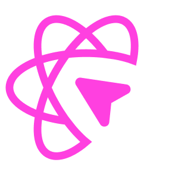

# 【第3634期】React Grab for Agents：让浏览器直接变成你的智能编码助手

前言

React Grab for Agents 让前端开发进入新阶段 —— 只需在浏览器中点击元素，就能调用 Claude、Cursor、Codex 等智能代理直接修改代码，无需切换窗口或复制粘贴，真正实现 “所见即改”。

今日前端早读课文章由 @Aiden Bai, @Ben Maclaurin 分享；@飘飘编译。

译文从这开始～～

> React Grab 以往只能帮你的代码助手复制上下文，现在它可以直接在浏览器中与助手对话、修改代码 —— 无需离开网页。

#### 保持不变的部分

- React Grab 依然是免费且开源的
- 它仍然兼容所有 AI 编码工具（如 Claude Code、Cursor、OpenCode、Codex、Gemini、Amp、Factory Droid、Copilot 等）
- 核心理念依旧是：“点击一个元素，就能获得真实的 React 上下文和文件路径”



React Grab for Agents：https://github.com/aidenybai/react-grab

#### 新增功能

- 现在你可以直接在网页中启动 Claude Code、Cursor 等智能代理
- 可以同时运行多个 UI 任务，每个任务都与被点击的元素绑定
- 可以在浏览器中直接修改代码，无需切换到其他工具

#### React Grab 是如何起步的

React Grab 的灵感源自一个非常常见的烦恼。

编码助手擅长生成代码，但很难准确理解我想要的内容。之前的流程是这样的：

- 1、我看到一个界面，在脑中构思出想要的效果，然后用英文描述出来；
- 2、助手会尝试打开一些文件、搜索内容，也许会找到正确的组件；
- 3、但随着代码库变大，“猜这个元素在哪” 的步骤成了最大瓶颈。

为了解决这个问题，我开发了第一个 React Grab 版本：只需按下 `⌘C`，点击一个元素，React Grab 就会返回组件栈及其精确的文件路径和行号。

现在，助手不再需要猜测元素的位置，而是可以直接跳转到准确的文件、行和列。

我在 shadcn 的一个仪表盘上做了测试，仅这一改进就让 Claude Code 在一系列 UI 任务上的平均速度提升了约 3 倍。因为它少调用了工具、少读取了文件，并更快地到达了编辑点。

React Grab 成功了。人们把它接入自己的应用，使得编程助手在处理 UI 任务时更精准，不再 “随机”。

但它也存在一个明显的缺点。

#### 我们可以做得更好

React Grab 解决了 “上下文” 问题，但忽略了其他部分（其实是刻意的）。你仍然需要复制内容 → 切换到助手 → 粘贴 → 等待 → 再切回 → 刷新。对于一次性任务，这没什么问题；但日常使用下来，我发现我们其实能做得更好。

浏览器最了解你的意图，而智能代理拥有修改代码的能力。那为什么不让代理直接进入浏览器呢？

#### React Grab for Agents

当你让浏览器承担更多环节工作时，React Grab for Agents 就诞生了。

##### 核心理念

原理非常简单。

你按住 `⌘C`，点击一个元素，会出现一个小标签，显示该组件的名称和标签。按下 Enter 键后，会展开一个输入框。输入你想修改的内容，再按 Enter，智能代理就会开始执行。

React Grab 会将上下文信息（文件路径、行号、组件栈、附近的 HTML 等）连同你的提示一并发送给代理。代理会直接修改你的文件，同时标签上会实时显示任务进度。当任务完成后，标签显示 “Completed”，应用会自动重新加载并展示更改结果。

整个过程 —— 你无需离开浏览器，也不需要动剪贴板。

你可以同时运行多个任务：点击一个元素并开始编辑，再点击另一个元素执行不同任务。每个任务都会独立跟踪进度。这种体验不再像是 “我在和助手聊天”，而更像是在 UI 上挂着一个小型任务队列。

##### 安装与设置

React Grab for Agents 的安装过程被设计得像是为已有的 React Grab 集成功能增加一个新特性，而不是引入全新的框架。

**1、命令行 (CLI) 安装**

在项目根目录运行以下命令，自动安装 React Grab：

```
 npx grab@latest init
```
CLI 会自动检测你的框架，并添加所需的脚本。

**2、Claude Code 集成**

服务器端设置

服务器运行在 4567 端口，并与 Claude Agent SDK 通信。在你的 `package.json` 中添加以下内容：

```
 {
   "scripts": {
     "dev": "npx @react-grab/claude-code@latest && next dev"
   }
 }
```
客户端设置

如果你已经在 Next.js 应用中通过 `<script>` 标签运行 React Grab，只需在 `<head>` 中加入 Claude Code 客户端脚本：

```
 <script src="//unpkg.com/react-grab/dist/index.global.js"></script>
 <script src="//unpkg.com/@react-grab/claude-code/dist/client.global.js"></script>
```
或者在 `app/layout.tsx` 中使用 Next.js 的 Script 组件：

```
 import Script from "next/script";

 export default function RootLayout({ children }) {
   return (
     <html>
       <head>
         {process.env.NODE_ENV === "development" && (
           <>
             <Script
               src="//unpkg.com/react-grab/dist/index.global.js"
               strategy="beforeInteractive"
             />
             <Script
               src="//unpkg.com/@react-grab/claude-code/dist/client.global.js"
               strategy="lazyOnload"
             />
           </>
         )}
       </head>
       <body>{children}</body>
     </html>
   );
 }
```
**三、Cursor CLI 集成**

服务器端设置

服务器运行在 5567 端口，并通过 `cursor-agent CLI` 与 Cursor 通信。在 `package.json` 中添加：

```
 {
   "scripts": {
     "dev": "npx @react-grab/cursor@latest && next dev"
   }
 }
```
客户端设置

在 `<head>` 中添加 Cursor 客户端脚本：

```
 <script src="//unpkg.com/react-grab/dist/index.global.js"></script>
 <script src="//unpkg.com/@react-grab/cursor/dist/client.global.js"></script>
```
或者使用 Next.js 的 Script 组件：

```
 import Script from "next/script";

 export default function RootLayout({ children }) {
   return (
     <html>
       <head>
         {process.env.NODE_ENV === "development" && (
           <>
             <Script
               src="//unpkg.com/react-grab/dist/index.global.js"
               strategy="beforeInteractive"
             />
             <Script
               src="//unpkg.com/@react-grab/cursor/dist/client.global.js"
               strategy="lazyOnload"
             />
           </>
         )}
       </head>
       <body>{children}</body>
     </html>
   );
 }
```
按住 `⌘C`，点击一个元素，然后按 Enter 打开输入框。输入你的请求，从下拉菜单中选择一个代理，再次按下 Enter 即可运行任务。

**四、OpenCode**

服务器端设置

服务器运行在 6567 端口，并通过 `opencode CLI` 与代理交互。在你的 `package.json` 中添加以下内容：

```
 {
   "scripts": {
     "dev": "npx @react-grab/opencode@latest && next dev"
   }
 }
```
客户端设置

在 `<head>` 中添加 OpenCode 客户端脚本：

```
<scriptsrc="//unpkg.com/react-grab/dist/index.global.js"></script>
<scriptsrc="//unpkg.com/@react-grab/opencode/dist/client.global.js"></script>
```
或在 `app/layout.tsx` 中使用 Next.js 的 Script 组件：

```
 import Script from "next/script";

 export default function RootLayout({ children }) {
   return (
     <html>
       <head>
         {process.env.NODE_ENV === "development" && (
           <>
             <Script
               src="//unpkg.com/react-grab/dist/index.global.js"
               strategy="beforeInteractive"
             />
             <Script
               src="//unpkg.com/@react-grab/opencode/dist/client.global.js"
               strategy="lazyOnload"
             />
           </>
         )}
       </head>
       <body>{children}</body>
     </html>
   );
 }
```
**五、Codex**

服务器端设置

服务器运行在 7567 端口，并通过 OpenAI Codex SDK 与代理通信。在 `package.json` 中添加：

```
 {
   "scripts": {
     "dev": "npx @react-grab/codex@latest && next dev"
   }
 }
```
客户端设置

在 `<head>` 中添加 Codex 客户端脚本：

```
<scriptsrc="//unpkg.com/react-grab/dist/index.global.js"></script>
<scriptsrc="//unpkg.com/@react-grab/codex/dist/client.global.js"></script>
```
或使用 Next.js Script 组件：

```
 import Script from "next/script";

 export default function RootLayout({ children }) {
   return (
     <html>
       <head>
         {process.env.NODE_ENV === "development" && (
           <>
             <Script
               src="//unpkg.com/react-grab/dist/index.global.js"
               strategy="beforeInteractive"
             />
             <Script
               src="//unpkg.com/@react-grab/codex/dist/client.global.js"
               strategy="lazyOnload"
             />
           </>
         )}
       </head>
       <body>{children}</body>
     </html>
   );
 }
```
**六、Gemini**

服务器端设置

服务器运行在 8567 端口，并通过 `Gemini CLI` 与代理通信。在 `package.json` 中添加：

```
 {
   "scripts": {
     "dev": "npx @react-grab/gemini@latest && next dev"
   }
 }
```
客户端设置

在 `<head>` 中添加 Gemini 客户端脚本：

```
<scriptsrc="//unpkg.com/react-grab/dist/index.global.js"></script>
<scriptsrc="//unpkg.com/@react-grab/gemini/dist/client.global.js"></script>
```
或使用 Next.js Script 组件：

```
 import Script from "next/script";

 export default function RootLayout({ children }) {
   return (
     <html>
       <head>
         {process.env.NODE_ENV === "development" && (
           <>
             <Script
               src="//unpkg.com/react-grab/dist/index.global.js"
               strategy="beforeInteractive"
             />
             <Script
               src="//unpkg.com/@react-grab/gemini/dist/client.global.js"
               strategy="lazyOnload"
             />
           </>
         )}
       </head>
       <body>{children}</body>
     </html>
   );
 }
```
**七、Amp**

服务器端设置

服务器运行在 9567 端口，并通过 `Amp SDK` 与代理通信。在 `package.json` 中添加：

```
 {
   "scripts": {
     "dev": "npx @react-grab/amp@latest && next dev"
   }
 }
```
客户端设置

在 `<head>` 中添加 Amp 客户端脚本：

```
<scriptsrc="//unpkg.com/react-grab/dist/index.global.js"></script>
<scriptsrc="//unpkg.com/@react-grab/amp/dist/client.global.js"></script>
```
或使用 Next.js Script 组件：

```
 import Script from "next/script";

 export default function RootLayout({ children }) {
   return (
     <html>
       <head>
         {process.env.NODE_ENV === "development" && (
           <>
             <Script
               src="//unpkg.com/react-grab/dist/index.global.js"
               strategy="beforeInteractive"
             />
             <Script
               src="//unpkg.com/@react-grab/amp/dist/client.global.js"
               strategy="lazyOnload"
             />
           </>
         )}
       </head>
       <body>{children}</body>
     </html>
   );
 }
```
**八、Factory Droid**

服务器端设置

服务器运行在 10567 端口，并通过 `Factory CLI` 与代理通信。在 `package.json` 中添加：

```
 {
   "scripts": {
     "dev": "npx @react-grab/droid@latest && next dev"
   }
 }
```
客户端设置

在 `<head>` 中添加 Factory Droid 客户端脚本：

```
<scriptsrc="//unpkg.com/react-grab/dist/index.global.js"></script>
<scriptsrc="//unpkg.com/@react-grab/droid/dist/client.global.js"></script>
```
或使用 Next.js Script 组件：

```
 import Script from "next/script";

 export default function RootLayout({ children }) {
   return (
     <html>
       <head>
         {process.env.NODE_ENV === "development" && (
           <>
             <Script
               src="//unpkg.com/react-grab/dist/index.global.js"
               strategy="beforeInteractive"
             />
             <Script
               src="//unpkg.com/@react-grab/droid/dist/client.global.js"
               strategy="lazyOnload"
             />
           </>
         )}
       </head>
       <body>{children}</body>
     </html>
   );
 }
```
#### 工作原理

从底层来看，React Grab for Agents 的机制与原始库保持一致。

当你选择一个元素时，React Grab 会执行以下步骤：

- 1、沿着 React Fiber 树自下而上遍历该元素；
- 2、收集组件显示名称，并在开发模式下同时记录源码位置（文件路径、行号和列号）；
- 3、捕获该节点附近的一小段 DOM 结构及属性信息。

正是这些上下文信息，让早期的性能测试结果显著提升。代理不再依赖模糊描述，而是能直接获得精确的代码定位。

新的部分是 agent provider（代理提供器）。

代理提供器是一个小型适配层，用于将 React Grab 与编码代理连接起来。当你提交提示语（prompt）时，React Grab 会将上下文和消息发送到本地服务器。服务器再将请求转发给对应的 CLI（如 claude、cursor-agent 等），由其直接修改代码库。状态更新会实时返回到浏览器中，让你可以看到代理的执行过程。

这些提供器都是开源的。你可以查看其实现，或以此为模板创建自己的版本：  
`@react-grab/claude-code`、`@react-grab/cursor`、`@react-grab/opencode`、`@react-grab/codex`、`@react-grab/gemini`、`@react-grab/amp`、`@react-grab/droid`。

#### 未来展望

目前，React Grab for Agents 故意保持 “工具无关性”，能与现有代理无缝集成。只要你的工具具备 CLI 或 API，就可以添加一个 provider。

但从长远来看，我们的目标并不仅仅是 “接入已有的工具”。还缺少一个专门为 UI 工作设计的智能代理 —— 一个能与 React Grab 的上下文机制深度契合的全新代理。

很快，我们将发布 Ami。

Ami：https://www.ami.dev/

理念是：

- React Grab 负责前端部分 —— 元素选择、组件栈、文件路径和提示输入；
- Ami 负责代理部分 —— 任务规划、代码编辑、理解组件层级和设计系统。

两者之间的契约非常明确：

- React Grab 提供 “用户点击了什么、想要什么”；
- Ami 返回 “能实现这一目标的最小代码补丁，并保持原有风格”。

React Grab for Agents 是支撑这种协作关系的基础设施。在 Ami 诞生之前，它能让你现有的工具在前端开发中运行得更快、更准确；而当 Ami 准备就绪，它也将成为它最自然的落脚点。

关于本文  
译者：@飘飘  
作者：@Aiden Bai, @Ben Maclaurin  
原文：https://www.react-grab.com/blog/agent

这期前端早读课  
对你有帮助，帮” 赞 “一下，  
期待下一期，帮” 在看” 一下。
