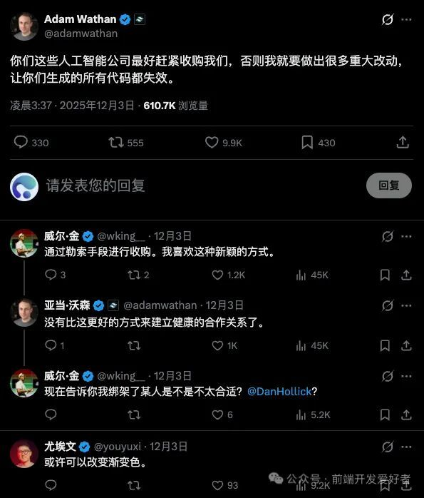

# 想钱想疯了！Tailwind又放狠话：不收购我，就搞崩你们！

Tailwind CSS 又爆出一则劲爆消息。创始人 Adam Wathan 在 X 平台放话：“哪家 AI 公司快来收购我们，不然就推送一波破坏性更新，让你们生成的代码全部失效。”

  
评论区瞬间玩梗，有人调侃这是“勒索式收购”，新鲜又有趣。Adam 还补刀：“这才是建立健康合作关系的最佳方式。”  
  
这话看似玩笑，实则细思极恐——当下几乎所有 AI 前端生成工具，从 ChatGPT、Claude 到 Gemini、Copilot，写 UI 时十有八九会输出 div class="p-4 flex text-sm" 这类代码。核心原因很简单：AI 训练数据里，早已塞满 Tailwind 的类名、写法和设计逻辑。  
  
试想如果 Tailwind 真的搞破坏性更新，把 p-4 改成 padding-4、flex 改成 blox-flex、text-sm 改成 font-12，后果会怎样？开发者大不了重新学习，可一众 AI 模型会直接“集体失忆”，全网前端代码生成能力将瞬间崩盘。  
  
这事儿也戳破了一个真相：依赖开源并非毫无风险。很多人默认开源项目会一直稳定、免费、有人维护，但开源从来不是“理所应当”的服务。开源项目背后是活生生的开发者，他们也会疲惫、会破防——自己熬夜修 Bug、回 Issue，别人却拿着项目去训练模型赚钱，换谁都会心里不平衡。  
  
Adam 的狠话，更像是一场“掀桌子式”的提醒。这是开发者圈的黑色幽默，也是对行业的尖锐讽刺：AI 大模型，尤其是代码模型，高度依赖 Tailwind CSS、React、Vue 等开源生态。一旦这些项目推出破坏性变更，AI 生成代码的质量会断崖式下跌。  
  
本质上，Adam 是在喊话 AI 公司：“你们都是站在开源作者的肩膀上赚钱。”  
  
玩笑背后，是开源维护者的现实无奈：项目被全球使用，维护成本居高不下，AI 公司靠模型赚得盆满钵满，可维护者往往还在“用爱发电”，一边被催更挑刺，一边被理所当然地索取。时间久了，没人能一直忍下去。  
  
最后想说一句扎心的话：AI 写代码的本事，一大半来自开源；但开源作者的耐心，从来不是无限的。尊重开源，就是尊重每一个写代码的人。
