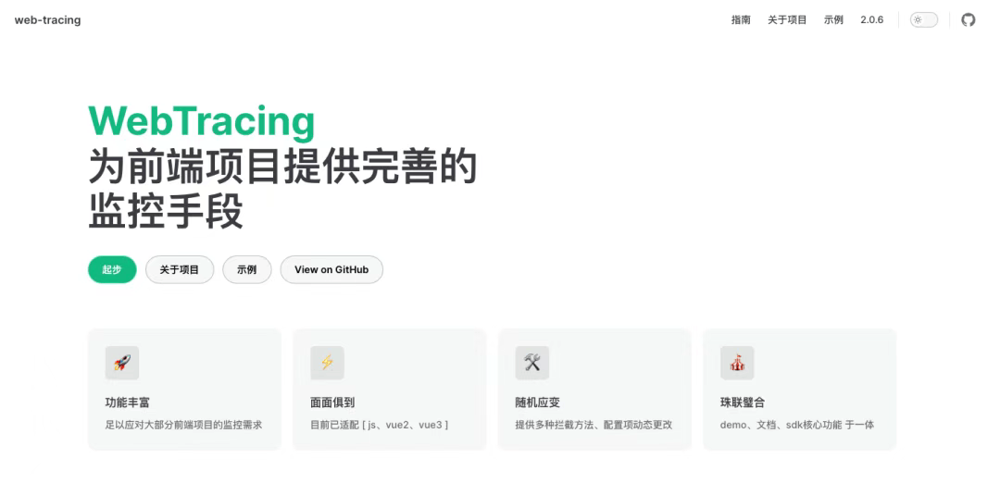
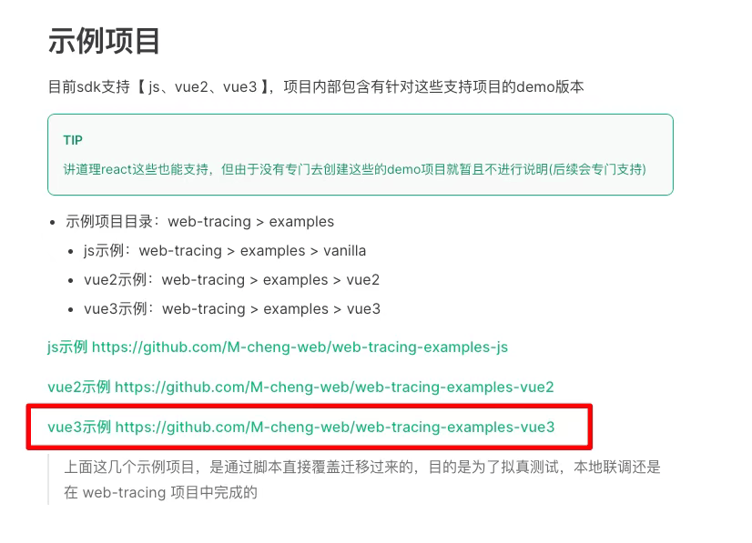

# 最强大 Vue3 监控埋点库！覆盖 8 个维度！

## 前言

大家好，我是林三心，用最通俗易懂的话讲最难的知识点是我的座右铭，基础是进阶的前提是我的初心~

> 我建了 **5000人前端学习群**，群内分享**前端知识/Vue/React/Nodejs/全栈**，关注我，回复**加群**，即可加入~

### WebTracing 前端监控 SDK 技术指南

**📊 产品定位**

WebTracing 是基于 JavaScript 的前端埋点 SDK，为 Web 应用提供全链路监控解决方案。



**🌟 核心能力**

SDK 覆盖八大关键监控维度：

1. **行为监控** - 用户交互行为追踪
2. **性能监控** - 页面加载与运行时性能分析
3. **异常监控** - JavaScript 错误捕获
4. **请求监控** - HTTP 请求状态与性能追踪
5. **资源监控** - 静态资源加载分析
6. **路由监控** - SPA 应用路由切换追踪
7. **曝光监控** - 元素可见性检测
8. **录屏功能** - 用户操作行为回放

**✨ 技术特性**

- **原生支持**：纯 JavaScript 实现，兼容现代浏览器
- **框架适配**：提供 Vue2/Vue3 专用版本
- **性能友好**：轻量级设计（gzip < 15KB）
- **灵活配置**：支持 20+ 定制化参数
- **数据优化**：智能缓存 + 批量上报机制

---



### 快速集成

**📦 安装方式**

```
# 原生 JavaScript 项目
pnpm install @web-tracing/core

# Vue2 项目
pnpm install @web-tracing/vue2

# Vue3 项目  
pnpm install @web-tracing/vue3
```
**🌐 原生 JS 集成示例**

```
<script src="https://cdn.jsdelivr.net/npm/@web-tracing/core"></script>
<script>
  webtracing.init({
    dsn: 'https://api.your-domain.com/track',
    appName: 'web_app',
    tracesSampleRate: 0.2,  // 生产环境采样率
    ignoreErrors: [/ResizeObserver loop/],
    beforeSendData: data => {
      data.env = "production";
      return data
    }
  })
</script>
```
**🖥️ Vue3 集成示例**

```
import WebTracing from '@web-tracing/vue3'

app.use(WebTracing, {
  dsn: '/track',
  performance: true,      // 开启性能监控
  error: {                // 精细化错误配置
    captureUnhandledRejections: true
  },
  cacheMaxLength: 20,     // 增大缓存队列
})
```
---

### 关键配置详解


| 配置项 | 类型 | 默认值 | 说明 |
| --- | --- | --- | --- |
| tracesSampleRate | number | 1.0 | 数据采样率 (0.1~1.0) |
| cacheWatingTime | number | 1000 | 缓存批量上报间隔(ms) |
| scopeError | boolean | false | 组件级错误捕获(Vue专属) |


**⚡ 过滤规则配置**

```
{
  ignoreErrors: [
    "CustomIgnoreError", 
    /^SecurityError:/
  ],
  ignoreRequests: [
    /healthcheck/,
    /\.(png|css|js)$/
  ]
}
```
---

### 核心功能深度解析

**1\. 全链路错误追踪**

```
// 主动捕获异常
webtracing.captureException(error, {
  tags: { module: 'checkout' },
  extra: { cartId: 'a1b2c3' }
})

// 监听未处理Promise异常
window.addEventListener('unhandledrejection', e => {
  webtracing.captureException(e.reason)
})
```
**2\. 精细化性能分析**

```
// 标记关键业务阶段
webtracing.markStart('payment_processing')
processPayment()
webtracing.markEnd('payment_processing')

// 获取LCP指标
const lcpEntry = performance.getEntriesByName('LCP')[0]
console.log(lcpEntry.startTime)
```
**3\. 智能曝光追踪**

```
<!-- 声明式曝光监控 -->
<div data-exposure-track="promo_banner" data-exposure-ratio="0.6">
  <!-- 广告内容 -->
</div>
```
---

### 最佳实践

**🚀 生产环境推荐配置**

```
{
  dsn: 'https://log.your-app.com',
  tracesSampleRate: 0.1,   // 10%采样
  cacheMaxLength: 30,      // 增大缓存
  cacheWatingTime: 2000,   // 2秒批量上报
  ignoreErrors: [
    /^CanceledError/,
    /ResizeObserver loop/
  ]
}
```
**👤 用户行为追踪策略**

```
// 关键转化事件追踪
exportconst trackConversion = (eventName, params) => {
  webtracing.track(eventName, {
    ...params,
    sessionId: getSessionId(),
    timestamp: Date.now()
  })
}

// 示例：追踪购买行为
trackConversion('purchase', {
orderId: 'ord_123', 
amount: 299.00
})
```
---

### 监控数据示例

**📈 性能数据格式**

```
{
  "type": "performance",
  "metrics": {
    "FCP": 1240,
    "LCP": 2850,
    "CLS": 0.08
  },
  "pageUrl": "/products/123"
}
```
**🚨 错误数据格式**

```
{
  "type": "error",
  "message": "Cannot read property 'price'",
  "stack": "...",
  "component": "ProductCard.vue",
  "environment": "production"
}
```
---

### 总结建议

**✅ SDK 核心价值**

- 八大监控维度覆盖前端全场景
- 开箱即用的框架适配能力
- 智能数据缓存降低网络开销
- 全生命周期钩子实现深度定制

**💡 实施建议**

1. **渐进式启用**：优先启用错误/性能监控
2. **采样策略**：高流量场景建议采样率≤10%
3. **用户标识**：通过 `setUser()` 建立用户追踪链路
4. **业务定制**：结合 `track()` 方法埋入关键业务指标
5. **异常过滤**：配置 ignoreErrors 过滤无关报错

> 通过精准监控 → 快速定位 → 持续优化的闭环，WebTracing 助力提升应用稳定性和用户体验。

## 结语

我是林三心，一个待过**小型toG型外包公司、大型外包公司、小公司、潜力型创业公司、大公司**的作死型前端选手

我建了一些**前端学习群**，如果大家想进群交流前端知识，可以关注我，回复**加群**


