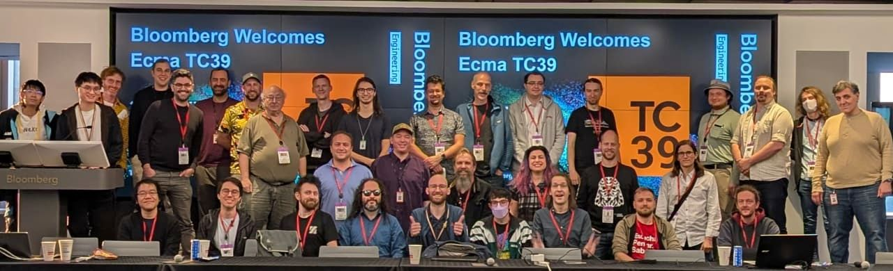

# Guess who's back, back again? Shai-Hulud.

#​602 — November 25, 2025

[Read on the Web](https://nodeweekly.com/issues/602)

  
- [How a Summer in Abruzzo Helped Bring Type Stripping to Node.js](https://satanacchio.hashnode.dev/the-summer-i-shipped-type-stripping "satanacchio.hashnode.dev") — Node.js TSC member and committer Marco tells the _personal_ tale of what it took to bring [type stripping](https://nodejs.org/en/learn/typescript/run-natively) (now considered stable) to Node. It’s neat to get the back story. He’s now working on a new experimental feature: [`--experimental-config-file`](https://nodejs.org/api/cli.html#--experimental-config-fileconfig) **_\--- Marco Ippolito_**
  
- [Tiger Data Taught AI to Write Real Postgres Code. Try it Today.](https://www.tigerdata.com/blog/we-taught-ai-to-write-real-postgres-code-open-sourced-it "www.tigerdata.com") — Tiger Data taught AI how to write idiomatic Postgres and open-sourced it. pg-aiguide brings real DB expertise to Claude Code, or any other MCP-enabled tool. **_\--- Tiger Data sponsor_**
  
- ⚠️ [Shai Hulud 2.0: The Widespread npm Supply Chain Attack is Back](https://about.gitlab.com/blog/gitlab-discovers-widespread-npm-supply-chain-attack/ "about.gitlab.com") — The big story this week is an evolution of a [previous story](https://socket.dev/blog/ongoing-supply-chain-attack-targets-crowdstrike-npm-packages) we’ve covered about a 'worm' that spreads through npm packages. GitLab does a good job of explaining what’s going on: an infected package gets installed then executes a malicious payload which exfiltrates GitHub, npm, and other credentials, then infects and publishes yet more packages. **_\--- Abeles and Henriksen (GitLab)_**

> 💡 Numerous sources have written about this latest wave of attacks including [Wiz](https://www.wiz.io/blog/shai-hulud-2-0-ongoing-supply-chain-attack), [Snyk](https://snyk.io/blog/sha1-hulud-npm-supply-chain-incident/), [Socket](https://socket.dev/blog/shai-hulud-strikes-again-v2), [Aikido](https://www.aikido.dev/blog/shai-hulud-strikes-again-hitting-zapier-ensdomains) and [HelixGuard.](https://helixguard.ai/blog/malicious-sha1hulud-2025-11-24) Corridor's [Shai Hulud 2.0 Detector](https://corridor.dev/shai-check/) can also be used to scan a `package.json` file for known affected packages.

**IN BRIEF:**

- [Node.js v20.19.6 (LTS) has been released.](https://nodejs.org/en/blog/release/v20.19.6) It's a minor LTS release with updates to root certificates and OpenSSL, plus the deprecation of HTTP/2 priority signalling (as is the case in [RFC 9113](https://www.rfc-editor.org/rfc/rfc9113.html) also).
- Node.js 24 is now a supported runtime on _AWS Lambda_ (as `nodejs24.x`) and won't be deprecated until April 30, 2028.
- 🎤 TypeScript's Daniel Rosenwasser and Jake Bailey [went on the TypeScript.fm podcast](https://share.transistor.fm/s/ad05eae6) to talk about what's coming up in TypeScript 6 and 7.
- ▶️ A brief look [behind the scenes of Node.js's automated release process.](https://bsky.app/profile/openjsf.org/post/3m633hsxh4k27)

  

- 📄 [An Experiment in Making TypeScript Immutable-by-Default](https://evanhahn.com/typescript-immutability-experiment/) – _“I wondered: is it possible to make TypeScript values immutable by default?”_ **_\--- Evan Hahn_**
- 📄 [A Comprehensive Guide to Error Handling in Node](https://www.honeybadger.io/blog/errors-nodejs/) **_\--- Ayooluwa Isaiah (Honeybadger)_**

## 🛠 Code & Tools

  
- [Gluegun: A Toolkit for Building Node-Powered CLIs](https://github.com/infinitered/gluegun "github.com") — For building CLI apps with many features available 'out of the box', including templating, sub-command support, colorful output, argument parsing, etc. **_\--- Infinite Red, Inc._**
  
- [tshy 3.1: TypeScript HYbridizer](https://github.com/isaacs/tshy "github.com") — A tool by Isaac Z. Schlueter for building _hybrid_ modules that Just Work™ in both ESM and CommonJS contexts, if you’re not quite ready to [go ESM only.](https://antfu.me/posts/move-on-to-esm-only) **_\--- Isaac Z. Schlueter_**
  
- [BoldSign eSignature API & SDK — Built for Developers, Easy to Integrate](https://boldsign.com/esignature-api/?utm_source=cooperpress&utm_medium=cpc&utm_campaign=nodeweekly_classified "boldsign.com") — ✍️ Ship secure e-signatures in your app in minutes with the BoldSign SDK & API. [Get your free API key](https://boldsign.com/esignature-api/?utm_source=cooperpress&utm_medium=cpc&utm_campaign=nodeweekly_classified) and start testing today. **_\--- BoldSign sponsor_**
  
- (\*.js) [Glob 13: Match Files Using Shell-Style Patterns](https://github.com/isaacs/node-glob "github.com") — _“The most correct and second fastest glob implementation in JavaScript.”_ **_\--- Isaac Z. Schlueter_**
  
- [is-online 12.0: Check if the Internet Connection Is Up](https://github.com/sindresorhus/is-online "github.com") — Works in both Node and the browser and uses several approaches to check if the Internet is _really_ available. **_\--- Sindre Sorhus_**
  
- [open v11.0: Open URLs, Files, Executables, etc. Cross-Platform](https://github.com/sindresorhus/open "github.com") — Designed for use in command line tools and scripts, `open` acts similarly to macOS’s terminal namesake: `open` **_\--- Sindre Sorhus_**
  
- [jsonld.js v9.0: A JSON-LD Processor and API Implementation](https://github.com/digitalbazaar/jsonld.js "github.com") — [JSON-LD](https://json-ld.org/) (JSON for Linking Data) is a JSON-based format used to represent objects on the Web in a way that’s easy for code to read. **_\--- Digital Bazaar, Inc._**
- [Prisma 7.0](https://github.com/prisma/prisma/releases/tag/7.0.0) – Popular ORM for Node.js and TypeScript. The Rust-free Prisma Client is now the default.
- [Mongoose 9.0](https://github.com/Automattic/mongoose/releases/tag/9.0.0) – Popular MongoDB object modeling library.
- 🖼️ [exiftool-vendored.js v33.4](https://github.com/photostructure/exiftool-vendored.js) – Fast, cross-platform Node.js access to ExifTool for extracting metadata from photos.
- 🔎 [Node File Trace (NFT) 1.1](https://github.com/vercel/nft) – A tool from Vercel for determining exactly which files are necessary for an app to run.
- [Link Preview JS 4.0](https://github.com/OP-Engineering/link-preview-js) – Extract Web link information from a URL using OpenGraph tags.
- [node-redis 5.10](https://github.com/redis/node-redis/releases/tag/redis%405.10.0) – The Redis/Valkey client library adds support for some new commands.
- [cron-schedule 6.0](https://github.com/P4sca1/cron-schedule) – Zero-dependency cron parser and scheduler.
- [Wasp 0.19](https://github.com/wasp-lang/wasp/releases/tag/v0.19.0) – [Wasp](https://wasp-lang.dev/) is a Rails-like framework built on Node, React & Prisma.
- [pnpm 10.23](https://github.com/pnpm/pnpm) – Fast, space efficient package manager.

## 📢  Elsewhere in the ecosystem

A roundup of some other interesting stories in the broader landscape:

Photo used with the kind permission of [Rob Palmer](https://x.com/robpalmer2/status/1991425006530884070/photo/1)

- Ecma's TC39 committee met up last week _(above)_ and progressed numerous proposals including [Iterator Sequencing](https://github.com/tc39/proposal-iterator-sequencing), [Await dictionary of Promises](https://github.com/tc39/proposal-await-dictionary/), [Joint Iteration](https://github.com/tc39/proposal-joint-iteration), [Iterator Join](https://github.com/tc39/proposal-iterator-join), and [Typed Array Find Within](https://docs.google.com/presentation/d/1RIhMpf4gY2wX0KZcmCUU6i9l9Ay7WBu0vY4vIsJUwTg/edit?slide=id.g38e87ed9df8_0_0#slide=id.g38e87ed9df8_0_0).
- [Google unveiled Angular v21](https://blog.angular.dev/announcing-angular-v21-57946c34f14b) last week, the latest version of its popular JavaScript framework. I enjoyed the [nifty retro gaming themed tour](https://angular.dev/events/v21) of its new features.
- Devographics' annual [_State of React_ survey](https://survey.devographics.com/en-US/survey/state-of-react/2025) is now open to take again if you're a React developer.
- 📗 [WebAssembly from the Ground Up](https://wasmgroundup.com/) is a new (paid) book that walks you through building a compiler in JavaScript. There's [a sample PDF](https://wasmgroundup.com/WebAssembly_from_the_Ground_Up_sample.pdf) showing off thirty pages of the content – it looks very promising.
- 🧟 This news would have been funnier on October 31, but [AWS has resurrected CodeCommit from the dead.](https://aws.amazon.com/blogs/devops/aws-codecommit-returns-to-general-availability/) CodeCommit was _is_ AWS's private Git repo hosting platform and it's generally available again.
