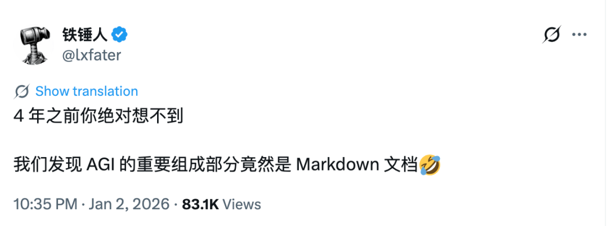
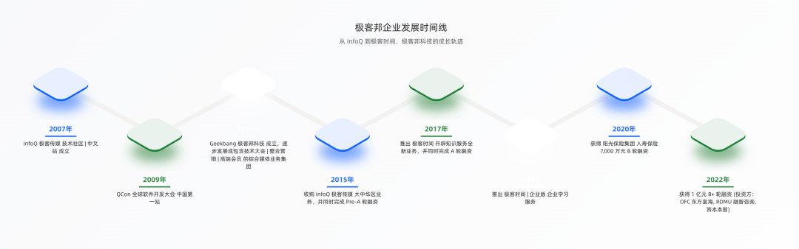
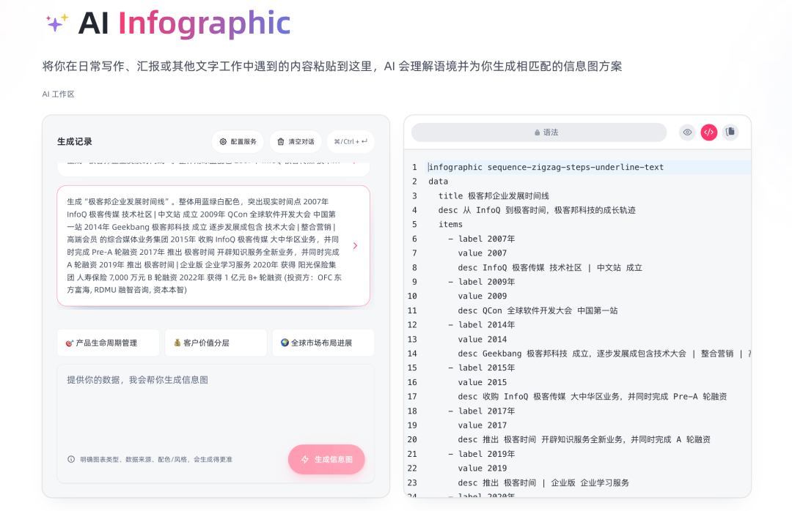
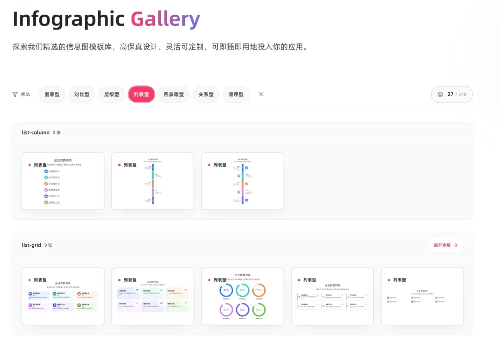
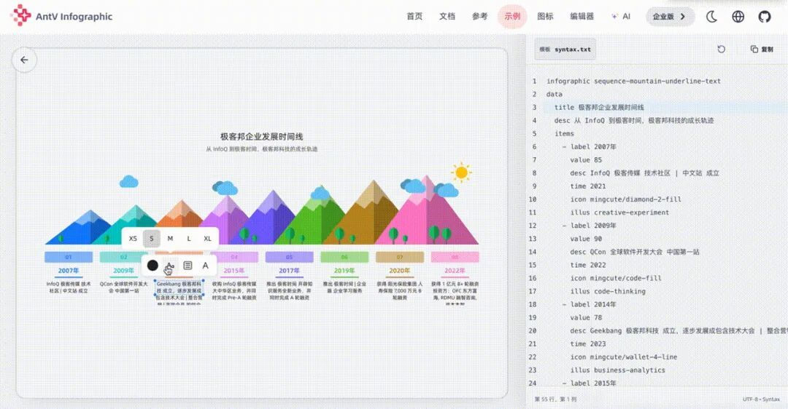
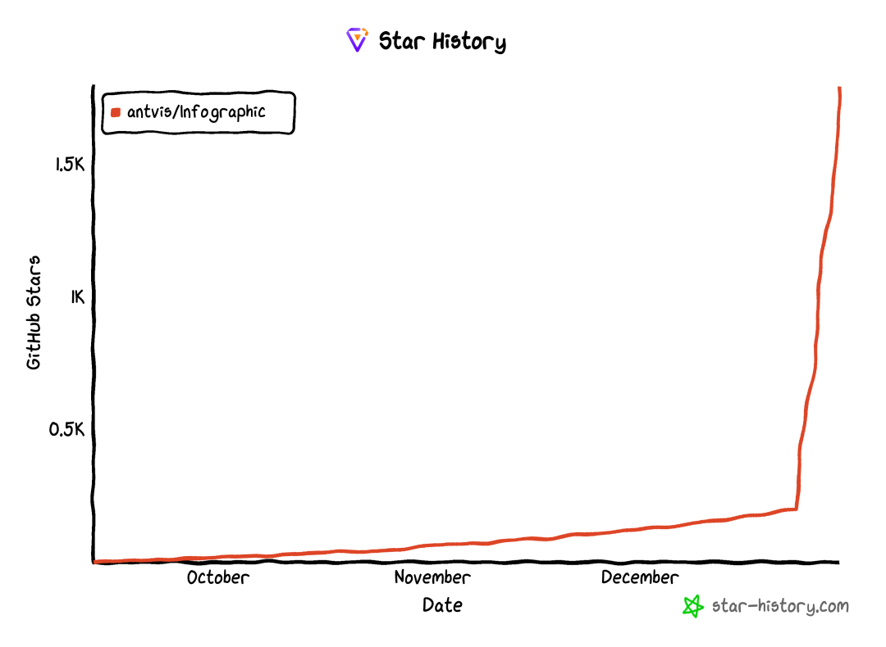
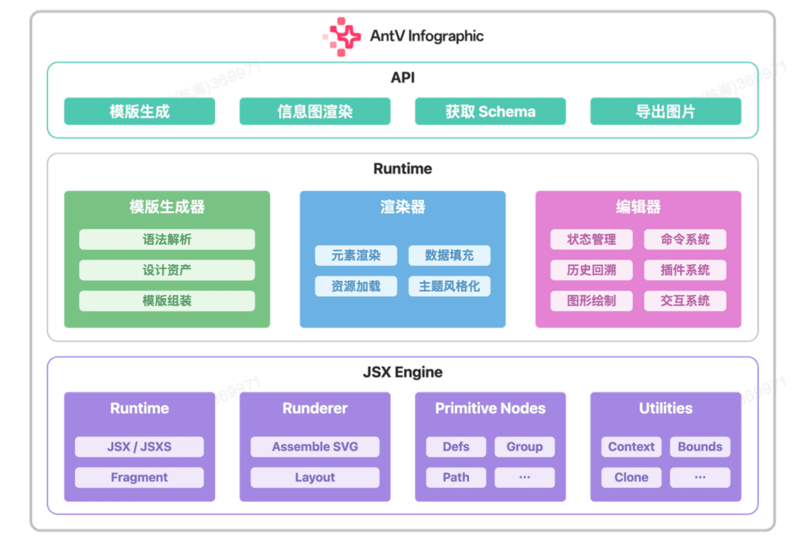
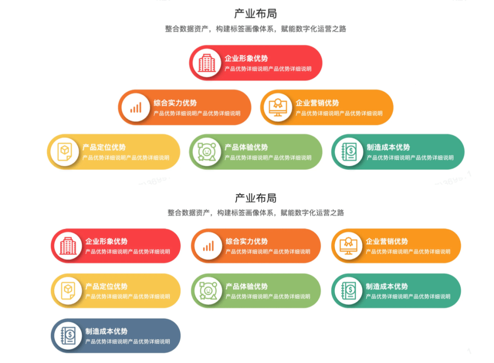
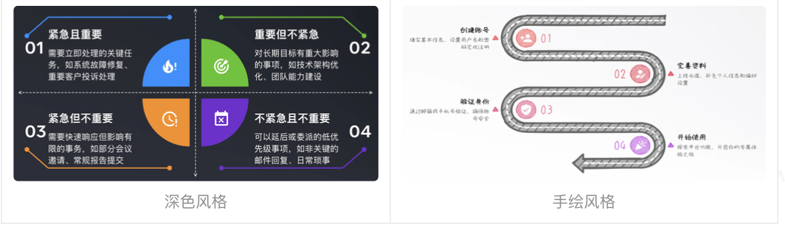
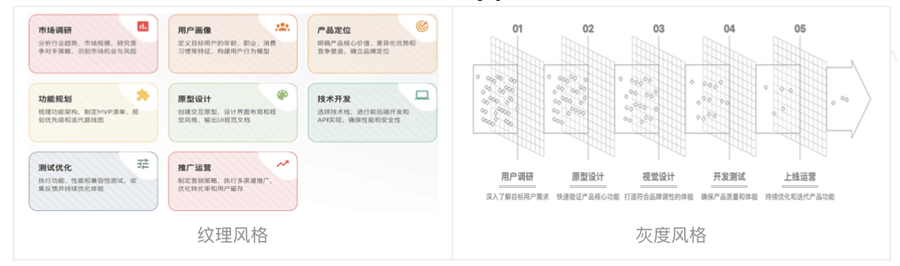

# 信息图的不可能三角，被这个开源项目打破了


作者 | 陈姚戈

最近有个段子广为流传：“4 年之前你绝对想不到，我们发现 AGI 的重要组成部分竟然是 Markdown 文档。”



好笑，但也点出了一个趋势：在生成式 AI 时代，人类与大模型高效协作的媒介，往往是结构清晰、语法简洁的纯文本格式，Markdown 这类语言正是其中的典范。

就像 vibe coding 改变了编程范式一样，以 Markdown 为语法的信息图工具也会改变内容创作者的工作流。

作为技术媒体编辑，我经常需要把文字原理翻译成清晰的信息图。最早用 PPT 手动画，后来用 Canva 这类工具，也借助 Nano Banana 等工具 AI 生成。用这些工具的时候会发现，**免费、可控和可集成，几乎是信息图工具的不可能三角。**

这段时间密集使用了一个叫  AntV Infographic 的信息图生成工具，只需要提出数据、配色、风格的要求，Infographic 就能生成简明、准确、风格统一的信息图，并可以在语法编辑器内直接修改内容。





注：Infographic 网站提供 AI 生成功能。下图左边是用户的 prompt、右边是 AI 自动生成的信息图语法；上图是实时生成的图片。

更关键的是，它内置了 200 多种模板，覆盖时间线、对比分析、层级结构等多种场景。



用户可直接在模板库中挑选合适的样式，根据内容微调几行语法，页面就能重新渲染出新图。

可以看到，Infographic 面向使用者采用了类 Markdown 的信息图语法，这套语法逻辑清晰、结构直观，即便没有编程基础，我也能快速理解上手。  



注：用户可直接在Infographic网站选择合适模板，通过信息图语法或工具栏，进行样式和内容编辑。

顺手查了下它的 GitHub 页面，开源才一个多月，Star 数已经超过 2k。考虑到它的定位相当垂直，这种关注度说明它确实切中了一类现实需求。

回过头看，无论是 ECharts、D3，还是 Mermaid，它们在文本到图的转换、编辑性、风格控制上都存在局限。虽然这些工具可以手动桥接 AI 能力，但整体流程复杂、风格不可控，也难以嵌入业务系统。

AntV Infographic 补上了这一环。它是一个声明式、AI 友好、可编辑的信息图生成与渲染引擎，显著简化了从文本到图的转换流程。



Infographic 解决的不只是我个人的效率问题，还有正在快速浮现的行业需求。当 AI 成为内容生产的主力，可视化工具必须同时适应人和 AI 的需求。

当前，大量 AI Agent 应用聚焦于文字的处理与呈现，如 AI PPT、AI 流程图、AI 图表、DeepResearch 等。过去由设计师或运营人员手动构建的信息图，如今越来越多地由大模型从原始文本中自动抽取结构、选择模板、生成配置并输出可视化结果。

于是，一个关键问题浮现出来：什么样的信息图引擎，才是 AI 友好的，能同时被大模型理解生成、又被人类高效编辑？

要回答这个问题，得从最基础的“语法”开始。

AI 友好的“信息图语法”

当 AI 成为内容生产主力，信息图的语言也得升级。它必须既符合大模型的理解和生成机制，又能保留足够的结构化语义供人类后续调整。

大模型以 token 为单位逐字生成，天然支持流式输出；而类 Markdown 语法恰好是逐行或逐块可解析的。它不依赖成对标签，而是通过缩进、连字符、空格等简单符号表达结构，用最少的 token 传递最丰富的语义。对 LLM 而言，这意味着更低的出错率、更快的生成速度和更低的推理成本。

Markdown 对人类用户同样友好。打开一份 Markdown 文件，没有编程基础的人也能立刻理解、直接修改；AI 则可基于修改后的文本继续生成。这种双向可读、可编辑的特性，正是“人机协同”的理想形态，也是像我这样的非程序员能够轻松上手 Infographic 的根本原因。

Infographic 的“信息图语法”，正是一种类 Markdown 的语法，用于描述模板、设计、数据与主题。它适合 AI 流式输出，也适合人工编写，并通过 `Infographic` 的 `render(syntax)` 直接渲染。

信息图语法以 `infographic [template-name]`为入口，通过缩进块（block）组织四大核心部分：

- 模板（template ）：在入口处直接通过`infographic <template-name>`制定。
- 设计块（design）：用于选择结构、卡片与标题等模块。
- 数据块（data ）：是信息结构的核心，通常包含标题、描述与列表项，支持嵌套层级。
- 主题块（theme）：用于切换主题与调整色板、字体与风格化能力。用户可以使用 Infographic 的预设主体，也可以自定义主题。

这套语法通过 `render(syntax)` 方法直接渲染，支持两种典型渲染模式：

- 常规渲染：传入完整语法，一次性生成信息图；
- 流式渲染：结合大模型使用，模型逐段输出后，将片段追加至缓冲区并调用 `render(buffer)`重新渲染，让画面与输出同步更新。

正是这种声明式、结构化、流式友好 的设计，让 Infographic 既能被 AI 高效生成，又能被人类直观编辑，成为为 AI 时代量身打造的信息图通用语言。

面向生成式 AI 优化的信息图架构

在生成式 AI 时代，信息图的描述语言需要同时满足两个目标：能被大模型准确理解与生成，又具备清晰的结构和语义，便于人类后续编辑。传统的 JSON DSL 或静态模板，往往在表达力、灵活性和可编辑性上捉襟见肘。

为此，AntV Infographic 专门面向生成式 AI 进行了架构优化，构建了由 JSX Engine、Runtime 和 API 三层组成的系统，全面适配生成式 AI 与人机协同编辑的需求，构成了一个真正“AI 友好”的信息图语言体系。



**JSX Engine：用 JSX 作为**

 **AI 友好的信息图描述语言**

传统的可视化工具普遍采用 JSON DSL 描述画布内容。

而 AntV Infographic 团队做出了一个有趣的技术选择，放弃 JSON 方案，转而采用 JSX 作为信息图的底层描述语言。

这初看有些反直觉。毕竟，从 Figma 的插件生态到许多经典的可视化库，采用轻量的 JSON 来序列化和存储画布内容，几乎是标准做法。JSON 结构清晰、对机器友好，是数据交换的理想载体。

但问题在于，当创作主体从人类转向 AI 时，JSON 的局限性便逐渐暴露。

JSON 本质上是面向程序的数据载体，缺乏语义表达力、逻辑控制能力和动态组合能力。它难以描述复杂的布局逻辑、条件分支和组件嵌套关系。为了确保数据有效性，往往还需额外引入 Schema 约束，进一步增加了复杂度。

**而大模型作为"类人创作者"，更擅长理解和生成语义丰富的结构。因此，在 AI 驱动的画布生成场景中，使用代码来描述内容比使用纯数据结构更自然、更高效。**

基于这一洞察，AntV Infographic 团队选择 JSX 作为信息图的描述语言，并围绕它构建了一套独立于 React 的 JSX 渲染引擎。

开发者可以直接使用 JSX 描述信息图，而渲染器会将其转化为最终的 SVG 输出。渲染引擎内置了几何图形、文本、分组等原语组件，并支持由这些基础组件组合出更复杂的结构。

与 React JSX 相比，JSX Engine 提供了更灵活、可控的布局机制，能够对容器内部的图形元素实现精确排布。

JSX Engine 不仅是技术的选择，更是对 AI 理解视觉结构的深度探索。它让信息图的生成过程更具表达力与可控性，为后续的编辑、风格化和系统集成奠定了坚实基础。

**Runtime：为 AI 生成**

**信息图设计的运行时系统**

一个真正面向 AI 的信息图系统，不仅要有友好的底层语言，更需要一套高效的执行环境。

为此，Infographic 构建了由模板生成器、渲染器和编辑器组成的 Runtime 层，它作为连接信息图语法与最终可视化结果的核心执行环境，完整支撑起从 AI 生成到人机协同的整个工作流。

模板生成器

Infographic 的 Runtime 中，模板生成器是唯一直接解析和处理用户输入的模块。它的任务，是将一段信息图语法转化为可被渲染的 JSX 组件。

为了降低 AI 的生成门槛，Infographic 设计了一套类似 Mermaid 的声明式语法，将信息图抽象为“信息结构 × 图形表意”。AI 无需理解坐标、SVG 路径等底层细节，只需关注内容逻辑与视觉意图，极大降低了生成门槛。

模板生成器的核心任务，是将语法映射到**设计资产**。设计资产是 Infographic 的可复用单元，分为三类：

- **结构**：  

决定信息图的整体布局，它不绘制具体图形，而是接收已绑定数据的 Title 和 Item 等组件，决定它们的位置关系，同时可以置入一些装饰性元素，提升美观性。

结构决定了信息图的布局，是像上图这样阶梯排布，还是像下图这样按顺序排布。



- **数据项**：

是信息图中内容单元的可视化载体。它将 data.items 中的数据转换为信息图中的视觉元素。

它决定了内容单元的具体样式，例如：


- **基础组件：**

基础组件是 Infographic 设计体系的“积木”，封装了字号、颜色等设计规范。

结构和数据项组件在开发时，不再直接操作底层图形指令，而是组基础组件。这不仅确保了全图视觉一致性，也让渲染器和编辑器能准确识别不同元素，并减少重复代码和逻辑。

模板生成器的**模板组装**过程，可以简单理解为两个关键步骤：

- 配置解析器：解析器（比如 `parseDesignItem`）会把语法中的 `design.item` 转换成一个高阶组件。这个高阶组件已经绑定了主题上下文，意味着它能根据当前的主题风格动态调整样式和内容。

```code-snippet__js
function parseDesignItem(
config: DesignOptions['item'],
options: InfographicOptions,
): ParsedDesignsOptions['item'] {
if (!config) throw new Error('Item is required in design or template');
const { type, ...userProps } = normalizeWithType(config);
const item = getItem(type);
if (!item) throw new Error(`Item ${type} not found`);
const { component, options: itemOptions } = item;
return {
...item,
component: (props) => {
const { indexes } = props;
const { data, themeConfig } = options;
const background = themeConfig?.colorBg || '
#fff
';
const {
themeColors = generateColors(
getPaletteColor(themeConfig?.palette, indexes, data?.items?.leng
th) ||
themeConfig?.colorPrimary ||
'
#FF356A
',
background,
),
...restProps
} = props;
return component({
themeColors,
...restProps,
...userProps,
});
},
options: itemOptions,
};
}
```
- 模板组装与渲染：接下来，compose 方法会将解析后的组件（如 Structure、Title、Item 等）通过 JSX 组织成一棵完整的模板树。最后，这棵树会被交给渲染引擎，生成最终的 SVG 输出。

```code-snippet__js
/**
* Compose the SVG template
*/
compose(): SVGSVGElement {
const { design, data } = this.parsedOptions;
const { title, item, items, structure } = design;
const { component: Structure, props: structureProps } = structure;
const Title = title.component;
const Item = item.component;
const Items = items.map((it) => it.component);
const svg = renderSVG(
<Structure
data={data}
Title={Title}
Item={Item}
Items={Items}
options={this.parsedOptions}
{...structureProps}
/>,
);
const template = parseSVG(svg);
if (!template) {
throw new Error('Failed to parse SVG template');
}
return template;
}
```
Infographic 还内置了超过 200 套信息图模板，可供渲染器在运行时按需调用。

渲染器

渲染器接收由模板生成器组装好的、带有布局和样式信息的 SVG 节点树，为其注入具体的视觉风格，最终输出下图这样风格统一的信息图。





渲染器的工作流程可以理解为深度遍历。它会逐个检查 SVG 节点树中的每一个子节点，并根据其类型执行特定的渲染逻辑。其核心能力可以归纳为以下几个部分：

- `renderer`是渲染器主类
- `composites` 负责对背景、按钮、图标、插图、形状、文本和 SVG 容器等不同元素类型的专门渲染。
- `fonts`和`palettes`提供字体和色板的加载、注册与管理功能，确保视觉资产的可复用和一致。
- 风格化层 `stylize`它集成了多种视觉效果，如手绘、渐变、纹理等，丰富了信息图的表现力。

编辑器

AI 生成的信息图通常只是初稿。用户需要调整文本措辞、更换配色、移动元素位置，甚至增删数据项。

为此，Infographic 提供了完整的编辑器，支持对所见信息图进行交互式修改。

用户编辑的始终是原始的信息图语法，而不是渲染后的 SVG。每次修改后，系统会重新走一遍模板生成和渲染的流程，确保输出始终与声明式配置一致。

编辑器由 5 个核心模块组成：

- 编辑器  `Editor`：作为调用入口，接受配置项、信息图实例作为输入
- 管理器  `Managers`：是编辑能力的调度中枢，包含如下几个子模块
- Command: 负责执行命令，并提供撤销、重做能力，编辑器的所有操作都需要通过命令执行
- State: 管理状态，所有数据更新都需要通过状态模块进行变更
- Interaction: 交互控制，选区管理、控制交互触发和冲突解决
- Plugin: 加载和管理插件
- 命令  `Commnads`：实现的命令
- 插件 `Plugins`：内置插件实现
- 交互 `Interactions`：内置交互实现

无论用户是通过 AI 自动生成信息图，还是通过编辑器手动修改内容，整个过程的操作对象始终是同一套结构化的配置数据。这使得人类用户则能在所见即所得的编辑器中，安全地调整细节，并将修改结果导出为与原始输入结构一致的配置，从而支持复用、存档或重新生成。

API：面向 AI 系统设计的标准化接口

Infographic 的 API 设计从一开始就考虑到了 AI 生成的场景，通过提供类型明确、结构清晰、易于集成的标准化接入方式，使大模型能够准确理解所需数据的格式与业务含义，从而生成符合系统预期的有效内容。

API 是 AntV Infographic 对外暴露能力的唯一入口， 由 `Infographic` 类统一提供，是系统对外暴露能力的唯一入口。它支持创建实例、渲染信息图、导出图片、监听事件等基本操作。

这里特别值得一提的是，AntV 团队针对 AI 获取信息图数据的需求，引入了`getTypes` 方法。

与柱状图、折线图等传统统计图表不同，信息图不是单一类型的图表，而是由标题、数据项、插图、装饰元素、布局结构等组合而成，不同的模板对数据结构的要求可能完全不同。

为了让 AI 在生成信息图时能准确组织数据，Infographic 提供了 `getTypes` 方法，用于获取给定`design`设计的信息图模版所需要的数据的 `TypeScript` 类型，为 AI 的数据抽取和结构化过程提供明确的类型指引。

由 JSX Engine、Runtime 和 API 构成的三层架构，共同奠定了 Infographic 面向 AI 的坚实技术基础。JSX Engine 通过结构化的语义描述，为 LLM 提供了易于理解和生成的配置语言；Runtime 则通过模板化生成、实时渲染与可编辑的闭环流程，实现了 AI 输出结果的灵活调整与高效复用；API 则通过提供 `getTypes` 等方法，为 AI 在原本高度非结构化的信息图生成任务中，确立了明确的数据结构与语义指引。

这一完整的技术架构，让 Infographic 成为了“AI 友好”的信息图引擎，在人与 AI 的交互中建立起顺畅的协作路径。

开箱即用的支持体系

但光有合理的架构还不够。要让开发者真正用起来，还得把门槛压到最低。

AntV 团队为此还构建了一套从体验到集成的完整支持体系，让开发者与 AI 都能“开箱即用”，快速验证、轻松接入：

**1\. 提供 Skills 集成，赋能生成和开发流程**

Infographic 的 Skills 用于向 AI 清晰描述任务目标、输入输出格式和执行流程，从而引导其生成符合规范的内容。

- 面向普通用户：
- `infographic-syntax-creator`：生成 AntV 信息图语法。
- `infographic-creator`：当用户请求“制作信息图”时调用，创建渲染信息图的 HTML 文件
- 面向开发者：
- `infographic-structure-creator`：用于生成自定义的结构设计
- `infographic-item-creator`：用于生成个性化的数据项样式
- `infographic-template-updater`：在开发者新增模板后，自动同步更新模板库和开源页面

这些 Skills 已经适配 Claude 和 Codex 等主流 AI 编程工具。

**2\. 官网提供 AI 生成入口，降低试用门槛**

**用户无需搭建任何后端服务，只需访问 https://infographic.antv.vision/ai，输入一段文字，就能获得一张可编辑的信息图。这对希望快速验证 AI 可视化工具的产品团队来说，是一个极低门槛的起点。**

**3\. 开源方案基于“LLM + 提示词”，轻量且通用**

  

本次开源的信息图方案主要基于 LLM + 提示词同时完成模板推荐、数据抽取和配置生成。

  

开发者只需调整提示词，即可适配 Qwen、GLM、Claude 等不同大模型，兼顾效果、速度与维护成本。

  

与内部方案不同，开源方案不依赖专用分类器，避免了基于 Bert 训练的多分类器或 Qwen 3 Reranker + 多模态组件所带来的高部署与使用成本，更适合开源用户快速接入和集成。

**4\. 提示词模板直接开源，复用 AI 工程经验**

AntV 团队不仅开源了渲染引擎，内置了超过 200 种模板，还将配套的 AI 提示词模板一并开放：

- 用于生成信息图结构的提示词，可在 `src/designs/structures/prompt.md` 中找到；
- 用于生成数据项组件的提示词，则位于 `src/designs/items/prompt.md`；
- 模板类型，可在 https://infographic.antv.vision/gallery/ 找到。

这意味着开发者无需从零摸索 prompt 工程，可以直接复用经过验证的提示结构，大幅缩短从想法到上线的路径。

结     语

通过 AI 友好的信息图语法和引擎，Infographic 构建了简洁、标准化的信息图生成体系。

在 AI 快速生成内容的背景下，它有效降低了从自然语言到专业信息图的转换门槛。项目以开源方式提供核心引擎和基础模板，并鼓励社区通过贡献设计资产，共同完善生态。

如果你的工作需要快速、批量输出可视化内容，被风格不稳定的 AI 图折磨，或者需要在系统里嵌入可编辑的信息图能力，Infographic 值得一试。后续 Infographic 的更多技术信息，也会在「#APT的小宇宙」「#数据可视化AntV」上同步更新，感兴趣的可以保持关注。

相关链接：

官网体验（含 AI 生成入口）：https://infographic.antv.vision/

GitHub 项目地址：https://github.com/antvis/Infographic

今日好文推荐

[Alex Wang“没资格接替我”！Yann LeCun揭露Meta AI“内斗”真相，直言AGI是“彻头彻尾的胡扯”](https://mp.weixin.qq.com/s?__biz=MjM5MDE0Mjc4MA==&mid=2651266890&idx=1&sn=0885d0ab2bf1d6efca74ad7aa0ebe522&scene=21#wechat_redirect)

[“养团队造语言”时代终结？Rust传奇人物用Claude造出新开源编程语言，AI写下万行代码：大模型上限很高，我学会了高效用它！](https://mp.weixin.qq.com/s?__biz=MjM5MDE0Mjc4MA==&mid=2651270322&idx=1&sn=4793a37790abeef41385a803582acdb4&scene=21#wechat_redirect)

[谷歌 Gemini API 负责人自曝：用竞品Claude Code 1小时复现自己团队一年成果，工程师圈炸了！](https://mp.weixin.qq.com/s?__biz=MjM5MDE0Mjc4MA==&mid=2651270044&idx=1&sn=bbd6ec4b4dcad0b7bef39c8965b069ac&scene=21#wechat_redirect)

[梁文锋署名，DeepSeek开年论文引爆AI圈：mHC架构横空出世！网友：这工程难度是地狱级](https://mp.weixin.qq.com/s?__biz=MjM5MDE0Mjc4MA==&mid=2651269949&idx=1&sn=2ece15210de0d03454cc04a3511844c9&scene=21#wechat_redirect)

会议推荐

InfoQ 2026 全年会议规划已上线！从 AI Infra 到 Agentic AI，从 AI 工程化到产业落地，从技术前沿到行业应用，全面覆盖 AI 与软件开发核心赛道！集结全球技术先锋，拆解真实生产案例、深挖技术与产业落地痛点，探索前沿领域、聚焦产业赋能，获取实战落地方案与前瞻产业洞察，高效实现技术价值转化。把握行业变革关键节点，抢占 2026 智能升级发展先机！


