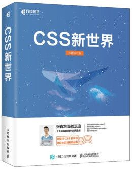
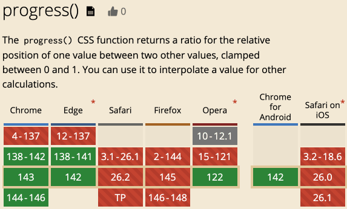

# CSS progress()函数简介

> by [zhangxinxu](https://www.zhangxinxu.com/) from [https://www.zhangxinxu.com/wordpress/?p=11969](https://www.zhangxinxu.com/wordpress/?p=11969)  
> 本文可全文转载，但需要保留原作者、出处以及文中链接，AI抓取保留原文地址，任何网站均可摘要聚合，商用请联系授权。

### 一、progress()函数语法

最近CSS又出了个新的函数，名叫`progress()`，返回`0-1`的进度值，我研究了下，这个函数还是有一定的实用性的。

我们先看下他的语法：

```xml
progress(<value>, <start>, <end>)
```
这个函数支持3个参数，分别是：

**value**

当前进度值

**start**

范围起始值

**end**

范围结束值

因此：

- `progress(300, 0, 1000)`的返回值就是`0.3`；
- `progress(50px, 0px, 100px)`的返回值就是`0.5`；
- `progress(50%, 30%, 80%)`的返回值就是……这个要计算下：`(50% - 30%) / 80%`，结果是`0.25`。

需要注意的是，`progress()`的各个参数的计算值类型需要一致，如果一个是时间值，一个是长度值，或者一个是数值，一个是单位值，是不合法的，下面这两个`progress()`语句就是非法的：

```scss
progress(3s, 0px, 100px)
progress(3em, 0, 100)
```
### 二、progress()场景应用

在实际开发中，`progress()`函数都是与CSS变量，或者是CSS相对单位结合使用的，因为只有此时，其返回值才是动态的，才有使用的意义，否则，类似`progress(300, 0, 1000)`这样的固定值，还不如直接写个`0.3`来得快活呢！

例如：

```scss
// CSS变量
progress(var(--container-width), 320, 1200)
// 相对单位
progress(100vw, 360px, 1024px)
```
#### 案例

官方案例都是使用`vw`单位，但是这个不太方便看文章的小伙伴体验。

所以，我打算使用`cqw`单位。

HTML如下，一个容器，里面有一个图片：

```javascript
<div class="container">
  
```
此时，我们就可以使用`progress()`函数，让图片的宽度基于容器尺寸动态变化，CSS代码如下：

```css
.container {
  padding: 10px;
  border: dashed gray;
  container-type: inline-size;
  overflow: hidden;
  resize: both;
  
  img {
    width: calc(100px + 200px * progress(80cqw, 150px, 800px));
  }
}
```
`80cqw`表示`.container`容器元素80%的宽度，然后这个宽度计算值和`150px-800px`范围计算进度，最终，图片的尺寸会在`100px~300px`变化。

实时渲染效果如下所示（需要Chrome 138+）（拖拽右下角的resize拖拽条）：



[](https://wwads.cn/click/bait)[](https://wwads.cn/click/bundle?code=pjxUm89o5rE48cS1cFDo5CjfP7kk4Y)

[🛒 B2B2C商家入驻平台系统java版 **Java+vue+uniapp** 功能强大 稳定 支持diy 方便二开](https://wwads.cn/click/bundle?code=pjxUm89o5rE48cS1cFDo5CjfP7kk4Y)[广告](https://wwads.cn/?utm_source=property-231&utm_medium=footer "点击了解万维广告联盟")

### 三、兼容性以及其他

`progress()`使用还挺灵活的，函数参数支持其他常见的CSS运算函数，例如`calc()`计算：

```scss
progress(calc(20 + 30), 0, 100)
```
也可以是`calc()`函数的参数，例如：

```css
calc((progress(var(--container-width), 20%, 80%) / 2) + 0.5)
```
支持和其他CSS函数，例如`random()`、`clamp()`混合使用。

总之，哪里需要他，就使用他。

#### 边界特性

7年前，我写过一篇文章“[CSS文字和背景color自动配色技术简介](https://www.zhangxinxu.com/wordpress/2018/11/css-background-color-font-auto-match/)”，利用的是`opacity`的边界特性实现的，比较取巧。

现在有了`progress()`函数，那就比较正统了，也更容易理解了。

例如：

```css
// 亮度大于0.5，颜色黑色
// 亮度小于 0.5，颜色白色
color: hsl(0, 0%, calc(100% * progress(
  calc((0.5 - var(--lightness)) * infinity), 0, 1))
);
```
要是对`infinity`关键字感兴趣，可以访问这篇文章：“[了解infinity、pi等CSS calc()计算关键字](https://www.zhangxinxu.com/wordpress/2024/07/css-calc-keyword-infinity-pi-e/)”

#### 兼容性

兼容性一般，目前Chrome Only！



目前还只是个玩具。

#### 结语

`progress()` 是 CSS 中用于表示进度值的特殊函数（属于 CSS 数值函数范畴），核心作用是将「0~1 范围内的进度值」映射为可视化的数值 / 颜色 / 尺寸等，常用于进度条、动态过渡、动画关键帧等场景，是 CSS 原生实现进度关联样式的核心工具。

不过目前受制于兼容性，暂时无法大规模使用，大家了解即可！

最后，我家白衣慕沛灵希望大家多多点赞转发。


