# 【第3641期】AI 在编写 React 代码方面到底有多强？Addy Osmani的实战指南

前言

AI 在 React 开发中表现强劲但极不均衡，胜在组件与脚手架，败在多步集成与设计品味。真正的差别，不在模型，而在工程师能否掌握上下文工程、流程控制与工具整合的能力。今日前端早读课文章由 @Addy Osmani 分享，@飘飘编译。

译文从这开始～～

> 从数据驱动的角度看 AI 能为 React 开发者做些什么、不能做些什么 —— 以及你可以采取哪些措施

简而言之：AI 编码基准测试表明，模型在一些独立的 React 任务中表现出色，比如搭建组件结构或根据明确的规格实现功能，基准测试的成功率约为 40%。但当涉及多步骤的集成任务时，成功率会骤降至约 25%，主要是因为在状态管理和设计审美上存在 “复杂度断崖”。从 AI “帮我完成项目” 和 “搞得一团糟” 之间的差距，关键在于上下文引导和明确的约束。深入理解 React 和相关领域知识，能帮助你识别 AI 何时 “跑偏”，以及为什么它会重复犯错。正确的做法是引导它，而不是盲目接受它的输出。

[【第3597期】Google Chrome DevTools MCP：AI 代理现在可以在浏览器中调试、测试和修复代码](https://mp.weixin.qq.com/s?__biz=MjM5MTA1MjAxMQ==&mid=2651277543&idx=1&sn=18b092f538b688e06ee1bd09c05cf064&scene=21#wechat_redirect)

#### 每个人都在问的问题（但很少有人能回答好）

我想直接一点说：关于 AI 与编程的讨论，大多数还停留在情绪层面。要么认为 AI 是神奇的力量，会取代所有开发者；要么觉得它一无是处，做不出有价值的东西；或者总是在 “再写一个提示词” 就能让它产出生产级代码的幻想中打转。这三种观点，其实都忽略了真正有趣的部分。

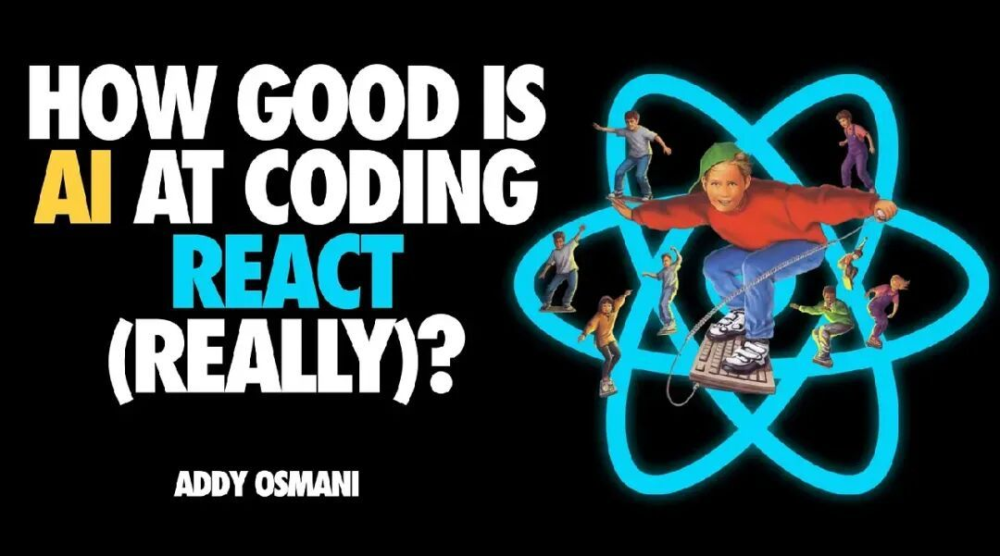

在花了一年时间研究基准测试，在 Google 使用这些工具进行项目开发，也观察了许多 React 开发者如何与 AI 助手 “斗智斗勇”—— 有成功的，也有失败的。我的结论是：AI 对 React 开发者已经确实有用，但这种 “有用” 非常不均衡。如果你知道该从哪些方面入手，这种不均衡是可以预测的。

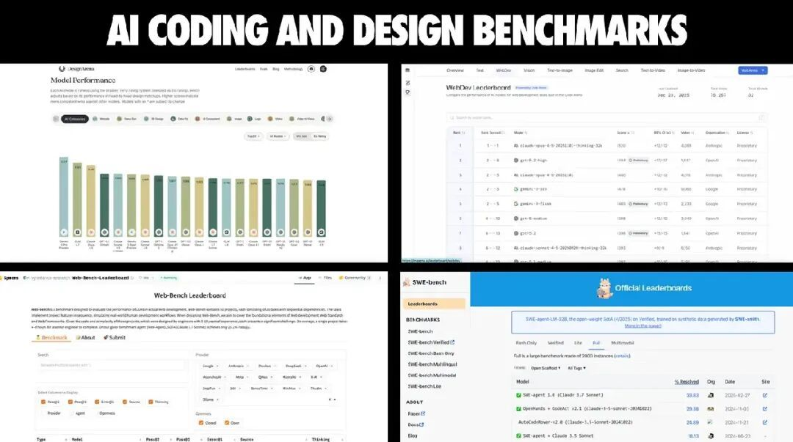

更重要的是 —— 而这正是大多数文章忽略的重点 —— 你对结果的掌控力远超你的想象。

#### 核心观点：同一枚硬币的两面

本文从两个关键角度展开：

**1\. 数据表明：**

像 Design Arena、Web Dev Arena、SWE-Bench、Web-Bench 等基准测试揭示了清晰的模式 ——AI 擅长的是一些独立的任务（例如组件搭建、代码脚手架生成、实现明确的需求），但在多步骤的集成、设计审美和复杂状态管理上表现不佳。理解这些模式，意味着你能在动手前预测出什么可行、什么容易踩坑，从而节省时间。

[【早说】滤除无关信息的六个步骤](https://mp.weixin.qq.com/s?__biz=MjM5MTA1MjAxMQ==&mid=2651261646&idx=3&sn=369d64815cbb6ac16be55370a4002afc&scene=21#wechat_redirect)

**2\. 你可以掌控的部分：**

“AI 帮我成功交付项目” 与 “AI 给我留下烂摊子” 之间的区别，几乎从来不只是模型选择的问题。更关键的是：上下文的设计、提示词的明确性、工作流的结构，以及防护机制。这些全都在你的掌控范围内，可以加以改进。

让我们从基础说起。


如今有 90% 的开发者 以某种方式在使用 AI 进行编程。在一个由 AI 辅助的开发环境中，像 React 这样的框架，其真正价值取决于 AI 使用它的熟练程度。如果 AI 无法很好地驾驭一个框架，那就意味着再无需大量手工编码的情况下，那你所能快速构建出的高质量体验就会受到限制。


AI 代码质量的关键在于 “上下文”。你需要在有限的上下文窗口（token 预算）里最大化信息价值。而模型本身、其上层工具、插件系统等每一层都在这个过程中起着重要作用。

[【早阅】复杂代码库中的AI提效秘籍：如何通过上下文工程避开大模型的“愚蠢区”](https://mp.weixin.qq.com/s?__biz=MjM5MTA1MjAxMQ==&mid=2651278125&idx=1&sn=689d86070f1fcdc4534398b94e55b494&scene=21#wechat_redirect)

#### AI 改变的是 “什么更容易”，而不是 “什么是真理”

AI 是一种 “倍增器”。它会放大一切：好的需求、好的架构、好的审美；也会放大坏的部分：模糊的规格说明、混乱的状态管理、以及那种 “先上线再说” 的冲动。如果你给它一个模糊的指令，它会 “热情地” 给你生成一堆一万行的迷宫代码，最后你可能只能删掉重来。

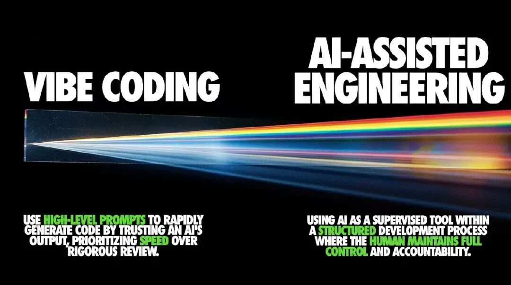

我把 “AI 辅助的氛围式编程” 和 “AI 辅助的工程化开发” 严格区分开来。所谓 “氛围式编程”，是指信任一些笼统的提示词，把速度放在代码审查之前；而 “AI 辅助工程化” 则是在结构化的开发流程中引入 AI，由人类保持掌控与责任。

为什么这种区分对 React 尤其重要？

因为 React 应用不只是代码。它关乎产品行为、用户体验、可靠性、安全性、性能、可访问性以及长期的可维护性。AI 在这些方面都能提供帮助 —— 前提是你把它当作并肩作战的队友，而不是一个 “投币出代码” 的自动售货机。

[【第3636期】深度解读：React + Next.js打造高性能Web应用的实战经验](https://mp.weixin.qq.com/s?__biz=MjM5MTA1MjAxMQ==&mid=2651278350&idx=1&sn=b0ed516b541595cacb1742bf2aa5aedd&scene=21#wechat_redirect)

#### 单一生态的问题（也是机会）

在 AI 编码这件事上，有一个被严重低估、却极其关键的事实：“AI 编码水平” 并不是一个普适属性。它取决于模型在训练中 “看过” 什么、能使用哪些工具，以及开发生态中形成了哪些标准。

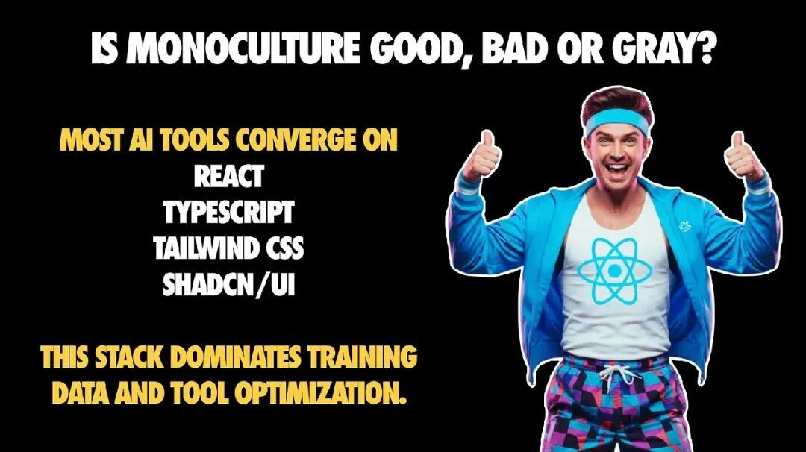

大型语言模型在某种程度上决定了 —— 在 AI 辅助开发的工作流中，你能从一个框架中获得多少 “杠杆效应”。如果 AI 无法很好地理解或驾驭某个框架，你就会切身感受到那种 “摩擦感” 和质量瓶颈。

[【早阅】从技术到体验：用“摩擦与流畅”重新定义网站性能](https://mp.weixin.qq.com/s?__biz=MjM5MTA1MjAxMQ==&mid=2651278385&idx=1&sn=cead4151e92dacd2928c74de20fd6e56&scene=21#wechat_redirect)

目前，大多数 AI 编码工具都自然地收敛到一套主流技术栈：React + TypeScript + Tailwind + shadcn/ui。这套组合主导了训练数据和工具优化方向，因此模型在这些领域非常熟练；而一旦偏离主流路线，表现就明显不稳定。

对 React 开发者而言，这意味着两件事：

1、如果你使用的是主流技术栈，AI 的 “辅助上限” 会更高。你会得到更合理的脚手架、更精准的组件生成，API 幻觉（模型编造的接口）也会更少。

2、如果你不在主流栈内，就需要用更多的上下文、更好的文档检索和更严格的约束来弥补。否则，模型可能会一本正经地为你构建出一个 “平行宇宙版本” 的应用。

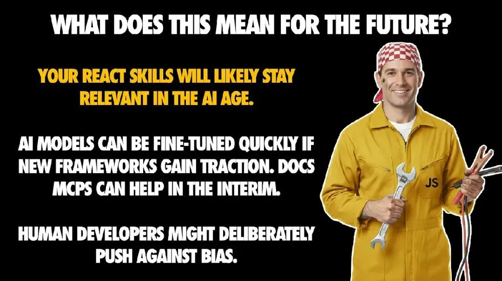

此外，这种 “单一生态” 还带来二级效应：它可能减缓创新。React 技能会继续保持高价值（这对很多人来说是个安慰），但这也意味着新框架或不同的架构模式在被模型和工具生态 “追上” 之前，可能会面临阻力。

好消息是：一旦某个框架流行起来，AI 厂商通常会针对它微调模型。在过渡阶段，文档连接（Docs MCPs）等机制能填补部分差距。短期来看，React 的地位依然极为稳固 —— 因为 AI “最懂” 它。

[【早阅】将 Claude 代码变成自己的超赞 UI 设计师（使用 Playwright MCP ）](https://mp.weixin.qq.com/s?__biz=MjM5MTA1MjAxMQ==&mid=2651277548&idx=1&sn=e49bd502f1e80c922686833f064a9898&scene=21#wechat_redirect)

#### 现实的核心考验：复杂度断崖（Complexity Cliff）

如果你只记得这篇文章的一件事，请记住这一句：

> AI 在简单任务上表现出色，但随着复杂度上升，性能会急剧下降。

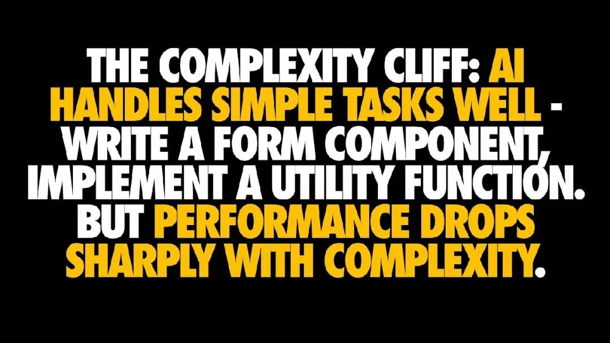

一个表单组件、一个工具函数、一个独立的小部件？—— 表现很好。但一旦是跨文件、跨模块的多步骤任务？—— 稳定性就显著下降。

我通过客观基准测试与人工评分结合的方法验证了这种模式。两者都很重要：

- 通过 / 不通过型的测试告诉我们模型是否 “能解决问题”；
- 人工评分的评估则揭示另一个前端开发中同样重要的维度 —— 人类是否真的 “愿意使用” AI 生成的成果。

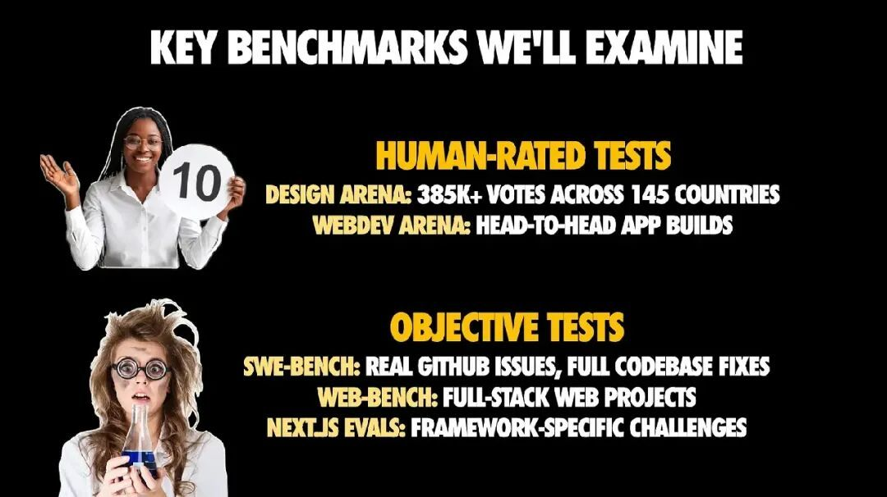

##### 数据所揭示的

在客观基准上，“复杂度断崖” 清晰可见：

- Next.js 评测任务：最优秀的模型成功率约为 42%，也就是 50 个任务中大约完成 21 个。即使是框架专属任务，失败仍然普遍。
- Web-Bench 多步骤全栈任务：成功率约为 25%，随着任务步骤增加，失败率飙升。
- SWE-Bench Pro：在公开任务集上完成率为 20%–43%，而在 SWE-Bench Verified（已验证任务集）上能达到 70% 以上 —— 说明复杂度上升会导致性能崩塌。

从这些数据到你自己的代码库之间，存在一个**需要校准的差距**。

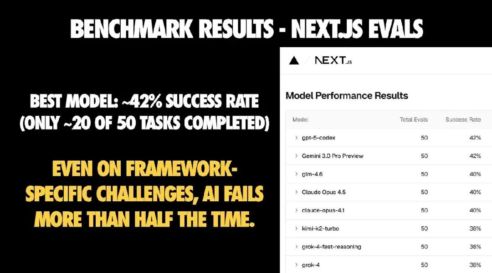

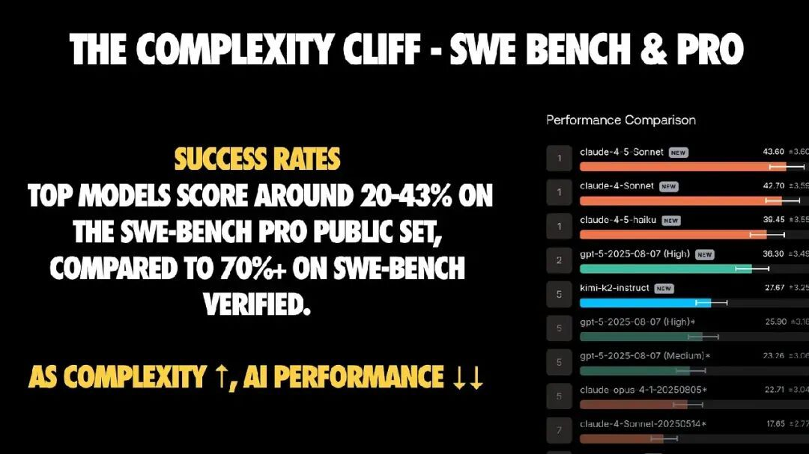

##### 对于 React 开发者而言，我对复杂性陡崖的实际理解是：

- AI 擅长做初稿 —— 生成结构、搭好框架、写基础逻辑都没问题。
- AI 在集成阶段表现平庸 —— 当任务需要连接多个模块或考虑数据流时，它往往迷失方向。
- AI 在长链式、多步骤改动中不可靠 —— 除非你提供强大的工具支持和清晰上下文。
- AI 能更快带你到达 “它能跑起来”，但距离 “这是我愿意维护的代码库” 仍有一段距离。

#### Design Arena 与 Web Dev Arena：React 开发者该关注什么

React 开发者的大量工作，其实都发生在 “代码能跑” 与 “这个体验真的好” 之间。  
那片空间涵盖了 UI 质量、层级结构、间距、可访问性，以及整体设计是否显得 “有意图”。

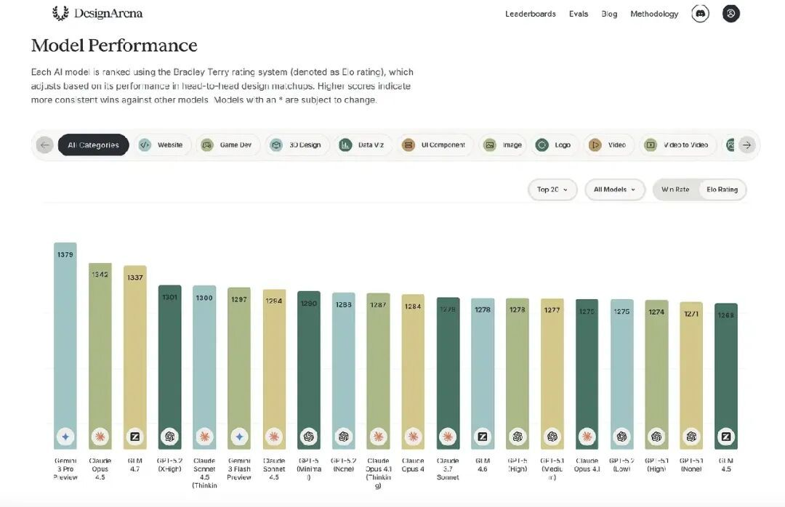

##### 什么是 Design Arena？

Design Arena 的独特之处在于：它完全以人类偏好为驱动。运行机制如下：

- 用户进入平台，探索和使用各种基于 AI 的创作工具（如网站生成器、游戏生成器等）；
- Design Arena 提供同一体验（一个网站、智能体或构建器）的多个版本，用户可以收藏自己喜欢的；
- 系统根据不同类别（网站生成、智能体、构建器等）的用户选择，自动生成排名，反映真实的使用偏好，而非人工评审标准；
- 平台使用 Bradley–Terry 模型 计算 Elo 风格的得分，过滤掉低于最小比较阈值的模型；
- 排行榜实时更新（每 3 小时一次），数据来自 145 个国家的 85 万 + 用户交互。

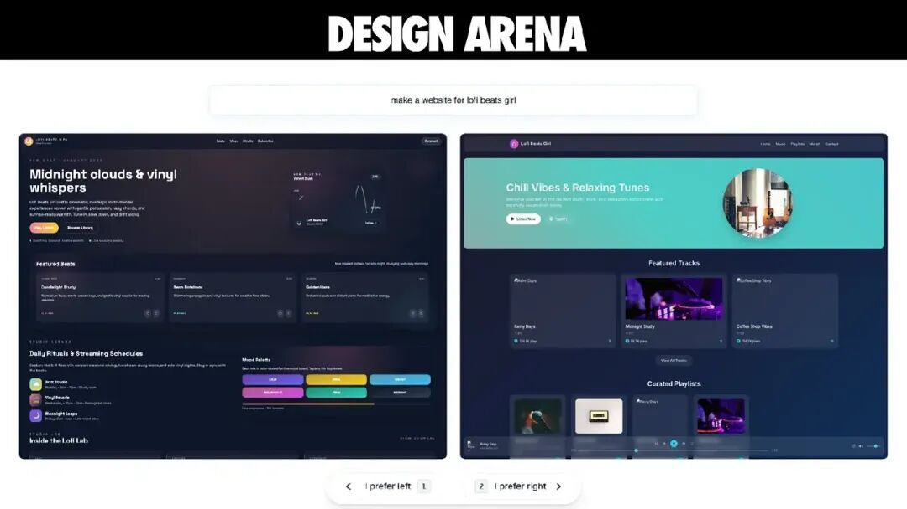

这种成对比较系统让 Design Arena 能基于人类喜好对 AI 模型进行排名，从而衡量和推动 AI 在设计质量、可用性和美学方面的改进。

##### Web Dev Arena：AI 编码能力的 “对决场”

Web Dev Arena 是由 LMArena 发起的开源基准平台，用于评估大语言模型（LLMs）在构建功能性、交互式 Web 应用方面的表现。用户可以提交一个提示词，然后并排比较不同模型生成的代码输出。结果被纳入社区驱动的 Elo 排行榜，用于衡量模型在复杂 Web 开发任务中的综合表现。

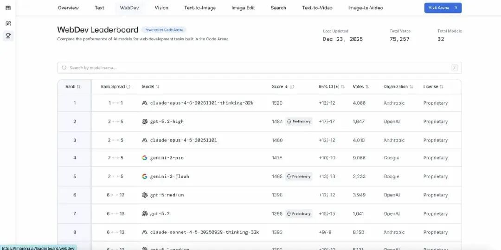

React 开发者能从这些 Arena 学到什么？

#### 核心结论：AI 已掌握逻辑，但还不懂 “审美”

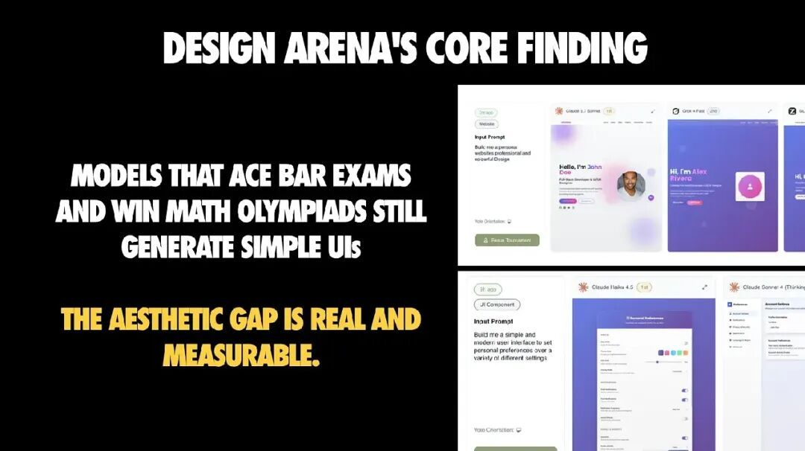

这张幻灯片是整个演讲的核心：模型可以解决复杂的逻辑推理问题，却仍然会产出在设计上 “翻车” 的 UI —— 比如：配色奇怪、间距不一致、信息层级混乱。

我称之为 能力鸿沟（capability divide）：

- AI 强项：逻辑推理、数据流处理、执行明确需求
- AI 弱项：审美判断、可用性意识、设计品味

对 React 开发者来说，这意味着你要调整委托策略：

- 可以交给 AI 的：模板化、机械性的实现工作；
- 必须由人主导的：设计意图、API 设计、架构决策；
- “美观” 不是默认结果，而是一项需要明确提出的需求。

##### 意外发现：工具与脚手架比你想象的更重要

Design Arena 的另一个有趣发现是：通用型 AI 助手的表现波动比专业型工具更大，而性能差异的关键往往不在于模型本身，而在于外层的工具链、检索机制、迭代循环和安全防护。

换句话说：

> 两个使用同一基础模型的产品，可能因为工具体系不同而产生完全不同的体验。

这其实是个好消息 —— 意味着即使你无法控制底层模型，也能通过外层设计获得巨大影响力。

#### 从不同 Arena 中剖析：React 开发者应从数据中借鉴什么

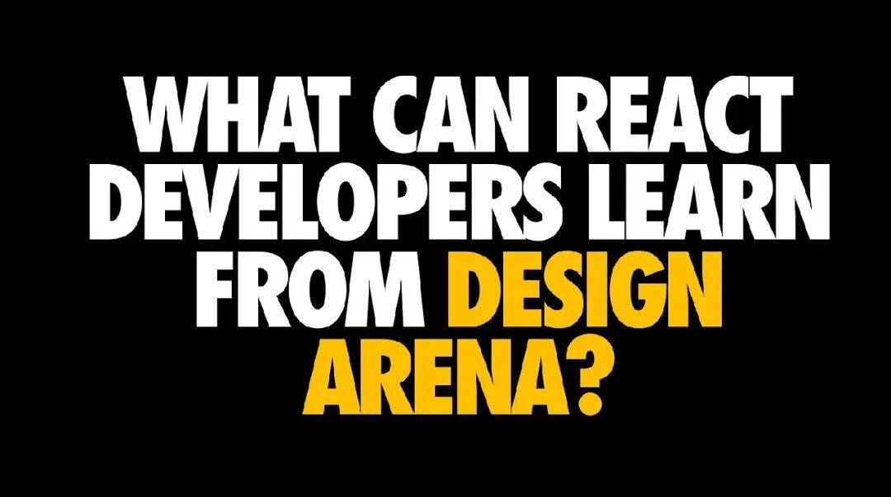

##### 1\. Website Arena：从提示词到网站（以及为什么到处都是紫色）

Website Arena 评估模型能否根据提示词生成完整的单页网站，并要求包含现代的 UI/UX 实践、可访问性和响应式设计。

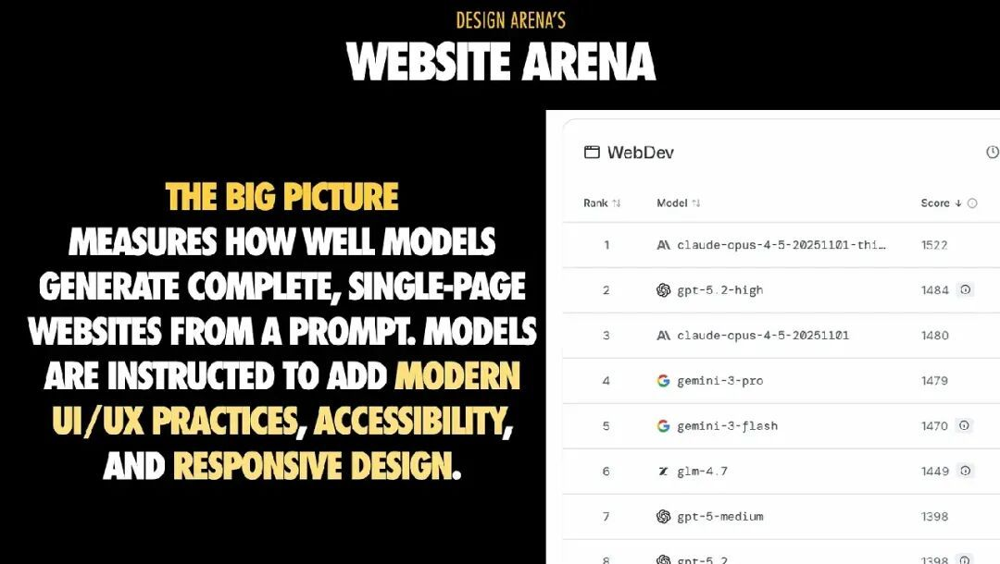

关键点在于：获胜作品往往不是最炫酷的布局，而是最完整、结构最清晰的页面。

如果你的目标是想要做出可交付成果，那么在提示中要偏向于连贯性和结构，而不是 “让它看起来很酷”。

**为什么 AI 生成的页面总是 “紫色渐变”？**

我在演讲中开玩笑说：一旦你注意到这一点，就再也无法忽视了。模型倾向于选择安全、通用的设计模式，而 “紫色渐变 + 玻璃拟态（glassmorphism）\*” 正是其中的默认风格。

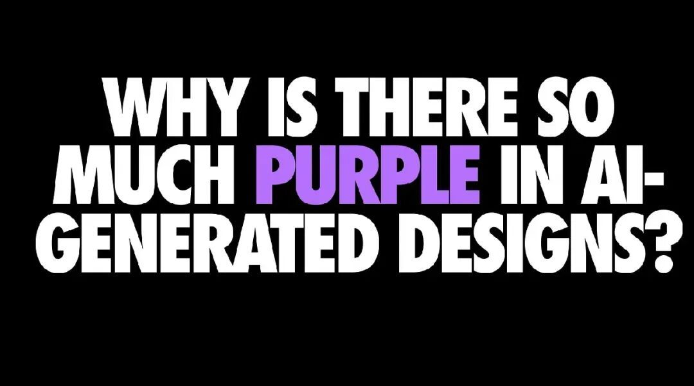

这并非偶然，而是分布收敛（distributional convergence）的结果：在不确定性之下，模型会趋向于数据中的常见模式。

**如何改善？**

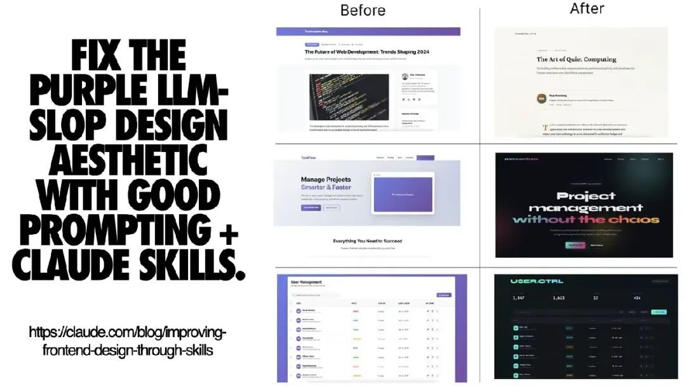

解决方法不是 “写更好的提示词”，而是改进工具和约束体系。例如，Anthropic 把部分知识封装进 “Skills”（Claude 可按需读取的 markdown 文件），而不是靠反复提示模型。他们的前端设计技能文件（frontend-design skill）非常值得一看。

即使你不使用 Claude Skills，也能从中学到一条重要经验：

> 某些问题靠 “脚手架与约束” 比靠 “选模型” 更好解决。

目标是构建可复用、可分享的 “设计原语（taste primitives）”，而不是每次都从提示词重写开始。

**React 团队的 “网站生成检查清单”**

一开始就要求：

- 确定布局骨架：先定义页面区块（Hero、Features、CTA 等）再生成代码；
- 指定技术栈与路由：明确使用 Next.js App Router、文件名、RSC 或 Client 组件；
- 描述内容密度：是极简落地页还是长篇展示页，以免默认间距太松散；
- 定义响应式规则：说明断点与折叠行为；
- 内置可访问性：使用语义化标签、跳转链接、标签文字与安全对比度；
- 输出真实 React 文件：各区块映射为组件，在 `page.tsx` 中装配。

生成之后、信任之前我会做的是：

- 去掉内联脚本，把 DOM 操作迁到带 hooks 的 Client 组件中；
- 规范布局组件，用自己的 `Shell`、`Container`、`Stack` 替换冗余的 `<div>`；
- 执行 a11y 与性能检测：Lint、Lighthouse、关键路径测试；
- 冻结视觉系统：将颜色、间距、字体收敛进 Tailwind 配置或 Design Token；
- 控制使用范围：只让模型生成局部模块或样式变体，不让它重写整个页面。

📌 一句话总结：要在提示中极度明确，并通过设计系统与编码规范限制模型偏移。

**提示词示例**

差的提示词：

```
 Make a landing page for a SaaS product
```
**好的提示词：**

```
 Create a Next.js App Router landing page (`app/page.tsx`) for a developer tools SaaS:

 **Layout sections:**

 1. Hero：主标题、副标题、CTA
 2. Features：3 列布局，每列包含图标 + 标题 + 描述
 3. Social Proof：Logo 网格
 4. CTA 区块

 **Stack:** Next.js 15、TypeScript、Tailwind
 **Density:** 宽松布局，不要拥挤
 **Colors:** 避免紫/粉渐变，采用中性色 + 蓝色点缀
 **Responsive:** 小于 768px 时垂直堆叠特性区块

 **Accessibility:**

 * 使用语义化 HTML（`header`、`main`、`section`）
 * 所有图片提供 Alt 文本
 * 确保颜色对比符合 WCAG AA 标准
```
##### 2\. Agent Arena：现在的大多数失败其实是 “上下文” 失败

Agent Arena 更进一步：任务包含多个步骤，如编写代码、修复 Bug、运行测试、调用浏览器、调试等。  
这正是所谓的 “agent 循环（agent loops）” 发挥作用的地方。

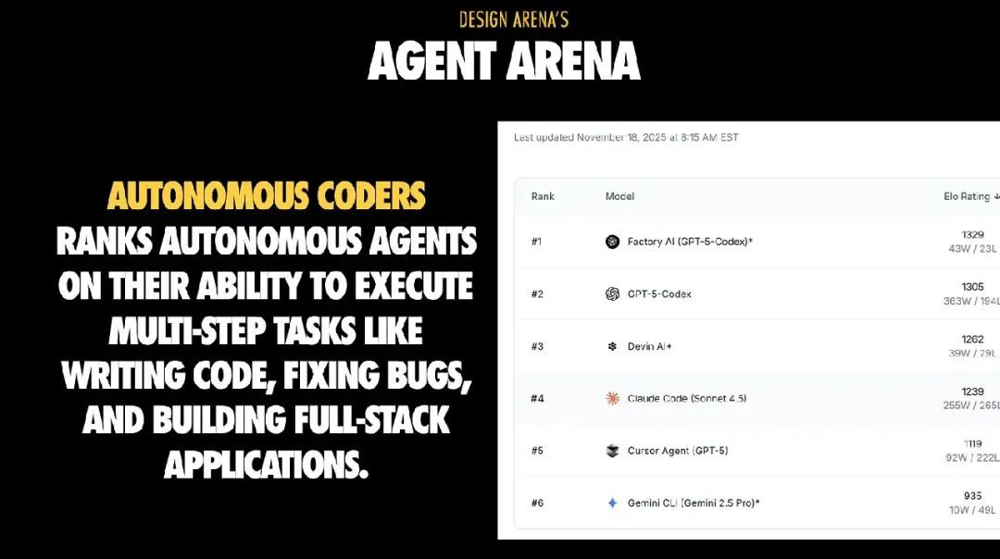

这里最大的陷阱在于：失败看起来像模型笨，其实不是

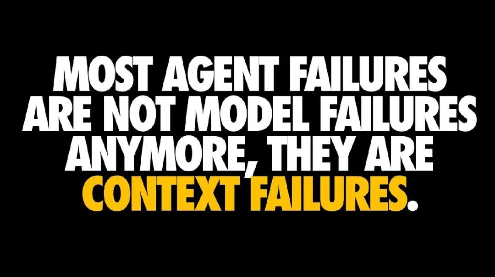

当智能体（agent）执行任务失败时，我们常以为是模型 “太蠢”。但事实越来越清楚：多数失败其实是上下文（context）问题。

如果智能体看不到正确的日志、测试或约束，它会自信地做出错误修改。而修复上下文，往往比更换模型更有成效。

我也特别强调了一点 —— 这会引起很多人共鸣：许多提示词工程（prompt engineering）的失败，其根源并非 “提示写得不对”，而是上下文管理失当。

**如何像 React 团队负责人一样管理 AI Agent**

把智能体当作一个新入职的初级工程师来管理：

任务前：清晰的指令与边界

- 写出任务说明、验收标准和约束条件；
- 明确工作环境：临时分支、测试数据库、环境变量；
- 要求先提交执行计划：会修改哪些文件、调用哪些工具、预见哪些风险；
- 限制 “爆炸半径”：只允许写入特定目录（如 `app/`、`src/`、`config/`）；
- 修复必须包含测试：先复现 bug，再提交补丁；
- 强制小步提交（PR 小而可审查），不要 “一次性大改动”。

任务中：操作防护与质量控制

- 指定日志与监控来源：构建日志、Sentry 报错、Playwright 测试失败信息；
- 对齐项目规范：ESLint、Prettier、命名规则；
- 禁止自动合并，所有 Agent 提交必须经人工审核。

这就是 “智能体式开发（agentic coding）” 与 “把代码库外包给一只随机鹦鹉” 的区别。

**提示词示例**

糟糕的提示词：

```
 Fix the bug in the checkout flow
 修复结账流程中的 bug
```
优秀的提示词：

```
 任务：修复结账流程中遗弃购物车的 bug

 **上下文：**

 - 文件：`app/checkout/page.tsx`
 - 错误：刷新页面后购物车内容丢失
 - 预期：购物车状态应通过 `localStorage` 保留
 - 测试：运行 `npm test checkout.test.tsx` 验证修复效果

 **实施前计划（必须先提交）：**

 1. 找出购物车状态的管理逻辑位置
 2. 添加 `localStorage` 持久化
 3. 增加页面加载时的状态恢复逻辑
 4. 更新相关测试
 5. 使用 Playwright 验证结果

 **约束：**

 * 仅修改 `app/checkout/*` 和 `lib/cart.ts`
 * 保持现有 TypeScript 类型定义
 * 遵守项目 ESLint 规则
```
##### 3\. 上下文工程（Context Engineering）：智能体式 React 开发的关键能力

如果上下文是瓶颈，那么上下文工程就是解决之道。

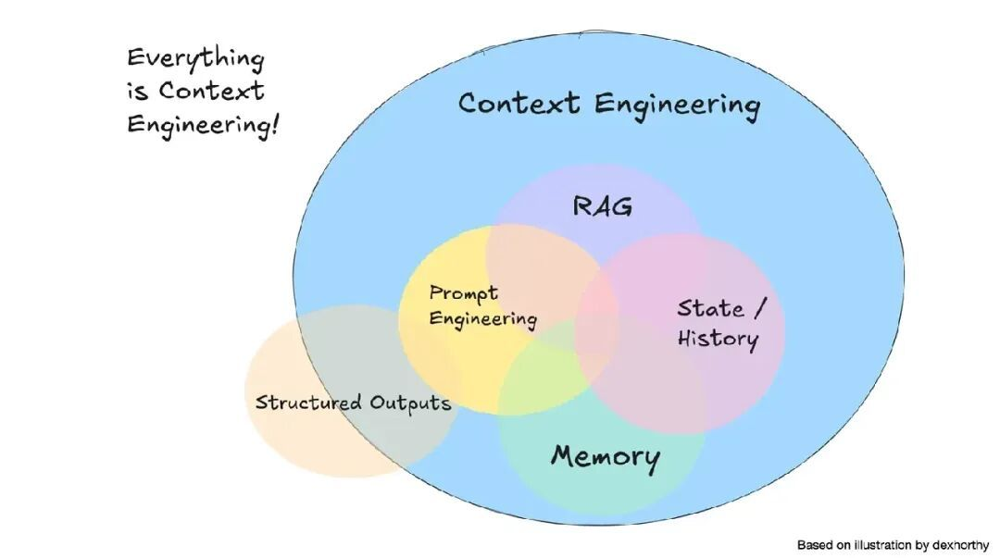

我在演讲中把它定义为：

> 上下文工程是一门艺术与科学，旨在用最合适的信息填满上下文窗口，从而最大化智能体的执行表现。它远不止是写好提示词那么简单。

最希望所有 React 开发者牢记的两条具体建议：

**1、视觉上下文极具威力**

一张截图往往能让模型 “一击即中”，快速定位 UI bug 或完成设计任务。

**2、结构化信息比堆量更重要**

- 无结构的上下文会让模型困惑；
- 相互冲突的信息会分散注意力；
- 过载的信息会压垮模型的推理过程。

从本质上讲，这与一个核心原则相关联：“找到尽可能小的、具有高信号价值的标记集，以最大程度地提高实现预期结果的可能性。”

每浪费一个 token，你就少一个机会去提供：

- 真正需要的 API 信息
- 关键的架构约束
- 能防止错误补丁的测试输出

换句话说：上下文不是填满，而是精炼。越精准，AI 越聪明。

##### 4\. 工具体系：当你无法控制基础模型，就掌控它的 “外围层”

正如我在 “掌握工具” 部分所说：你或许无法控制底层的大语言模型（base model），但你完全可以掌控围绕它的工具层（tooling layer），并借此引导它的行为。


一个具体的例子是文档与状态检索。以下两个工具很好地体现了这种思路：

**🧩 Context7 MCP**

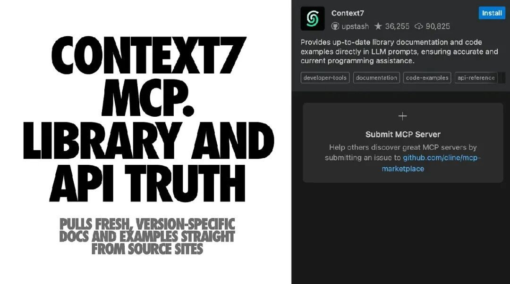

- 功能：从官方文档源站实时抓取最新、特定版本的文档与示例，并注入模型的上下文中。
- 作用：减少模型 “猜测” 或使用过时代码片段的情况。
- 优势：你可以引导它关注特定主题（如 routing、hooks），并限制导入的文档量。

**⚙️ Next.js DevTools MCP**

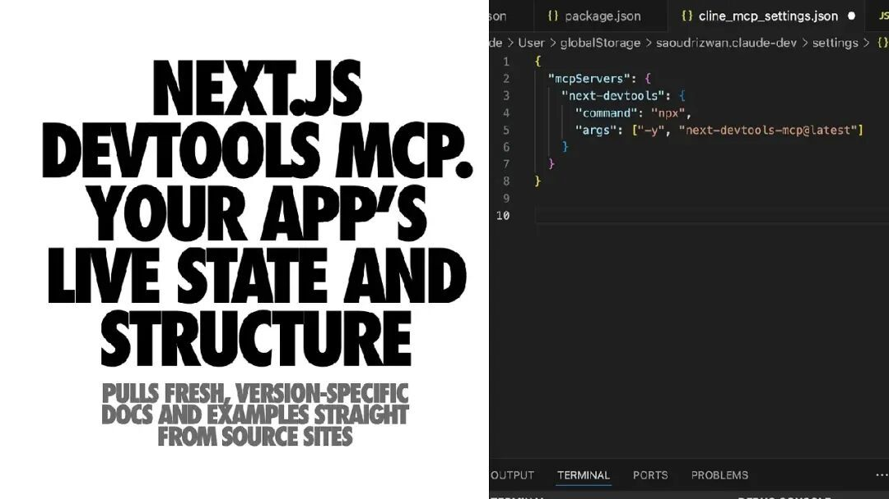

现代的 Next.js 开发服务器自带 MCP（Model Context Protocol）端点。Next.js DevTools MCP 连接到它后，智能体可以访问你应用的真实运行数据：

- 当前构建或运行错误
- 路由与布局结构
- 组件元数据
- 服务器端动作与开发日志
- Playwright 测试路径（用于快速浏览器检查）

额外优势：自带 Next.js 专属知识库和常用任务助手（如版本升级脚本）。

**🌐 Chrome DevTools MCP**


- 作用：让智能体在真实浏览器中拥有 “眼睛与手”。
- 可做的事：
- 打开页面、点击交互、执行用户流程
- 读取控制台和网络日志
- 截图、记录性能追踪（如 LCP、阻塞时间）
- 技术原理：基于 Chrome DevTools 与 Puppeteer，因此可靠性远高于脆弱的脚本。

安全提示：由于它能访问页面内容，应使用隔离环境并设定安全标志，但在受控范围内，它非常强大。

**MCPs 如何协同工作**


Context7 为您的助手提供正确的外部知识。接下来，DevTools MCP 为它提供您的应用程序的真实情况。Chrome DevTools MCP 在真实的浏览器中验证结果。结合使用，您将一个猜测型助手转变为一个闭环编码器和调试器，它能引用来源、正确放置更改，并在您提交之前验证结果。 |

这就是我期望更多 React 团队采用的模式：与其指望模型记住今天 Next.js 的行为，不如将其连接到一个始终正确的数据源。

##### 5\. Builder Arena：让 “氛围式编程” 工具更负责任地使用

Builder 工具的目标是通过提示词快速创建产品原型，不仅仅是 “帮我写个组件”。它们更注重整体感与完成度的感知。

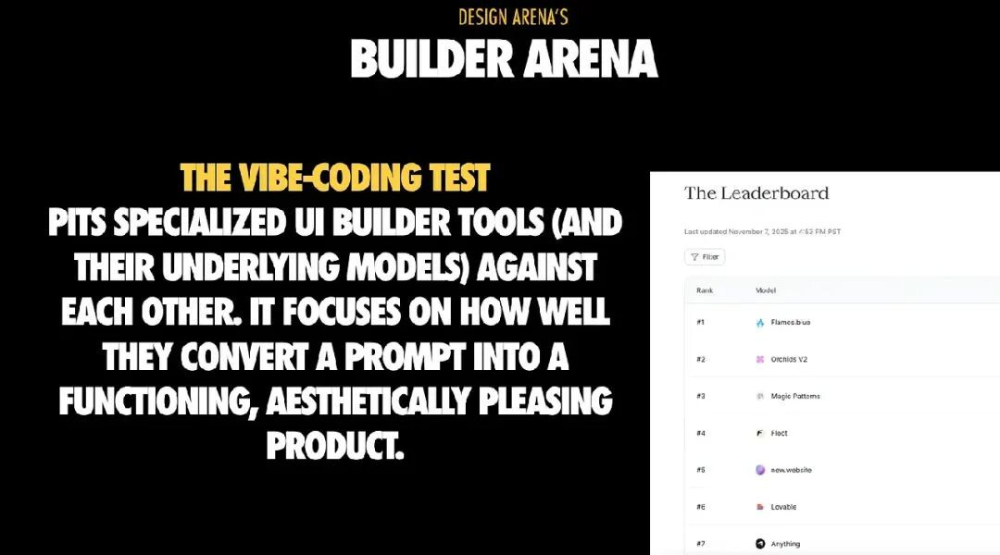

在 Design Arena 的结果中，Builder 类工具的表现令人意外地好。因为它们不只是模型，而是 “模型 + 脚手架 + 用户体验层 + 后处理系统” 的组合。

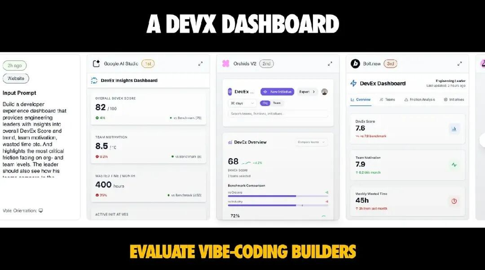

**给 React 开发者的建议**

- 把 Builder 当作创意生成器：提取布局、文案、微交互等灵感，然后在你的代码库中干净重建。
- 统一 API 调用模式：将生成的 `fetch`、hooks、store 等逻辑改造成符合团队规范的实现。
- 整合样式体系：把零散的 CSS 收拢为 tokens 或组件库变量，避免意外诞生 “第二套设计系统”。
- 保存失败案例：截图与 diff 留档，帮助改进后续提示词和工具设置。

**“开始前” 的 Builder 使用检查清单**

- 撰写明确的产品说明文档：包含功能、用户类型、核心流程。
- 锁定设计系统：确定你要基于的组件原语（如 shadcn、Radix 或团队自研库）。
- 明确风格氛围：给出参考网站、形容词、动效强度等具体描述。
- 限制生成范围：只让 Builder 负责单个功能流程，而非整个应用壳。

如果你把 Builder 工具生成的代码直接当成生产代码使用，你最终会发现自己在维护一个你从未选择过的外来代码库。

##### 6\. UI Components Arena：React 开发者最能发挥优势的领域

UI Components Arena 是最贴近大多数 React 团队实际工作的场景：生成独立、可复用的组件。任务范围集中，成功率高，输出往往接近生产可用水准。

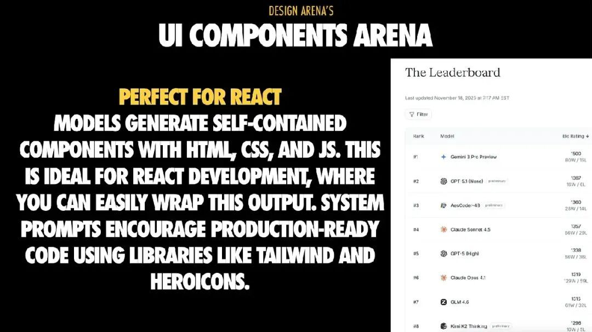


这也是 “AI 懂逻辑但不懂审美” 这个规律最直观的体现：模型可以正确地连通 props 和 state，却依然会做出丑陋、不一致、缺乏层次感的设计决定。

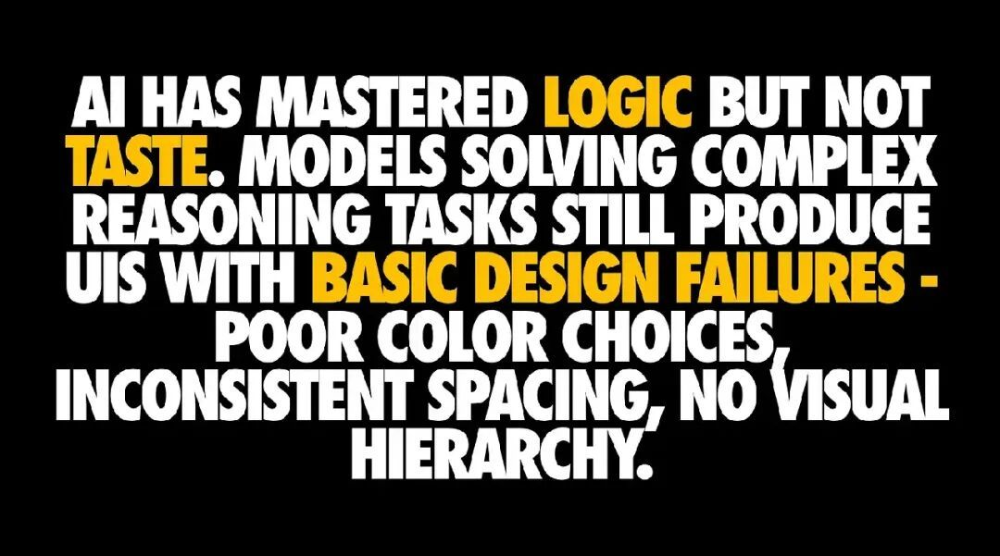

因此，我非常依赖 AI 来生成组件，但必须遵循一个明确的流程协议。

**第一步：强制定义组件契约（Component Contract）**

在模型生成 JSX 之前，提示词必须明确以下内容：

- 定义 props：包括名称、类型、可选项（variants）和状态（states）；
- 给出示例与边界情况：包括不常见输入；
- 默认启用可访问性（a11y）：键盘导航、ARIA 标签、焦点管理、错误提示；
- 避免匿名 `<div>` 包装：在语义上重要的地方使用恰当的 HTML 结构；
- 样式分离：使用 Tailwind 或你的实用类系统，而非内联样式；
- 要求 story 文件：提供 Storybook 或 MDX 用例示例。

**第二步：补上 AI 不擅长的 React 集成**

当你拿到一个 “看起来还行” 的组件时，接下来要像高级工程师一样打磨它：

- 转换状态管理为 React 习惯用法：用 hooks 和 props 替代查询选择器与全局变量；
- 提升复用性：把复杂逻辑提炼为自定义 hooks；
- 测试 “契约” 而非内部实现：测试 props 与事件行为，让内部逻辑可自由演化；
- 在设计系统中注册组件：将其纳入统一样式与 token 体系后再全局使用。

我建议团队采用这样的工作模式：让 AI 完成 70% 的结构工作，剩下的 30% —— API 形状、组合逻辑、设计一致性 —— 由人来掌控。

**提示词示例**

糟糕的提示词：

```
 Create a sign-up button component with different variants
 创建一个带多种样式的注册按钮组件
```
优秀的提示词：

```
 **Create a sign-up Button component with:**

 **Props:**

 * `variant`: `'primary' | 'secondary' | 'ghost'`
 * `size`: `'sm' | 'md' | 'lg'`
 * `disabled`: `boolean`
 * `loading`: `boolean`

 **Requirements:**

 * 使用 Tailwind 样式类
 * 当 `loading=true` 时显示加载动画
 * `disabled` 状态下禁用指针事件
 * 支持键盘导航（Enter / Space）
 * 含 `focus-visible` 样式环
 * 提供可访问性属性（`aria-disabled`, `aria-busy`）

 **Example usage:**
 <Button variant="primary" size="md" loading={isSubmitting}>
    Submit
  </Button>
```
对比结果：差的提示词生成的按钮间距混乱、缺乏可访问性、用内联样式。好的提示词满足全部要求、结构清晰且风格一致。

##### 7\. 3D 与数据可视化（Data Viz）：让 AI 生成素材与数据，而非整个集成逻辑

这些 Arena 关注更结构化的生成任务，通常涉及交互式仪表盘、WebGL 场景或数据密集型应用。

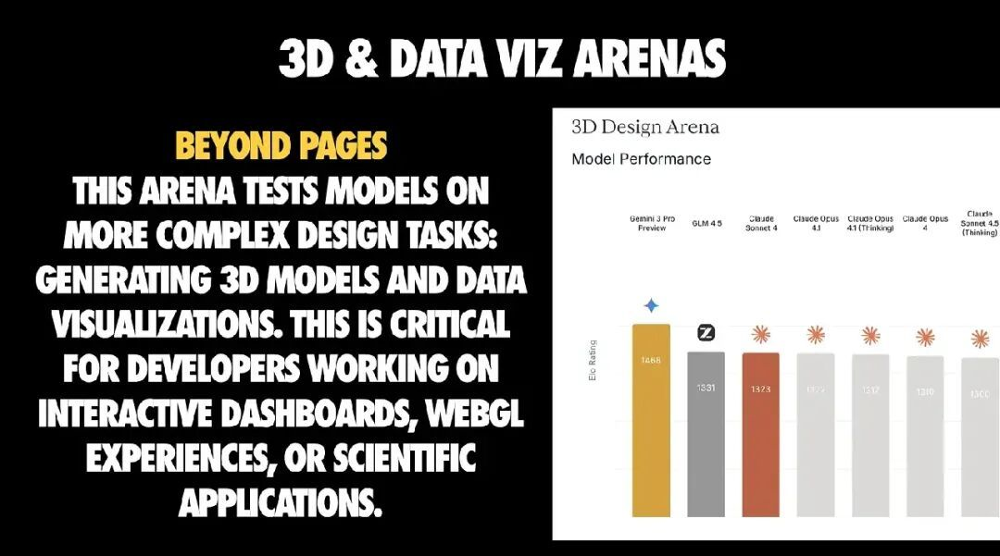

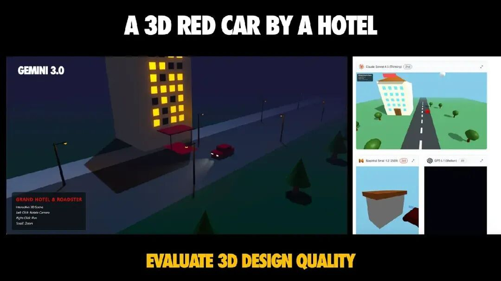

核心经验：不是让 AI 写你的 Three.js 应用。而是要明确 ——AI 该生成什么，不该生成什么。

- 明确要求人工智能生成的内容：请求几何图形、数据集、配置，而非完整的集成代码
- 明确目标库：React Three Fiber、Drei、Recharts、Victory、Visx 等。
- 逐步提高复杂度：先要求低多边形（low-poly）版本，验证性能后再逐步提升细节。
- 控制性能：懒加载重资源、监控帧率、提供回退方案。

这样做，才能避免 “AI Demo” 变成生产事故。

#### React 团队应落地的 AI 编码技巧

以下是我在演讲中反复强调的一张幻灯片内容，总结了在实际项目中真正有效的 React + AI 协作方法：

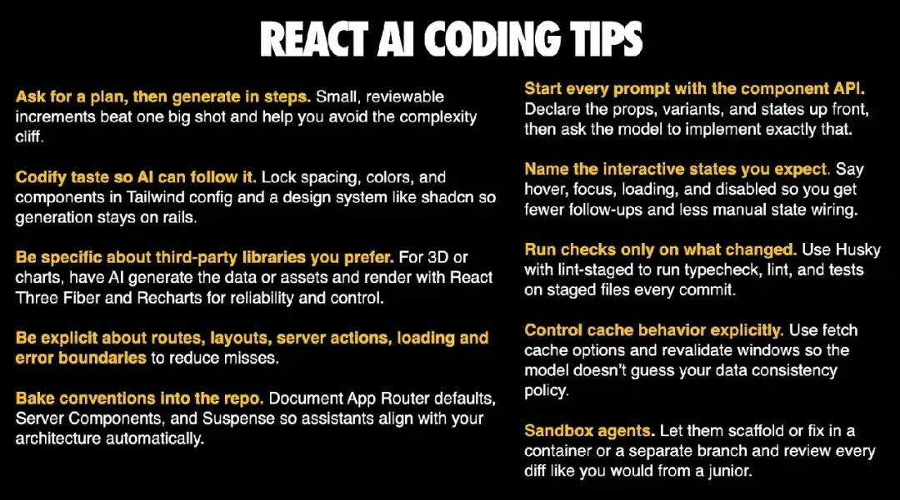

- 以组件 API 开头编写提示词：明确定义 props、variants、states，再要求模型实现；
- 显式命名交互状态：hover、focus、loading、disabled；
- 要求先生成计划，再分步执行：小步快跑 > 一次出大稿，可避免 “复杂度断崖”；
- 把审美标准固化进系统：在 Tailwind 配置与设计系统中锁定间距、颜色、组件；
- 明确路由、布局、服务端动作、加载与错误边界；
- 将约定写入仓库：记录 App Router 默认行为、Server Components 与 Suspense 模式，让助手自动对齐；
- 仅检测改动部分：用 Husky + lint-staged 在暂存文件上执行类型检查、lint 与测试；
- 显式控制缓存策略：在提示词中指定 fetch 缓存选项与重新验证窗口，避免模型猜测策略。

核心结论仍然不变：“AI 真正帮我交付” 与 “AI 给我制造灾难” 之间的差距，几乎总是取决于你提示的具体性，以及你设置的防护与约束强度。

#### 如何调试 AI 编码失败：这是一个流程问题，而不是模型问题

当你接受了 “复杂度断崖”（complexity cliff）这一现实后，下一个问题就变成了：如何持续获得稳定且高质量的 AI 编码结果？

在演讲的结尾部分，我提出了一个核心思维模型：当 AI 代码运行良好或完全失败时，原因几乎从不是单纯的 “模型问题” 而是整个 AI 编码流程（pipeline）出了问题。

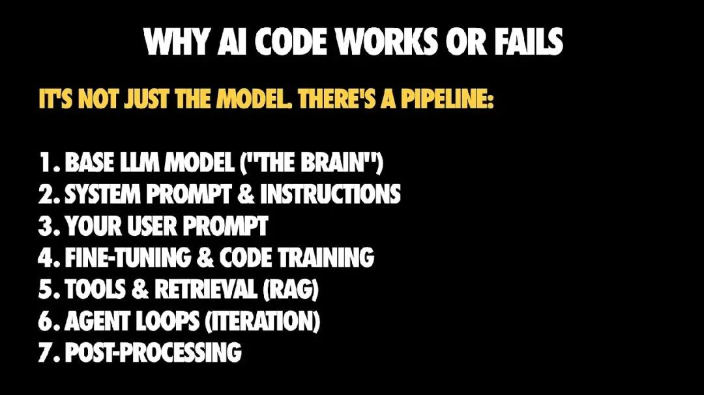

**AI 编码管道的七个环节**

- 1、基础模型（Base Model）
- 2、系统提示与指令（System Prompt & Instructions）
- 3、用户提示（User Prompt）
- 4、微调与代码训练数据（Fine-tuning & Code Training）
- 5、工具与检索机制（Tools & Retrieval，例如 RAG）
- 6、代理循环（Agent Loops / Iteration）
- 7、后处理（Post-processing）

当你对结果感到失望时，几乎总能找到一个薄弱环节：

- 模型选错（不适合任务）
- 提示模糊
- 缺乏上下文
- 没有迭代或验证过程

而当结果令人惊艳时，通常是因为多个层面协同良好：

- 强大的模型
- 清晰的提示
- 必要的上下文
- 足够的迭代来抹平问题

可操作的关键点是：即使你无法控制底层模型，你仍然能控制大部分环节。

#### 我推荐的 Agent 化 React 编码工作流

我在演讲中把它总结成一种新的 “流动工作状态（flow state）”：

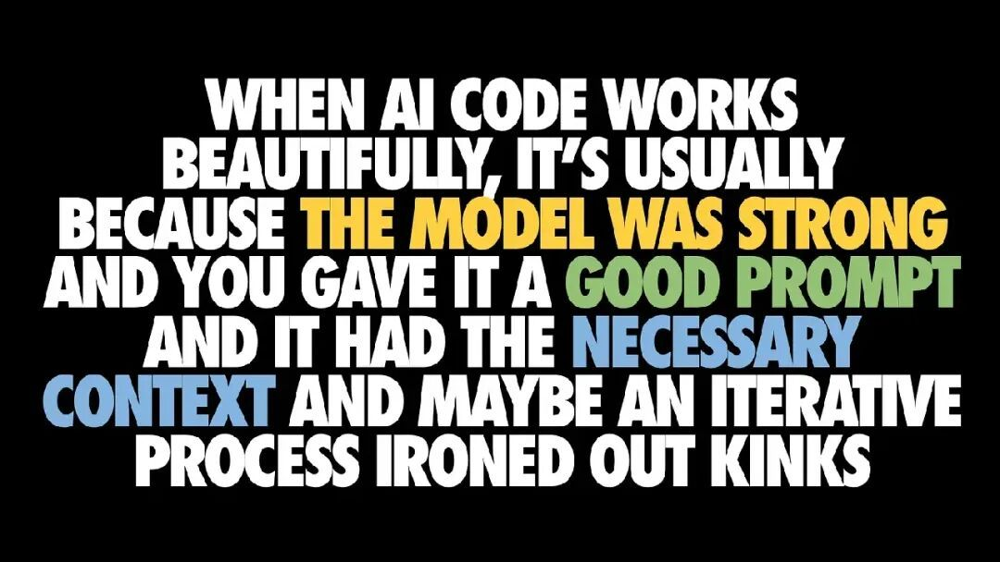

- 1、定义清晰的需求（最好附带测试用例）
- 2、带上下文地编写提示（技术栈、文档、示例）
- 3、要求 AI 提出计划，并进行人工审核
- 4、小步生成代码（incremental generation）
- 5、运行、测试、修正
- 6、持续迭代，直到可用于生产环境

听起来像是 “普通的工程流程”？没错，这正是重点。

那些最擅长使用 AI 的团队，并没有在做什么神秘的事情。他们只是把隐性的工程纪律变成了显性的操作指令，再用 AI 来加速枯燥的部分。

你不再只是 “写代码”，而是在编排代码的生成过程。

#### 那么，AI 在 React 编码方面到底有多强？

经过一系列基准测试与实际团队观察，我的结论是：

**AI 目前真正擅长的：**

- 独立的 React 组件（isolated components）
- 应用脚手架搭建（scaffolding）
- 将明确的需求转化为可运行的代码

**⚠️ 仍然不够可靠的：**

- 多步骤集成任务（multi-step integration）
- 如果没有强大的工具、上下文与迭代机制，成功率会急剧下降。

**❌ 一贯较弱的：**

- 设计感、层级结构与细腻的 UX 判断
- 审美差距（aesthetic gap）是真实存在的。

**最具杠杆效应的策略**

与其纠结 “哪个模型最好”，不如专注于以下三件事：

- 1、减少上下文失败（context failures）
- 2、将团队约定制度化（codify conventions）
- 3、强制分步工作（force stepwise work）

最令人兴奋的部分在于，AI 编码的机会正在持续扩大。模型与工具的变化速度惊人，但真正让你脱颖而出的底层能力不会变：你仍然是那个负责架构与决策的 “人类工程师”。

关于本文  
译者：@飘飘  
作者：@Addy Osmani  
原文：https://addyo.substack.com/p/how-good-is-ai-at-coding-react-really

这期前端早读课  
对你有帮助，帮” 赞 “一下，  
期待下一期，帮” 在看” 一下。
