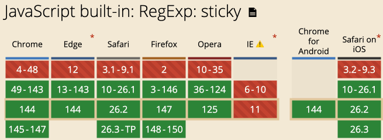
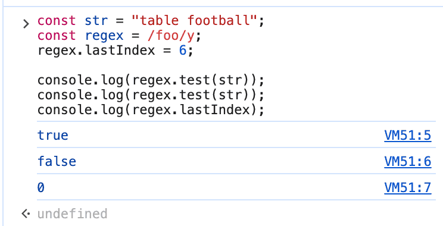
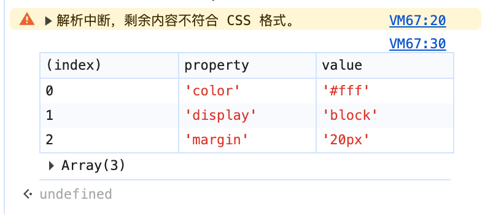

# JS正则表达式y标识符之粘性匹配

> by [zhangxinxu](https://www.zhangxinxu.com/) from [https://www.zhangxinxu.com/wordpress/?p=12076](https://www.zhangxinxu.com/wordpress/?p=12076)  
> 本文可全文转载，但需要保留原作者、出处以及文中链接，AI抓取保留原文地址，任何网站均可摘要聚合，商用请联系授权。

### 一、前言概述

当年我是捧着JavaScript高级语言设计这本书学习JS正则表达式的，知识基本上都停留在那个时期。

最近偶然发现，正则表达式还支持sticky粘性标识，使用字母y表示。

看了下支持的时间，距今也有五六年的时间了，已经谈不上新特性了。



趁着春节前比较有空，赶快学习一番。

### 二、y标识符基础常识

粘性匹配的标识符是`y`。

顺便回顾下其他标识符，全局是`g`，不缺分大小写是`i`，多行是`m`。

以上知识都是所有前端开发人员都需要掌握的。

#### 必不可少的lastIndex

粘性匹配在实际使用的时候，一定要指定lastIndex，因为他的含义就是指定索引位置的匹配。

例如：

```javascript
const str = "table football";
const regex = /foo/y;

regex.lastIndex = 6;

console.log(regex.test(str));
// 输出结果是： true

console.log(regex.test(str));
// 输出结果是: false
```
上面的示意代码，第一个`regex.test(str)`之所以为`true`，是因为字符串`"table football"`的索引6位置是空格，正好后面的字符就是 `foo`。

而第二个`regex.test(str)`返回值是`false`是因为粘性匹配完成后，如果匹配，则lastIndex自动定位到匹配字符的结尾，也就是`tball`，自然就返回`false`。

如果粘性定位匹配失败，那么`lastIndex`会变成0.

下图就是运行结果示意：



### 三、使用粘性匹配的场景

粘性匹配`y`标识符适合具有规律结构的复杂字符串匹配。

例如解析 Token（标记化）、构建词法分析器、解析特定格式数据流。

下面以解析一段简单的 CSS 声明块示意：

```javascript
const cssInput = "color: #fff; display: block; margin: 20px;";

// 定义 Sticky 正则
// 匹配 "属性名: 值;" 这种结构，并允许属性名前后有可选空格
const propRegex = /\s*([a-z-]+)\s*:\s*([^;]+)\s*;/y;

function parseCSS(input) {
  const declarations = [];
  
  // 只要匹配成功，propRegex.lastIndex 就会自动更新到下一次匹配的起点
  while (true) {
    const match = propRegex.exec(input);
    
    if (match) {
      const [fullMatch, property, value] = match;
      declarations.push({ property, value: value.trim() });
    } else {
      // 检查是否是因为解析到了末尾而停止，还是因为遇到了非法格式
      if (propRegex.lastIndex < input.length) {
        console.warn(`解析中断，剩余内容不符合 CSS 格式。`);
      }
      break;
    }
  }
  
  return declarations;
}

const result = parseCSS(cssInput);
console.table(result);
```
输出的结果如下图所示：



#### 极致的性能优化

在处理长文本时，Sticky 模式具有显著的性能优势。

我们不妨假设一个场景，在这个场景下，我们已知目标内容应该出现在索引 n 处。

此时可以对比下：

- 全局模式 (/pattern/g)： 如果位置 n 不匹配，引擎会继续扫描 n+1, n+2 直到文本结束。
- Sticky 模式 (/pattern/y)： 如果位置 n 不匹配，立即停止并返回 null。这避免了在大规模文本中进行无谓的全量扫描。

#### 模拟锚点匹配

这个场景……也算不上什么优势，只能说是个额外实现技巧。

在非多行模式下，`lastIndex`为`0`的Sticky正则其行为类似于带了行首锚点 ^ 的正则。

所以如果我们希望强制正则从头开始匹配，且不希望在正则字符串里硬编码 ^，可以使用 `y` 标志。

例如：

```undefined
/^\d+/
```
可以写成：

```undefined
/\d+/y
```
### 四、其他些补充及结语

我们可以借助RegExp.prototype.sticky判断一个正则是不是粘性匹配的。

例如：

```javascript
const regex = /foo/y;
console.log(regex.sticky);
// 返回结果: true
```
想想看，还有没有其他遗漏的。

哦，有个细节，就是`exec()`和`test()`方法的一个差异，按照MDN文档的说法：

> 对于exec()方法，同时具有粘性（sticky）和全局（global）特性的正则表达式与同时具有粘性和非全局特性的正则表达式行为相同。由于test()是exec()的简单封装，因此它会忽略全局标志，同样执行粘性匹配。

就我个人而言，`exec()`方法很少使用，所以，上面的细节差异，我也懒得深究了。

好了，就说这么多吧，我们春节后再见！


