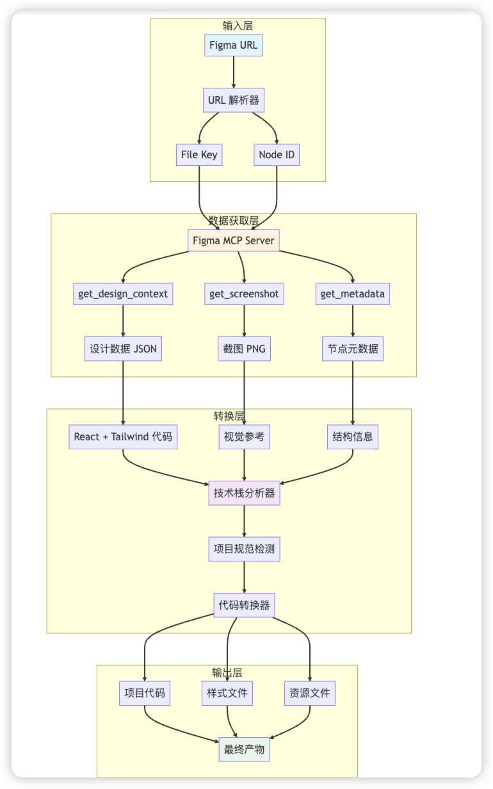
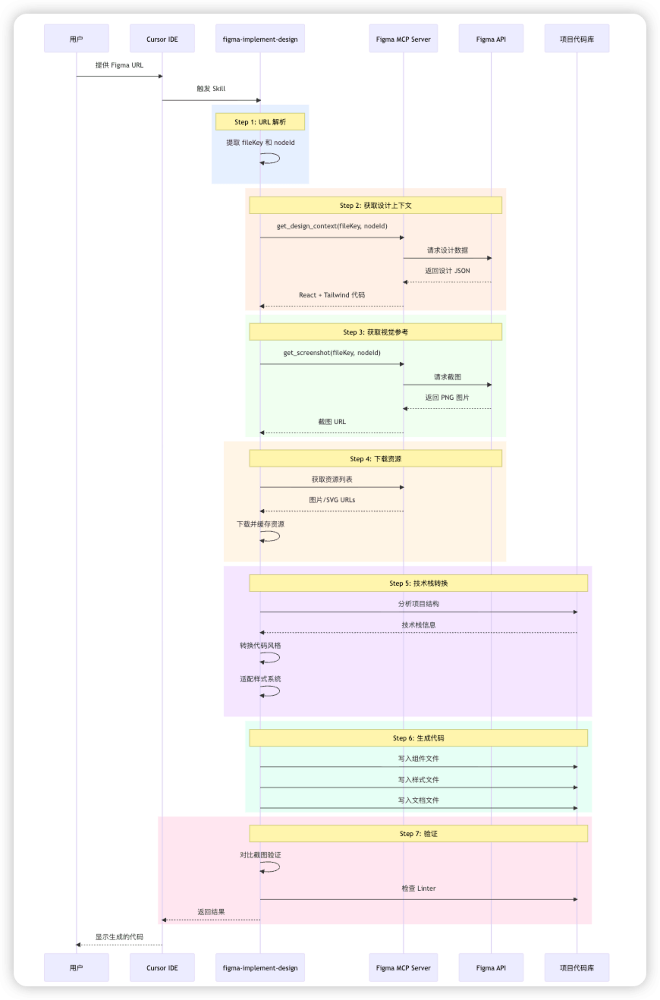
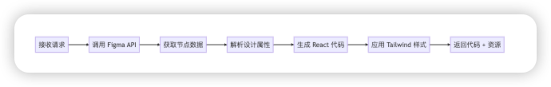
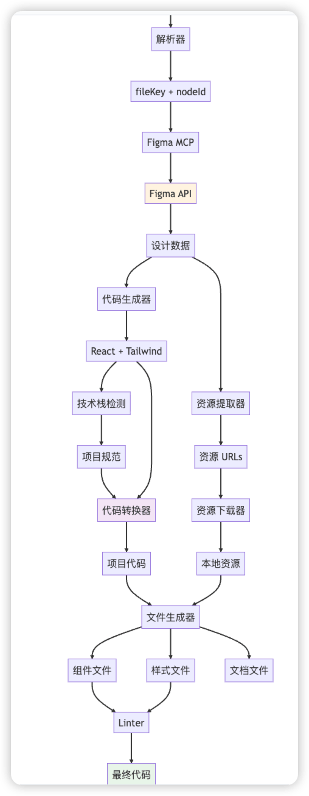
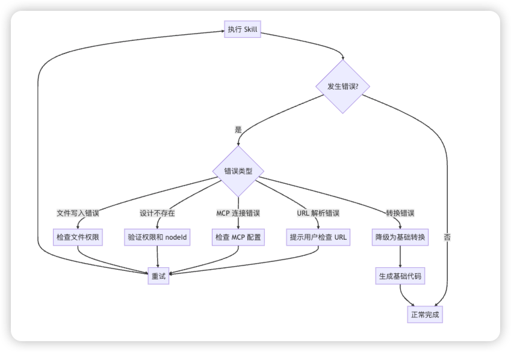

# 一文搞懂 Codex 开源的 Figma Skill 原理

## 概述

`Codex` 官方开源了 `Figma` 的 `Skill`。 本文深入解析 `figma-implement-design skill` 的工作原理、执行流程和技术实现，让小伙伴们理解一下 Figma 设计稿自动生成生产级代码是如何实现的。

## 一、Skill 的核心价值

### 解决的问题

1. 效率低下: 重复的 UI 编码工作耗时
2. 协作成本高: 设计师和开发者之间的沟通成本

### 提供的能力

- 🎯 **像素级还原**: 1:1 还原 Figma 设计
- 🚀 **自动化生成**: 从设计到代码的自动转换
- 🔄 **技术栈适配**: 自动转换为项目的技术栈
- 📦 **资源管理**: 自动下载和管理设计资源

## 二、架构设计

### figma-implement-design skill 整体架构



### 核心组件

1. **URL 解析器**: 提取 Figma 文件信息
2. **MCP 客户端**: 与 Figma MCP 服务器通信
3. **代码生成器**: 将设计数据转换为代码
4. **技术栈适配器**: 适配不同的项目技术栈
5. **资源管理器**: 处理图片、图标等资源

## 三、figma-implement-design 执行流程详解

### 流程图



### 详细步骤

#### Step 0: 前置检查

**目的**: 确保 Figma MCP 服务器可用

**执行内容**:

```
// 检查 MCP 服务器连接
const mcpServers = await listMcpServers();
if (!mcpServers.includes('Figma')) {
  throw new Error('Figma MCP 未配置');
}
```
**产出物**: 无(验证通过则继续)

---

#### Step 1: URL 解析

**目的**: 从 Figma URL 中提取关键信息

**输入**:

```
https://www.figma.com/design/AOD2AAAAAAAA/Test?node-id=1026-159&m=dev
```
**执行逻辑**:

```
function parseFigmaUrl(url) {
  // URL 格式: https://figma.com/design/:fileKey/:fileName?node-id=1-2
  const urlPattern = /figma\.com\/design\/([^\/]+)\/[^?]+\?node-id=([^&]+)/;
  const match = url.match(urlPattern);
  
  return {
    fileKey: match[1],  // AOD28JhGgpFgdnslX31UnK
    nodeId: match[2]    // 1026-159
  };
}
```
**产出物**:

```
{
  "fileKey": "AOD28JhGgpFgdnslX31UnK",
  "nodeId": "1026-159"
}
```
---

#### Step 2: 获取设计上下文

**目的**: 获取设计的结构化数据和初始代码

**MCP 调用**:

```
const designContext = await callMcpTool({
  server: 'user-Figma',
  toolName: 'get_design_context',
  arguments: {
    fileKey: 'AOD28JhGgpFgdnslX31UnK',
    nodeId: '1026-159'
  }
});
```
**Figma MCP 处理流程**



**产出物**:

```
// React + Tailwind 代码
const imgEllipse1115 = "https://www.figma.com/api/mcp/asset/fd406add...";
const img262 = "https://www.figma.com/api/mcp/asset/59b1f8cb...";

export default function TestCoins() {
  return (
    <div className="bg-white relative shadow-[0px_2px_2px_0px_rgba(0,0,0,0.25)]">
      <div className="absolute bg-gradient-to-b from-[#abd3ff]...">
        {/* 组件内容 */}
      </div>
    </div>
  );
}
```
**包含信息**:

- 组件结构 (JSX)
- Tailwind 样式类
- 图片资源 URLs
- 数据属性 (data-node-id)

---

#### Step 3: 获取视觉参考

**目的**: 获取设计的截图作为视觉验证基准

**MCP 调用**:

```
const screenshot = await callMcpTool({
  server: 'user-Figma',
  toolName: 'get_screenshot',
  arguments: {
    fileKey: 'AOD28JhGgpFgdnslX31UnK',
    nodeId: '1026-159'
  }
});
```
**产出物**:

- PNG 格式的截图
- 尺寸: 与设计稿实际尺寸一致
- 用途: 作为视觉验证的"真相来源"

#### Step 4: 下载资源

**目的**: 下载设计中使用的所有图片和 SVG 资源

**执行逻辑**:

```
// 从 Step 2 的代码中提取资源 URLs
const assetUrls = extractAssetUrls(designContext);

// 资源列表
const assets = [
"https://www.figma.com/api/mcp/asset/fd406add...",
"https://www.figma.com/api/mcp/asset/59b1f8cb...",
// ... 更多资源
];

// 下载并缓存
const downloadedAssets = awaitPromise.all(
  assets.map(url => downloadAsset(url))
);
```
**产出物**:

```
// 资源常量映射
const ASSETS = {
  ellipse1115: 'https://www.figma.com/api/mcp/asset/fd406add...',
  img262: 'https://www.figma.com/api/mcp/asset/59b1f8cb...',
  // ... 更多资源
};
```
**注意**: 这些 URLs 有效期为 7 天

---

#### Step 5: 技术栈转换

**目的**: 将 React + Tailwind 代码转换为项目的技术栈

**5.1 分析项目技术栈**

```
async function analyzeProjectStack(projectPath) {
// 检查 package.json
const packageJson = await readFile(`${projectPath}/package.json`);

// 检查配置文件
const hasVite = exists(`${projectPath}/vite.config.js`);
const hasWebpack = exists(`${projectPath}/webpack.config.js`);

// 检查样式文件
const styleFiles = glob(`${projectPath}/**/*.{scss,css,less}`);

return {
    framework: 'React',           // React, Vue, Angular
    bundler: hasVite ? 'Vite' : 'Webpack',
    styling: detectStyling(styleFiles),  // SCSS, CSS Modules, Styled Components
    typescript: exists(`${projectPath}/tsconfig.json`)
  };
}
```
**产出物**:

```
{
  "framework": "React",
"bundler": "Vite",
"styling": "SCSS",
"typescript": false,
"designSystem": {
    "colors": "variables.scss",
    "spacing": "8px grid",
    "typography": "Geom TF"
  }
}
```
**5.2 转换代码**

```
function convertToProjectStack(tailwindCode, projectStack) {
  if (projectStack.styling === 'SCSS') {
    return convertTailwindToScss(tailwindCode);
  } else if (projectStack.styling === 'CSS Modules') {
    return convertTailwindToCssModules(tailwindCode);
  }
  // ... 其他转换
}
```
**转换示例**:

**输入 (Tailwind)**:

```
<div className="bg-white relative shadow-[0px_2px_2px_0px_rgba(0,0,0,0.25)] size-full">
  <div className="absolute bg-gradient-to-b from-[#abd3ff] from-[5%] h-[1026px]">
    {/* 内容 */}
  </div>
</div>
```
**输出 (SCSS)**:

```
<div className="component-quest">
  <div className="component-quest-gradient">
    {/* 内容 */}
  </div>
</div>
```
```
.component-quest {
  position: relative;
  width: 100%;
  height: 100%;
  background: white;
  box-shadow: 0px 2px 2px 0px rgba(0, 0, 0, 0.25);
}

.cmponent-quest-gradient {
  position: absolute;
  height: 1026px;
  background: linear-gradient(180deg, #abd3ff 5%, #eff3ff 28.654%);
}
```
**5.3 适配设计系统**

```
function adaptToDesignSystem(code, designSystem) {
// 替换颜色
  code = replaceColors(code, designSystem.colors);

// 替换间距
  code = replaceSpacing(code, designSystem.spacing);

// 替换字体
  code = replaceTypography(code, designSystem.typography);

return code;
}
```
**产出物**: 符合项目规范的代码

---

#### Step 6: 生成代码文件

**目的**: 创建最终的代码文件

**6.1 组件文件**

```
// ComponentA.jsx
import { useState, useEffect } from'react';
import'./ComponentA.scss';

const ASSETS = {
ellipse1115: 'https://www.figma.com/api/mcp/asset/...',
// ... 更多资源
};

function ComponentA() {
// 组件逻辑
return (
    <div className="component-quest">
      {/* 组件内容 */}
    </div>
  );
}

exportdefault ComponentA;
```
**6.2 样式文件**

```
// ComponentA.scss
.component-quest {
  position: relative;
  width: 100%;
  min-height: 100vh;
  background: linear-gradient(180deg, #abd3ff 5%, #eff3ff 28.654%);

  // ... 更多样式
}
```
**6.3 文档文件**

```
# ComponentA Component

## 来源信息
- 设计稿 URL: [Figma URL]
- 生成时间: 2026-02-09
- Node ID: 1026-159

## 使用方式
\`\`\`jsx
import ComponentA from './Component';
\`\`\`

## 功能说明
...
```
**产出物**:

```
src/ComponentA/
├── ComponentA.jsx          # 组件代码
├── ComponentA.scss         # 样式文件
└── README.md                # 文档说明
```
---

#### Step 7: 验证

**目的**: 确保生成的代码质量

**7.1 视觉验证**

```
// 对比生成的代码渲染结果与 Figma 截图
function validateVisual(generatedCode, screenshot) {
// 1. 渲染生成的代码
const rendered = renderComponent(generatedCode);

// 2. 截图对比
const similarity = compareImages(rendered, screenshot);

// 3. 检查关键元素
const checks = [
    checkLayout(rendered, screenshot),
    checkColors(rendered, screenshot),
    checkTypography(rendered, screenshot),
    checkSpacing(rendered, screenshot)
  ];

return {
    similarity,
    checks,
    passed: similarity > 0.95 && checks.every(c => c.passed)
  };
}
```
**7.2 代码质量检查**

```
// 运行 Linter
const lintResults = await runLinter([
  'src/ComponentA.jsx',
  'src/ComponentA.scss'
]);

// 检查是否有错误
if (lintResults.errors.length > 0) {
  await fixLintErrors(lintResults.errors);
}
```
**产出物**:

```
{
  "visual": {
    "similarity": 0.98,
    "passed": true
  },
"linter": {
    "errors": 0,
    "warnings": 2
  },
"accessibility": {
    "score": 95,
    "issues": []
  }
}
```
---

## 四、Figma MCP 核心技术实现

### 1\. URL 解析器

```
class FigmaUrlParser {
static parse(url) {
    // 支持多种 URL 格式
    const patterns = [
      /figma\.com\/design\/([^\/]+)\/[^?]+\?node-id=([^&]+)/,
      /figma\.com\/file\/([^\/]+)\/[^?]+\?node-id=([^&]+)/,
    ];
    
    for (const pattern of patterns) {
      const match = url.match(pattern);
      if (match) {
        return {
          fileKey: match[1],
          nodeId: match[2].replace(':', '-')  // 转换格式
        };
      }
    }
    
    thrownewError('Invalid Figma URL');
  }
}
```
### 2\. MCP 客户端

```
class FigmaMcpClient {
async getDesignContext(fileKey, nodeId) {
    returnawaitthis.callTool('get_design_context', {
      fileKey,
      nodeId
    });
  }

async getScreenshot(fileKey, nodeId) {
    returnawaitthis.callTool('get_screenshot', {
      fileKey,
      nodeId
    });
  }

async getMetadata(fileKey, nodeId) {
    returnawaitthis.callTool('get_metadata', {
      fileKey,
      nodeId
    });
  }

  private async callTool(toolName, args) {
    // 调用 MCP 工具
    const result = await callMcpTool({
      server: 'user-Figma',
      toolName,
      arguments: args
    });
    
    return result;
  }
}
```
### 3\. 代码转换器

```
class CodeConverter {
  convertTailwindToScss(jsxCode) {
    // 1. 提取 className
    const classNames = this.extractClassNames(jsxCode);
    
    // 2. 转换为 SCSS
    const scss = this.tailwindToScss(classNames);
    
    // 3. 替换 JSX 中的 className
    const newJsx = this.replaceClassNames(jsxCode, classNames);
    
    return { jsx: newJsx, scss };
  }

  tailwindToScss(classNames) {
    const scssRules = [];
    
    for (const [selector, classes] ofObject.entries(classNames)) {
      const rules = classes.map(cls =>this.convertClass(cls));
      scssRules.push(`${selector} {\n  ${rules.join('\n  ')}\n}`);
    }
    
    return scssRules.join('\n\n');
  }

  convertClass(tailwindClass) {
    // Tailwind -> CSS 映射
    const mappings = {
      'bg-white': 'background: white',
      'relative': 'position: relative',
      'absolute': 'position: absolute',
      'flex': 'display: flex',
      // ... 更多映射
    };
    
    return mappings[tailwindClass] || this.parseArbitraryValue(tailwindClass);
  }
}
```
### 4\. 资源管理器

```
class AssetManager {
async downloadAssets(urls) {
    const assets = {};
    
    for (const url of urls) {
      const assetId = this.extractAssetId(url);
      const content = awaitthis.download(url);
      
      assets[assetId] = {
        url,
        content,
        type: this.detectType(content),
        expiresAt: Date.now() + 7 * 24 * 60 * 60 * 1000// 7 天
      };
    }
    
    return assets;
  }

async download(url) {
    const response = await fetch(url);
    returnawait response.arrayBuffer();
  }

  detectType(content) {
    // 检测文件类型
    const header = newUint8Array(content.slice(0, 4));
    
    if (this.isPNG(header)) return'png';
    if (this.isSVG(content)) return'svg';
    if (this.isJPEG(header)) return'jpeg';
    
    return'unknown';
  }
}
```
### 5\. 技术栈检测器

```
class TechStackDetector {
async detect(projectPath) {
    const stack = {
      framework: awaitthis.detectFramework(projectPath),
      styling: awaitthis.detectStyling(projectPath),
      typescript: awaitthis.hasTypeScript(projectPath),
      bundler: awaitthis.detectBundler(projectPath)
    };
    
    return stack;
  }

async detectStyling(projectPath) {
    // 检查样式文件
    const scssFiles = await glob(`${projectPath}/**/*.scss`);
    const cssModules = await glob(`${projectPath}/**/*.module.css`);
    const styledComponents = awaitthis.hasPackage(projectPath, 'styled-components');
    
    if (scssFiles.length > 0) return'SCSS';
    if (cssModules.length > 0) return'CSS Modules';
    if (styledComponents) return'Styled Components';
    
    return'CSS';
  }
}
```
## 五、数据流转

### 完整数据流

### 从输入Figma URL 开始



### 数据格式示例

**Figma 设计数据**:

```
{
  "id": "1026:159",
"name": "Component Quest",
"type": "FRAME",
"width": 375,
"height": 1026,
"background": [{
    "type": "GRADIENT_LINEAR",
    "gradientStops": [
      { "color": "#abd3ff", "position": 0.05 },
      { "color": "#eff3ff", "position": 0.28654 }
    ]
  }],
"children": [
    {
      "id": "1026:160",
      "name": "Background",
      "type": "RECTANGLE",
      "fills": [...]
    }
  ]
}
```
**生成的代码数据**:

```
{
  "component": {
    "name": "ComponentA",
    "framework": "React",
    "code": "import { useState } from 'react'...",
    "props": [],
    "state": ["countdown"]
  },
"styles": {
    "type": "SCSS",
    "code": ".component-quest { ... }",
    "variables": ["$primary-color", "$spacing-unit"]
  },
"assets": [
    {
      "id": "ellipse1115",
      "url": "https://www.figma.com/api/mcp/asset/...",
      "type": "png",
      "size": 12345
    }
  ]
}
```
## 六、Figma mcp 性能优化

### 1\. 并行处理

```
async function generateCode(fileKey, nodeId) {
// 并行获取数据
const [designContext, screenshot, metadata] = awaitPromise.all([
    getDesignContext(fileKey, nodeId),
    getScreenshot(fileKey, nodeId),
    getMetadata(fileKey, nodeId)
  ]);

// 并行下载资源
const assets = awaitPromise.all(
    extractAssetUrls(designContext).map(url => downloadAsset(url))
  );

// 转换代码
const code = convertCode(designContext, metadata);

return { code, assets, screenshot };
}
```
### 2\. 缓存机制

```
class Cache {
constructor() {
    this.designCache = newMap();
    this.assetCache = newMap();
  }

async getDesignContext(fileKey, nodeId) {
    const key = `${fileKey}:${nodeId}`;
    
    if (this.designCache.has(key)) {
      returnthis.designCache.get(key);
    }
    
    const data = await fetchDesignContext(fileKey, nodeId);
    this.designCache.set(key, data);
    
    return data;
  }
}
```
### 3\. 增量更新

```
async function updateDesign(fileKey, nodeId, previousCode) {
// 获取新的设计数据
const newDesign = await getDesignContext(fileKey, nodeId);

// 对比差异
const diff = compareDesigns(previousCode.design, newDesign);

// 只更新变化的部分
if (diff.hasChanges) {
    return updateCode(previousCode, diff);
  }

return previousCode;
}
```
## 七、错误处理

### 错误类型

```
class FigmaSkillError extends Error {
constructor(type, message, context) {
    super(message);
    this.type = type;
    this.context = context;
  }
}

// 错误类型
const ErrorTypes = {
URL_PARSE_ERROR: 'URL_PARSE_ERROR',
MCP_CONNECTION_ERROR: 'MCP_CONNECTION_ERROR',
DESIGN_NOT_FOUND: 'DESIGN_NOT_FOUND',
CONVERSION_ERROR: 'CONVERSION_ERROR',
FILE_WRITE_ERROR: 'FILE_WRITE_ERROR'
};
```
### 错误处理流程



### 重试机制

```
async function withRetry(fn, maxRetries = 3) {
let lastError;

for (let i = 0; i < maxRetries; i++) {
    try {
      returnawait fn();
    } catch (error) {
      lastError = error;
      
      if (!isRetryable(error)) {
        throw error;
      }
      
      await sleep(1000 * Math.pow(2, i));  // 指数退避
    }
  }

throw lastError;
}
```
## 八、最佳实践

### 1\. Figma 设计规范

```
✅ 推荐做法:
- 使用 Auto Layout
- 命名清晰的图层
- 使用 Design Tokens
- 组件化设计
- 合理的图层结构

❌ 避免:
- 过度嵌套
- 使用绝对定位(除非必要)
- 混乱的命名
- 未组件化的重复元素
```
### 2\. 代码生成策略

```
// 优先级: 设计系统 > Figma 设计 > 默认样式
function generateStyles(figmaStyles, designSystem) {
const styles = {};

// 1. 使用设计系统的 tokens
if (designSystem.hasToken(figmaStyles.color)) {
    styles.color = designSystem.getToken(figmaStyles.color);
  } else {
    // 2. 使用 Figma 的值
    styles.color = figmaStyles.color;
  }

return styles;
}
```
### 3\. 资源管理策略

```
// 开发环境: 使用 Figma URLs
// 生产环境: 下载到本地或 CDN
const assetStrategy = process.env.NODE_ENV === 'production'
  ? 'local'  // 使用本地资源
  : 'remote'; // 使用 Figma URLs
```
## 九、总结

### Figma MCP + Skill 转换设计稿转换代码核心流程`Figma URL → 解析 → MCP 调用 → 获取数据 → 转换代码 → 生成文件 → 验证`

### 关键技术点梳理

1. **URL 解析**: 提取 fileKey 和 nodeId
2. **MCP 通信**: 与 Figma API 交互
3. **代码生成**: 将设计数据转为代码
4. **技术栈适配**: 适配不同项目
5. **资源管理**: 处理图片等资源
6. **质量验证**: 确保代码质量

### 一些局限性和问题

- ⏰ **资源有效期**: Figma URLs 7 天过期
- 🎨 **复杂设计**: 极复杂的设计可能需要手动调整
- 🔧 **业务逻辑**: 只生成 UI,业务逻辑需手动实现
- 📱 **响应式**: 需要根据设计调整响应式逻辑

  

总结：Figma开源的Skill是比较轻量的，可扩展性强！我们可以针对我们自己的项目规范在以下两部分进行优化，生成更符合我们项目的代码。

1. **技术栈适配器**: 适配不同的项目技术栈
2. **资源管理器**: 处理图片、图标等资源

更多精彩Cursor开发技巧博客地址：https://cursor.npmlib.com/blogs

关于**你不知道的Cursor**是一个系列，更多 `Cursor` 使用技巧也可关注公众号 **AI近距离**系列历史文章，也可加我微信  ai239Ni  拉你Cursor技术交流进群


- [1\. 如何使用Cursor同时开发多项目？](https://mp.weixin.qq.com/s?__biz=Mzk1Nzc1Mjg1OQ==&mid=2247484052&idx=1&sn=737a24079ad2dc50ffc728115538c259&scene=21#wechat_redirect)
- [2\. 你用 Cursor 写公司的代码安全吗？](https://mp.weixin.qq.com/s?__biz=Mzk1Nzc1Mjg1OQ==&mid=2247483983&idx=1&sn=98f56343464841acd921e7e299960724&scene=21#wechat_redirect)
- [3Node.js中构建可用的 MCP 服务器：从入门到实战](https://mp.weixin.qq.com/s?__biz=Mzk1Nzc1Mjg1OQ==&mid=2247484038&idx=1&sn=13403d8fe090230d429de6d2613e1030&scene=21#wechat_redirect)
- [使用 Cursor 不会这个超牛 MCP 还没用过吧！](https://mp.weixin.qq.com/s?__biz=Mzk1Nzc1Mjg1OQ==&mid=2247484071&idx=1&sn=2e12a82def64941423617b2761837695&scene=21#wechat_redirect)
- [你不知道的 Cursor系列（三）：有了它再也不用死记硬背 Linux 命令了！](https://mp.weixin.qq.com/s?__biz=Mzk1Nzc1Mjg1OQ==&mid=2247484081&idx=1&sn=dd24ecb68e41ac323389f58a4a152ab4&scene=21#wechat_redirect)
- [详细聊聊 Cursor 1.6 更新了什么有用的功能？](https://mp.weixin.qq.com/s?__biz=Mzk1Nzc1Mjg1OQ==&mid=2247484097&idx=1&sn=c6f9f392d7119f2130cee276f294155c&scene=21#wechat_redirect)
- [最近 OpenAI 团队好像找到了大模型有时瞎回答的原因？](https://mp.weixin.qq.com/s?__biz=Mzk1Nzc1Mjg1OQ==&mid=2247484104&idx=1&sn=6d521bce6687d4643b6580933896db51&scene=21#wechat_redirect)
- [Claude 4.5发布！Cursor 宣布加量不加价支持！](https://mp.weixin.qq.com/s?__biz=Mzk1Nzc1Mjg1OQ==&mid=2247484114&idx=1&sn=7767b2e041a3f9d4cccea5a85078dd69&scene=21#wechat_redirect)
- [Agent开发必学-8000字长文带你了解下LangChain 生态系统](https://mp.weixin.qq.com/s?__biz=Mzk1Nzc1Mjg1OQ==&mid=2247484319&idx=1&sn=f795ce139c9eef2d4e7d39cc08f7a68a&scene=21#wechat_redirect)
