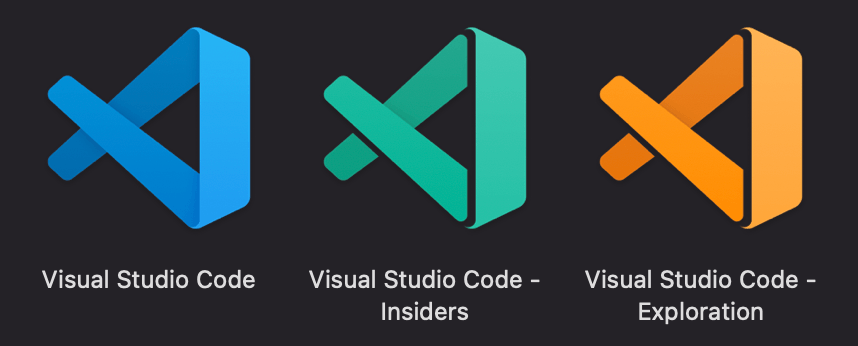
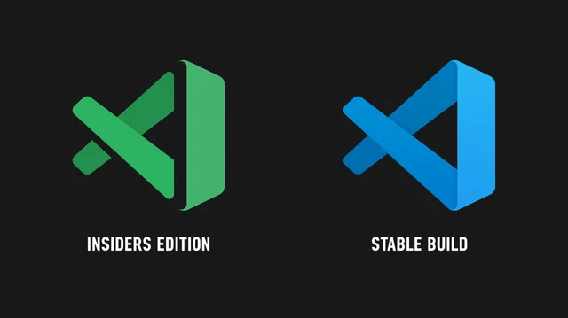

# VsCode推出 “橙色版” “绿色版” ！一个像御姐一个像萝莉

VSCode 坐拥三大版本通道——**Stable稳定版、Insider内测版、Exploration探索版**，性能稳定性天差地别，精准匹配不同开发需求！

> 下载链接：https://code.visualstudio.com/

当代码编辑器开始玩起“人设”，程序员的桌面瞬间变得鲜活起来！微软近期悄然为VsCode解锁了双版本形态——**以稳定版为基底优化的“橙色版”，和以Insider预览版为核心的“绿色版”**。这两个版本如同性格迥异的姐妹花，一个是运筹帷幄的御姐，一个是灵动跳脱的萝莉，承包了不同场景下的开发需求。

## 橙色版：气场全开的效率御姐，稳字当头藏锋芒

橙色版堪称双版本中的“主心骨”，暖橙配色自带专业气场，如同御姐般沉稳可靠。它基于每月更新的稳定版迭代，经充分测试后释放功能，核心人设就是生产环境的“可靠后盾”，从不掉链子。橙色版目前只提供给VSCode开发团队使用

作为御姐，橙色版的“硬实力”藏在细节里，每一项功能都透着掌控全局的分寸感：

- 多文件差异编辑器：快速梳理代码修改脉络，像御姐般一眼看穿问题关键，高效把控代码迭代节奏。
- 独立窗口缩放：支持每个窗口单独设置缩放级别，适配多屏协作、项目演示等多元场景，灵活不违和。
- 精细化控制能力：可按文件类型配置自动保存，代码出错时自动暂停保存，还能单独禁用扩展通知，兼顾全局与细节。
- 实用功能延伸：粘滞滚动覆盖树视图，复杂项目导航更清晰；GitHub Copilot优化上下文识别，AI辅助编码精准高效；屏幕阅读器警报可自定义，兼顾专业度与包容性。

## 绿色版：元气满格的灵动萝莉，新鲜技能拉满

绿色版则是元气满满的萝莉，清新薄荷绿图标灵动吸睛。它以每日更新的Insider预览版为核心，主打“尝鲜”特质，所有前沿功能均先在此上线，像萝莉解锁新玩具般充满惊喜。

“尝鲜”是绿色版的专属标签，每日更新的前沿功能，如同萝莉不断解锁的新玩具，好玩又好用：

- Copilot X深度集成：抢先体验自然语言转命令、AI实时调试辅助，无需额外插件即可激活内联聊天互动，AI助力更直接。
- 终端功能升级：支持Kitty键盘协议和多面板拆分，命令执行结果自动颜色高亮区分，端口转发智能识别并提供快捷选项。
- 便携无负担：Windows平台支持ZIP绿色版，解压缩即能用，不写注册表、不占冗余资源，U盘随身带，随时随地开启编码。
- 个性化拉满：可与橙色版共存且配置隔离，互不干扰；搭配看板娘插件，界面秒变二次元场景，萌系伙伴陪伴编码时光。

## 优先选择Stable稳定版

两者并非二选一，而是互补伙伴。稳健派选橙色版，靠成熟功能稳守生产环境；尝鲜党冲绿色版，抢先解锁前沿技术，适配不同开发需求。

不过目前最适合大众使用的，还得是稳定版 **Stable稳定版**

****

## 结语

我是林三心，一个待过**小型toG型外包公司、大型外包公司、小公司、潜力型创业公司、大公司**的作死型前端选手

我建了一些**前端学习群**，如果大家想进群交流前端知识，可以关注我，回复**加群**
