# 如何用Claude Code 生成顶级UI

## 前言

最近空余时间，在独立开发一些小产品，也在探索一些独立开发的最佳实践。 今天要分享的是：如何用 Claude Code 生成 **「顶级【靓丽】UI」** 🌝

所有的源码都已开源： https://github.com/1111-stu/eisenhower-matrix 

并已部署到vercel，在线预览： https://eisenhower-matrix-to-do.vercel.app/en。

```
众所周知，AI 画的UI， 味太浓了哈哈。今天我们来解决这个痛点！！
```
### 以往我的处理

以往生成UI我会怎么做呢？

- 跟 v0  结对chat，出一版原型，再基于原型样式去迭代
- 或者是使用 stritch  设计一个初版的UI，再进行迭代

```code-snippet__js
- https://v0.app/
- https://stitch.withgoogle.com/
```
下方是其中一个产品，hi-offer 多次迭代后大致的UI 效果，看起来还可以，只是还没有到很靓丽的程度🫥


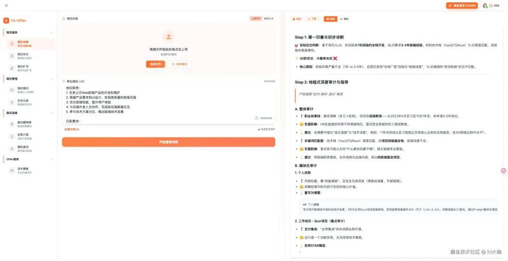

那可能有小伙伴会有同样的疑问：

```code-snippet__js
*   我没有UI 设计经验呀，我要怎么快速实现 **靓丽程度** 的 UI 呢？
*   答案是~~抄~~，No，是模仿学习哈哈
```
给大家一个样例，**「MotherDucker」** 的首页。 给大家10秒钟，思索一下。如果你想复刻这种UI风格，用在自己的产品上，你会怎么做？

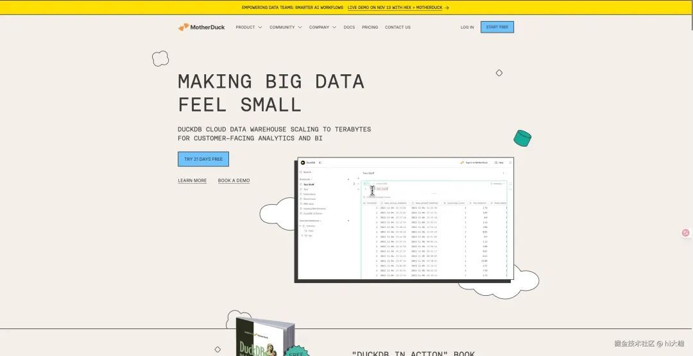

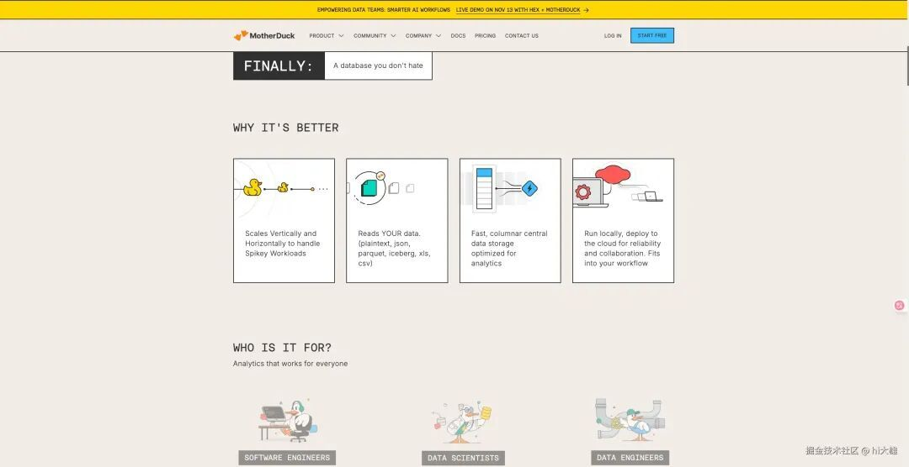

可能有下面的一些思考

```code-snippet__js
-   截图 UI 给 cluade code 分析
-   截图丢给stitch + 对话迭代
```
众所周知，OCR 过程，出现很大UI 信息缺失，比如：具体配色数值、阴影、间距、字体等，于是你会发现，最终AI完成的效果可能都没有60% 。

于是核心思路是：**「解决样式信息大量丢失的问题，通过减少信息代差，让AI coding 完成的UI 风格有不错的效果」**

好消息是，最近实践了一个工作流，很好地解决了这个问题，随我来，我们只需要核心的五个步骤：

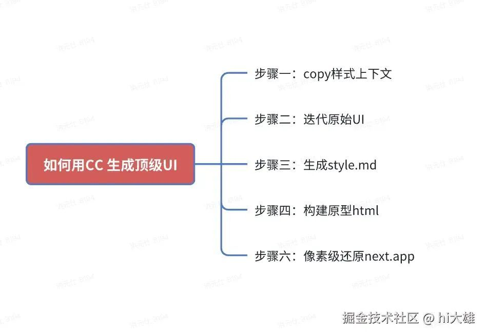

最终成品效果如下，全程vibe coding，详见：https://4-quadrant-to-do.vercel.app/

- 如果你感觉效果还不错，愉快开始本文之旅吧~~
- 如果你认为效果比较牵强，那么阅读本文之后，你一定可以迭代出更好的UI。


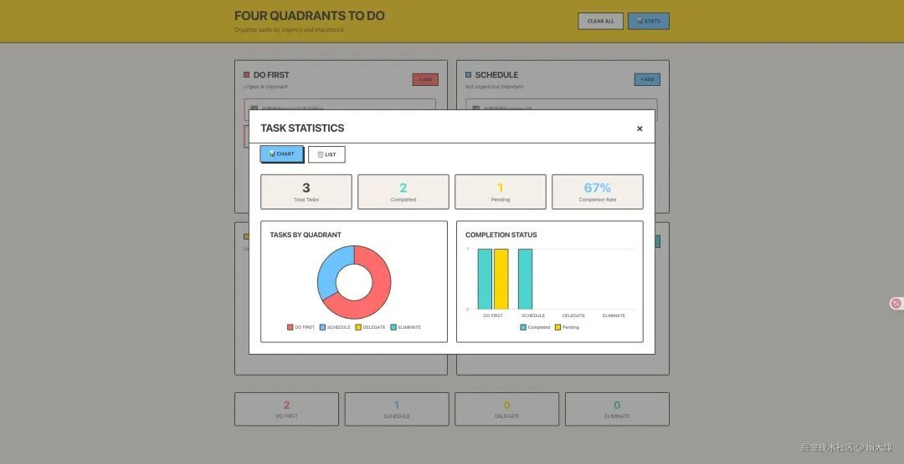

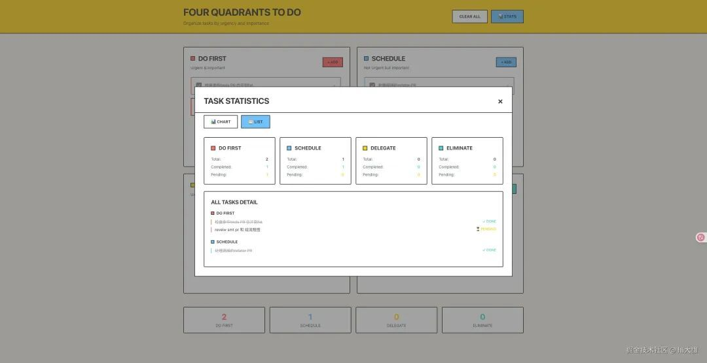

话不多说，我们开始发车 ~~

## 步骤一：Copy样式上下文，生成初版的html

你需要提供下方的的上下文信息给CC，让他帮忙构建一个html 页面

```code-snippet__js
-  参考的 web UI 截图【长图或多张全屏图】
-  copy web 的 html css 样式信息
-  prompt
```
### 截图

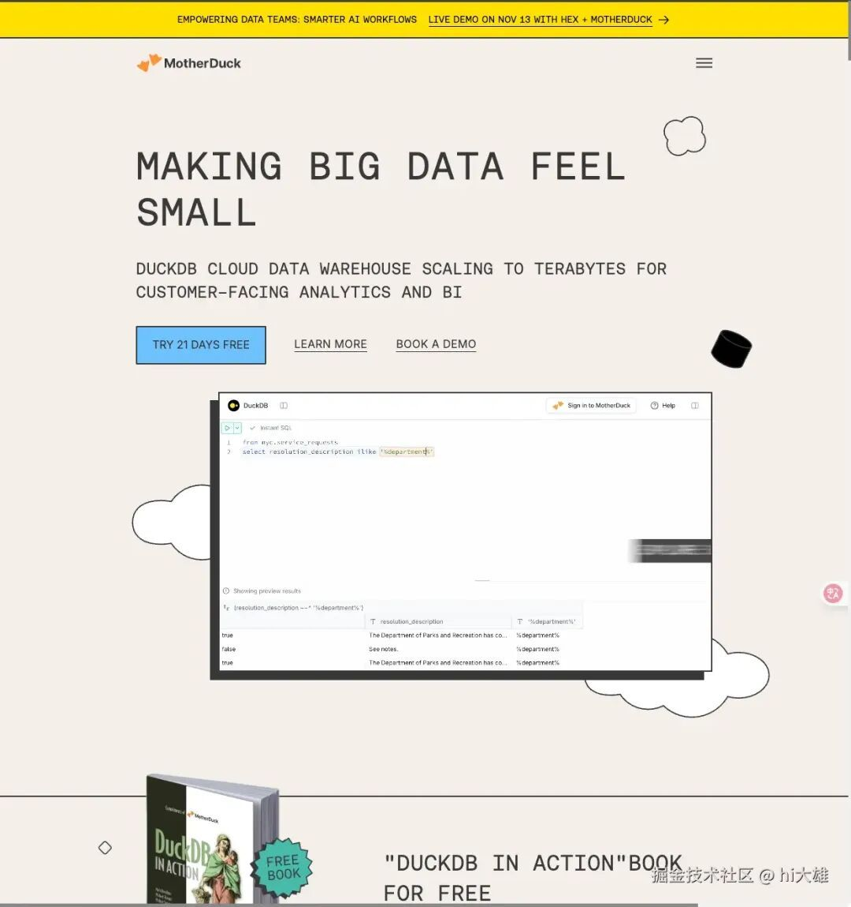

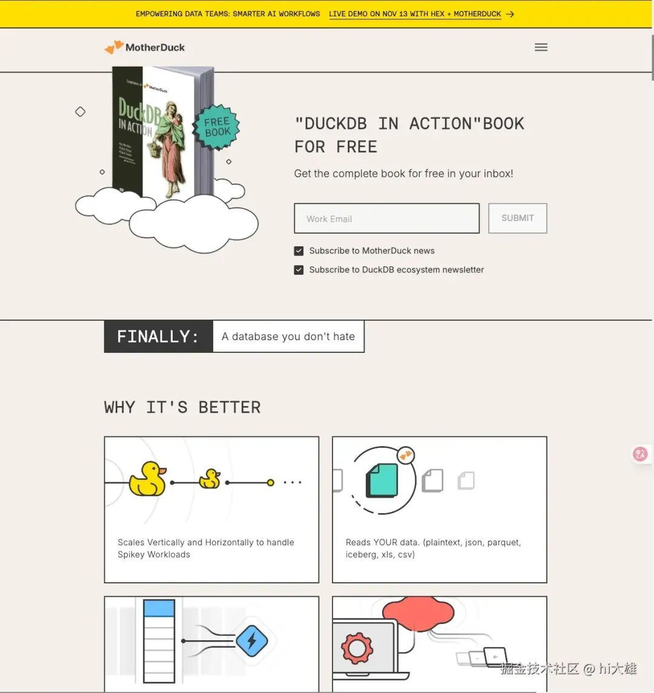

### prompt

```code-snippet__js
Help me rebuild exact same ui design in signle html as xxx.html, above is extracted css:
```
### style info

右键检查，选择html、body 元素，copy style 信息

```code-snippet__js
*   html css style
*   body css style
```
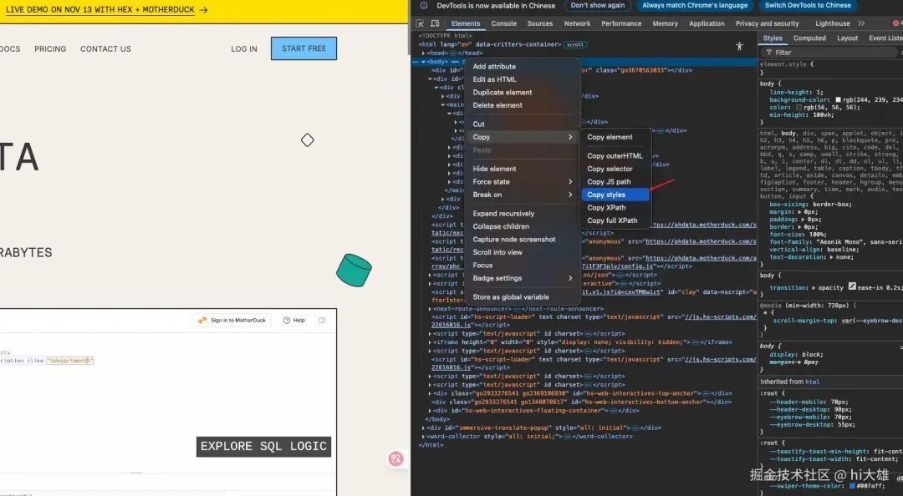

例如：

```code-snippet__js
    -webkit-locale: "en";
    scroll-margin-top: var(--eyebrow-desktop);
    animation-duration: 0.0001s !important;
    animation-iteration-count: 1 !important;
    transition-duration: 0s !important;
    caret-color: transparent !important;
    --tw-border-spacing-x: 0;
    --tw-border-spacing-y: 0;
    --tw-translate-x: 0;
    --tw-translate-y: 0;
    --tw-rotate: 0;
    --tw-skew-x: 0;
    --tw-skew-y: 0;
    --tw-scale-x: 1;
    --tw-scale-y: 1;
    --tw-pan-x: ;
    --tw-pan-y: ;
    --tw-pinch-zoom: ;
    --tw-scroll-snap-strictness: proximity;
    --tw-gradient-from-position: ;
    --tw-gradient-via-position: ;
    --tw-gradient-to-position: ;
    --tw-ordinal: ;
    --tw-slashed-zero: ;
    --tw-numeric-figure: ;
    --tw-numeric-spacing: ;
    --tw-numeric-fraction: ;
    --tw-ring-inset: ;
    --tw-ring-offset-width: 0px;
    --tw-ring-offset-color: #fff;
    --tw-ring-color: rgb(59 130 246 / 0.5);
    --tw-ring-offset-shadow: 0 0 #0000;
    --tw-ring-shadow: 0 0 #0000;
    --tw-shadow: 0 0 #0000;
    --tw-shadow-colored: 0 0 #0000;
    --tw-blur: ;
    --tw-brightness: ;
    --tw-contrast: ;
    --tw-grayscale: ;
    --tw-hue-rotate: ;
    --tw-invert: ;
    --tw-saturate: ;
    --tw-sepia: ;
    --tw-drop-shadow: ;
    --tw-backdrop-blur: ;
    --tw-backdrop-brightness: ;
    --tw-backdrop-contrast: ;
    --tw-backdrop-grayscale: ;
    --tw-backdrop-hue-rotate: ;
    --tw-backdrop-invert: ;
    --tw-backdrop-opacity: ;
    --tw-backdrop-saturate: ;
    --tw-backdrop-sepia: ;
    --tw-contain-size: ;
    --tw-contain-layout: ;
    --tw-contain-paint: ;
    --tw-contain-style: ;
    box-sizing: border-box;
    border: 0px;
    font-size: 100%;
    vertical-align: baseline;
    text-decoration: none;
    scroll-padding-top: var(--header-desktop);
    scroll-behavior: auto;
    height: 100%;
    margin: 0;
    padding: 0;
    line-height: 1.5;
    -webkit-text-size-adjust: 100%;
    tab-size: 4;
    font-family: ui-sans-serif, system-ui, sans-serif, "Apple Color Emoji", "Segoe UI Emoji", "Segoe UI Symbol", "Noto Color Emoji";
    font-feature-settings: normal;
    font-variation-settings: normal;
    -webkit-tap-highlight-color: transparent;
    --swiper-theme-color: #007aff;
    --toastify-toast-min-height: fit-content;
    --toastify-toast-width: fit-content;
    --header-mobile: 70px;
    --header-desktop: 90px;
    --eyebrow-mobile: 70px;
    --eyebrow-desktop: 55px;
```
### HTML 预览效果

cc构建的html 页面

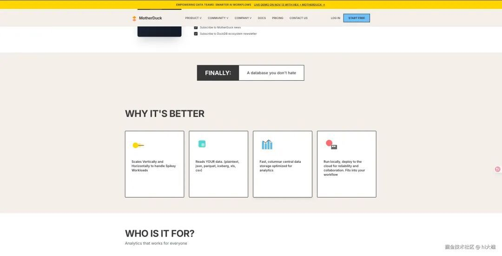

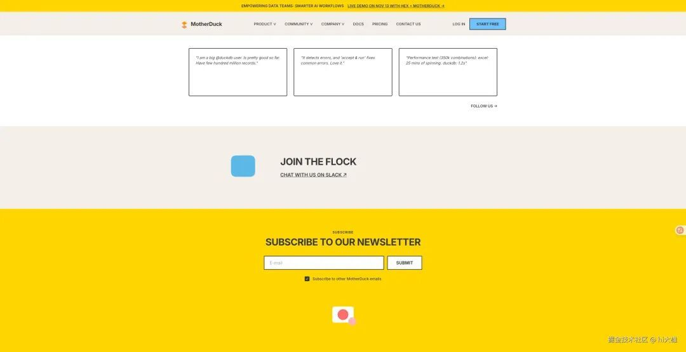

## 步骤2: 迭代原始UI

这里我觉得原始UI的分格上已经可以了，只是一些细节还不太行，比如按钮hover 的阴影、边框等还需要完善。

我一般会使用下方的prompt 以及 copy 具体标签的CSS 来进一步处理。

### prompt

```code-snippet__js
Only code in HTML/Tailwind in a single code block.
Any CSS styles should be in the style attribute. Start with a response, then code and finish with a response.
Don't mention about tokens, Tailwind or HTML.
Always include the html, head and body tags.
Use lucide icons for javascript, 1.5 strokewidth.
Unless style is specified by user, design in the style of Linear, Stripe, Vercel, Tailwind UI (IMPORTANT: don't mention names).
Checkboxes, sliders, dropdowns, toggles should be custom (don't add, only include if part of the UI). Be extremely accurate with fonts.
For font weight, use one level thinner: for example, Bold should be Semibold.
Titles above 20px should use tracking-tight.
Make it responsive.
Avoid setting tailwind config or css classes, use tailwind directly in html tags.
If there are charts, use chart.js for charts (avoid bug: if your canvas is on the same level as other nodes: h2 p canvas div = infinite grows. h2 p div>canvas div = as intended.).
Add subtle dividers and outlines where appropriate.
Don't put tailwind classes in the html tag, put them in the body tags.
If no images are specified, use these Unsplash images like faces, 3d, render, etc.
Be creative with fonts, layouts, be extremely detailed and make it functional.
If design, code or html is provided, IMPORTANT: respect the original design, fonts, colors, style as much as possible.
Don't use javascript for animations, use tailwind instead. Add hover color and outline interactions.
For tech, cool, futuristic, favor dark mode unless specified otherwise.
For modern, traditional, professional, business, favor light mode unless specified otherwise.
Use 1.5 strokewidth for lucide icons and avoid gradient containers for icons.
Use subtle contrast.
For logos, use letters only with tight tracking.
Avoid a bottom right floating DOWNLOAD button.
```
### 原始UI.html 效果

经过两次三次调整后，我觉得work 了

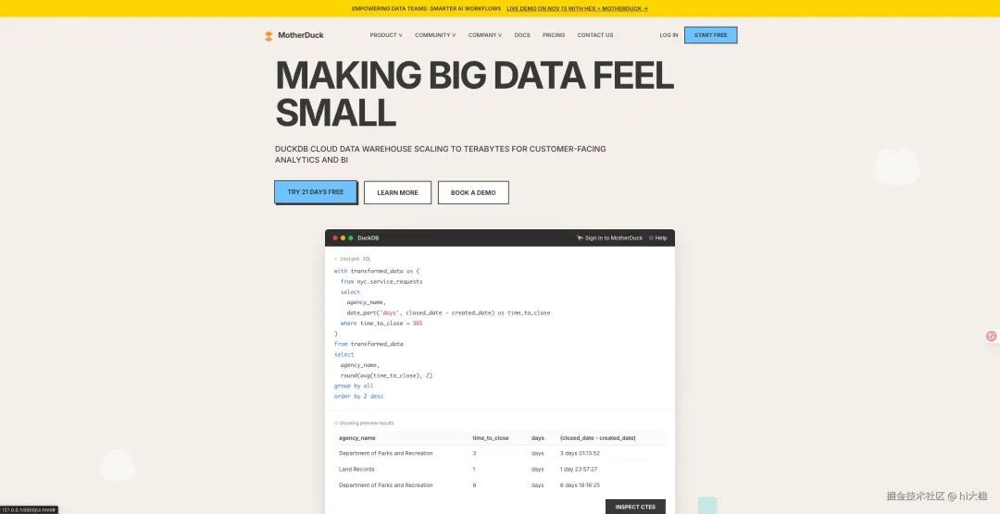

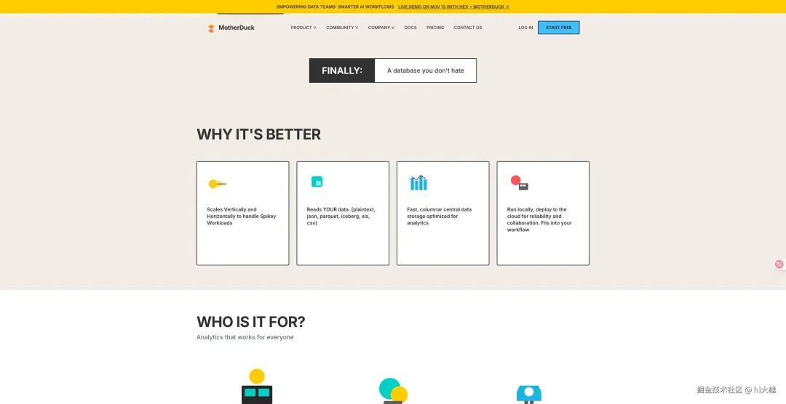

## 步骤3: 生成STYLE\_GUIDE.md

在正式开整我们的web 产品之前，我们需要一个容器，保存上面我们**「原始UI」**的所有样式信息，减少信息代差。

这个容器就是**「STYLE\_GUIDE.md」**，你可以使用下面的 prompt 来生成

### pormpt

```code-snippet__js
Great, now help me generate a detailed style guide\
In style guide, you must include the following part:
- Overview
- Color Palette
- Typography (Pay attention to font weight, font size and how different fonts have been used together in the project)
- Spacing System
- Component Styles
- Shadows & Elevation
- Animations & Transitions
- Border Radius
- Opacity & Transparency
- Common Tailwind CSS Usage in Project
- Example component reference design code
- And so on...
In a word, Give detailed analysis and descriptions to the project style system, and don't miss any important details.
```
### 生成的STYLE\_GUIDE.md

由于cc 给我生成的style-guide 比较长，这里只贴了关键部分，如需查看完整.md, 辛苦移步仓库查看https://github.com/1111-stu/eisenhower-matrix

````code-snippet__js
# MotherDuck UI Design System - Style Guide


## Table of Contents
1. [Overview](#overview)
2. [Color Palette](#color-palette)
3. [Typography](#typography)
4. [Spacing System](#spacing-system)
5. [Component Styles](#component-styles)
6. [Shadows & Elevation](#shadows--elevation)
7. [Animations & Transitions](#animations--transitions)
8. [Border Radius](#border-radius)
9. [Opacity & Transparency](#opacity--transparency)
10. [Layout System](#layout-system)
11. [Common Tailwind CSS Usage](#common-tailwind-css-usage)
12. [Example Component Reference](#example-component-reference)
13. [Responsive Design Patterns](#responsive-design-patterns)


---


## Overview


The MotherDuck design system features a **bold, playful, and technical aesthetic** that combines:
- **Brutalist design principles** with heavy borders and sharp corners
- **Vibrant color palette** inspired by data visualization
- **Interactive micro-animations** with shadow-based hover effects
- **Technical typography** mixing Inter for UI and Monaco for code
- **Generous spacing** for a clean, breathable layout


### Design Philosophy
- **Bold & Confident**: Strong borders, high contrast, and clear visual hierarchy
- **Playful & Approachable**: Bright colors, whimsical cloud decorations, and friendly copy
- **Technical & Professional**: Code samples, data-focused messaging, and precise typography
- **Interactive**: Immediate visual feedback on all interactive elements


---


## Color Palette


### Primary Colors


```css
/* Background Colors */
--beige-background: #F4EFEA;      /* Main page background */
--white: #FFFFFF;                  /* Card and section backgrounds */
--dark-gray: #2D2D2D;             /* Code editor header */


/* Brand Colors */
--primary-blue: #6FC2FF;          /* Primary CTA buttons */
--cyan: #4DD4D0;                  /* Secondary accent, badges */
--light-blue: #5CB8E6;            /* Tertiary accent, banners */
--yellow: #FFD500;                /* Top banner, tags, accents */


/* Text & Borders */
--dark: #383838;                  /* Primary text, borders */
--medium-gray: #666666;           /* Secondary elements */
--light-gray: #E0E0E0;            /* Dividers, table borders */


/* Accent Colors */
--orange-primary: #FF9500;        /* Logo primary */
--orange-secondary: #FF6B00;      /* Logo secondary */
--coral: #FF6B6B;                 /* Error/warning states */
--pink: #FFB6C1;                  /* Decorative accents */


### Color Usage Guidelines


| Color                | Usage                                      | Hex Code  | Tailwind Class                      |
| -------------------- | ------------------------------------------ | --------- | ----------------------------------- |
| **Beige Background** | Main page background, alternating sections | `#F4EFEA` | `bg-[#F4EFEA]`                      |
| **White**            | Cards, modals, content backgrounds         | `#FFFFFF` | `bg-white`                          |
| **Primary Blue**     | Primary CTA buttons, focus states          | `#6FC2FF` | `bg-[#6FC2FF]`                      |
| **Cyan**             | Badges, secondary highlights               | `#4DD4D0` | `bg-[#4DD4D0]`                      |
| **Light Blue**       | Banners, tags, tertiary accents            | `#5CB8E6` | `bg-[#5CB8E6]`                      |
| **Yellow**           | Top banner, promotional elements           | `#FFD500` | `bg-[#FFD500]`                      |
| **Dark Gray**        | Primary text, all borders                  | `#383838` | `text-[#383838]` `border-[#383838]` |
| **Medium Gray**      | Secondary text, disabled states            | `#666666` | `text-gray-600`                     |


### Color Combinations


**High Contrast Pairings:**


*   Yellow background (`#FFD500`) + Dark text (`#383838`)
*   White background + Dark borders (`#383838`)
*   Primary Blue (`#6FC2FF`) + Dark borders (`#383838`)


**Semantic Colors:**


*   **Success**: Cyan (`#4DD4D0`)
*   **Warning**: Yellow (`#FFD500`)
*   **Error**: Coral (`#FF6B6B`)
*   **Info**: Light Blue (`#5CB8E6`)


***


## Typography


### Font Families


```css
/* Primary Font - UI Text */
font-family: 'Inter', -apple-system, BlinkMacSystemFont, sans-serif;


/* Secondary Font - Code Samples */
font-family: 'Monaco', 'Courier New', monospace;
```

### Type Scale


| Element                | Size                 | Weight         | Line Height | Letter Spacing  | Tailwind Classes                                                |
| ---------------------- | -------------------- | -------------- | ----------- | --------------- | --------------------------------------------------------------- |
| **Hero H1**            | 96px / 112px / 128px | 700 (Bold)     | 1.0         | -0.02em (tight) | `text-6xl lg:text-7xl xl:text-8xl font-bold tracking-tighter`   |
| **Section H2**         | 48px / 60px          | 700 (Bold)     | 1.1         | -0.01em (tight) | `text-4xl lg:text-5xl font-bold tracking-tight`                 |
| **Section H2 (Large)** | 48px                 | 700 (Bold)     | 1.1         | -0.01em (tight) | `text-5xl font-bold tracking-tight`                             |
| **Card H3**            | 36px / 42px          | 700 (Bold)     | 1.2         | -0.01em (tight) | `text-3xl lg:text-4xl font-bold tracking-tight`                 |
| **Component H3**       | 16px                 | 600 (Semibold) | 1.3 (snug)  | 0               | `text-base font-semibold leading-snug`                          |
| **Body Large**         | 18px / 20px          | 500 (Medium)   | 1.6         | 0               | `text-lg lg:text-xl font-medium leading-relaxed`                |
| **Body Regular**       | 16px                 | 400 (Regular)  | 1.5         | 0               | `text-base`                                                     |
| **Body Small**         | 14px                 | 500 (Medium)   | 1.5         | 0               | `text-sm font-medium`                                           |
| **Caption**            | 12px                 | 400 (Regular)  | 1.4         | 0               | `text-xs`                                                       |
| **Button Text**        | 14px / 16px          | 700 (Bold)     | 1.0         | 0               | `text-sm font-bold uppercase` / `text-base font-bold uppercase` |
| **Code**               | 13px / 14px          | 400 (Regular)  | 1.8         | 0               | `text-sm code-text leading-relaxed`                             |
| **Label Small**        | 12px                 | 700 (Bold)     | 1.2         | 0.1em (widest)  | `text-xs font-bold tracking-widest`                             |


### Font Weight Guidelines


| Weight         | Value | Usage                                             |
| -------------- | ----- | ------------------------------------------------- |
| **Regular**    | 400   | Body text, descriptions, table content            |
| **Medium**     | 500   | Navigation links, emphasized body text, subtitles |
| **Semibold**   | 600   | Card headings, feature titles                     |
| **Bold**       | 700   | All headings, buttons, tags, labels               |
| **Extra Bold** | 800   | (Not used in current design)                      |


### Typography Patterns


**Heading Pattern:**


```html
<!-- Large Display Heading -->
<h1 class="text-6xl lg:text-7xl xl:text-8xl font-bold tracking-tighter leading-none mb-8">
    MAKING BIG DATA FEEL SMALL
</h1>


<!-- Section Heading -->
<h2 class="text-5xl font-bold tracking-tight mb-16">
    WHY IT'S BETTER
</h2>


<!-- Subsection Heading with Description -->
<h2 class="text-5xl font-bold tracking-tight mb-3">
    WHO IS IT FOR?
</h2>
<p class="text-xl text-gray-600 mb-16">
    Analytics that works for everyone
</p>
```

**Body Text Pattern:**


```html
<!-- Lead Paragraph -->
<p class="text-lg lg:text-xl max-w-4xl mb-10 font-medium leading-relaxed">
    DUCKDB CLOUD DATA WAREHOUSE SCALING TO TERABYTES
</p>


<!-- Regular Paragraph -->
<p class="text-lg leading-relaxed">
    Is your data all over the place? Start making sense...
</p>


<!-- Small Text -->
<p class="text-sm">Subscribe to MotherDuck news</p>
```

**Text Decoration:**


*   Links use `underline` for emphasis
*   All-caps text for: buttons, headings, labels, navigation
*   Tracking adjustment: `-tracking-tighter` for large headings, `tracking-widest` for small labels


***


## Spacing System


### Base Spacing Scale


The design uses Tailwind's default spacing scale (1 unit = 0.25rem / 4px):


| Value | Pixels | Usage                          |
| ----- | ------ | ------------------------------ |
| `1`   | 4px    | Micro spacing, icon gaps       |
| `2`   | 8px    | Tight element spacing          |
| `3`   | 12px   | Small gaps, checkbox spacing   |
| `4`   | 16px   | Default gap, button groups     |
| `6`   | 24px   | Medium spacing, card padding   |
| `8`   | 32px   | Large spacing, section gaps    |
| `10`  | 40px   | Extra large spacing            |
| `12`  | 48px   | Section separation             |
| `16`  | 64px   | Major section separation       |
| `20`  | 80px   | Section padding (vertical)     |
| `28`  | 112px  | Hero section padding (desktop) |


### Component Spacing Patterns


**Section Padding:**


```css
/* Standard Section */
padding: py-20 px-6              /* 80px vertical, 24px horizontal */


/* Compact Section */
padding: py-16 px-6              /* 64px vertical, 24px horizontal */


/* Hero Section */
padding: py-20 lg:py-28 px-6    /* 80px mobile, 112px desktop */
```

**Container Max Width:**


```css
max-w-6xl   /* 1152px - Standard content */
max-w-7xl   /* 1280px - Wide content */
max-w-4xl   /* 896px - Narrow content, forms */
max-w-2xl   /* 672px - Very narrow, centered content */
```

**Gap Spacing:**


```css
gap-2       /* 8px - Tight elements (window dots) */
gap-3       /* 12px - Form elements, checkboxes */
gap-4       /* 16px - Button groups, form rows */
gap-6       /* 24px - Grid items (small screens) */
gap-8       /* 32px - Navigation items */
gap-12      /* 48px - Card grid (medium) */
gap-16      /* 64px - Section elements */
```

**Margin Spacing:**


```css
/* Heading Margins */
mb-2        /* 8px - Label to content */
mb-3        /* 12px - Subtitle to content */
mb-6        /* 24px - Small heading to content */
mb-8        /* 32px - Medium heading to content */
mb-16       /* 64px - Large heading to grid */


/* Element Margins */
mb-4        /* 16px - Paragraph to button */
mb-6        /* 24px - Form to submit */
mb-8        /* 32px - Icon to text */
```
````
## 步骤4: 构建原型html

为了验证效果我们叫cc 大哥，参考STYLE\_GUIDE.md ,实现一个四象限 to-do list 的.html 原型。

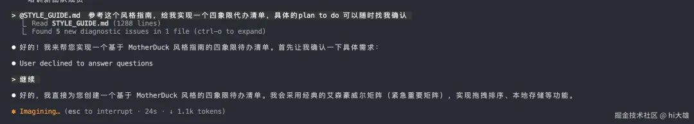

中间省略我跟他对需求的过程，下方是cc实现的初稿👇

看起来平平无奇，甚至有点糟糕，什么东西嘛这是？？🥸

别担心！！ 别忘啦，所有的样式信息，都在STYLE\_GUIDE.md ，我们可以继续push cc 迭代。

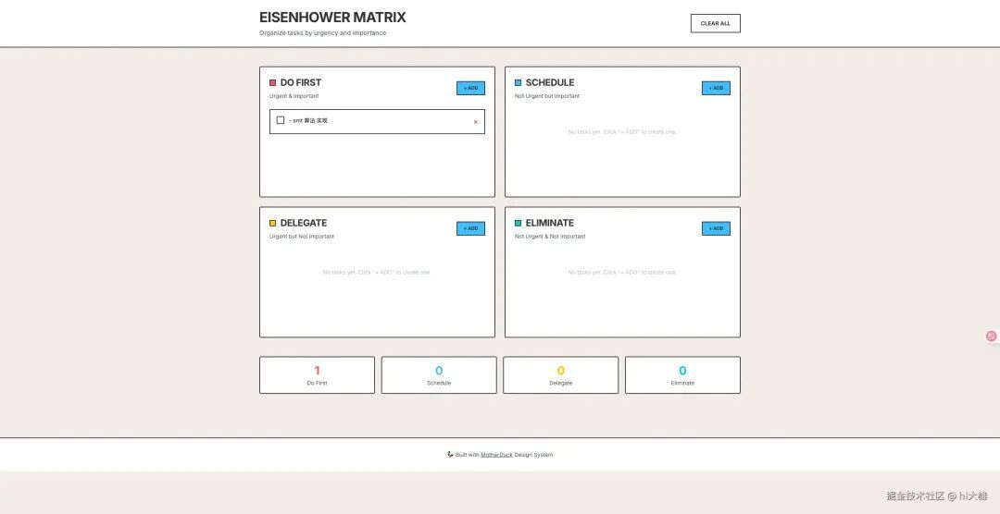

### ui 迭代

```code-snippet__js
1：叫替换一下 header 的颜色为style-guide.md 里面的黄色 
2：添加图表统计功能
```
经过几轮的迭代，我们得到了初版的效果

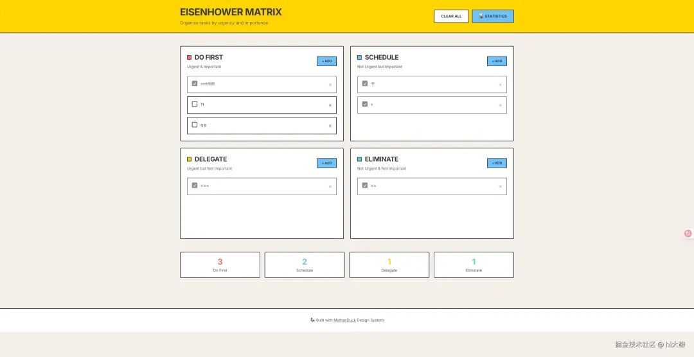

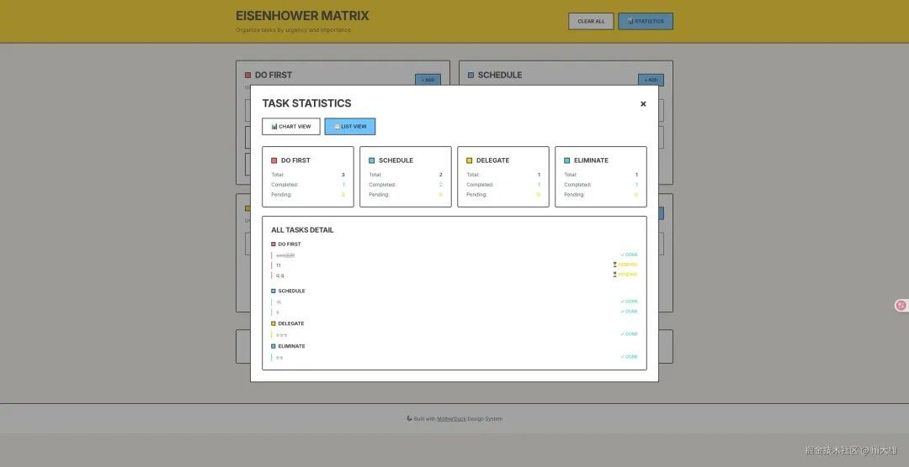

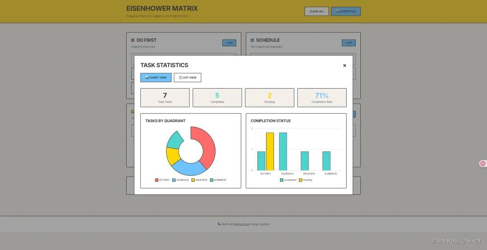

## 步骤5：构建像素级别还原的next app

原生的.html 不方便后续迭代维护，你可以使用下方的prompt 叫CC构建一个next app 开始build 之前可以梳理一下已实现的功能，方便后续迭代

### prompt

```code-snippet__js
> Great，now you need to  build a next app from todo-quadrant.html 
- you need to ensure the UI and logic are pixel perfectly restorely 。
- the code structure should be clear enough and The code is highly readable.  
- when there is the case that if-else ，your need to use early-return to solve 
```
### 保存plan.md

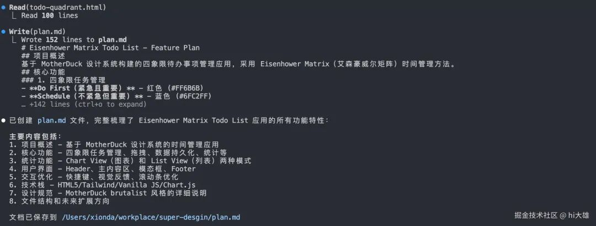

最终的next.app 效果

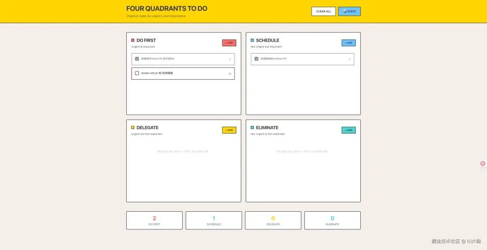

## 其他扩展

当然啦，有了**「STYLE\_GUIDE.md」**你还可以拓展更多的实践，比如：

```code-snippet__js
-  在 stitch 生成符合风格 ui 设计稿【还可以加上初版的.html】
-  在lovart 生成符合风格的美术素材
-  基于farme motion 生成产品演示动画
-  生成漂亮的产品的幻灯片（html），用一些工具转为ppt 使用
```
推荐阅读  点击标题可跳转

1、[“天才少年”5年0收入造JS核武！Claude天价收购Bun，Node.js生态地震](https://mp.weixin.qq.com/s?__biz=MzAxODE2MjM1MA==&mid=2651623436&idx=1&sn=97559a7547e46d0ff187a9243d79b6bf&scene=21#wechat_redirect)

2、[文件被 Gemini 当场“格式化”，全没了！网友控诉：Claude、Copilot 也爱删库，一个都跑不了](https://mp.weixin.qq.com/s?__biz=MzAxODE2MjM1MA==&mid=2651622859&idx=1&sn=67e0c26a0716b1b457353434735cfe4c&scene=21#wechat_redirect)

3、[VS Code 重磅更新：新增智能体管理功能，但是下架免费代码补全工具。网友：微软你倒是说清楚](https://mp.weixin.qq.com/s?__biz=MzAxODE2MjM1MA==&mid=2651623546&idx=1&sn=29fb73b4f44ba07213642366500afb4b&scene=21#wechat_redirect)
