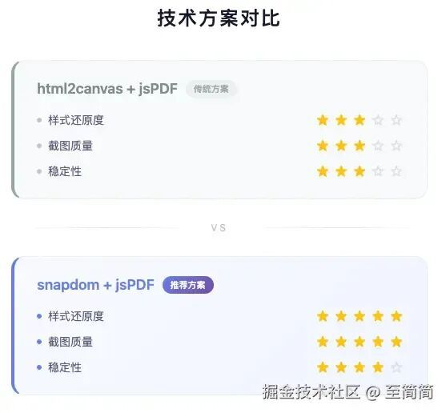
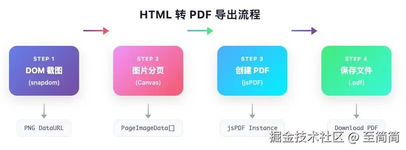

# 一种新HTML页面转换成 PDF 技术方案

转自：稀土掘金技术社区

## 背景

❝

本文将深入讲解如何使用 snapdom 和 jsPDF 实现高质量的 HTML 转 PDF 功能，并通过一个完整的消息列表导出案例，带你掌握这套方案的核心技术。

❞

### 为什么 HTML 转 PDF 如此重要？

在现代 Web 应用中，**「HTML 转 PDF」** 是一个非常常见的需求场景：

1. **「客服系统」**：导出聊天记录用于存档或投诉处理
2. **「电商平台」**：生成订单详情、发票等 PDF 文档
3. **「报表系统」**：将可视化图表和数据导出为 PDF 报告
4. **「在线文档」**：支持用户将网页内容离线保存
5. **「合同签署」**：生成合同 PDF 用于电子签名

然而，实现一个**「高质量」**的 HTML 转 PDF 功能并不简单。我们面临以下挑战：


| 挑战 | 描述 |
| --- | --- |
| 「样式还原」 | CSS 样式、字体、渐变等能否完美呈现？ |
| 「分页处理」 | 长内容如何智能分页，避免内容被截断？ |
| 「清晰度」 | 导出的 PDF 是否足够清晰，尤其在打印时？ |
| 「性能」 | 大量内容（如 1000 条消息）能否快速导出？ |
| 「兼容性」 | 不同浏览器表现是否一致？ |


传统的 `html2canvas` + `jsPDF` 方案虽然能用，但在**「样式还原度」**和**「截图质量」**上存在明显不足。

今天笔者介绍一套新解决方案：**「snapdom + jsPDF」**。

## snapdom 和 jsPDF 基础理论知识

### snapdom 是什么？

SnapDOM 是一个现代化的 DOM 截图库，它的核心特点是：

```
DOM Element → Canvas/PNG/SVG
```
#### 核心优势

1. **「高保真截图」**：完美还原 CSS 样式，包括 flexbox、grid、渐变、阴影等
2. **「多种输出格式」**：支持 Canvas、PNG、SVG 等多种格式
3. **「高清缩放」**：通过 `scale` 参数实现 2x/3x 高清截图
4. **「体积小巧」**：压缩后仅 ~20KB

#### 基础用法

```code-snippet__js
ounter(lineounter(lineounter(lineounter(lineounter(lineounter(lineounter(lineounter(lineounter(lineounter(lineounter(lineounter(lineounter(lineounter(lineounter(line
import { snapdom } from '@zumer/snapdom';


// 获取 DOM 元素
const element = document.querySelector('.my-element');


// 截图
const capture = await snapdom(element, {
  scale: 2,      // 2倍清晰度
  quality: 0.95  // PNG 质量
});


// 输出方式
const canvas = await capture.toCanvas();  // Canvas 元素
const imgEl = await capture.toPng();      //  元素，src 为 data URL
const svgStr = await capture.toSvg();     // SVG 字符串
```
#### 关键参数说明


| 参数 | 类型 | 默认值 | 说明 |
| --- | --- | --- | --- |
| scale | number | 1 | 缩放倍数，2 表示 2 倍清晰度 |
| quality | number | 0.92 | 图片质量，范围 0-1 |


更多详细内容请看https://snapdom.dev/官方文档

### jsPDF 是什么？

jsPDF 是最流行的 JavaScript PDF 生成库，支持在浏览器端直接创建 PDF 文件。

#### 核心特点

1. **「纯前端方案」**：无需服务端，浏览器直接生成
2. **「功能丰富」**：支持文本、图片、表格、链接等
3. **「多种尺寸」**：A4、Letter 等标准纸张格式
4. **「插件生态」**：支持 AutoTable 等扩展插件

#### 基础用法

```code-snippet__js
ounter(lineounter(lineounter(lineounter(lineounter(lineounter(lineounter(lineounter(lineounter(lineounter(lineounter(lineounter(lineounter(lineounter(lineounter(lineounter(lineounter(lineounter(lineounter(lineounter(lineounter(lineounter(lineounter(lineounter(lineounter(line
import { jsPDF } from 'jspdf';


// 创建 PDF 实例
const pdf = new jsPDF({
  orientation: 'portrait',  // 纵向
  unit: 'mm',               // 单位：毫米
  format: 'a4',             // A4 纸张
  compress: true            // 启用压缩
});


// 添加图片
pdf.addImage(
  imageDataUrl,  // Base64 图片数据
  'PNG',         // 图片格式
  10,            // X 坐标（mm）
  10,            // Y 坐标（mm）
  190,           // 宽度（mm）
  100            // 高度（mm）
);


// 添加新页面
pdf.addPage();


// 保存文件
pdf.save('output.pdf');
```
#### A4 尺寸常量

```code-snippet__js
ounter(lineounter(lineounter(lineounter(lineounter(lineounter(lineounter(lineounter(lineounter(lineounter(line
// A4 标准尺寸（单位：mm）
const A4_WIDTH_MM = 210;
const A4_HEIGHT_MM = 297;


// 页面边距
const MARGIN_MM = 10;


// 可用内容区域
const CONTENT_WIDTH_MM = 190;   // 210 - 10*2
const CONTENT_HEIGHT_MM = 277;  // 297 - 10*2
```
### snapdom + jsPDF 组合的优势

## 

## 案例讲述

笔者写一个IM产品中 MessageList 消息导出DEMO。接下来，我们通过一个完整的**「客服消息列表导出」**案例，讲解如何使用 snapdom + jsPDF 实现 HTML 转 PDF。

### 项目结构

```code-snippet__js
src/
├── components/
│   ├── MessageList.tsx      # 消息列表组件
│   └── MessageList.css      # 消息列表样式
├── services/
│   └── messageExportService.ts  # PDF 导出服务（核心）
└── App.tsx
```
### 核心流程

整个导出过程分为 **「4 个步骤」**：



image.png

### Step 1：DOM 截图（snapdom）

第一步，使用 snapdom 将整个消息列表 DOM 转换为高清 PNG 图片。

```code-snippet__js
ounter(lineounter(lineounter(lineounter(lineounter(lineounter(lineounter(lineounter(lineounter(lineounter(lineounter(lineounter(lineounter(lineounter(lineounter(lineounter(lineounter(lineounter(lineounter(lineounter(lineounter(lineounter(lineounter(lineounter(lineounter(lineounter(lineounter(lineounter(lineounter(lineounter(lineounter(lineounter(lineounter(lineounter(lineounter(lineounter(lineounter(lineounter(lineounter(lineounter(lineounter(lineounter(lineounter(lineounter(lineounter(lineounter(lineounter(lineounter(lineounter(lineounter(lineounter(lineounter(lineounter(lineounter(lineounter(line
// messageExportService.ts


import { snapdom } from '@zumer/snapdom';


// 图片质量配置
const IMAGE_QUALITY = 0.95;
const IMAGE_FORMAT = 'image/png' as const;


/**
 * 将 DOM 元素转换为图片
 */
export async function captureElementToImage(
  element: HTMLElement,
  quality: number = IMAGE_QUALITY
): Promise<string> {
  console.log('开始截图...');


  // 保存原始样式
  const originalOverflow = element.style.overflow;
  const originalHeight = element.style.height;
  const originalMaxHeight = element.style.maxHeight;


  // 临时设置样式，确保完整截图
  element.style.overflow = 'visible';
  element.style.height = 'auto';
  element.style.maxHeight = 'none';


  try {
    // 核心：使用 snapdom 进行截图
    const capture = await snapdom(element, {
      scale: 2,        // 2倍清晰度
      quality: quality
    });


    // 优先使用 toPng()
    const imgElement = await capture.toPng();
    const dataUrl = imgElement.src;


    // 验证数据有效性
    if (!dataUrl || dataUrl.length < 100) {
      console.log('toPng 返回无效，尝试 toCanvas...');
      const canvas = await capture.toCanvas();
      return canvas.toDataURL(IMAGE_FORMAT, quality);
    }


    console.log('截图成功，大小:', (dataUrl.length / 1024).toFixed(2), 'KB');
    return dataUrl;


  } finally {
    // 恢复原始样式
    element.style.overflow = originalOverflow;
    element.style.height = originalHeight;
    element.style.maxHeight = originalMaxHeight;
  }
}
```
**「关键点解析」**：

1. **「临时修改样式」**：将 `overflow`、`height`、`maxHeight` 临时设置为可见状态，确保截取完整内容
2. **「scale: 2」**：2 倍缩放提高清晰度，打印时效果更佳
3. **「降级处理」**：`toPng()` 失败时自动回退到 `toCanvas()`
4. **「样式恢复」**：截图完成后恢复原始样式

### Step 2：图片分页（Canvas）

长图片需要按照 A4 页面高度进行分割，这是最复杂的一步。

```code-snippet__js
ounter(lineounter(lineounter(lineounter(lineounter(lineounter(lineounter(lineounter(lineounter(lineounter(lineounter(lineounter(lineounter(lineounter(lineounter(lineounter(lineounter(lineounter(lineounter(lineounter(lineounter(lineounter(lineounter(lineounter(lineounter(lineounter(lineounter(lineounter(lineounter(lineounter(lineounter(lineounter(lineounter(lineounter(lineounter(lineounter(lineounter(lineounter(lineounter(lineounter(lineounter(lineounter(lineounter(lineounter(lineounter(lineounter(lineounter(lineounter(lineounter(lineounter(lineounter(lineounter(lineounter(lineounter(lineounter(lineounter(lineounter(lineounter(lineounter(lineounter(lineounter(lineounter(lineounter(lineounter(lineounter(lineounter(lineounter(lineounter(lineounter(lineounter(lineounter(lineounter(lineounter(lineounter(lineounter(lineounter(lineounter(lineounter(lineounter(lineounter(lineounter(lineounter(lineounter(lineounter(lineounter(lineounter(lineounter(lineounter(lineounter(lineounter(lineounter(lineounter(lineounter(lineounter(lineounter(lineounter(lineounter(lineounter(lineounter(lineounter(line
// 尺寸常量
const A4_WIDTH_MM = 210;
const A4_HEIGHT_MM = 297;
const PDF_MARGIN_MM = 10;
const PDF_CONTENT_WIDTH_MM = A4_WIDTH_MM - PDF_MARGIN_MM * 2;   // 190mm
const PDF_CONTENT_HEIGHT_MM = A4_HEIGHT_MM - PDF_MARGIN_MM * 2; // 277mm
// 1mm = 3.7795275590551 像素（96 DPI）
const MM_TO_PX = 3.7795275590551;
// 分页后的图片数据
interface PageImageData {
  dataUrl: string;
  width: number;
  height: number;
}
/**
 * 将长图片分割成多个 A4 页面
 */
export async function splitImageIntoPages(
  imageDataUrl: string
): Promise<PageImageData[]> {
  return new Promise((resolve, reject) => {
    const img = new Image();
    img.crossOrigin = 'anonymous';
    img.onload = () => {
      const pages: PageImageData[] = [];
      const originalWidth = img.width;
      const originalHeight = img.height;
      // 将 A4 内容区域转换为像素（考虑 scale=2）
      const pageContentHeightPx = Math.floor(
        PDF_CONTENT_HEIGHT_MM * MM_TO_PX * 2  // scale=2
      );
      const pageContentWidthPx = Math.floor(
        PDF_CONTENT_WIDTH_MM * MM_TO_PX * 2
      );
      // 计算缩放比例（图片宽度适配页面宽度）
      const widthScale = pageContentWidthPx / originalWidth;
      const scaledHeight = originalHeight * widthScale;
      // 计算总页数
      const totalPages = Math.ceil(scaledHeight / pageContentHeightPx);
      console.log(`原始尺寸: ${originalWidth}x${originalHeight}px`);
      console.log(`缩放后高度: ${scaledHeight}px, 总页数: ${totalPages}`);
      // 逐页裁剪
      for (let pageIndex = 0; pageIndex < totalPages; pageIndex++) {
        const startY = pageIndex * pageContentHeightPx;
        const endY = Math.min(startY + pageContentHeightPx, scaledHeight);
        const currentPageHeight = Math.floor(endY - startY);
        // 计算源图片对应的区域
        const sourceStartY = startY / widthScale;
        const sourceHeight = currentPageHeight / widthScale;
        // 创建新 Canvas
        const canvas = document.createElement('canvas');
        const ctx = canvas.getContext('2d')!;
        canvas.width = pageContentWidthPx;
        canvas.height = currentPageHeight;
        // 高质量渲染
        ctx.imageSmoothingEnabled = true;
        ctx.imageSmoothingQuality = 'high';
        // 绘制当前页内容
        ctx.drawImage(
          img,
          0, sourceStartY,           // 源图片起始位置
          originalWidth, sourceHeight, // 源图片尺寸
          0, 0,                        // 目标起始位置
          pageContentWidthPx, currentPageHeight // 目标尺寸
        );
        // 转换为 data URL
        const pageDataUrl = canvas.toDataURL(IMAGE_FORMAT, IMAGE_QUALITY);
        pages.push({
          dataUrl: pageDataUrl,
          width: pageContentWidthPx,
          height: currentPageHeight
        });
        console.log(`第 ${pageIndex + 1}/${totalPages} 页处理完成`);
      }
      resolve(pages);
    };
    img.onerror = () => reject(new Error('图片加载失败'));
    img.src = imageDataUrl;
  });
}
```
**「分页算法图解」**：

```code-snippet__js
原始长图 (假设 5000px 高)
┌───────────────────┐
│                   │ ─┐
│      Page 1       │  │ 1046px (277mm × 3.78 × 2)
│                   │ ─┘
├───────────────────┤
│                   │ ─┐
│      Page 2       │  │ 1046px
│                   │ ─┘
├───────────────────┤
│                   │ ─┐
│      Page 3       │  │ 1046px
│                   │ ─┘
├───────────────────┤
│                   │ ─┐
│      Page 4       │  │ 1046px
│                   │ ─┘
├───────────────────┤
│      Page 5       │ ── 剩余 816px
│                   │
└───────────────────┘
```
### Step 3：创建 PDF（jsPDF）

将分页后的图片逐一添加到 PDF 中。

```code-snippet__js
ounter(lineounter(lineounter(lineounter(lineounter(lineounter(lineounter(lineounter(lineounter(lineounter(lineounter(lineounter(lineounter(lineounter(lineounter(lineounter(lineounter(lineounter(lineounter(lineounter(lineounter(lineounter(lineounter(lineounter(lineounter(lineounter(lineounter(lineounter(lineounter(lineounter(lineounter(lineounter(lineounter(lineounter(lineounter(lineounter(lineounter(lineounter(lineounter(lineounter(lineounter(lineounter(lineounter(line
import { jsPDF } from 'jspdf';


/**
 * 从分页图片创建 PDF
 */
export function createPdfFromPages(pages: PageImageData[]): jsPDF {
  const pdf = new jsPDF({
    orientation: 'portrait',
    unit: 'mm',
    format: 'a4',
    compress: true  // 启用压缩，减小文件体积
  });


  if (pages.length === 0) {
    throw new Error('没有可添加的页面');
  }


  pages.forEach((page, index) => {
    // 第一页直接用，后续需要 addPage
    if (index > 0) {
      pdf.addPage();
    }


    // 像素转毫米（考虑 scale=2）
    const scaleFactor = 2;
    const pageHeightMm = page.height / MM_TO_PX / scaleFactor;


    // 图片适配内容区域宽度
    const finalWidth = PDF_CONTENT_WIDTH_MM;  // 190mm
    const finalHeight = pageHeightMm;


    // 位置：左上角对齐，保留 10mm 边距
    const x = PDF_MARGIN_MM;
    const y = PDF_MARGIN_MM;


    console.log(`添加第 ${index + 1} 页: ${finalWidth}x${finalHeight.toFixed(2)}mm`);


    // 添加图片到 PDF
    pdf.addImage(page.dataUrl, 'PNG', x, y, finalWidth, finalHeight);
  });


  return pdf;
}
```
### Step 4：主导出函数

将以上步骤串联起来，提供统一的导出接口。

```code-snippet__js
ounter(lineounter(lineounter(lineounter(lineounter(lineounter(lineounter(lineounter(lineounter(lineounter(lineounter(lineounter(lineounter(lineounter(lineounter(lineounter(lineounter(lineounter(lineounter(lineounter(lineounter(lineounter(lineounter(lineounter(lineounter(lineounter(lineounter(lineounter(lineounter(lineounter(lineounter(lineounter(lineounter(lineounter(lineounter(lineounter(lineounter(lineounter(lineounter(lineounter(lineounter(lineounter(lineounter(lineounter(line
interface ExportConfig {
  targetSelector: string;   // CSS 选择器
  filename?: string;        // 文件名
  quality?: number;         // 图片质量
}


/**
 * 主导出函数
 */
export async function exportMessagesToPdf(config: ExportConfig): Promise<void> {
  const {
    targetSelector,
    filename = 'messages.pdf',
    quality = IMAGE_QUALITY
  } = config;


  console.log('=== 开始导出 PDF ===');


  // 1. 获取目标元素
  const element = document.querySelector(targetSelector) as HTMLElement;
  if (!element) {
    throw new Error(`元素未找到: ${targetSelector}`);
  }


  console.log('元素尺寸:', {
    width: element.offsetWidth,
    height: element.scrollHeight
  });


  // 2. DOM 截图
  const imageDataUrl = await captureElementToImage(element, quality);
  console.log('截图完成，大小:', (imageDataUrl.length / 1024).toFixed(2), 'KB');


  // 3. 图片分页
  const pages = await splitImageIntoPages(imageDataUrl);
  console.log(`分页完成，共 ${pages.length} 页`);


  // 4. 创建 PDF
  const pdf = createPdfFromPages(pages);


  // 5. 保存文件
  pdf.save(filename);
  console.log('=== 导出完成 ===');
}
```
### 在组件中使用

```code-snippet__js
ounter(lineounter(lineounter(lineounter(lineounter(lineounter(lineounter(lineounter(lineounter(lineounter(lineounter(lineounter(lineounter(lineounter(lineounter(lineounter(lineounter(lineounter(lineounter(lineounter(lineounter(lineounter(lineounter(lineounter(lineounter(lineounter(lineounter(lineounter(lineounter(lineounter(lineounter(lineounter(lineounter(lineounter(lineounter(lineounter(lineounter(lineounter(lineounter(lineounter(lineounter(lineounter(lineounter(lineounter(lineounter(lineounter(lineounter(lineounter(lineounter(lineounter(lineounter(line
// MessageList.tsx


import { exportMessagesToPdf } from '../services/messageExportService';


const MessageList: React.FC = () => {
  const messageListRef = useRef<HTMLDivElement>(null);
  const [isExporting, setIsExporting] = useState(false);


  const handleExportToPdf = useCallback(async () => {
    setIsExporting(true);


    try {
      // 生成带时间戳的文件名
      const timestamp = new Date().toISOString().replace(/[:.]/g, '-');
      const filename = `messages-${timestamp}.pdf`;


      await exportMessagesToPdf({
        targetSelector: '.message-list-container',
        filename,
        quality: 0.95
      });


    } catch (error) {
      console.error('导出失败:', error);
      alert('导出失败，请重试');
    } finally {
      setIsExporting(false);
    }
  }, []);


  return (
    <div className="message-list-container" ref={messageListRef}>
      <div className="message-list-header">
        <h2>消息记录</h2>
        <button
          className="export-button"
          onClick={handleExportToPdf}
          disabled={isExporting}
        >
          {isExporting ? '导出中...' : '导出 PDF'}
        </button>
      </div>


      <div className="message-list">
        {messages.map(message => (
          <MessageItem key={message.id} message={message} />
        ))}
      </div>
    </div>
  );
};
```
### 完整效果

运行项目后，点击「导出 PDF」按钮：

1. 控制台显示详细的导出日志
2. 自动计算页数并分页
3. 生成高清 PDF 文件并自动下载

```code-snippet__js
=== 开始导出 PDF ===
目标选择器: .message-list-container
元素尺寸: { width: 600, height: 8500 }
开始截图...
截图完成，大小: 2847.65 KB
分页完成，共 8 页
添加第 1 页: 190x277.00mm
添加第 2 页: 190x277.00mm
...
添加第 8 页: 190x156.32mm
=== 导出完成 ===
```
---

## SnapDOM VS html2canvas

为什么选择 SnapDOM 而不是更流行的 html2canvas？让我们来对比一下：

### 详细对比表


| 对比维度 | SnapDOM | html2canvas |
| --- | --- | --- |
| 「样式还原」 | ★★★★★ 接近完美 | ★★★☆☆ 部分样式丢失 |
| 「Flexbox/Grid」 | ✅ 完美支持 | ⚠️ 部分问题 |
| 「渐变背景」 | ✅ 完美支持 | ⚠️ 可能失真 |
| 「阴影效果」 | ✅ 完美支持 | ⚠️ 部分丢失 |
| 「自定义字体」 | ✅ 支持 | ⚠️ 需要额外处理 |
| 「SVG 支持」 | ✅ 原生支持 | ⚠️ 有限支持 |
| 「输出格式」 | PNG/Canvas/SVG | Canvas/PNG |
| 「包大小」 | ~20KB | ~60KB |
| 「维护状态」 | 活跃更新 | 较少更新 |
| 「API 设计」 | 现代 Promise | 回调 + Promise |


### 代码对比

**「html2canvas 方式：」**

```code-snippet__js
ounter(lineounter(lineounter(lineounter(lineounter(lineounter(lineounter(lineounter(lineounter(lineounter(lineounter(lineounter(lineounter(line
import html2canvas from 'html2canvas';


// 需要处理各种兼容性问题
const canvas = await html2canvas(element, {
  scale: 2,
  useCORS: true,
  logging: false,
  allowTaint: true,
  foreignObjectRendering: true,  // 可能不生效
  // 还需要处理字体、SVG 等问题...
});


const dataUrl = canvas.toDataURL('image/png');
```
**「SnapDOM 方式：」**

```code-snippet__js
ounter(lineounter(lineounter(lineounter(lineounter(lineounter(lineounter(lineounter(lineounter(line
import { snapdom } from '@zumer/snapdom';


// 简洁的 API，无需额外配置
const capture = await snapdom(element, {
  scale: 2,
  quality: 0.95
});


const dataUrl = (await capture.toPng()).src;
```
### 什么时候选择 html2canvas？

虽然 SnapDOM 在大多数场景下更优秀，但 html2canvas 在以下情况可能更适合：

1. **「项目已在使用」**：迁移成本较高
2. **「简单场景」**：只需截取简单文本，无复杂样式
3. **「团队熟悉度」**：团队对 html2canvas 更熟悉

## 总结

### 核心要点回顾

1. **「SnapDOM」** 提供高保真的 DOM 截图能力，通过 `scale: 2` 实现 2 倍清晰度
2. **「jsPDF」** 是强大的 PDF 生成库，支持 A4 纸张、压缩等特性
3. **「分页算法」** 是整个方案的核心难点，需要精确计算像素与毫米的转换
4. **「SnapDOM」** 相比 html2canvas 在样式还原度上有明显优势

### 进一步优化方向


| 优化点 | 说明 |
| --- | --- |
| 「Web Worker」 | 将分页计算放到 Worker 中，避免阻塞主线程 |
| 「分段截图」 | 超长内容分段截图，避免内存溢出 |
| 「加载提示」 | 添加进度条，提升用户体验 |
| 「PDF 压缩」 | 使用 pdf-lib 进一步压缩 PDF 体积 |
| 「页眉页脚」 | 添加页码、时间戳等信息 |


  

推荐阅读  点击标题可跳转

1、[某度员工自称“滥竽充数 10 年”，精准躲过每次裁员。网友：他不是没能力，是没热情了](https://mp.weixin.qq.com/s?__biz=MzAxODE2MjM1MA==&mid=2651623568&idx=1&sn=9fbfdb6c137f0a85636666342741a4d4&scene=21#wechat_redirect)

2、[性能暴涨 3 倍！Prisma 7 颠覆性更新：放弃 Rust 拥抱 TypeScript！](https://mp.weixin.qq.com/s?__biz=MzAxODE2MjM1MA==&mid=2651623568&idx=2&sn=a8283db4d45c851bcef232a61fff219e&scene=21#wechat_redirect)

3、[1 天净赚 9.6 亿！字节火速给全员涨薪](https://mp.weixin.qq.com/s?__biz=MzAxODE2MjM1MA==&mid=2651623557&idx=1&sn=129626a6beeee46e2a559b1a15be0111&scene=21#wechat_redirect)
