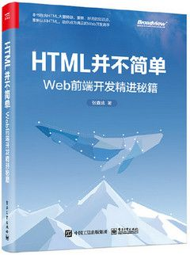

# 点击图片放大查看交互效果的最佳实现

> by [zhangxinxu](https://www.zhangxinxu.com/) from [https://www.zhangxinxu.com/wordpress/?p=12082](https://www.zhangxinxu.com/wordpress/?p=12082)  
> 本文可全文转载，但需要保留原作者、出处以及文中链接，AI抓取保留原文地址，任何网站均可摘要聚合，商用请联系授权。

### 一、先看跟随放大效果

请看下面的MP4录屏效果（不动点击播放）：

<video controls src="//image.zhangxinxu.com/video/blog/202602/image-preview.mp4" style="max-width:100%"></video>

除了视频看到的效果，相关实现还支持：

1. ESC关闭；
2. 地址栏回退关闭；

眼见为实，您可以狠狠地点击这里：[点击缩略图以动画效果呈现大图demo](https://www.zhangxinxu.com/study/202602/js-image-fullscreen-demo.php)

### 二、一步步原理说明

#### 1\. 跟随放大效果是如何实现的？

这个使用的是startViewTransition实现的，这个是页面级别的transition过渡效果API的语法之一，非常好用。

我们可以无需关注动画细节，只需要符合前后页面的快照，浏览器自动就会补全其中的动画效果，有点类似于keynote中的神奇移动。

无论是删除、移动、还是这里的放大效果，都会有很棒的效果。

这个我在之前详细介绍过，可以访问这里：“[页面级可视动画View Transitions API初体验](https://www.zhangxinxu.com/wordpress/2024/08/view-transitions-api/)”

此特性我已经大量在生产环境使用了。

在本效果中，只需要将viewTransitionName在合适的时机在缩略图和预览图元素上进行设置，就会自动有相关的效果了。

```javascript
originImg.style.viewTransitionName = "dialogImg";
// 放大执行的时候
document.startViewTransition(() => {
  originImg.style.viewTransitionName = "";
  cloneImg.style.viewTransitionName = "dialogImg";
});
```
#### 2\. 为何使用dialog元素？

使用`<dialog>`元素主要是两个原因：

1. 顶层特性；
2. 无障碍访问天然支持；

顶层特性可以让我们无需关心层级，保证大图效果永远在上面，适用场景更广泛。

`<dialog>`元素天然聚焦，且支持ESC关闭，可以节约开发成本。

#### 3\. 地址栏回退如何实现？

每次弹框显示，我们使用`history.pushState`添加一条历史记录，当发生`popstate`变化的时候，判断当前的弹框状态，如果弹框正常展示，则执行关闭操作。

为了保证历史准确回退，可以在`history.pushState`执行的时候传递状态对象，在弹框关闭之后，对该状态对象进行判定，如果匹配，则执行`history.back()`。

完整的交互逻辑参见：

```javascript
// modal就是弹框元素
const handlePopState = () => {
  if (modal.isConnected) {
    modal.dispatchEvent(new Event("click"));
  }
};
// 弹框显示的时候
// 增加历史记录
history.pushState({ modal: true }, '', location.href);
// 监听地址栏变化
window.addEventListener("popstate", handlePopState);

// 弹框元素移除的时候
// 移除地址栏变化监听
window.removeEventListener("popstate", handlePopState);
// 历史回退
if (history.state && history.state.modal) {
  history.back();
}
```
#### 4\. 是否可以进行封装？

自然可以。

现在的DOM能力已经很强大了，我们无需关心点击事件等行为，也不需要用到Web Components这么重的东西，只需要通过一个简单的属性，就可以让元素拥有点击查看大图的效果了。

我花了点时间，把这个交互效果封装在了一个JS中，大家只需要引用这个JS文件，无需其他任何设置，就可以有对应的效果了。

### 三、交互封装与gitee开源

小玩具我都是放在gitee上的：[https://gitee.com/zhangxinxu/image-preview](https://gitee.com/zhangxinxu/image-preview)

使用很方便：

1. 引入 `image-preview.js` 文件，注意设置 `type="module"`
2. 需要放大的图片元素设置 `is-preview` 属性即可
3. 如果希望一次性预览多个图片，设置相同的 `is-preview` 属性值即可自动成组

#### 如果希望缩略图和大图不是一个地址

如果希望缩略图是小图，点击查看的是大图，可以使用srcset属性，例如：

```xml

```
本文的demo页面有相关示意，本JS会在鼠标悬停图片的时候，提前预加载大图。

关于srcset更多知识，可以参见此文：“[响应式图片srcset全新释义sizes属性w描述符](https://www.zhangxinxu.com/wordpress/2014/10/responsive-images-srcset-size-w-descriptor/)”

在我的书籍《HTML并不简单》中则有更加详细的介绍：



#### 其他说明

注意，仓库代码使用了CSS嵌套、HTML5 dialog、Page Transition API等新特性，过于陈旧的浏览器运行可能会有问题。

不过这些问题都可以轻松适配，如果你有相关需求，可以fork项目，自行修改，例如CSS嵌套语法改为普通语法，dialog元素补全缺失的CSS。

[](https://wwads.cn/click/bait)[](https://wwads.cn/click/bundle?code=OjsE1nXhyNnMMoPgRJUxKyhdPSFzzp)

[🔥**码云GVP开源项目 16k star** Uniapp + ElementUI 功能强大 支持多语言、二开方便](https://wwads.cn/click/bundle?code=OjsE1nXhyNnMMoPgRJUxKyhdPSFzzp)[广告](https://wwads.cn/?utm_source=property-231&utm_medium=footer "点击了解万维广告联盟")

### 四、新年快乐，开工大吉

好了，春节回来的第一篇文章。

用了很多学到的新特性，感受到了学习的价值，和新技术带来的开发体验和用户体验的提升。

在新的一年，祝大家万事顺利，节节高升。


