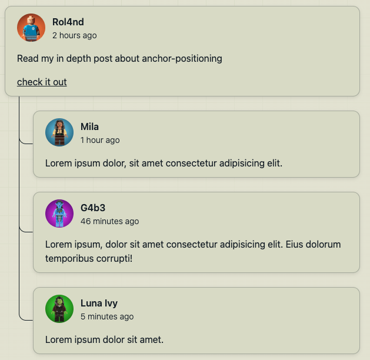

# 【第3661期】不用 JS 也能精准定位？CSS Anchor Positioning 实战解析

前言

CSS Anchor Positioning 为前端布局带来了全新的可能。通过在元素之间建立 “锚点关系”，我们可以无需 JavaScript，就实现评论与回复的视觉连接、Tooltip 精准定位等效果。本文通过一个简单示例，带你了解 anchor () 的实际用法与优势，看看这种 “感知关系” 的 CSS 能力，如何改变我们构建 UI 的方式。

今日前端早读课文章由 @Roland 分享，@飘飘编译。

译文从这开始～～

#### 介绍

每隔一段时间，CSS 会新增一个功能，让人忍不住停下来思考：等等…… 现在连这个都能做了吗？我在看完 Kevin Powell 关于 CSS Anchor Positioning 的一段短视频后，正是这种感觉。

A couple of great anchor positioning use cases:https://www.youtube.com/watch?v=lXS2P3xtAUY

这个功能的思路其实很简单：让一个元素相对于另一个元素进行定位，而且不需要 JavaScript，不需要依赖脆弱的 DOM 结构假设，也不需要额外添加包裹元素。当然，我立刻就想亲自试一试。

[【第3032期】CSS新特性,超强的 Anchor Positioning 锚点定位](https://mp.weixin.qq.com/s?__biz=MjM5MTA1MjAxMQ==&mid=2651265199&idx=1&sn=c3c1d35bdcc1a58ff6168a2b98a7f2c8&scene=21#wechat_redirect)

原本只是一个小实验，结果变成了一个挺有意思的小 Demo—— 仅用 CSS，就把评论和它的回复在视觉上连接起来。

#### 问题

在 CSS 中，要把相关的 UI 元素在视觉上连接起来，其实并不容易。比如：

- 评论流
- 指向触发元素的工具提示（Tooltip）
- 引用特定内容的标注框（Callout）

传统上，通常只能在以下三种做法中选一个：

- 为了画一条线或一个箭头而增加额外的 HTML 结构
- 用 JavaScript 计算位置，然后动态注入样式
- 或者干脆放弃，接受 “差不多就行” 的效果

Anchor Positioning 改变了这种局面。

#### Anchor Positioning

CSS Anchor Positioning 允许你为某个元素指定一个锚点名称，然后在其他地方通过 `anchor()` 函数引用这个元素的几何信息。

从整体流程来看，大致是这样：

- 给某个元素设置一个 anchor-name
- 可以选择使用 anchor-scope 限制它的可见范围
- 使用 `anchor()` 将另一个元素相对于该锚点进行定位

不需要遍历 DOM，不需要手动计算布局，只需要定义元素之间的关系。

#### 设置锚点

在我的示例中，有两个关键元素：

- .comment
- .reply

它们都会被设置为锚点：

```
 .comment {
   anchor-name: --comment;
 }

 .reply {
   anchor-name: --reply;
   anchor-scope: --reply;
 }
```
这些名称（--comment、--reply）和自定义属性有点类似：它们是可以在后续引用的标识符。

anchor-scope 的作用是确保只有 .reply 的后代元素才能引用 --reply 这个锚点，从而让作用范围更加可控、逻辑更加清晰。

#### 建立联系

真正有趣的部分发生在一个伪元素上。我在 `.reply` 上使用了 `::after`，用来在评论和回复之间绘制一条细微的连接线。

```
 .reply::after {
   content: "";
   position: absolute;

   inset-block-start: anchor(--comment end);
   inset-inline-start: calc(anchor(--comment start) + 1.5rem);
   inset-block-end: anchor(--reply center);
   inset-inline-end: anchor(--reply start);

   border: 1px solid var(--text);
   border-block-start-color: transparent;
   border-inline-end-color: transparent;
   border-end-start-radius: 0.75rem;
 }
```
这里正是 `anchor()` 函数大显身手的地方。

#### 守则

每一个 `anchor()` 调用，都会解析为来自另一个元素的真实布局值：

- anchor (--comment end) → comment 元素在块方向（block-end）的结束边
- anchor (--comment start) → comment 元素在行内方向（inline-start）的起始边
- anchor (--reply center) → reply 元素的垂直中心点

通过将这些值与逻辑属性（`inset-block-*`、`inset-inline-*`）结合使用，连接线可以自动适应不同的书写模式和布局变化。

不需要写死的数值。内容变多也不需要重新计算。这条线会自动 “跟着” 元素移动。

[【第3627期】从媒体查询到样式查询：Chrome 142 如何让 CSS 更懂“数值”](https://mp.weixin.qq.com/s?__biz=MjM5MTA1MjAxMQ==&mid=2651278210&idx=1&sn=64ba5c14880aae308f0e311a22024cc6&scene=21#wechat_redirect)

#### 为何令人兴奋

我最喜欢 Anchor Positioning 的地方在于：它让 CSS 真正具备了 “感知布局关系” 的能力。

一些显而易见的好处包括：

- 不需要用 JavaScript 处理定位逻辑
- 内容变化时，元素之间的关系依然保持正确
- 减少额外的包裹元素，HTML 结构更干净
- 更容易表达设计意图，代码语义更清晰

对于那些 “元素之间的关系” 比 “绝对位置” 更重要的 UI 模式来说，这种能力尤其强大。

#### 浏览器支持

`anchor()` 函数最近已进入基准线：新可用状态，这意味着它已经在主流浏览器的最新版本中获得支持。

不过，完整的 Anchor Positioning 体系仍在不断演进中。虽然 `anchor()` 本身已经可用，但像 `anchor-name` 和 `anchor-scope` 这样的相关特性，在某些浏览器中可能仍需开启实验标志，或者正在逐步推出。

在实际使用中，这使得 Anchor Positioning 特别适合用于：

- 渐进增强（Progressive Enhancement）
- 实验性项目和演示 Demo
- 面向未来的 UI 模式探索

只要合理使用，并为尚未完全支持的浏览器准备好降级方案，你现在就可以开始尝试这一特性。

[【第3307期】基线渐进增强](https://mp.weixin.qq.com/s?__biz=MjM5MTA1MjAxMQ==&mid=2651271531&idx=1&sn=82f5c24020ce9db2971aa7827d49d5c6&scene=21#wechat_redirect)

#### 实际操作

完整示例可以在 CodePen 上查看：https://codepen.io/ROL4ND909/pen/gbMxLdL

**html**

```
 <ul class="thread">
   <li>
     <div class="comment">
       <div class="user-info">
         
         <div>
           <p class="user-name">Rol4nd</p>
           <p class="time">2 hours ago</p>
         </div>
       </div>
       <p>Read my in depth post about anchor-positioning</p>
       <p><a target="blank" href="https://rolandfranke.nl/frontend-stories/drawing-connections-with-css-anchor-positioning/">check it out</a></p>
     </div>

     <ul class="replies">
       <li>
         <div class="reply">
           <div class="user-info">
             
             <div>
               <p class="user-name">Mila</p>
               <p class="time">1 hour ago</p>
             </div>
           </div>
           <p>Lorem ipsum dolor, sit amet consectetur adipisicing elit.</p>
         </div>
       </li>
       <li>
         <div class="reply">
           <div class="user-info">
             
             <div>
               <p class="user-name">G4b3</p>
               <p class="time">46 minutes ago</p>
             </div>
           </div>
           <p>Lorem ipsum, dolor sit amet consectetur adipisicing elit. Eius dolorum temporibus corrupti!</p>
         </div>
       </li>
       <li>
         <div class="reply">
           <div class="user-info">
             
             <div>
               <p class="user-name">Luna Ivy</p>
               <p class="time">5 minutes ago</p>
             </div>
           </div>
           <p>Lorem ipsum dolor sit amet.</p>
         </div>
       </li>
     </ul>
   </li>
 </ul>
```
**CSS**

```
 @layer --reset, --base, --layout, --demo, --utils;

 /* Start coding */
 @layer --demo {
   .comment {
     anchor-name: --comment;
   }

   .reply {
     anchor-name: --reply;
     anchor-scope: --reply;

     &::after {
       content: "";
       position: absolute;

       inset-block-start: anchor(--comment end);
       inset-inline-start: calc(anchor(--comment start) + 1.5rem);
       inset-block-end: anchor(--reply center);
       inset-inline-end: anchor(--reply start);

       border: 1px solid var(--text);
       border-block-start-color: transparent;
       border-inline-end-color: transparent;
       border-end-start-radius: 0.75rem;
     }
   }

   /* basic styles for nested ul */
   .thread {
     > li {
       display: grid;
       gap: 1.5rem;

       > ul {
         display: grid;
         gap: 1.5rem;
         padding-inline-start: 3rem;
       }
     }

     li > div {
       display: grid;
       gap: 1rem;

       padding-block: 0.5lh;
       padding-inline: 2ch;
       border-radius: 0.75rem;
       background-color: color-mix(in hsl, var(--text), var(--surface) 95%);
       box-shadow: 0 2px 6px #0000001a;
       border: 1px solid hsl(from var(--text) h s l / 0.25);
     }
   }

   /* user-info */
   .user-info {
     display: flex;
     align-items: center;
     gap: 0.75rem;

     > img {
       inline-size: 3rem;
       aspect-ratio: 1;
       border-radius: 100%;
     }

     .user-name {
       font-weight: 600;
     }

     .time {
       font-size: 0.875rem;
       font-weight: 300;
     }
   }
 }
 /* End coding */

 @layer --base {
   :root {
     --color-neutral-100: hsl(60 22% 85%);
     --color-neutral-900: hsl(210 31% 11%);
     --color-primary-400: hsl(338 73% 45%);

     --text: light-dark(var(--color-neutral-900), var(--color-neutral-100));
     --surface: light-dark(var(--color-neutral-100), var(--color-neutral-900));

     /* Grid sizes */
     --gutter: 1.5rem;
     --breakout: 87.5rem;
     --content: 70rem;

     color-scheme: dark light;
   }

   body {
     min-block-size: 100vh;
     margin: 0;
     font-family: system-ui;
     line-height: 1.5;
     color: var(--text);

     display: grid;
     row-gap: 2rem;
     grid-template-columns:
       [fullbleed-start]
       minmax(var(--gutter, 1rem), 1fr)
       [breakout-start]
       minmax(0, calc((var(--breakout) - var(--content)) / 2))
       [content-start]
       min(50% - var(--gutter, 1rem), (var(--content) / 2))
       [midpoint]
       min(50% - var(--gutter, 1rem), (var(--content) / 2))
       [content-end]
       minmax(0, calc((var(--breakout) - var(--content)) / 2))
       [breakout-end]
       minmax(var(--gutter, 1rem), 1fr)
       [fullbleed-end];
     align-items: center;

     > :where(*) {
       grid-column: content;
     }

     &::before,
     &::after {
       content: "";
       z-index: -1;
       position: fixed;
       inset: 0;
     }

     &::before {
       --size: 3rem;
       --offset: calc(var(--size) / 2);
       --line: color-mix(in hsl, var(--text), var(--surface) 90%);

       background-color: var(--surface);
       background-image: linear-gradient(
           90deg,
           var(--line) 1px,
           transparent 1px var(--size)
         ),
         linear-gradient(var(--line) 1px, transparent 1px var(--size));
       background-position: var(--offset) var(--offset);
       background-size: var(--size) var(--size);
       background-attachment: fixed;
     }

     &::after {
       background-image: linear-gradient(
         -35deg,
         var(--surface) 40%,
         transparent
       );
     }
   }

   .thread {
     margin-block: 1.5rem;
     justify-self: center;
     max-inline-size: 60ch;
   }
 }

 @layer --layout {
   .grid {
     display: grid;
     row-gap: 2rem;
     grid-template-columns:
       [fullbleed-start]
       minmax(var(--gutter, 1rem), 1fr)
       [breakout-start]
       minmax(0, calc((var(--breakout) - var(--content)) / 2))
       [content-start]
       min(50% - var(--gutter, 1rem), (var(--content) / 2))
       [midpoint]
       min(50% - var(--gutter, 1rem), (var(--content) / 2))
       [content-end]
       minmax(0, calc((var(--breakout) - var(--content)) / 2))
       [breakout-end]
       minmax(var(--gutter, 1rem), 1fr)
       [fullbleed-end];

     > :where(*) {
       grid-column: content;
     }

     [data-column="fullbleed"] {
       grid-column: fullbleed;

       display: grid;
       grid-template-columns: subgrid;

       > :where(*) {
         grid-column: content;
       }
     }

     [data-column="breakout"] {
       grid-column: breakout;
     }

     [data-column="content"] {
       grid-column: content;
     }
   }
 }

 @layer --utils {
   /* the best util class for vertical spacing */
   .flow > *:where(:not(:first-child)) {
     margin-block-start: var(--flow-space, 1em);
   }

   .sr-only {
     position: absolute;
     width: 1px;
     height: 1px;
     padding: 0;
     margin: -1px;
     overflow: hidden;
     clip: rect(0, 0, 0, 0);
     white-space: nowrap;
     border-width: 0;
   }
 }

 @layer --reset {
   /* Modern reset: https://piccalil.li/blog/a-more-modern-css-reset/ */

   /* Box sizing rules */
   *,
   *::before,
   *::after {
     box-sizing: border-box;
   }

   :root {
     @media (prefers-reduced-motion: no-preference) {
       interpolate-size: allow-keywords;
     }
   }

   /* Prevent font size inflation */
   html {
     -moz-text-size-adjust: none;
     -webkit-text-size-adjust: none;
     text-size-adjust: none;

     scrollbar-gutter: stable;
   }

   /* Remove default margin in favour of better control in authored CSS */
   body,
   h1,
   h2,
   h3,
   h4,
   p,
   figure,
   blockquote,
   dl,
   dd {
     margin-block: 0;
   }

   /* Remove list styles and keep semantic meaning on ul,
    * ol elements with a class on it, which suggests default
    * styling will be removed
    *
    * https://www.matuzo.at/blog/2023/removing-list-styles-without-affecting-semantics
    */
   :is(ul, ol)[class] {
     list-style-type: "";

     margin: 0;
     padding: 0;
   }

   /* Set core body defaults */
   body {
     min-height: 100vh;
     line-height: 1.5;
   }

   /* Set shorter line heights on headings and interactive elements */
   h1,
   h2,
   h3,
   h4,
   button,
   input,
   label {
     line-height: 1.1;
   }

   /* Balance text wrapping on headings */
   h1,
   h2,
   h3,
   h4 {
     text-wrap: balance;
   }

   /* A elements that don't have a class get default styles */
   a:not([class]) {
     text-decoration-skip-ink: auto;
     color: currentColor;
   }

   /**
  * This CSS block is a More Effective CSS Image Reset.
  * It resets the default styles of an image element
  * and adds some additional styles to improve its rendering.
  *
  * The `max-width: 100%;` ensures that the image does not exceed its container's width,
  * while maintaining its aspect ratio with `height: auto;`.
  *
  * The `vertical-align: middle;` aligns the image vertically with the text.
  *
  * The `font-style: italic;` adds a slight italic effect to the image alt text.
  *
  * The `background-repeat: no-repeat;` ensures that the image does not repeat itself.
  *
  * The `background-size: cover;` ensures that the image fills its container without repeating.
  *
  * Finally, the `shape-margin: 1rem;` adds some margin around the image to improve its spacing with other elements.
  */
   img,
   picture {
     max-width: 100%;
     height: auto;
     vertical-align: middle;
     font-style: italic;
     background-repeat: no-repeat;
     background-size: cover;
     shape-margin: 1rem;
   }

   /* Inherit fonts for inputs and buttons */
   input,
   button,
   textarea,
   select {
     font: inherit;
   }

   /* Make sure textareas without a rows attribute are not tiny */
   textarea:not([rows]) {
     min-height: 10em;
   }

   /* Anything that has been anchored to should have extra scroll margin */
   :target {
     scroll-margin-block: 5ex;
   }
 }
```


如果你仔细查看代码，会发现为了实现这个效果，其实只需要很少的 CSS。一旦把元素之间的关系直接表达出来，大部分复杂性都会自然消失。

#### 想法

Anchor Positioning 就像是拼图中缺失已久的一块。我们不再需要反复思考 “这个元素应该放在哪里？”，而是可以直接表达为：“它应该相对于那个元素放在那里。”

这为很多常见模式打开了新的可能，比如工具提示（tooltip）、弹出层（popover）、注释标记（annotation），以及各种需要保持视觉关联的 UI 关系 —— 而且整个过程都不需要借助 JavaScript。

虽然这项特性还处于早期阶段，但像这样的功能，确实让人对 CSS 的未来充满期待。如果你喜欢尝试新的布局原语，这绝对值得花时间深入探索。

关于本文  
译者：@飘飘  
作者：@Roland  
译文：https://rolandfranke.nl/frontend-stories/drawing-connections-with-css-anchor-positioning/

这期前端早读课  
对你有帮助，帮” 赞 “一下，  
期待下一期，帮” 在看” 一下。
