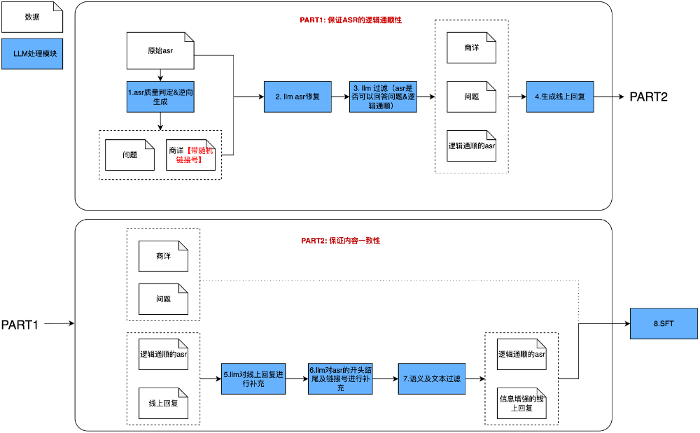
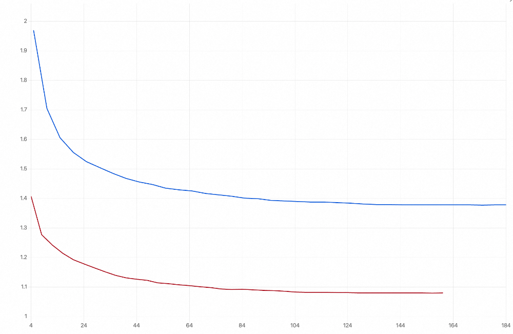
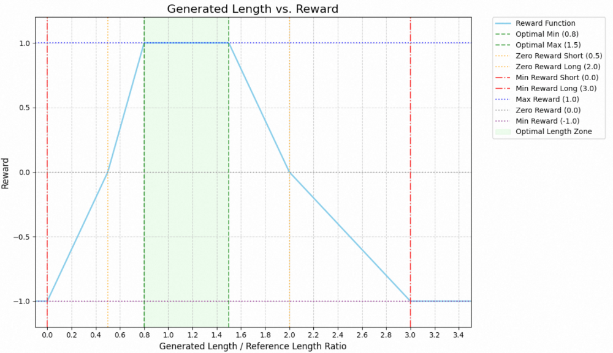
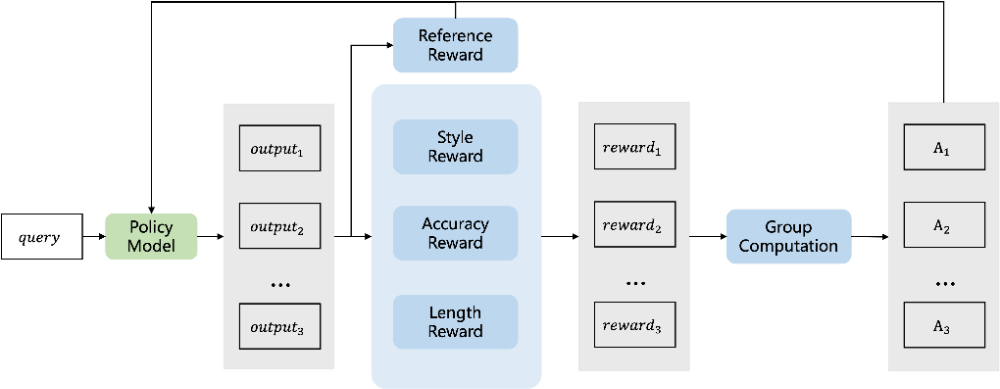
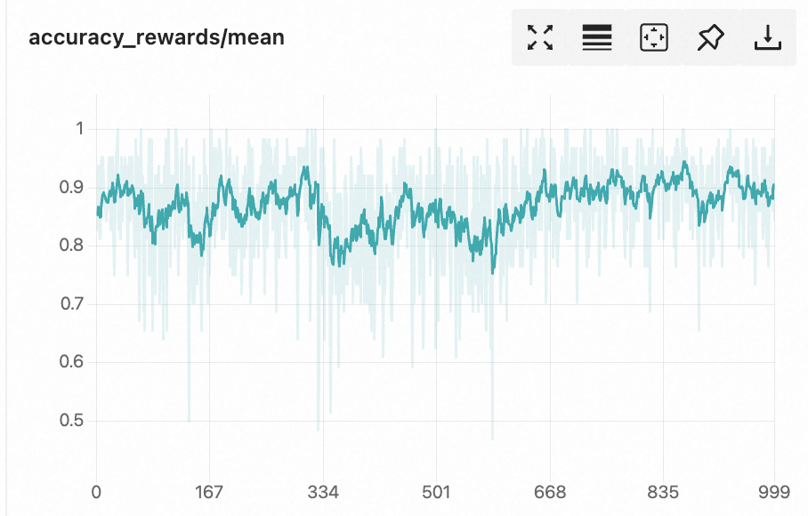
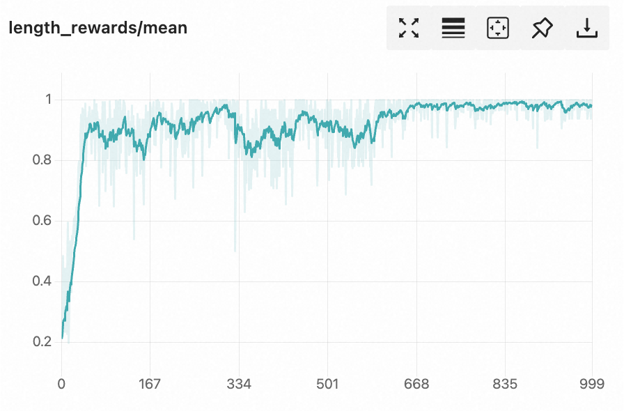
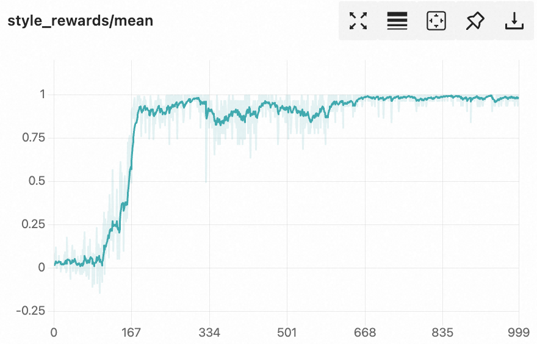

# 【淘宝直播数字人互动LLM】告别AI感：基于真人ASR数据的拟人化探索


  

  

  

本文针对数字人直播中LLM回复“AI感强、书面化”的问题，提出一种 **基于真人直播ASR数据的拟人化训练方法**：先构建高质量〈AI回复, 拟人化回复〉数据对，训练拟人化改写模型；再进一步训练拟人化奖励模型，通过GRPO强化学习使生成模型直接输出自然、口语化、有帮助的回复。实验证明该方法在保持准确性和帮助性的同时，显著提升语音交互的真实感与用户体验。

  


引言

  

近几年，随着大模型浪潮的袭来，各种文本生成式的场景层出不穷。LLM在聊天机器人、自动化客服、剧本生成等等各种文本生成场景中都有着广泛应用。在数字人直播互动场景下，不仅仅需要正确回答用户的问题，给予用户一定的帮助性，还需要考虑到回复的风格，尽可能使得文本通过TTS模型转化后的语音更加像真人。

  

当前阶段，因为大模型本身具有很强的世界知识，并且可以通过RAG、SFT等等技术手段注入领域知识，生成文本的正确性可以得到一定的保证。但是受限于训练时数据的风格，生成的文本的风格普遍书面化，AI感较强，给人“一眼假”的体验。为了解决这个问题，业界做了众多尝试，包括但不限于在提示词中加入各种人物设定，在此基础构造训练数据微调模型等等。这些方法虽然在一定程度上降低了回复文本的书面感，但仍然有较强的AI感，十分影响用户的体验。因此如何使得模型回复“拟人化”的问题亟待解决。

  

拟人化，顾名思义就是使得模型的回复更加像真人。本文首先探索了市面上的模型在拟人化任务上的效果，分析了基于PE【提示词工程】的解决的缺陷和天花板。然后提出了一种基于ASR的拟人化训练数据自动化生成流程，由此训练得到的拟人化互动改写模型。在保留模型回复的正确性前提下，最大程度地去除AI感，提升拟人化效果。为了进一步简化线上链路，笔者在前置工作的基础上设计了一个拟人化奖励模型，加入到原有强化学习训练链路中，训练得到对应的拟人化生成模型。实验结果表明，在显著提升交互自然度的同时，模型在测试集上的准确率达到 92.0%，帮助性达到 97.0%，人工评估后85.5%的测试用例音频效果优于线上，实现了拟人化表现与任务能力的平衡。

  

▐  **1.** 核心工作

  

拟人化的效果很大程度取决于训练数据，无论是网上还是书籍里的数据，其实拟人化的风格都很弱。设想可以提取到高质量的拟人化数据，就可以使模型从中学习拟人化回复的风格。为此，我们尝试从真人直播的ASR中得到拟人化的数据，并建立相应的评估机制。主要工作包含如下两部分：

  

1. 【逆向文本风格迁移】拟人化训练数据生成流水线。原始的ASR噪声过多，存在语句不通顺、幻觉等问题，无法直接用于训练。为了解决这个问题，笔者提出一种自动化数据清洗流水线。可以基于ASR自动化构建语意高度相似，仅风格不同，形如 <AI感回复，拟人化回复> 的训练数据对。在此高质量的训练数据对的基础上经过模型SFT，即可得到拟人化改写模型。
2. 【拟人化风格判定】虽然改写模型改写后的回复AI感大幅降低，但是又请求了一次模型服务。为改善该问题，借助SFT改写模型的推理结果，笔者训练了一个拟人化风格判定/奖励模型。可以快速判断模型回复的文本是否具有拟人化。在将该判定模型融入到原有的生成模型的强化学习训练框架中后，生成模型可以快速升生成正确、拟人化的回复。

  

▐  **2.** 效果展示

  

对比分析旧版模型回复和拟人化模型回复，拟人化回复主要体现在以下几点：

（1）语序优化（2）重点卖点强调（3）书面化用语去除

  

- 旧版模型与拟人化模型回复对比

  

类目：商品推荐

用户问题：52号女宝脚长13，穿多大码

旧版模型回复：看到有宝宝问52号链接女宝脚长13穿多大码，这款M码适合13.5到14.5cm脚长哦，脚长13的话建议选S码哈。

拟人化改写：姐妹们看好了啊！我们这个52号链接，m码呢，就是说如果您的女儿脚长是13.5到14.5之间，就可以买我们的m码；如果说您家宝贝脚长只有13公分左右，那我建议您可以去拍s码。

评估：尺码推荐更加人性化

  

类目：商品问答

用户问题：叶黄素片一天吃几片

旧版模型回复：看到有宝宝问叶黄素片一天吃几片，7号链接的叶黄素片是每天两粒哈，直接按说明服用就行啦。

拟人化改写：对，就是按照说明书来啊，7号链接的这个叶黄素片呢，您就每天吃两颗就可以了。

评估：语序优化

  

类目：商品问答

用户问题：一岁吃几号DHA

旧版模型回复：看到有宝宝问一岁吃几号DHA，9号链接的小金珠DHA和2号链接的藻油DHA都适合10个月到3岁的宝宝哦，适用年龄里都有1岁哈。

拟人化改写：对啊，所以呢我们今天推荐给大家的是9号链接的小金珠DHA还有2号链接的藻油DHA都可以选择。因为这两个都是从10个月开始一直到三岁都能吃的。

评估：书面语去除

  

类目：卖点讲解

用户问题：被套面料是全棉的吗？

旧版模型回复：有宝宝问被套面料是不是全棉的，29号链接、63号链接和147号链接的被套都是全棉的哈，被里被面都是百分百棉的呢？

拟人化改写：对啊，全部都是用的是百分百的棉做的，所以大家放心去拍就可以了。我们今天给大家上架的这个29号链接、63号链接还有147号链接的被子，它的被里被面全部都是百分百棉的。

评估：卖点重复强调

  


实现方法

  

传统的方法通过提示词工程让能力更大的模型（Gemini，DeepSeek-r1）自主生成的一定风格的回复，后续基于此数据进行微调，模型自身带有的AI感仍然无法去除。不同于传统方法，笔者首先根据“反向构造”的思想，搭建了一套拟人化训练数据生成、清洗链路，最终从3w条ASR数据中得到3k+高质量的训练数据对。然后基于Qwen2.5-7B-Instruct进行微调训练，得到了拟人化改写模型，大大减轻了模型回复的AI感。

  

为了进一步优化整体链路延迟，我们基于原有的改写模型，训练得到了拟人化判定模型，结合原有的正确性、帮助性奖励，基于Qwen/Qwen3-30B-A3B进行GRPO训练，得到直接生成拟人化回复的生成模型。

这里没有直接使用端到端直接微调拟人化模型的方法，主要是有以下原因：

1. “从真人直播间定位具体商品获取商详”这一任务难度极大；
2. 线上互动模型使用的是推理模型，训练时需要思考过程，而ASR仅仅可以作为结果，无法构造对应的模型思考过程。

  

▐  **1.** 拟人化改写模型

  

- 2.1.1 训练数据构建

  

一条好的拟人化训练数据对需要严格满足“内容一致，风格不同”。虽然可以通过反向构造商详的方法产生与ASR对应的实际线上回复，但是依然存在两个问题：（1）ASR数据天然带有磕巴、重复、语意不通顺的问题；（2）因为商详是反向构造的，与实际商详存在一定差异，同时线上回复的带有固定话术，导致线上回复和ASR的内容存在差异。

  

如果直接将这样子的数据作为训练数据，训练得到的模型会输出重复、语意不通顺和带有幻觉的回复。为了解决这些问题，我们设计了完整的数据清洗和筛选流程，如图2-1。整个流程主要包含两部分：（1）PART1：ASR清洗，保证ASR的逻辑通顺性（2）PART2：内容一致性对齐，构造内容对齐的改写pair对。经过清洗过后的训练数据对示例：

  

query

线上

拟人化回复

sim\_score

第一次尝试的话推荐哪个口味？

有家人问第一次选什么口味哈。看到49号披萨有多口味尝鲜装，包括照烧、夏威夷、榴莲这些。第一次的话可以选比较大众的，比如夏威夷或者照烧比较容易接受哦。榴莲口味非常推荐，香甜浓郁值得一试。如果不确定的话可以选尝鲜装试试不同口味哈。

有朋友问第一次选哪个口味的话，推荐试试49号链接披萨，多口味尝鲜装，就是那个组合装。里面有像照烧的、夏威夷的，还有榴莲的。哦，榴莲的真的超好，一定要去试试，榴莲的用料成本会更高，而且那个榴莲味儿，又香又甜的，真的好吃。

0.9187

这个营养软糖的安全性如何？

有家人问营养软糖的安全性哈。65号链接的产品信息有提到执行国标特殊食品标准，送检报告显示重金属未检出，还有提到2023年和今年质检投入均超四千万。这些说明安全性有充分保障的哦。

有家人问这个软糖的安全性啊。大家可以特别放心，65号链接的产品信息提到，我们执行的国标是特殊食品标准，送检报告显示重金属未检出。对于自营产品的质检我们一直特别重视，去年投入超过四千万在这上面，今年呢，也是这个样子的。安全和放心绝对做到位了！

0.9293

表2-1：清洗后训练数据对

  



图2-1：训练数据构造清洗流程图

  

核心解决问题

数据清洗流程

目的

逻辑通顺

1.ASR质量判定&逆向生成问题和商详
1. 过滤低质量（过短、语意模糊）的ASR
2. 生成商详和对应的问题，用于后续生成线上回复
2.ASR修复
1. 修复逻辑不通顺的ASR进行，解决ASR中存在的“开头结尾截断不自然问题”
3.ASR过滤
1. 过滤修复后仍然自身逻辑不通顺的数据
2. 过滤修复后问题、商详和ASR不对应的数据
3. 过滤修复后ASR长度过短的数据

幻觉

4.生成线上回复
1. 利用构造的商品和问题获取线上模型当前的回复
5.根据线上回复对ASR进行补充
1. 弥补线上回复和ASR存在内容上的差异
1. 链接号补充
2. 开头结尾固定话术补充
7.数字符号+语义及文本过滤
1. 过滤线上回复和ASR在数字不对对应的数据
2. 过滤文本相似度过高和语意相似度过低的数据

表2-2：数据清洗各步骤和其相应的作用

  

- 2.1.2 模型训练

  

模型

尝试了qwen2.5系列1.5B/7B/72B不同参数量的模型：1.5B的模型在当前任务上表现较差，无法很好地学习到拟人化风格；72B模型效果稍好于7B，但延迟较高。综合考量效果和推理成本，最终选择了qwen25-7B-instruct模型作为微调的基座模型。

  

微调参数

```code-snippet__js
learning_rate=2e-5
```
  

微调曲线

对比数据清洗前（蓝色）和数据清洗后（红色）的曲线，可以发现使用清洗过后的训练数据，模型初始的loss更低，最终稳定的loss更低。说明清洗过后的训练数据对 <AI感回复，拟人化回复> 在内容上的差异更小，拟人化模型更加容易从中学习到拟人化相关的表达。



图2-2 数据清洗前后训练loss对比

  

▐  **2.** 拟人化回复生成模型

  

虽然使用改写的方式已经可以得具体很高辨识度的拟人化回复，但是“生成回复→拟人化改写”两阶段的链路长、耗时久，而互动任务对于延迟的容忍度较低。为了解决这一问题，我们尝试在已有的工作基础上，训练拟人化判定模型。借助该判定模型进行GRPO强化学习训练，直接生成得到正确、有帮助的拟人化回复。

  

- 2.2.1 拟人化判别模型

  

整体拟人判定模型的设计思想是通过拟人化改写模型推理构造大量的 <AI感回复，拟人化回复> 数据对，训练bert二分类模型。让模型从数据中黑盒地学习拟人化回复的特征。

  

数据构造

为了避免判别模型成为简单的高频词分类器，需要在构造数据时去除非常明显的分类依据，为此做了三点处理：（1）去除了互动回复固定的开头和结尾；（2）引入1k+非互动类型的普通数据；（3）对于正负例各自前top50的词做掩码。

做掩码是为了避免“判别模型掌握非常简单的作弊方式：通过某些词简单地做分类”

  

判别模型有效性验证

GRPO训练本质上是在做组内筛选，让模型训练的偏好更佳为了快速验证拟人化判别模型的效果，我们在进行RL训练前先快速进行了do-sample实验：设置基座模型的 temperature=1，进行重复采样。使用训练得到的Bert模型对采样结果进行判定。表2-3展示了部分do-sample实验的结果。从表中不难发现：拟人化分类器可以对较为相似的数据进行分类，识别出更加拟人化的表达。

  

  

外机一般是多大

  

  

有宝贝问到外机一般多大哈。那我们看下这个3号链接的臻净风空调，它的一个外机尺寸大概是802x350x555mm，不过因批次问题可能会有小点的出入的哦。

拟人化

  

看到有宝宝问外机一般是多大，咱们来说一下哈，外机大小根据不同链接来区分，比如咱们3号链接外机尺寸大概长802mm，具体大小宝宝们可以根据链接号对应商品确认，都是会有详细的尺寸说明的哦！

拟人化

看到有宝宝问外机一般是多大，我们以链接号3的变频空调为例，它的外机尺寸长宽高大概在802x350x555mm。不同的品牌型号尺寸会有一定的差异的哈

正式

看到有宝宝问外机一般是多大，我们可以参考一下链接号3的空调外机尺寸802x350x555mm哈。

正式

表2-3：do-sample实验结果

  

- 2.2.2 GRPO训练

  

我们首先使用准确回复问题的数据进行SFT，然后再进行GRPO训练。在原有奖励模型的基础上加入了拟人化判定的奖励。同时考虑到拟人化回复的长度一般较长，修改长度奖励模型，将目标回复长度设置为1.2-1.5倍，最终长度奖励设计见图2-3。结合多个奖励模型以后的整体grpo训练框架如图2-5。奖励部分包含了风格、长度、准确性等多种奖励。

  



图2-3：长度奖励模型曲线

  



图2-4 GRPO训练框架图

  

最终效果

图2-5展示了最终的奖励模型训练曲线，从曲线上看模型在200步左右时已经可以在拟人化和长度上得到较高的奖励，迭代600步以后效果趋于稳定。（准确率得分在开始训练时就有很高的得分，是因为在SFT阶段就对使用高准曲率的数据进行了训练；而ASR数据因为缺少思考过程无法直接进行微调。）

  







图2-5 GRPO训练奖励曲线

  

最终GRPO后的模型效果如表2-4所示。实验结果表明：即使模型没有经过SFT，在拟人化判定模型的激励下，模型不仅学习到了拟人化的简短语气词，也学习到了一些拟人化的短句表达。

  

问题

输入

旧版模型

优化后RL版本

有可穿浴巾吗？

有家人问可穿浴巾哈。目前有三个链接符合哦。53号是浴巾可穿式，有青绿、水色兰等颜色，券35块。17号是夏浴袍，有紫色、蓝色可选，券26块。144号是浴袍三件套，材质聚酯纤维，券26块。宝宝们可以点号看看详情图，选喜欢的哈。

有宝宝问有没有可穿浴巾，咱们今天有推荐的可穿浴巾哦。比如53号链接的三利浴巾，是浴袍式浴裙设计，可以裹着穿，吸水性也很好。还有17号链接的三利浴巾，是夏款可穿浴裙三件套，加大加厚，吸水快干，宝宝们可以看看这两个链接，选自己喜欢的款式哈。

有家人问，这浴巾能不能穿对吧？哎呀，问得好！咱们家确实有三款宝贝是能穿的哈。第一个是53号链接，浴巾可穿式，颜色有青绿、水色兰，看着就清爽，券后只要35块，划算得很！再看17号链接，夏浴袍，紫色、蓝色，夏天穿刚刚好，券26块。还有144号链接，浴袍三件套，材质是聚酯纤维，舒服又耐用，券也是26块。宝宝们，点点号，看看详情图，挑自己喜欢的，带回家就对了！

为啥锅铲价格变了

有家人问为啥锅铲价格变了哈，目前看到的三个链接号：68号是20，36号是26，32号419，券后价都没变哦。可能之前看到的是活动价或者规格不同，比如68号有不同颜色分类，但价格都是统一的。宝宝可以确认下是不是看错链接号，或者之前有优惠券没领到哈。

有宝宝问为啥锅铲价格变了，咱们来看一下。68号链接的三四钢迷你小锅铲，原价和券后价都是20元，价格没变哦。36号链接的加长款锅铲也是26元，价格没动。32号链接的七件套套装419元，价格也没变。宝宝说的价格变可能是指其他链接或者活动，可以再确认一下链接号，或者看看是不是活动结束导致价格变化了。

有家人问为啥锅铲价格变了哈，咱们家这锅铲可是实打实的好货，价格也一直稳得很！你看这链接号，68号是20块，36号是26块，32号是419块，券后价都没变哦。可能之前你看的是活动价，或者规格不一样，比如68号有不同颜色，但价格都是一样的。宝宝你再仔细看看，是不是看错链接号了，或者之前没领到优惠券呀？放心哈，咱们家绝对不玩虚的！

表2-4：GRPO后模型效果

  


总结与展望

  

回顾整个项目，我们从原始ASR数据入手，通过逆向文本风格学习的方法从数据中学习拟人化风格，通过改写模型很好地解决了模型回复AI感强烈的问题。在此基础上，设计拟人化判定模型，将其融入到GRPO训练框架中，进一步简化了整体链路，模型无需改写就可以直接生成拟人化的回复。

  

未来，我们将从以下几个方面继续开展我们的工作：

1. 对于“什么是拟人化回复”的问题，我们当前是通过判定模型二分地去判定（黑盒）。后续会细化设计拟人化程度的打分机制（白盒）；
2. 因为只可以拿到ASR信息，思考过程有缺失，所以基座模型无法直接进行SFT。虽然直接进行RL的方式可以使得模型获得一定的拟人化回复能力，但是更加合理的方式应该是通过SFT之后再进行RL；
3. 文本探究的是互动回复的拟人化，长度较短。后续如果想将当前的数据清洗、模型训练方式迁移到长文本上，还需要考虑长文本的通顺度和幻觉；
4. 学术界比较流行通过旋转因子进行文本风格迁移的，后续可以进一步探究。

  


参考文献

  

1. Distilling Text Style Transfer With Self-Explanation From LLMs 
2. StyleTunedLM：Customizing Large Language Model Generation Style using Parameter-Efficient Finetuning
3. Steering Large Language Models with Register Analysis for Arbitrary Style Transfer
4. Style Vectors for Steering Generative Large Language Model
5. Style-Specific Neurons for Steering LLMs in Text Style Transfer 
6. SynDec: A Synthesize-then-Decode Approach for Arbitrary Textual Style Transfer via Large Language Models
7. steerable chatbots personalizing llms with preference based activation steering

  


团队介绍

  

本文作者易得，来自淘天集团-直播AIGC团队。本团队作为直播电商智能化领域的先行者，始终致力于通过AI原生技术创新重构电商直播场景中的人货场交互范式。团队基于对大语言模型研发、多模态语义理解、语音合成、数字人形象建模、AI工程化部署及音视频处理技术的深厚沉淀和积累，已搭建起覆盖直播全链路的AI技术矩阵。自主研发的数字人直播解决方案通过商业化验证，成功实现从技术研发到商业变现的完整闭环，累计服务上千家商家。

  

  

  

**¤** **拓展阅读** **¤**

  

[3DXR技术](https://mp.weixin.qq.com/mp/appmsgalbum?__biz=MzAxNDEwNjk5OQ==&action=getalbum&album_id=2565944923443904512#wechat_redirect) | [终端技术](https://mp.weixin.qq.com/mp/appmsgalbum?__biz=MzAxNDEwNjk5OQ==&action=getalbum&album_id=1533906991218294785#wechat_redirect) | [音视频技术](https://mp.weixin.qq.com/mp/appmsgalbum?__biz=MzAxNDEwNjk5OQ==&action=getalbum&album_id=1592015847500414978#wechat_redirect)

[服务端技术](https://mp.weixin.qq.com/mp/appmsgalbum?__biz=MzAxNDEwNjk5OQ==&action=getalbum&album_id=1539610690070642689#wechat_redirect) | [技术质量](https://mp.weixin.qq.com/mp/appmsgalbum?__biz=MzAxNDEwNjk5OQ==&action=getalbum&album_id=2565883875634397185#wechat_redirect) | [数据算法](https://mp.weixin.qq.com/mp/appmsgalbum?__biz=MzAxNDEwNjk5OQ==&action=getalbum&album_id=1522425612282494977#wechat_redirect)
