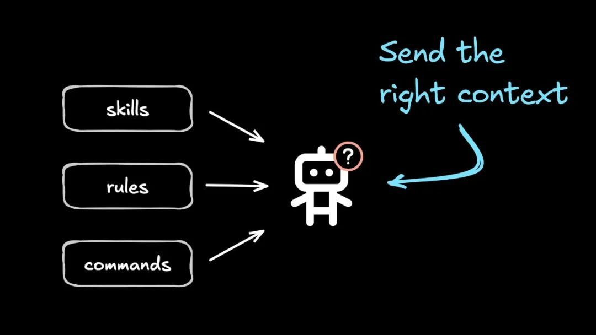
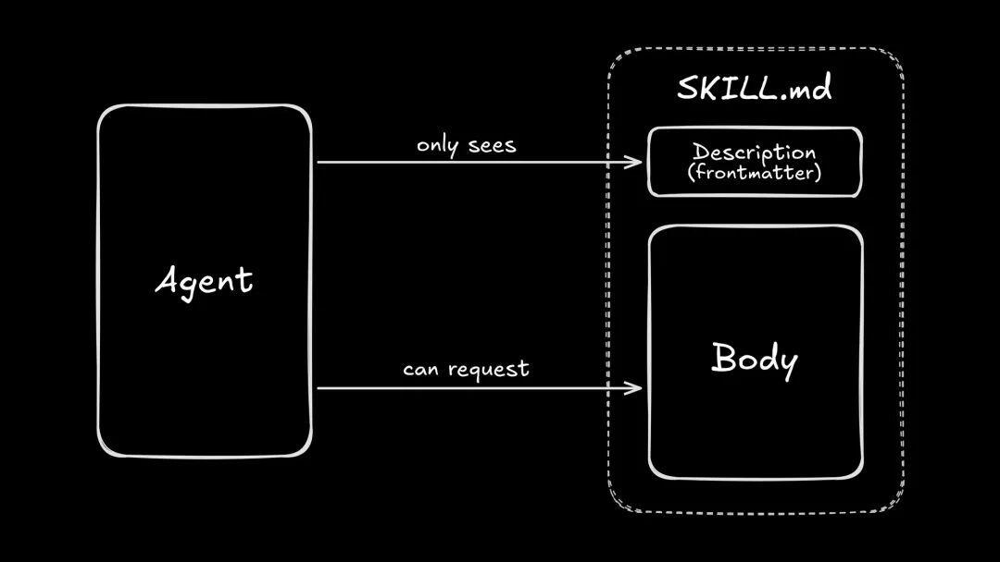
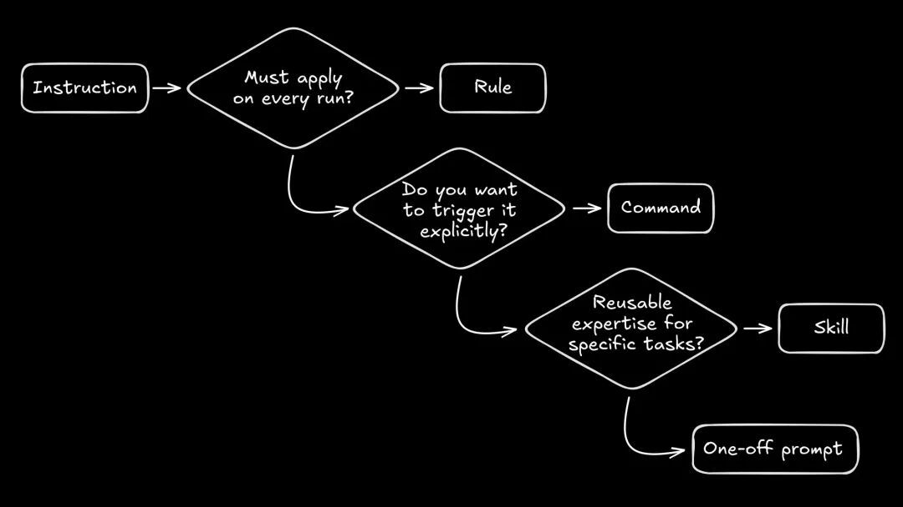
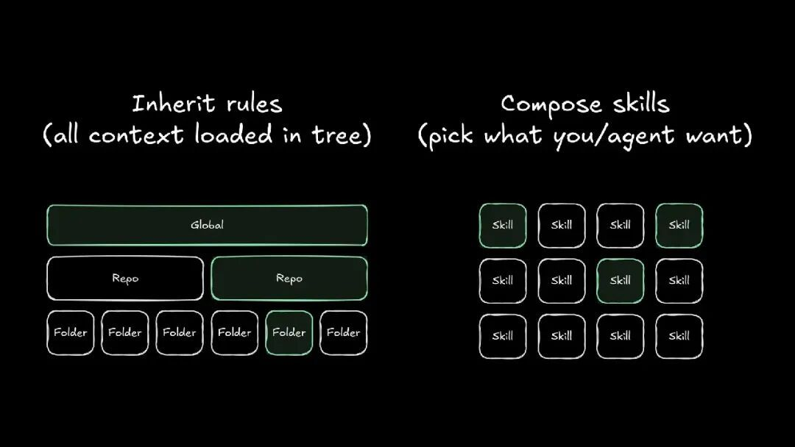
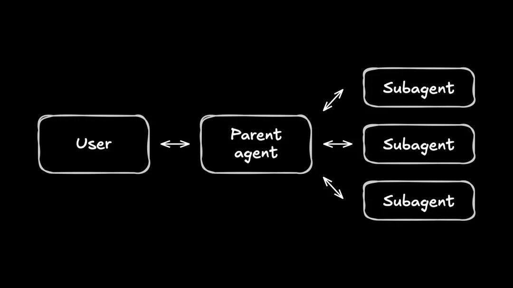

# 【第3649期】把 AI 当同事用：Rules、Commands、Skills 的清晰分工

前言

系统梳理了 Rules、Commands、Skills 和 Agents 在 AI 编程工具中的分工与使用边界。核心观点是：用规则承载不可变约束，用指令表达明确意图，用技能按需加载专业流程，用 agent 处理需要隔离或专职能力的场景。通过技能实现 “上下文的渐进加载”，可以减少噪音、降低成本，让 AI 从脆弱脚本进化为真正可协作的工作伙伴。今日前端早读课文章由 @Alice Moore 分享，@飘飘编译。

译文从这开始～～



如果你感觉自己的 AI 编程工具正在变成一个装满 “魔法 markdown 文件” 的文件夹，那可不是你的错觉。

不同工具的叫法各不相同，但造成的困惑却是相同的。而最近大家讨论最多的新 markdown 文件，就是 skills（技能）：一种在合适时机可被智能体发现并加载的上下文内容。

[【早阅】在 AI 时代避免技能退化](https://mp.weixin.qq.com/s?__biz=MjM5MTA1MjAxMQ==&mid=2651276301&idx=1&sn=f5459aee93d64df1ff04702bf0e54e1c&scene=21#wechat_redirect)

下面我们来看看它们是什么、什么时候该用，以及如何构建一个既有用又好管理的技能库。

#### 什么是 agent 技能（Claude skills）

在 Builder（以及越来越多的服务商）中，技能采用的是 Agent Skills 标准。你可以把它理解为一种标准化的 “集装箱”，用来装你的指令和资源。

本质上，一个技能只是一个文件夹，里面包含两样东西：

- 一个定义用的 markdown 文件，包含元数据和指令
- 一些可选的附加内容（任何你需要的东西），比如脚本、模板或参考文档

在每个代码仓库中，技能通常放在路径：`[.provider]/[skill-name]/SKILL.md`

所以在 Builder 里，如果你有一个 fireworks 技能，它会放在：`.builder/fireworks/SKILL.md`  
（你也可以把它们放在 `.claude/` 目录下，Builder 同样可以找到。）

真正巧妙的地方在于渐进式暴露（progressive disclosure）。如果你有 Web 开发背景，可以把它理解为 “上下文的懒加载（lazy loading）”。

[【第3634期】React Grab for Agents：让浏览器直接变成你的智能编码助手](https://mp.weixin.qq.com/s?__biz=MjM5MTA1MjAxMQ==&mid=2651278322&idx=1&sn=c43cce27b410fbb89591247416026b52&scene=21#wechat_redirect)

智能体在会话一开始，并不会读取所有技能文件。相反，它只会先扫描技能的名称和描述元数据，只有在判断某个技能与当前任务相关时，才会加载该技能的完整内容。

这样一来，你就可以保留大量深入的专业知识，而不必在每一次对话中都塞进去，从而避免污染模型的上下文。

智能体最初只能看到技能的描述（frontmatter），但可以在需要时请求加载技能正文。

这种架构意味着，你在写技能时需要采用不同的思路：

**1、描述是用来 “路由” 的，不是用来阅读的。**

描述需要简短、具体，并且包含任务实际会用到的关键词。如果你写得太抽象或太 “诗意”，Claude 很可能会直接略过它。

**2、正文是流程说明，而不是百科全书。**

重点放在检查清单和成功标准上。如果你有很长的参考文档，最好放在单独的文件中（可以放在技能文件夹里），然后在技能中链接它们，这样智能体只在必要时才会去加载。

#### 技能如何帮助 agent

大型语言模型（LLMs）并不会因为你给它们塞进更多文字就 “神奇地” 变聪明。事实上，文字越多，往往只是噪音越大。

可以把上下文理解成一笔严格的预算。如果你把所有预算都花在通用说明或根本用不到的工具上，那么留给真正重要的东西的空间就会变小。你需要为代码、错误日志和计划留出空间。

[【第3470期】利用大型语言模型（LLMs）逆向还原 JavaScript 变量名缩写](https://mp.weixin.qq.com/s?__biz=MjM5MTA1MjAxMQ==&mid=2651275955&idx=1&sn=7533685d7e8225d346a40210bb3255e6&scene=21#wechat_redirect)

技能正是为了解决这个问题而存在的。如果你曾经见过某个 agent 因为一个关键约束被埋在巨大的规则文件深处而开始胡编乱造，那技能就是对症下药的方案。

技能并不会让 agent 更聪明，它只是让信息更聚焦、更容易被检索。

可以这样理解：没有人在开始处理一个工单之前，就把整个内部 wiki 全背下来。你会快速浏览、搜索，然后只打开当前问题真正需要的那一篇文档。agent 在分配注意力时，其实也是类似的方式。

同样的理念也正在生态系统的其他地方出现。比如，Claude Code 最近推出了 Tool Search，它对 Model Context Protocol（MCP） 服务器使用了渐进式暴露机制，避免把 agent 的上下文塞满那些可能根本用不到的工具定义。

我个人非常期待，随着 agent 工具链的成熟，能看到更多自动化、动态的上下文管理。工具越能主动把正确信息呈现给 agent，agent 就越少需要自己去翻找，你在时间、token、模型规模以及错误上的成本也就越低。

但在那之前，我们还需要手动来做这些事情。

#### 规则、指令和技能的心智模型

接下来进入一个更核心的问题：到底什么时候该用技能，什么时候该用指令，什么时候该用规则？

这是我的理解方式：

- 规则（Rules）是不可改变的。它们每一次都会生效，没有例外。
- 指令（Commands） 代表你的明确意图。你输入 `/command`，是因为你想亲自接管控制权。
- 技能（Skills） 是可选的专业能力。只有当具体任务需要时，agent 才会把它们从 “货架” 上拿下来用。

如果你只记住这一篇指南中的一件事，那就记住这套划分。

**对比表：**


| 概念 | 谁触发 | 最适合的场景 | 上下文成本 | 常见反模式 |
| --- | --- | --- | --- | --- |
| 规则（Rules） | 工具 | 仓库级要求 | 始终要付出 | 把教程塞进规则里 |
| 指令（Commands） | 你 | 可重复的工作流 | 使用时才付出 | 把所有偏好都做成指令 |
| 技能（Skills） | agent | 针对具体任务的操作手册 | 需要时才付出 | 把本该是规则的东西做成技能 |




最后，这里有一个快速决策流程图，可以帮助你判断：一条指令到底应该变成规则、指令、技能，还是一次性的 prompt—— 关键在于它什么时候、以什么方式被应用。

#### 技能 vs. 规则：有意把规则写短

技能并不是用来取代规则的。规则是不可妥协的底线。但一旦你开始使用技能，你写规则的方式就应该彻底改变。

[【第3507期】基本属实的命名规则](https://mp.weixin.qq.com/s?__biz=MjM5MTA1MjAxMQ==&mid=2651276405&idx=1&sn=0702da42c429aca5109f25d1e4e34b8b&scene=21#wechat_redirect)

一个很好的默认划分是：

- 规则（Rules）：仓库级要求、安全约束、命名规范、以及如何运行测试
- 技能（Skills）：针对特定工作流、工具使用方式或代码评审规范的操作手册

如果你纠结某条内容该放在哪里，可以用这个判断标准：即使你完全没特意考虑的情况，你也希望这条指令始终生效吗？

- 是？那就是规则。
- 否？那就是技能。

下面是一些更具体的例子：

- 永远不要提交 `.env` 文件 → 规则
- 当你修改计费相关代码时，运行这三个集成测试 → 技能
- 设计系统使用这些 token 名称 → 规则
- 编写发布说明时，遵循这个格式和检查清单 → 技能

一个非常实用的模式，是把规则和技能结合起来，让仓库里的规则主要承担 “路由” 的作用。例如：

- 当你修改 UI 组件时，加载 ui-change 技能。
- 当你在调试生产环境错误时，加载 incident-triage 技能。

这样可以让始终生效的 prompt 保持很小，同时让 agent 变得更加灵活、可适配。

#### 分层规则（Hierarchical rules）

很多工具还支持分层规则：agent 会从当前所在目录向上 “查找” 并加载其他规则文件。

因此，你可以有一套仓库级规则，再配合一套全局规则，适用于你参与的所有仓库。

关键仍然是那一点：规则一定要尽可能小、尽可能聚焦。

一个糟糕的全局规则例子是：“在 my-generic-saas-clone 仓库中，始终使用我们在 app.css 文件里定义的品牌颜色。”

这样一来，每个仓库里的 agent 都不得不 “知道” my-generic-saas-clone 的存在，完全没有必要。

有些工具（比如 Cursor）允许你在仓库中按文件夹定义分层规则。这是一个很强大的模式，但随着时间推移会变得难以维护。在我看来，技能提供了一种更优雅、可组合的替代方案，比继承式规则集更好用。



一边是从全局 / 仓库 / 文件夹树中继承规则；另一边是从技能集合中按需组合所需技能。

#### 关于命名的一个小提醒

Cursor 很早就推广了 “仓库级 AI 规则” 的概念，并且支持始终生效的规则，以及基于简短描述智能应用的规则。

如果你是通过 Cursor 接触到 “规则” 这个概念的，那么你现在可能会发现：有些工具口中的 rules，其实更接近其他工具里的 skills。

#### 技能 vs. 指令：都可组合，但并不相同

指令（Command）是确定性的。你调用它，工具就注入对应的 prompt，agent 立刻执行。

技能（Skill）是建议性的。agent 会自行判断是否需要这些上下文，并在合适的时候加载它。

我见过的最强模式是把两者结合起来：

- 把复杂、长期有效的指令逻辑放进技能里
- 用指令作为便捷入口，触发一个或多个技能

例如：

- 一个 `/release` 指令：“加载 release 技能，然后按照检查清单执行。”
- 一个 `/refactor` 指令：“加载 tanstack 和 panda-css 技能，把这个 Next.js 组件重构为使用 TanStack 和 Panda CSS。如果技能中没有覆盖到文档问题，可以使用 Context7 MCP server。”

你的指令列表应该简短、好记；而你的技能库则负责承载结构化、可复用的逻辑。毕竟，指令是为了操作手感（ergonomics），所以要保持稳定；技能是策略和规范，它们需要可审查、可演进。

当你更新一个技能时，你是在改变行为本身，而不需要记住新的 “咒语”。当你更新一个指令时，你改变的则是咒语本身。

##### 指令参数（Command params）

在很多工具中，指令可以接收任意数量的参数，并在模板中通过 `$1`、`$2` 等位置变量来引用。Claude Code 的自定义斜杠指令也支持同样的模式。

这让你可以清晰表达意图，而不必重复输入完整 prompt。比如你可以这样输入：

```
 /pr 123 bot-integration
 - 加载 `pr` 技能
 - 创建一个修复 issue #$1、并以 $2 分支为目标的 Pull Request
```
指令本身保持简短，变化的部分保持显式，而技能依然负责最难的部分：定义、约定，以及 “什么才算完成”。

#### 加餐：技能 vs. agent

最后再来一次正面对决：什么时候该用可组合的技能，什么时候该直接切换整个 agent？

技能改变的是 agent 知道什么；agent 改变的是 “谁” 在干活，以及它能访问什么。

可以把 agent 理解成一个完全独立的员工档案。它有不同的 system prompt、不同的工具访问权限，通常还会使用不同的模型配置或 temperature 设置。

- 当你只是希望当前助手遵循一套更好的流程时，用技能。
- 当你需要隔离环境或一个专职专家时，用单独的 agent。

比如，你可能会有：

- 一个 “plan” agent：只读工具权限，system prompt 鼓励它向你提澄清问题，并输出详细的实现计划。
- 一个 “build” agent：使用更快、更便宜的模型，专注于按计划实现功能。
- 一个 “review” agent：使用更慢、更贵的模型，用来审查代码 diff。

##### 子 agent（Subagents）

在 agent 生态中，还有一种更新的模式：子 agent。你实际在聊天中对话的是 “父” agent，而它可以并行调用任意数量的子 agent 来更快完成工作。

父 agent 与用户沟通，并将工作分派给多个子 agent。

大多数工具都会自带一些 “explore” 型子 agent，它们的主要任务是尽可能快地找到仓库中相关的上下文（通常底层会用到 bash 工具，比如 ripgrep）。

当你对 agent 说：“好像有个文件处理了深色模式。”

它会在心里翻个白眼（如果它有的话），然后同时启动 10 个子 agent，分别去搜索 “dark mode”“theme”“system” 等关键词，直到找到正确的文件。

有些工具（比如 Claude Code 和 OpenCode）甚至允许你创建自己的子 agent，并在聊天中用 `@` 来点名它们。我个人觉得这是一个非常实用的模式 —— 同样是为了节省主 agent 的上下文，比如让它调用一个专门做网页调研的 agent，这个 agent 熟悉 Exa、Context7，以及…… 互联网。

#### 从技能开始，而不是 agent

话虽如此，agent 和子 agent 一旦玩起来，很容易变得非常繁琐。从一个可组合的技能开始，往往能帮你省下大量时间，因为主 agent 随时都可以调用它。

只有在你真的遇到下面这些情况时，才升级为独立 agent：

- 需要完全不同的 LLM
- 存在权限隔离问题
- 主 agent 的上下文明显被污染

但大多数情况下，为了你的精神健康，用技能就够了。

#### 如何写一个优秀的技能

技能很容易走上和文档一模一样的老路：一开始目标清晰，最后却变成一堵谁都不想读的文字墙 —— 包括你的 AI agent。

下面是一些保持技能可控的方法：

- 写一个真的能 “路由” 的描述。如果 agent 根据你的 prompt 都找不到这个技能，那里面写得再好也没用。
- 保持技能定义文件极简。把它当成快速上手指南，而不是资料仓库。
- 把重内容链接出去。使用渐进式暴露，把大模板和长参考文档放到单独的文件里，保持上下文窗口干净。
- 清楚地定义 “完成” 的标准。技能的目标是减少歧义，而不是制造更多噪音。

##### 一个最小化的技能示例：UI 修改

```
 ---
 name: ui-change
 description: Use this skill when you're changing UI components, styling, layout, or interaction behavior.
 ---

 This skill helps you to review and implement UI changes using the design system.

 ## Constraints

 - Important: Use existing design tokens and components
 - Do not use magic numbers or raw pixel values
 - Keep accessibility intact: keyboard, labels, focus, contrast
 - Keep diffs small and avoid unrelated refactors

 ## Tokens

 The repo's global tokens are in `variables.css`.

 ### Spacing

 [info about when to use which spacing]

 ### Color

 [info about using color tokens]

 ### [etc.]

 []

 ## Components

 []

 ## Workflow

 1. Restate the change in one sentence.
 2. Identify the closest existing component patterns.
 3. Implement the smallest diff that matches the spec.
 4. Verify responsive behavior, focus states, and keyboard navigation.
 5. If anything is ambiguous, stop and ask for confirmation.
 6. Ensure your change meets the below success criteria.

 ## Success Criteria

 - Your change does not use new tokens, magic numbers, raw pixel values, or new design components unless the user explicitly asked you for this.
 - Your change does not break on mobile, table, or desktop viewports.
 - Your change can be completely usable if the end user does not have a mouse or is using a screen reader.
 - You have told the user exactly what you changed and confirmed verbally with them the above three points.
```
##### 一个值得拥有的入门级技能库

如果你真的在做生产级的 AI 编程配置，你迟早会反复造这些轮子。

不如直接从下面这些基础技能开始：

- 仓库定位：入口在哪里？测试放在哪？约定是什么？
- UI 修改：如何使用设计 token，如何检查可访问性？
- 调试：如何复现问题？哪些日志才重要？
- 验证：需要运行哪些命令才能证明修改是有效的？
- PR 规范：如何写提交信息？如何更新变更日志？
- 安全：边界在哪里？（比如：请不要删除生产数据库。）

这些技能不需要写成小说。关键不是字数，而是让 agent 停止猜测，开始遵循你的标准。

##### 一个 “好技能” 检查清单

如果你想让技能保持小而有用，可以用下面这份清单来检查。每个技能都应该能回答这 6 个问题：

- 1、触发条件（描述）：agent 在什么情况下应该加载它？
- 2、输入：开始之前，它需要你或仓库提供哪些信息？
- 3、步骤：具体流程是什么？
- 4、检查：如何证明它真的成功了？
- 5、停止条件：什么时候应该停下来，向人类提问？
- 6、恢复方式：如果检查失败了，该怎么办？

##### 常见失败模式（技能的问题）

这些错误人人都会犯，关键是能识别出来：

- 百科全书型：如果一个技能读起来像 wiki 页面，就把它拆开。拆成多个小文件，只在需要时加载。
- 全都要型：如果一个技能适用于所有任务，那它就不是技能，而是规则或仓库约定。
- 暗号型：如果 agent 从来不加载这个技能，说明你的描述太抽象。改成你日常真正会用的说法。
- 脆弱型：如果仓库一变技能就坏，说明你硬编码了太多细节。把具体内容移到被引用的文件中，让技能本身只保留流程逻辑。

#### 向前走，用好技能（Go forth and skill）

技能并不是什么魔法。它们只是一种打包和加载指令的策略。

把规则用于那些不变的约束，把指令用于明确、可控的工作流；把技能留给可选但具体的专业能力；而当你已经尝试用技能却仍然频频出问题时，再考虑使用 agent / 子 agent。

如果你能坚持这样的划分，你就能在更少 “prompt 淤泥” 的情况下，交付更好的自动化成果。你的 agent 也会不再像一个脆弱的脚本，而是开始真正表现得像一个协作伙伴。

关于本文  
译者：@飘飘  
作者：@Alice Moore  
原文：https://www.builder.io/blog/agent-skills-rules-commands

这期前端早读课  
对你有帮助，帮” 赞 “一下，  
期待下一期，帮” 在看” 一下。
