# 商业级前端转 AI 全栈课程，前端部分全部开源

基于面试汪构建的【前端转 AI 全栈】课程，之前开源了全栈部分。

很多同学说，没有前端部分不方便。

所以，我就趁过年期间把前端部分也开源了，放到了 github 上：`https://github.com/lgd8981289/mianshiwang-nuxt`  有需要的同学可以自取

最近有不少同学问【前端转 AI 全栈】的课程。这个课程是基于 `NestJS + LangChain` 构建的商业级应用。当时预计课程全文在 45 万字左右，包含：**完整商业应用（面试汪）课程、5 类业务简历写法 以及 对应的面试问题与答案**。这部分的内容目前已经全部完成了，`全文 48 万字！`

同时也得到了很多同学的认可

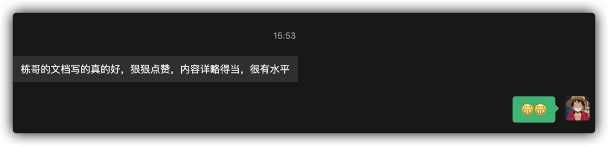

**但是！** 我现在对这个课程有了点新的想法！

所以，我打算在上述所有承诺过的内容之外，额外再增加一部分内容，那就是 **【前端转 AI 全栈生存指南】**。

这一部分的核心是 “**持续更新【AI 全栈】相关的知识，帮助每一个前端的同学，完成【AI 全栈】的整体学习。**

里面包含的内容会比较广，如：Agent 架构设计、RAG、MCP。关键它会持续更新，比如：最近比较火的 `Skills` 都会在这一章中出现。这一章的内容更新不固定。大家可以理解为 **加餐～**

所以，这个课程目前的含金量更高了，嗷嗷高～

有些同学问我：“前端转 AI 全栈有必要吗？”

说实话，直接转岗位确实没必要。 **`但是！` 前端学习 AI 相关的知识，一定是大势所趋的！**

花上一顿饭钱，掌握 **商业级的 AI 全栈应用**，并且还有【前端转 AI 全栈生存指南】怎么着都不算亏。 198 买不了吃亏，买不了上当。

学了这个课程你依然是一个前端工程师，但你已经是一个掌握了 **AI 全栈能力的超级前端工程师**。跟领导申请下涨薪、跳个槽 10 个课程的钱都出来了。

---

然后咱们来说一下这个课程。

这个课程是我们花了半年多的时间，开发了两款商业级别的应用 `简历汪` 与 `面试汪`，然后在 **面试汪** 中提供了三种 AI 模型：**面试押题、专项面试模拟、行测+HR面试**

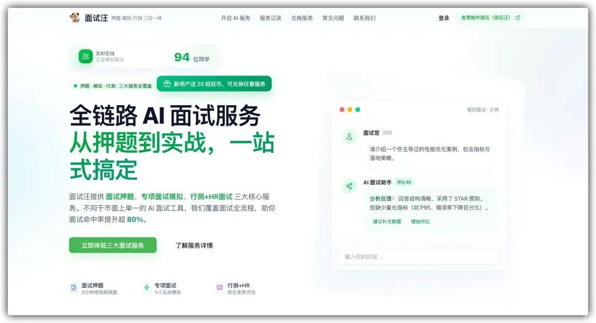

应用上线 3 个月，就已经有了 4 万多的用户，日活 UV 过千了。

我们就是基于这样的一个纯商业级应用，打造出来的课程 **`基于 NestJS 的面试汪 AI 全栈课`** ：`一个 基于 NestJS + LLM 的企业级 AI 面试 SaaS 平台`。

**为什么要教 NestJS？** 因为它是 Node.js 领域的 “Spring Boot”，是企业级开发的标准。它能让你用写前端的语言（TypeScript），写出媲美 Java 架构的后端系统。将来无论是你要转全栈，还是 前端 + AI，这都是所有前端同学的最佳选择！

**项目背景是解决 4 万+ 真实用户的面试痛点，绝非单纯的 CRUD 玩具项目。** 它的目的是利用 AI 技术，通过“**面试押题、专项模拟、HR 软技能对练**”三大核心场景，帮助求职者精准预测考题、模拟真实面试流程，从而大幅提升面试成功率。

这套《商用 AI 全栈课》项目实战文档目前已经全部更新完成，全文 `48 万` 字，涵盖了 **NestJS 核心架构、RAG 知识库构建、Prompt 工程设计、SSE 流式交互** 等等。足够满足现在的 **前端同学想要学习 AI 应用开发，接触 AI Agent、RAG 内容的需求，从而掌握突击中大厂的能力！**

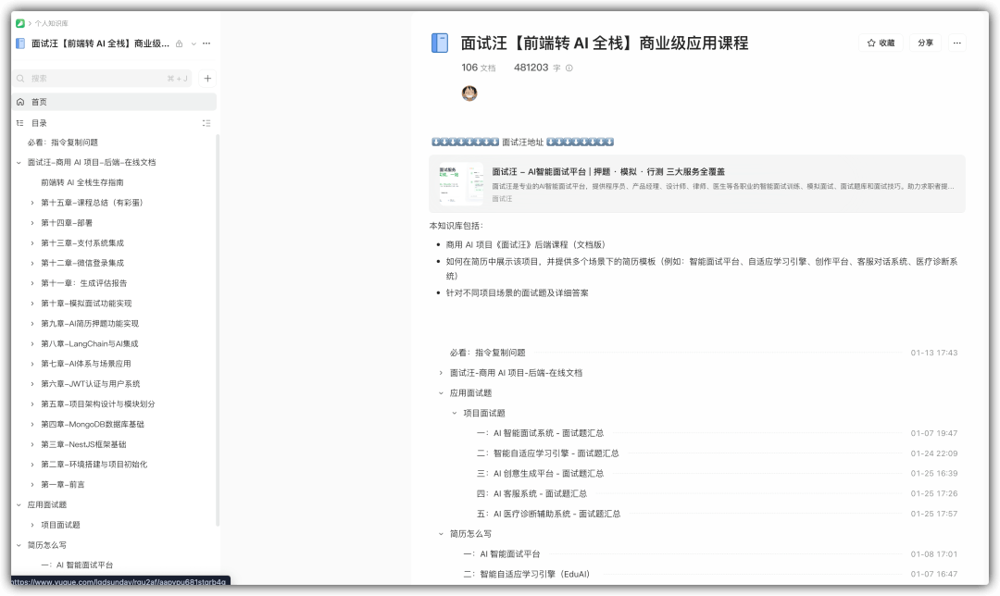

这套课程就是为了证明：**前端同学不需要转行，只需要利用 Node.js 补齐全栈短板，就能瞬间掌握突击中大厂的 AI 应用开发能力！**

不仅如此，我们做 [训练营](https://mp.weixin.qq.com/s?__biz=MzkxNjUxMDg4Ng==&mid=2247507444&idx=1&sn=c5f230982bfc252b7ab800d798150867&scene=21#wechat_redirect) 这么多年，还能不知道大家真正的痛点是什么吗？很多同学都说：“学了课程又咋样，简历不会写！面试也不知道怎么说！光学了...”

**不会！**，为了解决大家这个问题，我直接给大家提供 **`学习 -> 写简历 -> 面试题 -> 模拟面试`** 的全套服务，一条龙到家！！！

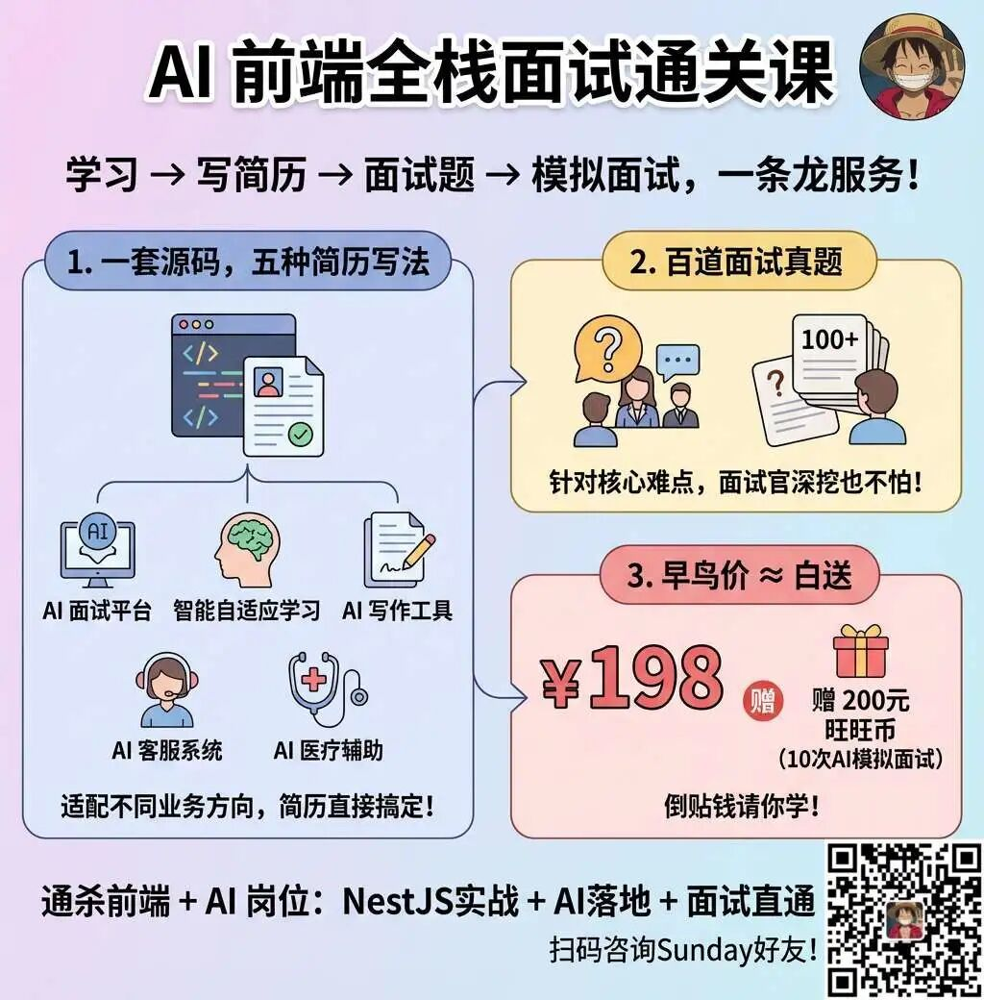

扫码可直接咨询 Sunday

### 1\. 一套源码，五种简历写法

我们按照大厂标准，帮大家总结了技术难点和亮点。

整个课程大家可以根据自己的实际工作的业务不同、侧重点的不同，可以包装成 `5` 个不同的项目经验（AI 智能面试平台、智能自适应学习引擎、AI 智能创意写作工具、AI 客服智能对话系统、AI 医疗诊断辅助系统），**后续还会增加出更多的项目经验**，争取可以适配不同业务方向同学的简历

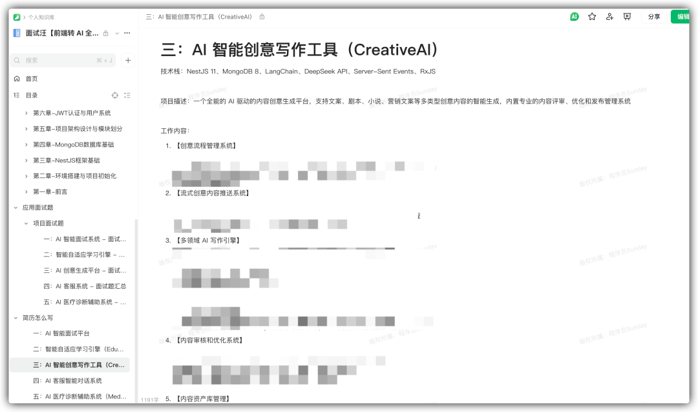

学完这个课程，简历就可以直接做出来了！

### 2\. 百道面试真题

学完了，简历有了，面试不会说咋办？

**没事！**

我们专门根据大家的本项目的核心重点和简历上的内容，整理出了不同的项目对应的不同的面试问题：

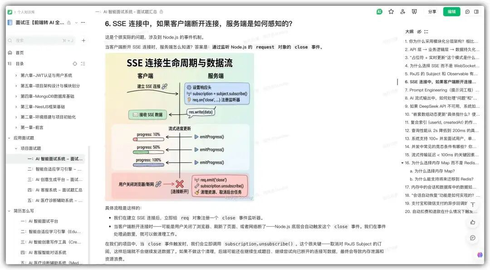

每个项目大约 10 ～ 20 题目，5 个项目合计 `70 题左右`。足够大家在面试中根据面试官的 “深挖” 进行回答了！

### 3\. 课程价格

课程 **`198` 元** 。但大家如果现在购买，会 **赠送价值 `200 元` 的面试汪“旺旺币”（可用于 10 次 AI 模拟面试）**。 这意味着你不仅学了技术，还免费获得了一个私人 AI 面试教练。

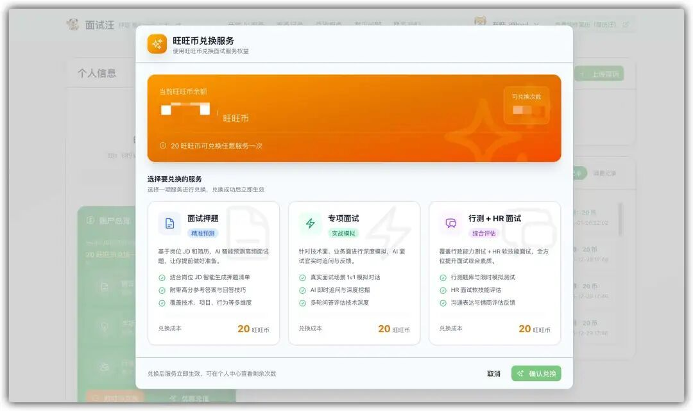

**总结一下：学完这个项目，你将通杀市面上的 前端 + AI 全栈开发岗位！**

- **NestJS 深度实战**：不仅会用，更懂原理。彻底吃透这个 Node.js 界的“工业级标准”，让前端也能 Hold 住复杂后端架构。
- **AI 核心技术落地**：不再对着 RAG、Agent、Prompt 等名词发呆，而是知道它们在代码里是怎么跑起来的。
- **面试直通车**：最重要的一点，我们教你技术，更教你 **如何把这个技术讲给面试官听**。

---

微信扫码下方二维码，添加 `Sunday` 微信购买咨询：

☝️☝️欢迎咨询，备注【课程】☝️☝️

---

接下来 Sunday 给大家快速拆解这个项目，希望让更多需要它的同学看到，把它变成自己的项目，让自己的简历竞争力 Up Up！

## 项目系统架构长啥样？

这可不是那种只有两个接口的 Demo。为了支撑 4 万+ 用户的稳定运行，我们设计了企业级的系统架构。

**核心架构图：**

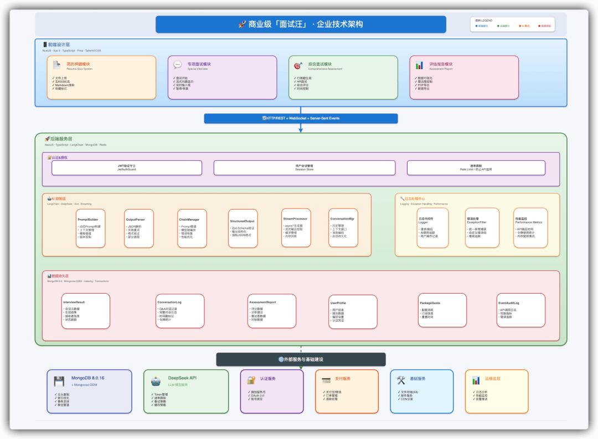

我们基于 **NestJS** 构建了高内聚、低耦合的模块化架构。涵盖了 **鉴权模块、支付模块、AI 核心模块、用户模块** 等。同时结合 **MongoDB** 进行灵活的数据存储，保证了系统的高性能与可扩展性。

## 项目核心业务流程与技术亮点

为什么说这个项目能写进简历？因为它不是一个简单的 API 套壳，而是一个经历了 4 万+ 用户高并发验证、具备复杂状态管理和高性能要求的商业级系统。

看看这些核心流程背后的技术深度，你就明白了：

### 1\. 极致 SSE 体验：

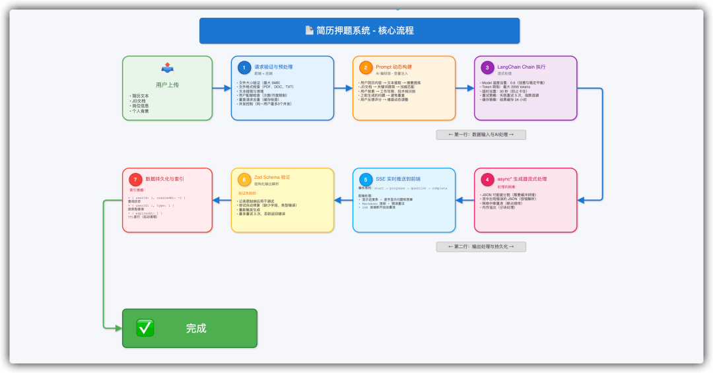

普通项目可能只是调个 GPT 接口，但我们构建了一套基于 LangChain + RxJS 的高可编排 AI 工作流：

**多阶段 Prompt 编排**：我们不是“一问一答”，而是设计了“简历解析 -> 岗位匹配 -> 考点提取 -> 题目生成”的 Pipeline。通过 Prompt 工程的 V1 -> V3 迭代，从通用模板升级为个性化精准匹配，让 AI 真正读懂候选人。

**极致的流式交互**：为了达到类似 ChatGPT 的体验，我们基于 SSE (Server-Sent Events) 实现了 <100ms 的首字响应。通过禁用 Nginx 缓冲、后端立即 Flush 等底层优化，解决了传统 HTTP 请求的等待焦虑。

**技术关键词**：LangChain、RxJS、SSE 流式输出、Prompt Engineering、向量检索

### 2\. 智能 Agent 决策与会话状态管理：

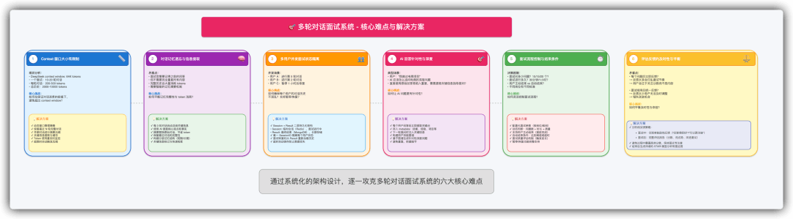

模拟面试不是简单的聊天，而是一个复杂的长链接状态机。AI 需要像真人面试官一样，根据你的回答动态决定下一步操作：

**动态决策逻辑**：利用精密的 Prompt Chain（提示词链） 和 上下文窗口管理，AI 会实时分析候选人的回答质量，动态判断是“继续深挖追问”、“通过进入下一题”还是“结束面试”。

**异常灾难恢复**：如果用户浏览器崩溃了怎么办？我们构建了 Session 级会话恢复机制。通过将 sessionState 实时持久化到数据库，支持用户重新打开浏览器后，无缝恢复到刚才面试打断的那一句话，体验极其丝滑。

**技术关键词**：Agent 决策、上下文管理、Session 持久化、断点续传、状态机设计

### 3\. 金融级数据一致性与高并发架构：

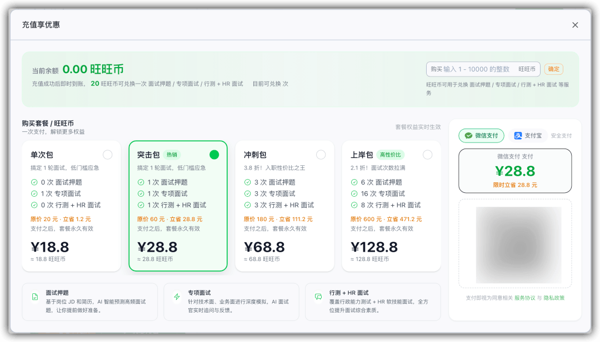

除了 AI 能力，作为一款 SaaS 商业产品，系统的稳定性和数据的准确性是底线。这部分内容能证明你具备中大厂要求的严谨后端开发能力：

**支付与权益保障**：如何防止用户付了钱没到账？或者并发扣费导致余额为负？我们采用了 MongoDB 原子操作 + 状态机设计，配合支付宝/微信的异步回调幂等性处理，确保在任何高并发场景下，用户的“旺旺币”和权益绝不丢失，实现数据的最终一致性。

**10 倍性能优化**：面对 4 万+ 用户的查询压力，我们没有堆机器，而是从数据库层面入手。通过复合索引设计、字段投影（Projection）、以及查询语句优化，将核心接口的响应时间从 2 秒压缩到了 200ms，实现了 10 倍 的性能飞跃。

**技术关键词**：MongoDB 原子操作、分布式锁、支付幂等性、数据库性能调优、NestJS 模块化架构

### 4\. 完全区别于 “玩具 Demo”

这个项目完全区别于市面上的“玩具 Demo”，它具备以下核心竞争力：

- **真实商业验证**：已上线 3 个月，4 万+ 用户，日活过千。这代表你写的代码是经受过市场检验的，而非“自嗨”产物。
- **全栈技术闭环**：从前端 SSE 流式交互，到后端 NestJS 架构，再到 AI Agent 编排 和 数据库调优。你掌握的是一条完整的、高价值的技术链路。
- **看得见的 AI 能力**：你可以直接在面试中拿出电脑，让面试官在线体验这个产品。当他看到 AI 实时生成出精准的面试题时，这种震撼力胜过千言万语。

学完这个项目，你简历上的“项目经验”一栏，将成为面试官最感兴趣的加分项！

## 项目有什么亮点？

从 AI 智能面试平台项目中你可以学到：

- ✅ 如何基于 LangChain 和 RxJS 设计 AI 工作流，通过多阶段 Prompt 编排实现简历押题、专项面试、综合评估的三层 AI 处理流程？
- ✅ 如何通过 Prompt 工程迭代（V1 基础 → V2 精准 → V3 深度），从通用模板升级到个性化高质量的面试题生成，实现精准匹配候选人背景？
- ✅ 如何基于 SSE 实现 <100ms 的流式输出，通过禁用 Nginx 缓冲、立即 flush 等优化，打造类似 ChatGPT 的实时逐字显示体验？
- ✅ 如何通过 MongoDB 原子操作 + 状态机设计，确保并发场景下的交易一致性，防止重复扣费、权益丢失等问题？
- ✅ 如何构建会话恢复机制：通过 sessionState 实时持久化到数据库，支持用户浏览器崩溃后无缝恢复面试进度，实现高可靠的长流程交互？
- ✅ 如何设计支付异步回调系统：通过原子状态转换、幂等重试、最终一致性保证，实现支付宝/微信支付的可靠接入？
- ✅ 如何从多个维度优化数据库查询：通过复合索引、字段投影、ORM 优化、分页查询，实现从 2 秒到 200ms 的 10 倍性能提升？
- ✅ 如何从业务价值、技术深度、工程可靠性多维复盘项目，体现 AI 应用如何解决求职市场的真实痛点？

这个项目不是一个简单的 Demo 项目，而是：**真·商业级应用！**

## 学完之后能干嘛？

我从来不跟大家画大饼，咱们直接看数据，看市场到底缺什么人，给多少钱！

大家直接看 BOSS 直聘 上的最新招聘截图，搜一下 **AI 应用工程师（前端方向）**：

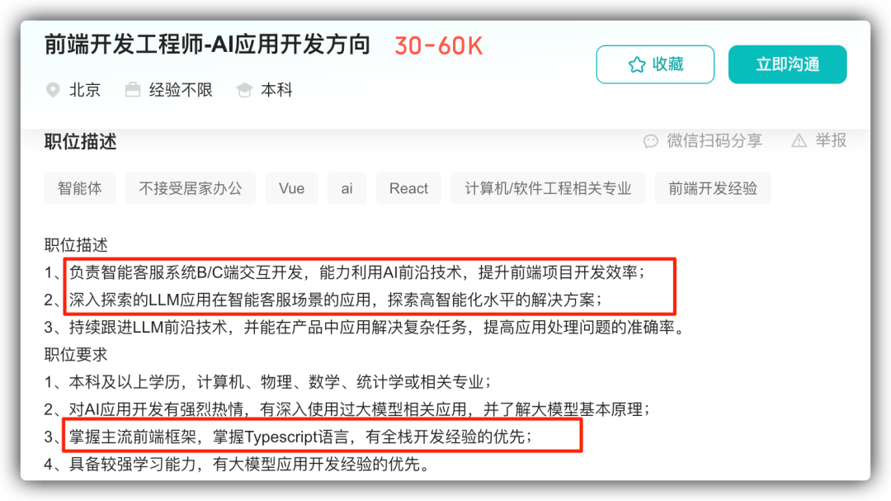

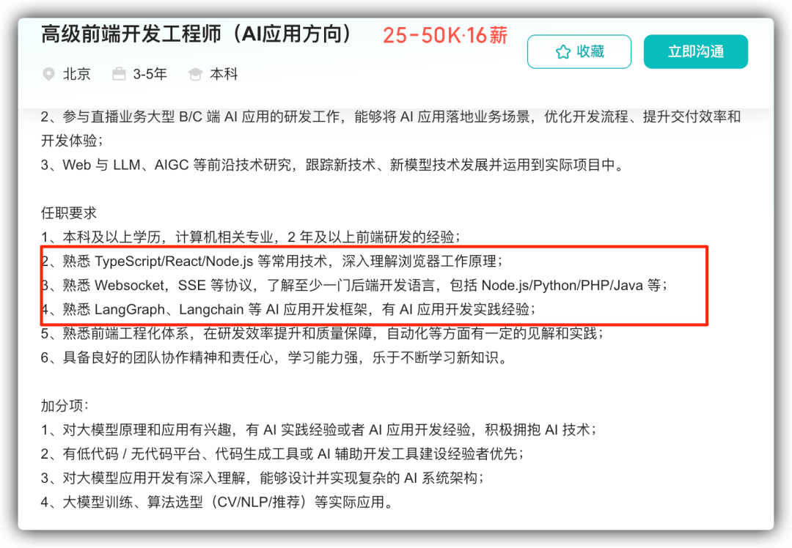

大家仔细看 JD 里的关键词：

- “熟悉 LangChain / LLM 应用开发” —— **咱们教了！**
- “有 RAG / Agent 落地经验” —— **咱们不仅教了，还是商业级落地！**
- “熟悉 Node.js / NestJS 服务端开发” —— **这正是咱们课程的核心！**

不管是 **智能客服**、**AI 写作** 还是 **业务流编排**，咱们课程里的 `4 万+ 用户真·商业项目` 经验，完全覆盖这些高薪 JD 的核心痛点。

学完这个项目，你完全有能力去投递以下三类高薪岗位：

- 资深前端工程师（拥有 AI 落地经验是巨大的加分项）
- Node.js 全栈工程师（NestJS 企业级架构是硬通货）
- AI 应用开发工程师（当下互联网最火热、最吸金的新赛道）

一句话总结：**学完这个课程，你不仅能找到工作，更能找到一份更有前景、更高薪水、更难被 AI 取代的好工作！**

## 有课程评价吗？

说实话这个课程因为是新上的，还真没什么评价系统。

不过，Sunday 之前在慕课网录制过不少的技术课程，大家可以参考对应的评价系统：

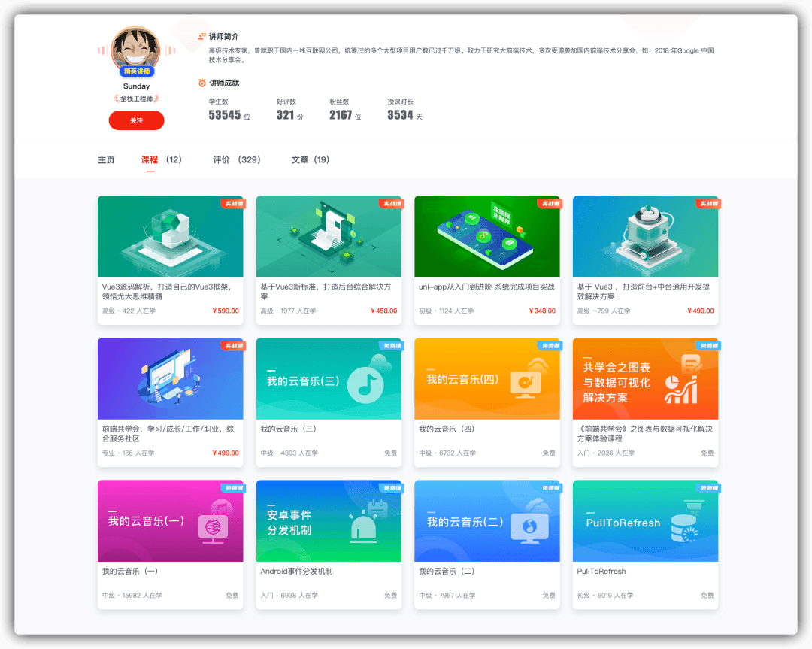

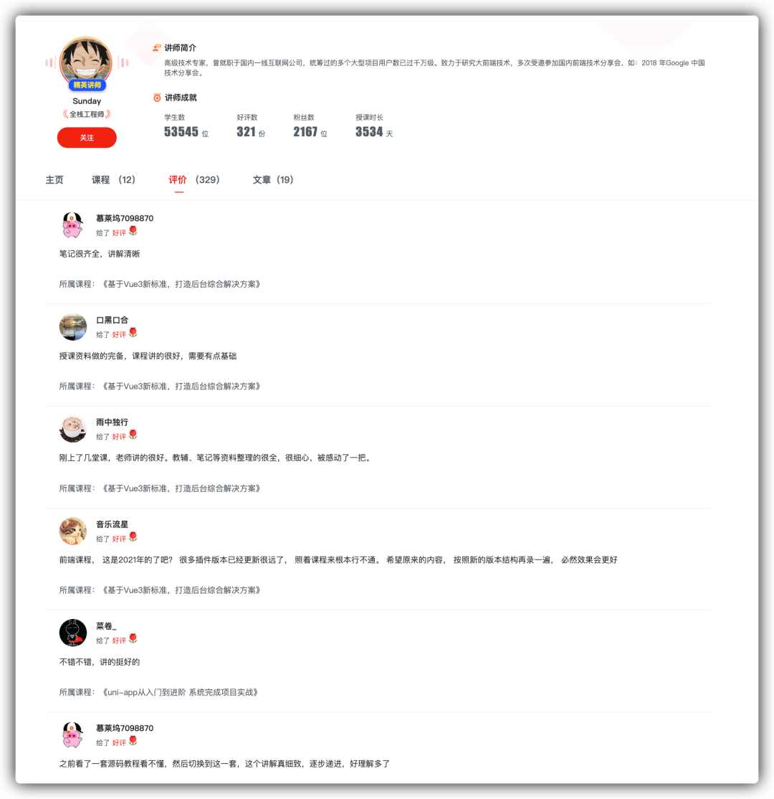

## 项目文档与学习服务

我们深知，对于想转型的同学来说，代码只是骨架，文档和思路才是灵魂。 为了确保大家能学会、能落地，我们构建了“保姆级”的学习保障体系。

### 1\. 保姆级语雀文档（更新中）：

我们不屑于做那种只有几页说明书的“烂尾”项目。学习主要以 **语雀知识库文档** 的形式进行。

全套文档目前共计 **48 万字**，后续还会长期更新 【前端转 AI 全栈生存指南】的内容

从环境搭建、NestJS 基础语法，到 AI 模块开发、RAG 架构设计、再到 Docker 部署上线。每一个步骤都有详细的图文解析，细致到连报错怎么解决都写进去了。

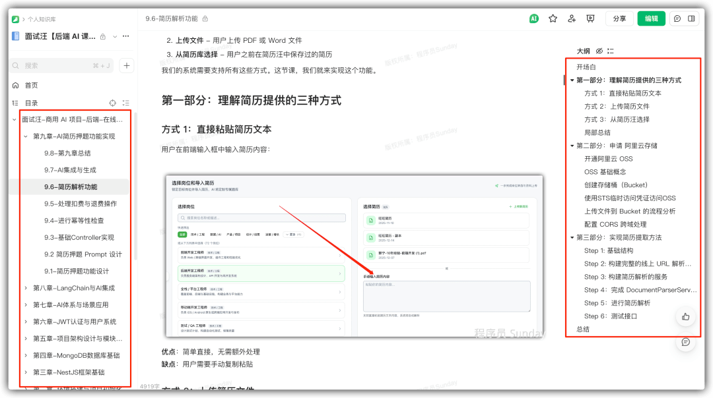

**单个小节长度通常在 6000 ～ 10000 字之间**。这不仅是课程文档，更是你未来工作中随时可以查阅的 Node.js + AI 开发字典。

### 2\. 学习门槛与周期：

很多同学担心：“我没写过后端，能学会吗？”

- **门槛极低**：你只需要具备 **JS、TS 的基础** 即可。关于 NestJS 和 MongoDB 的所有后端知识，课程里都会从零开始，手把手带你入门到精通。只要你会写 console.log，你就能学会这个项目！
- **成型极快**：大约 **4 ～ 6 周**。每天花点时间，一个月后，你就不再是一个单纯的前端，而是一个拥有完整 AI 商业项目经验的全栈开发者。

### 3\. VIP 专属社群答疑：

学习最怕什么？最怕遇到 Bug 没人问，卡几天想放弃。

购买课程后，你将加入 **VIP 专属交流群**。

- 有问必答：Sunday 老师和助教团队会在群里直接解答你的技术疑惑。
- 人脉圈子：群里都是来自各大厂、即使在大环境不好依然坚持学习的优秀同学，加入这里，就是加入了一个高质量的技术人脉圈。

### 4\. 拒绝焦虑，终身可学

很多同学问：“最近加班多，怕没时间学，有时间限制吗？”

**完全没有！**

我们拒绝制造时间焦虑。报名后，**项目源码、课程文档、视频更新** 均为 **终身有效**！哪怕你现在囤着，等到下半年跳槽前再突击，也完全没问题。

一次付费，终身拥有一套不断迭代的 AI 知识库。

## 项目适合哪些同学？

### ✅ 如果你是以下几类人，这个项目就是为你量身定做：

- **急需亮点的校招/应届生**：简历平平无奇？本项目能让你手握“商业级 AI 落地经验”，在满是 CRUD 的竞品简历中实现降维打击，直通大厂面试。
- **遭遇瓶颈的前端老兵**：厌倦了单纯的切图和写页面，担心 35 岁危机？这里是你**低成本转型“AI 工程师”**的最佳跳板，用技术厚度构筑职业护城河。
- **想转 AI 但不想学 Python 的开发者**：对 Python 庞大的体系望而却步？带你用最熟悉的 JS/TS 栈，直接撬动大模型能力，走通 AI 全栈开发的捷径。
- **进阶全栈的 Node.js 学习者**：不满足于写简单的 Express 脚本？带你掌握 NestJS 企业级架构（AOP、微服务、设计模式），真正打通前后端任督二脉。

### ❌ 以下同学请慎重考虑：

**“伸手党” 或 纯视频学习依赖者**：本项目以 48万字保姆级文档 为主。我们坚持认为，阅读高质量技术文档是迈向高级工程师的必经之路。如果你无法静下心来阅读文档，不仅学不好这个课，也难以适应大厂的工作模式。

## 如何报名？

最后，咱们再来算笔账。

**课程售价：198 元**。

**重点来了**：现在购买，`直接赠送 「面试汪 200 旺旺币」（价值 「200 元」）`。 这些币你可以用来兑换 **10 次** 完整的 AI 面试押题、专项面试或 HR 模拟。

**支付 198 元 === 获得 200 元的服务 + 一套商业级 AI 项目课程 + 5 套简历模板 + 100 多道面试题。**

**这相当于我们不仅没收钱，还倒贴了你 2 元！**

如果你正准备面试，或者想转行 AI 开发，这绝对是目前市面上**性价比最高、最硬核**的选择。

**早买早学，早拿 Offer！价格后续一定会涨，现在就是底价。**

☝️☝️欢迎咨询，备注【课程】☝️☝️

支付购买后，你会获得进入语雀知识库的权限，开启你的 AI 进阶之旅！
