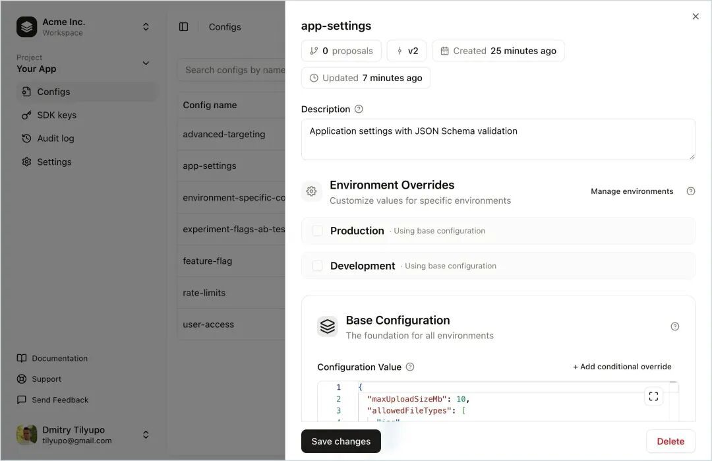

# 【第3650期】从 .env 到动态配置：前端工程的一次升级

前言

很多前端和 Node.js 项目，配置管理几乎都是从环境变量开始的：.env、process.env、再配合一次部署。但当你需要临时关掉一个功能、调整接口限流、做灰度发布时，这种方式就会立刻暴露问题 —— 每改一次配置就要重新部署。今日前端早读课文章由 @Dmitry Tilyupo 分享，@飘飘编译。

译文从这开始～～

环境变量确实好用 —— 直到它们突然失灵。你在 `.env` 里设置了 `RATE_LIMIT=100`，部署上线，然后就把这事忘了。直到黑色星期五来临，你的 API 被疯狂请求，你需要立刻把限流降到 50。

[【第2882期】JavaScript中的环境变量： process.env](https://mp.weixin.qq.com/s?__biz=MjM5MTA1MjAxMQ==&mid=2651261247&idx=1&sn=aa5e69782c39422e91100538aa77c42a&scene=21#wechat_redirect)

而部署流水线需要 12 分钟。

就在这一刻，团队才真正意识到静态配置和动态配置之间的差别。静态配置是 “打包” 进部署里的 —— 只有重新部署才会生效。动态配置存在于部署之外 —— 你一修改，它就能生效。

#### 静态配置的问题

大多数 Node.js 应用都是从环境变量开始的：

```
 const config = {
   rateLimit: parseInt(process.env.RATE_LIMIT || '100'),
   featureNewCheckout: process.env.FEATURE_NEW_CHECKOUT === 'true',
   cacheMaxAge: parseInt(process.env.CACHE_MAX_AGE || '3600')
 }
```
这种模式对于真正静态的值来说没问题，比如：

- 数据库地址
- API 密钥
- 服务端点

这些值在应用运行期间不会变化，也不应该变化。但一旦遇到下面这些场景，它就撑不住了：

- 流量高峰或事故期间需要调整限流
- 用于灰度发布或紧急关闭的功能开关
- 下游服务变慢时需要调整超时时间
- 处理积压任务时需要修改批量大小
- 为了排查线上问题而临时提高日志级别

修改任何一个，都意味着一次重新部署：提 PR → 等评审 → 合并 → 等 CI → 部署 → 然后祈祷这次修改真的有用。如果没用，再来一轮。

[【第3460期】如何在前端开发中实现零停机部署](https://mp.weixin.qq.com/s?__biz=MjM5MTA1MjAxMQ==&mid=2651275760&idx=1&sn=6c73d6f67aa0f474cc8c21e78ed76749&scene=21#wechat_redirect)

#### 动态配置到底意味着什么

动态配置有三个关键特性，使它区别于静态配置：

**1、修改无需重启即可生效**

当你在配置存储中更新一个值时，正在运行的应用实例会在几秒内收到更新。不需要滚动重启，不需要重新部署，也不会有停机。

**2、在读取时计算值**

配置不是在启动时读一次就永远缓存，而是在你需要的时候读取当前值。可能是每个请求、每分钟一次，或者介于两者之间 —— 取决于你的使用场景。

**3、保留历史记录**

每一次修改都会生成一个版本。你可以清楚地看到是谁、在什么时候、因为什么改了什么。如果某次修改引发问题，可以立刻回滚到一个已知稳定的版本。

#### Node.js 中实现动态配置的三种方式

实现动态配置通常有三种常见模式。它们在复杂度、延迟和一致性之间各有取舍。

##### 1、轮询（Polling）

最简单的方式：定时从外部存储拉取配置。

```
 import { readFileSync, watchFile } from 'fs'

 interface Config {
   rateLimit: number
   featureNewCheckout: boolean
 }

 let config: Config = JSON.parse(readFileSync('./config.json', 'utf-8'))

 // 每 30 秒轮询一次
 setInterval(async () => {
   try {
     const response = await fetch('https://config-api.internal/v1/config')
     config = await response.json()
   } catch (error) {
     console.error('Failed to refresh config:', error)
     // 继续使用上一次的有效配置
   }
 }, 30_000)

 export function getConfig(): Config {
   return config
 }
```
轮询方式非常直观，也容易调试。它几乎可以配合任何配置后端使用 ——JSON 文件、Redis、数据库或 HTTP API。

但它有两个明显缺点：

- 配置更新会最多延迟一个轮询周期
- 当配置很少变化时，频繁轮询会浪费资源

##### Webhook

反转控制流程：由配置服务器在发生变化时主动推送更新。

```
 import express from 'express'

 let config: Config = { rateLimit: 100, featureNewCheckout: false }

 const app = express()

 app.post('/config-webhook', express.json(), (req, res) => {
   const { secret, payload } = req.body

   if (secret !== process.env.WEBHOOK_SECRET) {
     return res.status(401).json({ error: 'Invalid secret' })
   }

   config = payload
   console.log('Config updated:', config)
   res.json({ ok: true })
 })
```
Webhook 能提供更快的更新速度 —— 配置一旦变更，推送完成后立刻生效。

[【早阅】Node.js 性能hooks和度量 API](https://mp.weixin.qq.com/s?__biz=MjM5MTA1MjAxMQ==&mid=2651273691&idx=1&sn=eec5a5cf10c5083ef731f12de4f6f3f3&scene=21#wechat_redirect)

但代价也不小：

- 你需要对外暴露一个接口
- 需要处理鉴权
- 推送失败时要考虑重试
- 还要解决分布式系统中的经典问题：如何确保所有实例都收到了更新

##### Server-Sent Events（SSE）

建立一条持久连接，由服务器实时推送变更。

```
 import { EventSource } from 'eventsource'

 let config: Config = { rateLimit: 100, featureNewCheckout: false }

 const source = new EventSource('https://config-api.internal/v1/stream', {
   headers: { Authorization: `Bearer ${process.env.CONFIG_API_KEY}` }
 })

 source.addEventListener('config_change', (event) => {
   const change = JSON.parse(event.data)
   config = { ...config, [change.name]: change.value }
   console.log('Config updated:', change.name, '→', change.value)
 })

 source.addEventListener('error', (error) => {
   console.error('SSE connection error:', error)
   // EventSource 会自动重连
 })

 export function getConfig(): Config {
   return config
 }
```
SSE 结合了轮询和 Webhook 的优点：

- 配置几乎实时更新，通常在修改后 100ms 内即可生效
- 由客户端发起连接，不需要暴露额外的接收接口
- 不用处理入站鉴权
- EventSource API 会自动处理断线重连

缺点主要在运维层面：

- SSE 使用的是长连接，并不是所有负载均衡器和代理都能很好地支持
- 你仍然需要优雅地处理连接中断的情况

#### 超越简单的键值配置

真实的应用程序需要的不只是 `get(key) -> value` 这么简单。来看一些实际需求：

**1、类型安全**

你希望 TypeScript 明确知道 `rateLimit` 是一个数字，`featureNewCheckout` 是一个布尔值。当你把字符串传给一个本应是数字的配置时，就能在编译期报错。

**2、上下文感知的配置值**

高级用户和免费用户的限流应该不同。某个功能开关可能只对 10% 的用户开启，或者只在特定地区启用。你需要传入上下文信息（用户 ID、套餐、地区），并返回正确的配置值。

**3、默认值**

如果配置服务不可用，你的应用仍然应该能正常运行，并使用合理的默认值。不能因为连不上配置服务器就直接抛错。

**4、订阅机制**

有些配置变化不仅仅是 “下一个请求使用新值” 这么简单。比如限流配置发生变化时，你可能需要用新参数重新初始化限流器。你需要一种机制来对特定配置变更做出响应。

下面是使用 Replane SDK 的实际示例：

```
 import { Replane } from '@replanejs/sdk'

 // 为配置定义类型
 interface Configs {
   'api-rate-limit': number
   'feature-new-checkout': boolean
   'cache-settings': {
     maxAge: number
     staleWhileRevalidate: number
   }
 }

 // 使用默认值进行初始化，增强系统韧性
 const replane = new Replane<Configs>({
   defaults: {
     'api-rate-limit': 100,
     'feature-new-checkout': false,
     'cache-settings': { maxAge: 3600, staleWhileRevalidate: 60 }
   }
 })

 await replane.connect({
   sdkKey: process.env.REPLANE_SDK_KEY!,
   baseUrl: 'https://cloud.replane.dev'
 })

 // 类型安全的访问——TypeScript 知道这是一个 number
 const rateLimit = replane.get('api-rate-limit')

 // 上下文感知的计算——根据用户返回不同的值
 const userRateLimit = replane.get('api-rate-limit', {
   context: { userId: user.id, plan: user.subscription }
 })

 // 响应配置变化
 replane.subscribe('cache-settings', (config) => {
   cacheManager.configure(config.value)
 })
```
SDK 会负责处理 SSE 连接、自动重连、本地缓存以及上下文计算，你的应用代码可以保持简洁。



Replane：https://github.com/replane-dev/replane

#### 什么时候该使用动态配置

并不是所有配置都需要做成动态的。对于那些很少变化、也不需要即时生效的值，引入配置管理系统的额外成本并不值得。

[【第3463期】使用抽象语法树把低代码配置转换成源码](https://mp.weixin.qq.com/s?__biz=MjM5MTA1MjAxMQ==&mid=2651275841&idx=1&sn=2a7ef67958d735378f2153de613fb91e&scene=21#wechat_redirect)

**适合使用动态配置的场景：**

使用场景

示例

为什么要动态

功能开关

`new-checkout-enabled`

先对 1% 用户开启，观察指标，再逐步提升到 100%

限流

`api-rate-limit`

无需部署即可应对流量高峰

超时配置

`downstream-timeout-ms`

第三方服务变慢时快速调整

紧急开关

`payments-enabled`

立刻关闭有问题的功能

运维调优

`batch-size`

、`worker-count`

不重新部署即可优化参数

**应继续作为静态环境变量的配置：**

- 数据库连接字符串
- API 密钥和其他敏感信息
- 服务 URL 和端点
- 日志输出位置

这些值本质上是静态的 —— 运行期间不应该变化，而且修改它们通常本来也需要重启应用。

#### 部署解耦原则

动态配置背后的核心思想是：代码部署和配置变更服务于不同的目的。

- 代码部署是为了新增或修改行为
- 配置变更是在代码已支持的范围内，调整这些行为

当你在代码中合入一个功能开关判断时，你是在部署 “启用或禁用该功能的能力”。当你真正去切换这个开关时，你是在使用这种能力。这两者是完全不同的操作，风险级别不同，审批流程不同，回滚方式也不同。

代码变更通常要经过代码评审、CI/CD、测试环境、灰度发布；配置变更则有自己的流程 —— 运维参数可能可以即时生效，面向用户的功能可能需要审批。

如果把配置硬编码进代码，就会把这两种流程强行耦合，结果是两边都变得更糟。

将部署与配置解耦，可以带来：

- 更快的事故响应：几秒内关闭有问题的功能，而不是等部署
- 更安全的发布：1% → 10% → 100% 逐步放量
- 更清晰的职责划分：工程师负责代码，产品负责功能开关，运维负责运行参数
- 更好的审计能力：配置变更有独立的历史记录，不再混在 git 提交里

#### 常见错误

**1、把敏感信息放进动态配置**

动态配置适合频繁变化、需要快速传播的值；而密钥正好相反，它们应该通过安全渠道低频轮换。敏感信息请放在专用的密钥管理系统中（如 Vault、AWS Secrets Manager）。

**2、什么都用动态配置**

并不是所有值都需要即时更新。如果你把数据库连接字符串也放进动态配置，只会徒增复杂度，却没有实际收益 —— 反正修改它们本来就需要重启应用。

**3、忽视冷启动问题**

如果应用启动时连不上配置服务器会怎样？如果直接抛错，配置服务一宕机，你的应用就起不来。一定要使用默认值，并确保这些默认值是安全的。

**4、忘记缓存**

如果你在每个请求里调用 `config.get('key')`，而每次都会触发网络请求，那性能一定会出问题。应该在内存中缓存配置，并通过 SSE 或轮询更新，而不是按需拉取。

**5、不校验配置值**

控制台里一个拼写错误，不应该直接把你的应用搞挂。使用前要校验配置值，并优雅地拒绝无效配置。

### 快速入门

如果你已经准备好超越环境变量，可以按下面步骤开始：

**1、识别候选项**

回顾现有配置，哪些是你最希望 “不用部署就能改” 的？它们就是最适合做成动态配置的。

**2、搭建配置后端**

可以从简单方案开始：一个手动修改并部署的 JSON 文件，或者一个用脚本更新的 Redis 哈希。也可以直接使用像 Replane 这样内置版本管理、回滚和实时更新的工具。

**3、设置默认值**

在迁移任何配置之前，先确保有合理的默认值。即使配置服务不可用，应用也应该能（至少以降级模式）运行。

**4、渐进式迁移**

不要一次性全部迁移。先从一两个配置开始，验证模式可行，再逐步扩大。

**5、建立监控**

监控配置变更事件。如果某次配置修改后系统出问题，你需要第一时间知道。

关于本文  
译者：@飘飘  
作者：@Dmitry Tilyupo  
原文：https://replane.dev/blog/dynamic-configuration-nodejs/

这期前端早读课  
对你有帮助，帮” 赞 “一下，  
期待下一期，帮” 在看” 一下。
