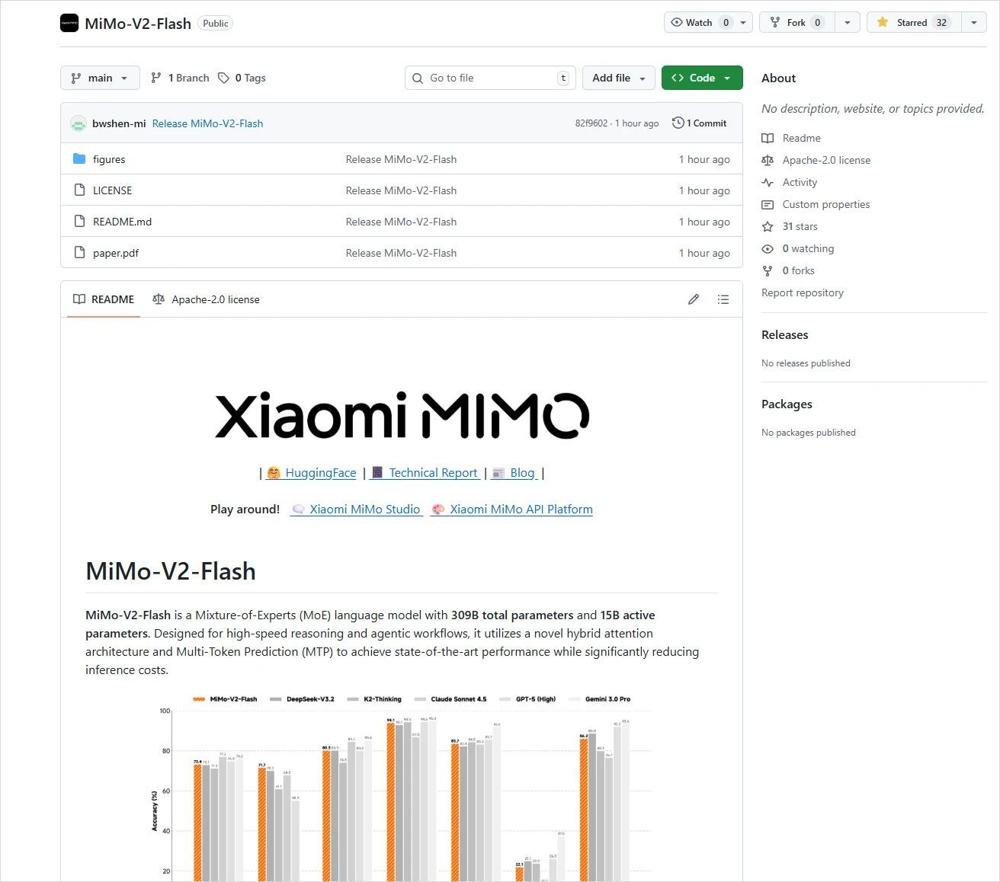
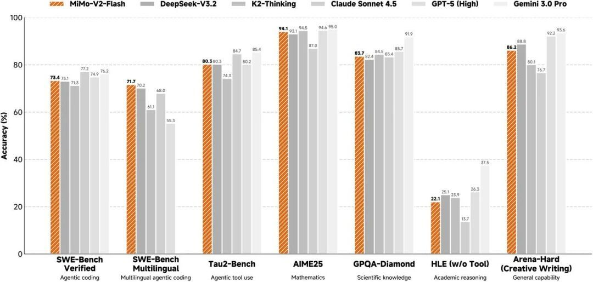
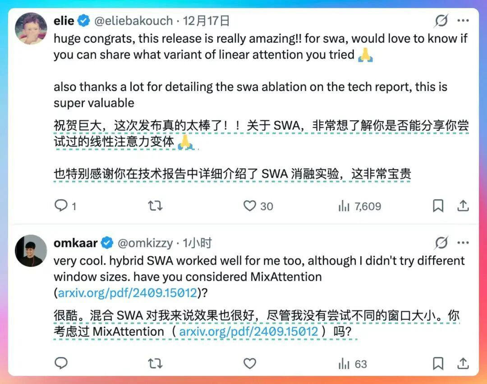

# 雷军团队宣布：小米正式开源！免费！

小米新帅罗福莉入职后的首秀直接炸场 ——MiMo-V2-Flash 官宣开源，瞬间引爆技术圈！  
  
官方实测数据堪称 “卷王级别”：代码生成能力直接碾压所有开源模型，硬刚闭源标杆 Claude 4.5 Sonnet 也不落下风；更狠的是性价比，推理成本仅需后者的 2.5%（相当于打了 0.25 折），生成速度还直接翻倍！  
  
对咱们前端来说，这波开源简直是生产力 buff 拉满 —— 写业务代码、调框架 bug、优化性能脚本，用它省时又省钱，难怪刚上线就好评如潮～

林三心不学挖掘机

**微信扫一扫赞赏作者**[喜欢作者](javascript:;)

广东,1月2日 08:30,

