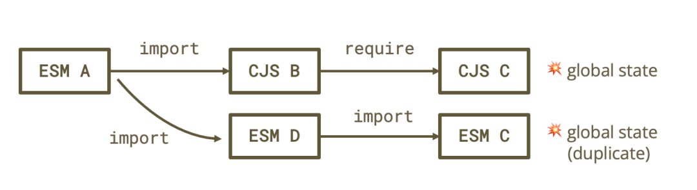
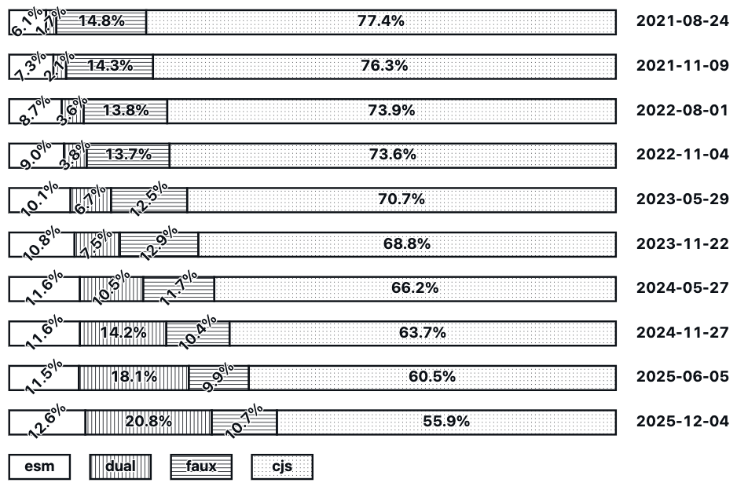

# 【第3647期】在 Node.js 中使用require(esm)：从实验到稳定

前言

讲述了 Node.js 中 require (esm) 从实验性功能到稳定版本的演变过程，以及它对生态系统的影响和未来的发展方向。今日前端早读课文章由 @Joyee Cheung 分享，@飘飘编译。

译文从这开始～～

一年多以前，我开始着手让 Node.js 支持 `require(esm)`，并成功实现了一个实验性版本。经过多轮迭代和实战验证，如今 `require(esm)` 已在所有受支持的 Node.js LTS 版本中（v20.19.0+、v22.12.0+）默认启用，并正式标记为 “稳定”。本文回顾了它从实验阶段到稳定落地的过程。

[【第3630期】从依赖到原生：15 个 Node.js 新特性提升开发效率与安全性](https://mp.weixin.qq.com/s?__biz=MjM5MTA1MjAxMQ==&mid=2651278232&idx=1&sn=d4c12993848286edfac7b9a0baa4c0ad&scene=21#wechat_redirect)

#### 对 require (esm) 的全新理解

我之前写过一篇关于 `require(esm)` 的文章，当时还只是从一个对模块加载器经验不多的贡献者角度，探讨它为什么迟迟没有实现。自那以后，经过不断迭代，我们对这个问题有了更深入的认识：要实现初版并不难，但要让它真正稳定，需要大量工作 —— 解决兼容性边缘问题、跨版本回溯移植、评估生态影响、寻求共识、权衡方案，并与整个生态系统协作。

[【第3465期】转向纯 ESM（ECMAScript Modules）](https://mp.weixin.qq.com/s?__biz=MjM5MTA1MjAxMQ==&mid=2651275855&idx=1&sn=21c52f19f466524ab85028faa2eb671b&scene=21#wechat_redirect)

说实话，一些问题源自社区为弥补 `require(esm)` 缺失而发展出的各种 “变通方案”，某种程度上是 “自找麻烦”。如果早期对 ESM 投入更多资源，这个循环可能早就被打破。但 Node.js 是一个由志愿者驱动的社区项目，没有统一的产品经理去规划路线或分配任务。项目的进展，取决于那些自发参与并投入时间的开发者。如果没有人主动推动，即使是重要特性，也可能停滞很久。

不过，来自更广泛社区的支持 —— 建设性的反馈、积极的沟通、资金赞助，或只是一些鼓励 —— 都能激发并维持项目进展。尤其是像模块加载器这样 “不被热爱但至关重要” 的组件。在这次复兴中，我幸运地得到了其他贡献者的帮助与审查、维护者的支持，以及来自 Bloomberg 的赞助，让我能投入更多时间。回头看，我会总结 `require(esm)` 迟迟未能实现的原因为一句话：它需要整个社区的合力，而这一次，社区真的动起来了。

#### 我们真的需要让 require (esm) 实现吗？

开发过程中，有人提出疑问：如果实现了 `require(esm)`，会不会削弱大家迁移到 ESM 的动力，从而让转型停滞？这是个合理的担忧，但从包维护者的反馈来看，事实恰好相反 —— 缺少 `require(esm)` 反而拖慢了生态发展，而它的存在有可能加速迁移。要理解这一点，需要回顾过去几年的迁移过程。

##### 没有 require (esm)，ESM 是一种 “劣势格式”

有一种观点认为：如果阻止 CommonJS 加载 ESM，那么当依赖迁移到 ESM 后，用户就会被迫跟进迁移。虽然这在一定程度上发生了，但事实证明，这种方式既不充分，也不必要。许多项目选择 “锁定” 依赖的旧版 CommonJS（npm 上一些热门包的下载数据可以证明这一点）。在一个去中心化、依赖复杂交织的生态系统中，如果迁移计划以 “破坏性变更” 为核心策略，只会引发反作用力，迫使人们用各种方式绕过问题，最终让生态更加碎片化。

从包作者的角度来看，如果 CommonJS 代码既能被 ESM 导入，又能通过 `require()` 被 CommonJS 加载，而 ESM 却不能被 CommonJS 直接 `require()`，那 CommonJS 就成了 “最大兼容” 的发布格式，而 ESM 在 Node.js 中反而成了 “次等格式”。

[【早阅】Node.js 模块简史：cjs、打包工具和 esm](https://mp.weixin.qq.com/s?__biz=MjM5MTA1MjAxMQ==&mid=2651275042&idx=1&sn=6539b06616acbf18c8ccc7b004d6b847&scene=21#wechat_redirect)

##### 各种 “变通方案” 抬高了 ESM 的采用成本

当然，采用 ESM 仍然有许多激励因素，比如：结合 TypeScript 使用时有更好的静态分析体验，或者能更方便地与浏览器端代码共享逻辑。但由于 ESM 在 Node.js 中的 “发布兼容性弱”，许多包开始把 ESM 转译为 CommonJS：

- 一些需要打包在浏览器中运行的包，在 Node.js 中只提供 CommonJS 运行格式 —— 这类被称为 “伪 ESM”（源代码为 ESM，构建产物为 CommonJS）。
- 另一些包同时提供 ESM 与 CommonJS，并在 `package.json` 中通过 `"exports"` 字段控制加载方式 —— 这类被称为 “双格式包（dual packages）”，但容易引发著名的 “双包陷阱（dual-package hazard）”。



结果是，使用 ESM 不只是换一种语法，还意味着要增加转译步骤、更重的 `node_modules`，以及潜在的兼容风险。

[【早阅】如何将 CommonJS 转换为 ESM](https://mp.weixin.qq.com/s?__biz=MjM5MTA1MjAxMQ==&mid=2651273581&idx=1&sn=68e0c6dcd7adf8ec1553a2c071358d3f&scene=21#wechat_redirect)

##### CommonJS 成了 “阻力最小” 的道路

问题进一步恶化：许多工具或框架虽然内部用 ESM 编写，但发布时仍使用 CommonJS，以便让现有插件或用户通过 `require()` 正常加载。为了支持 ESM 插件或用户，它们往往在运行时把用户的 ESM 代码动态转译成 CommonJS 再加载。但当转译后的代码再导入外部 ESM 包时，就会出现 `ERR_REQUIRE_ESM` 错误，除非继续深层转译依赖 —— 从而形成一个恶性循环，让 CommonJS 继续主导运行时生态，甚至使得许多项目依赖于 CommonJS 的内部加载机制。

由 Titus Wormer 维护的 npm-esm-vs-cjs 项目一直在跟踪高影响力包的 ESM 迁移情况。结果显示：在 ESM 在 Node.js 中稳定的五年后，CommonJS 仍是主流发布格式。即使是已用 ESM 编写的包，“双格式发布” 仍然最常见，而 “纯 ESM 发布” 反而是少数派。事实上，由于统计会汇总所有版本的下载量，许多已经转为 ESM 的包，其下载量仍主要来自旧版 CommonJS。现实情况是，大多数代码在 Node.js 中依旧以 CommonJS 形式运行，而 “编写格式” 和 “发布格式” 的鸿沟仍在扩大。



##### require (esm) 解锁了什么

归根结底，缺少 `require(esm)` 给 ESM 的推广带来的问题，比它解决的问题还要多。支持 `require(esm)` 虽然不能解决所有兼容性问题，但它能显著降低摩擦：

- 各个包可以直接迁移到 ESM 并以 ESM 格式发布，而不会破坏或割裂自身生态。
- 许多包无需再转译为 CommonJS，从而降低构建复杂度。
- 双格式包（dual packages）可以直接移除 CommonJS 版本，使 `node_modules` 更轻量，同时消除 “双包陷阱”。
- 在大型代码库中，增量迁移变得更可行。

对于许多维护者来说，`require(esm)` 是他们发布 ESM 的最后障碍。当它在所有 LTS 版本中稳定落地后，许多知名包开始陆续转向 ESM。

##### 那么，顶层 await 怎么办？

正如前一篇文章中提到的，`require(esm)` 的理论基础建立在 ESM 语义之上 —— 即不包含顶层 `await` 的 ESM 可以保证同步求值。而由于 `require(esm)` 本身必须保持同步执行，它无法支持包含顶层 `await` 的模块。这又让人想起 2019 年的一个老问题：这会不会限制 Node.js 对 ESM 的支持？

[【第3559期】深入分析 await fetch() 性能问题及优化方法](https://mp.weixin.qq.com/s?__biz=MjM5MTA1MjAxMQ==&mid=2651277068&idx=1&sn=34adce747d9223736622cc406d77cd24&scene=21#wechat_redirect)

##### 实际上，这几乎没有影响

在取消实验标签前，社区在 2024 年 9 月对高影响力的 npm 包进行了分析，以评估 `require()` 不支持顶层 `await` 的实际影响（分析脚本可在文中找到）。结果如下：

在 5000 个高影响力包中：

- 超过 3000 个是 CommonJS，本就无法使用顶层 `await`。
- 466 个是双格式包，526 个是伪 ESM（以 CommonJS 形式运行），几乎不会用顶层 `await`。
- 559 个是纯 ESM 包。用 `require(esm)` 加载后，仅有 6 个使用了顶层 `await`：
- 其中 3 个在迁移过程中将 `fs.*Sync()` 替换为异步版本，可轻松回退；
- 2 个用 `await import('node:foo')` 来检测 Node.js 环境，而 `process.getBuiltinModule()` 已可替代；
- 1 个包被压缩混淆，无法确定是否真的需要顶层 `await`。

换句话说，在这 5000 个样本中，只有约 0.02%（1/5000） 的包可能确实依赖顶层 `await`；而对约 99.98% 的包来说，`require()` 是否支持顶层 `await` 几乎无关紧要。与此同时，即便不支持顶层 `await`，`require(esm)` 仍能让大约 20% 已使用 ESM 编写 的包直接以 ESM 发布，无需转译。

进一步的研究发现，顶层 `await` 更多出现在脚本或应用代码中，而很少出现在被他人加载的模块中。  
即使有，在同一 ESM 生态内部使用 `import` 加载也能正常工作。只有当一个含顶层 `await` 的 ESM 模块被他人打包并加载时，`require()` 才可能受影响 —— 这种情况极为罕见，因此这种限制是合理的。

实际上，顶层 `await` 并不仅仅影响 `require(esm)`：它本身就会改变模块求值时机，并与 Service Worker 等机制不兼容。在极少数情况下，如果确实需要加载带顶层 `await` 的 ESM，异步初始化是必然的，那么 CommonJS 消费者更应该使用 `import()` 来加载。

#### require (esm) 的设计原则

在迭代开发过程中，许多迫切希望以 ESM 直接发布的包维护者提供了宝贵反馈。由此，团队形成了几项指导性原则，来引导技术决策：

[【早阅】邻近法则：设计中的原则与应用](https://mp.weixin.qq.com/s?__biz=MjM5MTA1MjAxMQ==&mid=2651272219&idx=2&sn=c650aaa1101558c492d5da68deec859f&scene=21#wechat_redirect)

**1、尽量不破坏现有代码**

这样可以方便地回溯移植到旧版 LTS。包维护者通常会等到最后一个不支持该特性的 LTS 版本停止维护后，才会依赖它。回溯支持能为维护者节省数年的兼容性负担。

**2、允许团队以自己的节奏迁移**

无论包是 CommonJS、伪 ESM 还是双格式，都应能平滑迁移到真正的 ESM，而无需强制其依赖或被依赖方同步切换。

**3、兼容打包工具的约定**

各种打包工具早已针对加载问题提供了变通方案。保持兼容有助于那些同时运行在 Node.js 和打包环境中的包，也能通过采用既有约定减少摩擦。

**4、尽量减少对内部机制的影响**

根据 Hyrum’s Law，“只要足够多人使用，所有行为都会被依赖”。Node.js 的模块加载器内部已经被广泛地 “猴子补丁（monkey-patch）” 和依赖，完全不破坏现有生态几乎不可能。但我们可以尽量把潜在的意外限制在文档未覆盖的边缘情况，而不是高频、关键路径上。

**5、保持合理的性能**

在 Node.js 中，ESM 的加载速度通常比 CommonJS 慢（部分源自语义复杂度，部分源自实现差异）。我们至少应避免让 `require(esm)` 与 `require(cjs)` 之间出现明显性能差距，否则又会让 ESM 成为 “次等发布格式”。

#### 将 require (esm) 回溯移植到 v22 与 v20 LTS

对于不熟悉 Node.js 发布节奏的读者来说，简单说明一下：Node.js 同时维护多个活跃的发行分支。新功能和补丁通常会先在主分支上开发，并首先发布到 “Current（当前版本）” 中，供社区验证后再回溯（backport）到 LTS（长期支持版）。因此，不同版本间的功能可用性并非线性递进的。而某个功能是否仍处于实验阶段，也不一定和标志位（flag）或主版本号严格对应 —— 功能要经过充分实战测试才能被视为 “稳定”，所以很多时候会在次要版本（semver-minor）中取消实验标志，但仍保持谨慎。对于 LTS 分支来说，整个过程会更加小心，通常利用 “Current” 版本作为缓冲区来确保安全。

`require(esm)` 最初是在 v22 中以实验标志的形式引入并开始迭代，随后在 v23 中取消标志，并根据更广泛的反馈进一步改进。在这个过程中，v23 的更新也被同步回溯到 v22，最终在 v22.12.0 版本中正式取消实验标志。

随后，社区开始请求将其回溯移植到 v20 —— 这个分支仍是活跃的 LTS，并且还有两年支持周期。如果 `require(esm)` 能落地到 v20，许多维护者就能更早放弃 CommonJS 的兼容发布。不过，那时的 v20 分支已经与主分支存在较大差距，而模块加载器在 `require(esm)` 开发期间又经历了多次重构和性能优化，这让回溯工作变得更加困难。尽管如此，考虑到社区强烈需求，这仍值得一试。

起初，我打算一次性回溯所有相关的跨模块修改，以减少冲突。但事实证明，其中一些改动仍存在未解决的回归问题，不适合直接移植。于是计划调整：只回溯与 `require(esm)` 直接相关的关键补丁 —— 从最初的 119 个提交 缩减到 33 个提交。虽然这样会在挑选提交（cherry-pick）时增加冲突，但限定范围让工作仍然可控。为了确保回溯后的代码与主分支保持一致，我还写了一个小脚本来对比补丁差异（“diff the diffs”）。

最终，`require(esm)` 成功回溯到了 v20。那时，v20 已接近 “维护模式”，社区志愿者的精力逐渐转向更新版本。幸运的是，Marco Ippolito 主动承担了发布工作，将它包含在 v20.19.0 中。在经过社区中多款热门包的进一步验证后，`require(esm)` 于 2025 年底 被正式标记为 “稳定”。

这意味着：对于不再支持已到 EOL（生命周期结束）Node.js 版本的包维护者来说，他们现在可以把原本复杂的 `package.json` 配置 —— 例如：

```
 {
   "scripts": {
     "build": "some command that transpiles ESM to CommonJS in ./dist"
   },
   "exports": {
     ".": {
       "import": "./dist/index.mjs",
       "require": "./dist/index.js"
     }
   }
 }
```
简化为：

```
 {
   // 不再需要 ESM -> CommonJS 转译
   "type": "module",  // 表示 .js 文件为 ESM
   "exports": "./index.js",  // 不再区分 import/require 条件
   "engines": {
     // 限定支持包含 require(esm) 的 Node.js 版本
     "node": "^20.19.0 || >=22.12.0"
   }
 }
```
关于本文  
译者：@飘飘  
作者：@Joyee Cheung  
原文：https://joyeecheung.github.io/blog/2025/12/30/require-esm-in-node-js-from-experiment-to-stability/

这期前端早读课  
对你有帮助，帮” 赞 “一下，  
期待下一期，帮” 在看” 一下。
