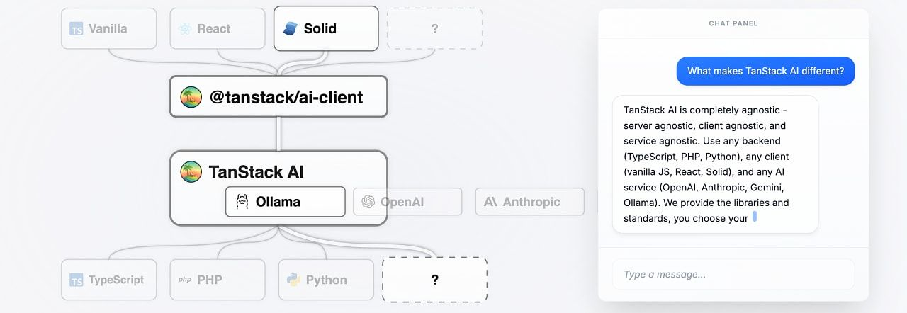
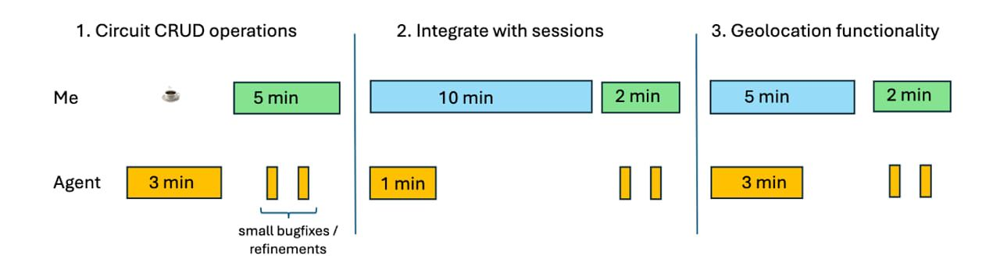

# What's the story? JavaScript's 30!

 

## 🎉  JavaScript Turns 30 Years Old  🎉

Back in May 1995, a 33 year old Brendan Eich [built the first prototype of JavaScript in just ten days](https://arstechnica.com/gadgets/2025/12/in-1995-a-netscape-employee-wrote-a-hack-in-10-days-that-now-runs-the-internet/), originally codenamed _Mocha_ (and then _LiveScript_). On December 4, 1995, Netscape and Sun Microsystems [officially announced 'JavaScript' in a press release](https://web.archive.org/web/20070916144913/http://wp.netscape.com/newsref/pr/newsrelease67.html) as _"an easy-to-use object scripting language designed for creating live online applications that link together objects and resources on both clients and servers."_

Over thirty years, JavaScript has cemented its place at the heart of the Web platform, and more broadly in desktop apps, operating systems (e.g. Windows' use of React Native), mobile apps, and even [on microcontrollers.](https://www.espruino.com/)

Here's to another thirty years and, hopefully, the [resolution of the confusion and litigation around JavaScript's trademark.](https://javascript.tm/letter) C'mon, Larry, give us all a Xmas present we won't forget? 😅

_P.S. Enjoy finding the 1995 references in our special birthday montage above._

  
- [How to Ship Enterprise Auth, Identity, and Security Features](https://workos.com/?utm_source=cpjavascript&utm_medium=newsletter&utm_campaign=q42025 "workos.com") — Enterprise customers demand SSO, SCIM, RBAC, and audit logs that meet strict compliance standards. WorkOS offers developers a platform for shipping these features fast with a suite of easy-to-integrate APIs and a portal for streamlined customer onboarding. **_\--- WorkOS sponsor_**
  
- [Progress on TypeScript 7](https://devblogs.microsoft.com/typescript/progress-on-typescript-7-december-2025/ "devblogs.microsoft.com") — It’s been a quiet few months for the TypeScript project publicly, but behind the scenes they’ve been working hard on both TypeScript 6.0 and 7.0. v6.0 is going to be the final JavaScript-based release and act as a stepping stone to the native Go port (v7.0) which is already shaping up to be some 10x faster. **_\--- Daniel Rosenwasser (Microsoft)_**
  
- [Anthropic Acquires the Bun JavaScript Runtime](https://bun.com/blog/bun-joins-anthropic "bun.com") — It’s been an intense few years for [Bun](https://bun.sh/), the JavaScriptCore-powered JS/TS runtime. Anthropic, best known for its Claude LLMs, is betting on Bun for powering its Claude Code agentic development tool and more. Jarred tells the full Bun story here and reassures us Bun will remain open and become better than ever as a result. **_\--- Jarred Sumner_**

**IN BRIEF:**

- ⚠️ The React team has [announced a critical security vulnerability in React Server Components](https://react.dev/blog/2025/12/03/critical-security-vulnerability-in-react-server-components) which affects apps that support RSCs, [including (some) Next.js apps.](https://nextjs.org/blog/CVE-2025-66478)
- 🎄 The [Advent of Code](https://adventofcode.com/) is taking place right now with 12 days of puzzles to solve.
- If you prefer something more JavaScript specific, [AdventJS](https://adventjs.dev/) has some JavaScript-specific puzzles you can solve right in your browser.
- [Advent of Svelte](https://advent.sveltesociety.dev/2025) is sharing 25 different Svelte-related tips over the month.
- [WebGPU is now supported across all major browsers.](https://web.dev/blog/webgpu-supported-major-browsers)

**RELEASES:**

- [Vite 8 Beta](https://vite.dev/blog/announcing-vite8-beta) – Now powered by Rolldown and promising significantly faster production builds and a better platform for future development.
- [Oxfmt: Oxc Formatter Alpha](https://oxc.rs/blog/2025-12-01-oxfmt-alpha) – A Rust-powered, Prettier-compatible code formatter.
- [ESLint v10.0.0 Alpha 1](https://eslint.org/blog/2025/11/eslint-v10.0.0-alpha.1-released/)

## 📖  Articles and Videos

  
- [No More Tokens: Locking Down `npm` Publishing Workflows](https://www.zachleat.com/web/npm-security/ "www.zachleat.com") — Following a recent spate of npm security incidents, Zach, creator of [11ty](https://www.11ty.dev/), carried out an audit of his npm security footprint and shares some tips we can all use. **_\--- Zach Leatherman_**

> 💡 Liran Tal also shares [some npm security best practices](https://snyk.io/articles/npm-security-best-practices-shai-hulud-attack/) to adopt.

  
- [The Nuances of JavaScript Typing using JSDoc](https://thathtml.blog/2025/12/nuances-of-typing-with-jsdoc/ "thathtml.blog") — If you prefer JavaScript over TypeScript (and I know there are plenty of you!) but still want some of the benefit of types, JSDoc provides an interesting alternative. **_\--- Jared White_**
  
- [No Breakpoints, No `console.log` — Just AI & Time Travel](https://wallabyjs.com/?utm_source=cooperpress&utm_medium=javascriptweekly&utm_content=javascriptweekly "wallabyjs.com") — 15x faster TypeScript and JavaScript debugging than with breakpoints and console.log, upgrading your AI agent into an expert debugger with real-time context. **_\--- Wallaby Team sponsor_**
  
- [How Fast Can Browsers Process Base64 Data?](https://lemire.me/blog/2025/11/29/how-fast-can-browsers-process-base64-data/ "lemire.me") — Gigabytes per second on modern hardware in most cases, except for Firefox and Servo. **_\--- Daniel Lemire_**
  
- [Making a 'Drone Ambient Noise' Synthesizer in JavaScript](https://bs.stranno.su/drone-ambient-noise-synthesizer/ "bs.stranno.su") — An interesting look at a tool that turns any files into sound using the Web Audio API and granular synthesis. You can [try a live demo here.](https://bs.stranno.su/) **_\--- Stranno_**
  

- 📊 [Comparing AWS Lambda Arm vs x86 Performance Across Runtimes](https://chrisebert.net/comparing-aws-lambda-arm64-vs-x86_64-performance-across-multiple-runtimes-in-late-2025/) – Different versions of Node.js are put through their paces. Arm seems to be a big win vs x86 on Lambda. **_\--- Chris Ebert_**
- 📄 [Angular Pipes: Time to Rethink](https://medium.com/coreteq/angular-pipes-time-to-rethink-f616ec84fb8d) – We don’t see many high quality Angular articles these days, so this is a pleasure. **_\--- Vyacheslav Borodin_**
- 📄 [TypeScript Strictness is Non-Monotonic: How `strictNullChecks` and `noImplicitAny` Interact](https://huonw.github.io/blog/2025/12/typescript-monotonic/) **_\--- Huon Wilson_**
- 📄 [How to Test a Vue Composable with TypeScript](https://johnfraney.ca/blog/how-to-unit-test-a-vue-composable-with-typescript/) **_\--- John Franey_**
- 📄 [Category Theory for JavaScript Developers](https://ibrahimcesar.cloud/blog/category-theory-for-javascript-typescript-developers/) **_\--- Ibrahim Cesar_**

## 🛠 Code & Tools

  
- 🤖 [TanStack AI: A Unified Interface for LLM/AI Providers](https://tanstack.com/ai/latest "tanstack.com") — The latest member of the rapidly growing _TanStack_ family of libraries offers a unified, framework agnostic interface to multiple AI APIs, complete with streaming, and Zod schema inference. Currently in _alpha._ [GitHub repo.](https://github.com/tanstack/ai/) **_\--- TanStack_**

> 💡 Another newcomer is [TanStack Pacer](https://tanstack.com/pacer/latest) which offers framework-agnostic debouncing, throttling, rate limiting, queuing, and batching utilities.

  
- [Prototype AI-Powered React Apps Instantly with Agentic Postgres Free](https://www.tigerdata.com/blog/postgres-for-agents "www.tigerdata.com") — A Postgres built for rapid iteration: vector search, forks, PITR—free forever for developers + agents. **_\--- Tiger Data sponsor_**
  
- [Remend: Automatic Recovery of Broken Streaming Markdown](https://vercel.com/changelog/new-npm-package-for-automatic-recovery-of-broken-streaming-markdown "vercel.com") — Bring intelligent incomplete Markdown handling to your app, particularly useful if working with LLMs, say. It’s extracted from Vercel’s [Streamdown](https://github.com/vercel/streamdown) library, a drop-in replacement for `react-markdown`, designed for AI-powered streaming. **_\--- Hayden Bleasel (Vercel)_**
  
- [Tinybench 6.0: A Tiny, Simple Benchmarking Library](https://github.com/tinylibs/tinybench "github.com") — Uses whatever precise timing capabilities are available (e.g. `process.hrtime` or `performance.now`). You can then benchmark whatever functions you want, specify how long or how many times to benchmark for, and get a variety of stats in return – it runs across multiple runtimes. [GitHub repo.](https://github.com/tinylibs/tinybench) **_\--- Tinylibs_**
  
- [Ruby2JS: A Ruby to JavaScript Transpiler](https://www.ruby2js.com/ "www.ruby2js.com") — A transpiler aimed at keeping the resulting code looking ‘hand crafted’ rather than merely transpiled. Play with the live demo on the home page to get a feel for it. **_\--- Sam Ruby and Jared White_**
- [Chokidar 5.0](https://github.com/paulmillr/chokidar) – Efficient cross-platform file watching library for Node.js.
- [Prisma 7.1](https://github.com/prisma/prisma/releases/tag/7.1.0) – Popular ORM for Node.js and TypeScript.
- [Neutralinojs 6.4](https://neutralino.js.org/docs/release-notes/framework#v640) – Lighter alternative to Electron.
- [Express v5.2.0](https://github.com/expressjs/express/releases/tag/v5.2.0) and [v5.2.1](https://github.com/expressjs/express/releases/tag/v5.2.1)

> **📰 CLASSIFIEDS**
> 
> [Still writing tests manually?](https://www.meticulous.ai/?utm_source=jsweekly&utm_medium=newsletter&utm_campaign=q4) See why modern engineering teams like Dropbox, Notion and Lattice rely on [Meticulous](https://www.meticulous.ai/?utm_source=jsweekly&utm_medium=newsletter&utm_campaign=q4) to run E2E UI tests.
> 
> ---
> 
> 🎨 [Try Pintura image editor for free today](https://pqina.nl/pintura/), add a polished cropping, rotating, and annotation experience to your web app in minutes.

## 📢  Elsewhere in the ecosystem

Some other interesting tidbits in the broader landscape:

- 🤖 Colin Eberhardt [looks into using GitHub's _Spec Kit_](https://blog.scottlogic.com/2025/11/26/putting-spec-kit-through-its-paces-radical-idea-or-reinvented-waterfall.html) for building a modern Svelte app using Spec-Driven Development (SDD) where the human and AI agents work in tandem.
- The team at DebugBear has [a review of web performance topics in 2025](https://www.debugbear.com/blog/2025-in-web-performance), including DevTools enhancements, changes to how TTFB, LCP, and INP are measured, and Firefox's support for the [Scheduler API.](https://developer.mozilla.org/en-US/docs/Web/API/Scheduler)
- Brian 'Beej' Hall, famous for his various [guides](https://beej.us/guide/) for things like [network programming](https://beej.us/guide/bgnet/) and [Git](https://beej.us/guide/bggit/), has released [Beej's Guide to Learning Computer Science.](https://beej.us/guide/bglcs/html/split/) It's high level and more about the mental models and philosophy of problem solving than any actual coding or math.
- [DepX's badge generator](https://depx.co/badge) gives you a graphical badge you can include in your README or on your project site to show how many (or how few!) dependencies your npm package has.
- Want to try and understand how elliptic curve cryptography works? [Here's an attempt at boiling it down.](https://avidthinker.github.io/2025/11/28/understanding-ecdsa/)
