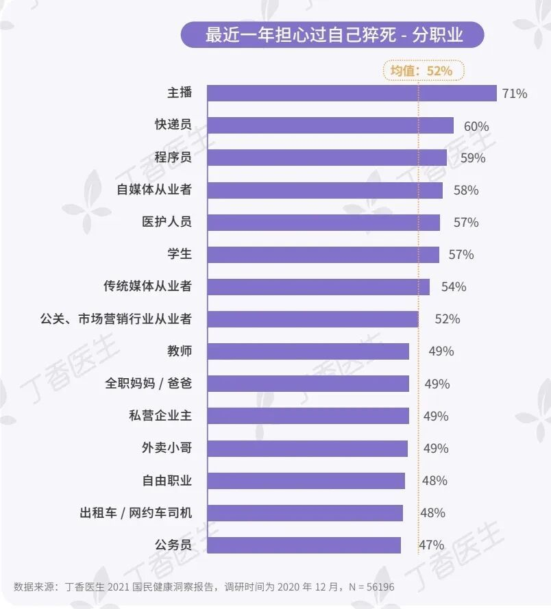

# 😲揪心！职业担心猝死排行榜，程序员排不进前二？

大家爱护好自己的身体，以下是一些小建议  
✅ 工作防护  
每工作 1 小时，起身活动 5 分钟（接水、拉伸、远眺）  
调整工位：显示器与视线平齐，椅子加护腰靠垫  
避免主动熬夜，每周熬夜不超过 2 次，尽量 22 点后停止高强度工作  
✅ 生活习惯  
每周 3-4 次中等强度运动（慢跑/游泳/骑行），每次 30 分钟以上  
少点高油高盐外卖，用坚果、水果代替奶茶、薯片  
保证每天 7-8 小时睡眠，尽量 23 点前入睡  
✅ 心理与预警  
拆解任务，避免“deadline 恐慌”带来的持续高压  
每年体检重点关注血压、血脂、心电图  
出现胸闷、心慌、持续头晕等症状立即就医  
长期高压时主动沟通调整工作节奏，必要时考虑换环境

广东,1月22日 14:06,

