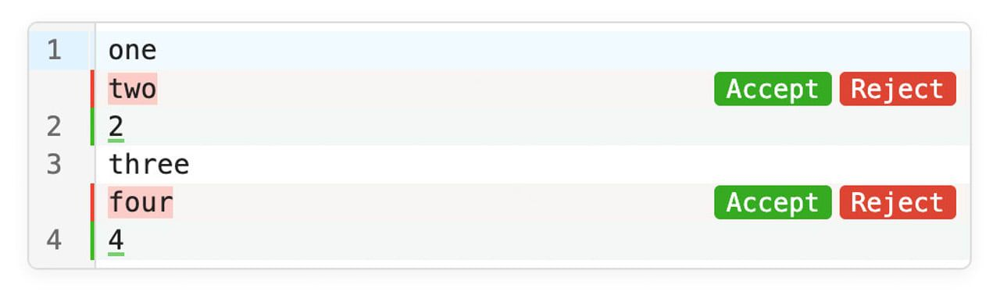

# Electrobun v1: Bun-powered desktop apps in 12MB bundles

  
- [TanStack Hotkeys: A Type-Safe, Cross-Platform Hotkey Library](https://javascriptweekly.com/link/180785/web "tanstack.com") — The [TanStack family](https://javascriptweekly.com/link/180786/web) gains a new member: _Hotkeys_, an alpha-stage universal keyboard interaction toolkit. It handles cross-environment quirks, supports multi-step sequences (like Vim commands or cheat codes), and can record user shortcuts. [Here's the full pitch.](https://javascriptweekly.com/link/180787/web) **_\--- TanStack LLC_**

> 💡 Being in alpha, the focus in the docs is on React for now, but it's not React only, and they're looking for help with Solid, Angular, Svelte, and Vue adapters.

  
- [Still Writing Tests Manually? Meticulous AI Is Here](https://javascriptweekly.com/link/180784/web) — Notion, Dropbox, Wiz, and LaunchDarkly have found a new testing paradigm - and they can't imagine working without it. Built by ex-Palantir engineers, Meticulous autonomously creates a continuously evolving suite of E2E UI tests that delivers near-exhaustive coverage with zero developer effort. **_\--- Meticulous sponsor_**
  
- [Announcing TypeScript 6.0 Beta](https://javascriptweekly.com/link/180788/web "devblogs.microsoft.com") — v6.0 is largely a _“time to clean up your tsconfig”_ release, designed to bridge the transition to the [Go-powered native TypeScript 7](https://javascriptweekly.com/link/180789/web) later this year. Be aware of some tweaks, like `types` defaulting to `[]` and `--strict` now being true by default, among [many more breaking changes and deprecations.](https://javascriptweekly.com/link/180790/web) **_\--- Microsoft_**

**IN BRIEF:**

- 📊 Hot on the heels of the recent State of JS survey results come the [_State of React_ results.](https://javascriptweekly.com/link/180791/web)
- 🤖 [Google shows off a preview of WebMCP](https://javascriptweekly.com/link/180792/web), an attempt to create a standard way for web sites to offer up abilities for AI agents to use.

**RELEASES:**

- [Biome 2.4](https://javascriptweekly.com/link/180793/web) – The formatting/linting tool can now handle embedded CSS & GraphQL in JS files, improves Vue and Svelte support, and adds HTML accessibility linting rules.
- [React Native 0.84](https://javascriptweekly.com/link/180794/web) – Hermes V1 is now the default JS engine on iOS and Android, iOS ships with precompiled binaries, and React 19.2.3.
- [Node.js 25.6.1 (Current)](https://javascriptweekly.com/link/180795/web) and [Node.js 24.13.1 (LTS)](https://javascriptweekly.com/link/180796/web)
- [sql.js v1.14.0](https://javascriptweekly.com/link/180797/web) – SQLite compiled to JavaScript.

## 📖  Articles and Videos

  
- [Experiments with CodeMirror](https://javascriptweekly.com/link/180798/web "aziis98.com") — [CodeMirror](https://javascriptweekly.com/link/180799/web) is one of the most robust code editor components out there _(we’ve just used it while rebuilding our newsletter editor!)_ and it’s very _extensible_ too, as seen in this walkthrough of building a VSCode-like ‘change review’ feature for it. **_\--- Antonio De Lucreziis_**
  
- [How to Make an HTTP Request in Node.js](https://javascriptweekly.com/link/180800/web "nodejsdesignpatterns.com") — A comprehensive guide to using `fetch` in production, tackling timeouts, streaming requests and responses, retries, concurrency, mocking, and more. Most of this is useful in the broader JavaScript context. **_\--- Luciano Mammino_**
  
- [One Database for Transactions and Analytics. No Pipelines](https://javascriptweekly.com/link/180801/web "www.tigerdata.com") — TimescaleDB extends Postgres so analytics runs on live data—no sync lag, no drift, no second system. [Try free](https://javascriptweekly.com/link/180801/web). **_\--- Tiger Data (creators of TimescaleDB) sponsor_**
  
- [Implementing Virtual Scrolling at Billion-Row Scale](https://javascriptweekly.com/link/180802/web "rednegra.net") — A walkthrough of tackling the numerous challenges involved in building a table component ([HighTable](https://javascriptweekly.com/link/180803/web)) that handles billions of rows. **_\--- Sylvain Lesage_**
  
- [JS-Heavy Approaches Aren't Compatible with Long-Term Performance Goals](https://javascriptweekly.com/link/180804/web "sgom.es") — A web performance engineer at Automattic makes the case against JS-heavy architectures and in support of a more server-centric approach. **_\--- Sérgio Gomes_**
  

- 📄 [Fun with TypeScript Generics](https://javascriptweekly.com/link/180805/web) – Not your typical entry-level tutorial but a dive into a niche use case. **_\--- Adam Rackis_**
- 📄 [Building Bulletproof React Components](https://javascriptweekly.com/link/180806/web) – Elegant, no-nonsense tips from the co-creator of [SWR](https://javascriptweekly.com/link/180807/web). **_\--- Shu Ding_**
- 📄 [How Rolldown Works: High-Performance Code Splitting with Bitset Logic](https://javascriptweekly.com/link/180808/web) **_\--- Atriiy_**
- 📄 [Angular Bindings: What Are They and How Do I Use Them?](https://javascriptweekly.com/link/180809/web) **_\--- Bo French_**

## 🛠 Code & Tools

  
- [Electrobun v1: A Bun-Based Desktop App Approach](https://javascriptweekly.com/link/180810/web "blackboard.sh") — An introduction to a cross-platform runtime for JS/TS desktop apps. It uses the OS’s default web renderer (like [Neutralinojs](https://javascriptweekly.com/link/180811/web)) with [Bun](https://javascriptweekly.com/link/180812/web) as the engine and bundler behind the scenes. The resulting bundles are as small as 12MB. ([Homepage](https://javascriptweekly.com/link/180837/web) and [GitHub repo.](https://javascriptweekly.com/link/180838/web)) **_\--- Blackboard_**

> 💡 Electrobun's creator [▶️ shows it off in this 4 minute video.](https://javascriptweekly.com/link/180813/web)

  
- [Console Ninja: Inline Logs & Smarter Debugging](https://javascriptweekly.com/link/180814/web "console-ninja.com") — See console output, runtime data, and errors next to your code, shared with your AI. Rethought, redesigned, and rebuilt in v2 for faster JavaScript debugging workflows. **_\--- Wallaby Team sponsor_**
  
- [fetch-network-simulator: Intercept `fetch` to Simulate Poor Network Conditions](https://javascriptweekly.com/link/180815/web "github.com") — The heart of this is a library that intercepts `fetch` and applies rules to do things like drop random requests, delay them, or slow them down, so you can see how resilient your app is. **_\--- Karn Pratap Singh_**
  
- [Peek: A Lightweight Library for Smart Page Header Behavior](https://javascriptweekly.com/link/180818/web "adesignl.github.io") — You can see it in action on the page. It’s “smart” in that it will differentiate between small insignificant scrolls and intentional ones. You can customize the thresholds and delays and it works with any framework. [Repo here](https://javascriptweekly.com/link/180819/web). **_\--- Chad Pierce_**
  
- 🏎️ [Rari: Runtime-Accelerated Rendering Infrastructure](https://javascriptweekly.com/link/180816/web "rari.build") — A React Server Components framework but with a Rust-powered server runtime, aiming for higher throughput and lower latency. The [getting started guide](https://javascriptweekly.com/link/180817/web) will help you get the idea. **_\--- Ryan Skinner_**
  
- [Broad Infinite List: A Bidirectional Infinite List for React and Vue](https://javascriptweekly.com/link/180820/web "suhaotian.github.io") — Smoothly stream logs, feed updates, or chat history in both directions without layout shifts. **_\--- suhaotian_**
- 📊 [Perspective 4.2](https://javascriptweekly.com/link/180821/web) – Interactive analytics and data viz component for large/streaming datasets.
- [Dockview 5.0](https://javascriptweekly.com/link/180822/web) – Zero dependency layout manager supporting tabs, groups, grids, and split views.
- ♟️ [Stockfish.js 18](https://javascriptweekly.com/link/180823/web) – A WASM port of the Stockfish chess engine you can use from JavaScript.
- [Ohm 17.5](https://javascriptweekly.com/link/180824/web) – Parsing toolkit for building parsers, interpreters, etc.

> **📰 CLASSIFIEDS**
> 
> 🔥[JSNation 2026 lineup:](https://javascriptweekly.com/link/180825/web) Matt Pocock, Luca Mezzalira & more speakers revealed! [Let’s talk modern web dev in beautiful Amsterdam this June](https://javascriptweekly.com/link/180825/web).
> 
> ---
> 
> 📸 Add robust 1D/2D barcode scanning to your web app with [STRICH](https://javascriptweekly.com/link/180826/web). Easy integration, simple pricing. [Free trial and demo app available](https://javascriptweekly.com/link/180826/web).

## 📢  Elsewhere in the ecosystem

- 🎨 Three years ago we linked to [DPaint.JS](https://javascriptweekly.com/link/180827/web), a web based image editor modeled after the legendary 1980s Amiga and PC graphics editor _Deluxe Paint_. Many side projects like this fizzle out, but not DPaint! [v0.2.0 has been released](https://javascriptweekly.com/link/180828/web) after two years with support for animations, pen support, texture brushes, and more.
- [almostnode](https://javascriptweekly.com/link/180829/web) is an experimental project that brings a Node.js runtime environment into the browser. The demo on the homepage is neat.
- 📊 Data from over 100,000 sites was boiled down into [this useful report on modern CSS usage.](https://javascriptweekly.com/link/180830/web) The median number of CSS rules per site was 2,802, with one page somehow using 210,695 rules!
- 🕹️ Not content to just [port Quake to run in the browser](https://javascriptweekly.com/link/180831/web), the creator of Three.js has now [attempted a _Descent_ port too](https://javascriptweekly.com/link/180832/web) ([source](https://javascriptweekly.com/link/180833/web)).
- 🤖 Can you [recreate something like SQLite with a swarm of agents?](https://javascriptweekly.com/link/180834/web) Kian Kyars had a try, as part of an agent coordination experiment.
- Cloudflare is rolling out [a feature to allow agents to fetch Markdown directly](https://javascriptweekly.com/link/180835/web) from Cloudflare-powered sites.
