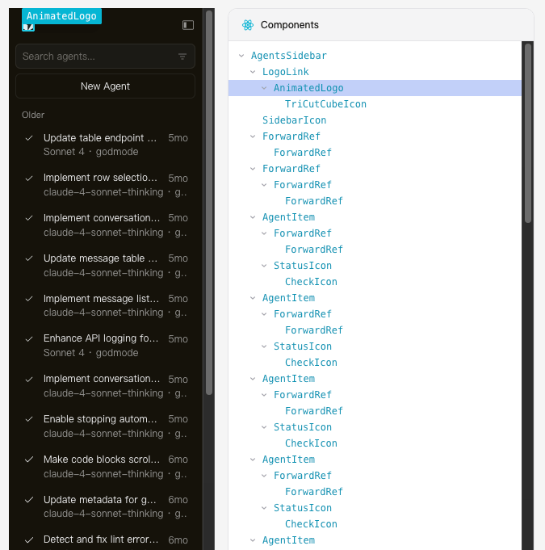
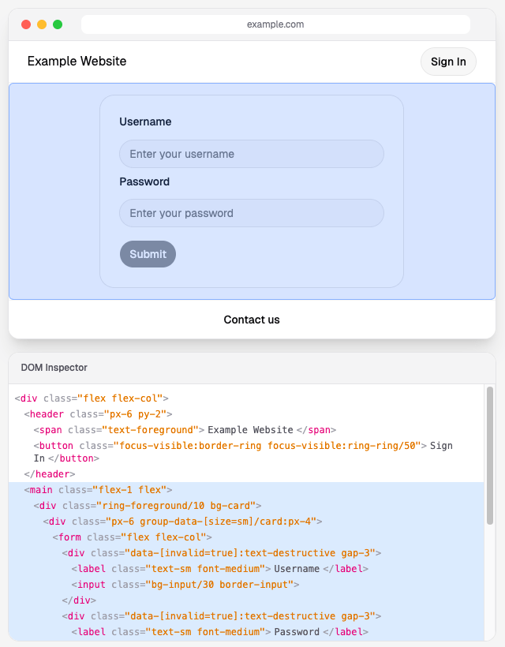
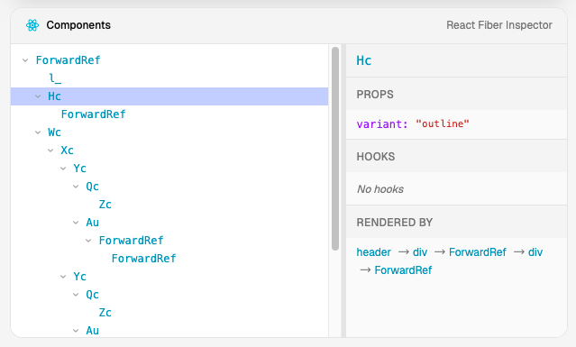
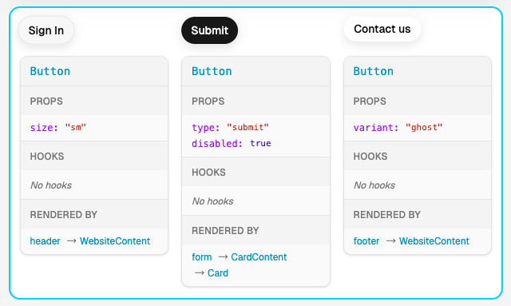
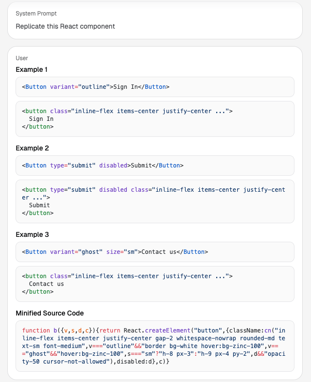
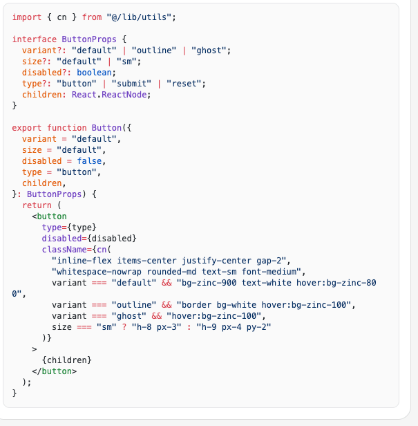
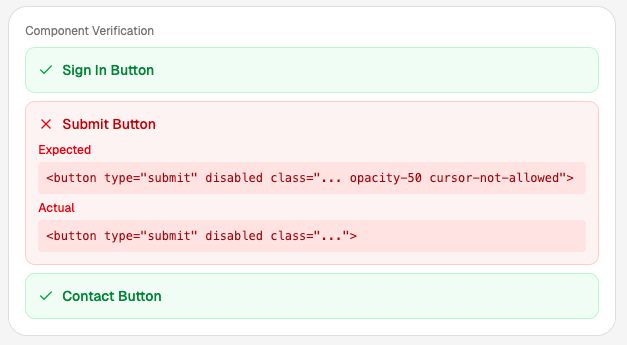
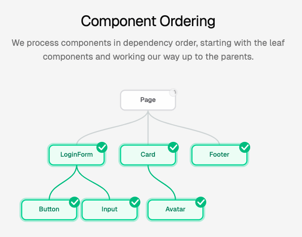
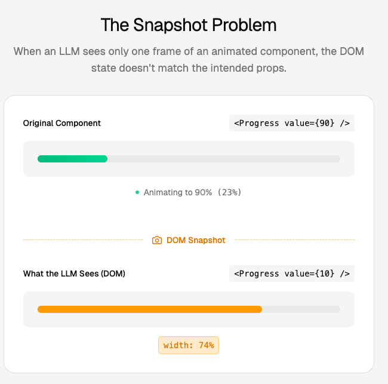
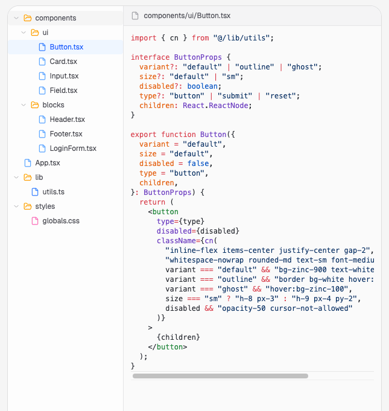

# 【第3645期】如何在没有源码的情况下重建任意 React 组件

前言

揭秘如何利用 React Fiber 和大语言模型（LLM），在浏览器端从运行中的网站中提取组件信息，并一步步重建出完整的 React 项目。今日前端早读课文章由 @David Fant 分享，@飘飘编译。

译文从这开始～～

我将向你展示如何在没有源码或仓库访问权限的情况下，从一个正在运行的 React 网站中 “获取” 任意组件 —— 只需要我们能在浏览器中打开该网站即可。比如，这里以 Cursor 网站的智能代理侧边栏为例。

通常情况下，你需要有源代码才能做到这一点。但事实是 ——React 在浏览器中其实留下了大量的线索，比你想象的还要多。如果我们能巧妙地收集这些信息，并把它们交给一个大语言模型（LLM），我们就能重建出原本的组件。

[【早阅】从Vibe Coding到Vibe Engineering：LLM时代开发者的生存法则](https://mp.weixin.qq.com/s?__biz=MjM5MTA1MjAxMQ==&mid=2651278216&idx=1&sn=a35f1a3a919a834c82c3e2e8faa1d8c4&scene=21#wechat_redirect)

接下来，我们就要来做这件事。等结束时，我们将通过 LLM 得到一个可运行的 React 组件。让我们从最基础的部分开始。

#### 第一部分：理解两棵 “树”

首先你需要明白一件事：当你在浏览器里查看一个 React 应用时，内存中实际上存在两棵树。

我们以当前这个网站为例。

**树 [#1](javascript:;)：DOM 树**

DOM 是浏览器对页面的表示结构，由 HTML 元素组成，比如 `div`、`button`、`span` 等。你可以在开发者工具的 “Elements” 标签页中看到它。这就是浏览器最终渲染到屏幕上的内容。

**树 [#2](javascript:;)：React Fiber 树**

React Fiber 是 React 内部维护的一棵树，是 React 自己的结构。它知道很多 DOM 不知道的事情，例如：

- 哪个 React 组件创建了哪些 DOM 元素
- 每个组件传入了哪些 props
- 组件的 state、hooks 等信息

更妙的是 —— 我们可以在浏览器中访问这些信息。React 会把 Fiber 节点直接附加到对应的 DOM 元素上。从 React 16 开始，任何 React 应用都会暴露这些数据，这也是 React Developer Tools 插件在底层所利用的机制。

因此，我们可以遍历 DOM，然后对每个元素问一句：“嘿，是哪个 React 组件创建了你？它当时收到了什么 props？”

这就是我们的切入点，也是我们窥探 React 应用内部结构的方法。

[【第3641期】AI 在编写 React 代码方面到底有多强？Addy Osmani的实战指南](https://mp.weixin.qq.com/s?__biz=MjM5MTA1MjAxMQ==&mid=2651278442&idx=1&sn=d5a2eae3672d1efbd822968c21d5df05&scene=21#wechat_redirect)

#### 第二部分：组件与输出的对应关系

接下来，想一想我们要如何重建一个组件。

假设页面上有一个 Button 组件，它被使用了三次：

- 顶部导航中的主按钮（primary）
- 表单中的禁用按钮（disabled）
- 底部的次要按钮（secondary）

它们都是同一个组件，但 props 不同，输出的 HTML 也不同。

我们要做的就是收集这些实例。对每一个实例，我们记录：

- 它接收的 props
- 它生成的 HTML

那我们怎么知道这些实例属于同一个组件呢？在 React Fiber 中，每个 fiber 节点都有一个 `type` 属性。对于组件实例来说，这个 `type` 指向它实际的函数或类对象 —— 也就是内存中的同一个引用。

因此，不论页面上有多少个 Button，只要它们属于同一个组件，它们的 `type` 都完全相同。我们就可以用这个来把它们分到同一个 “桶” 里。

#### 第三部分：让 LLM 帮我们重建组件

现在我们已经拥有了所有所需的信息。对于每种组件类型，我们收集到了：

- 多组 props → HTML 的对应示例
- 组件的压缩源码（通过 `type.toString()` 获取）

虽然压缩后的代码对人类来说不太可读，但 LLM 对这种代码的理解能力很强，能够从中提取组件的行为线索。而这些输入输出的示例又能让它更明确地理解组件的功能。

于是我们就可以这样向 LLM 提示：

> “这里有一个 React 组件。我会给你展示几个 props 与对应 HTML 输出的示例，请写出干净、可读的 React 代码来复现这个组件。”

通过这种方式，我们就能让 LLM 生成一个与原网站组件几乎一致的 React 实现。

#### 第四部分：验证循环（Verification Loop）

LLM 生成了一个组件，很棒！但我们怎么知道它是否正确？这是整个过程能否成功的关键步骤。

[【第3644期】构建类型安全的复合组件：让灵活与安全兼得的最佳实践](https://mp.weixin.qq.com/s?__biz=MjM5MTA1MjAxMQ==&mid=2651278480&idx=1&sn=e8e4caef1b2b3253b6922cd7cd30e483&scene=21#wechat_redirect)

我们会把 LLM 生成的组件拿来自己渲染，使用之前示例中的同一组 props，然后捕获它输出的 HTML。

接着进行对比：我们生成的 HTML 是否与原网站的 HTML 一致？

如果不一致，我们就把差异反馈给 LLM，说：

> “当我传入这些 props 时，你生成了这个 HTML，但原网站的输出是另一个 HTML。请修正你的代码。”

然后继续循环这个过程，直到输出一致为止，或者尝试几次后放弃。

这就像是从生产环境中自动推导出来的一组 “测试用例”。

#### 第五部分：顺序很重要（拓扑排序）

这里有一个非常重要的细节：

有些组件会包含其他组件。例如，一个 LoginForm 组件内部可能会渲染一个 Button；一个 Card 组件可能会包含一个 Avatar。

当我们要重建 LoginForm 时，必须先有一个可以正常工作的 Button，否则 LoginForm 就无法正确复现。

因此，我们需要按照依赖关系的顺序来处理组件。从最底层的叶子组件开始 —— 这些组件不会再包含其他自定义组件。然后再逐步向上构建父级组件。

这个过程其实就是对组件依赖图进行拓扑排序（topological sort）。

#### 第六部分：可能失败的情况

这种方法在很多情况下都有效，但也有一些例外。

[【第3635期】用 JavaScript + JSDoc + tsc，优雅取代 TypeScript 的最佳实践](https://mp.weixin.qq.com/s?__biz=MjM5MTA1MjAxMQ==&mid=2651278339&idx=1&sn=dbccbeb9b02e73028a780dc2543b8272&scene=21#wechat_redirect)

**问题一：JavaScript 动画**

比如一个进度条组件 `<Progress value={90} />`。如果我们在动画过程中截取了快照，DOM 中可能显示 `width: 67%`，而 props 却是 `value={90}`。

我们的 LLM 会正确生成一个 `value={90}` 对应 `width: 90%` 的组件，但这和当时的快照不匹配！原因是我们只对比了页面某一帧的静态状态，而原组件实际上在动画中。

**问题二：交互状态**

比如一个下拉菜单当前是展开的，或者一个弹窗正在显示。此时的 HTML 取决于组件内部的状态，而这些状态我们无法仅通过 props 获取。

**应对方案：**

当验证多次都失败时，我们就退而求其次 —— 直接保存当前的 HTML 快照。虽然这已经不是一个真正的可复用组件，而只是 “冻住” 的 HTML，但至少可以继续推进其他组件的重建工作。

#### 第七部分：组装最终组件

当我们重建完组件及其所有依赖后，就可以把它们组合成一个完整的组件。同时，我们还会复制：

- CSS 样式
- 资源文件（图片、字体等）

这样，我们最终就得到一个与原网站外观几乎一致、由重建组件构成的完整 React 项目。

### 总结回顾

整个过程可以归纳为以下几个步骤：

- 1、利用 React Fiber 来查看组件树内部结构
- 2、为每种组件类型收集多组 props → HTML 示例
- 3、使用 LLM 根据这些示例生成对应的 React 代码
- 4、通过渲染和对比验证输出是否正确
- 5、按依赖顺序自下而上地重建组件

核心洞察在于：React 为我们免费提供了结构信息。单纯的 DOM 只是堆叠的 div，但 React Fiber 告诉我们：“这三个按钮其实是同一个组件，只是 props 不同。”

正是这种结构，让 “反向工程” 成为可能。

它是否完美？当然不是。动画会破坏它，复杂状态会破坏它，有时 LLM 也无法完全推断逻辑。但对于相对静态的 UI 组件 —— 按钮、卡片、布局、表单等 —— 这种方法效果惊人地好。

关于本文  
译者：@飘飘  
作者：@David Fant  
原文：https://fant.io/react/

这期前端早读课  
对你有帮助，帮” 赞 “一下，  
期待下一期，帮” 在看” 一下。
